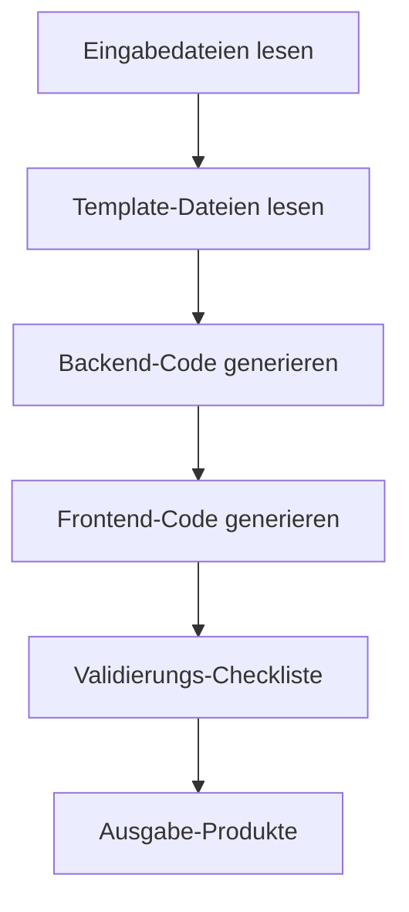

# Phase 5: Code - Generierung ausführbarer Code

## Was Sie nach Abschluss können

- **Ein-Klick-Generierung von Full-Stack-Code**: Automatische Generierung von ausführbaren Front- und Backend-Anwendungen aus UI-Schema und Tech-Design
- **Verständnis des Code-Generierungsprozesses**: Beherrschung, wie der Code Agent Entwurfsdokumente in produktionsbereiten Code umwandelt
- **Validierung der Codequalität**: Lernen Sie, die Vollständigkeit, Testabdeckung und Sicherheitsstandards des generierten Codes zu prüfen
- **Debugging häufiger Probleme**: Lösung von Abhängigkeitsinstallationen, Typprüfungen und API-Verbindungsproblemen

## Ihre aktuelle Herausforderung

Sie haben die Strukturierung der Produktidee, die PRD-Generierung, das UI-Design und das technische Architekturdesign abgeschlossen. Jetzt stehen Sie vor den größten Herausforderungen:

- **Wie verwandeln Sie Designs in Code**: UI-Schema und Tech-Design sind in Dokumenten, aber wie implementieren Sie sie?
- **Full-Stack-Entwicklung ist zu komplex**: Backend benötigt Express + Prisma, Frontend benötigt React Native – wo fangen Sie an?
- **Schwierige Qualitätssicherung**: Wie stellen Sie sicher, dass der generierte Code Tests, Dokumentation und Sicherheitsstandards hat?
- **Nicht genügend Zeit**: Die Entwicklung eines MVP dauert mehrere Tage – gibt es einen schnelleren Weg?

Die Phase Code wurde entwickelt, um genau diese Probleme zu lösen – sie generiert automatisch produktionsbereiten Full-Stack-Code basierend auf den Designs der vorangegangenen Phasen.

## Wann Sie diesen Ansatz verwenden

Wenn Sie:

- **Ideen schnell validieren möchten**: Validieren Sie Produktideen mit Code, anstatt direkt in die Entwicklung zu investieren
- **Anwendungsgerüste erstellen möchten**: Stellen Sie eine ausführbare Grundlage für die zukünftige Entwicklung bereit, anstatt bei Null anzufangen
- **Einheitlichen Technologie-Stack gewährleisten möchten**: Stellen Sie sicher, dass Front- und Backend-Code einer einheitlichen Architektur und den gleichen Standards folgt
- **Entwicklungszeit sparen möchten**: Vom Design zum Code – in wenigen Minuten das MVP-Framework

## Kernkonzept

Der Code Agent ist ein **Full-Stack-Ingenieur**, dessen Aufgabe es ist, Entwurfsdokumente der vorangegangenen Phasen in ausführbaren Code umzuwandeln. Seine Kernmerkmale:

### Eingabe und Ausgabe

| Typ | Inhalt |
|------|------|
| **Eingabe** | UI-Schema (Benutzeroberflächenstruktur), Tech-Design (technische Lösung), Prisma-Schema (Datenmodell) |
| **Ausgabe** | `artifacts/backend/` (Backend-Code), `artifacts/client/` (Frontend-Code) |

### Technologie-Stack

| Bereich | Technologie-Stack |
|------|--------|
| **Backend** | Express + Prisma + TypeScript |
| **Frontend** | React Native Web + Expo + TypeScript |
| **Datenbank** | SQLite (Entwicklung) / PostgreSQL (Produktion) |

### Ausführungsbeschränkungen

::: warning Strikter Umfang
Der Code Agent **implementiert nur** die Funktionen, die im PRD und UI-Schema bestätigt sind. Er **fügt nicht hinzu**:
- Authentifizierungs- und Autorisierungssysteme
- Komplexe Zustandsverwaltung (wie Redux)
- Nicht-Kern-Funktionsmerkmale
:::

## Lernen Sie mit

### Schritt 1: Eintritt in die Code-Phase

Angenommen, Sie haben die Tech-Phase abgeschlossen und möchten jetzt mit der Code-Generierung beginnen.

```bash
# Wenn Sie sich in der Pipeline befinden, gehen Sie direkt zur nächsten Phase
factory run code

# Oder starten Sie von einer bestimmten Phase neu
factory run code
```

**Was Sie sehen sollten**: Die CLI zeigt Informationen zur Code-Phase an, einschließlich Eingabedateien und erwarteter Ausgabe.

### Schritt 2: AI-Assistent führt Code Agent aus

Der AI-Assistent lädt `agents/code.agent.md` und `skills/code/skill.md` und beginnt mit der Ausführung.

Der Ausführungsablauf des Code Agent:



**Was der AI-Assistant tun wird**:

1. **Template-Dateien lesen** (`skills/code/references/backend-template.md` und `frontend-template.md`)
   - Verständnis der Projektstruktur und Code-Organisation
   - Lernen, wie Verzeichnisse und Konfigurationsdateien organisiert werden

2. **Eingabedateien analysieren**
   - Verständnis der Seitenstruktur und Komponenten aus `ui.schema.yaml`
   - Verständnis der technischen Architektur und API-Designs aus `tech.md`
   - Verständnis des Datenmodells aus `schema.prisma`

3. **Backend-Code generieren**
   - Erstellung der Express + Prisma-Projektstruktur
   - Generierung von API-Routen und Controllern
   - Implementierung der Datenvalidierung und Fehlerbehandlung
   - Hinzufügen von Tests und Dokumentation

4. **Frontend-Code generieren**
   - Erstellung der React Native + Expo-Projektstruktur
   - Generierung von Seitenkomponenten und UI-Komponenten
   - Implementierung der Datenzustandsverwaltung und API-Aufrufe
   - Hinzufügen von Tests und Navigationskonfiguration

5. **Validierungs-Checkliste**
   - Abgleich mit der Checkliste im Code Skill
   - Sicherstellen, dass alle Pflichtelemente abgeschlossen sind

6. **Ausgabe-Produkte**
   - Generierung der Verzeichnisse `artifacts/backend/` und `artifacts/client/`

### Schritt 3: Validierung des generierten Codes

Nach Abschluss des Code Agent wird eine vollständige Verzeichnisstruktur generiert.

**Backend-Verzeichnisstruktur**:

```
backend/
├── package.json          # Abhängigkeiten und Skripte
├── tsconfig.json         # TypeScript-Konfiguration
├── .env.example          # Umgebungsvariablen-Template
├── .gitignore            # Git-Ignore-Datei
├── README.md             # Projektbeschreibung
├── GETTING_STARTED.md    # Schnellstart-Anleitung
├── prisma/
│   ├── schema.prisma     # Datenmodell (aus der Tech-Phase kopiert)
│   └── seed.ts           # Seed-Daten
└── src/
    ├── index.ts          # Anwendungseinstieg
    ├── app.ts            # Express-Anwendungskonfiguration
    ├── config/           # Umgebungsvariablen-Konfiguration
    ├── lib/              # Prisma-Client
    ├── middleware/       # Fehlerbehandlung, Logging
    ├── routes/           # API-Routen
    ├── controllers/      # Controller
    ├── services/         # Geschäftslogik
    ├── validators/       # Eingabevalidierung (Zod)
    └── __tests__/        # Testdateien
```

**Frontend-Verzeichnisstruktur**:

```
client/
├── package.json          # Abhängigkeiten und Skripte
├── tsconfig.json         # TypeScript-Konfiguration
├── app.json              # Expo-Konfiguration
├── babel.config.js       # Babel-Konfiguration
├── .env.example          # Umgebungsvariablen-Template
├── .gitignore            # Git-Ignore-Datei
├── README.md             # Projektbeschreibung
├── GETTING_STARTED.md    # Schnellstart-Anleitung
├── App.tsx               # Anwendungseinstieg
└── src/
    ├── config/           # Umgebungsvariablen-Konfiguration
    ├── api/              # API-Client
    ├── components/       # UI-Komponenten
    ├── hooks/            # Custom Hooks
    ├── navigation/       # Navigationskonfiguration
    ├── screens/          # Seitenkomponenten
    ├── styles/           # Theme und Styles
    └── types/            # Typdefinitionen
```

**Kontrollpunkt ✅**: Bestätigen Sie, dass folgende Dateien vorhanden sind:

| Datei | Backend | Frontend |
|------|--------|----------|
| `package.json` | ✅ | ✅ |
| `tsconfig.json` | ✅ | ✅ |
| `.env.example` | ✅ | ✅ |
| `README.md` | ✅ | ✅ |
| `GETTING_STARTED.md` | ✅ | ✅ |
| Testdateien | ✅ | ✅ |
| Prisma Schema | ✅ | - |

### Schritt 4: Backend-Dienst starten

Befolgen Sie die Anleitung in `backend/GETTING_STARTED.md`, um den Dienst zu starten.

```bash
# Backend-Verzeichnis betreten
cd artifacts/backend

# Abhängigkeiten installieren
npm install

# Umgebungsvariablen konfigurieren
cp .env.example .env

# Datenbank initialisieren
npx prisma generate
npx prisma migrate dev
npm run db:seed

# Entwicklungsserver starten
npm run dev
```

**Was Sie sehen sollten**:

```
Server running on http://localhost:3000
Environment: development
Database connected
```

**Kontrollpunkt ✅**: Greifen Sie auf den Health-Check-Endpunkt zu, um den Dienst zu bestätigen.

```bash
curl http://localhost:3000/health
```

Sollte zurückgeben:

```json
{
  "status": "ok",
  "timestamp": "2024-01-29T12:00:00.000Z"
}
```

### Schritt 5: Frontend-Anwendung starten

Befolgen Sie die Anleitung in `client/GETTING_STARTED.md`, um die Anwendung zu starten.

```bash
# Öffnen Sie ein neues Terminal, betreten Sie das Frontend-Verzeichnis
cd artifacts/client

# Abhängigkeiten installieren
npm install

# Umgebungsvariablen konfigurieren
cp .env.example .env

# Entwicklungsserver starten
npm start
```

**Was Sie sehen sollten**: Metro Bundler startet und zeigt Ausführungsoptionen an.

```
› Metro waiting on exp://192.168.x.x:19000
› Scan the QR code above with Expo Go (Android) or the Camera app (iOS)
› Press a │ open Android
› Press i │ open iOS simulator
› Press w │ open web

Logs for your project will appear below.
```

Wählen Sie die Ausführungsplattform:
- Drücken Sie `w` - Öffnen im Browser (am einfachsten zum Testen)

**Kontrollpunkt ✅**: Die Anwendung kann im Browser geöffnet werden und zeigt die Frontend-Benutzeroberfläche an.

### Schritt 6: Frontend-Backend-Integration testen

1. **API-Dokumentation aufrufen**: http://localhost:3000/api-docs
   - Swagger UI-Dokumentation anzeigen
   - Bestätigen, dass alle Endpunkte definiert sind

2. **Frontend-Funktionalität testen**:
   - Neue Daten erstellen
   - Daten bearbeiten
   - Daten löschen
   - Listenaktualisierung

3. **Konsolenprotokolle prüfen**:
   - Gibt es API-Aufruffehler im Frontend?
   - Gibt es Anfrageprotokolle im Backend?
   - Gibt es unbehandelte Ausnahmen?

### Schritt 7: Kontrollpunkte bestätigen

Wenn der AI-Assistent bestätigt, dass die Code-Phase abgeschlossen ist, sehen Sie:

```
✅ Code-Phase abgeschlossen

Generierte Dateien:
- Backend: artifacts/backend/ (Express + Prisma + TypeScript)
- Frontend: artifacts/client/ (React Native + Expo + TypeScript)

Kontrollpunktoptionen:
[1] Weiter - Weiter zur Validation-Phase
[2] Wiederholen - Code neu generieren
[3] Pausieren - Aktuellen Status speichern
```

Wählen Sie **Weiter**, um zur nächsten Phase zu gelangen.

## Kontrollpunkte ✅

Nach Abschluss der Code-Phase sollten Sie:

- [ ] Backend-Code kann normal gestartet werden (`npm run dev`)
- [ ] Frontend-Anwendung kann im Browser geöffnet werden
- [ ] Health-Check-Endpunkt gibt normale Antwort zurück
- [ ] API-Dokumentation ist zugänglich (`/api-docs`)
- [ ] Frontend kann Backend-API aufrufen
- [ ] Frontend verarbeitet Loading- und Error-Zustände
- [ ] Testdateien sind vorhanden und können ausgeführt werden (`npm test`)

## Häufige Probleme

### Problem 1: Abhängigkeitsinstallation fehlgeschlagen

**Symptom**: `npm install` meldet Fehler

**Lösung**:

```bash
# Cache löschen und erneut versuchen
rm -rf node_modules package-lock.json
npm cache clean --force
npm install
```

### Problem 2: Prisma-Migration fehlgeschlagen

**Symptom**: `npx prisma migrate dev` meldet Fehler

**Lösung**:

```bash
# Datenbank zurücksetzen
npx prisma migrate reset

# Oder Datenbankdatei manuell löschen
rm prisma/dev.db
npx prisma migrate dev
```

### Problem 3: Frontend kann Backend nicht verbinden

**Symptom**: Frontend meldet `Network Error` oder `ECONNREFUSED`

**Checkliste**:

1. Bestätigen Sie, dass Backend gestartet ist: `curl http://localhost:3000/health`
2. Prüfen Sie die `.env`-Konfiguration des Frontends: `EXPO_PUBLIC_API_URL=http://localhost:3000/api`
3. Wenn Sie mit echtem Gerät testen, ändern Sie auf LAN-IP (z.B. `http://192.168.1.100:3000/api`)

### Problem 4: Tests fehlgeschlagen

**Symptom**: `npm test` meldet Fehler

**Lösung**:

- Bestätigen Sie, dass Testdateien vorhanden sind: `src/__tests__/`
- Prüfen Sie, ob Testabhängigkeiten installiert sind: `npm install --save-dev vitest @testing-library/react-native`
- Sehen Sie die Fehlermeldungen an und beheben Sie die Probleme im Code

## Spezielle Anforderungen des Code Agent

Der Code Agent hat einige besondere Einschränkungen und Anforderungen, die besonders beachtet werden müssen:

### 1. Template-Dateien müssen gelesen werden

Vor der Code-Generierung **muss der Code Agent vollständig lesen**:
- `skills/code/references/backend-template.md`
- `skills/code/references/frontend-template.md`

Diese beiden Template-Dateien zeigen die produktionsbereite Projektstruktur und Beispielcode.

### 2. Authentifizierung und Autorisierung verboten

::: warning Umfangsbeschränkung
Der Code Agent **verbietet strikt das Hinzufügen von**:
- Login/Registrierungsfunktionen
- Token-Authentifizierung
- Berechtigungssteuerung
- Komplexe Zustandsverwaltung (wie Redux)
:::

Diese Funktionen werden in zukünftigen Iterationen hinzugefügt. In der MVP-Phase konzentrieren wir uns nur auf die Kerngeschäftslogik.

### 3. Code-Qualitätsanforderungen

Der generierte Code muss folgende Anforderungen erfüllen:

| Anforderung | Beschreibung |
|------|------|
| **TypeScript** | Strikter Modus, kein `any`-Typ |
| **Tests** | Health-Check, CRUD-Endpunkte, Eingabevalidierungs-Tests |
| **API-Dokumentation** | Swagger/OpenAPI-Spezifikation (`/api-docs`) |
| **Fehlerbehandlung** | Einheitliche Fehlerbehandlungs-Middleware |
| **Logging** | Strukturiertes Logging (winston/pino) |
| **Sicherheit** | Zod-Validierung, helmet, CORS-Whitelist |
| **Dokumentation** | README und Schnellstart-Anleitung |

## Checkliste für Code-Generierung

Der Code Agent generiert Code unter Berücksichtigung folgender Checkliste.

### Backend-Pflichtelemente

- [ ] Umgebungsvariablen-Unterstützung (dotenv)
- [ ] Abhängigkeitsversionsfixierung (Prisma 5.x)
- [ ] Typdefinitionen (JSON-Feld-Verarbeitung)
- [ ] Kernabhängigkeiten: Express + Prisma + Zod + Helmet
- [ ] API-Endpunkte: Health-Check + CRUD
- [ ] Einheitliches Antwortformat
- [ ] Eingabevalidierung (Zod Schema)
- [ ] Fehlerbehandlungs-Middleware
- [ ] Testdateien (Health-Check + CRUD + Validierung)
- [ ] Swagger API-Dokumentation
- [ ] Seed-Daten (`prisma/seed.ts`)

### Frontend-Pflichtelemente

- [ ] Kernabhängigkeiten: React Native Web + Expo + React Navigation
- [ ] Persistenter Speicher (AsyncStorage)
- [ ] Navigationskonfiguration (React Navigation 6+)
- [ ] Sichere Bereiche (SafeAreaView)
- [ ] API-Client (Axios + Interceptors)
- [ ] Custom Hooks (Datenmanagement)
- [ ] Basis-UI-Komponenten (Button, Input, Card, Loading)
- [ ] Seitenkomponenten (mindestens Hauptseite und Detailseite)
- [ ] Loading- und Error-Zustandsbehandlung
- [ ] Pull-to-Refresh (RefreshControl)
- [ ] Testdateien (Seitenrendering + Komponenten + Hooks)

## Testen und Qualitätssicherung

Auch in der MVP-Phase generiert der Code Agent grundlegende Testcodes.

### Backend-Testbeispiel

```typescript
// src/__tests__/items.test.ts
import { describe, it, expect } from 'vitest';
import request from 'supertest';
import app from '../app';

describe('Items API', () => {
  it('should return health check', async () => {
    const res = await request(app).get('/health');
    expect(res.status).toBe(200);
  });

  it('should create a new item', async () => {
    const res = await request(app)
      .post('/api/items')
      .send({ title: 'Test Item', amount: 100 });

    expect(res.status).toBe(201);
    expect(res.body.data).toHaveProperty('id');
  });

  it('should reject invalid item', async () => {
    const res = await request(app)
      .post('/api/items')
      .send({ title: '' }); // Fehlendes Pflichtfeld

    expect(res.status).toBe(400);
  });
});
```

### Frontend-Testbeispiel

```typescript
// src/screens/__tests__/HomeScreen.test.tsx
import React from 'react';
import { render, screen } from '@testing-library/react-native';
import HomeScreen from '../HomeScreen';

describe('HomeScreen', () => {
  it('should render without crashing', () => {
    render(<HomeScreen />);
    expect(screen.getByText(/home/i)).toBeTruthy();
  });

  it('should show loading state initially', () => {
    render(<HomeScreen />);
    expect(screen.getByTestId('loading-indicator')).toBeTruthy();
  });
});
```

## Schnellstart-Anleitung

Jedes generierte Projekt enthält `GETTING_STARTED.md`, das Ihnen hilft, das Projekt innerhalb von 5 Minuten auszuführen.

### Backend-Schnellstart

```bash
# 1. Projekt klonen
cd artifacts/backend

# 2. Abhängigkeiten installieren
npm install

# 3. Umgebungsvariablen konfigurieren
cp .env.example .env

# 4. Datenbank initialisieren
npx prisma generate
npx prisma migrate dev
npm run db:seed

# 5. Dienst starten
npm run dev
```

### Frontend-Schnellstart

```bash
# 1. Projekt klonen
cd artifacts/client

# 2. Abhängigkeiten installieren
npm install

# 3. Umgebungsvariablen konfigurieren
cp .env.example .env

# 4. Anwendung starten
npm start
```

**Hinweis**: Stellen Sie sicher, dass das Backend bereits gestartet ist, sonst kann das Frontend die API nicht verbinden.

## Zusammenfassung dieser Lektion

Die Code-Phase ist eine der Kernphasen der Pipeline. Sie wandelt die Designs der vorangegangenen Phasen in ausführbaren Code um.

**Wichtige Punkte**:

1. **Eingabe und Ausgabe**: Der Code Agent generiert Front- und Backend-Code basierend auf UI-Schema, Tech-Design und Prisma-Schema
2. **Technologie-Stack**: Backend verwendet Express + Prisma, Frontend verwendet React Native Web + Expo
3. **Umfangssteuerung**: Implementieren Sie nur die Funktionen aus PRD und UI-Schema, fügen Sie keine Authentifizierung und Autorisierung hinzu
4. **Qualitätssicherung**: Generieren Sie Tests, API-Dokumentation und Schnellstart-Anleitungen
5. **Validierungsstandards**: Backend kann gestartet werden, Frontend kann gerendert werden, API kann aufgerufen werden

## Ausblick auf die nächste Lektion

> In der nächsten Lektion lernen wir die **[Validation-Phase](../stage-validation/)**.
>
> Sie werden lernen:
> - Wie Sie die Qualität des generierten Codes validieren
> - Abhängigkeitsinstallation und Typprüfung
> - Prisma-Schema-Validierung
> - Generierung von Validierungsberichten

---

## Anhang: Quellcode-Referenz

<details>
<summary><strong>Klicken Sie hier, um Quellcode-Positionen anzuzeigen</strong></summary>

> Aktualisiert am: 2026-01-29

| Funktion | Dateipfad | Zeilennummer |
|------|----------|------|
| Code Agent-Definition | [`agents/code.agent.md`](https://github.com/hyz1992/agent-app-factory/blob/main/agents/code.agent.md) | 1-82 |
| Code Skill | [`skills/code/skill.md`](https://github.com/hyz1992/agent-app-factory/blob/main/skills/code/skill.md) | 1-1488 |
| Backend-Template | [`skills/code/references/backend-template.md`](https://github.com/hyz1992/agent-app-factory/blob/main/skills/code/references/backend-template.md) | 1-670 |
| Frontend-Template | [`skills/code/references/frontend-template.md`](https://github.com/hyz1992/agent-app-factory/blob/main/skills/code/references/frontend-template.md) | 1-1231 |
| Pipeline-Definition | [`pipeline.yaml`](https://github.com/hyz1992/agent-app-factory/blob/main/pipeline.yaml) | 63-77 |

**Wichtige Einschränkungen**:
- Implementieren Sie nur Funktionen aus PRD und UI-Schema (`code.agent.md:25`)
- Verboten Sie das Hinzufügen von Authentifizierung, Autorisierung oder komplexer Zustandsverwaltung (`code.agent.md:28`)
- Lesen Sie Template-Dateien vollständig (`code/skill.md:1476`)
- Alle Datenbankoperationen durch Service-Schicht (`backend-template.md:665`)
- Alle Eingaben müssen durch Zod validiert werden (`backend-template.md:666`)

**Wichtige Checklisten**:
- Backend-Pflichtelemente: Umgebungsvariablen, Abhängigkeitsfixierung, Typdefinitionen (`code.agent.md:37-47`)
- Frontend-Pflichtelemente: Kernabhängigkeiten, Importpfade, Konfigurationsdateien (`code.agent.md:50-64`)
- Prävention häufiger Fehler (`code.agent.md:65-74`)

</details>
