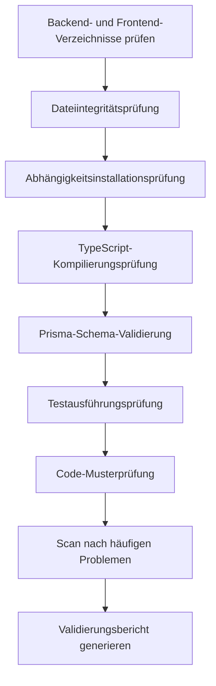

# Phase 6: Validation - Codequalität prüfen

## Was Sie nach dieser Lektion können

- **Automatische Codevalidierung**: Ein-Klick-Prüfung von Backend- und Frontend-Code auf Abhängigkeiten, Typisierung und grundlegende Tests
- **Validierungsberichte interpretieren**: Verständnis der detaillierten Berichte und Problemkategorisierung des Validation Agent
- **Probleme schnell lokalisieren**: Behebung von Codefehlern basierend auf spezifischen Positionen und Vorschlägen im Bericht
- **Codequalität sicherstellen**: Überprüfung, dass der generierte Code produktionsreife Standards erfüllt

## Ihr aktuelles Problem

Sie haben die Code-Phase abgeschlossen und Backend- und Frontend-Code generiert, aber das größte Problem ist:

- **Ob der Code läuft**: Sind alle Abhängigkeiten korrekt installiert? Ist die Typprüfung erfolgreich?
- **Ob Prisma korrekt ist**: Gibt es Syntaxprobleme im Schema? Kann der Client generiert werden?
- **Ob Tests zuverlässig sind**: Gibt es Tests? Bestehen sie?
- **Ob es Fallen gibt**: Ist die Umgebungsvariablenkonfiguration korrekt? Sind die Importpfade richtig?

Diese Probleme manuell zu überprüfen dauert lange und man übersieht leicht etwas. Die Validation-Phase wurde genau dafür entwickelt – sie validiert automatisch die Codequalität und generiert detaillierte Berichte.

## Wann diese Methode verwenden

Wenn Sie müssen:

- **Code schnell validieren**: Bestätigen, dass der generierte Code grundlegende Qualitätsstandards erfüllt
- **Potentielle Probleme entdecken**: Bevor Sie bereitstellen, Probleme mit Abhängigkeiten, Typen, Tests usw. finden
- **Codequalität sicherstellen**: Sicherstellen, dass Backend- und Frontend-Code grundlegende Prüfungen bestehen
- **Bereitstellungsfehler vermeiden**: Probleme frühzeitig erkennen und Nacharbeitskosten reduzieren

## Kernkonzept

Der Validation Agent ist ein **Qualitätsprüfer**, dessen Aufgabe es ist, zu überprüfen, ob der vom Code Agent generierte Code Qualitätsstandards erfüllt. Seine Kernmerkmale:

### Eingabe und Ausgabe

| Typ | Inhalt |
|-----|--------|
| **Eingabe** | `artifacts/backend/` (Backend-Code), `artifacts/client/` (Frontend-Code) |
| **Ausgabe** | `artifacts/validation/report.md` (Validierungsbericht) |

### Validierungsprüfungen

Der Validation Agent führt 8 Hauptprüfkategorien durch:

| Prüfung | Beschreibung |
|---------|--------------|
| **Dateiintegrität** | Bestätigt, dass alle erforderlichen Dateien vorhanden sind |
| **Abhängigkeitsinstallation** | Überprüft, ob `package.json`-Abhängigkeiten korrekt aufgelöst werden können |
| **TypeScript-Kompilierung** | Überprüft, ob Code die Typprüfung besteht |
| **Prisma Schema** | Validiert korrekte Syntax des Datenmodells |
| **Testausführung** | Bestätigt, dass Tests vorhanden sind und bestanden werden |
| **Codestandards** | Überprüft Lint-Skriptkonfiguration |
| **Schlüssel-Muster** | Scannt Code nach Schlüsselmustern (Fehlerbehandlung, Gesundheitsprüfung usw.) |
| **Häufige Probleme** | Erkennt bekannte Fehlermuster |

### Ausführungsbeschränkungen

::: warning Schreibgeschützter Modus
Der Validation Agent **validiert nur, modifiziert nicht**:
- Keine Änderung von Code-Dateien
- Keine tatsächliche Installation von Abhängigkeiten (verwendet `--dry-run`)
- Keine Ausführung von Befehlen mit Nebenwirkungen
:::

## Mach es mit mir

### Schritt 1: In die Validation-Phase eintreten

Angenommen, Sie haben die Code-Phase abgeschlossen und möchten jetzt die Codequalität prüfen.

```bash
# Wenn Sie in der Pipeline sind, gehen Sie direkt zur nächsten Phase
factory run validation

# Oder beginnen Sie neu von einer Phase
factory run validation
```

**Sie sollten sehen**: Die CLI zeigt Informationen zur Validation-Phase an, einschließlich Eingabedateien und erwarteter Ausgabe.

### Schritt 2: Der AI-Assistent führt den Validation Agent aus

Der AI-Assistent lädt `agents/validation.agent.md` und beginnt mit der Ausführung.

Der Ausführungsablauf des Validation Agent:



**Was der AI-Assistent tun wird**:

1. **Backend-Verzeichnis prüfen**
   - Bestätigt, dass `artifacts/backend/` existiert
   - Prüft erforderliche Dateien: `package.json`, `tsconfig.json`, `.env.example`, `prisma/schema.prisma`

2. **Frontend-Verzeichnis prüfen**
   - Bestätigt, dass `artifacts/client/` existiert
   - Prüft erforderliche Dateien: `package.json`, `tsconfig.json`, `app.json`, `App.tsx`

3. **Abhängigkeitsinstallationsprüfung**
   - Backend: `cd artifacts/backend && npm install --dry-run`
   - Frontend: `cd artifacts/client && npm install --dry-run`
   - Überprüft, ob Abhängigkeiten korrekt aufgelöst werden können

4. **TypeScript-Kompilierungsprüfung**
   - Backend: `cd artifacts/backend && npx tsc --noEmit`
   - Frontend: `cd artifacts/client && npx tsc --noEmit`
   - Überprüft, ob Code die Typprüfung besteht

5. **Prisma-Schema-Validierung**
   - `cd artifacts/backend && npx prisma validate`
   - Validiert korrekte Syntax des Datenmodells

6. **Testausführungsprüfung**
   - Backend: `cd artifacts/backend && npm test`
   - Frontend: `cd artifacts/client && npm test`
   - Bestätigt, dass Tests vorhanden sind und bestanden werden

7. **Code-Musterprüfung**
   - Scannt Schlüsselmuster: Fehlerbehandlung, Gesundheitsprüfung, SafeAreaView usw.
   - Überprüft Abhängigkeitskonfigurationen: dotenv, React Native Web usw.

8. **Scan nach häufigen Problemen**
   - SQLite verwendet `type`-Definitionen
   - Umgebungsvariablenwerte haben Anführungszeichen
   - Falsche Importpfade
   - Fehlende erforderliche Importe

9. **Validierungsbericht generieren**
   - Fasst alle Prüfergebnisse zusammen
   - Listet gefundene Probleme auf
   - Bietet Korrekturvorschläge
   - Speichert in `artifacts/validation/report.md`

### Schritt 3: Validierungsbericht anzeigen

Nach Abschluss des Validation Agent wird ein detaillierter Validierungsbericht generiert.

Öffnen Sie `artifacts/validation/report.md`:

```bash
cat artifacts/validation/report.md
```

**Sie sollten sehen**:

```markdown
# Codevalidierungsbericht

**Generierungszeit**: 2026-01-29 12:00:00
**Validierungsergebnis**: ✅ Bestanden

## Zusammenfassung

- Backend-Validierung: ✅
- Frontend-Validierung: ✅
- Gesamtbewertung: Codequalität entspricht MVP-Standards, kann in die Preview-Phase eintreten

---

## Backend-Validierungsdetails

### Dateiintegrität
| Datei | Status |
|-------|--------|
| package.json | ✅ |
| tsconfig.json | ✅ |
| .env.example | ✅ |
| prisma/schema.prisma | ✅ |
| src/index.ts | ✅ |
| src/app.ts | ✅ |

### Abhängigkeitsinstallation
- Status: ✅
- Details: Alle Abhängigkeiten können korrekt aufgelöst werden

### TypeScript-Kompilierung
- Status: ✅
- Fehleranzahl: 0

### Prisma-Validierung
- Status: ✅
- Details: Prisma-Schema-Syntax ist korrekt

### Testausführung
- Status: ✅
- Testanzahl: 12
- Bestandene: 12
| Fehlgeschlagene: 0

### Code-Musterprüfung
| Prüfung | Status |
|---------|--------|
| Fehlerbehandlung-Middleware | ✅ |
| Gesundheitsprüfung-Endpunkt | ✅ |
| Umgebungsvariablen-Nutzung | ✅ |
| Prisma Client-Import | ✅ |
| Testdatei vorhanden | ✅ |
| dotenv erste Zeile Import | ✅ |

---

## Frontend-Validierungsdetails

### Dateiintegrität
| Datei | Status |
|-------|--------|
| package.json | ✅ |
| tsconfig.json | ✅ |
| app.json | ✅ |
| App.tsx | ✅ |
| src/navigation/index.tsx | ✅ |

### Abhängigkeitsinstallation
- Status: ✅
- Details: Alle Abhängigkeiten können korrekt aufgelöst werden

### TypeScript-Kompilierung
- Status: ✅
- Fehleranzahl: 0

### Testausführung
- Status: ✅
- Testanzahl: 8
- Bestandene: 8
- Fehlgeschlagene: 0

### Code-Musterprüfung
| Prüfung | Status |
|---------|--------|
| SafeAreaView-Nutzung | ✅ |
| Loading-Komponente | ✅ |
| Fehlerbehandlung | ✅ |
| API-Aufruf-Wrapper | ✅ |
| React Native Web-Abhängigkeit | ✅ |
| async-storage-Abhängigkeit | ✅ |

---

## Gefundene Probleme

Keine kritischen Probleme oder Warnungen

---

## Korrekturvorschläge

Keine Korrekturen erforderlich

---

## Fazit

Codequalität entspricht MVP-Standards, Empfehlung für die Preview-Phase.
```

### Schritt 4: Umgang mit fehlgeschlagener Validierung

Wenn die Validierung fehlschlägt, listet der Bericht spezifische Probleme und Korrekturvorschläge auf.

**Beispiel: Teilweise bestandener Validierungsbericht**

```markdown
**Validierungsergebnis**: ⚠️ Teilweise bestanden

## Gefundene Probleme

### Kritische Probleme (müssen behoben werden)

1. TypeScript-Kompilierungsfehler
   - Position: src/controllers/items.ts:15
   - Fehler: Property 'title' does not exist on type 'any'
   - Vorschlag: Typdefinition hinzufügen `const item: Item = req.body;`

2. Prisma-Schema-Validierung fehlgeschlagen
   - Position: prisma/schema.prisma:10
   - Fehler: Invalid datasource provider 'sqlite'
   - Vorschlag: `provider = "sqlite"` zu `provider = "postgresql"` ändern (Produktionsumgebung)

### Warnungen (empfohlen zu beheben)

1. Fehlende Testdatei
   - Position: src/controllers/
   - Vorschlag: Für jeden Controller eine Testdatei hinzufügen

2. Unvollständige Umgebungsvariablenkonfiguration
   - Position: .env.example
   - Vorschlag: `DATABASE_URL`-Beispiel hinzufügen

## Korrekturvorschläge

1. TypeScript-Fehler beheben: Typdefinition in `src/controllers/items.ts` hinzufügen
2. Prisma-Schema aktualisieren: Datenquelle-Provider ändern
3. Testdateien hinzufügen: Tests für Controller schreiben
4. Umgebungsvariablen vervollständigen: `.env.example` ergänzen
```

**Korrekturschritte**:

1. **Problemdatei lokalisieren**
   ```bash
   # Problemdatei öffnen
   vim artifacts/backend/src/controllers/items.ts
   ```

2. **Code korrigieren**
   ```typescript
   // Typdefinition hinzufügen
   const item: Item = req.body;
   ```

3. **Prisma-Schema aktualisieren**
   ```prisma
   datasource db {
     provider = "postgresql"  // Zu postgresql ändern
     url      = env("DATABASE_URL")
   }
   ```

4. **Neu validieren**
   ```bash
   # Validation-Phase neu ausführen
   factory run validation
   ```

### Schritt 5: Checkpoint bestätigen

Wenn der AI-Assistent bestätigt, dass die Validation-Phase abgeschlossen ist, sehen Sie:

```
✅ Validation-Phase abgeschlossen

Generierte Dateien:
- Validierungsbericht: artifacts/validation/report.md

Validierungsergebnis: ✅ Bestanden / ⚠️ Teilweise bestanden / ❌ Fehlgeschlagen

Checkpoint-Optionen:
[1] Fortfahren - In die Preview-Phase eintreten
[2] Wiederholen - Code neu validieren
[3] Pausieren - Aktuellen Status speichern
```

- Wenn Validierung bestanden, wählen Sie **Fortfahren** zur nächsten Phase
- Wenn Probleme vorliegen, beheben Sie diese und wählen Sie **Wiederholen** zur Neuvalidierung
- Wenn Sie Zeit zur Korrektur benötigen, wählen Sie **Pausieren** um den aktuellen Status zu speichern

## Checkpoint ✅

Nach Abschluss der Validation-Phase sollten Sie:

- [ ] Alle erforderlichen Dateien für Backend und Frontend vorhanden sein
- [ ] Abhängigkeiten können korrekt aufgelöst werden (`npm install --dry-run`)
- [ ] TypeScript-Kompilierung ohne Fehler (`npx tsc --noEmit`)
- [ ] Prisma-Schema-Validierung bestanden (`npx prisma validate`)
- [ ] Testdateien vorhanden und bestanden (`npm test`)
- [ ] Alle Schlüsselmusterprüfungen bestanden
- [ ] Validierungsbericht generiert (`artifacts/validation/report.md`)

## Häufige Stolpersteine

### Problem 1: Abhängigkeitsinstallation fehlgeschlagen

**Symptom**: `npm install --dry-run` meldet Fehler

**Lösung**:

```bash
# package.json-Syntax prüfen
cat artifacts/backend/package.json

# Häufige Probleme:
# - Fehlende Anführungszeichen
# - Falscher Abhängigkeitsname
# - Falsches Versionsformat

# Nach Korrektur neu validieren
factory run validation
```

### Problem 2: TypeScript-Kompilierungsfehler

**Symptom**: `npx tsc --noEmit` meldet Fehler

**Häufige Fehlertypen**:

| Fehler | Ursache | Lösung |
|--------|---------|--------|
| `Property does not exist` | Typ nicht definiert | Typdefinition hinzufügen |
| `Module not found` | Falscher Importpfad | Importpfad prüfen |
| `Implicit any` | Impliziter any-Typ | Strikten Modus aktivieren und Typ hinzufügen |

### Problem 3: Prisma-Schema-Validierung fehlgeschlagen

**Symptom**: `npx prisma validate` meldet Fehler

**Häufige Fehler**:

| Fehler | Ursache | Lösung |
|--------|---------|--------|
| `Invalid datasource provider` | Falscher provider | `postgresql` oder `sqlite` verwenden |
| `Error parsing` | Syntaxfehler | Model-Definition prüfen |
| `Relation error` | Falsche Relationsdefinition | `@relation`-Felder prüfen |

### Problem 4: Testfehler

**Symptom**: `npm test` meldet Fehler

**Lösung**:

```bash
# Prüfen, ob Testdateien vorhanden sind
find artifacts/backend -name "*.test.ts"

# Prüfen, ob Testabhängigkeiten installiert sind
cat artifacts/backend/package.json | grep -A 5 "devDependencies"

# Wenn Testabhängigkeiten fehlen, manuell installieren
cd artifacts/backend
npm install --save-dev vitest @testing-library/react-native
```

### Problem 5: Schlüsselmusterprüfung fehlgeschlagen

**Symptom**: Bericht zeigt fehlende Schlüsselmuster

**Häufig fehlende Muster**:

| Muster | Position | Korrekturmethode |
|--------|----------|------------------|
| Fehlerbehandlung-Middleware | `src/middleware/error.ts` | Fehlerbehandlung-Middleware hinzufügen |
| Gesundheitsprüfung-Endpunkt | `src/routes/health.ts` | `/health`-Route hinzufügen |
| dotenv erste Zeile Import | `src/index.ts:1` | `import 'dotenv/config';` hinzufügen |
| SafeAreaView | `src/screens/Home.tsx` | Inhalt mit SafeAreaView umschließen |

## Besondere Anforderungen des Validation Agent

Der Validation Agent hat besondere Einschränkungen und Anforderungen, die Sie beachten müssen:

### 1. Schreibgeschützter Modus

::: warning Keine Code-Änderungen
Der Validation Agent **darf keinesfalls** Code-Dateien ändern, nur Validierung und Berichtgenerierung durchführen.
:::

### 2. Dry-run-Installation

Die Abhängigkeitsinstallationsprüfung verwendet den Parameter `--dry-run`, installiert keine tatsächlichen Abhängigkeiten:

```bash
npm install --dry-run  # Prüft nur, ob Abhängigkeiten aufgelöst werden können
```

### 3. Vollständiger Bericht

Der Validation Agent **muss** einen vollständigen Validierungsbericht generieren, einschließlich:

| Abschnitt | Inhalt |
|-----------|--------|
| **Zusammenfassung** | Backend/Frontend-Validierungsstatus und Gesamtbewertung |
| **Backend-Details** | Dateiintegrität, Abhängigkeiten, Kompilierung, Prisma, Tests, Musterprüfung |
| **Frontend-Details** | Dateiintegrität, Abhängigkeiten, Kompilierung, Tests, Musterprüfung |
| **Gefundene Probleme** | Liste kritischer Probleme und Warnungen |
| **Korrekturvorschläge** | Spezifische Korrekturschritte für Probleme |
| **Fazit** | Gesamtbewertung und Nächste-Schritte-Empfehlung |

### 4. Problemklassifizierung

Der Validation Agent klassifiziert Probleme in drei Stufen:

| Stufe | Kriterium | Behandlungsweise |
|-------|-----------|------------------|
| **Kritische Probleme** | Müssen behoben werden, um zu bestehen | Im Bericht als "muss behoben werden" markiert |
| **Warnungen** | Empfohlen zu beheben, aber nicht fatal | Im Bericht als "empfohlen zu beheben" markiert |
| **Informationen** | Nur zur Information | Beeinflusst das Validierungsergebnis nicht |

## Validierungsergebnis-Bewertung

Der Validation Agent bewertet den Validierungsstatus basierend auf den Prüfergebnissen.

### Bestanden-Bedingungen (✅ Bestanden)

- Alle erforderlichen Dateien vorhanden
- Keine Fehler bei Abhängigkeitsinstallation
- Keine Fehler bei TypeScript-Kompilierung
- Prisma-Schema-Validierung bestanden
- Grundlegende Tests vorhanden und alle bestanden
- Alle Schlüsselmusterprüfungen bestanden

### Teilweise bestanden-Bedingungen (⚠️ Teilweise bestanden)

- Erforderliche Dateien vorhanden
- Keine Fehler bei Abhängigkeitsinstallation
- TypeScript-Kompilierung hat Warnungen aber keine Fehler
- Tests vorhanden aber teilweise fehlgeschlagen (< 30% Fehlerquote)
- Nicht-kritische Probleme vorhanden

### Fehlgeschlagen-Bedingungen (❌ Fehlgeschlagen)

- Erforderliche Dateien fehlen
- Abhängigkeitsinstallation fehlgeschlagen
- TypeScript-Kompilierung hat Fehler
- Prisma-Schema-Validierung fehlgeschlagen
- Tests fehlen oder viele fehlgeschlagen (≥ 30% Fehlerquote)

## Codequalitäts-Checkliste

Der Validation Agent führt Validierung anhand der folgenden Checkliste durch.

### Backend-Erfordernisse

- [ ] `package.json` vorhanden
- [ ] `tsconfig.json` vorhanden
- [ ] `.env.example` vorhanden
- [ ] `prisma/schema.prisma` vorhanden
- [ ] `src/index.ts` vorhanden
- [ ] `src/app.ts` vorhanden
- [ ] `src/index.ts` erste Zeile dotenv-Import
- [ ] dotenv in dependencies enthalten
- [ ] Fehlerbehandlung-Middleware vorhanden
- [ ] Gesundheitsprüfung-Endpunkt vorhanden (`/health`)
- [ ] Umgebungsvariablen verwenden `process.env`
- [ ] Prisma Client-Import korrekt
- [ ] Mindestens eine Testdatei vorhanden
- [ ] package.json enthält `test`-Skript

### Frontend-Erfordernisse

- [ ] `package.json` vorhanden
- [ ] `tsconfig.json` vorhanden
- [ ] `app.json` vorhanden
- [ ] `App.tsx` vorhanden
- [ ] `src/navigation/index.tsx` vorhanden
- [ ] SafeAreaView-Nutzung vorhanden
- [ ] Loading-Komponente vorhanden
- [ ] Fehlerbehandlung vorhanden
- [ ] API-Aufrufe über Wrapper-Schicht
- [ ] React Native Web-Abhängigkeit enthalten
- [ ] async-storage-Abhängigkeit enthalten
- [ ] `app.json` referenziert keine nicht existierenden Bilddateien

## Scan nach häufigen Problemen

Der Validation Agent scannt folgende bekannte Problemmuster:

| Prüfung | Erkennungsmethode | Korrekturvorschlag |
|---------|-------------------|-------------------|
| SQLite verwendet `type`-Definitionen | Prüft, ob schema.prisma `type Xxx` enthält | `type`-Definition entfernen |
| Umgebungsvariablenwerte mit Anführungszeichen | Prüft, ob .env `="xxx"` oder `='xxx'` enthält | Anführungszeichen entfernen |
| Prisma-Version ist 7.x | Prüft, ob Prisma-Version in package.json ^7 ist | Prisma 5.x verwenden |
| Falsche Importpfade | Prüft, ob screens `from './ui/'` enthält | Zu `from '../components/ui/'` ändern |
| Fehlender View-Import | Prüft, ob Komponenten View verwenden, aber nicht importieren | `import { View } from 'react-native'` hinzufügen |
| Nicht abgeschlossene Zeichenfolgen | Prüft, ob .tsx-Dateien aufeinanderfolgende Anführungszeichen haben | Fehlende Anführungszeichen hinzufügen |

## Beispiele für Validierungsberichte

### Bestandener Validierungsbericht

```markdown
# Codevalidierungsbericht

**Generierungszeit**: 2026-01-29 12:00:00
**Validierungsergebnis**: ✅ Bestanden

## Zusammenfassung

- Backend-Validierung: ✅
- Frontend-Validierung: ✅
- Gesamtbewertung: Codequalität entspricht MVP-Standards, kann in die Preview-Phase eintreten

---

## Backend-Validierungsdetails

### Dateiintegrität
| Datei | Status |
|-------|--------|
| package.json | ✅ |
| tsconfig.json | ✅ |
| .env.example | ✅ |
| prisma/schema.prisma | ✅ |
| src/index.ts | ✅ |
| src/app.ts | ✅ |

### Abhängigkeitsinstallation
- Status: ✅
- Details: Alle Abhängigkeiten können korrekt aufgelöst werden

### TypeScript-Kompilierung
- Status: ✅
- Fehleranzahl: 0

### Prisma-Validierung
- Status: ✅
- Details: Prisma-Schema-Syntax ist korrekt

### Testausführung
- Status: ✅
- Testanzahl: 12
- Bestandene: 12
- Fehlgeschlagene: 0

### Code-Musterprüfung
| Prüfung | Status |
|---------|--------|
| Fehlerbehandlung-Middleware | ✅ |
| Gesundheitsprüfung-Endpunkt | ✅ |
| Umgebungsvariablen-Nutzung | ✅ |
| Prisma Client-Import | ✅ |
| Testdatei vorhanden | ✅ |
| dotenv erste Zeile Import | ✅ |

---

## Frontend-Validierungsdetails

### Dateiintegrität
| Datei | Status |
|-------|--------|
| package.json | ✅ |
| tsconfig.json | ✅ |
| app.json | ✅ |
| App.tsx | ✅ |
| src/navigation/index.tsx | ✅ |

### Abhängigkeitsinstallation
- Status: ✅
- Details: Alle Abhängigkeiten können korrekt aufgelöst werden

### TypeScript-Kompilierung
- Status: ✅
- Fehleranzahl: 0

### Testausführung
- Status: ✅
- Testanzahl: 8
- Bestandene: 8
- Fehlgeschlagene: 0

### Code-Musterprüfung
| Prüfung | Status |
|---------|--------|
| SafeAreaView-Nutzung | ✅ |
| Loading-Komponente | ✅ |
| Fehlerbehandlung | ✅ |
| API-Aufruf-Wrapper | ✅ |
| React Native Web-Abhängigkeit | ✅ |
| async-storage-Abhängigkeit | ✅ |

---

## Gefundene Probleme

Keine kritischen Probleme oder Warnungen

---

## Korrekturvorschläge

Keine Korrekturen erforderlich

---

## Fazit

Codequalität entspricht MVP-Standards, Empfehlung für die Preview-Phase.
```

### Fehlgeschlagener Validierungsbericht

```markdown
# Codevalidierungsbericht

**Generierungszeit**: 2026-01-29 12:00:00
**Validierungsergebnis**: ❌ Fehlgeschlagen

## Zusammenfassung

- Backend-Validierung: ❌
- Frontend-Validierung: ⚠️
- Gesamtbewertung: Backend hat kritische Probleme, müssen behoben werden bevor fortgefahren werden kann

---

## Gefundene Probleme

### Kritische Probleme (müssen behoben werden)

1. TypeScript-Kompilierungsfehler
   - Position: src/controllers/items.ts:15
   - Fehler: Property 'title' does not exist on type 'any'
   - Vorschlag: Typdefinition hinzufügen `const item: Item = req.body;`

2. Prisma-Schema-Validierung fehlgeschlagen
   - Position: prisma/schema.prisma:10
   - Fehler: Invalid datasource provider 'sqlite'
   - Vorschlag: `provider = "sqlite"` zu `provider = "postgresql"` ändern

3. Fehlende erforderliche Dateien
   - Position: src/
   - Datei: src/middleware/error.ts
   - Vorschlag: Fehlerbehandlung-Middleware erstellen

### Warnungen (empfohlen zu beheben)

1. Frontend-Tests fehlgeschlagen
   - Position: src/screens/__tests__/HomeScreen.test.tsx
   - Fehlgeschlagen: 2/8 Tests fehlgeschlagen
   - Vorschlag: Testfälle beheben

2. Fehlende Loading-Komponente
   - Position: src/components/
   - Vorschlag: Loading-Komponente erstellen und korrekt verwenden

---

## Korrekturvorschläge

1. TypeScript-Fehler beheben: Typdefinition in `src/controllers/items.ts` hinzufügen
2. Prisma-Schema aktualisieren: Datenquelle-Provider zu postgresql ändern
3. Fehlerbehandlung-Middleware erstellen: `src/middleware/error.ts` hinzufügen
4. Frontend-Tests beheben: Prüfen und fehlgeschlagene Testfälle korrigieren
5. Loading-Komponente erstellen: `src/components/Loading.tsx` hinzufügen

---

## Fazit

Backend hat kritische Probleme, müssen behoben werden bevor fortgefahren werden kann. Empfehlung:
1. TypeScript-Kompilierungsfehler beheben
2. Prisma-Schema aktualisieren
3. Fehlende Dateien hinzufügen
4. Validation-Phase neu ausführen
```

## Zusammenfassung dieser Lektion

Die Validation-Phase ist die Qualitätssicherungsstufe der Pipeline, die sicherstellt, dass der generierte Code grundlegende Qualitätsstandards erfüllt.

**Wichtige Punkte**:

1. **Validierungsablauf**: Der Validation Agent prüft automatisch Dateiintegrität, Abhängigkeiten, Kompilierung, Tests usw.
2. **Schreibgeschützter Modus**: Validiert nur, ändert nicht, verwendet `--dry-run` um Nebenwirkungen zu vermeiden
3. **Problemklassifizierung**: Teilt Probleme in kritisch, Warnungen, Informationen ein
4. **Detaillierter Bericht**: Generiert Validierungsbericht mit spezifischen Positionen und Korrekturvorschlägen
5. **Ergebnisbewertung**: Bewertet Bestanden/Teilweise bestanden/Fehlgeschlagen basierend auf Prüfergebnissen

## Vorschau auf die nächste Lektion

> In der nächsten Lektion lernen wir die **[Preview-Phase](../stage-preview/)** kennen.
>
> Sie lernen:
> - Wie Sie Installationsdokumentation generieren
> - Schnellstartanleitung
> - Bereitstellungskonfigurationen (Docker, CI/CD)

---

## Anhang: Quellcode-Referenz

<details>
<summary><strong>Klicken zum Anzeigen der Quellcode-Positionen</strong></summary>

> Aktualisiert: 2026-01-29

| Funktion | Dateipfad | Zeilen |
|----------|-----------|--------|
| Validation Agent Definition | [`agents/validation.agent.md`](https://github.com/hyz1992/agent-app-factory/blob/main/agents/validation.agent.md) | 1-320 |
| Pipeline-Definition | [`pipeline.yaml`](https://github.com/hyz1992/agent-app-factory/blob/main/pipeline.yaml) | 79-96 |

**Wichtige Einschränkungen**:
- Keine Änderung von Code-Dateien (`validation.agent.md:293`)
- Keine tatsächliche Abhängigkeitsinstallation, `--dry-run` verwenden (`validation.agent.md:294`)
- Vollständigen Validierungsbericht generieren (`validation.agent.md:296`)
- Spezifische Korrekturvorschläge bereitstellen (`validation.agent.md:298`)

**Validierungsprüfungen**:
- Dateiintegritätsprüfung (`validation.agent.md:24-42`)
- Abhängigkeitsinstallationsprüfung (`validation.agent.md:43-53`)
- TypeScript-Kompilierungsprüfung (`validation.agent.md:55-65`)
- Prisma-Schema-Validierung (`validation.agent.md:67-73`)
- Testausführungsprüfung (`validation.agent.md:75-85`)
- Code-Standardprüfung (`validation.agent.md:87-97`)
- Schlüsselmusterprüfung (`validation.agent.md:99-122`)
- Scan nach häufigen Problemen (`validation.agent.md:124-136`)

**Validierungsergebnis-Bewertung**:
- Bestanden-Bedingungen (`validation.agent.md:268-274`)
- Teilweise bestanden-Bedingungen (`validation.agent.md:276-281`)
- Fehlgeschlagen-Bedingungen (`validation.agent.md:283-288`)

**Ausführungsablauf**:
- Operationsschritte (`validation.agent.md:303-313`)
- Ausgabeformat (`validation.agent.md:139-262`)

</details>
