# 7-Stufen-Pipeline-Übersicht

## Was Sie nach dieser Lektion können

- Den vollständigen Ablauf der 7-Stufen-Pipeline und die Verantwortlichkeiten jeder Phase verstehen
- Die Eingaben, Ausgaben und Exit-Kriterien jeder Phase kennen
- Verstehen, wie das Checkpoint-Mechanismus die Qualität gewährleistet
- Verstehen, wie der Sisyphus-Scheduler die Agent-Ausführung koordiniert
- Die Berechtigungsmatrix beherrschen, die verhindert, dass Agenten ihre Befugnisse überschreiten
- Lernen, wie Sie mit "In neuer Sitzung fortsetzen" Tokens sparen können

## Grundidee

**Was ist eine Pipeline?**

Die Pipeline von AI App Factory ist eine automatisierte Produktionslinie, die Ihre Produktideen schrittweise in ausführbare Anwendungen verwandelt. Wie eine Fabrikationslinie durchläuft das Rohmaterial (Produktidee) 7 Bearbeitungsschritte (Phasen), um das Endprodukt (vollständige Anwendung) zu erzeugen.

Jede Bearbeitungsstufe wird von einem spezialisierten Agenten überwacht, der seine Aufgaben erfüllt, ohne die anderen zu stören:

| Phase | Agent | Verantwortung | Ausgabe |
| ----- | ----- | ---- | ---- |
| Bootstrap | Bootstrap Agent | Produktidee vertiefend ausarbeiten | `input/idea.md` |
| PRD | PRD Agent | Produktanforderungsdokument erstellen | `artifacts/prd/prd.md` |
| UI | UI Agent | Benutzeroberfläche und Prototyp entwerfen | `artifacts/ui/ui.schema.yaml` + Vorschauseite |
| Tech | Tech Agent | Technische Architektur entwerfen | `artifacts/tech/tech.md` + Prisma Schema |
| Code | Code Agent | Ausführbaren Code generieren | `artifacts/backend/` + `artifacts/client/` |
| Validation | Validation Agent | Codequalität verifizieren | `artifacts/validation/report.md` |
| Preview | Preview Agent | Deployment-Anleitung erstellen | `artifacts/preview/README.md` |

**Schlüsselfunktionen**

1. **Checkpoint-Mechanismus**: Nach jeder Phase wird angehalten und auf Ihre Bestätigung gewartet, bevor fortgefahren wird
2. **Berechtigungsisolierung**: Jeder Agent kann nur autorisierte Verzeichnisse lesen und schreiben, was Verunreinigungen verhindert
3. **Fehler-Rollback**: Bei Fehlschlagen einer Phase wird automatisch wiederholt; bei fortgesetzten Fehlern wird zum letzten erfolgreichen Checkpoint zurückgekehrt
4. **Kontextoptimierung**: Unterstützung der Fortsetzung in einer neuen Sitzung, um Tokens zu sparen

## Pipeline-Übersicht

```mermaid
graph LR
    A[Bootstrap<br/>Produktidee strukturieren] -->|idea.md| B[PRD<br/>Anforderungsdokument erstellen]
    B -->|prd.md| C[UI<br/>Benutzeroberfläche entwerfen]
    C -->|ui.schema.yaml| D[Tech<br/>Technische Architektur entwerfen]
    D -->|tech.md + schema.prisma| E[Code<br/>Ausführbaren Code generieren]
    E -->|backend + client| F[Validation<br/>Codequalität verifizieren]
    F -->|Validierungsbericht| G[Preview<br/>Deployment-Anleitung erstellen]
    
    style A fill:#e0f2fe
    style B fill:#f0fdf4
    style C fill:#fef3c7
    style D fill:#ede9fe
    style E fill:#fce7f3
    style F fill:#dbeafe
    style G fill:#d1fae5
```



**Ausführungsregeln der Pipeline**

::: tip Ausführungsregeln

1. **Strikte Reihenfolge**: Muss bei Bootstrap beginnen und nacheinander bis Preview ausgeführt werden, ohne Auslassungen oder Parallelisierung
2. **Einzel-Agent-Aktivierung**: Zu jedem Zeitpunkt kann nur ein Agent arbeiten
3. **Keine Rückverfolgung**: Bestätigte Artefakte können nicht geändert werden, nur erneute Ausführung der Phase ist möglich

Hinweis: Dies sind die Ausführungsregeln der Pipeline, nicht die Anzahl der Checkpoint-Optionen. Nach Abschluss jeder Phase bietet Sisyphus 5 Checkpoint-Optionen an (siehe unten "Checkpoint-Mechanismus"-Kapitel).

:::

## Detailbeschreibung der einzelnen Phasen

### Phase 1: Bootstrap - Produktidee strukturieren

**Was wird gemacht?**

Ihre natürlichsprachliche Produktbeschreibung wird in ein strukturiertes Dokument umgewandelt, um Probleme, Nutzer, Wert und Annahmen vertieft zu analysieren.

**Warum ist das wichtig?**

Eine klare Produktdefinition ist die Grundlage der gesamten Pipeline. Wenn dieser Schritt nicht gut gemacht wird, werden alle nachfolgenden Phasen vom Weg abweichen.

**Eingaben und Ausgaben**

| Typ | Pfad | Beschreibung |
| ---- | ---- | ---- |
| Eingabe | Natürlichsprachliche Nutzerbeschreibung | Zum Beispiel: "Ich möchte eine Ausgaben-App machen" |
| Ausgabe | `input/idea.md` | Strukturiertes Dokument zur Produktidee |

**Exit-Kriterien**

- [ ] `idea.md` existiert
- [ ] Beschreibt eine kohärente Produktidee
- [ ] Agent hat die `superpowers:brainstorm`-Fähigkeit verwendet, um vertieft zu analysieren

**Verpflichtende Fähigkeitsverwendung**

::: warning Verpflichtende Verwendung von superpowers:brainstorm

In der Bootstrap-Phase muss die `superpowers:brainstorm`-Fähigkeit verwendet werden, um vertieft zu analysieren. Wenn der Agent die Verwendung dieser Fähigkeit nicht erwähnt, wird das Artefakt abgelehnt und eine erneute Ausführung angefordert.

:::

### Phase 2: PRD - Produktanforderungsdokument erstellen

**Was wird gemacht?**

Die strukturierte Produktidee wird in ein MVP-Produktanforderungsdokument umgewandelt, das den Funktionsumfang, Nichtziele und User Stories klar definiert.

**Warum ist das wichtig?**

Das PRD ist der "Vertrag" zwischen Design und Entwicklung, der klarlegt, "was getan" und "was nicht getan" wird, um Scope Creep zu verhindern.

**Eingaben und Ausgaben**

| Typ | Pfad | Beschreibung |
| ---- | ---- | ---- |
| Eingabe | `input/idea.md` | Strukturierte Idee aus der Bootstrap-Phase |
| Ausgabe | `artifacts/prd/prd.md` | MVP-Produktanforderungsdokument |

**Exit-Kriterien**

- [ ] PRD enthält Zielbenutzer
- [ ] PRD definiert den MVP-Umfang
- [ ] PRD listet Nichtziele auf
- [ ] PRD enthält keine technischen Implementierungsdetails

**Achtung: PRD enthält keine technischen Details**

Das PRD sollte beschreiben, "was Benutzer brauchen", nicht "wie es implementiert wird". Technische Implementierungsdetails werden von den Phasen Tech und Code übernommen.

### Phase 3: UI - Benutzeroberfläche und Prototyp entwerfen

**Was wird gemacht?**

Basierend auf dem PRD wird die UI-Struktur, das Farbschema entworfen und ein im Browser vorschaubarer HTML-Prototyp generiert.

**Warum ist das wichtig?**

Visual Design ermöglicht es Teams und frühen Benutzern, die Produktform intuitiv zu verstehen und Entwicklungsaufwand zu reduzieren.

**Eingaben und Ausgaben**

| Typ | Pfad | Beschreibung |
| ---- | ---- | ---- |
| Eingabe | `artifacts/prd/prd.md` | PRD-Dokument |
| Ausgabe | `artifacts/ui/ui.schema.yaml` | UI-Strukturdefinition |
| Ausgabe | `artifacts/ui/preview.web/index.html` | Vorschaubarer HTML-Prototyp |

**Exit-Kriterien**

- [ ] `ui.schema.yaml` existiert
- [ ] Anzahl der Seiten überschreitet nicht 3
- [ ] Vorschauseite kann im Browser geöffnet werden
- [ ] Agent hat die `ui-ux-pro-max`-Fähigkeit verwendet

**Verpflichtende Fähigkeitsverwendung**

::: warning Verpflichtende Verwendung von ui-ux-pro-max

In der UI-Phase muss die `ui-ux-pro-max`-Fähigkeit verwendet werden, um ein professionelles Designsystem zu erstellen. Diese Fähigkeit enthält 67 Stile, 96 Farbpaletten und 100 Branchenregeln.

:::

### Phase 4: Tech - Technische Architektur entwerfen

**Was wird gemacht?**

Es wird eine minimal feasible technische Architektur und Datenmodell entworfen, der Tech-Stack ausgewählt und API-Endpunkte definiert.

**Warum ist das wichtig?**

Die technische Architektur bestimmt die Wartbarkeit, Erweiterbarkeit und Leistung des Codes. Überdesign führt zu Entwicklungsschwierigkeiten, Unterdessign kann Anforderungen nicht unterstützen.

**Eingaben und Ausgaben**

| Typ | Pfad | Beschreibung |
| ---- | ---- | ---- |
| Eingabe | `artifacts/prd/prd.md` | PRD-Dokument |
| Ausgabe | `artifacts/tech/tech.md` | Technische Architekturdokumentation |
| Ausgabe | `artifacts/backend/prisma/schema.prisma` | Prisma-Datenmodell |

**Exit-Kriterien**

- [ ] Tech-Stack ist klar deklariert
- [ ] Datenmodell ist mit PRD konsistent
- [ ] Keine vorzeitige Optimierung oder Overdesign wurde durchgeführt

**Standardwahl des Tech-Stacks**

- Backend: Node.js + Express + Prisma
- Datenbank: SQLite (Entwicklung) / PostgreSQL (Produktion)
- Frontend: React Native + Expo

### Phase 5: Code - Ausführbaren Code generieren

**Was wird gemacht?**

Basierend auf dem UI-Schema, dem Tech-Design und dem Prisma-Schema wird vollständiger Frontend- und Backend-Code mit Tests, Konfiguration und Dokumentation generiert.

**Warum ist das wichtig?**

Dies ist der entscheidende Schritt "von der Idee zur Anwendung", der generierte Code ist ausführbar und produktionsbereit.

**Eingaben und Ausgaben**

| Typ | Pfad | Beschreibung |
| ---- | ---- | ---- |
| Eingabe | `artifacts/ui/ui.schema.yaml` | UI-Strukturdefinition |
| Eingabe | `artifacts/tech/tech.md` | Technische Architekturdokumentation |
| Eingabe | `artifacts/backend/prisma/schema.prisma` | Datenmodell |
| Ausgabe | `artifacts/backend/` | Backend-Code (Express + Prisma) |
| Ausgabe | `artifacts/client/` | Frontend-Code (React Native) |

**Exit-Kriterien**

- [ ] Backend kann gestartet werden ohne schwerwiegende Fehler
- [ ] Client kann gerendert werden und ist zugänglich
- [ ] Keine zusätzliche Authentifizierung oder irrelevante Funktionen wurden eingeführt

**Generierte Inhalte**

Der Code-Agent generiert folgende Inhalte:

**Backend**:
- Express-Server + Routing
- Prisma ORM + Datenmodell
- Unit- und Integrationstests (Vitest)
- API-Dokumentation (Swagger/OpenAPI)
- Seed-Daten (`prisma/seed.ts`)
- Docker-Konfiguration
- Logging und Monitoring

**Frontend**:
- React Native-Seiten und Komponenten
- React Navigation-Routing
- Unit-Tests (Jest + React Testing Library)
- Umgebungskonfiguration

::: info Warum keine Authentifizierungsfunktionen generiert?

AI App Factory konzentriert sich auf MVP und generiert standardmäßig keine komplexen Funktionen wie Authentifizierung und Autorisierung. Diese können in nachfolgenden Iterationen hinzugefügt werden.

:::

### Phase 6: Validation - Codequalität verifizieren

**Was wird gemacht?**

Verifiziert, ob der generierte Code Abhängigkeiten korrekt installieren kann, Typ-Check bestanden und Code-Standards erfüllt.

**Warum ist das wichtig?**

Probleme vor der Ausführung des Codes zu finden, vermeidet Fehler nach der Deployment und spart Debugging-Zeit.

**Eingaben und Ausgaben**

| Typ | Pfad | Beschreibung |
| ---- | ---- | ---- |
| Eingabe | `artifacts/backend/` | Backend-Code |
| Eingabe | `artifacts/client/` | Frontend-Code |
| Ausgabe | `artifacts/validation/report.md` | Validierungsbericht |

**Exit-Kriterien**

- [ ] Validierungsbericht wurde generiert
- [ ] Backend-Abhängigkeiten können korrekt aufgelöst werden
- [ ] Frontend-Abhängigkeiten können korrekt aufgelöst werden
- [ ] TypeScript-Kompilierung ohne schwerwiegende Fehler
- [ ] Prisma-Schema-Verifizierung bestanden

**Validierungsinhalte**

Der Validation-Agent prüft:

1. **Abhängigkeitsauflösung**: Ist `npm install` erfolgreich?
2. **Typ-Check**: Bestanden `tsc --noEmit`?
3. **Code-Standards**: Entspricht es `policies/code-standards.md`?
4. **Prisma-Schema**: Bestanden `prisma validate`?
5. **Test-Durchlaufquote**: Existieren Tests und können sie ausgeführt werden?

**Fehlerbehandlung**

Wenn die Verifizierung fehlschlägt, generiert der Validation-Agent einen detaillierten Fehlerbericht, der auf spezifische Probleme und Lösungsvorschläge hinweist.

### Phase 7: Preview - Deployment-Anleitung erstellen

**Was wird gemacht?**

Alle Artefakte werden zusammengefasst, um vollständige Ausführungsanweisungen, Deployment-Konfigurationen und Demo-Prozess-Dokumentationen zu erstellen.

**Warum ist das wichtig?**

Dies ist der letzte Schritt der Pipeline, der es Ihnen ermöglicht, die generierte Anwendung schnell auszuführen und bereitzustellen.

**Eingaben und Ausgaben**

| Typ | Pfad | Beschreibung |
| ---- | ---- | ---- |
| Eingabe | `artifacts/backend/` | Backend-Code |
| Eingabe | `artifacts/client/` | Frontend-Code |
| Ausgabe | `artifacts/preview/README.md` | Vollständige Ausführungsanweisungen |
| Ausgabe | `artifacts/preview/GETTING_STARTED.md` | Schnellstart-Anleitung |

**Exit-Kriterien**

- [ ] README enthält Installationsanweisungen
- [ ] README enthält Ausführungsbefehle
- [ ] README listet Zugriffsadressen und Demo-Prozesse auf

**Generierte Inhalte**

Der Preview-Agent generiert:

- Lokale Ausführungsanweisungen (Web, iOS, Android)
- Docker-Deployment-Konfiguration (`docker-compose.yml`)
- CI/CD-Konfigurationsreferenz (GitHub Actions)
- Git Hooks-Konfigurationsreferenz (Husky)
- Datenbank-Migrationsanleitung (SQLite → PostgreSQL)

## Checkpoint-Mechanismus

**Was ist ein Checkpoint?**

Nach Abschluss jeder Phase wird die Pipeline angehalten, um Ihnen eine Liste der generierten Artefakte zu zeigen. Sie können bestätigen, ob sie Ihren Erwartungen entsprechen. Wenn nicht, können Sie "Wiederholen" oder "Nach Änderung erneut ausführen" wählen.

**Warum werden Checkpoints benötigt?**

- **Verhindert Fehlerakkumulation**: Frühe Probleme, die nicht in der aktuellen Phase gelöst werden, werden in nachfolgenden Phasen verstärkt
- **Gewährleistet Qualität**: Jede Phase stellt sicher, dass die Ausgabe den Erwartungen entspricht, um Generierung unbrauchbaren Codes zu vermeiden
- **Flexible Steuerung**: Sie können an einem beliebigen Checkpoint anhalten, wiederholen oder Eingaben ändern

**Checkpoint-Optionen**

Nach Abschluss jeder Phase zeigt der Sisyphus-Scheduler folgende Optionen an:

```
┌──────┬──────────────────────────────────────────────────────┐
│ Option │ Beschreibung                                          │
├──────┼──────────────────────────────────────────────────────┤
│  1   │ Nächste Phase fortsetzen (gleiche Sitzung)              │
│      │ Ich werde mit der [Nächste Phasenname]-Phase fortfahren│
├──────┼──────────────────────────────────────────────────────┤
│  2   │ In neuer Sitzung fortsetzen ⭐ Empfohlene Option, Tokens sparen │
│      │ Führen Sie in einem neuen Befehlsfenster aus: factory continue        │
│      │ (Startet automatisch ein neues Claude Code-Fenster und setzt die Pipeline fort)        │
├──────┼──────────────────────────────────────────────────────┤
│  3   │ Phase erneut ausführen                                 │
│      │ [Aktuelle Phasenname]-Phase erneut ausführen           │
├──────┼──────────────────────────────────────────────────────┤
│  4   │ Nach Änderung der Artefakte erneut ausführen           │
│      │ Ändern Sie [eine Eingabedatei] und führen Sie erneut aus│
├──────┼──────────────────────────────────────────────────────┤
│  5   │ Pipeline anhalten                                      │
│      │ Speichern Sie den aktuellen Fortschritt und setzen Sie später fort│
└──────┴──────────────────────────────────────────────────────┘
```

**Empfohlene Vorgehensweise**

::: tip Wählen Sie "In neuer Sitzung fortsetzen", um Tokens zu sparen

Nach Abschluss jeder Phase wird empfohlen, "In neuer Sitzung fortsetzen" (Option 2) zu wählen:

1. Führen Sie `factory continue` in einem neuen Befehlsfenster aus
2. Der Befehl startet automatisch ein neues Claude Code-Fenster
3. Jede Phase genießt einen sauberen Kontext und vermeidet Token-Akkumulation

:::

## Berechtigungsmatrix

**Warum wird Berechtigungsisolierung benötigt?**

Wenn Agenten beliebige Verzeichnisse lesen und schreiben könnten, könnte dies führen zu:

- Bootstrap Agent ändert versehentlich das bereits abgeschlossene PRD
- Code Agent löscht versehentlich das UI-Design
- Validation Agent ändert versehentlich Backend-Code

**Kompetenzgrenzen-Matrix**

Der Sisyphus-Scheduler prüft vor und nach der Ausführung jeder Phase die Berechtigungen des Agenten:

| Agent | Kann lesen | Kann schreiben |
| ----- | ------ | ------ |
| bootstrap | Keine | `input/` |
| prd | `input/` | `artifacts/prd/` |
| ui | `artifacts/prd/` | `artifacts/ui/` |
| tech | `artifacts/prd/` | `artifacts/tech/`, `artifacts/backend/prisma/` |
| code | `artifacts/ui/`, `artifacts/tech/`, `artifacts/backend/prisma/` | `artifacts/backend/`, `artifacts/client/` |
| validation | `artifacts/backend/`, `artifacts/client/` | `artifacts/validation/` |
| preview | `artifacts/backend/`, `artifacts/client/` | `artifacts/preview/` |

**Behandlung von Berechtigungsüberschreitungen**

Wenn ein Agent in ein nicht autorisiertes Verzeichnis schreibt, verschiebt der Sisyphus-Scheduler die Datei nach `artifacts/_untrusted/<stage-id>/`, hält die Pipeline an und berichtet.

::: warning Beispiel für Berechtigungsüberschreitung

Angenommen, der PRD-Agent schreibt in `artifacts/ui/ui.schema.yaml` (dies ist nicht sein Berechtigungsbereich), dann:

1. Verschiebt der Scheduler die Datei nach `artifacts/_untrusted/prd/ui.schema.yaml`
2. Hält die Pipeline an
3. Berichtet: Berechtigungsüberschreitung erkannt, bitte manuell bearbeiten

:::

## Fehlerbehandlung

**Was zählt als Fehlschlag?**

- Ausgabedateien fehlen
- Artefakte erfüllen nicht `exit_criteria`
- Agent hat in nicht autorisierte Verzeichnisse geschrieben
- Skriptfehler oder Eingabedateien können nicht gelesen werden

**Standard-Behandlungsstrategie**

1. **Automatische Wiederholung**: Jede Phase erlaubt eine automatische Wiederholung
2. **Fehlschlags-Archivierung**: Fehlgeschlagene Artefakte werden nach `artifacts/_failed/<stage-id>/` verschoben
3. **Pipeline anhalten**: Nach zwei aufeinanderfolgenden Fehlschlägen wird auf manuelle Eingriffe gewartet
4. **Rollback-Mechanismus**: Zurück zum letzten erfolgreichen Checkpoint und erneute Ausführung

::: tip Behandlung nach manueller Intervention

Wenn zwei aufeinanderfolgende Fehlschläge auftreten, können Sie:

1. Eingabedateien ändern (z. B. `input/idea.md`)
2. Agent-Prompt anpassen
3. Berechtigungsprobleme beheben
4. `factory run [stage]` ausführen, um von dieser Phase neu zu beginnen

:::

## Statusmanagement

**Statusdatei**

Der gesamte Status der Pipeline wird in `.factory/state.json` gespeichert, einschließlich:

```json
{
  "version": 1,
  "status": "waiting_for_confirmation",
  "current_stage": "prd",
  "completed_stages": ["bootstrap"],
  "started_at": "2026-01-29T10:00:00Z",
  "last_updated": "2026-01-29T10:30:00Z"
}
```

**Zustandsautomat**

| Status | Bedeutung | Auslöser |
| ---- | ---- | -------- |
| idle | Nicht gestartet | Warte auf `factory run` |
| running | Wird ausgeführt | Beginnt Ausführung eines Stages |
| waiting_for_confirmation | Wartet auf Bestätigung | Phase abgeschlossen |
| paused | Angehalten | Benutzer wählt anhalten |
| failed | Fehler, Eingriffe erforderlich | Aufeinanderfolgende Fehlschläge oder Berechtigungsüberschreitungen |

Nur der Sisyphus-Scheduler hat die Berechtigung, den Status zu aktualisieren.

## Häufige Fehler

### Häufiger Fehler 1: Bootstrap-Phase hat brainstorm-Fähigkeit nicht verwendet

**Phänomen**: Sisyphus lehnt `input/idea.md` ab, mit der Meldung "Es wurde erkannt, dass die superpowers:brainstorm-Fähigkeit nicht verwendet wurde".

**Ursache**: Der Bootstrap-Agent hat die `superpowers:brainstorm`-Fähigkeit nicht verwendet, um die Produktidee vertieft zu analysieren.

**Lösung**: Wählen Sie bei der Bestätigung der Artefakte "Phase erneut ausführen" und fordern Sie den Agenten ausdrücklich auf, die `superpowers:brainstorm`-Fähigkeit zu verwenden.

### Häufiger Fehler 2: UI-Phase Design ist durchschnittlich

**Phänomen**: Generierte UI-Designs sehen alle gleich aus, lila Gradienten, Inter-Schriftart.

**Ursache**: Der UI-Agent hat die `ui-ux-pro-max`-Fähigkeit nicht verwendet.

**Lösung**: Wählen Sie bei der Bestätigung der Artefakte "Phase erneut ausführen" und fordern Sie den Agenten ausdrücklich auf, die `ui-ux-pro-max`-Fähigkeit zu verwenden, und geben Sie eine klare ästhetische Richtung an (z. B. "Cyberpunk", "Minimalismus").

### Häufiger Fehler 3: Code-Phase hat Authentifizierungsfunktionen generiert

**Phänomen**: Der generierte Backend-Code enthält komplexe Funktionen wie JWT-Authentifizierung und Benutzeranmeldung.

**Ursache**: Der Code-Agent hat den MVP-Umfang überschritten.

**Lösung**: Ändern Sie das PRD und listen Sie explizit "Nichtziele" auf (z. B. "Keine Benutzeranmeldung", "Keine Multi-User-Kollaboration"), dann führen Sie die Code-Phase erneut aus.

### Häufiger Fehler 4: Token-Verbrauch zu hoch

**Phänomen**: In späteren Phasen der Pipeline steigt der Token-Verbrauch drastisch an, die AI-Assistent-Reaktion wird langsamer.

**Ursache**: Mehrere Phasen werden in derselben Sitzung ausgeführt, der Kontext akkumuliert ständig.

**Lösung**: **Wählen Sie immer "In neuer Sitzung fortsetzen"** (Option 2), damit jede Phase einen sauberen Kontext hat.

## Zusammenfassung dieser Lektion

- Die Pipeline enthält 7 Phasen: Bootstrap → PRD → UI → Tech → Code → Validation → Preview
- Nach jeder Phase wird zur Bestätigung angehalten, um sicherzustellen, dass die Ausgabe den Erwartungen entspricht
- Der Sisyphus-Scheduler koordiniert die Agent-Ausführung, verwaltet Status und Berechtigungen
- Die Kompetenzgrenzen-Matrix verhindert, dass Agenten ihre Befugnisse überschreiten, und gewährleistet die Trennung der Verantwortlichkeiten
- Die Wahl von "In neuer Sitzung fortsetzen" kann Tokens erheblich sparen

## Vorschau auf die nächste Lektion

> In der nächsten Lektion lernen wir **[Claude Code-Integrationsleitfaden](../../platforms/claude-code/)**.
>
> Sie werden lernen:
> - Wie Sie Claude Code-Berechtigungen konfigurieren
> - Wie Sie die Pipeline ausführen
> - Best Practices für Claude Code

---

## Anhang: Quellcode-Referenz

<details>
<summary><strong>Klicken, um Quellcodepositionen anzuzeigen</strong></summary>

> Aktualisierungszeit: 2026-01-29

| Funktion | Dateipfad | Zeilennummer |
| --- | --- | --- |
| Pipeline-Definition | [`pipeline.yaml`](https://github.com/hyz1992/agent-app-factory/blob/main/pipeline.yaml) | 1-111 |
| Scheduler-Kern | [`agents/orchestrator.checkpoint.md`](https://github.com/hyz1992/agent-app-factory/blob/main/agents/orchestrator.checkpoint.md) | 1-302 |
| Projekt README | [`README.md`](https://github.com/hyz1992/agent-app-factory/blob/main/README.md) | 1-253 |

**Schlüsselkonstanten**:
- Pipeline-Modus: `checkpoint` (Checkpoint-Modus, Anhalten zur Bestätigung nach jeder Phase)

**Schlüssel-Agent-Definitionen**:
- **Bootstrap Agent**: Verwendet `superpowers:brainstorm`-Fähigkeit, generiert `input/idea.md`
- **PRD Agent**: Liest `input/idea.md`, generiert `artifacts/prd/prd.md`
- **UI Agent**: Verwendet `ui-ux-pro-max`-Fähigkeit, generiert `artifacts/ui/ui.schema.yaml` und Vorschauseite
- **Tech Agent**: Generiert `artifacts/tech/tech.md` und `artifacts/backend/prisma/schema.prisma`
- **Code Agent**: Generiert basierend auf UI, Tech, Schema `artifacts/backend/` und `artifacts/client/`
- **Validation Agent**: Verifiziert Codequalität, generiert `artifacts/validation/report.md`
- **Preview Agent**: Generiert `artifacts/preview/README.md`

</details>
