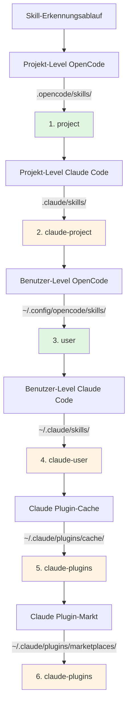

# Claude Code Skill-Kompatibilität

## Was Sie nach diesem Tutorial können

- Verstehen, wie Plugins automatisch mit dem Claude Code Skill-Format kompatibel sind
- Den Mechanismus zur Tool-Zuordnung beherrschen, damit Claude Skills in OpenCode korrekt funktionieren
- Die vollständigen Prioritätsregeln zur Skill-Erkennung verstehen
- Vorhandene Skills aus dem Claude Plugin-Markt wiederverwenden, ohne sie neu schreiben zu müssen

## Ihre aktuelle Situation

Sie haben bereits einige Claude Code Skills oder möchten Skills aus dem Claude Plugin-Markt verwenden, aber diese Skills wurden für Claude Code geschrieben. Die direkte Verwendung in OpenCode führt zu Problemen:

- Tool-Aufrufe in Claude Skills (z.B. `TodoWrite`, `Task`) existieren in OpenCode nicht
- Es ist unklar, wie OpenCode installierte Claude Plugin Skills finden kann
- Sorge, dass das Skill-Format inkompatibel ist und alles neu geschrieben werden muss

## Kerngedanke

Das OpenCode Agent Skills Plugin ermöglicht die nahtlose Verwendung von Claude Code Skills durch ein **dreistufiges Kompatibilitätssystem**, ohne Modifikationen:

1. **Automatische Erkennung** - Scannt Skills aus den Standard-Verzeichnissen von Claude Code (`.claude/skills/`, `~/.claude/plugins/`)
2. **Tool-Zuordnung** - Lädt beim Laden eines Skills automatisch eine Tool-Zuordnungsanleitung ein, die Claude-Toolnamen in OpenCode-Toolnamen umwandelt
3. **Format-Unterstützung** - Unterstützt gleichzeitig die v1- und v2-Installationsformate von Claude Plugins

::: info Wichtiges Konzept
**Claude Code Skill-Format** - Die von Anthropic definierte Skill-Spezifikation, die `SKILL.md`-Dateien zur Beschreibung von Skills verwendet, einschließlich YAML-Frontmatter (Metadaten) und Markdown-Inhalt (Anweisungen).
:::

### Prinzip der Tool-Zuordnung

Wenn das Plugin erkennt, dass ein für Claude Code geschriebenes Skill geladen wird, wird automatisch eine Tool-Zuordnungsanleitung injiziert:

| Claude Code Tool | OpenCode Tool | Zuordnungsregel |
| --- | --- | ---|
| `TodoWrite/TodoRead` | `todowrite/todoread` | Kleinbuchstaben |
| `Task` (Sub-Agent) | `task` (mit subagent_type Parameter) | Parameter verwenden |
| `Skill` | `use_skill` | Toolname ersetzen |
| `Read/Write/Edit/Bash/Glob/Grep/WebFetch` | `read/write/edit/bash/glob/grep/webfetch` | Kleinbuchstaben |

**Zuordnungsmethode**: Das Plugin injiziert die Zuordnungsanleitung als XML in den Sitzungskontext beim Laden des Skills, und die KI ruft automatisch die richtigen Tools entsprechend der Zuordnung auf.

::: tip Warum ist eine Zuordnung nötig?
Die Tool-Namenskonventionen von Claude Code und OpenCode unterscheiden sich. Claude verwendet PascalCase (z.B. `TodoWrite`), OpenCode verwendet Kleinbuchstaben (z.B. `todowrite`). Die Tool-Zuordnung ermöglicht es der KI zu wissen, wie Aufrufe umgewandelt werden müssen.
:::

### Priorität der Skill-Erkennung

Das Plugin entdeckt Skills in folgender Reihenfolge, und **die erste übereinstimmende Skill wird verwendet** (Skills mit gleichem Namen werden nicht dupliziert):



**Prioritätsregeln**:
- Projekt-Level Skills überschreiben Benutzer-Level Skills (für einfache Projekt-Anpassungen)
- OpenCode Skills haben Vorrang vor Claude Skills (um Verwirrung zu vermeiden)
- Skills mit gleichem Namen behalten nur die erste entdeckte Version bei

::: details Beispiel: Überschreiben von Skills mit gleichem Namen
Angenommen, Sie haben einen Skill namens `git-helper` an zwei Positionen:
- `.claude/skills/git-helper/SKILL.md` (Claude Version)
- `.opencode/skills/git-helper/SKILL.md` (OpenCode Version)

**Ergebnis**: Die OpenCode Version wird verwendet (höhere Priorität)
:::

## 🎒 Vorbereitung

- OpenCode Agent Skills Plugin ist installiert und konfiguriert
- Grundlegendes Verständnis von Skills (empfohlen: zuerst [Was ist OpenCode Agent Skills?](../../start/what-is-opencode-agent-skills/) lesen)
- (Optional) Bereits installierte Claude Code Plugins oder Skills

## Schritt-für-Schritt-Anleitung

### Schritt 1: Überprüfen, ob Claude Skills erkannt werden

**Warum**
Sicherstellen, dass das Plugin Ihre Claude Code Skill-Verzeichnisse korrekt scannen kann.

Rufen Sie in OpenCode das Tool auf:

```
get_available_skills()
```

**Sie sollten sehen**: Die zurückgegebene Skill-Liste enthält Skills aus `.claude/skills/`, `~/.claude/skills/`, `~/.claude/plugins/`, wobei das `source`-Feld der jeweiligen Skills die Quelle anzeigt (z.B. `claude-project`, `claude-user`, `claude-plugins`).

**Kontrollpunkt ✅**: Bestätigen Sie, dass die Liste die erwarteten Claude Skills enthält.

### Schritt 2: Einen Claude Skill laden

**Warum**
Überprüfen, ob der Tool-Zuordnungsmechanismus korrekt funktioniert.

Rufen Sie das Tool auf, um einen Claude Skill zu laden:

```
use_skill(skill="dein-skill-name")
```

**Sie sollten sehen**: Eine Erfolgsmeldung wird zurückgegeben, z.B. `Skill "xxx" loaded.`.

**Kontrollpunkt ✅**: Die KI kann jetzt die Anweisungen des Skills verwenden.

### Schritt 3: Überprüfen, ob die Tool-Zuordnung funktioniert

**Warum**
Bestätigen, dass die KI korrekt OpenCode Tools statt Claude Tools aufrufen kann.

Stellen Sie der KI eine Aufgabe, die Tools des Skills erfordert, z.B.:

```
Bitte verwenden Sie die Todo-Funktion im Skill, um mir eine Aufgabenliste zu erstellen.
```

**Sie sollten sehen**: Die KI ruft korrekt OpenCodes `todowrite` Tool auf, nicht Claudes `TodoWrite` Tool.

::: tip Wie verifiziert man, dass die Zuordnung funktioniert?
Überprüfen Sie die Tool-Aufruf-Logs der KI (wenn der Debug-Modus aktiviert ist). Sie werden sehen, dass `todowrite` anstelle von `TodoWrite` aufgerufen wird.
:::

**Kontrollpunkt ✅**: Tool-Aufruf erfolgreich, Aufgabe abgeschlossen.

## Häufige Fehlerquellen

### 1. Inkompatible Plugin-Formate

**Problem**: Alte Claude Plugins verwenden das v1-Format, neue das v2-Format, was dazu führt, dass einige Skills nicht erkannt werden.

**Ursache**: Die Struktur von `installed_plugins.json` unterscheidet sich zwischen v1 und v2.

**Lösung**: Das Plugin unterstützt beide Formate, keine manuelle Konvertierung erforderlich. Falls Skills dennoch nicht erkannt werden, überprüfen Sie, ob `~/.claude/plugins/installed_plugins.json` existiert und das richtige Format hat.

### 2. Tool-Zuordnung nicht aktiv

**Problem**: Die KI ruft immer noch Claude-Toolnamen auf, was zu Fehlern führt.

**Ursache**: Der Skill-Inhalt könnte die Tool-Zuordnungsanleitung umgangen haben oder verwendet hartkodierte Tool-Aufrufe.

**Lösung**:
- Stellen Sie sicher, dass der Skill nach dem Laden verwendet wird, nicht direkte Tool-Aufrufe
- Wenn der Skill Code-Beispiele enthält, ändern Sie die Toolnamen manuell in das OpenCode-Format

### 3. Namenskonflikte bei Skills

**Problem**: Skills mit gleichem Namen an verschiedenen Orten, es wird die falsche Version geladen.

**Ursache**: Die Priorität der Skill-Erkennung führt zu Überschreibungen.

**Lösung**:
- Überprüfen Sie das `source`-Feld des Skills, um die Quelle zu bestätigen
- Verwenden Sie das Namespace-Format, um die Quelle explizit anzugeben: `use_skill(skill="user:skill-name")` oder `use_skill(skill="claude-plugins:skill-name")`

::: details Namespace-Syntax
Das Plugin unterstützt das Format `namespace:skill-name`:
- `project:skill-name` - Projekt-Level OpenCode Skill
- `claude-project:skill-name` - Projekt-Level Claude Skill
- `user:skill-name` - Benutzer-Level OpenCode Skill
- `claude-user:skill-name` - Benutzer-Level Claude Skill
- `claude-plugins:skill-name` - Claude Plugin-Markt Skill
:::

## Zusammenfassung

Das OpenCode Agent Skills Plugin ermöglicht die nahtlose Wiederverwendung von Claude Code Skills durch ein dreistufiges Kompatibilitätssystem:

- **Automatische Erkennung** - Scannt Skills von 6 Positionen, abdeckend Projekt-Level, Benutzer-Level und Plugin-Level
- **Tool-Zuordnung** - Konvertiert automatisch Claude-Toolnamen in OpenCode-Toolnamen
- **Format-Unterstützung** - Unterstützt gleichzeitig v1- und v2-Claude-Plugin-Formate

Keine Neuimplementierung von Skills erforderlich, einfach installieren und verwenden – das Plugin behandelt Kompatibilitätsprobleme automatisch.

## Vorschau auf die nächste Lektion

> In der nächsten Lektion lernen wir **[Superpowers Workflow-Integration](../superpowers-integration/)** kennen.
>
> Sie werden lernen:
> - Wie man den Superpowers-Modus aktiviert
> - Automatische Erkennung und Ladung von Superpowers-Skills
> - Wie strikte Workflows die Entwicklungseffizienz steigern

---

## Anhang: Quellcode-Referenz

<details>
<summary><strong>Klicken Sie hier, um die Quellcode-Position anzuzeigen</strong></summary>

> Aktualisiert am: 2026-01-24

| Funktion | Dateipfad | Zeilen |
| --- | --- | ---|
| Tool-Zuordnungsdefinition | [`src/claude.ts`](https://github.com/joshuadavidthomas/opencode-agent-skills/blob/main/src/claude.ts#L19-L25) | 19-25 |
| v1/v2 Format-Typdefinitionen | [`src/claude.ts`](https://github.com/joshuadavidthomas/opencode-agent-skills/blob/main/src/claude.ts#L35-L61) | 35-61 |
| Plugin-Installationspfad-Extraktion | [`src/claude.ts`](https://github.com/joshuadavidthomas/opencode-agent-skills/blob/main/src/claude.ts#L68-L77) | 68-77 |
| Plugin-Skill-Erkennung | [`src/claude.ts`](https://github.com/joshuadavidthomas/opencode-agent-skills/blob/main/src/claude.ts#L82-L105) | 82-105 |
| Markt-Skill-Erkennung | [`src/claude.ts`](https://github.com/joshuadavidthomas/opencode-agent-skills/blob/main/src/claude.ts#L115-L180) | 115-180 |
| Cache-Skill-Erkennung | [`src/claude.ts`](https://github.com/joshuadavidthomas/opencode-agent-skills/blob/main/src/claude.ts#L193-L253) | 193-253 |
| Prioritätsliste der Skill-Erkennung | [`src/skills.ts`](https://github.com/joshuadavidthomas/opencode-agent-skills/blob/main/src/skills.ts#L241-L254) | 241-254 |
| Deduplizierungslogik für gleichnamige Skills | [`src/skills.ts`](https://github.com/joshuadavidthomas/opencode-agent-skills/blob/main/src/skills.ts#L256-L260) | 256-260 |
| toolTranslation Import | [`src/tools.ts`](https://github.com/joshuadavidthomas/opencode-agent-skills/blob/main/src/tools.ts#L15) | 15 |
| Tool-Zuordnungsinjektion | [`src/tools.ts`](https://github.com/joshuadavidthomas/opencode-agent-skills/blob/main/src/tools.ts#L238-L249) | 238-249 |

**Wichtige Konstanten**:
- `toolTranslation`: XML-String der Tool-Zuordnungsanleitung, der beim Laden des Skills in den Sitzungskontext injiziert wird. Definiert in `src/claude.ts:19-25`, importiert in `src/tools.ts:15`

**Wichtige Funktionen**:
- `getPluginInstallPaths()`: Extrahiert Plugin-Installationspfade aus v1/v2-Formaten
- `discoverSkillsFromPluginDir()`: Scannt das `skills/`-Unterverzeichnis des Plugin-Verzeichnisses
- `discoverMarketplaceSkills()`: Erkennt Skills aus `~/.claude/plugins/marketplaces/` (Priorität)
- `discoverPluginCacheSkills()`: Erkennt Skills aus `~/.claude/plugins/cache/` (Fallback)
- `findFile()`: Sucht rekursiv nach einem angegebenen Dateinamen (Hilfsfunktion)

**Wichtige Abläufe**:
1. Bei Plugin-Initialisierung wird `discoverAllSkills()` aufgerufen → durchläuft 6 Erkennungspfade
2. Bei Erkennung von Claude Plugin Skills wird `discoverMarketplaceSkills()` oder `discoverPluginCacheSkills()` aufgerufen
3. Beim Laden des Skills fügt das `use_skill`-Tool `toolTranslation` in den XML-Inhalt ein (Zeile 244)

</details>
