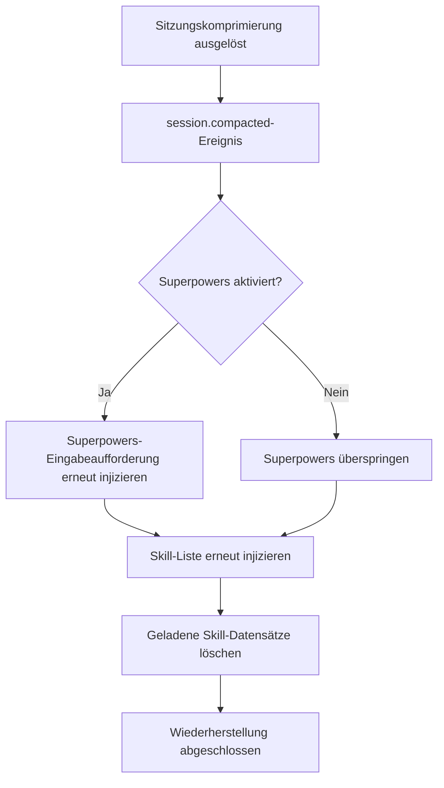

# Kontext-Komprimierungs-Wiederherstellungsmechanismus

## Was Sie nach diesem Tutorial können werden

- Verstehen, wie Plugins Skills nach einer Sitzungskomprimierung verfügbar halten
- Die Auslösebedingungen und den Ausführungsablauf der Wiederherstellung kennen
- Verifizieren können, ob die Komprimierungswiederherstellung ordnungsgemäß funktioniert
- Die Rolle von Synthetic-Nachrichten im Wiederherstellungsmechanismus verstehen

## Ihre aktuelle Herausforderung

In langen Sitzungen führt OpenCode eine **Kontextkomprimierung** (Context Compaction) durch, um Token zu sparen. Nach der Komprimierung behält die Sitzung nur die neuesten Nachrichten bei, frühere Verlaufseinträge (einschließlich zuvor injizierter Skill-Inhalte) werden entfernt.

Dies führt zu einem Problem: Wenn der Skill-Inhalt komprimiert und entfernt wurde, weiß die KI nicht mehr, welche Skills verfügbar sind, und kann keine geladenen Skills verwenden.

## Wann sollten Sie diese Technik verwenden

Der Komprimierungswiederherstellungsmechanismus läuft **automatisch** ab, Sie müssen nicht manuell eingreifen. Nach dem Verständnis der Funktionsweise können Sie in folgenden Szenarien Probleme beheben:

- Die KI "vergisst" plötzlich die Skills während einer langen Sitzung
- Sie müssen die Verfügbarkeit von Skills nach der Komprimierung debuggen
- Sie möchten die Sitzungsverwaltungsstrategie des Plugins verstehen

## Kernkonzept

### Was ist Kontextkomprimierung?

Mit zunehmender Anzahl von Nachrichten wird die OpenCode-Sitzung immer länger. Wenn die Token-Nutzung nahe an das Limit heranreicht, führt das System automatisch eine **Kontextkomprimierung** durch:

```
[Sitzungsbeginn] → [Nachricht 1] → [Nachricht 2] → ... → [Nachricht 50]
                                  ↑ Komprimierungspunkt: Nur die letzten 10 Nachrichten behalten
```

Nach der Komprimierung werden frühere Nachrichten (einschließlich Skill-Injektionsinhalte) entfernt, die KI kann nur noch die neuesten Nachrichten sehen.

### Funktionsweise des Komprimierungswiederherstellungsmechanismus

Das Plugin überwacht das `session.compacted`-Ereignis. Sobald eine Komprimierung erkannt wird, werden sofort folgende Wiederherstellungsoperationen ausgeführt:



**Schlüsselpunkte**:
- Die Wiederherstellung ist **automatisch**, keine manuelle Auslösung erforderlich
- Die wiederhergestellte Skill-Liste enthält **alle entdeckten Skills** (nicht nur zuvor geladene)
- Die Datensätze geladener Skills werden geleert, damit die KI neu bewerten kann, welche Skills benötigt werden

### Rolle von Synthetic-Nachrichten

Das Plugin verwendet den **Synthetic Message Injection**-Mechanismus zum Injizieren von Inhalten:

| Eigenschaft | Wert | Bedeutung |
| --- | --- | --- |
| `noReply` | `true` | Die KI antwortet nicht auf den Injektionsinhalt selbst |
| `synthetic` | `true` | Markiert als systemgenerierte Inhalte, werden nicht in Benutzereingaben gezählt, nicht in der UI angezeigt |

Dies bedeutet, dass die durch Komprimierungswiederherstellung injizierten Inhalte:
- Für den Benutzer vollständig transparent sind (nicht sichtbar)
- Keine Benutzernachrichten-Kontingente verbrauchen
- Aber von der KI gelesen und verstanden werden

## 🎒 Vorbereitung

Dieses Tutorial benötigt:
- Das OpenCode Agent Skills Plugin ist installiert
- Grundlegendes Verständnis von Skill-Laden
- Eine lange Sitzung zum Testen des Komprimierungseffekts

::: tip
Keine zusätzliche Vorbereitung erforderlich, die Komprimierungswiederherstellung ist eine integrierte Plugin-Funktion.
:::

## Anleitung: Überprüfung der Komprimierungswiederherstellung

### Schritt 1: Neue Sitzung starten

**Warum**
Überprüfung, ob die Skill-Liste beim Sitzungsstart normal injiziert wird

Starten Sie eine neue Sitzung und geben Sie eine beliebige Nachricht ein:

```
Hallo
```

**Was Sie sehen sollten**: Die KI antwortet normal und injiziert automatisch die Skill-Liste im Hintergrund (für den Benutzer unsichtbar)

### Schritt 2: Einen Skill laden

**Warum**
Sicherstellen, dass der Skill-Inhalt in den Kontext injiziert wird

Rufen Sie das `use_skill`-Tool auf:

```
Verwenden Sie get_available_skills, um verfügbare Skills anzuzeigen, und laden Sie dann mit use_skill einen der Skills
```

**Was Sie sehen sollten**: Die KI listet verfügbare Skills auf und lädt dann den von Ihnen gewählten Skill

### Schritt 3: Kontextkomprimierung auslösen

**Warum**
Simulation eines langen Sitzungsszenarios, um den OpenCode-Komprimierungsmechanismus auszulösen

Senden Sie kontinuierlich Nachrichten, um einen langen Dialog zu simulieren:

```
Nachricht 1: Testinhalt
Nachricht 2: Test fortsetzen
...
（20-30 Nachrichten wiederholen）
```

**Was Sie sehen sollten**:
- Mit zunehmender Anzahl von Nachrichten wird der Sitzungsverlauf länger
- Wenn eine bestimmte Länge erreicht ist, führt OpenCode automatisch eine Komprimierung durch
- Nach der Komprimierung werden frühe Nachrichten (einschließlich Skill-Injektion) entfernt

### Schritt 4: Wiederherstellungseffekt überprüfen

**Warum**
Überprüfung, ob die Skill-Liste nach der Komprimierung erneut injiziert wurde

Nach der Komprimierung lassen Sie die KI den Skill erneut verwenden:

```
Hilf mir, die git-helper-Skill zu verwenden, um einen neuen Branch zu erstellen（Angenommen, Sie haben den git-helper-Skill installiert）
```

**Was Sie sehen sollten**:
- Die KI weiß immer noch, welche Skills verfügbar sind（Beweis, dass die Skill-Liste wiederhergestellt wurde）
- Die KI kann Skills normal laden und verwenden（Beweis, dass die Skill-Funktion von der Komprimierung nicht beeinflusst wurde）

### Schritt 5: Synthetic-Message-Injektion überprüfen

**Warum**
Bestätigung, dass der Wiederherstellungsmechanismus Synthetic-Nachrichten verwendet, ohne den Dialog zu stören

Wenn das Plugin dies unterstützt, können Sie den Sitzungsnachrichtenverlauf überprüfen（Abhängig von der OpenCode-Funktion）:

```
Verwenden Sie das Debugging-Tool, um den Sitzungsnachrichtenverlauf anzuzeigen
```

**Was Sie sehen sollten**:
- Wiederhergestellte Skill-Listen-Nachrichten sind als `synthetic: true` markiert
- Diese Nachrichten werden nicht in der normalen Dialogoberfläche angezeigt

## Checkpoints ✅

Nach Abschluss der oben genannten Schritte sollten Sie Folgendes bestätigen können:

- [ ] Die KI kann in langen Sitzungen weiterhin auf die Skill-Liste zugreifen
- [ ] Die Skill-Ladefunktion funktioniert nach der Komprimierung normal
- [ ] Der Wiederherstellungsprozess ist für den Benutzer vollständig transparent

## Häufige Fehlerquellen

### Problem 1: KI sagt nach Komprimierung "Skill nicht gefunden"

**Mögliche Ursachen**:
- Das Plugin hat das `session.compacted`-Ereignis nicht korrekt überwacht
- Der Skill-Verzeichnispfad hat sich geändert

**Lösung**:

1. **Überprüfen, ob das Komprimierungsereignis ausgelöst wird**
   - Folgen Sie Schritt 3 und 4 in der Anleitung "Folge mir", um zu bestätigen, dass die KI nach der Komprimierung weiterhin auf die Skill-Liste zugreifen kann
   - Wenn die KI Skills normal verwenden kann, funktioniert der Komprimierungswiederherstellungsmechanismus korrekt

2. **Überprüfen, ob das Plugin korrekt geladen ist**
   - Starten Sie OpenCode neu
   - Starten Sie nach dem Start einer neuen Sitzung die KI, um verfügbare Skills aufzulisten（`get_available_skills`）
   - Wenn die Skill-Liste angezeigt wird, ist das Plugin korrekt geladen

### Problem 2: Wiederhergestellte Skill-Liste ist leer

**Mögliche Ursachen**:
- Im Skill-Erkennungspfad sind keine Skills vorhanden
- Das Skill-Dateiformat ist fehlerhaft

**Lösung**:
```bash
# Manuelles Abfragen verfügbarer Skills
Verwenden Sie get_available_skills, um die Skill-Liste anzuzeigen
```

Wenn eine leere Liste zurückgegeben wird, überprüfen Sie das Skill-Verzeichnis und das Dateiformat.

### Problem 3: Nach Komprimierung gehen geladene Skill-Zustände verloren

**Dies ist das erwartete Verhalten**, kein Bug. Der Wiederherstellungsmechanismus leert den `loadedSkillsPerSession`-Datensatz, damit die KI neu bewerten kann, welche Skills benötigt werden.

**Lösung**: Die KI entscheidet automatisch, ob Skills basierend auf dem Kontext neu geladen werden müssen, ohne manuellen Eingriff.

## Zusammenfassung dieser Lektion

Der Komprimierungswiederherstellungsmechanismus stellt die Verfügbarkeit von Skills in langen Sitzungen durch folgende Maßnahmen sicher:

1. **Überwachung von Komprimierungsereignissen**: Automatische Erkennung des `session.compacted`-Ereignisses
2. **Erneute Injektion der Skill-Liste**: Verwendung des `<available-skills>`-Tags zur Injektion aller Skills
3. **Optionale Superpowers-Wiederherstellung**: Wenn aktiviert, gleichzeitige Wiederherstellung der Superpowers-Eingabeaufforderung
4. **Verwendung von Synthetic-Nachrichten**: Der Wiederherstellungsprozess ist für den Benutzer transparent und beeinträchtigt die Konversation nicht
5. **Zurücksetzen geladener Datensätze**: Leeren der geladenen Skill-Sammlung, ermöglicht eine Neubewertung

Dieser Mechanismus stellt sicher:
- Skills sind in langen Sitzungen jederzeit verfügbar
- Der Wiederherstellungsprozess ist automatisiert und nicht wahrnehmbar
- Die KI kann basierend auf dem aktuellen Kontext entscheiden, welche Skills verwendet werden sollen

## Vorschau auf die nächste Lektion

> In der nächsten Lektion lernen wir **[Häufige Probleme und Fehlerbehebung](../../faq/troubleshooting/)**.
>
> Sie werden lernen:
> - Behandlungsmethoden für häufige Fehler und Ausnahmen
> - Fehlerbehebungstechniken im Zusammenhang mit Komprimierungswiederherstellung
> - Lösungen für andere Anwendungsprobleme

---

## Anhang: Quellcode-Referenz

<details>
<summary><strong>Klicken Sie, um die Quellcode-Position anzuzeigen</strong></summary>

> Aktualisiert: 2026-01-24

| Funktion | Dateipfad | Zeilennummer |
| --- | --- | --- |
| Komprimierungsereignis-Überwachung | [`src/plugin.ts`](https://github.com/joshuadavidthomas/opencode-agent-skills/blob/main/src/plugin.ts#L144-L157) | 144-157 |
| Erste Nachrichten-Initialisierung | [`src/plugin.ts`](https://github.com/joshuadavidthomas/opencode-agent-skills/blob/main/src/plugin.ts#L70-L105) | 70-105 |
| Skill-Listen-Injektion | [`src/skills.ts`](https://github.com/joshuadavidthomas/opencode-agent-skills/blob/main/src/skills.ts#L345-L370) | 345-370 |
| Synthetic-Nachrichten-Injektion | [`src/utils.ts`](https://github.com/joshuadavidthomas/opencode-agent-skills/blob/main/src/utils.ts#L147-L162) | 147-162 |
| Sitzungszustandsverwaltung | [`src/plugin.ts`](https://github.com/joshuadavidthomas/opencode-agent-skills/blob/main/src/plugin.ts#L25-L35) | 25-35 |

**Wichtige Variablen**:
- `setupCompleteSessions: Set<string>`: Speichert die ID von Sitzungen, die die Initialisierung abgeschlossen haben
- `loadedSkillsPerSession: Map<string, Set<string>>`: Speichert die Namen von Skills, die in jeder Sitzung geladen wurden

**Wichtige Funktionen**:
- `injectSkillsList()`: Injiziert die verfügbare Skill-Liste in die Sitzung
- `injectSyntheticContent()`: Verwendet Synthetic-Nachrichten zum Injizieren von Inhalten
- `getSessionContext()`: Ruft die Model- und Agent-Informationen der Sitzung ab

</details>
