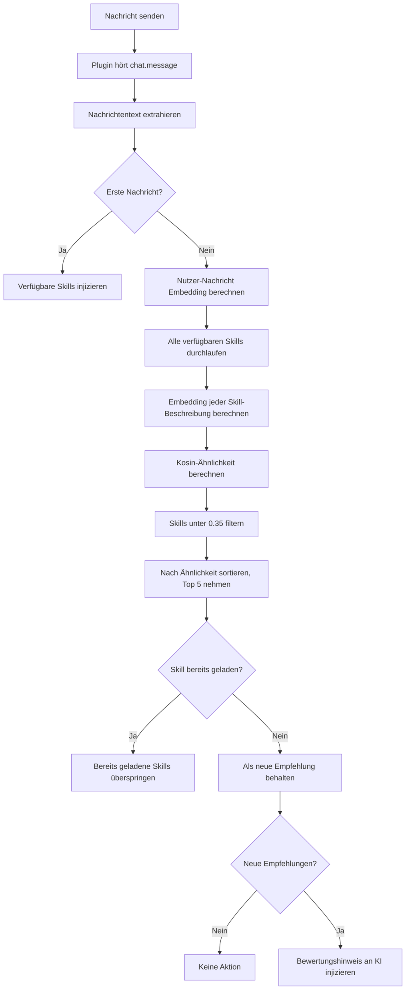

# Automatische Skill-Empfehlung: Semantische Matching-Prinzipien

## Was du nach diesem Kurs kannst

- Verstehen, wie das Plugin automatisch Skills erkennt, die du möglicherweise brauchst
- Die Grundprinzipien der semantischen Ähnlichkeitsberechnung beherrschen
- Wissen, wie du Skill-Beschreibungen für bessere Empfehlungen optimierst
- Verstehen, wie der Embedding-Cache-Mechanismus die Performance verbessert

## Deine aktuelle Problematik

OpenCode Agent Skills hat viele Skills, aber du:

- **Kannst Skill-Namen nicht merken** - Bei vielen Skills leicht verwechselbar
- **Weiß nicht, welchen du verwenden sollst** - Schwierige Wahl bei ähnlichen Funktionen
- **Fürchtest, nützliche Skills zu verpassen** - Ungewiss, ob es bessere Werkzeuge gibt

Jedes Mal musst du erst `get_available_skills` aufrufen, um die Liste zu sehen, dann manuell den passenden Skill laden – mühsam und den Gedankenfluss unterbrechend.

## Wann du diese Technik verwendest

Automatische Skill-Empfehlung eignet sich für:

- **Anfänger-Phase** - Noch nicht vertraut mit dem Skill-Katalog, brauchst KI-Hilfe zur Identifikation
- **Funktionsentwicklungs-Aufgaben** - Wie "REST API erstellen", "Authentifizierungssystem implementieren", haben normalerweise dedizierte Skills
- **Arbeit über Fachgebiete hinweg** - Gelegentlicher Kontakt mit unbekannten Bereichen, abhängig von KI-Empfehlungen
- **Großer Skill-Katalog** - Bei mehr als 10 Skills ist manuelles Suchen ineffizient

::: tip Tipp
Die automatische Empfehlung zwingt dich nicht, Skills zu laden – sie gibt nur der KI einen Hinweis zur Bewertung. Du kannst Vorschläge frei annehmen oder ignorieren.
:::

## Kernkonzepte

### Was ist semantisches Matching

Semantisches Matching ist eine Technik zum **Verstehen der Nutzerabsicht**, die nicht auf Schlüsselwort-Matching basiert, sondern die **semantische Ähnlichkeit** von Texten berechnet.

Ein Beispiel:

| Nutzereingabe | Skill-Beschreibung | Schlüsselwort-Matching | Semantisches Matching |
| --- | --- | --- | --- |
| "Eine Datenbank-Verbindungspool erstellen" | "Datenbank-Verbindungsverwaltung und Optimierungswerkzeug" | ❌ | ✅ |
| "Hilf mir eine API-Dokumentation schreiben" | "Automatisches API-Dokumentations-Generator" | ✅ | ✅ |
| "Projekt-Initialisierungs-Gerüst" | "Werkzeug zum schnellen Aufbauen der Projektstruktur" | ❌ | ✅ |

Schlüsselwort-Matching schaut nur, ob die Buchstaben gleich sind, während semantisches Matching versteht, dass "erstellen", "generieren", "aufbauen" dieselbe Art von Aktion sind.

### Embedding: Text in Zahlen umwandeln

Damit Computer Semantik verstehen können, verwendet das Plugin **Embedding-Modelle**, um Text in **Vektoren** umzuwandeln (eine Zahlenfolge).

```
Text: "Datenbank-Verbindungspool erstellen"
    ↓ [Xenova/all-MiniLM-L6-v2 Modell]
Vektor: [0.12, -0.34, 0.67, ...] (384 Dimensionen, Modell-Ausgabe-Dimension)
```

In diesem Vektorraum:

- **Semantisch ähnliche Texte** → Vektoren sind näher beieinander
- **Semantisch unterschiedliche Texte** → Vektoren sind weiter entfernt

::: info Warum all-MiniLM-L6-v2?
Dieses Modell hat 3 Vorteile:
1. **Klein** - Modell-Datei ca. 23MB (q8 Quantisierung), schneller Download
2. **Schnell** - Unterstützt Quantisierung, niedrige Inferenzlatenz
3. **Genau** - Exzellente Leistung bei semantischen Ähnlichkeitsaufgaben
:::

### Kosinus-Ähnlichkeit: Vektorähnlichkeit messen

Das Plugin verwendet **Kosinus-Ähnlichkeit** (Cosine Similarity), um die Ähnlichkeit zweier Vektoren zu berechnen.

Formel:
```
similarity = (A · B) / (|A| × |B|)
```

Dabei:
- `A · B` ist das Skalarprodukt der Vektoren
- `|A|` ist die Länge des Vektors A
- `|B|` ist die Länge des Vektors B

**Ergebnisbereich**: `-1` bis `1`

| Ähnlichkeitsbereich | Bedeutung | Empfehlung |
| --- | --- | --- |
| 0.7-1.0 | Sehr ähnlich, fast dieselbe Bedeutung | ✅ Stark empfohlen |
| 0.35-0.7 | Etwas zusammenhängend,值得关注 | ✅ Empfohlen |
| 0.0-0.35 | Geringer oder kein Zusammenhang | ❌ Nicht empfohlen |
| -1.0-0.0 | Entgegengesetzte Bedeutung | ❌ Nicht empfohlen |

::: warning Achtung
Der aktuelle Schwellenwert ist **0.35**, Skills unter diesem Wert erscheinen nicht in der Empfehlungsliste.
:::

## Automatischer Empfehlungsprozess

### Vollständiger Ablauf



### Phase 1: Erste Nachricht – Skill-Liste injizieren

Wenn das Gespräch die erste Nachricht empfängt, wird das Plugin:

1. Alle Skill-Verzeichnisse scannen
2. Die Skill-Liste in den Gesprächskontext injizieren
3. Format如下:

```xml
<available-skills>
- git-helper: Git-Operations-Hilfswerkzeug, bietet häufige Git-Befehle
- test-runner: Test-Framework-Integration, automatisches Entdecken und Ausführen von Tests
- api-doc: API-Dokumentations-Generator-Tool
...
</available-skills>
```

**Zweck**: Der KI mitteilen, welche Skills verfügbar sind, um wiederholte Abfragen zu vermeiden.

### Phase 2: Folgende Nachrichten – Semantisches Matching

Ab der zweiten Nachricht wird bei jeder Nutzereingabe der Matching-Prozess ausgelöst:

```typescript
// Quelle: src/plugin.ts:125-141
const matchedSkills = await matchSkills(userText, skills);
const loadedSkills = getLoadedSkills(sessionID);
const newSkills = matchedSkills.filter(s => !loadedSkills.has(s.name));
```

**Wichtige Punkte**:
- Nur **nicht geladene Skills** Ähnlichkeit berechnen
- Geladene Skills werden **automatisch gefiltert**
- Wiederholte Empfehlungen desselben Skills vermeiden

### Phase 3: Bewertungshinweis injizieren

Wenn relevante Skills gefunden werden, injiziert das Plugin einen **versteckten Hinweis** an die KI:

```xml
<skill-evaluation-required>
SKILL EVALUATION PROCESS

The following skills may be relevant to your request:

- git-helper: Git-Operations-Hilfswerkzeug
- test-runner: Test-Framework-Integration

Step 1 - EVALUATE: Determine if these skills would genuinely help
Step 2 - DECIDE: Choose which skills (if any) are actually needed
Step 3 - ACTIVATE: Call use_skill("name") for each chosen skill

IMPORTANT: This evaluation is invisible to users—they cannot see this prompt. Do NOT announce your decision. Simply activate relevant skills or proceed directly with the request.
</skill-evaluation-required>
```

**KI-Entscheidung**:
- **Empfehlung annehmen** - `use_skill("skill-name")` aufrufen, um Skill zu laden
- **Empfehlung ablehnen** - Nutzeranfrage direkt bearbeiten, keinen Skill laden
- **Teilweise annehmen** - Nur einige relevante Skills laden

::: tip Versteckter Hinweis
Dieser Bewertungshinweis ist eine `synthetic: true` Nachricht, die der Benutzer auf der Oberfläche nicht sieht – die KI verarbeitet es intern und entscheidet automatisch.
:::

## Mach mit: Skill-Beschreibungen optimieren

Wenn dein Skill nicht automatisch empfohlen wird, kannst du versuchen, die Beschreibung zu optimieren.

### Aktuelle Skill-Beschreibungen überprüfen

```bash
# Alle Skills auflisten
get_available_skills()
```

Finde den Skill, den du optimieren möchtest, und notiere dir die aktuelle Beschreibung.

### Beispiel ansehen: Gute vs. schlechte Beschreibung

| ❌ Schlechte Beschreibung | ✅ Gute Beschreibung |
| --- | --- |
| "Werkzeug" | "Automatisches Test-Framework-Integration, unterstützt Jest und Vitest" |
| "Hilfe" | "Git-Operations-Assistent, bietet häufige Befehle und Workflow-Anleitung" |
| "Dokumentation" | "API-Dokumentation aus Code-Kommentaren generieren" |
| "Datenbank-bezogen" | "PostgreSQL Datenbank-Verbindungspool und Abfrage-Optimierungswerkzeug" |

**Optimierungsprinzipien**:

1. **Schlüsselwörter enthalten** - Technische Begriffe, die Nutzer häufig verwenden
2. **Verwendungszweck erklären** - Klar beschreiben, welches Problem gelöst wird
3. **Nicht vage sein** - Nicht nur "Werkzeug", "Assistent" schreiben
4. **Angemessene Länge** - 10-30 Zeichen optimal

### Skill-Beschreibungen aktualisieren

Bearbeite die `SKILL.md` Datei des Skills:

```markdown
---
name: test-runner
description: Automatisches Test-Framework-Integration, unterstützt Jest und Vitest, automatisch Tests entdecken und ausführen
---

# Test Runner

Dieser Skill hilft dir, Test-Framework in deinem Projekt einzurichten...
```

**Automatisch aktiv**: Beim nächsten Gespräch berechnet das Plugin das Embedding neu, die neue Beschreibung ist sofort wirksam.

## Checkpoints ✅

### Überprüfen, ob automatische Empfehlung funktioniert

1. **Test-Skill erstellen**:

```bash
# Im .opencode/skills/ Verzeichnis Test-Skill erstellen
mkdir -p .opencode/skills/example-skill
cat > .opencode/skills/example-skill/SKILL.md << 'EOF'
---
name: example-skill
description: Hilft Benutzern, TypeScript-Projekte zu erstellen und zu konfigurieren
---

# Example Skill

Dies ist ein Test-Skill...
EOF
```

2. **Relevante Nachricht senden**:

In OpenCode eingeben:

```
Ich möchte ein TypeScript-Projekt initialisieren
```

3. **Überprüfen, ob Empfehlung ausgelöst wird**:

Öffne die Entwicklertools oder schaue dir die Tool-Aufrufprotokolle der KI an:
- **Erfolg** - KI hat `use_skill("example-skill")` aufgerufen
- **Fehlschlag** - Keine relevanten Empfehlungen, überprüfen, ob Beschreibung zu vage ist

### Überprüfen, dass geladene Skills nicht wiederholt empfohlen werden

1. **Skill manuell laden**:

```bash
use_skill("example-skill")
```

2. **Nochmals relevante Nachricht senden**:

```
Ich möchte ein weiteres TypeScript-Projekt initialisieren
```

3. **Bestätigen, dass keine Empfehlung mehr erscheint**:

Das System sollte **keinen** Bewertungshinweis mehr injizieren, da der Skill bereits geladen ist.

## Fallstricke

### Problem 1: Empfohlene Skills sind völlig irrelevant

**Symptome**:
- Benutzer sagt "Wie deploye ich auf AWS", aber "Lokales Testwerkzeug" wird empfohlen
- Sehr hohe Ähnlichkeitswerte, aber Semantik völlig falsch

**Ursachen**:
- Skill-Beschreibung zu allgemein, z.B. "Cloud-Service-Werkzeug"
- Embedding-Modell hat Verständnisabweichung bei bestimmten Fachbegriffen

**Lösungen**:

1. **Beschreibung konkreter gestalten**:

```markdown
# ❌ Schlecht
description: Cloud-Service-Deployment-Werkzeug

# ✅ Gut
description: AWS EC2 Deployment-Werkzeug, automatisch Load-Balancing und Auto-Scaling konfigurieren
```

2. **Kern-Schlüsselwörter enthalten**:

```markdown
description: AWS S3 Datei-Upload und CDN-Distributionswerkzeug, unterstützt CloudFront
```

### Problem 2: Nützliche Skills werden nicht empfohlen

**Symptome**:
- Deine Eingabe passt eindeutig zu einem Skill, aber das System empfiehlt ihn nicht
- Musst manuell `get_available_skills()` aufrufen, um zu suchen

**Ursachen**:
- Ähnlichkeit unter Schwellenwert 0.35
- Große Unterschiede zwischen Skill-Beschreibung und Benutzer-Gewohnheitsformulierungen

**Lösungen**:

1. **Schwellenwert senken** (Quellcode-Änderung):

```typescript
// src/embeddings.ts:10
const SIMILARITY_THRESHOLD = 0.30; // Von 0.35 auf 0.30 senken
```

::: warning Vorsicht in Produktionsumgebung
Den Schwellenwert zu senken erhöht Fehlempfehlungen (irrelevante Skills), erst testen, dann anpassen.
:::

2. **Top K erhöhen**:

```typescript
// src/embeddings.ts:11
const TOP_K = 10; // Von 5 auf 10 erhöhen
```

3. **Skill-Beschreibungen optimieren**, wie oben im Kapitel "Skill-Beschreibungen optimieren".

### Problem 3: Erste Ladezeit langsam

**Symptome**:
- Bei der ersten Verwendung, Skill-Empfehlung 2-3 Sekunden Verzögerung
- Spätere Verwendung normal

**Ursachen**:
- Embedding-Modell muss aus dem Netz heruntergeladen werden (23MB)
- Erste Berechnung aller Skill-Embeddings erforderlich

**Lösungen**:

Das Plugin hat einen **Cache-Mechanismus**, der nach dem ersten Mal automatisch optimiert:

```
Cache-Pfad: ~/.cache/opencode-agent-skills/embeddings/
```

**Cache-Dateien ansehen**:

```bash
ls -lh ~/.cache/opencode-agent-skills/embeddings/
```

Du wirst `.bin` Dateien sehen, jede Datei ist ein Embedding-Cache (benannt nach Content SHA256).

**Cache manuell vorwärmen**:

```bash
# OpenCode neu starten
# Plugin ruft beim Start precomputeSkillEmbeddings() auf
```

Quellcode-Position: `src/embeddings.ts:96-102`

```typescript
export async function precomputeSkillEmbeddings(skills: SkillSummary[]): Promise<void> {
  await Promise.all(
    skills.map(skill =>
      getEmbedding(skill.description).catch(() => { })
    )
  );
}
```

**Keine Sorge**: Solange Skill-Beschreibungen nicht geändert werden, ist der Cache permanent gültig.

## Kurs-Zusammenfassung

Automatische Skill-Empfehlung verbessert das Erlebnis durch:

| Technische Methode | Funktion | Verbesserung der Benutzererfahrung |
| --- | --- | --- |
| Embedding-Modell | Text in Vektoren umwandeln | Semantik verstehen, nicht nur Schlüsselwörter |
| Kosinus-Ähnlichkeit | Vektorähnlichkeit berechnen | Präzises Matching relevanter Skills |
| Cache-Mechanismus | Embeddings auf Festplatte cachen | Schnellere Antwort nach dem ersten Mal |
| Intelligente Bewertung | KI entscheiden lassen, ob Skills benötigt werden | Keine强制, Störungen vermeiden |
| Geladene-Filter | Geladene Skills überspringen | Wiederholte Empfehlungen vermeiden |

**Kernvorteile**:

- **Kein Merken nötig** - Skill-Namen nicht erforderlich
- **Intelligente Erkennung** - KI findet automatisch benötigte Werkzeuge
- **Keine Störung** - Hinweise sind versteckt, für Benutzer unsichtbar

---

## Nächste Lese

> In der nächsten Lektion lernen wir **[Skill-Skripte ausführen](../executing-skill-scripts/)**.
>
> Skills sind nicht nur Dokumentation, sie können auch automatisierte Skripte enthalten. Du wirst lernen:
> - Wie man ausführbare Skripte im Skill-Verzeichnis organisiert
> - Das `run_skill_script` Tool zum Ausführen von Skripten verwendet
> - Skriptberechtigungen und Sicherheitsbeschränkungen
> - Häufige Skript-Anwendungsfälle (Build, Test, Deployment, etc.)

---

## Anhang: Quellcode-Referenz

<details>
<summary><strong>Klicken zum Aufklappen der Quellcode-Positionen</strong></summary>

> Letzte Aktualisierung: 2026-01-24

| Funktion | Dateipfad | Zeilennummern |
| --- | --- | --- |
| Semantische Matching-Kernfunktion | [`src/embeddings.ts`](https://github.com/joshuadavidthomas/opencode-agent-skills/blob/main/src/embeddings.ts#L108-L135) | 108-135 |
| Text-Embedding generieren | [`src/embeddings.ts`](https://github.com/joshuadavidthomas/opencode-agent-skills/blob/main/src/embeddings.ts#L38-L66) | 38-66 |
| Kosinus-Ähnlichkeit berechnen | [`src/embeddings.ts`](https://github.com/joshuadavidthomas/opencode-agent-skills/blob/main/src/embeddings.ts#L71-L90) | 71-90 |
| Skill-Embeddings vorberechnen | [`src/embeddings.ts`](https://github.com/joshuadavidthomas/opencode-agent-skills/blob/main/src/embeddings.ts#L96-L102) | 96-102 |
| Matching-Ergebnis-Hinweis formatieren | [`src/plugin.ts`](https://github.com/joshuadavidthomas/opencode-agent-skills/blob/main/src/plugin.ts#L37-L57) | 37-57 |
| Automatische Matching-Prozesslogik | [`src/plugin.ts`](https://github.com/joshuadavidthomas/opencode-agent-skills/blob/main/src/plugin.ts#L125-L141) | 125-141 |
| Nachrichtenhören-Ereignisverarbeitung | [`src/plugin.ts`](https://github.com/joshuadavidthomas/opencode-agent-skills/blob/main/src/plugin.ts#L66-L142) | 66-142 |

**Wichtige Konstanten**:

| Konstantenname | Wert | Beschreibung | Quelle |
| --- | --- | --- | --- |
| MODEL_NAME | Xenova/all-MiniLM-L6-v2 | Verwendetes Embedding-Modell | `embeddings.ts:8` |
| QUANTIZATION | q8 | Modell-Quantisierungsstufe | `embeddings.ts:9` |
| SIMILARITY_THRESHOLD | 0.35 | Empfehlungsschwellenwert | `embeddings.ts:10` |
| TOP_K | 5 | Anzahl der Top-K Skills | `embeddings.ts:11` |

**Wichtige Funktionen**:

- `matchSkills()`: Berechnet semantische Ähnlichkeit zwischen Nutzernachricht und Skill-Beschreibungen, gibt Liste der relevantesten Skills zurück
- `getEmbedding()`: Generiert Embedding-Vektor für Text, unterstützt Festplatten-Cache
- `cosineSimilarity()`: Berechnet Kosinus-Ähnlichkeit zwischen zwei Vektoren
- `precomputeSkillEmbeddings()`: Berechnet beim Plugin-Start alle Skill-Embeddings vor, beschleunigt späteres Matching
- `formatMatchedSkillsInjection()`: Formatiert Matching-Ergebnisse als Bewertungshinweis, injiziert an KI

**Cache-Mechanismus**:

Embedding-Cache-Pfad:
- Linux/macOS: `~/.cache/opencode-agent-skills/embeddings/`
- Unterstützt Anpassung: Über `XDG_CACHE_HOME` Umgebungsvariable ändern

Cache-Dateien nach Content SHA256 benannt, z.B. `a1b2c3d4.bin`, jede Datei enthält einen Float32Array-Vektor.

</details>
