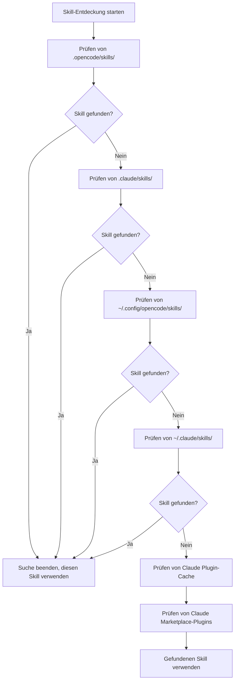

# Detaillierte Erklärung des Skill-Entdeckungsmechanismus

## Was Sie nach diesem Lernen können

- Verstehen, aus welchen Positionen das Plugin automatisch Skills entdeckt
- Meistern der Prioritätsregeln für Skill-Entdeckung
- Wissen, wie projektbezogene Skills benutzerbezogene Skills überschreiben können
- Verstehen des Kompatibilitätsmechanismus mit Claude Code Skills

## Ihr aktuelles Problem

Sie haben Skills erstellt, aber AI sagt immer, dass es "keine Skills gefunden hat". Sie wissen nicht, an welchen Orten das Plugin nach Skills sucht, und was passiert, wenn es Skills mit demselben Namen gibt. Das Ergebnis ist, dass Skills an falschen Orten platziert werden oder durch Skills an anderen Orten überschrieben werden.

## Wann Sie diesen Trick anwenden

- Wenn Sie möchten, dass ein bestimmter Skill im Projekt wirksam wird
- Wenn Sie benutzerbezogene Skills oder vom Plugin mitgelieferte Skills überschreiben möchten
- Wenn Sie Skills von Claude Code wiederverwenden möchten

## 🎒 Vorbereitungen vor dem Start

::: warning Vorwissen
Bitte absolvieren Sie zuerst die [Installation von OpenCode Agent Skills](../../start/installation/).
:::

## Kernkonzept

OpenCode Agent Skills entdeckt automatisch Skills aus mehreren Positionen und sucht sie in Prioritätsreihenfolge. **Der zuerst gefundene Skill wird wirksam, nachfolgende Skills mit demselben Namen werden ignoriert.** Dies ermöglicht es Ihnen, benutzerbezogene Skills im Projekt zu überschreiben und eine Anpassung zu erreichen.

### Überblick über die Entdeckungspfade



::: info Eindeutigkeit von Skill-Namen
Für Skills mit demselben Namen wird nur der zuerst gefundene behalten, nachfolgende werden ignoriert. Dies bedeutet, dass der projektbezogene `git-helper` den benutzerbezogenen `git-helper` überschreibt.
:::

## Lernen mit mir

### Schritt 1: Überprüfen der Skill-Entdeckungslogik

**Warum**
Verstehen, wie das Plugin Skill-Verzeichnisse scannt, hilft Ihnen bei der Problemlösung.

Anzeigen der Definition der Entdeckungspfade im Quellcode:

```typescript
// src/skills.ts:241-246
const discoveryPaths: DiscoveryPath[] = [
  { path: path.join(directory, '.opencode', 'skills'), label: 'project', maxDepth: 3 },
  { path: path.join(directory, '.claude', 'skills'), label: 'claude-project', maxDepth: 1 },
  { path: path.join(homedir(), '.config', 'opencode', 'skills'), label: 'user', maxDepth: 3 },
  { path: path.join(homedir(), '.claude', 'skills'), label: 'claude-user', maxDepth: 1 }
];
```

**Was Sie sehen sollten**:
- 4 lokale Entdeckungspfade, jeder mit einem `label` (Quellidentifikator) und `maxDepth` (maximale rekursive Tiefe)
- 2 Claude Plugin-Pfade (Cache und Marketplace-Plugins), die durch `discoverPluginCacheSkills()` und `discoverMarketplaceSkills()` entdeckt werden
- `directory` ist das Projektstammverzeichnis, `homedir()` ist das Benutzerverzeichnis

### Schritt 2: Verstehen des rekursiven Suchmechanismus

**Warum**
Verstehen der Rekursionstiefenbegrenzung hilft Ihnen zu vermeiden, Skills zu tief zu platzieren, sodass sie nicht gefunden werden.

Die rekursive Suchfunktion durchläuft den Verzeichnisbaum und sucht nach `SKILL.md`-Dateien:

```typescript
// src/skills.ts:182-207
async function recurse(dir: string, depth: number, relPath: string) {
  if (depth > maxDepth) return;  // Über Tiefenlimit stoppen

  const entries = await fs.readdir(dir, { withFileTypes: true });
  for (const entry of entries) {
    const fullPath = path.join(dir, entry.name);
    const stats = await fs.stat(fullPath);

    if (!stats.isDirectory()) continue;  // Dateien überspringen

    const newRelPath = relPath ? `${relPath}/${entry.name}` : entry.name;
    const found = await findFile(fullPath, newRelPath, 'SKILL.md');

    if (found) {
      results.push({ ...found, label });  // Skill gefunden, Ergebnis hinzufügen
    } else {
      await recurse(fullPath, depth + 1, newRelPath);  // Rekursiv in Unterverzeichnissen suchen
    }
  }
}
```

**Was Sie sehen sollten**:
- Die Tiefe jedes Verzeichnisses beginnt bei 0, wird gestoppt, wenn sie `maxDepth` überschreitet
- Gibt zurück, wenn `SKILL.md` gefunden wird, sonst werden Unterverzeichnisse weiter durchsucht

**Rekursionstiefe an verschiedenen Positionen**:

| Position                | Label           | Maximale Tiefe | Erklärung                       |
|--- | --- | --- | ---|
| `.opencode/skills/` | project         | 3        | Unterstützt verschachtelte Verzeichnisstrukturen           |
| `.claude/skills/`   | claude-project  | 1        | Scannt nur die erste Ebene               |
| `~/.config/opencode/skills/` | user   | 3        | Unterstützt verschachtelte Verzeichnisstrukturen           |
| `~/.claude/skills/` | claude-user     | 1        | Scannt nur die erste Ebene               |

### Schritt 3: Verstehen der Deduplizierungsregeln

**Warum**
Für Skills mit demselben Namen wird nur einer behalten. Das Wissen dieser Regel hilft Ihnen zu vermeiden, dass Skills überschrieben werden.

Die Deduplizierungslogik befindet sich in der Funktion `discoverAllSkills`:

```typescript
// src/skills.ts:255-262
const skillsByName = new Map<string, Skill>();
for (const { filePath, relativePath, label } of allResults) {
  const skill = await parseSkillFile(filePath, relativePath, label);
  if (!skill || skillsByName.has(skill.name)) continue;  // Überspringen von Skills mit demselben Namen, die bereits vorhanden sind
  skillsByName.set(skill.name, skill);
}
```

**Was Sie sehen sollten**:
- Verwenden Sie `Map`, um nach `skill.name` zu speichern und Eindeutigkeit sicherzustellen
- `skillsByName.has(skill.name)` prüft, ob bereits ein Skill mit demselben Namen vorhanden ist
- Nachfolgende Skills mit demselben Namen werden ignoriert (`continue`)

**Beispielszenario**:

```
Projektstruktur:
.opencode/skills/git-helper/SKILL.md  ← zuerst entdeckt, wirksam
~/.config/opencode/skills/git-helper/SKILL.md  ← gleichnamig, ignoriert
```

### Schritt 4: Parsen der SKILL.md-Datei

**Warum**
Verstehen der Parsregeln für SKILL.md hilft Ihnen, Formatfehler zu vermeiden.

Das Plugin parsen Sie den YAML frontmatter von SKILL.md:

```typescript
// src/skills.ts:132-152
const frontmatterMatch = content.match(/^---\n([\s\S]*?)\n---\n([\s\S]*)$/);
if (!frontmatterMatch?.[1] || !frontmatterMatch?.[2]) {
  return null;  // Formatfehler, überspringen
}

const frontmatterText = frontmatterMatch[1];
const skillContent = frontmatterMatch[2].trim();

let frontmatterObj: unknown;
try {
  frontmatterObj = parseYamlFrontmatter(frontmatterText);
} catch {
  return null;  // YAML-Parsfehler, überspringen
}

let frontmatter: SkillFrontmatter;
try {
  frontmatter = SkillFrontmatterSchema.parse(frontmatterObj);
} catch (error) {
  return null;  // Validierungsfehler, überspringen
}
```

**Was Sie sehen sollten**:
- Frontmatter muss mit `---` umgeben sein
- YAML-Inhalt muss der Zod Schema-Validierung entsprechen
- Skills mit Parsfehlern werden ignoriert (kein Fehler, weitermachen mit anderen Skills)

**Frontmatter-Validierungsregeln**:

```typescript
// src/skills.ts:106-114
const SkillFrontmatterSchema = z.object({
  name: z.string()
    .regex(/^[\p{Ll}\p{N}-]+$/u, { message: "Name must be lowercase alphanumeric with hyphens" })
    .min(1, { message: "Name cannot be empty" }),
  description: z.string()
    .min(1, { message: "Description cannot be empty" }),
  license: z.string().optional(),
  "allowed-tools": z.array(z.string()).optional(),
  metadata: z.record(z.string(), z.string()).optional()
});
```

**Namenskonvention**:
- Nur Kleinbuchstaben, Zahlen und Bindestriche (`-`) zulässig
- Keine Leerzeichen, Großbuchstaben oder Unterstriche

| ❌ Falscher Skill-Name  | ✅ Korrekter Skill-Name |
|--- | ---|
| `MySkill`        | `my-skill`       |
| `git_helper`     | `git-helper`     |
| `Git Helper`     | `git-helper`     |

### Schritt 5: Ausführbare Skripte entdecken

**Warum**
Skills können automatisierte Skripte enthalten. Verstehen des Skript-Entdeckungsmechanismus hilft Ihnen bei der korrekten Konfiguration.

Das Plugin scannt rekursiv das Skill-Verzeichnis und sucht nach ausführbaren Dateien:

```typescript
// src/skills.ts:61-93
const scripts: Script[] = [];
const skipDirs = new Set(['node_modules', '__pycache__', '.git', '.venv', 'venv', '.tox', '.nox']);

async function recurse(dir: string, depth: number, relPath: string) {
  if (depth > maxDepth) return;

  const entries = await fs.readdir(dir, { withFileTypes: true });
  for (const entry of entries) {
    if (entry.name.startsWith('.')) continue;  // Versteckte Verzeichnisse überspringen
    if (skipDirs.has(entry.name)) continue;    // Abhängigkeitsverzeichnisse überspringen

    const fullPath = path.join(dir, entry.name);
    const stats = await fs.stat(fullPath);

    if (stats.isDirectory()) {
      await recurse(fullPath, depth + 1, newRelPath);
    } else if (stats.isFile()) {
      if (stats.mode & 0o111) {  // Ausführbare Bit prüfen
        scripts.push({
          relativePath: newRelPath,
          absolutePath: fullPath
        });
      }
    }
  }
}
```

**Was Sie sehen sollten**:
- Scannt nur Dateien mit ausführbarem Bit (`0o111`)
      | Überspringt versteckte und gängige Abhängigkeitsverzeichnisse
      | Maximale Rekursionstiefe von 10 Ebenen

**Skript-Entdeckungsregeln**:

| Regel              | Erklärung                                    |
|--- | ---|
| Prüfung der ausführbaren Bits      | Dateien müssen Ausführungsberechtigung haben (`chmod +x`)       |
| Versteckte Verzeichnisse überspringen      | Scannt `.git`, `.venv` etc. Verzeichnisse nicht           |
| Abhängigkeitsverzeichnisse überspringen      | Scannt `node_modules`, `__pycache__` etc. nicht |
| Maximale Tiefe 10 Ebenen    | Verschachtelung über 10 Ebenen wird nicht gescannt              |

### Schritt 6: Kompatibilität mit Claude Code Plugin

**Warum**
Verstehen des Kompatibilitätsmechanismus mit Claude Code Plugin hilft Ihnen, vorhandene Skills wiederverwenden.

Das Plugin scannt den Plugin-Cache und das Marktinstallationsverzeichnis von Claude Code:

```typescript
// src/claude.ts:115-145
async function discoverMarketplaceSkills(): Promise<LabeledDiscoveryResult[]> {
  const claudeDir = path.join(homedir(), ".claude", "plugins");
  const installedPath = path.join(claudeDir, "installed_plugins.json");

  let installed: InstalledPlugins;
  try {
    const content = await fs.readFile(installedPath, "utf-8");
    installed = JSON.parse(content);
  } catch {
    return [];
  }

  const isV2 = installed.version === 2;

  for (const pluginKey of Object.keys(installed.plugins || {})) {
    const pluginData = installed.plugins[pluginKey];
    if (!pluginData) continue;

    if (isV2 || Array.isArray(pluginData)) {
      // v2 format: use installPath directly from each installation entry
      const installPaths = getPluginInstallPaths(pluginData);
      for (const installPath of installPaths) {
        const skills = await discoverSkillsFromPluginDir(installPath);
        results.push(...skills);
      }
    } else {
      // v1 format: use marketplace manifest to find skills
      // ...
    }
  }
}
```

**Was Sie sehen sollten**:
- Liest die Datei `installed_plugins.json` von Claude Code
- Unterstützt v1 und v2 Plugin-Formate
- Scannt `SKILL.md`-Dateien aus dem Plugin-Installationspfad

**Claude Code Plugin-Struktur**:

Cache-Verzeichnisstruktur (Plugin-Cache):

```
~/.claude/plugins/
├── cache/                    # Plugin-Cache
│   ├── plugin-name/         # v1 Struktur
│   │   └── skills/
│   │       └── skill-name/SKILL.md
│   └── marketplace-name/    # v2 Struktur
│       └── plugin-name/
│           └── version/
│               └── skills/
│                   └── skill-name/SKILL.md
└── installed_plugins.json   # Plugin-Installationsliste
```

**Marketplace-Plugin (v2)**:
- Der tatsächliche Pfad des Plugins wird aus dem Feld `installPath` der Datei `installed_plugins.json` gelesen
- Der Pfad ist nicht fest und kann sich an jeder Stelle der Scopes `managed`, `user`, `project` oder `local` befinden
- Jedes Plugin-Verzeichnis hat ein Unterverzeichnis `skills/`, das die verschiedenen Skills enthält

## Prüfungsplatz ✅

Verifizieren Sie, dass Sie den Skill-Entdeckungsmechanismus beherrschen:

- [ ] Kennen Sie die Prioritätsreihenfolge der 6 Skill-Entdeckungspfade
- [ ] Verstehen Sie, dass Skills mit demselben Namen nur den zuerst gefundenen behalten
- [ ] Kennen Sie die Rekursionstiefenbeschränkungen an verschiedenen Positionen
- [ ] Verstehen Sie die Validierungsregeln für SKILL.md
- [ ] Wissen Sie, wie projektbezogene Skills benutzerbezogene Skills überschreiben können

## Warnungen vor häufigen Fehlern

### ❌ Skill am falschen Ort platziert

**Problem**: Skill in `~/.config/opencode/skills/`, aber im Projekt gibt es einen Skill mit demselben Namen, sodass er überschrieben wird.

**Lösung**: Platzieren Sie projektspezifische Skills in `.opencode/skills/`, um sicherzustellen, dass die Priorität am höchsten ist.

### ❌ Skill-Name entspricht nicht den Konventionen

**Problem**: Das Feld `name` in SKILL.md enthält Großbuchstaben oder Leerzeichen, was zu einem Parsfehler führt.

**Lösung**: Stellen Sie sicher, dass der Skill-Name der Konvention `lowercase-alphanumeric-with-hyphens` entspricht, z. B. `git-helper`.

### ❌ Skript hat keine Ausführungsberechtigung

**Problem**: Skill-Skript kann nicht vom Tool `run_skill_script` ausgeführt werden.

**Lösung**: Fügen Sie dem Skript die Ausführungsberechtigung hinzu:
```bash
chmod +x tools/build.sh
```

### ❌ Skill zu tief platziert, sodass er nicht gefunden wird

**Problem**: Skill in `~/.config/opencode/skills/category/subcategory/skill/`, überschreitet die Rekursionstiefenbegrenzung.

**Lösung**: Stellen Sie sicher, dass die Tiefe des Skill-Verzeichnisses die `maxDepth`-Begrenzung der entsprechenden Position nicht überschreitet.

## Zusammenfassung

OpenCode Agent Skills entdeckt automatisch Skills aus mehreren Positionen und sucht sie in Prioritätsreihenfolge:

1. **Prioritätsreihenfolge** (von hoch zu niedrig): `.opencode/skills/` → `.claude/skills/` → `~/.config/opencode/skills/` → `~/.claude/skills/` → Claude Plugin-Cache (`~/.claude/plugins/cache/`) → Claude Marketplace-Plugins (liest den Installationspfad aus `installed_plugins.json`)

2. **Deduplizierungsregel**: Skills mit demselben Namen behalten nur den zuerst gefundenen, projektbezogene Skills überschreiben benutzerbezogene Skills.

3. **Rekursionstiefe**: Die Rekursionstiefe an verschiedenen Positionen ist unterschiedlich; Skills zu tief platzieren kann dazu führen, dass sie nicht gefunden werden.

4. **Formatvalidierung**: Der Frontmatter von SKILL.md muss der Zod Schema-Validierung entsprechen, sonst wird er ignoriert.

5. **Skript-Entdeckung**: Nur Dateien mit ausführbarem Bit werden als Skripte erkannt.

## Vorschau auf die nächste Lektion

> In der nächsten Lektion lernen wir **[Abfragen und Auflisten verfügbarer Skills](../listing-available-skills/)**.
>
> Sie werden lernen:
> - Verwenden Sie das Tool `get_available_skills`, um alle verfügbaren Skills anzuzeigen
> - Verstehen Sie die Verwendung von Skill-Namensräumen
> - Wie man Skills mit Fuzzy Matching findet

---

## Anhang: Quellcode-Referenz

<details>
<summary><strong>Klicken, um Quellcodepositionen anzuzeigen</strong></summary>

> Aktualisiert am: 2026-01-24

| Funktion           | Dateipfad                                                                                      | Zeilen    |
|--- | --- | ---|
| Definition der Entdeckungspfade   | [`src/skills.ts`](https://github.com/joshuadavidthomas/opencode-agent-skills/blob/main/src/skills.ts#L241-L246)     | 241-246 |
| Alle Skills entdecken   | [`src/skills.ts`](https://github.com/joshuadavidthomas/opencode-agent-skills/blob/main/src/skills.ts#L240-L263)     | 240-263 |
| Skills rekursiv suchen   | [`src/skills.ts`](https://github.com/joshuadavidthomas/opencode-agent-skills/blob/main/src/skills.ts#L176-L218)     | 176-218 |
| SkillLabel-Enumeration | [`src/skills.ts`](https://github.com/joshuadavidthomas/opencode-agent-skills/blob/main/src/skills.ts#L30)              | 30      |
| Deduplizierungslogik       | [`src/skills.ts`](https://github.com/joshuadavidthomas/opencode-agent-skills/blob/main/src/skills.ts#L255-L262)     | 255-262 |
| Frontmatter parsen | [`src/skills.ts`](https://github.com/joshuadavidthomas/opencode-agent-skills/blob/main/src/skills.ts#L122-L167)      | 122-167 |
| Schema-Validierung    | [`src/skills.ts`](https://github.com/joshuadavidthomas/opencode-agent-skills/blob/main/src/skills.ts#L105-L114)     | 105-114 |
| Skript-Entdeckung       | [`src/skills.ts`](https://github.com/joshuadavidthomas/opencode-agent-skills/blob/main/src/skills.ts#L59-L99)       | 59-99   |
| Claude Marketplace-Plugin-Entdeckung | [`src/claude.ts`](https://github.com/joshuadavidthomas/opencode-agent-skills/blob/main/src/claude.ts#L115-L180)     | 115-180 |
| Claude Cache-Plugin-Entdeckung | [`src/claude.ts`](https://github.com/joshuadavidthomas/opencode-agent-skills/blob/main/src/claude.ts#L193-L253)     | 193-253 |

**Schlüsselkonstanten**:
- `maxDepth` (verschiedene Werte an verschiedenen Positionen): Rekursionstiefenbegrenzung

**Schlüsselfunktionen**:
- `discoverAllSkills()`: Entdeckt Skills aus allen Pfaden
- `findSkillsRecursive()`: Sucht rekursiv nach Skill-Verzeichnissen
- `parseSkillFile()`: Parsed SKILL.md-Datei
- `discoverMarketplaceSkills()`: Entdeckt Claude Marketplace-Plugins
- `discoverPluginCacheSkills()`: Entdeckt Claude Cache-Plugins

</details>
