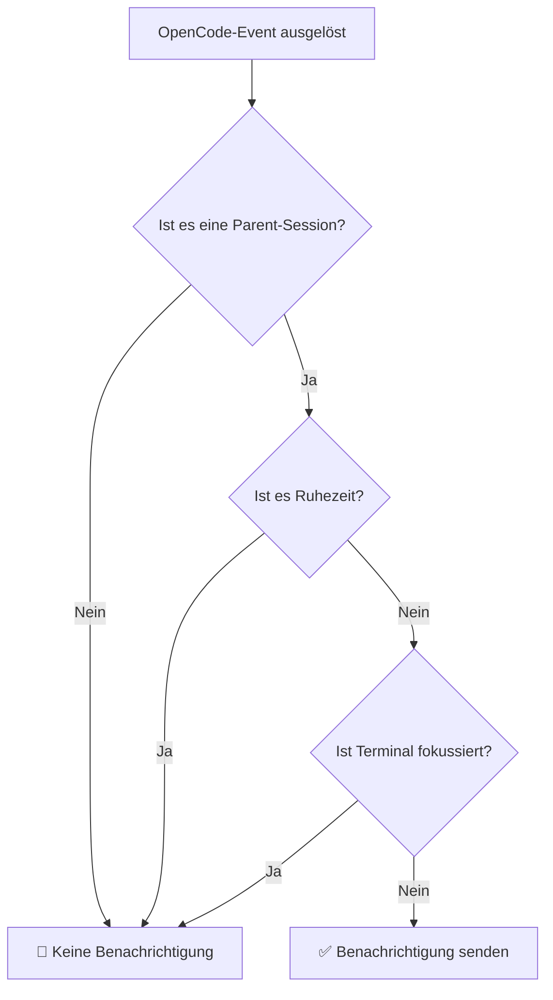

# Ruhezeiten im Detail: Störungen in bestimmten Zeiträumen vermeiden

## Was du lernen wirst

- Ruhezeiten in der Konfigurationsdatei aktivieren, um während der Ruhezeit nicht gestört zu werden
- Die Funktionsweise der Ruhezeiten und die Logik der Zeitberechnung verstehen
- Uhrzeiten über Mitternacht konfigurieren (z. B. 22:00 - 08:00)
- Die Prioritätsbeziehung zwischen Ruhezeiten und anderen intelligenten Filtermechanismen verstehen

## Dein aktuelles Problem

Vielleicht kennst du diese Situation: Du hast um 22 Uhr eine Aufgabe an die KI delegiert und bist dann zur Ruhe gegangen. Um 2 Uhr nachts hat die KI die Aufgabe abgeschlossen und ein "Ding"-Geräusch hat dich geweckt. Oder du hast der KI während deiner Mittagspause einige Dateien bearbeiten lassen, und um 12:05 Uhr hat die Benachrichtigung deine Pause unterbrochen.

::: info Was sind Ruhezeiten
Ruhezeiten sind eine Zeitraum-Konfiguration. In diesen Zeiträumen stoppt opencode-notify das Senden aller Benachrichtigungen, um zu vermeiden, dass du in Zeiten, in denen du nicht gestört werden möchtest, Erinnerungen erhältst.
:::

## Wann du diese Lösung brauchst

- **Nachtruhe**: 22:00 - 08:00 einstellen, um nicht im Schlaf gestört zu werden
- **Mittagspause**: 12:00 - 13:00 einstellen, um während der Mittagspause nicht gestört zu werden
- **Fokussierte Arbeitszeit**: 09:00 - 12:00 einstellen, um während Meetings nicht durch Benachrichtigungen unterbrochen zu werden
- **Keine Arbeit am Wochenende**: Das gesamte Wochenende als Ruhezeit einstellen

Ruhezeiten eignen sich am besten, um deine Ruhezeit oder konzentrierte Arbeitszeit zu schützen. Die KI kann die Aufgaben im Hintergrund erledigen, und du kannst die Ergebnisse überprüfen, wenn du bereit bist.

## Das Konzept

Die Funktionsweise der Ruhezeiten ist einfach:

1. **Zeitprüfung**: Bevor eine Benachrichtigung gesendet wird, prüft das Plugin, ob die aktuelle Zeit innerhalb der konfigurierten Ruhezeit liegt
2. **Unterstützung für Zeiträume**: Unterstützung für beliebige Zeiträume, einschließlich Uhrzeiten über Mitternacht (z. B. 22:00 - 08:00)
3. **Mittlere Priorität**: Die Prüfung der Ruhezeiten hat eine niedrigere Priorität als die Prüfung der Parent-Sessions, aber eine höhere als die Erkennung des Terminalfokus. Wenn es sich um eine Child-Session handelt und `notifyChildSessions` false ist, wird die Prüfung der Ruhezeiten übersprungen.

::: tip Ruhezeiten vs. temporäres Deaktivieren
Ruhezeiten sind eine **regelmäßig wiederkehrende** Zeitkonfiguration, z. B. jeden Abend von 22 bis 8 Uhr. Wenn du Benachrichtigungen **temporär deaktivieren** möchtest (z. B. die nächste Stunde keine Benachrichtigungen), kannst du `"enabled": false` in der Konfigurationsdatei festlegen oder die Konfigurationsdatei löschen, um zu den Standardwerten zurückzukehren.
:::

## Schritt-für-Schritt-Anleitung

### Schritt 1: Konfigurationsdatei öffnen

Die Konfigurationsdatei befindet sich unter: `~/.config/opencode/kdco-notify.json`

Wenn die Datei nicht existiert, kannst du sie zuerst erstellen:

::: code-group

```bash [macOS/Linux]
vim ~/.config/opencode/kdco-notify.json
```

```powershell [Windows]
notepad $env:USERPROFILE\.config\opencode\kdco-notify.json
```

:::

Du solltest den Inhalt der Konfigurationsdatei sehen (wenn sie existiert) oder eine leere Datei.

### Schritt 2: Ruhezeiten-Konfiguration hinzufügen

Füge oder ändere den Abschnitt `quietHours` in der Konfigurationsdatei:

```json
{
  "quietHours": {
    "enabled": true,
    "start": "22:00",
    "end": "08:00"
  }
}
```

**Erklärung der Konfigurationsoptionen**:

| Option | Typ | Standardwert | Beschreibung |
| --- | --- | --- | --- |
| `enabled` | boolean | `false` | Ob Ruhezeiten aktiviert sind |
| `start` | string | `"22:00"` | Ruhezeit-Startzeit, Format `"HH:MM"` |
| `end` | string | `"08:00"` | Ruhezeit-Endzeit, Format `"HH:MM"` |

### Schritt 3: Konfigurationsdatei speichern

Speichere die Datei und beende den Editor.

**Kontrollpunkt ✅**: Führe den folgenden Befehl aus, um zu überprüfen, ob das Format der Konfigurationsdatei korrekt ist:

```bash
cat ~/.config/opencode/kdco-notify.json | jq .
```

Du solltest formatierten JSON-Inhalt ohne Fehlermeldungen sehen.

::: tip jq nicht installiert?
Wenn das System den Befehl `jq` nicht hat, kannst du diese Überprüfung überspringen oder den JSON-Inhalt in einen [JSON-Validator](https://jsonlint.com/) im Browser kopieren, um ihn zu überprüfen.
:::

### Schritt 4: OpenCode neu starten

Nach dem Ändern der Konfigurationsdatei musst du OpenCode neu starten, damit die Änderungen wirksam werden.

**Kontrollpunkt ✅**: Nach dem Neustart lädt OpenCode die Konfiguration automatisch neu.

### Schritt 5: Ruhezeiten testen

Um zu überprüfen, ob die Ruhezeiten wirksam sind, kannst du:

1. `start` und `end` auf Werte in der Nähe der aktuellen Zeit einstellen (z. B. wenn es jetzt 14:00 Uhr ist, auf 13:55 - 14:05 einstellen)
2. Der KI eine einfache Aufgabe delegieren
3. Warten, bis die Aufgabe abgeschlossen ist

Du solltest sehen: **Während der Ruhezeit erhältst du keine Benachrichtigungen**.

**Hinweis**: Wenn die aktuelle Zeit nicht innerhalb der Ruhezeit liegt oder `enabled` auf `false` gesetzt ist, erhältst du normalerweise Benachrichtigungen.

### Schritt 6: Auf häufige Konfiguration zurücksetzen

Nach dem Testen ändere die Konfiguration zurück auf häufig verwendete Zeiträume (z. B. 22:00 - 08:00):

```json
{
  "quietHours": {
    "enabled": true,
    "start": "22:00",
    "end": "08:00"
  }
}
```

Speichere die Konfigurationsdatei und starte OpenCode neu.

## Häufige Fehler

### Häufiger Fehler 1: Ruhezeiten vergessen zu aktivieren

**Problem**: `start` und `end` sind konfiguriert, aber du erhältst weiterhin Benachrichtigungen.

**Ursache**: Das Feld `enabled` ist `false` oder nicht gesetzt.

**Lösung**: Stelle sicher, dass `enabled` auf `true` gesetzt ist:

```json
{
  "quietHours": {
    "enabled": true,
    "start": "22:00",
    "end": "08:00"
  }
}
```

### Häufiger Fehler 2: Falsches Zeitformat

**Problem**: Die Konfiguration wirkt sich nicht aus, oder beim Starten tritt ein Fehler auf.

**Ursache**: Das Zeitformat ist nicht `"HH:MM"` oder verwendet das 12-Stunden-Format (AM/PM).

**Falsches Beispiel**:
```json
{
  "start": "10 PM",  // ❌ Fehler: AM/PM nicht unterstützt
  "end": "8:00"      // ⚠️ Funktioniert, aber empfiehlt "08:00" für Konsistenz
}
```

**Richtiges Beispiel**:
```json
{
  "start": "22:00",  // ✅ Korrekt: 24-Stunden-Format, führende Nullen empfohlen
  "end": "08:00"     // ✅ Korrekt: 24-Stunden-Format, führende Nullen empfohlen
}
```

### Häufiger Fehler 3: Missverständnis von Uhrzeiten über Mitternacht

**Problem**: 22:00 - 08:00 sind eingestellt, aber bestimmte Tageszeiten werden ebenfalls stummgeschaltet.

**Ursache**: Falsche Annahme, dass `start` kleiner als `end` sein muss, was zu falscher Zeitraum-Berechnung führt.

**Richtiges Verständnis**:
- 22:00 - 08:00 bedeutet: **22 Uhr abends bis 8 Uhr morgens am nächsten Tag**
- Dies ist ein Zeitraum über Mitternacht, den das Plugin automatisch erkennt
- Nicht 08:00 - 22:00 (wenn du so einstellst, wird der gesamte Tag stummgeschaltet)

::: tip Überprüfung von Uhrzeiten über Mitternacht
Wenn du überprüfen möchtest, ob Uhrzeiten über Mitternacht korrekt konfiguriert sind, kannst du einen kurzen Testzeitraum in der Konfigurationsdatei festlegen (z. B. 10 Minuten) und dann beobachten, ob du keine Benachrichtigungen im erwarteten Zeitraum erhältst.
:::

### Häufiger Fehler 4: OpenCode nicht neu gestartet

**Problem**: Nach dem Ändern der Konfigurationsdatei arbeiten die Ruhezeiten weiterhin mit der alten Konfiguration.

**Ursache**: Die Konfigurationsdatei wird beim Start des Plugins einmal geladen und überwacht keine Dateiänderungen in Echtzeit.

**Lösung**: Nach jedem Ändern der Konfigurationsdatei musst du OpenCode neu starten, damit die Änderungen wirksam werden.

## Beziehung zwischen Ruhezeiten und anderen Filtermechanismen

Die Position der Ruhezeiten im intelligenten Filtermechanismus:



**Wichtige Punkte**:

1. **Mittlere Priorität der Ruhezeiten**: Die Prüfung der Parent-Sessions hat die höchste Priorität, gefolgt von den Ruhezeiten. Wenn es sich um eine Child-Session handelt und `notifyChildSessions` false ist, wird die Prüfung der Ruhezeiten übersprungen. Nach Bestehen der Parent-Sessions-Prüfung werden jedoch keine Benachrichtigungen gesendet, egal ob das Terminal fokussiert ist oder nicht, solange es sich um Ruhezeiten handelt.
2. **Unabhängig von Terminalfokus-Erkennung**: Auch wenn das Terminal nicht fokussiert ist, werden während der Ruhezeiten keine Benachrichtigungen gesendet
3. **Ausführungsreihenfolge**: Die Prüfung der Parent-Sessions wird vor der Prüfung der Ruhezeiten ausgeführt. Nur wenn die Prüfung der Parent-Sessions bestanden ist (d. h. es handelt sich um eine Parent-Session oder `notifyChildSessions` ist true), wird die Prüfung der Ruhezeiten fortgesetzt.

::: warning Sonderfall: Berechtigungsanfragen und Fragen
Berechtigungsanfragen (`permission.updated`) und Fragen (`tool.execute.before`) werden im Quellcode **ebenfalls durch Ruhezeiten eingeschränkt**. Das bedeutet, dass während der Ruhezeiten auch dann keine Benachrichtigungen gesendet werden, wenn die KI blockiert ist und auf deine Autorisierung oder Antwort wartet.
:::

## Häufige Konfigurationsbeispiele

### Beispiel 1: Nachtruhe

Konfiguriere Ruhezeiten von 22 Uhr abends bis 8 Uhr morgens:

```json
{
  "quietHours": {
    "enabled": true,
    "start": "22:00",
    "end": "08:00"
  }
}
```

### Beispiel 2: Mittagspause

Konfiguriere Ruhezeiten von 12 Uhr mittags bis 13 Uhr nachmittags:

```json
{
  "quietHours": {
    "enabled": true,
    "start": "12:00",
    "end": "13:00"
  }
}
```

### Beispiel 3: Fokussierte Arbeitszeit

Konfiguriere Ruhezeiten von 9 Uhr morgens bis 12 Uhr mittags (z. B. um während Meetings nicht durch Benachrichtigungen gestört zu werden):

```json
{
  "quietHours": {
    "enabled": true,
    "start": "09:00",
    "end": "12:00"
  }
}
```

### Beispiel 4: Vollständige Konfiguration

Ruhezeiten zusammen mit anderen Konfigurationsoptionen verwenden:

```json
{
  "enabled": true,
  "notifyChildSessions": false,
  "suppressWhenFocused": true,
  "sounds": {
    "idle": "Glass",
    "error": "Basso",
    "permission": "Submarine"
  },
  "quietHours": {
    "enabled": true,
    "start": "22:00",
    "end": "08:00"
  },
  "terminal": "ghostty"
}
```

## Zusammenfassung

Ruhezeiten sind eine wichtige Funktion von opencode-notify, um Störungen in bestimmten Zeiträumen zu vermeiden:

1. **Konfigurationsmethode**: Konfiguriere den Abschnitt `quietHours` in `~/.config/opencode/kdco-notify.json`
2. **Zeitformat**: Verwende das 24-Stunden-Format `"HH:MM"`, z. B. `"22:00"` und `"08:00"`
3. **Unterstützung über Mitternacht**: Unterstützung für Zeiträume über Mitternacht, z. B. `"22:00" - "08:00"` bedeutet 22 Uhr abends bis 8 Uhr morgens am nächsten Tag
4. **Ausführungsreihenfolge**: Parent-Sessions-Prüfung → Ruhezeiten → Terminalfokus-Erkennung. Ruhezeiten werden erst nach Bestehen der Parent-Sessions-Prüfung wirksam
5. **Neustart erforderlich**: Nach dem Ändern der Konfigurationsdatei muss OpenCode neu gestartet werden, damit die Änderungen wirksam werden

Durch eine angemessene Konfiguration der Ruhezeiten kannst du die KI während der Ruhezeit oder konzentrierter Arbeit im Hintergrund Aufgaben erledigen lassen und die Ergebnisse überprüfen, wenn du bereit bist.

## Vorschau auf die nächste Lektion

> In der nächsten Lektion lernen wir die **[Terminalerkennungs-Prinzipien](../terminal-detection/)**.
>
> Du wirst lernen:
> - Wie opencode-notify automatisch dein verwendetes Terminal erkennt
> - Die Liste der unterstützten 37+ Terminal-Emulatoren
> - Die Methode zum manuellen Festlegen des Terminal-Typs
> - Die Implementierungsprinzipien der macOS-Fokus-Erkennung

---

## Anhang: Quellcode-Referenz

<details>
<summary><strong>Klicken zum Anzeigen der Quellcode-Pfade</strong></summary>

> Aktualisiert: 2026-01-27

| Funktion | Dateipfad | Zeilen |
| --- | --- | --- |
| Ruhezeiten-Prüfung | [`src/notify.ts`](https://github.com/kdcokenny/opencode-notify/blob/main/src/notify.ts#L181-L199) | 181-199 |
| Konfigurationsschnittstellen-Definition | [`src/notify.ts`](https://github.com/kdcokenny/opencode-notify/blob/main/src/notify.ts#L30-L48) | 30-48 |
| Standardkonfiguration | [`src/notify.ts`](https://github.com/kdcokenny/opencode-notify/blob/main/src/notify.ts#L56-L68) | 56-68 |
| Ruhezeiten-Prüfung in Aufgabenabschluss-Behandlung | [`src/notify.ts`](https://github.com/kdcokenny/opencode-notify/blob/main/src/notify.ts#L262) | 262 |
| Ruhezeiten-Prüfung in Fehlerbenachrichtigungs-Behandlung | [`src/notify.ts`](https://github.com/kdcokenny/opencode-notify/blob/main/src/notify.ts#L300) | 300 |
| Ruhezeiten-Prüfung in Berechtigungsanfragen-Behandlung | [`src/notify.ts`](https://github.com/kdcokenny/opencode-notify/blob/main/src/notify.ts#L323) | 323 |
| Ruhezeiten-Prüfung in Fragen-Behandlung | [`src/notify.ts`](https://github.com/kdcokenny/opencode-notify/blob/main/src/notify.ts#L341) | 341 |

**Wichtige Konstanten**:

- `DEFAULT_CONFIG.quietHours`: Standardkonfiguration für Ruhezeiten (Zeilen 63-67)
  - `enabled: false`: Ruhezeiten standardmäßig nicht aktiviert
  - `start: "22:00"`: Standard-Ruhezeit-Startzeit
  - `end: "08:00"`: Standard-Ruhezeit-Endzeit

**Wichtige Funktionen**:

- `isQuietHours(config: NotifyConfig): boolean`: Prüft, ob die aktuelle Zeit innerhalb der Ruhezeiten liegt (Zeilen 181-199)
  - Prüft zuerst, ob `config.quietHours.enabled` `true` ist
  - Konvertiert die aktuelle Zeit in Minuten
  - Konvertiert Start- und Endzeit in Minuten
  - Verarbeitet Zeiträume über Mitternacht (`startMinutes > endMinutes`)
  - Gibt `true` zurück, wenn die Zeit innerhalb der Ruhezeiten liegt, `false` wenn nicht

**Geschäftsregeln**:

- BR-1-3: Keine Benachrichtigungen während Ruhezeiten (`notify.ts:262`)
- BR-3-2: Ruhezeiten unterstützen Zeiträume über Mitternacht (z. B. 22:00-08:00) (`notify.ts:193-196`)
- BR-4-1: Keine Benachrichtigungen, wenn aktuelle Zeit in Ruhezeiten liegt (`notify.ts:182-198`)
- BR-4-2: Unterstützung für Zeiträume über Mitternacht (z. B. 22:00-08:00) (`notify.ts:194-196`)

</details>
