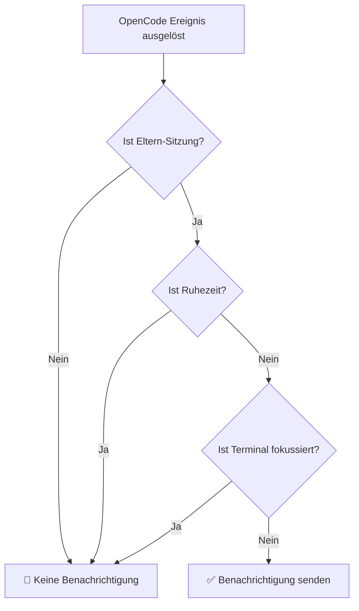

# Ruhezeiten im Detail: Vermeidung von Störungen zu bestimmten Zeiten

## Was Sie nach diesem Tutorial können

- Ruhezeiten in der Konfigurationsdatei aktivieren, um Störungen während der Ruhezeit zu vermeiden
- Die Funktionsweise und Zeitberechnungslogik von Ruhezeiten verstehen
- Übergreifende Mitternachtszeiten konfigurieren (z.B. 22:00 - 08:00)
- Die Prioritätsbeziehung zwischen Ruhezeiten und anderen intelligenten Filtermechanismen verstehen

## Ihr aktuelles Dilemma

Möglicherweise haben Sie diese Situation schon erlebt: Sie haben um 22 Uhr eine Aufgabe an die KI delegiert und sich dann zur Ruhe gelegt. Um 2 Uhr nachts beendet die KI die Aufgabe und ein "Ding"-Benachrichtigungsgeräusch weckt Sie. Oder Sie lassen die KI während der Mittagspause einige Dateien verarbeiten, und um 12:05 Uhr ertönt die Benachrichtigung und unterbricht Ihre Pause.

::: info Was sind Ruhezeiten?
Ruhezeiten sind eine Zeitraum-Konfiguration, innerhalb derer opencode-notify alle Benachrichtigungen stoppt, um Erinnerungen zu vermeiden, die zu Zeiten eintreffen, zu denen Sie nicht gestört werden möchten.
:::

## Wann sollten Sie diese Funktion nutzen?

- **Nächtliche Ruhe**: 22:00 - 08:00 einstellen, um Störungen während des Schlafens zu vermeiden
- **Mittagspause**: 12:00 - 13:00 einstellen, um Störungen während der Mittagspause zu vermeiden
- **Konzentrierte Arbeitszeit**: 09:00 - 12:00 einstellen, um Unterbrechungen durch Benachrichtigungen während von Meetings zu vermeiden
- **Keine Arbeit am Wochenende**: Das gesamte Wochenende als Ruhezeit einstellen

Ruhezeiten eignen sich am besten zum Schützen Ihrer Ruhe- oder konzentrierten Arbeitszeiten, damit die KI Aufgaben im Hintergrund still erledigen kann, während Sie bereit sind, die Ergebnisse zu überprüfen.

## Kernkonzept

Die Funktionsweise von Ruhezeiten ist einfach:

1. **Zeitüberprüfung**: Vor jedem Benachrichtigungsversuch prüft das Plugin, ob die aktuelle Zeit innerhalb der konfigurierten Ruhezeit liegt
2. **Zeitraum-Unterstützung**: Unterstützt beliebige Zeiträume, einschließlich übergreifender Mitternachtszeiträume (z.B. 22:00 - 08:00)
3. **Mittlere Priorität**: Die Priorität der Ruhezeit-Überprüfung liegt unter der Eltern-Sitzungs-Überprüfung, aber über der Terminal-Fokus-Erkennung. Wenn es sich um eine untergeordnete Sitzung handelt und `notifyChildSessions` auf false gesetzt ist, wird die Ruhezeit-Überprüfung übersprungen.

::: tip Ruhezeiten vs. Temporäre Deaktivierung
Ruhezeiten sind **regelmäßig wiederkehrende** Zeitkonfigurationen, wie jeden Abend von 22:00 bis 08:00 Uhr. Wenn Sie Benachrichtigungen **temporär deaktivieren** möchten (z.B. für die nächste Stunde), können Sie `"enabled": false` in der Konfigurationsdatei setzen oder die Konfigurationsdatei löschen, um die Standardwerte zurückzusetzen.
:::

## Schritt-für-Schritt-Anleitung

### Schritt 1: Konfigurationsdatei öffnen

Die Konfigurationsdatei befindet sich unter: `~/.config/opencode/kdco-notify.json`

Wenn die Datei nicht existiert, können Sie sie zuerst erstellen:

::: code-group

```bash [macOS/Linux]
vim ~/.config/opencode/kdco-notify.json
```

```powershell [Windows]
notepad $env:USERPROFILE\.config\opencode\kdco-notify.json
```

:::

Sie sollten den Inhalt der Konfigurationsdatei sehen (falls vorhanden) oder eine leere Datei.

### Schritt 2: Ruhezeit-Konfiguration hinzufügen

Fügen Sie den `quietHours`-Abschnitt zur Konfigurationsdatei hinzu oder bearbeiten Sie ihn:

```json
{
  "quietHours": {
    "enabled": true,
    "start": "22:00",
    "end": "08:00"
  }
}
```

**Konfigurationsoptionen-Erklärung**:

| Option | Typ | Standard | Beschreibung |
| --- | --- | --- | --- |
| `enabled` | boolean | `false` | Ob Ruhezeiten aktiviert sind |
| `start` | string | `"22:00"` | Ruhezeit-Startzeit im Format `"HH:MM"` |
| `end` | string | `"08:00"` | Ruhezeit-Endzeit im Format `"HH:MM"` |

### Schritt 3: Konfigurationsdatei speichern

Speichern Sie die Datei und beenden Sie den Editor.

**Kontrollpunkt ✅**: Führen Sie den folgenden Befehl aus, um zu überprüfen, ob das Format der Konfigurationsdatei korrekt ist:

```bash
cat ~/.config/opencode/kdco-notify.json | jq .
```

Sie sollten formatierte JSON-Inhalte sehen, ohne Fehlermeldungen.

::: tip jq nicht installiert?
Wenn der Befehl `jq` nicht auf Ihrem System vorhanden ist, können Sie diese Überprüfung überspringen oder den JSON-Inhalt in einen [JSON-Validator](https://jsonlint.com/) im Browser kopieren.
:::

### Schritt 4: OpenCode neu starten

Nach Änderungen an der Konfigurationsdatei müssen Sie OpenCode neu starten, damit die Änderungen wirksam werden.

**Kontrollpunkt ✅**: Nach dem Neustart lädt OpenCode die Konfiguration automatisch neu.

### Schritt 5: Ruhezeiten testen

Um zu überprüfen, ob die Ruhezeiten funktionieren, können Sie:

1. `start` und `end` auf Werte in der Nähe der aktuellen Zeit setzen (z.B. wenn es jetzt 14:00 Uhr ist, auf 13:55 - 14:05 setzen)
2. Eine einfache Aufgabe an die KI delegieren
3. Auf die Aufgabenabschluss warten

Sie sollten sehen: **Während der Ruhezeit werden keine Benachrichtigungen gesendet**.

**Hinweis**: Wenn die aktuelle Zeit nicht innerhalb der Ruhezeit liegt oder `enabled` auf `false` gesetzt ist, werden Benachrichtigungen normal empfangen.

### Schritt 6: Auf häufige Konfiguration zurücksetzen

Nach Abschluss des Tests setzen Sie die Konfiguration auf die gewünschte Zeit zurück (z.B. 22:00 - 08:00 Uhr):

```json
{
  "quietHours": {
    "enabled": true,
    "start": "22:00",
    "end": "08:00"
  }
}
```

Speichern Sie die Konfigurationsdatei und starten Sie OpenCode neu.

## Fehlerbehebung

### Häufiger Fehler 1: Ruhezeiten nicht aktiviert

**Problem**: `start` und `end` sind konfiguriert, aber Benachrichtigungen werden weiterhin empfangen.

**Ursache**: Das Feld `enabled` ist auf `false` gesetzt oder nicht vorhanden.

**Lösung**: Stellen Sie sicher, dass `enabled` auf `true` gesetzt ist:

```json
{
  "quietHours": {
    "enabled": true,
    "start": "22:00",
    "end": "08:00"
  }
}
```

### Häufiger Fehler 2: Falsches Zeitformat

**Problem**: Konfiguration funktioniert nicht oder es gibt Fehler beim Start.

**Ursache**: Zeitformat ist nicht `"HH:MM"`, oder es wird das 12-Stunden-Format (AM/PM) verwendet.

**Falsches Beispiel**:
```json
{
  "start": "10 PM",  // ❌ Fehler: AM/PM nicht unterstützt
  "end": "8:00"      // ⚠️ Funktioniert, aber "08:00" für Konsistenz empfohlen
}
```

**Richtiges Beispiel**:
```json
{
  "start": "22:00",  // ✅ Richtig: 24-Stunden-Format, führende Nullen empfohlen
  "end": "08:00"     // ✅ Richtig: 24-Stunden-Format, führende Nullen empfohlen
}
```

### Häufiger Fehler 3: Missverständnis bei übergreifenden Mitternachtszeiten

**Problem**: 22:00 - 08:00 ist eingestellt, aber tagsüber werden bestimmte Zeiträume ebenfalls stumm geschaltet.

**Ursache**: Irrtümliche Annahme, dass `start` kleiner als `end` sein muss, führt zu Fehlern bei der Zeitraumberechnung.

**Richtiges Verständnis**:
- 22:00 - 08:00 bedeutet: **22:00 Uhr abends bis 08:00 Uhr morgens am nächsten Tag**
- Dies ist ein übergreifender Mitternachtszeitraum, das Plugin erkennt dies automatisch
- Nicht 08:00 - 22:00 (bei dieser Einstellung würde der gesamte Tag stumm geschaltet)

::: tip Überprüfung übergreifender Mitternachtszeiträume
Wenn Sie überprüfen möchten, ob übergreifende Mitternachtszeiträume korrekt konfiguriert sind, können Sie in der Konfigurationsdatei einen kurzen Testzeitraum (z.B. 10 Minuten) einstellen und beobachten, ob innerhalb des erwarteten Zeitraums keine Benachrichtigungen empfangen werden.
:::

### Häufiger Fehler 4: OpenCode nicht neu gestartet

**Problem**: Nach Änderungen an der Konfigurationsdatei arbeiten Ruhezeiten weiterhin mit der alten Konfiguration.

**Ursache**: Die Konfigurationsdatei wird einmal beim Plugin-Start geladen und überwacht keine Echtzeit-Änderungen der Datei.

**Lösung**: Nach jeder Änderung der Konfigurationsdatei muss OpenCode neu gestartet werden, damit die Änderungen wirksam werden.

## Beziehung zwischen Ruhezeiten und anderen Filtermechanismen

Die Position von Ruhezeiten im intelligenten Filtermechanismus:



**Wichtige Punkte**:

1. **Mittlere Priorität der Ruhezeit**: Die Eltern-Sitzungs-Überprüfung hat die höchste Priorität, gefolgt von der Ruhezeit. Wenn es sich um eine untergeordnete Sitzung handelt und `notifyChildSessions` auf false gesetzt ist, wird die Ruhezeit-Überprüfung übersprungen. Nach bestandener Eltern-Sitzungs-Überprüfung wird keine Benachrichtigung gesendet, unabhängig davon, ob das Terminal fokussiert ist, solange es sich in der Ruhezeit befindet.
2. **Unabhängig von Terminal-Fokus-Erkennung**: Selbst wenn das Terminal nicht fokussiert ist, werden innerhalb der Ruhezeit keine Benachrichtigungen gesendet
3. **Ausführungsreihenfolge**: Die Eltern-Sitzungs-Überprüfung erfolgt vor der Ruhezeit. Wenn die Eltern-Sitzungs-Überprüfung bestanden ist (d.h. es handelt sich um eine Eltern-Sitzung oder `notifyChildSessions` ist auf true gesetzt), wird die Ruhezeit-Überprüfung fortgesetzt.

::: warning Besonderer Fall: Berechtigungsanfragen und Fragen
Berechtigungsanfragen (`permission.updated`) und Fragen (`tool.execute.before`) werden im Quellcode **ebenfalls durch Ruhezeiten eingeschränkt**. Dies bedeutet, dass innerhalb der Ruhezeit keine Benachrichtigungen gesendet werden, auch wenn die KI auf Ihre Autorisierung oder Antwort wartet.
:::

## Häufige Konfigurationsbeispiele

### Beispiel 1: Nächtliche Ruhe

Konfigurieren Sie 22:00 Uhr bis 08:00 Uhr als Ruhezeit:

```json
{
  "quietHours": {
    "enabled": true,
    "start": "22:00",
    "end": "08:00"
  }
}
```

### Beispiel 2: Mittagspause

Konfigurieren Sie 12:00 Uhr bis 13:00 Uhr als Ruhezeit:

```json
{
  "quietHours": {
    "enabled": true,
    "start": "12:00",
    "end": "13:00"
  }
}
```

### Beispiel 3: Konzentrierte Arbeitszeit

Konfigurieren Sie 09:00 Uhr bis 12:00 Uhr als Ruhezeit (z.B. um während Meetings nicht durch Benachrichtigungen unterbrochen zu werden):

```json
{
  "quietHours": {
    "enabled": true,
    "start": "09:00",
    "end": "12:00"
  }
}
```

### Beispiel 4: Vollständige Konfiguration

Verwendung von Ruhezeiten zusammen mit anderen Konfigurationsoptionen:

```json
{
  "enabled": true,
  "notifyChildSessions": false,
  "suppressWhenFocused": true,
  "sounds": {
    "idle": "Glass",
    "error": "Basso",
    "permission": "Submarine"
  },
  "quietHours": {
    "enabled": true,
    "start": "22:00",
    "end": "08:00"
  },
  "terminal": "ghostty"
}
```

## Zusammenfassung

Ruhezeiten sind eine wichtige Funktion von opencode-notify, um Störungen zu bestimmten Zeiten zu vermeiden:

1. **Konfigurationsmethode**: Konfigurieren Sie den `quietHours`-Abschnitt in `~/.config/opencode/kdco-notify.json`
2. **Zeitformat**: Verwenden Sie das 24-Stunden-Format `"HH:MM"`, z.B. `"22:00"` und `"08:00"`
3. **Übergreifende Mitternachts-Unterstützung**: Unterstützung für übergreifende Mitternachtszeiträume, z.B. `"22:00" - "08:00"` bedeutet 22:00 Uhr abends bis 08:00 Uhr am nächsten Morgen
4. **Ausführungsreihenfolge**: Eltern-Sitzungs-Überprüfung → Ruhezeit → Terminal-Fokus-Erkennung. Ruhezeiten werden erst wirksam, nachdem die Eltern-Sitzungs-Überprüfung bestanden wurde
5. **Neustart erforderlich**: Nach Änderungen an der Konfigurationsdatei muss OpenCode neu gestartet werden, damit die Änderungen wirksam werden

Durch eine sinnvolle Konfiguration der Ruhezeiten können Sie die KI während der Ruhezeit oder konzentrierter Arbeit im Hintergrund still ihre Aufgaben erledigen lassen, und die Ergebnisse überprüfen, wenn Sie bereit sind.

## Nächste Lektion

> In der nächsten Lektion lernen Sie **[Terminal-Erkennungsprinzip](../terminal-detection/)**.
>
> Sie werden lernen:
> - Wie opencode-notify automatisch Ihr verwendetes Terminal erkennt
> - Die Liste der unterstützten 37+ Terminal-Emulatoren
> - Methoden zur manuellen Angabe des Terminal-Typs
> - Das Implementierungsprinzip der macOS-Fokus-Erkennung

---

## Anhang: Quellcode-Referenz

<details>
<summary><strong>Klicken Sie zum Aufklappen, um die Quellcode-Position anzuzeigen</strong></summary>

> Aktualisiert am: 2026-01-27

| Funktion | Dateipfad | Zeilennummer |
| --- | --- | --- |
| Ruhezeit-Überprüfung | [`src/notify.ts`](https://github.com/kdcokenny/opencode-notify/blob/main/src/notify.ts#L181-L199) | 181-199 |
| Konfigurations-Schnittstellen-Definition | [`src/notify.ts`](https://github.com/kdcokenny/opencode-notify/blob/main/src/notify.ts#L30-L48) | 30-48 |
| Standard-Konfiguration | [`src/notify.ts`](https://github.com/kdcokenny/opencode-notify/blob/main/src/notify.ts#L56-L68) | 56-68 |
| Ruhezeit-Überprüfung bei Aufgabenabschluss | [`src/notify.ts`](https://github.com/kdcokenny/opencode-notify/blob/main/src/notify.ts#L262) | 262 |
| Ruhezeit-Überprüfung bei Fehlerbenachrichtigung | [`src/notify.ts`](https://github.com/kdcokenny/opencode-notify/blob/main/src/notify.ts#L300) | 300 |
| Ruhezeit-Überprüfung bei Berechtigungsanfrage | [`src/notify.ts`](https://github.com/kdcokenny/opencode-notify/blob/main/src/notify.ts#L323) | 323 |
| Ruhezeit-Überprüfung bei Fragen | [`src/notify.ts`](https://github.com/kdcokenny/opencode-notify/blob/main/src/notify.ts#L341) | 341 |

**Wichtige Konstanten**:

- `DEFAULT_CONFIG.quietHours`: Standard-Ruhezeit-Konfiguration (Zeilen 63-67)
  - `enabled: false`: Ruhezeiten standardmäßig deaktiviert
  - `start: "22:00"`: Standard-Ruhezeit-Startzeit
  - `end: "08:00"`: Standard-Ruhezeit-Endzeit

**Wichtige Funktionen**:

- `isQuietHours(config: NotifyConfig): boolean`: Überprüft, ob die aktuelle Zeit innerhalb der Ruhezeit liegt (Zeilen 181-199)
  - Überprüft zunächst, ob `config.quietHours.enabled` auf `true` gesetzt ist
  - Konvertiert die aktuelle Zeit in Minuten
  - Konvertiert Start- und Endzeit in Minuten
  - Verarbeitet übergreifende Mitternachtszeiträume (`startMinutes > endMinutes`)
  - Gibt `true` zurück, wenn innerhalb der Ruhezeit, `false` wenn nicht

**Geschäftsregeln**:

- BR-1-3: Keine Benachrichtigungen während der Ruhezeit (`notify.ts:262`)
- BR-3-2: Ruhezeiten unterstützen übergreifende Mitternachtszeiträume (z.B. 22:00-08:00) (`notify.ts:193-196`)
- BR-4-1: Keine Benachrichtigung, wenn die aktuelle Zeit innerhalb der Ruhezeit liegt (`notify.ts:182-198`)
- BR-4-2: Unterstützung für übergreifende Mitternachtszeiträume (z.B. 22:00-08:00) (`notify.ts:194-196`)

</details>
