# Terminal-Erkennung: Automatische Identifikation und macOS-Fokus-Erkennung im Detail

## Was Sie lernen werden

- Tiefgreifendes Verständnis des automatischen Terminal-Erkennungsmechanismus und seiner Implementierung
- Technische Details der macOS-Fokus-Erkennung und dynamischen Bundle-ID-Ermittlung
- Manuelle Terminal-Überschreibung zur Lösung von Erkennungsproblemen
- Unterschiede der Erkennung auf verschiedenen Plattformen (macOS/Windows/Linux)
- Verständnis des Quellcodes zur Terminal-Erkennung

## Ihre aktuelle Herausforderung

Sie wissen bereits, dass opencode-notify über 37 Terminals unterstützt und dass Sie den Terminal-Typ manuell angeben können. Aber Sie möchten mehr erfahren:

- Wie funktioniert die Terminal-Erkennung auf niedriger Ebene?
- Welcher Mechanismus steckt hinter der macOS-Fokus-Erkennung?
- Warum benötigt macOS eine Bundle-ID, während Windows/Linux diese nicht brauchen?
- Wie geht das Plugin mit fehlgeschlagener automatischer Erkennung um?
- Wie werden Terminal-Multiplexer wie tmux erkannt?

Diese Lektion führt Sie durch den Quellcode und beantwortet diese technischen Fragen.

## Kernkonzept

Die Terminal-Erkennung ist in drei Schichten implementiert:

```
1. Automatische Erkennungsschicht: detect-terminal-Bibliothek identifiziert den Terminal-Typ
    ↓
2. Plattform-Adaptionsschicht: Spezifische Behandlung für macOS/Windows/Linux
    ↓
3. Funktionserweiterungsschicht: Fokus-Erkennung, Klick-Fokussierung, Bundle-ID-Ermittlung
```

**Wichtige Designprinzipien**:

- **Einmalige Erkennung beim Start**: Das Plugin erkennt das Terminal beim Start und cached das Ergebnis für alle nachfolgenden Benachrichtigungen (Performance-Optimierung)
- **Konfiguration hat Vorrang**: Manuell angegebene `terminal`-Konfiguration hat Vorrang vor automatischer Erkennung
- **Graceful Degradation**: Bei fehlgeschlagener Erkennung werden Benachrichtigungen nicht blockiert, nur die intelligente Filterung wird deaktiviert
- **Plattformspezifische Anpassung**: macOS unterstützt alle Funktionen, Windows/Linux unterstützen Basis-Benachrichtigungen

::: info Warum Erkennung beim Start?
Die Terminal-Erkennung umfasst Prozess-Scanning und osascript-Aufrufe. Würde dies vor jeder Benachrichtigung durchgeführt, entstünde erheblicher Performance-Overhead. Daher erkennt das Plugin einmalig beim Start, cached das `TerminalInfo`-Objekt und verwendet diesen Cache für alle nachfolgenden Benachrichtigungen.
:::

## Der vollständige Erkennungsprozess

### Quellcode-Analyse: detectTerminalInfo()

Analysieren wir die Kernfunktion Zeile für Zeile:

```typescript
// src/notify.ts:145-164
async function detectTerminalInfo(config: NotifyConfig): Promise<TerminalInfo> {
    // Use config override if provided
    const terminalName = config.terminal || detectTerminal() || null

    if (!terminalName) {
        return { name: null, bundleId: null, processName: null }
    }

    // Get process name for focus detection
    const processName = TERMINAL_PROCESS_NAMES[terminalName.toLowerCase()] || terminalName

    // Dynamically get bundle ID from macOS (no hardcoding!)
    const bundleId = await getBundleId(processName)

    return {
        name: terminalName,
        bundleId,
        processName,
    }
}
```

**Schrittweise Aufschlüsselung**:

| Schritt | Code | Beschreibung |
| --- | --- | --- |
| 1 | `config.terminal \|\| detectTerminal()` | Konfiguration hat Vorrang, sonst automatische Erkennung |
| 2 | `!terminalName ? return {...}` | Bei fehlgeschlagener Erkennung leeres Objekt zurückgeben |
| 3 | `TERMINAL_PROCESS_NAMES[...]` | Mapping-Tabelle für macOS-Prozessnamen durchsuchen |
| 4 | `await getBundleId()` | Bundle-ID dynamisch von macOS abrufen |
| 5 | `return { name, bundleId, processName }` | Vollständige Terminal-Informationen zurückgeben |

**Struktur des zurückgegebenen `TerminalInfo`**:

```typescript
interface TerminalInfo {
    name: string | null       // Terminal-Name, z.B. "ghostty"
    bundleId: string | null   // macOS Bundle-ID, z.B. "com.mitchellh.ghostty"
    processName: string | null // macOS-Prozessname, z.B. "Ghostty"
}
```

::: details Warum benötigt macOS drei Felder?
- **name**: Allgemeiner Name des Terminals (von der detect-terminal-Bibliothek)
- **processName**: Prozessname im macOS-Prozessmanager (für Fokus-Erkennung)
- **bundleId**: Eindeutiger Bezeichner der macOS-Anwendung (für Klick-Fokussierung)

Beispiel:
- `name = "ghostty"` (von detect-terminal zurückgegeben)
- `processName = "Ghostty"` (aus Mapping-Tabelle)
- `bundleId = "com.mitchellh.ghostty"` (dynamisch per osascript abgefragt)
:::

## Funktionsweise der detect-terminal-Bibliothek

### Was ist detect-terminal?

`detect-terminal` ist eine Node.js-Bibliothek zur Identifikation von Terminal-Emulatoren. Sie erkennt das aktuelle Terminal durch Scannen von Systemprozessen.

**Erkennungsmethoden**:

1. **Prozess-Scanning**: Überprüfung der Elternprozess-Kette des aktuellen Prozesses
2. **Umgebungsvariablen-Erkennung**: Prüfung von `TERM`, `TERM_PROGRAM` und anderen Umgebungsvariablen
3. **Bekannte Prozessnamen-Abgleich**: Vergleich mit Prozessnamen von über 37 bekannten Terminals

**Unterstützte Erkennungsmethoden**:

```typescript
// detect-terminal interne Logik (vereinfacht)
function detect() {
    // 1. Umgebungsvariablen prüfen
    if (process.env.TERM_PROGRAM) {
        return process.env.TERM_PROGRAM
    }

    // 2. Elternprozess-Kette scannen
    const parentProcess = getParentProcess()
    if (isKnownTerminal(parentProcess.name)) {
        return parentProcess.name
    }

    // 3. Spezifische Umgebungsvariablen prüfen
    if (process.env.TMUX) return 'tmux'
    if (process.env.VSCODE_PID) return 'vscode'

    return null
}
```

**Anzahl unterstützter Terminals**: 37+ (siehe [vollständige Liste](https://github.com/jonschlinkert/detect-terminal#supported-terminals))

## macOS-spezifische Behandlung

### 1. Prozessnamen-Mapping-Tabelle

Im Quellcode ist ein Mapping von Terminal-Namen zu macOS-Prozessnamen definiert:

```typescript
// src/notify.ts:71-84
const TERMINAL_PROCESS_NAMES: Record<string, string> = {
    ghostty: "Ghostty",
    kitty: "kitty",
    iterm: "iTerm2",
    iterm2: "iTerm2",
    wezterm: "WezTerm",
    alacritty: "Alacritty",
    terminal: "Terminal",
    apple_terminal: "Terminal",
    hyper: "Hyper",
    warp: "Warp",
    vscode: "Code",
    "vscode-insiders": "Code - Insiders",
}
```

**Warum ist eine Mapping-Tabelle erforderlich?**

- detect-terminal gibt Terminal-Namen möglicherweise in Kleinbuchstaben oder abgekürzt zurück (z.B. `"ghostty"`)
- Prozessnamen im macOS-Prozessmanager können unterschiedliche Groß-/Kleinschreibung haben (z.B. `"Ghostty"`)
- Einige Terminals haben mehrere Schreibweisen (z.B. `"iterm"` und `"iterm2"` entsprechen beide `"iTerm2"`)

**Mapping-Logik**:

```typescript
const processName = TERMINAL_PROCESS_NAMES[terminalName.toLowerCase()] || terminalName
```

- Zuerst wird der Terminal-Name in Kleinbuchstaben konvertiert und in der Mapping-Tabelle gesucht
- Bei Treffer wird der gemappte Prozessname verwendet
- Ohne Treffer wird der ursprüngliche Terminal-Name verwendet

### 2. Dynamische Bundle-ID-Ermittlung

**Quellcode-Implementierung**:

```typescript
// src/notify.ts:135-137
async function getBundleId(appName: string): Promise<string | null> {
    return runOsascript(`id of application "${appName}"`)
}
```

**osascript-Befehl**:

```applescript
id of application "Ghostty"
-- Gibt zurück: com.mitchellh.ghostty
```

**Warum keine hartcodierten Bundle-IDs?**

Nachteile der Hartcodierung:
- ❌ Bundle-IDs können sich bei Terminal-Updates ändern
- ❌ Manuelle Pflege einer Liste von 37+ Terminal-Bundle-IDs erforderlich
- ❌ Code-Updates bei neuen Terminal-Releases nötig

Vorteile der dynamischen Ermittlung:
- ✅ Automatische Anpassung an Terminal-Versionsänderungen
- ✅ Reduzierter Wartungsaufwand
- ✅ Theoretische Unterstützung für jedes macOS-Terminal

### 3. Fokus-Erkennung-Implementierung

**Quellcode-Implementierung**:

```typescript
// src/notify.ts:139-143
async function getFrontmostApp(): Promise<string | null> {
    return runOsascript(
        'tell application "System Events" to get name of first application process whose frontmost is true',
    )
}

// src/notify.ts:166-175
async function isTerminalFocused(terminalInfo: TerminalInfo): Promise<boolean> {
    if (!terminalInfo.processName) return false
    if (process.platform !== "darwin") return false

    const frontmost = await getFrontmostApp()
    if (!frontmost) return false

    // Case-insensitive comparison
    return frontmost.toLowerCase() === terminalInfo.processName.toLowerCase()
}
```

**osascript-Befehl**:

```applescript
tell application "System Events" to get name of first application process whose frontmost is true
-- Gibt zurück: Ghostty
```

**Erkennungsablauf**:

```
1. Plattform prüfen: Nicht-macOS gibt direkt false zurück
    ↓
2. processName prüfen: Ohne Prozessnamen direkt false zurück
    ↓
3. Vordergrund-App ermitteln: Per osascript abfragen
    ↓
4. Prozessnamen vergleichen: Groß-/Kleinschreibung ignorieren
    ↓
5. Ergebnis zurückgeben: Gleich = fokussiert, unterschiedlich = nicht fokussiert
```

**Verwendung im Benachrichtigungs-Workflow**:

```typescript
// src/notify.ts:264-265
// Check if terminal is focused (suppress notification if user is already looking)
if (await isTerminalFocused(terminalInfo)) return
```

Wenn das Terminal im Vordergrund ist, unterdrückt das Plugin die Benachrichtigung, um redundante Hinweise zu vermeiden.

## Konfigurationsüberschreibung

### Wann ist eine manuelle Überschreibung erforderlich?

**Anwendungsfälle**:

1. **Fehlgeschlagene automatische Erkennung**: detect-terminal kann Ihr Terminal nicht identifizieren
2. **Verschachtelte Terminal-Szenarien**: Bei Verwendung von Alacritty in tmux soll tmux erkannt werden
3. **Ungenaue Erkennung**: Falsche Identifikation als anderes Terminal

### Konfigurationsmethode

**Konfigurationsdatei**: `~/.config/opencode/kdco-notify.json`

```json
{
  "terminal": "ghostty"
}
```

**Prioritätslogik** (Quellcode Zeile 147):

```typescript
const terminalName = config.terminal || detectTerminal() || null
```

**Prioritätsreihenfolge**:

1. **Konfigurationsüberschreibung** (`config.terminal`): Höchste Priorität
2. **Automatische Erkennung** (`detectTerminal()`): Zweite Priorität
3. **Fallback-Behandlung** (`null`): Bei fehlgeschlagener Erkennung wird null verwendet

::: tip Anwendungsfälle für Konfigurationsüberschreibung
Wenn Ihr Terminal korrekt erkannt wird, wird eine **manuelle Überschreibung nicht empfohlen**. Die Konfigurationsüberschreibung dient hauptsächlich zur Lösung von Erkennungsfehlern oder speziellen Szenarien.
:::

## Plattformvergleich

### macOS

| Funktion | Unterstützung | Implementierung |
| --- | --- | --- |
| Native Benachrichtigungen | ✅ | node-notifier (NSUserNotificationCenter) |
| Terminal-Erkennung | ✅ | detect-terminal-Bibliothek |
| Fokus-Erkennung | ✅ | osascript-Abfrage der Vordergrund-App |
| Klick-Fokussierung | ✅ | node-notifier activate-Parameter |
| Bundle-ID-Ermittlung | ✅ | Dynamische osascript-Abfrage |
| Benutzerdefinierte Sounds | ✅ | node-notifier sound-Parameter |

**Vollständiger Ablauf**:


### Windows

| Funktion | Unterstützung | Implementierung |
| --- | --- | --- |
| Native Benachrichtigungen | ✅ | node-notifier (SnoreToast) |
| Terminal-Erkennung | ✅ | detect-terminal-Bibliothek |
| Fokus-Erkennung | ❌ | Systembeschränkung |
| Klick-Fokussierung | ❌ | Systembeschränkung |
| Bundle-ID-Ermittlung | ❌ | Konzept existiert nicht unter Windows |
| Benutzerdefinierte Sounds | ❌ | Verwendet System-Standardsound |

**Vereinfachter Ablauf**:

```mermaid
graph LR
    A[Terminal erkennen] --> B[TerminalInfo cachen]
    B --> C[Ereignis ausgelöst]
    C --> D{Ruhezeit?}
    D -->|Ja| E[🚫 Benachrichtigung unterdrücken]
    D -->|Nein| F[Benachrichtigung senden]
    F --> G[Benachrichtigung verschwindet automatisch]
```



### Linux

| Funktion | Unterstützung | Implementierung |
| --- | --- | --- |
| Native Benachrichtigungen | ✅ | node-notifier (notify-send) |
| Terminal-Erkennung | ✅ | detect-terminal-Bibliothek |
| Fokus-Erkennung | ❌ | Systembeschränkung |
| Klick-Fokussierung | ❌ | Systembeschränkung |
| Bundle-ID-Ermittlung | ❌ | Konzept existiert nicht unter Linux |
| Benutzerdefinierte Sounds | ❌ | Verwendet Desktop-Umgebungs-Standardsound |

**Der Ablauf ist identisch mit Windows**, nur das Benachrichtigungs-Backend verwendet `notify-send`.

## Behandlung fehlgeschlagener Erkennung

### Quellcode-Logik

Bei fehlgeschlagener Erkennung gibt `detectTerminalInfo()` ein leeres Objekt zurück:

```typescript
if (!terminalName) {
    return { name: null, bundleId: null, processName: null }
}
```

### Auswirkungen auf Benachrichtigungsfunktionen

| Funktion | Verhalten nach fehlgeschlagener Erkennung |
| --- | --- |
| Native Benachrichtigungen | ✅ **Funktioniert normal** (unabhängig von Terminal-Erkennung) |
| Fokus-Erkennung | ❌ **Deaktiviert** (`isTerminalFocused()` gibt direkt false zurück) |
| Klick-Fokussierung | ❌ **Deaktiviert** (`bundleId` ist null, activate-Parameter wird nicht gesetzt) |
| Ruhezeit | ✅ **Funktioniert normal** (unabhängig von Terminal-Erkennung) |
| Eltern-Sitzungsprüfung | ✅ **Funktioniert normal** (unabhängig von Terminal-Erkennung) |

**Beispielcode**:

```typescript
// src/notify.ts:166-175
async function isTerminalFocused(terminalInfo: TerminalInfo): Promise<boolean> {
    if (!terminalInfo.processName) return false  // ← Bei fehlgeschlagener Erkennung direkt false
    if (process.platform !== "darwin") return false
    // ...
}

// src/notify.ts:238-240
if (process.platform === "darwin" && terminalInfo.bundleId) {
    notifyOptions.activate = terminalInfo.bundleId  // ← Bei null bundleId nicht gesetzt
}
```

### Wie überprüft man den Erkennungsstatus?

**Temporäre Debug-Methode** (erfordert Quellcode-Änderung):

```typescript
// Am Plugin-Export in notify.ts hinzufügen
export const NotifyPlugin: Plugin = async (ctx) => {
    const { client } = ctx
    const config = await loadConfig()
    const terminalInfo = await detectTerminalInfo(config)

    // 👇 Debug-Log hinzufügen
    console.log("Terminal Info:", JSON.stringify(terminalInfo, null, 2))

    return {
        // ...
    }
}
```

**Beispiel für normale Ausgabe**:

```json
{
  "name": "ghostty",
  "bundleId": "com.mitchellh.ghostty",
  "processName": "Ghostty"
}
```

**Beispiel für fehlgeschlagene Erkennung**:

```json
{
  "name": null,
  "bundleId": null,
  "processName": null
}
```

## Spezialfall: tmux-Terminal

### Die Besonderheit von tmux

tmux ist ein Terminal-Multiplexer, der es ermöglicht, mehrere Sitzungen und Fenster in einem einzigen Terminal-Fenster zu erstellen.

**Erkennungsmethode**:

```typescript
// detect-terminal-Bibliothek erkennt tmux über Umgebungsvariable
if (process.env.TMUX) return 'tmux'
```

**Auswirkungen auf den Workflow**:

Wie in `terminals/index.md` erwähnt, wird bei tmux-Workflows keine Fokus-Erkennung durchgeführt. Die Gründe:

1. **Multi-Fenster-Szenarien**: tmux kann in mehreren Terminal-Fenstern laufen
2. **Unklare Fokus-Semantik**: Es ist nicht feststellbar, welches tmux-Fenster der Benutzer gerade betrachtet
3. **Benutzererfahrung**: Vermeidung der Unterdrückung wichtiger Benachrichtigungen

**Quellcode-Beleg** (`handleQuestionAsked`-Funktion):

```typescript
// src/notify.ts:340-341
// Guard: quiet hours only (no focus check for questions - tmux workflow)
if (isQuietHours(config)) return
```

Hinweis: Für `question`-Ereignisse kommentiert der Quellcode explizit "no focus check for questions - tmux workflow".

## Best Practices für manuelle Terminal-Konfiguration

### Auswahl des richtigen Terminal-Namens

**Prinzip**: Verwenden Sie die von der detect-terminal-Bibliothek erkannten Standardnamen.

**Häufige Zuordnungstabelle**:

| Ihr Terminal | Konfigurationswert | Erkennungsergebnis (detect-terminal) |
| --- | --- | --- |
| Ghostty | `"ghostty"` | ✅ |
| iTerm2 | `"iterm2"` oder `"iterm"` | ✅ |
| Kitty | `"kitty"` | ✅ |
| WezTerm | `"wezterm"` | ✅ |
| Alacritty | `"alacritty"` | ✅ |
| macOS Terminal.app | `"terminal"` oder `"apple_terminal"` | ✅ |
| Hyper | `"hyper"` | ✅ |
| Warp | `"warp"` | ✅ |
| VS Code Stable | `"vscode"` | ✅ |
| VS Code Insiders | `"vscode-insiders"` | ✅ |
| Windows Terminal | `"windows-terminal"` oder `"Windows Terminal"` | ⚠️ Möglicherweise beide Varianten testen |

### Überprüfung der Konfiguration

**Methode 1: Log-Überprüfung**

Bei aktiviertem Debug-Logging (siehe oben) sollten Sie sehen:

```json
{
  "name": "ghostty",  // ← Sollte Ihr konfigurierter Terminal-Name sein
  "bundleId": "com.mitchellh.ghostty",
  "processName": "Ghostty"
}
```

**Methode 2: Funktionstest**

1. Nach Konfiguration des Terminal-Typs OpenCode neu starten
2. Eine KI-Aufgabe starten
3. Zu einem anderen Fenster wechseln (Terminal verliert Fokus)
4. Auf Aufgabenabschluss warten

Erwartetes Ergebnis: Sie erhalten eine Benachrichtigung, und ein Klick darauf (macOS) fokussiert das Terminal-Fenster.

## Häufige Probleme

### Problem 1: Erkennung schlägt trotz Konfiguration fehl

**Symptom**: `"terminal": "ghostty"` ist gesetzt, aber Benachrichtigungsfunktionen sind fehlerhaft.

**Fehlerbehebungsschritte**:

1. **JSON-Format prüfen**:

```bash
cat ~/.config/opencode/kdco-notify.json | jq .
```

2. **Terminal-Namen-Schreibweise prüfen**:

- Stellen Sie sicher, dass Kleinbuchstaben verwendet werden (z.B. `"ghostty"` statt `"Ghostty"`)
- Stellen Sie sicher, dass es ein von detect-terminal unterstützter Name ist

3. **OpenCode-Neustart prüfen**:

Nach Änderung der Konfigurationsdatei muss OpenCode neu gestartet werden.

### Problem 2: Ungenaue macOS-Fokus-Erkennung

**Symptom**: Benachrichtigungen erscheinen, obwohl das Terminal im Vordergrund ist, oder erscheinen nicht, obwohl es im Hintergrund ist.

**Mögliche Ursachen**:

1. **Prozessname stimmt nicht überein**:

Prüfen Sie, ob Ihr Terminal-Prozessname in der Mapping-Tabelle enthalten ist:

```typescript
const TERMINAL_PROCESS_NAMES: Record<string, string> = {
    // ... Prüfen Sie, ob Ihr Terminal in der Liste ist
}
```

2. **osascript-Ausführung fehlgeschlagen**:

Manueller Test im Terminal:

```bash
osascript -e 'tell application "System Events" to get name of first application process whose frontmost is true'
```

Sollte den Namen der aktuellen Vordergrund-App zurückgeben (z.B. `Ghostty`).

3. **Groß-/Kleinschreibung**:

Der Quellcode verwendet einen Vergleich ohne Berücksichtigung der Groß-/Kleinschreibung:

```typescript
return frontmost.toLowerCase() === terminalInfo.processName.toLowerCase()
```

Stellen Sie sicher, dass der Prozessname in der Mapping-Tabelle mit dem tatsächlichen Prozessnamen übereinstimmt.

### Problem 3: Manuelle Konfiguration unter Windows/Linux unwirksam

**Symptom**: Unter Windows/Linux ist `"terminal": "xxx"` konfiguriert, aber die Erkennung schlägt weiterhin fehl.

**Erklärung**:

Die Terminal-Erkennung unter Windows/Linux basiert auf der detect-terminal-Bibliothek. Die Konfigurationsüberschreibung ist im Quellcode plattformübergreifend implementiert. Mögliche Ursachen bei Unwirksamkeit:

1. **Falscher Terminal-Name**: Stellen Sie sicher, dass ein von detect-terminal unterstützter Name verwendet wird
2. **Terminal nicht in der Unterstützungsliste**: Siehe [vollständige detect-terminal-Liste](https://github.com/jonschlinkert/detect-terminal#supported-terminals)

**Hinweis**: Windows/Linux unterstützen keine Fokus-Erkennung und Klick-Fokussierung. Selbst bei korrekter Konfiguration wird nur die Terminal-Erkennung beeinflusst, diese Funktionen werden nicht aktiviert.

### Problem 4: Falsche Erkennung bei verschachtelten Terminals

**Szenario**: Verwendung von Alacritty in tmux, gewünschte Erkennung als tmux.

**Symptom**: Automatische Erkennung identifiziert `"alacritty"`, aber Sie möchten `"tmux"`.

**Lösung**:

Manuelle Konfiguration `"terminal": "tmux"`:

```json
{
  "terminal": "tmux"
}
```

**Hinweis**: Mit dieser Konfiguration behandelt das Plugin Sie als tmux-Benutzer und führt keine Fokus-Erkennung durch (entspricht dem tmux-Workflow).

## Zusammenfassung

Die Terminal-Erkennung ist die Grundlage für die intelligente Filterung von opencode-notify:

1. **Erkennungsprozess**: Automatische Terminal-Identifikation beim Start durch die detect-terminal-Bibliothek, Ergebnis wird gecached
2. **macOS-spezifische Behandlung**:
   - Prozessnamen-Mapping-Tabelle (`TERMINAL_PROCESS_NAMES`)
   - Dynamische Bundle-ID-Ermittlung (per osascript)
   - Fokus-Erkennung (Abfrage des Vordergrund-Prozesses)
3. **Konfigurationsüberschreibung**: Manuell angegebener Terminal-Typ hat Vorrang vor automatischer Erkennung
4. **Plattformunterschiede**:
   - macOS: Vollständige Funktionalität (Benachrichtigungen + Fokus-Erkennung + Klick-Fokussierung)
   - Windows/Linux: Basis-Benachrichtigungsfunktionen
5. **Fehlerbehandlung**: Bei fehlgeschlagener Erkennung werden Benachrichtigungen nicht blockiert, nur die intelligente Filterung wird deaktiviert
6. **Spezialfälle**: tmux-Workflow unterstützt keine Fokus-Erkennung, um wichtige Benachrichtigungen nicht zu unterdrücken

**Wichtige Quellcode-Stellen**:

- `detectTerminalInfo()`: Hauptfunktion für Terminal-Erkennung (Zeilen 145-164)
- `TERMINAL_PROCESS_NAMES`: macOS-Prozessnamen-Mapping-Tabelle (Zeilen 71-84)
- `getBundleId()`: Dynamische Bundle-ID-Ermittlung (Zeilen 135-137)
- `isTerminalFocused()`: Fokus-Erkennung-Implementierung (Zeilen 166-175)

## Vorschau auf die nächste Lektion

> In der nächsten Lektion lernen Sie **[Erweiterte Nutzung](../advanced-usage/)**.
>
> Sie werden lernen:
> - Konfigurationstipps und Best Practices
> - Multi-Terminal-Umgebungskonfiguration
> - Performance-Optimierungsempfehlungen
> - Zusammenarbeit mit anderen OpenCode-Plugins

---

## Anhang: Quellcode-Referenz

<details>
<summary><strong>Klicken Sie hier, um die Quellcode-Stellen anzuzeigen</strong></summary>

> Aktualisiert: 2026-01-27

| Funktion | Dateipfad | Zeilen |
| --- | --- | --- |
| Terminal-Erkennung Hauptfunktion | [`src/notify.ts`](https://github.com/kdcokenny/opencode-notify/blob/main/src/notify.ts#L145-L164) | 145-164 |
| macOS-Prozessnamen-Mapping-Tabelle | [`src/notify.ts`](https://github.com/kdcokenny/opencode-notify/blob/main/src/notify.ts#L71-L84) | 71-84 |
| macOS Bundle-ID-Ermittlung | [`src/notify.ts`](https://github.com/kdcokenny/opencode-notify/blob/main/src/notify.ts#L135-L137) | 135-137 |
| macOS Vordergrund-App-Erkennung | [`src/notify.ts`](https://github.com/kdcokenny/opencode-notify/blob/main/src/notify.ts#L139-L143) | 139-143 |
| macOS Fokus-Erkennung | [`src/notify.ts`](https://github.com/kdcokenny/opencode-notify/blob/main/src/notify.ts#L166-L175) | 166-175 |
| osascript-Ausführungs-Wrapper | [`src/notify.ts`](https://github.com/kdcokenny/opencode-notify/blob/main/src/notify.ts#L120-L133) | 120-133 |
| Konfigurations-Interface-Definition | [`src/notify.ts`](https://github.com/kdcokenny/opencode-notify/blob/main/src/notify.ts#L30-L54) | 30-54 |
| Fokus-Erkennung bei Aufgabenabschluss | [`src/notify.ts`](https://github.com/kdcokenny/opencode-notify/blob/main/src/notify.ts#L265) | 265 |
| Fokus-Erkennung bei Fehlerbenachrichtigung | [`src/notify.ts`](https://github.com/kdcokenny/opencode-notify/blob/main/src/notify.ts#L303) | 303 |
| Fokus-Erkennung bei Berechtigungsanfrage | [`src/notify.ts`](https://github.com/kdcokenny/opencode-notify/blob/main/src/notify.ts#L326) | 326 |
| macOS Klick-Fokussierung-Einstellung | [`src/notify.ts`](https://github.com/kdcokenny/opencode-notify/blob/main/src/notify.ts#L238-L240) | 238-240 |
| Terminal-Erkennung beim Plugin-Start | [`src/notify.ts`](https://github.com/kdcokenny/opencode-notify/blob/main/src/notify.ts#L364) | 364 |

**Wichtige Konstanten**:

- `TERMINAL_PROCESS_NAMES`: Mapping von Terminal-Namen zu macOS-Prozessnamen (Zeilen 71-84)
  - `ghostty: "Ghostty"`
  - `kitty: "kitty"`
  - `iterm: "iTerm2"` / `iterm2: "iTerm2"`
  - `wezterm: "WezTerm"`
  - `alacritty: "Alacritty"`
  - `terminal: "Terminal"` / `apple_terminal: "Terminal"`
  - `hyper: "Hyper"`
  - `warp: "Warp"`
  - `vscode: "Code"` / `"vscode-insiders": "Code - Insiders"`

**Wichtige Funktionen**:

- `detectTerminalInfo(config: NotifyConfig): Promise<TerminalInfo>`: Hauptfunktion für Terminal-Erkennung (Zeilen 145-164)
  - Konfigurationsüberschreibung hat Vorrang (`config.terminal`)
  - Ruft detect-terminal-Bibliothek für automatische Erkennung auf
  - Durchsucht Prozessnamen-Mapping-Tabelle
  - Ermittelt Bundle-ID dynamisch (macOS)
  - Gibt vollständiges Terminal-Info-Objekt zurück

- `isTerminalFocused(terminalInfo: TerminalInfo): Promise<boolean>`: Prüft, ob Terminal fokussiert ist (Zeilen 166-175)
  - Plattformprüfung (nur macOS)
  - Prüft, ob processName existiert
  - Ermittelt aktuelle Vordergrund-App (osascript)
  - Vergleicht Prozessnamen ohne Berücksichtigung der Groß-/Kleinschreibung
  - Gibt true zurück, wenn Terminal im Vordergrund ist

- `getBundleId(appName: string): Promise<string | null>`: Ermittelt macOS-App-Bundle-ID dynamisch (Zeilen 135-137)
  - Verwendet osascript zur Abfrage des App-Identifiers
  - Rückgabeformat z.B. `"com.mitchellh.ghostty"`

- `getFrontmostApp(): Promise<string | null>`: Ermittelt macOS-Vordergrund-App-Namen (Zeilen 139-143)
  - Verwendet osascript zur Abfrage von System Events
  - Gibt Prozessnamen der Vordergrund-App zurück

- `runOsascript(script: string): Promise<string | null>`: Führt AppleScript-Befehl aus (Zeilen 120-133)
  - Plattformprüfung (nur macOS)
  - Verwendet Bun.spawn zur Ausführung von osascript
  - Erfasst Ausgabe und gibt sie zurück
  - Gibt bei Ausnahmen null zurück

**Geschäftsregeln**:

- BR-2-1: Verwendet detect-terminal-Bibliothek zur Identifikation von 37+ Terminals (`notify.ts:147`)
- BR-2-2: Mapping-Tabelle von Terminal-Namen zu macOS-Prozessnamen (`notify.ts:71-84`)
- BR-2-3: Bundle-ID wird dynamisch ermittelt, nicht hartcodiert (`notify.ts:135-137`)
- BR-2-4: tmux-Sitzungserkennung über TMUX-Umgebungsvariable (Bibliotheksimplementierung)
- BR-1-2: Benachrichtigung unterdrücken, wenn Terminal fokussiert ist (`notify.ts:265`)
- BR-1-6: macOS unterstützt Klick-Fokussierung auf Terminal (`notify.ts:238-240`)

**Externe Abhängigkeiten**:

- [detect-terminal](https://github.com/jonschlinkert/detect-terminal): Terminal-Erkennungsbibliothek, unterstützt 37+ Terminal-Emulatoren
- [node-notifier](https://github.com/mikaelbr/node-notifier): Plattformübergreifende native Benachrichtigungsbibliothek
- macOS osascript: System-Befehlszeilentool zur Ausführung von AppleScript

</details>
