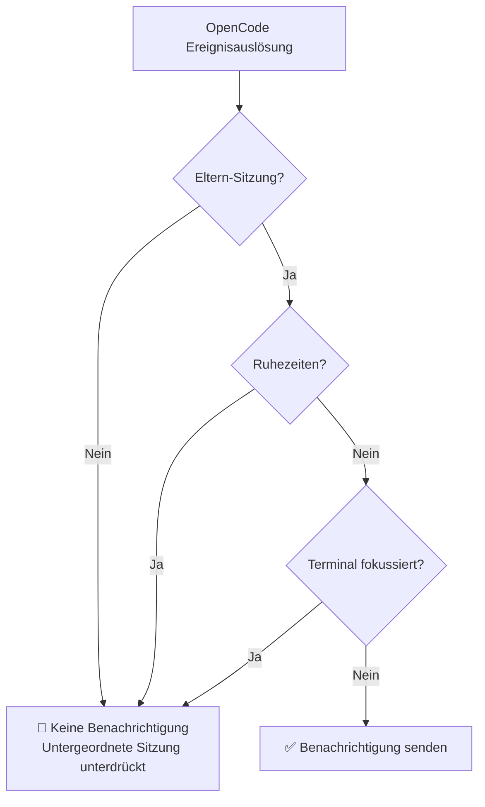
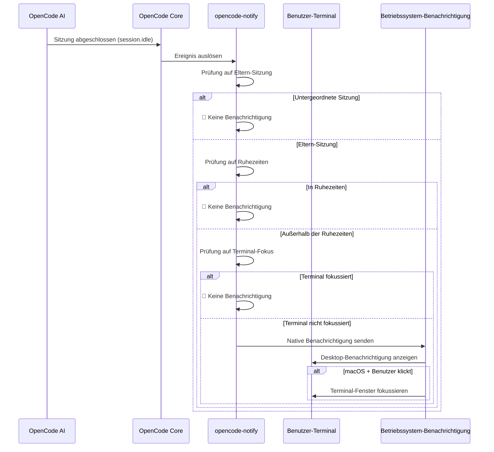

# Funktionsweise: Benachrichtigungen, Filterung und Auslösungsmechanismen

## Was Sie nach diesem Tutorial können

- Verstehen der vier Benachrichtigungstypen von opencode-notify und wann sie ausgelöst werden
- Beherrschen der Funktionsweise des intelligenten Filtersystems (warum Sie nicht zu viele Benachrichtigungen erhalten)
- Verständnis des vollständigen Workflows von der Auslösung bis zur Anzeige
- Wissen, wie Sie das Benachrichtigungsverhalten durch Konfiguration anpassen können

## Kerngedanke

::: tip Designphilosophie
opencode-notify folgt einem grundlegenden Prinzip: **"Benachrichtigen Sie den Nutzer nur, wenn es notwendig ist, nicht bei jedem kleinen Ereignis."**
:::

Die Funktionsweise des Plugins lässt sich in drei Schlüsselbereiche unterteilen:

1. **Überwachung** - Warten auf wichtige OpenCode-Ereignisse
2. **Filterung** - Entscheiden, ob ein Ereignis eine Benachrichtigung erfordert
3. **Versand** - Übermittlung über native Betriebssystem-Benachrichtigungen

Wenn Sie diesen Prozess verstehen, wissen Sie, warum das Plugin rechtzeitig erinnern kann, ohne wie Spam zu übermäßig zu stören.

## Vier Benachrichtigungstypen

opencode-notify überwacht vier Arten von OpenCode-Ereignissen, jede mit klaren Auslösungsszenarien:

### 1. Aufgabenabschluss-Benachrichtigung (session.idle)

**Auslösezeitpunkt**: Wenn eine AI-Sitzung in den Leerlauf wechselt (Aufgabe abgeschlossen)

| Element | Beschreibung |
| --- | --- |
| Benachrichtigungstitel | Ready for review |
| Benachrichtigungsinhalt | Sitzungstitel (max. 50 Zeichen) |
| Standardton | Glass (macOS) |

**Warum wichtig**: Dies ist die am häufigsten verwendete Benachrichtigung, die Sie darüber informiert, dass die AI ihre Aufgabe erledigt hat und Sie das Ergebnis überprüfen können.

### 2. Fehlerbenachrichtigung (session.error)

**Auslösezeitpunkt**: Wenn bei der Ausführung einer AI-Sitzung ein Fehler auftritt

| Element | Beschreibung |
| --- | --- |
| Benachrichtigungstitel | Something went wrong |
| Benachrichtigungsinhalt | Fehlerzusammenfassung (max. 100 Zeichen) |
| Standardton | Basso (macOS) |

**Warum wichtig**: Fehler müssen zeitnah behoben werden, da sonst nachfolgende Operationen möglicherweise nicht ordnungsgemäß ausgeführt werden können.

### 3. Berechtigungsanfragen-Benachrichtigung (permission.updated)

**Auslösezeitpunkt**: Wenn die AI eine Berechtigung benötigt, um eine Operation durchzuführen (z.B. Datei lesen, Netzwerkzugriff)

| Element | Beschreibung |
| --- | --- |
| Benachrichtigungstitel | Waiting for you |
| Benachrichtigungsinhalt | OpenCode needs your input |
| Standardton | Submarine (macOS) |

**Warum wichtig**: Die AI ist blockiert und benötigt Ihre manuelle Genehmigung, um fortzufahren. Ohne Bearbeitung bleibt die Aufgabe stehen.

### 4. Frage-Benachrichtigung (tool.execute.before)

**Auslösezeitpunkt**: Wenn die AI das `question`-Tool verwendet, um Ihnen eine Frage zu stellen

| Element | Beschreibung |
| --- | --- |
| Benachrichtigungstitel | Question for you |
| Benachrichtigungsinhalt | OpenCode needs your input |
| Standardton | Submarine (macOS) |

**Warum wichtig**: Die AI benötigt zusätzliche Informationen, um fortzufahren, z.B. zur Bestätigung einer Entscheidung oder Klärung einer Anforderung.

::: info Priorität der vier Benachrichtigungen
Berechtigungsanfragen und Fragen haben die höchste Priorität, da die AI bei diesen Ereignissen vollständig blockiert ist; Fehlerbenachrichtigungen kommen als Nächstes, da die Aufgabe bereits fehlgeschlagen ist; Aufgabenabschluss-Benachrichtigungen haben relativ gesehen die niedrigste Priorität, da Sie die Ergebnisse zu einem für Sie passenden Zeitpunkt überprüfen können.
:::

## Intelligentes Filtersystem

Dies ist das größte Highlight von opencode-notify – durch mehrschichtige Filterung stellt es sicher, dass Sie nur Benachrichtigungen erhalten, die wirklich Ihre Aufmerksamkeit erfordern.

### Übersicht der Filterebenen



### Ebene 1: Eltern-Sitzungsprüfung

**Regel**: Standardmäßig werden nur Eltern-Sitzungen (Wurzel-Sitzungen) benachrichtigt, nicht untergeordnete Sitzungen.

**Prinzip**: OpenCode-Aufgaben können verschachtelt sein. Wenn Sie die AI beauftragen, "eine Codebasis zu optimieren", kann sie in mehrere Unteraufgaben aufgeteilt werden:
- Eltern-Sitzung: "Optimiere die gesamte Codebasis"
- Untergeordnete Sitzung 1: "Optimiere das src/components Verzeichnis"
- Untergeordnete Sitzung 2: "Optimiere das src/utils Verzeichnis"

Wenn alle untergeordneten Sitzungen benachrichtigen, erhalten Sie eine Flut von Benachrichtigungen. opencode-notify benachrichtigt nur einmal, wenn die Eltern-Sitzung abgeschlossen ist.

::: tip Wann werden untergeordnete Sitzungen benötigt?
Wenn Sie mehrere gleichzeitige Aufgaben einer einzelnen AI überwachen, können Sie in der Konfiguration `notifyChildSessions: true` setzen, um Benachrichtigungen für untergeordnete Sitzungen zu aktivieren.
:::

**Besondere Ausnahmen**:
- **Berechtigungsanfragen-Benachrichtigungen**: Immer benachrichtigen, keine Eltern-Sitzungsprüfung (da Berechtigungsprobleme behandelt werden müssen)
- **Frage-Benachrichtigungen**: Immer benachrichtigen, keine Eltern-Sitzungsprüfung

### Ebene 2: Ruhezeiten-Überprüfung

**Regel**: Innerhalb der konfigurierten Ruhezeiten werden keine Benachrichtigungen gesendet.

**Prinzip**: Vermeidung von Störungen in der Nacht oder während der Ruhezeit. Beispielkonfiguration:

```json
{
  "quietHours": {
    "enabled": true,
    "start": "22:00",
    "end": "08:00"
  }
}
```

**Über-Mitternacht-Unterstützung**: Ruhezeiten können über Mitternacht gehen, z.B. `22:00 - 08:00` wird korrekt als 22:00 Uhr bis 08:00 Uhr am nächsten Tag erkannt.

::: info Priorität der Ruhezeiten-Überprüfung
Die Ruhezeiten-Überprüfung hat die höchste Priorität unter allen Prüfungen. Selbst wenn das Terminal nicht fokussiert ist oder es eine Eltern-Sitzung ist, werden während der Ruhezeiten keine Benachrichtigungen gesendet.
:::

### Ebene 3: Terminal-Fokus-Erkennung

**Regel**: Wenn das Terminal-Fenster das aktive Fenster ist, werden keine Benachrichtigungen gesendet.

**Prinzip**: Wenn Sie gerade auf das Terminal schauen, wird die Fertigstellung der AI direkt auf dem Bildschirm angezeigt, keine zusätzliche Benachrichtigung erforderlich.

**Plattform-Unterstützung**:
- ✅ **macOS**: Vollständig unterstützt, erkennt die Vordergrundanwendung über `osascript`
- ❌ **Windows**: Nicht unterstützt
- ❌ **Linux**: Nicht unterstützt

**Erkennungsmechanismus** (macOS):
1. Verwendung der `detect-terminal`-Bibliothek zur Identifizierung Ihres Terminals (unterstützt 37+ Terminal-Emulatoren)
2. Abfrage von macOS, um die aktuelle Vordergrundanwendung zu erhalten
3. Vergleich mit dem Prozessnamen Ihres Terminals
4. Bei Übereinstimmung wird die Benachrichtigung unterdrückt

**Besondere Ausnahmen**:
- **Frage-Benachrichtigungen**: Keine Fokus-Überprüfung (Unterstützung für tmux-Workflows)

::: tip Unterstützung für tmux-Workflows
Wenn Sie mehrere Fenster in tmux verwenden, werden Frage-Benachrichtigungen nicht durch die Fokus-Erkennung unterdrückt, sodass Sie Erinnerungen erhalten können, während Sie in anderen Fenstern arbeiten.
:::

### macOS-Sonderfunktion: Terminal-Fokus durch Klick auf Benachrichtigung

Unter macOS hat die Benachrichtigung eine zusätzliche Funktion: **Durch Klicken auf die Benachrichtigung wird das Terminal-Fenster automatisch in den Vordergrund gebracht**.

**Prinzip**:
1. Das Plugin erhält die Terminal-Bundle-ID über `osascript` (z.B. `com.ghostty.Ghostty`)
2. Beim Senden der Benachrichtigung wird die `activate`-Option auf diese Bundle-ID gesetzt
3. Beim Klicken auf die Benachrichtigung wird die entsprechende Anwendung automatisch fokussiert

**Unterstützte Terminals**: Ghostty, Kitty, iTerm2, WezTerm, Alacritty, macOS Terminal, Hyper, Warp, VS Code integriertes Terminal usw.

::: info Automatische Terminal-Erkennung
Das Plugin erkennt automatisch Ihr verwendetes Terminal, keine manuelle Konfiguration erforderlich. Falls die automatische Erkennung fehlschlägt, können Sie das `terminal`-Feld in der Konfigurationsdatei manuell festlegen.
:::

## Benachrichtigungs-Trigger-Workflow

### Vollständiger Workflow-Diagramm



### Ereignis-Verarbeitungspriorität

Wenn mehrere Ereignisse gleichzeitig ausgelöst werden, verarbeitet das Plugin sie in folgender Priorität:

1. **Höchste Priorität**: Berechtigungsanfragen (`permission.updated`) - AI ist blockiert, muss behandelt werden
2. **Hohe Priorität**: Fehlerbenachrichtigungen (`session.error`) - Aufgabe fehlgeschlagen, erfordert Aufmerksamkeit
3. **Niedrige Priorität**: Aufgabenabschluss (`session.idle`) - Kann später überprüft werden
4. **Besonderer Fall**: Fragen (`tool.execute.before`) - Priorität je nach tatsächlichem Bedarf

::: tip Batch-Benachrichtigungsverarbeitung
Wenn mehrere Aufgaben gleichzeitig abgeschlossen werden, sendet das Plugin nicht mehrere separate Benachrichtigungen, sondern nur eine einzige (basierend auf der Eltern-Sitzungsprüfung). Dies verhindert Benachrichtigungsflut.
:::

## Konfigurationsauswirkungen

Über die Konfigurationsdatei können Sie die einzelnen Ebenen des Filtersystems anpassen:

| Konfigurationselement | Betroffene Ebene | Standardwert | Beschreibung |
| --- | --- | --- | --- |
| `notifyChildSessions` | Eltern-Sitzungsprüfung | `false` | Auf `true` setzen, um Benachrichtigungen für untergeordnete Sitzungen zu aktivieren |
| `quietHours.enabled` | Ruhezeiten-Überprüfung | `false` | Auf `true` setzen, um Ruhezeiten zu aktivieren |
| `quietHours.start` | Ruhezeiten-Überprüfung | `"22:00"` | Startzeit der Ruhezeiten |
| `quietHours.end` | Ruhezeiten-Überprüfung | `"08:00"` | Endzeit der Ruhezeiten |
| `terminal` | Terminal-Erkennung | Nicht gesetzt | Terminal-Typ manuell festlegen (überschreibt automatische Erkennung) |

::: details Konfigurationsbeispiel

```json
{
  "enabled": true,
  "notifyChildSessions": false,
  "sounds": {
    "idle": "Glass",
    "error": "Basso",
    "permission": "Submarine"
  },
  "quietHours": {
    "enabled": true,
    "start": "22:00",
    "end": "08:00"
  },
  "terminal": "ghostty"
}
```

:::

## Lektionszusammenfassung

Die Funktionsweise von opencode-notify lässt sich wie folgt zusammenfassen:

1. **Vier Benachrichtigungstypen**: Aufgabenabschluss, Fehler, Berechtigungsanfragen, Fragen
2. **Dreistufiges intelligentes Filtersystem**: Eltern-Sitzungsprüfung → Ruhezeiten-Überprüfung → Terminal-Fokus-Erkennung
3. **Plattformunterschiede**: macOS unterstützt Fokus-Erkennung und Klick-zum-Fokussieren, Windows/Linux nur Basisbenachrichtigungen
4. **Flexible Konfiguration**: Filterebenen und Verhalten über JSON-Konfigurationsdatei anpassen

Dieses Design gewährleistet die Aktualität der Benachrichtigungen bei minimaler Störung – es erinnert Sie nur, wenn Sie wirklich gebraucht werden, und wird nicht zu einem weiteren Benachrichtigungscenter, das Sie ständig überprüfen müssen.

## Vorschau auf die nächste Lektion

> In der nächsten Lektion lernen wir **[macOS-Plattformfunktionen](../../platforms/macos/)** kennen.
>
> Sie lernen:
> - Die macOS-eigene Fokus-Erkennungsmechanik
> - Wie Sie die Klick-zum-Fokussieren-Funktion konfigurieren
> - Die vollständige Liste der anpassbaren Sounds
> - Details zur Integration mit macOS-Betriebssystemfunktionen

---

## Anhang: Quellcode-Referenz

<details>
<summary><strong>Klicken Sie hier, um Quellcode-Positionen anzuzeigen</strong></summary>

> Letzte Aktualisierung: 2026-01-27

| Funktion | Dateipfad | Zeilennummer |
| --- | --- | ---|
| Plugin-Haupteinstieg | [`src/notify.ts`](https://github.com/kdcokenny/opencode-notify/blob/main/src/notify.ts#L357-L406) | 357-406 |
| Konfigurationsladen | [`src/notify.ts`](https://github.com/kdcokenny/opencode-notify/blob/main/src/notify.ts#L90-L114) | 90-114 |
| Standardkonfiguration | [`src/notify.ts`](https://github.com/kdcokenny/opencode-notify/blob/main/src/notify.ts#L56-L68) | 56-68 |
| Terminal-Erkennung | [`src/notify.ts`](https://github.com/kdcokenny/opencode-notify/blob/main/src/notify.ts#L145-L164) | 145-164 |
| Terminal-Fokus-Erkennung | [`src/notify.ts`](https://github.com/kdcokenny/opencode-notify/blob/main/src/notify.ts#L166-L175) | 166-175 |
| Ruhezeiten-Überprüfung | [`src/notify.ts`](https://github.com/kdcokenny/opencode-notify/blob/main/src/notify.ts#L181-L199) | 181-199 |
| Eltern-Sitzungs-Erkennung | [`src/notify.ts`](https://github.com/kdcokenny/opencode-notify/blob/main/src/notify.ts#L205-L214) | 205-214 |
| Aufgabenabschluss-Verarbeitung | [`src/notify.ts`](https://github.com/kdcokenny/opencode-notify/blob/main/src/notify.ts#L249-L284) | 249-284 |
| Fehlerbenachrichtigungs-Verarbeitung | [`src/notify.ts`](https://github.com/kdcokenny/opencode-notify/blob/main/src/notify.ts#L286-L313) | 286-313 |
| Berechtigungsanfragen-Verarbeitung | [`src/notify.ts`](https://github.com/kdcokenny/opencode-notify/blob/main/src/notify.ts#L315-L334) | 315-334 |
| Fragen-Verarbeitung | [`src/notify.ts`](https://github.com/kdcokenny/opencode-notify/blob/main/src/notify.ts#L336-L351) | 336-351 |
| Benachrichtigungsversand | [`src/notify.ts`](https://github.com/kdcokenny/opencode-notify/blob/main/src/notify.ts#L227-L243) | 227-243 |
| macOS Vordergrundanwendungserkennung | [`src/notify.ts`](https://github.com/kdcokenny/opencode-notify/blob/main/src/notify.ts#L139-L143) | 139-143 |
| Bundle-ID-Abruf | [`src/notify.ts`](https://github.com/kdcokenny/opencode-notify/blob/main/src/notify.ts#L135-L137) | 135-137 |
| Terminal-Prozessnamen-Zuordnung | [`src/notify.ts`](https://github.com/kdcokenny/opencode-notify/blob/main/src/notify.ts#L71-L84) | 71-84 |

**Wichtige Konstanten**:

- `DEFAULT_CONFIG`: Standardkonfiguration (Zeilen 56-68)
  - `notifyChildSessions: false`: Standardmäßig keine Benachrichtigungen für untergeordnete Sitzungen
  - `sounds.idle: "Glass"`: Ton für Aufgabenabschluss
  - `sounds.error: "Basso"`: Ton für Fehler
  - `sounds.permission: "Submarine"`: Ton für Berechtigungsanfragen
  - `quietHours.start: "22:00"`, `quietHours.end: "08:00"`: Standard-Ruhezeiten

- `TERMINAL_PROCESS_NAMES`: Zuordnung von Terminal-Namen zu macOS-Prozessnamen (Zeilen 71-84)

**Wichtige Funktionen**:

- `loadConfig()`: Lädt und führt Konfigurationsdatei mit Standardkonfiguration zusammen
- `detectTerminalInfo()`: Erkennt Terminal-Informationen (Name, Bundle ID, Prozessname)
- `isTerminalFocused()`: Überprüft, ob das Terminal die aktuelle Vordergrundanwendung ist (macOS)
- `isQuietHours()`: Überprüft, ob die aktuelle Zeit innerhalb der Ruhezeiten liegt
- `isParentSession()`: Überprüft, ob die Sitzung eine Eltern-Sitzung ist
- `sendNotification()`: Sendet native Benachrichtigung, unterstützt Klick-zum-Fokussieren unter macOS
- `handleSessionIdle()`: Verarbeitet Aufgabenabschluss-Ereignisse
- `handleSessionError()`: Verarbeitet Fehler-Ereignisse
- `handlePermissionUpdated()`: Verarbeitet Berechtigungsanfragen-Ereignisse
- `handleQuestionAsked()`: Verarbeitet Fragen-Ereignisse

**Geschäftsregeln**:

- BR-1-1: Standardmäßig nur Eltern-Sitzungen benachrichtigen, keine untergeordneten Sitzungen (`notify.ts:256-259`)
- BR-1-2: Benachrichtigungen unterdrücken, wenn Terminal fokussiert (`notify.ts:265`)
- BR-1-3: Keine Benachrichtigungen während der Ruhezeiten senden (`notify.ts:262`)
- BR-1-4: Berechtigungsanfragen immer benachrichtigen, keine Eltern-Sitzungsprüfung erforderlich (`notify.ts:319`)
- BR-1-5: Fragen keine Fokus-Überprüfung, Unterstützung für tmux-Workflows (`notify.ts:340`)
- BR-1-6: macOS unterstützt Klick-auf-Benachrichtigung zum Fokussieren des Terminals (`notify.ts:238-240`)

</details>
