# Cron-Geplante Aufgaben und Webhooks

## Was Sie nach dieser Lektion tun können

Nach Abschluss dieser Lektion können Sie:

- Geplante Cron-Aufgaben erstellen, die KI-Aufgaben automatisch zu einer bestimmten Zeit oder in bestimmten Intervallen ausführen
- Die Anwendungsszenarien der drei Planungsmethoden (at, every, cron) verstehen
- Webhooks konfigurieren, um externe Ereignisauslösungen zu empfangen
- Die Gmail Pub/Sub-Integration konfigurieren, um E-Mail-ausgelöste KI-Antworten zu implementieren
- Aufgabenausführungsprotokolle und Verläufe verwalten

## Ihr aktuelles Problem

Möglicherweise stehen Sie vor diesen Situationen:

- Sie müssen sich zu einer bestimmten Zeit erinnern lassen, etwas zu tun
- Sie möchten regelmäßig Arbeitsfortschritte zusammenfassen oder Berichte generieren
- Sie müssen die KI-Analyse automatisch auslösen, wenn Sie bestimmte E-Mails erhalten
- Sie möchten nicht jedes Mal manuell Nachrichten an die KI senden

## Wann Sie diese Technik verwenden sollten

**Cron-Geplante Aufgaben** sind geeignet für diese Szenarien:

| Szenario | Beispiel | Planungsmethode |
|--- | --- | ---|
| Einmalige Erinnerung | "Erinnere mich morgen um 9 Uhr morgens an die Besprechung" | at |
| Regelmäßige Überprüfung | "Überprüfen Sie den Systemstatus alle 30 Minuten" | every |
| Zeitgesteuerte Ausführung | "Generieren Sie täglich um 17 Uhr einen Bericht" | cron |
| Komplexer Zyklus | "Montag bis Freitag um 9 Uhr morgens" | cron |

**Webhooks** sind geeignet für diese Szenarien:

- Empfangen von Push-Benachrichtigungen von GitHub, GitLab
- Empfangen von erfolgreichen Zahlungsbenachrichtigungen von Stripe
- Empfangen von eingehenden Anrufbenachrichtigungen von Twilio
- Jeder Dienst, der HTTP POST senden kann

**Gmail Pub/Sub** ist geeignet für diese Szenarien:

- Automatische Analyse beim Empfang wichtiger E-Mails
- E-Mail-Klassifizierung und automatische Antworten
- Extraktion und Archivierung von E-Mail-Inhalten

---

## Kernkonzepte

### Workflow der Cron-Aufgaben

```mermaid
graph LR
    A[Cron Service] --> B[Aufgaben laden]
    B --> C[Nächste Ausführung berechnen]
    C --> D[Timer einstellen]
    D --> E{Zeit erreicht?}
    E -->|Ja| F[Aufgabe ausführen]
    E -->|Nein| C
    F --> G[Ausführungsprotokoll schreiben]
    G --> C
```



### Vergleich der drei Planungsmethoden

| Methode | Anwendungsszenario | Beispiel | Genauigkeit |
|--- | --- | --- | ---|
| `at` | Einmalige Aufgabe | 2026-01-27 09:00:00 | Millisekunden-Genauigkeit |
| `every` | Festes Intervall | Alle 30 Minuten | Millisekunden-Genauigkeit |
| `cron` | Komplexer Zyklus | Jeden Morgen um 9 Uhr | Minuten-Genauigkeit |

### Zwei Sitzungsziele

| Sitzungsziel | Payload-Typ | Beschreibung |
|--- | --- | ---|
| `main` | `systemEvent` | Systemereignisse in die Hauptsitzung einfügen |
| `isolated` | `agentTurn` | Agent in isolierter Sitzung ausführen |

**Wichtige Einschränkung**:
- `sessionTarget="main"` muss `payload.kind="systemEvent"` verwenden
- `sessionTarget="isolated"` muss `payload.kind="agentTurn"` verwenden

---

## 🎒 Vorbereitungen vor dem Start

Bevor Sie beginnen, stellen Sie sicher, dass:

::: warning Vorprüfung
- [ ] Gateway läuft（[Gateway starten](../../start/gateway-startup/)）
- [ ] KI-Modell konfiguriert（[KI-Modellkonfiguration](../models-auth/)）
- [ ] Grundlegende Cron-Ausdruckssyntax verstehen（bei Verwendung von Cron-Planung）
:::

---

## Machen Sie es mit

### Schritt 1: Cron-Dienststatus prüfen

**Warum**: Bestätigen, dass der Cron-Dienst aktiviert und läuft

```bash
## Cron-Status mit CLI prüfen
clawdbot cron status
```

**Sie sollten sehen**:

```
✓ Cron enabled
  Store: ~/.clawdbot/cron.json
  Jobs: 0
  Next wake: null
```

Wenn `disabled` angezeigt wird, müssen Sie es in der Konfigurationsdatei aktivieren:

```json
{
  "cron": {
    "enabled": true,
    "store": "~/.clawdbot/cron.json",
    "maxConcurrentRuns": 5
  }
}
```

---

### Schritt 2: Einmalige geplante Aufgabe erstellen

**Warum**: Die grundlegendste Planungsmethode `at` lernen

Verwenden Sie das Cron-Tool, um eine Aufgabe hinzuzufügen, die in 1 Minute ausgeführt wird:

```json
{
  "action": "add",
  "job": {
    "name": "Test-Erinnerung",
    "enabled": true,
    "schedule": {
      "kind": "at",
      "atMs": 1738000000000
    },
    "sessionTarget": "main",
    "wakeMode": "next-heartbeat",
    "payload": {
      "kind": "systemEvent",
      "text": "Dies ist eine Test-Erinnerung: Überprüfen Sie den Arbeitsfortschritt"
    }
  }
}
```

**Sie sollten sehen**:

```
✓ Job added: job_xxx
  Name: Test-Erinnerung
  Next run: 2026-01-27 10:00:00
```

**Tipp**: `atMs` ist der Unix-Zeitstempel (in Millisekunden). Sie können ihn mit JavaScript berechnen:

```javascript
Date.now() + 60 * 1000  // 1 Minute später
```

---

### Schritt 3: Wiederholte Interval-Aufgabe erstellen

**Warum**: Die Planungsmethode `every` lernen, geeignet für regelmäßige Überprüfungen

Erstellen Sie eine Aufgabe, die alle 30 Minuten ausgeführt wird:

```json
{
  "action": "add",
  "job": {
    "name": "System alle 30 Minuten überprüfen",
    "enabled": true,
    "schedule": {
      "kind": "every",
      "everyMs": 1800000
    },
    "sessionTarget": "main",
    "wakeMode": "next-heartbeat",
    "payload": {
      "kind": "systemEvent",
      "text": "Systemstatus überprüfen: CPU, Speicher, Festplatte"
    }
  }
}
```

**Sie sollten sehen**:

```
✓ Job added: job_xxx
  Name: System alle 30 Minuten überprüfen
  Interval: 30 minutes
  Next run: 2026-01-27 10:00:00
```

**Parameterbeschreibung**:
- `everyMs`: Intervallzeit (in Millisekunden)
  - 1 Minute = 60.000 ms
  - 5 Minuten = 300.000 ms
  - 30 Minuten = 1.800.000 ms
  - 1 Stunde = 3.600.000 ms
- `anchorMs` (optional): Startzeit für die erste Ausführung

---

### Schritt 4: Cron-Ausdruck-Aufgabe erstellen

**Warum**: Die Planungsmethode `cron` lernen, geeignet für komplexe Zyklen

Erstellen Sie eine Aufgabe, die jeden Morgen um 9 Uhr ausgeführt wird:

```json
{
  "action": "add",
  "job": {
    "name": "Tagesbericht jeden Morgen um 9 Uhr",
    "enabled": true,
    "schedule": {
      "kind": "cron",
      "expr": "0 9 * * *",
      "tz": "Asia/Shanghai"
    },
    "sessionTarget": "main",
    "wakeMode": "next-heartbeat",
    "payload": {
      "kind": "systemEvent",
      "text": "Heutigen Arbeits-Tagesbericht generieren"
    }
  }
}
```

**Sie sollten sehen**:

```
✓ Job added: job_xxx
  Name: Tagesbericht jeden Morgen um 9 Uhr
  Schedule: 0 9 * * * (Asia/Shanghai)
  Next run: 2026-01-27 09:00:00
```

**Format des Cron-Ausdrucks**:

```
┌───────────── Minute (0 - 59)
│ ┌─────────── Stunde (0 - 23)
│ │ ┌───────── Tag (1 - 31)
│ │ │ ┌─────── Monat (1 - 12)
│ │ │ │ ┌───── Wochentag (0 - 7, 0 und 7 bedeuten Sonntag)
│ │ │ │ │
* * * * *
```

**Häufige Ausdrücke**:

| Ausdruck | Beschreibung |
|--- | ---|
| `0 9 * * *` | Jeden Morgen um 9 Uhr |
| `0 9 * * 1-5` | Montag bis Freitag um 9 Uhr morgens |
| `0 */6 * * *` | Alle 6 Stunden |
| `0 0 * * 0` | Jeden Sonntag um Mitternacht |
| `0 9,17 * * *` | Täglich um 9 Uhr und 17 Uhr |

::: info Zeitzoneneinstellung
Cron-Ausdrücke verwenden standardmäßig die UTC-Zeitzone. Verwenden Sie das Feld `tz`, um die Zeitzone anzugeben (z. B. `"Asia/Shanghai"`), um sicherzustellen, dass Aufgaben zur erwarteten Zeit ausgeführt werden.
:::

---

### Schritt 5: Aufgabe in isolierter Sitzung ausführen

**Warum**: KI-Aufgaben in einer isolierten Umgebung ausführen, um Störungen der Hauptsitzung zu vermeiden

Erstellen Sie eine Aufgabe, die in einer isolierten Sitzung ausgeführt wird:

```json
{
  "action": "add",
  "job": {
    "name": "Tägliche Zusammenfassung",
    "enabled": true,
    "schedule": {
      "kind": "cron",
      "expr": "0 18 * * *",
      "tz": "Asia/Shanghai"
    },
    "sessionTarget": "isolated",
    "wakeMode": "next-heartbeat",
    "payload": {
      "kind": "agentTurn",
      "message": "Heutige Arbeit zusammenfassen: 1. Abgeschlossene Aufgaben 2. Aufgetretene Probleme 3. Plan für morgen",
      "model": "anthropic/claude-sonnet-4-20250514",
      "thinking": "low"
    }
  }
}
```

**Sie sollten sehen**:

```
✓ Job added: job_xxx
  Name: Tägliche Zusammenfassung
  Session: isolated
  Next run: 2026-01-27 18:00:00
```

**`agentTurn` Payload-Parameter**:

| Parameter | Typ | Beschreibung |
|--- | --- | ---|
| `message` | string | An Agent gesendeter Prompt |
| `model` | string | Zu verwendendes Modell überschreiben (optional) |
| `thinking` | string | Denkebene: "off" \| "minimal" \| "low" \| "medium" \| "high" |
| `timeoutSeconds` | number | Timeout-Zeit (Sekunden) |
| `deliver` | boolean | Ob Ergebnis an Kanal gesendet wird |
| `channel` | string | Zielkanal (z. B. `"whatsapp"`, `"telegram"`) |
| `to` | string | Empfänger-Identifikator |
| `bestEffortDeliver` | boolean | Ob andere Kanäle versucht werden, wenn Senden an bestimmten Kanal nicht möglich |

**Isolierte Sitzungskonfiguration** (optional):

```json
{
  "isolation": {
    "postToMainPrefix": "📊 Tägliche Zusammenfassung:",
    "postToMainMode": "summary",
    "postToMainMaxChars": 8000
  }
}
```

| Parameter | Beschreibung |
|--- | ---|
| `postToMainPrefix` | Präfix beim Zurücksenden von Ergebnissen an Hauptsitzung |
| `postToMainMode` | "summary" (Zusammenfassung) oder "full" (vollständiger Text) |
| `postToMainMaxChars` | Maximalzeichenanzahl, wenn `postToMainMode="full"` |

---

### Schritt 6: Aufgaben auflisten und verwalten

**Warum**: Alle Aufgaben anzeigen und deren Status verwalten

**Alle Aufgaben auflisten**:

```bash
clawdbot cron list
```

**Sie sollten sehen**:

```
Jobs: 3
  ✓ job_xxx: Test-Erinnerung (enabled, next: 2026-01-27 10:00:00)
  ✓ job_yyy: System alle 30 Minuten überprüfen (enabled, next: 2026-01-27 10:00:00)
  ✓ job_zzz: Tagesbericht jeden Morgen um 9 Uhr (enabled, next: 2026-01-27 09:00:00)
```

**Deaktivierte Aufgaben einschließen**:

```bash
clawdbot cron list --include-disabled
```

**Aufgabe deaktivieren**:

```json
{
  "action": "update",
  "jobId": "job_xxx",
  "patch": {
    "enabled": false
  }
}
```

**Aufgabe aktivieren**:

```json
{
  "action": "update",
  "jobId": "job_xxx",
  "patch": {
    "enabled": true
  }
}
```

**Aufgabe löschen**:

```json
{
  "action": "remove",
  "jobId": "job_xxx"
}
```

---

### Schritt 7: Aufgabe sofort ausführen

**Warum**: Prüfen, ob Aufgabe ordnungsgemäß funktioniert, ohne auf Planung warten zu müssen

```json
{
  "action": "run",
  "jobId": "job_xxx"
}
```

**Sie sollten sehen**:

```
✓ Job ran: job_xxx
  Status: ok
  Duration: 1234ms
```

**Ausführungsverlauf anzeigen**:

```json
{
  "action": "runs",
  "jobId": "job_xxx",
  "limit": 10
}
```

**Sie sollten sehen**:

```
Runs for job_xxx (10 most recent):
  2026-01-27 10:00:00 - ok - 1234ms
  2026-01-26 10:00:00 - ok - 1189ms
  2026-01-25 10:00:00 - ok - 1245ms
```

---

### Schritt 8: Kontext zur Erinnerungsaufgabe hinzufügen

**Warum**: KI den recenten Gesprächskontext verstehen lassen, relevantere Erinnerungen bereitstellen

Verwenden Sie den Parameter `contextMessages`, um den recenten Nachrichtenverlauf hinzuzufügen:

```json
{
  "action": "add",
  "job": {
    "name": "Aufgaben-Follow-up-Erinnerung",
    "enabled": true,
    "schedule": {
      "kind": "cron",
      "expr": "0 10,16 * * *",
      "tz": "Asia/Shanghai"
    },
    "sessionTarget": "main",
    "wakeMode": "next-heartbeat",
    "payload": {
      "kind": "systemEvent",
      "text": "Aufgabenfortschritt nachverfolgen: 1. Aufgabenliste prüfen 2. Projektstatus aktualisieren"
    },
    "contextMessages": 5
  }
}
```

**Kontextnachrichten-Einschränkungen**:
- Maximale Nachrichtenanzahl: 10
- Maximale Zeichen pro Nachricht: 220
- Gesamtzeichenbegrenzung: 700
- Format: `- User: ...\n- Assistant: ...`

**Automatisch hinzugefügter Kontext**:

```
Aufgabenfortschritt nachverfolgen: 1. Aufgabenliste prüfen 2. Projektstatus aktualisieren

Recent context:
- User: Ich muss heute den Bericht fertigstellen
- Assistant: Verstanden, welche Art von Bericht benötigen Sie?
- User: Es ist ein Wochenbericht, inklusive Zusammenfassung der Arbeit dieser Woche
```

---

## Webhook-Konfiguration

### Webhook-Übersicht

Webhooks ermöglichen es externen Diensten, interne Ereignisse von Clawdbot über HTTP POST-Anfragen auszulösen. Häufige Verwendungszwecke:

- **GitHub/GitLab**: Push-Benachrichtigungen lösen CI/CD-Prozesse aus
- **Stripe**: Erfolgreiche Zahlungsbenachrichtigungen lösen Bestellverarbeitung aus
- **Twilio**: Eingehende Anrufbenachrichtigungen lösen KI-Sprachantworten aus
- **Jira**: Ticket-Erstellungsbenachrichtigungen lösen automatische Antworten aus

### Webhook konfigurieren

**Hooks-System aktivieren**:

```json
{
  "hooks": {
    "enabled": true,
    "path": "/hooks",
    "token": "your-secret-token-here"
  }
}
```

**Mapping-Regeln konfigurieren**:

```json
{
  "hooks": {
    "enabled": true,
    "token": "your-secret-token-here",
    "mappings": [
      {
        "id": "github-push",
        "match": {
          "path": "/hooks/github"
        },
        "action": "wake",
        "wakeMode": "now",
        "sessionKey": "main",
        "messageTemplate": "GitHub-Push-Benachrichtigung: {{ repository }} - {{ ref }}"
      }
    ]
  }
}
```

**Mapping-Konfigurationsparameter**:

| Parameter | Beschreibung |
|--- | ---|
| `match.path` | Abzugleichender URL-Pfad |
| `match.source` | Abzugleichender Anfrage-Quell-Header |
| `action` | `"wake"` oder `"agent"` |
| `wakeMode` | `"now"` oder `"next-heartbeat"` |
| `sessionKey` | Zielsitzungsschlüssel (z. B. `"main"`) |
| `messageTemplate` | Nachrichtenvorlage mit Mustache-Syntax |
| `deliver` | Ob an Kanal gesendet wird |
| `channel` | Zielkanal (z. B. `"whatsapp"`) |
| `to` | Empfänger-Identifikator |
| `transform` | Transformationsmodul (verarbeitet Anfragekörper) |

---

## Gmail Pub/Sub-Integration

### Gmail Pub/Sub-Übersicht

Gmail Pub/Sub ermöglicht es Ihnen, Clawdbot in Echtzeit auszulösen, wenn Sie neue E-Mails erhalten, und E-Mail-ausgelöste KI-Antworten zu implementieren.

### Gmail Pub/Sub konfigurieren

**Grundlegende Konfiguration**:

```json
{
  "hooks": {
    "enabled": true,
    "token": "your-hook-token",
    "gmail": {
      "account": "your-email@gmail.com",
      "label": "INBOX",
      "topic": "projects/your-project-id/topics/gmail-topic",
      "subscription": "gmail-subscription",
      "pushToken": "your-push-token",
      "hookUrl": "http://127.0.0.1:18789/hooks/gmail",
      "includeBody": true,
      "maxBytes": 20000,
      "renewEveryMinutes": 720
    }
  }
}
```

**Beschreibung der Konfigurationsparameter**:

| Parameter | Beschreibung | Standardwert |
|--- | --- | ---|
| `account` | Gmail-Kontoadresse | - |
| `label` | Zu überwachendes Gmail-Label | `INBOX` |
| `topic` | Google Cloud Pub/Sub-Themenpfad | - |
| `subscription` | Pub/Sub-Abonnementname | `gmail-subscription` |
| `pushToken` | Gmail-Push-Token | - |
| `hookUrl` | Webhook-Empfangs-URL | Automatisch generiert |
| `includeBody` | Ob E-Mail-Text einbezogen wird | `true` |
| `maxBytes` | Maximale E-Mail-Bytes | `20000` |
| `renewEveryMinutes` | Abonnement-Verlängerungsintervall (Minuten) | `720` (12 Stunden) |

### Tailscale-Integration (optional)

**Webhook mit Tailscale Serve verfügbar machen**:

```json
{
  "hooks": {
    "gmail": {
      "tailscale": {
        "mode": "serve",
        "path": "/gmail-pubsub",
        "target": "10000"
      }
    }
  }
}
```

**Tailscale Funnel verwenden**:

```json
{
  "hooks": {
    "gmail": {
      "tailscale": {
        "mode": "funnel",
        "path": "/gmail-pubsub"
      }
    }
  }
}
```

| Modus | Beschreibung |
|--- | ---|
| `off` | Tailscale nicht verwenden |
| `serve` | Lokalen Dienst über Tailscale Serve verfügbar machen |
| `funnel` | Zugriff aus Internet über Tailscale Funnel |

### Gmail Watcher starten

**Gmail Watcher-Dienst starten**:

```bash
clawdbot hooks gmail-watch
```

**Sie sollten sehen**:

```
✓ Gmail watcher started
  Account: your-email@gmail.com
  Label: INBOX
  Watching...
```

**Gmail Watcher wird**:
1. Gmail-Labeländerungen abonnieren
2. Neue E-Mail-Pushs empfangen
3. E-Mail-Informationen an Webhook senden
4. Interne Clawdbot-Ereignisse auslösen

---

## Kontrollpunkt ✅

**Bestätigen Sie, dass Sie beherrschen**:

- [ ] Drei Arten von Cron-Aufgaben erstellen können (at, every, cron)
- [ ] Den Unterschied zwischen Sitzungszielen `main` und `isolated` verstehen
- [ ] Aufgaben auflisten, aktivieren, deaktivieren und löschen können
- [ ] Aufgabenausführungsverlauf anzeigen können
- [ ] Webhook-Konfiguration und Funktionsprinzip verstehen
- [ ] Gmail Pub/Sub-Integration konfigurieren können

---

## Fehlerbehebung

### Aufgabe wird nicht ausgeführt

**Problem**: Aufgabe wurde hinzugefügt, wird aber nie ausgeführt

**Mögliche Ursachen**:

| Ursache | Lösung |
|--- | ---|
|--- | ---|
| Zeit noch nicht erreicht | Nächste Ausführung mit `clawdbot cron list` prüfen |
| Falsche Zeitzone | Prüfen, ob `tz`-Feld korrekt ist |
| Aufgabe deaktiviert | Aufgabenstatus mit `--include-disabled` prüfen |

### Cron-Ausdrucksfehler

**Problem**: Aufgabe wird zur falschen Zeit ausgeführt

**Häufige Fehler**:

| Fehler | Richtig | Beschreibung |
|--- | --- | ---|
| `9 * * *` | `0 9 * * *` | Minutenfeld fehlt |
| `0 9 * * * *` | `0 9 * * *` | Ein Feld zu viel |
| `0 9 1-5 * *` | `0 9 * * 1-5` | Falsche Position des Wochentagsfelds |

**Validierungstool**: Verwenden Sie [crontab.guru](https://crontab.guru/), um Cron-Ausdrücke zu validieren.

### Gmail Pub/Sub funktioniert nicht

**Problem**: E-Mail erhalten, aber nicht ausgelöst

**Prüfliste**:

- [ ] Gmail Watcher-Dienst läuft?
- [ ] `hookUrl` erreichbar? (mit curl testen)
- [ ] `token` korrekt konfiguriert?
- [ ] Pub/Sub-Thema und -Abonnement korrekt erstellt?
- [ ] Netzwerkverbindung normal? (bei Verwendung von Tailscale)

### Isolierte Sitzung ohne Antwort

**Problem**: Aufgaben mit `sessionTarget="isolated"` haben keine Ausgabe

**Mögliche Ursachen**:

- `model`-Feld fehlt, Standardmodell verwendet aber nicht konfiguriert
- `message`-Prompt nicht klar genug
- `timeoutSeconds` zu kurz, Aufgabe timeout
- `deliver=false` aber `postToMainMode` nicht konfiguriert

**Lösung**:

1. Protokollierungsdetailgrad erhöhen
2. Gateway-Protokolle prüfen
3. `bestEffortDeliver=true` verwenden, um sicherzustellen, dass Ergebnis zumindest an Hauptsitzung zurückgesendet wird

---

## Zusammenfassung der Lektion

Cron und Webhooks sind leistungsstarke Automatisierungstools von Clawdbot:

**Cron-System**:
- Drei Planungsmethoden: `at` (einmalig), `every` (Intervall), `cron` (komplexer Zyklus)
- Zwei Sitzungsziele: `main` (Systemereignis einfügen), `isolated` (Agent ausführen)
- Unterstützt Aufgabenverlauf und Ausführungsprotokolle
- Kann Kontextnachrichten hinzufügen, relevantere Erinnerungen bereitzustellen

**Webhook-System**:
- Externe HTTP POST-Anfragen empfangen
- Unterstützt Mapping-Regeln und Nachrichtenvorlagen
- Kann Tailscale für öffentliche Internetexposition konfigurieren

**Gmail Pub/Sub**:
- Neue E-Mails in Echtzeit überwachen
- Unterstützt Label-Filterung
- Tailscale Serve/Funnel-Integration

Durch ordnungsgemäße Konfiguration dieser Funktionen können Sie einen vollständig automatisierten KI-Assistenten erstellen, der zur richtigen Zeit antwortet.

---

## Vorschau der nächsten Lektion

> In der nächsten Lektion lernen wir **[Speichersystem und Vektorsuche](../memory-system/)**.
>
> Sie werden in der Lage sein:
> - Dateistruktur und Indexierungsmechanismus des Speichersystems
> - Vektorsuchanbieter konfigurieren (OpenAI, Gemini, lokal)
> - Hybride Suche (BM25 + Vektor) verwenden, um Abrufgenauigkeit zu verbessern
> - Speicherindizes und -suche über CLI verwalten

---

## Anhang: Quellcode-Referenz

<details>
<summary><strong>Klicken Sie, um Quellcodepositionen anzuzeigen</strong></summary>

> Aktualisierungsdatum: 2026-01-27

| Funktion | Dateipfad | Zeilennummern |
|--- | --- | ---|
|--- | --- | ---|
|--- | --- | ---|
| Cron Service | [`src/cron/service.ts`](https://github.com/moltbot/moltbot/blob/main/src/cron/service.ts#L1-L49) | 1-49 |
|--- | --- | ---|
|--- | --- | ---|
|--- | --- | ---|
|--- | --- | ---|
|--- | --- | ---|
|--- | --- | ---|
|--- | --- | ---|

**Wichtige Konstanten**:
- `DEFAULT_GMAIL_LABEL = "INBOX"`: Gmail-Standardlabel
- `DEFAULT_GMAIL_TOPIC = "gog-gmail-watch"`: Gmail-Standardthemenname
- `DEFAULT_GMAIL_SUBSCRIPTION = "gog-gmail-watch-push"`: Gmail-Standardabonnementname
- `DEFAULT_GMAIL_MAX_BYTES = 20000`: Gmail-Standardmaximum-E-Mail-Bytes
- `DEFAULT_GMAIL_RENEW_MINUTES = 720`: Gmail-Standardverlängerungsintervall (12 Stunden)

**Wichtige Funktionen**:
- `CronService.start()`: Cron-Dienst starten
- `CronService.add()`: Geplante Aufgabe hinzufügen
- `CronService.update()`: Aufgabe aktualisieren
- `CronService.remove()`: Aufgabe löschen
- `CronService.run()`: Aufgabe sofort ausführen
- `createCronTool()`: Cron-Tool erstellen
- `resolveGmailHookRuntimeConfig()`: Gmail Hook-Konfiguration auflösen
- `buildGogWatchStartArgs()`: Gmail Watch-Startargumente erstellen
- `buildGogWatchServeArgs()`: Gmail Watch-Dienstargumente erstellen

</details>
