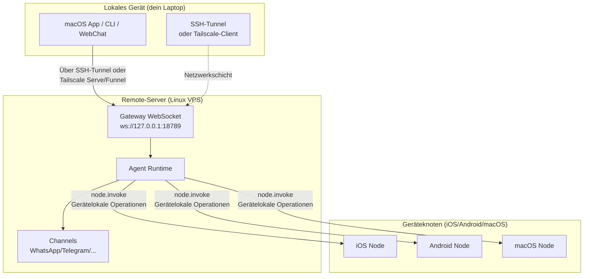

# Remote-Gateway: Clawdbot über Tailscale und SSH-Tunnel zugreifen | Clawdbot-Tutorial

## Was du nach diesem Kurs kannst

**Remote-Gateway** befreit dich von Gerätebeschränkungen und ermöglicht dir, den AI-Assistenten auf Always-on Linux-Servern bereitzustellen. Nach diesem Kurs wirst du in der Lage sein:

- ✅ Clawdbot-Gateway auf Linux-Servern oder VPS auszuführen
- ✅ Gateway über Tailscale Serve/Funnel sicher im Netzwerk bereitzustellen
- ✅ SSH-Tunnel zu verwenden, um vom Client auf das Remote-Gateway zuzugreifen
- ✅ Architekturunterschiede zwischen Gateway und Node zu verstehen (wo exec läuft, wo Geräteoperationen laufen)
- ✅ Sichere Remote-Zugriffsstrategien zu konfigurieren

## Dein aktuelles Dilemma

Du hast vielleicht folgende Fragen:

- 🤔 "Mein Laptop geht oft in den Ruhezustand, aber ich möchte, dass der AI-Assistent immer online ist"
- 🤔 "Ich möchte Gateway auf einem günstigen VPS ausführen, weiß aber nicht, wie ich sicher darauf zugreifen kann"
- 🤔 "Was ist der Unterschied zwischen Tailscale Serve und Funnel? Welches soll ich verwenden?"
- 🤔 "SSH-Tunnel sind zu umständlich, gibt es eine automatisiertere Lösung?"

## Wann diese Methode anwenden

**Remote-Gateway** eignet sich für folgende Szenarien:

| Szenario | Empfohlene Lösung | Grund |
|--- | --- | ---|
| Laptop geht oft in den Ruhezustand, AI muss ständig verfügbar sein | **Tailscale Serve + Linux VPS** | VPS geht nicht in den Ruhezustand, sicherer Zugriff über Tailnet |
|--- | --- | ---|
| Öffentlicher Internetzugriff erforderlich (temporärer Test) | **Tailscale Funnel + Passwort** | Schnell bereitgestellt, aber Passwortschutz erforderlich |
| Mehrere Geräte teilen sich einen AI-Assistenten | **Always-on Gateway** | Zentralisierte Verwaltung aller Sitzungen, Konfigurationen und Historien |

::: warning Nicht empfohlene Szenarien
Wenn du nur ein Gerät hast und es oft bei dir trägst, **brauchst du kein Remote-Gateway**. Führe Gateway direkt auf deinem lokalen Gerät aus.
:::

## 🎒 Vorbereitungen

Bitte stelle vor dem Start sicher:

- [ ] Du hast den Kurs **[Gateway starten](/de/moltbot/moltbot/start/gateway-startup/)** abgeschlossen
- [ ] Du kennst grundlegende SSH-Befehle (optional, falls du SSH-Tunnel verwendest)
- [ ] (bei Verwendung von Tailscale) Tailscale CLI ist installiert und angemeldet
- [ ] Remote-Linux-Server oder VPS bereit (Ubuntu/Debian empfohlen)

---

## Kernkonzept

### Remote-Gateway-Architektur

Der Kerngedanke von Remote-Gateway ist: **Gateway ist das Steuerungszentrum, Client ist das Terminal**.



### Drei Schlüsselkonzepte

| Konzept | Erklärung | Beispiel |
|--- | --- | ---|
| **Gateway-Host** | Maschine, auf der der Gateway-Dienst läuft, besitzt Sitzungen, Authentifizierung, Channels und Status | Linux VPS, Desktop zu Hause |
| **Client** | Tool, das sich mit Gateway verbindet (macOS App, CLI, WebChat) | Dein Laptop, Handy |
| **Geräteknoten** | Externe Geräte, die sich über Gateway WebSocket verbinden, führen Gerätelokaloperationen aus | iOS-Gerät, Android-Gerät, macOS Node-Modus |

### Wo werden Befehle ausgeführt?

Dies ist der häufigste Missverständnispunkt:

| Operationstyp | Wo wird ausgeführt | Grund |
|--- | --- | ---|
| `exec` Tool | **Gateway-Host** | Shell-Befehle laufen auf der Gateway-Maschine |
| `browser` Tool | **Gateway-Host** (oder separater Browser-Kontrollserver) | Browser wird auf der Gateway-Maschine gestartet |
| Knotenoperationen (`camera.snap`, `system.run`) | **Geräteknoten** | Zugriff auf Gerätelokale Ressourcen erforderlich |

**Ein Satz zur Merkhilfe**:
- Gateway-Host → Führt universelle Befehle aus und führt AI aus
- Geräteknoten → Führt gerätespezifische lokale Operationen aus

---

## Mitmachen

### Schritt 1: Clawdbot auf dem Remote-Server installieren

**Warum**
Linux-Server eignen sich besser für die Ausführung von dauerhaft online gehenden Gateway-Diensten.

Führe auf dem Remote-Server aus:

```bash
# 1. Node.js installieren (≥22)
curl -fsSL https://deb.nodesource.com/setup_22.x | sudo -E bash -
sudo apt-get install -y nodejs

# 2. Clawdbot installieren
npm install -g @clawdbot/cli

# 3. Installation verifizieren
clawdbot --version
```

**Du solltest sehen**:
```
clawdbot CLI v<version>
```

### Schritt 2: Onboarding-Assistent ausführen

**Warum**
Schnelle Konfiguration von Grundeinstellungen über interaktiven Assistenten.

```bash
clawdbot onboard
```
Befolge den Assistenten:
- Wähle Channels (z.B. Telegram)
- Konfiguriere AI-Modelle (z.B. OpenAI, Anthropic)
- Stelle Gateway-Authentifizierung ein (Token oder Passwort)

::: tip Empfohlen
Konfiguriere `gateway.auth.mode: "password"`, um Passwortauthentifizierung bei Remote-Verbindungen zu verwenden:
```bash
export CLAWDBOT_GATEWAY_PASSWORD="your-secure-password"
```
:::

**Du solltest sehen**:
```
✅ Gateway configured successfully
✅ Channels configured: telegram
✅ AI model configured: openai:gpt-4o-mini
```

### Schritt 3: Gateway-Daemon starten

**Warum**
Gateway muss kontinuierlich im Hintergrund laufen.

```bash
# Gateway starten (bindet standardmäßig an Loopback: 127.0.0.1:18789)
clawdbot gateway start
```

**Du solltest sehen**:
```
🚀 Gateway starting...
📡 WebSocket: ws://127.0.0.1:18789
🔒 Auth mode: password
```

::: tip Automatischer Start mit systemd (Linux)
Erstelle Servicedatei `/etc/systemd/system/clawdbot.service`:

```ini
[Unit]
Description=Clawdbot Gateway
After=network.target

[Service]
Type=simple
User=your-user
ExecStart=/usr/bin/clawdbot gateway start
Restart=on-failure
RestartSec=5s
Environment="CLAWDBOT_GATEWAY_PASSWORD=your-secure-password"

[Install]
WantedBy=multi-user.target
```

Dienst starten:
```bash
sudo systemctl enable clawdbot
sudo systemctl start clawdbot
sudo systemctl status clawdbot
```
:::

---

### Lösung A: Tailscale Serve verwenden (empfohlen)

#### Schritt 4: Tailscale installieren und anmelden

**Warum**
Tailscale Serve bietet sicheren HTTPS-Zugriff ohne öffentliche IP.

```bash
# Tailscale CLI installieren
curl -fsSL https://tailscale.com/install.sh | sh

# Bei Tailscale anmelden
sudo tailscale up
```

**Du solltest sehen**:
```
To authenticate, visit:

    https://login.tailscale.com/a/xxxxx

----------------------------------------------------
Copy the URL and open it in your browser.
```

#### Schritt 5: Tailscale Serve konfigurieren

**Warum**
Gateway über Tailscale Serve im Tailnet bereitstellen, Gateway loopback-only halten (am sichersten).

Konfigurationsdatei `~/.clawdbot/clawdbot.json` bearbeiten:

```json5
{
  "gateway": {
    "bind": "loopback",
    "tailscale": {
      "mode": "serve",
      "resetOnExit": true
    },
    "auth": {
      "mode": "password"
    }
  }
}
```

**Konfigurationserklärung**:
- `bind: "loopback"`: Gateway lauscht nur auf lokalen Loopback (am sichersten)
- `tailscale.mode: "serve"`: Gateway wird über Tailscale Serve im Tailnet bereitgestellt
- `resetOnExit: true`: Serve-Konfiguration beim Beenden widerrufen

#### Schritt 6: Gateway neu starten

**Warum**
Neue Tailscale-Konfiguration anwenden.

```bash
# Falls systemd verwendet wird
sudo systemctl restart clawdbot

# Oder direkt neu starten (falls im Vordergrund läuft)
clawdbot gateway restart
```

**Du solltest sehen**:
```
🚀 Gateway starting...
📡 WebSocket: ws://127.0.0.1:18789
🌐 Tailscale Serve: https://your-tailnet-name.tailnet-name.ts.net/
🔒 Auth mode: password
```

#### Schritt 7: Vom Client verbinden

**Warum**
Verifizieren, ob Remote-Gateway erreichbar ist.

Auf dem Client-Computer:

1. **Sicherstellen, dass du demselben Tailscale-Tailnet beigetreten bist**
2. **Control UI aufrufen**:
    ```
    https://<magicdns>/  # oder https://<tailnet-ip>:18789/
    ```
3. **WebSocket verbinden**:
    ```bash
    # Verbindung verifizieren
    clawdbot health --url ws://<tailnet-ip>:18789 --password your-secure-password
    ```

**Du solltest sehen**:
```
✅ Gateway is healthy
✅ Authenticated successfully
✅ Channels: telegram (connected)
```

---

### Lösung B: SSH-Tunnel verwenden (allgemeiner Fallback)

#### Schritt 4: SSH-Schlüsselauthentifizierung konfigurieren

**Warum**
SSH-Schlüsselauthentifizierung ist sicherer als Passwort und kann automatisiert werden.

Schlüsselpaar auf dem Client-Computer generieren:

```bash
# Schlüsselpaar generieren (falls noch nicht vorhanden)
ssh-keygen -t rsa -b 4096 -f ~/.ssh/clawdbot_gateway
```

**Du solltest sehen**:
```
Generating public/private rsa key pair.
Enter passphrase (empty for no passphrase): [Einfach Enter drücken]
Enter same passphrase again: [Einfach Enter drücken]
Your identification has been saved in ~/.ssh/clawdbot_gateway
Your public key has been saved in ~/.ssh/clawdbot_gateway.pub
```

#### Schritt 5: Öffentlichen Schlüssel auf Remote-Server kopieren

**Warum**
Remote-Server deinen Client-Schlüssel vertrauen lassen.

```bash
# Öffentlichen Schlüssel auf Remote-Server kopieren
ssh-copy-id -i ~/.ssh/clawdbot_gateway.pub your-user@remote-server-ip
```

**Du solltest sehen**:
```
Number of key(s) added: 1
Now try logging into the machine with:   "ssh 'your-user@remote-server-ip'"
```

#### Schritt 6: SSH-Konfiguration erstellen

**Warum**
SSH-Verbindungs­befehle vereinfachen, zukünftige Nutzung erleichtern.

`~/.ssh/config` auf dem Client-Computer bearbeiten:

```txt
Host clawdbot-remote
    HostName <remote-server-ip>
    User your-user
    IdentityFile ~/.ssh/clawdbot_gateway
    LocalForward 18789 127.0.0.1:18789
    ServerAliveInterval 60
    ServerAliveCountMax 3
```

**Konfigurationserklärung**:
- `LocalForward 18789 127.0.0.1:18789`: Lokalen Port 18789 auf Remote-Port 18789 weiterleiten
- `ServerAliveInterval 60`: Alle 60 Sekunden Heartbeat senden, Verbindung aktiv halten

#### Schritt 7: SSH-Tunnel aufbauen

**Warum**
Sicheren Kanal vom lokalen zum Remote-Gateway erstellen.

```bash
# SSH-Tunnel starten (Hintergrundbetrieb)
ssh -N -f clawdbot-remote
```

**Du solltest sehen**:
(Keine Ausgabe, Befehl läuft im Hintergrund)

#### Schritt 8: Verbindung verifizieren

**Warum**
Sicherstellen, dass SSH-Tunnel und Gateway ordnungsgemäß funktionieren.

```bash
# Prüfen, ob lokaler Port erfolgreich weitergeleitet wird
lsof -i :18789

# Gateway-Verbindung testen
clawdbot health --url ws://127.0.0.1:18789 --password your-secure-password
```

**Du solltest sehen**:
```
COMMAND   PID   USER   FD   TYPE DEVICE SIZE/OFF NODE NAME
ssh      12345  user   4u  IPv4  0x1234      0t0  TCP *:18789 (LISTEN)

✅ Gateway is healthy
✅ Authenticated successfully
```

#### Schritt 9: Automatischer Start von SSH-Tunnel (macOS)

**Warum**
Automatischer Start beim Booten, keine manuelle Eingriffe erforderlich.

Erstelle `~/Library/LaunchAgents/com.clawdbot.ssh-tunnel.plist`:

```xml
<?xml version="1.0" encoding="UTF-8"?>
<!DOCTYPE plist PUBLIC "-//Apple//DTD PLIST 1.0//EN" "http://www.apple.com/DTDs/PropertyList-1.0.dtd">
<plist version="1.0">
<dict>
    <key>Label</key>
    <string>com.clawdbot.ssh-tunnel</string>
    <key>ProgramArguments</key>
    <array>
        <string>/usr/bin/ssh</string>
        <string>-N</string>
        <string>-f</string>
        <string>clawdbot-remote</string>
    </array>
    <key>KeepAlive</key>
    <true/>
    <key>RunAtLoad</key>
    <true/>
</dict>
</plist>
```

Launch Agent laden:

```bash
launchctl bootstrap gui/$UID ~/Library/LaunchAgents/com.clawdbot.ssh-tunnel.plist
```

**Du solltest sehen**:
(Keine Ausgabe, Tunnel läuft automatisch im Hintergrund)

::: tip Automatischer Start unter Linux (systemd user service)
Erstelle `~/.config/systemd/user/clawdbot-ssh-tunnel.service`:

```ini
[Unit]
Description=Clawdbot SSH Tunnel
After=network.target

[Service]
Type=simple
ExecStart=/usr/bin/ssh -N clawdbot-remote
Restart=on-failure
RestartSec=5s

[Install]
WantedBy=default.target
```

Dienst starten:
```bash
systemctl --user enable clawdbot-ssh-tunnel
systemctl --user start clawdbot-ssh-tunnel
```
:::

---

### Lösung C: Tailscale Funnel verwenden (öffentlicher Zugriff, Passwort erforderlich)

::: danger Sicherheitswarnung
Tailscale Funnel macht Gateway im öffentlichen Internet zugänglich!
- **Muss** Passwortauthentifizierung verwenden (`gateway.auth.mode: "password"`)
- **Nur empfohlen** für temporäre Tests, nicht für Produktionsumgebungen
:::

#### Schritt 4: Funnel konfigurieren

**Warum**
Öffentlichen HTTPS-Zugriff über Tailscale Funnel bereitstellen.

Konfigurationsdatei `~/.clawdbot/clawdbot.json` bearbeiten:

```json5
{
  "gateway": {
    "bind": "loopback",
    "tailscale": {
      "mode": "funnel",
      "resetOnExit": true
    },
    "auth": {
      "mode": "password",
      "password": "${CLAWDBOT_GATEWAY_PASSWORD}"
    }
  }
}
```

**Wichtig**:
- `tailscale.mode: "funnel"`: Tailscale Funnel verwenden (öffentlicher Zugriff)
- `auth.mode: "password"`: Funnel erfordert Passwort (sonst Start verweigert)

#### Schritt 5: Gateway neu starten

```bash
sudo systemctl restart clawdbot
```

**Du solltest sehen**:
```
🚀 Gateway starting...
🌐 Tailscale Funnel: https://your-funnel-url.ts.net/
🔒 Auth mode: password
```

#### Schritt 6: Aus dem öffentlichen Internet verbinden

```bash
clawdbot health --url wss://your-funnel-url.ts.net --password your-secure-password
```

---

## Checkpoint ✅

Nach Abschluss einer der oben genannten Lösungen, verifiziere folgende Punkte:

| Prüfungsitem | Befehl | Erwartetes Ergebnis |
|--- | --- | ---|
| Gateway läuft | `clawdbot gateway status` | ✅ Running |
| WebSocket erreichbar | `clawdbot health --url <url>` | ✅ Healthy |
| Channels verbunden | `clawdbot channels status` | ✅ connected |
| Knoten koppelbar | `clawdbot nodes list` | Knotenliste anzeigen |

---

## Fallstricke

### Falle 1: Gateway an nicht loopback gebunden

**Problem**:
```json5
{
  "gateway": {
    "bind": "lan"  // ❌ Gefährlich!
  }
}
```

**Konsequenzen**:
- Gateway lauscht auf LAN/Öffentlicher IP, jeder kann verbinden
- Ohne Authentifizierungskonfiguration, **schwerwiegendes Sicherheitsrisiko**

**Richtige Vorgehensweise**:
```json5
{
  "gateway": {
    "bind": "loopback",  // ✅ Am sichersten
    "tailscale": {
      "mode": "serve"  // ✅ Über Tailscale Serve bereitstellen
    }
  }
}
```

### Falle 2: Tailscale Funnel ohne Passwort

**Problem**:
```json5
{
  "gateway": {
    "auth": {
      "mode": "token"  // ❌ Funnel erlaubt das nicht!
    },
    "tailscale": {
      "mode": "funnel"
    }
  }
}
```

**Konsequenzen**:
- Gateway verweigert Start (Funnel erfordert zwingend Passwort)

**Richtige Vorgehensweise**:
```json5
{
  "gateway": {
    "auth": {
      "mode": "password",  // ✅ Funnel muss Passwort verwenden
      "password": "${CLAWDBOT_GATEWAY_PASSWORD}"
    },
    "tailscale": {
      "mode": "funnel"
    }
  }
}
```

### Falle 3: SSH-Tunnel-Portkonflikt

**Problem**:
```
channel_setup_fwd: listen 127.0.0.1:18789: cannot listen to port: Address already in use
```

**Ursache**: Lokaler Port 18789 bereits belegt

**Lösung**:
```bash
# Prozess belegenen Port suchen
lsof -i :18789

# Konfliktprozess beenden
kill -9 <PID>

# Oder anderen Port weiterleiten (Client-URL muss ebenfalls geändert werden)
ssh -N -L 18790:127.0.0.1:18789 clawdbot-remote
```

### Falle 4: macOS App Remote über SSH funktioniert nicht

**Problem**: macOS App zeigt "Unable to connect to Gateway"

**Prüfung**:
1. SSH-Tunnel läuft:
    ```bash
    ps aux | grep "ssh -N clawdbot-remote" | grep -v grep
    ```
2. Gateway-Token gesetzt:
    ```bash
    launchctl getenv CLAWDBOT_GATEWAY_TOKEN
    ```
3. App-Einstellungen korrekt:
    - Settings → General → "Clawdbot runs" → "On a remote machine over SSH"

**Lösung**:
- SSH-Tunnel neu starten
- macOS App beenden und neu starten

---

## Zusammenfassung

### Kernpunkte

- ✅ **Remote-Gateway** lässt AI-Assistenten dauerhaft online sein, Clients können sich jederzeit verbinden
- ✅ **Tailscale Serve** ist die sicherste Lösung (tailnet-only + HTTPS + loopback)
- ✅ **SSH-Tunnel** ist die allgemeine Fallbacklösung (ohne Tailscale)
- ✅ **Tailscale Funnel** eignet sich für temporären öffentlichen Zugriff (Passwort erforderlich)
- ✅ **Gateway-Host** führt `exec` und universelle Befehle aus, **Geräteknoten** führen Gerätelokaloperationen aus

### Konfigurationsvergleich

| Lösung | Sicherheit | Zugriffsbereich | Konfigurations­komplexität | Empfohlenes Szenario |
|--- | --- | --- | --- | ---|
| Tailscale Serve | ⭐⭐⭐⭐⭐ | Tailnet | Mittel | **Empfohlen**: Always-on Gateway |
| SSH-Tunnel | ⭐⭐⭐⭐ | Über SSH-Verbindung erreichbar | Niedrig | Allgemeiner Fallback, Desktop-Remote-Steuerung zu Hause |
| Tailscale Funnel | ⭐⭐ | Öffentliches Internet | Niedrig | Temporärer Test, Demo |

### Sicherheits-Checkliste

- [ ] Gateway an `loopback` gebunden
- [ ] Tailscale Funnel verwendet Passwortauthentifizierung
- [ ] SSH-Schlüssel konfiguriert (falls SSH-Tunnel verwendet)
- [ ] Passwort über Umgebungsvariablen festgelegt (nicht in Konfigurationsdatei geschrieben)
- [ ] Regelmäßig `clawdbot security audit` ausführen

---

## Vorschau auf nächsten Kurs

> Im nächsten Kurs lernen wir **[Fähigkeitenplattform und ClawdHub](../skills-platform/)**.
>
> Du wirst lernen:
> - Konzept des Fähigkeitssystems (Bundled/Managed/Workspace)
> - Wie man Drittanbieterfähigkeiten von ClawdHub installiert
> - Wie man benutzerdefinierte Fähigkeiten erstellt und verwaltet
> - Berechtigungs- und Isolierungsmechanismen von Fähigkeiten

---

## Anhang: Quellcode-Referenz

<details>
<summary><strong>Klicken zum Aufklappen, Quellcodepositionen anzuzeigen</strong></summary>

> Aktualisiert am: 2026-01-27

| Funktion | Dateipfad | Zeilen |
|--- | --- | ---|
| Gateway-Remote-Konfiguration Schema | [`src/config/types.gateway.ts`](https://github.com/moltbot/moltbot/blob/main/src/config/types.gateway.ts) | 200-220 |
| Gateway-Tailscale-Konfiguration Schema | [`src/config/types.gateway.ts`](https://github.com/moltbot/moltbot/blob/main/src/config/types.gateway.ts) | 150-180 |
| Tailscale-Integration | [`src/infra/tailscale.ts`](https://github.com/moltbot/moltbot/blob/main/src/infra/tailscale.ts) | 1-100 |
| Remote-Gateway-Dokumentation | [`docs/gateway/remote.md`](https://github.com/moltbot/moltbot/blob/main/docs/gateway/remote.md) | 1-123 |
| Tailscale-Dokumentation | [`docs/gateway/tailscale.md`](https://github.com/moltbot/moltbot/blob/main/docs/gateway/tailscale.md) | 1-147 |
|--- | --- | ---|
| Sicherheitsdokumentation | [`docs/gateway/security.md`](https://github.com/moltbot/moltbot/blob/main/docs/gateway/security.md) | 1-100 |

**Wichtige Konfigurationsfelder**:

- `gateway.bind`: Gateway-Bindungsadresse (`loopback`/`lan`/`tailnet`/`auto`)
- `gateway.tailscale.mode`: Tailscale-Modus (`off`/`serve`/`funnel`)
- `gateway.auth.mode`: Authentifizierungsmodus (`token`/`password`)
- `gateway.auth.allowTailscale`: Tailscale-Identity-Headers zulassen (`true`/`false`)
- `gateway.remote.url`: Remote-Gateway-URL (CLI-Standard)
- `gateway.remote.token`: Remote-Gateway-Token (CLI-Authentifizierung)
- `gateway.tailscale.resetOnExit`: Serve/Funnel-Konfiguration beim Beenden widerrufen (`true`/`false`)

**Wichtige Geschäftsregeln**:

- Gateway bindet standardmäßig an Loopback (`127.0.0.1`)【Tatsache】
- Tailscale Serve bietet Tailnet-only HTTPS-Zugriff【Tatsache】
- Tailscale Funnel erfordert zwingend Passwortauthentifizierung (`gateway.auth.mode: "password"`)【Tatsache】
- `gateway.remote.token` wird nur für Remote-CLI-Aufrufe verwendet, aktiviert keine lokale Authentifizierung【Tatsache】
- `gateway.bind: "tailnet"` bindet direkt an Tailnet-IP (kein Serve/Funnel erforderlich)【Tatsache】

**Sicherheitsregeln**:

- Loopback + SSH/Tailscale Serve ist sicherste Standardkonfiguration【Tatsache】
- Nicht-Loopback-Bindungen (`lan`/`tailnet`/`custom`) müssen Authentifizierungs-Token oder Passwort verwenden【Tatsache】
- Tailscale Serve kann über Identity-Headers authentifizieren (`gateway.auth.allowTailscale: true`)【Tatsache】
- Funnel injiziert keine Tailscale-Identity-Headers【Tatsache】

</details>
