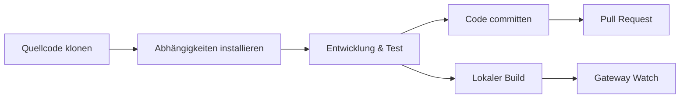

# Entwicklerhandbuch: Vom Quellcode-Build bis zum Beitrag

## Was Sie nach diesem Tutorial können werden

- Clawdbot aus dem Quellcode bauen und ausführen
- Eigene Plugins entwickeln (Kanäle, Tools, RPC-Methoden)
- Unit-Tests und End-to-End-Tests ausführen
- Pull Requests an das Projekt senden und Code beitragen
- Die Projektarchitektur und das Plugin-System verstehen

## Ihre aktuelle Situation

Sie sind ein Entwickler, der Folgendes möchte:
- Die Clawdbot-Funktionalität anpassen oder erweitern
- Die internen Arbeitsmechanismen des Projekts verstehen
- Code zur Open-Source-Community beitragen
- Aber nicht weiß, wo er anfangen soll: Build, Tests, Einreichungsprozess?

## Wann Sie diese Anleitung verwenden sollten

- Wenn Sie den Quellcode ändern oder neue Funktionen hinzufügen müssen
- Wenn Sie eigene Plugins oder Kanäle entwickeln möchten
- Wenn Sie Fehler debuggen oder beheben müssen
- Wenn Sie Code zum Projekt beitragen möchten

## 🎒 Vorbereitung vor dem Start

::: warning Voraussetzungen
Dieses Tutorial geht davon aus, dass Sie folgende Voraussetzungen erfüllt haben:
:::

- **Node.js ≥22** ist installiert (Projektanforderung)
- **pnpm** Paketmanager ist installiert (empfohlen für Builds aus Quellcode)
- **Git** Grundkenntnisse
- **TypeScript** Entwicklungserfahrung
- **Terminal** Befehlszeilenoperationen

Empfohlene Umgebung:
- macOS / Linux (primäre Entwicklungsplattformen)
- Windows via WSL2

## Kernkonzepte

### Überblick über den Entwicklungsprozess

Der Clawdbot-Entwicklungsprozess ist in vier Hauptphasen unterteilt:



### Schlüsselkonzepte

- **Build-System**: Verwendet TypeScript-Kompilierung, `dist/` Verzeichnis enthält Ausgaben
- **Plugin-Architektur**: Lädt TypeScript-Module zur Laufzeit, unterstützt erweiterte Funktionalität
- **Gateway Daemon**: Singleton-Muster, Control Plane und Nachrichtenrouting
- **Test-Framework**: Vitest für Unit-Tests, Docker für End-to-End-Tests

### Wichtige Punkte der Projektstruktur

| Verzeichnis | Zweck |
|---|---|
| `src/` | Alle Quellcodedateien (2475 TypeScript-Dateien) |
| `src/gateway/` | Gateway WebSocket-Server |
| `src/channels/` | Kanal-Plugin-System |
| `src/agents/` | AI Agent Runtime |
| `src/plugin-sdk/` | Plugin-Entwicklung SDK |
| `extensions/` | Integrierte Plugins (z.B. voice-call) |
| `tests/` | Testdateien |

## Schritt-für-Schritt-Anleitung

### Schritt 1: Quellcode klonen und Abhängigkeiten installieren

**Warum**
Das Besorgen des aktuellsten Quellcodes und die Installation aller Abhängigkeiten ist der erste Schritt der Entwicklung.

```bash
## Repository klonen
git clone https://github.com/clawdbot/clawdbot.git
cd clawdbot

## Abhängigkeiten installieren (pnpm empfohlen)
pnpm install
```

**Sie sollten sehen**: Abhängigkeiten wurden erfolgreich installiert, keine Fehlermeldungen.

::: info Bun-Unterstützung
Wenn Sie Bun verwenden, können Sie TypeScript direkt ohne Build ausführen (verwendet `tsx`).
:::

### Schritt 2: Projekt bauen

**Warum**
TypeScript nach JavaScript kompilieren und ein verteilbares `dist/` Verzeichnis erstellen.

```bash
## Vollständiger Build
pnpm build
```

**Sie sollten sehen**:
```
src/cli/entry.ts → dist/cli/entry.js
src/gateway/server.ts → dist/gateway/server.js
...
Build completed in X seconds
```

::: tip UI-Build
Beim ersten Ausführen von `pnpm ui:build` werden UI-Abhängigkeiten automatisch installiert.
:::

### Schritt 3: Entwicklungsmodus starten

**Warum**
Der Entwicklungsmodus unterstützt automatisches Neuladen ohne manuelle Neubuilds.

```bash
## Gateway-Entwicklungsmodus starten (automatisches Neuladen)
pnpm gateway:watch

## Oder CLI-Entwicklungsmodus starten
CLAWDBOT_PROFILE=dev pnpm clawdbot --dev
```

**Sie sollten sehen**:
- Gateway startet und lauscht auf `ws://127.0.0.1:18789`
- Dateiänderungen lösen automatische Neukompilierung und Neustart aus

::: tip Kanalladen überspringen
Während der Entwicklung können Sie mit `CLAWDBOT_SKIP_CHANNELS=1` die Kanalinitialisierung überspringen, um den Start zu beschleunigen.
:::

**Kontrollpunkt ✅**
- Gateway erfolgreich gestartet und lauscht auf Port 18789
- Änderungen an TypeScript-Dateien lösen automatische Neukompilierung aus

### Schritt 4: Tests ausführen

**Warum**
Stellt sicher, dass Codeänderungen keine bestehenden Funktionen beschädigt haben.

#### Unit-Tests

```bash
## Alle Tests ausführen
pnpm test

## Tests mit Überwachung auf Änderungen ausführen
pnpm test:watch

## Abdeckungsbericht erstellen
pnpm test:coverage
```

**Sie sollten sehen**: Test-Durchlaufquote und Abdeckungsstatistiken.

#### End-to-End-Tests

```bash
## Docker End-to-End-Tests ausführen
pnpm test:docker:all

## Oder einzelne Test-Suite ausführen
pnpm test:docker:live-models
```

**Sie sollten sehen**: Alle Docker-Testcontainer werden erfolgreich ausgeführt und beendet.

::: warning Test-Anforderungen
End-to-End-Tests benötigen installiertes und laufendes Docker.
:::

**Kontrollpunkt ✅**
- Alle Unit-Tests bestanden
- Testabdeckung entspricht den Anforderungen (≥70%)
- End-to-End-Tests bestanden

### Schritt 5: Linting und Formatierung

**Warum**
Konsistenten Code-Stil und Typsicherheit beibehalten.

```bash
## Linter ausführen
pnpm lint

## Code formatieren
pnpm format:fix

## Swift-Linter ausführen (macOS/iOS-Entwicklung)
pnpm lint:swift
```

**Sie sollten sehen**: Keine Lint-Fehler, Code wurde formatiert.

::: tip Automatische Formatierung
Das Projekt ist mit pre-commit Git-Hooks konfiguriert, die vor dem Commit automatisch gestaged Dateien formatieren.
:::

### Schritt 6: Plugin entwickeln (optional)

**Warum**
Clawdbot-Funktionalität erweitern oder externe Dienste integrieren.

#### Schnelles Plugin erstellen

1. Plugin-Verzeichnis erstellen:
```bash
mkdir extensions/my-plugin
cd extensions/my-plugin
```

2. `clawdbot.plugin.json` erstellen:
```json
{
  "id": "my-plugin",
  "name": "My Plugin",
  "version": "1.0.0",
  "configSchema": {
    "type": "object",
    "properties": {
      "apiKey": { "type": "string" }
    }
  }
}
```

3. Plugin-Einstieg `index.ts` erstellen:
```typescript
export default function (api) {
  console.log("My plugin loaded!");
  
  // Tool registrieren
  api.registerTool({
    name: "my_tool",
    description: "My custom tool",
    execute: async (params) => {
      return { result: "Hello from my tool!" };
    }
  });
  
  // RPC-Methode registrieren
  api.registerGatewayMethod("myplugin.status", ({ respond }) => {
    respond({ ok: true, status: "running" });
  });
}
```

4. Installieren und testen:
```bash
## Entwicklungsmodus: Plugin verlinken
clawdbot plugins install -l extensions/my-plugin

## Gateway neu starten
pnpm gateway:watch
```

::: details Plugin-Typen
Clawdbot unterstützt folgende Plugin-Typen:

- **Agent Tools**: Von der KI aufrufbare Tools
- **Channel Plugins**: Neue Nachrichtenkanäle (WhatsApp, Telegram etc.)
- **Gateway RPC**: WebSocket-Endpunkte
- **CLI Commands**: Kommandozeilen-Tools
- **Background Services**: Hintergrund-Aufgaben
- **Auto-reply Commands**: Schnellbefehle ohne KI

Siehe [Plugin-Dokumentation](https://github.com/moltbot/moltbot/blob/main/docs/plugin.md).
:::

**Kontrollpunkt ✅**
- Plugin erfolgreich geladen
- Plugin-Funktionalität über CLI oder Gateway erreichbar
- Plugin-Konfiguration funktioniert normal

### Schritt 7: Code committen und Pull Request erstellen

**Warum**
Ihren Beitrag an die Community senden.

```bash
## Feature-Branch erstellen
git checkout -b feature/my-feature

## Änderungen committen
git add .
git commit -m "feat: add my new feature"

## Zu GitHub pushen
git push origin feature/my-feature
```

Erstellen Sie dann einen Pull Request auf GitHub.

::: tip PR-Richtlinien
Beschreiben Sie im PR folgendes:
- **Was gemacht wurde**: Beschreibung der Funktion oder des Fixes
- **Warum**: Welches Problem wird gelöst
- **Teststatus**: untested / lightly tested / fully tested
- **KI-Unterstützung**: Ob KI-Tools bei der Entwicklung verwendet wurden
:::

**Kontrollpunkt ✅**
- Code zu GitHub gepusht
- Pull Request erfolgreich erstellt
- CI/CD-Prüfungen bestanden (falls vorhanden)

## Fallen und Lösungen

### Häufige Fehler

| Fehler | Ursache | Lösung |
|---|---|---|
| `Cannot find module 'xxx'` | Abhängigkeiten nicht installiert | `pnpm install` ausführen |
| `Port 18789 already in use` | Gateway läuft bereits | Alte Instanz prüfen und beenden |
| TypeScript-Kompilierungsfehler | Typendefinitionsproblem | `pnpm lint` zur Überprüfung ausführen |
| Test-Timeout | Docker nicht gestartet oder Netzwerkproblem | Docker-Status prüfen |

### Entwicklungs-Best Practices

- **Kleine Commits**: Jeder PR sollte nur eine Sache erledigen, erleichtert die Überprüfung
- **Tests schreiben**: Neue Funktionen müssen durch Tests abgedeckt sein
- **Stil einhalten**: Verwenden Sie den vom Projekt konfigurierten Linter und Formatter
- **Dokumentation aktualisieren**: Aktualisieren Sie relevante Dokumentation, wenn Sie Code ändern
- **KI-Kennzeichnung**: Bitte kennzeichnen Sie in der PR, ob Sie KI-unterstützte Entwicklung verwendet haben

## Lektionszusammenfassung

Dieses Tutorial deckt den vollständigen Clawdbot-Entwicklungsprozess ab:

✅ **Build aus Quellcode**: Verwendung von `pnpm install` und `pnpm build`
✅ **Entwicklungsmodus**: Verwendung von `pnpm gateway:watch` für automatisches Neuladen
✅ **Test-Framework**: Vitest Unit-Tests + Docker End-to-End-Tests
✅ **Plugin-Entwicklung**: Erweiterbares Plugin-System basierend auf TypeScript
✅ **Beitragsprozess**: Git-Workflow und Pull Request-Richtlinien

Wichtige Befehle zur schnellen Referenz:

| Aufgabe | Befehl |
|---|---|
| Abhängigkeiten installieren | `pnpm install` |
| Build | `pnpm build` |
| Entwicklungsmodus | `pnpm gateway:watch` |
| Unit-Tests | `pnpm test` |
| Linting | `pnpm lint` |
| Formatierung | `pnpm format:fix` |

## Vorschau auf die nächste Lektion

Glückwunsch zum Abschluss des Entwicklerhandbuchs! Sie haben jetzt:

- Die Fähigkeit, Clawdbot aus dem Quellcode zu bauen und auszuführen
- Die Grundlagen zur Entwicklung eigener Plugins
- Den Prozess zum Ausführen von Tests und zum Beitragen von Code

Als Nächstes möchten Sie möglicherweise mehr über Folgendes erfahren:

- [Konfigurationsreferenz](../config-reference/) - Vollständige Dokumentation der Konfigurationsoptionen
- [Gateway API Protokoll](../api-protocol/) - WebSocket-Protokollspezifikation
- [Bereitstellungsoptionen](../deployment/) - Docker, Nix und andere Bereitstellungsmethoden

Entdecken Sie weiter und lassen Sie Clawdbot für Sie arbeiten!

---

## Anhang: Quellcode-Referenz

<details>
<summary><strong>Klicken Sie hier, um die Quellcode-Positionen anzuzeigen</strong></summary>

> Aktualisiert am: 2026-01-27

| Funktion | Dateipfad | Zeilennummer |
|---|---|---|
| Build-Skript | [`package.json`](https://github.com/moltbot/moltbot/blob/main/package.json) | 77-44 |
| Installation aus Quellcode | [`README.md`](https://github.com/moltbot/moltbot/blob/main/README.md) | 83-99 |
| Plugin-Dokumentation | [`docs/plugin.md`](https://github.com/moltbot/moltbot/blob/main/docs/plugin.md) | 1-639 |
| Beitragsrichtlinien | [`CONTRIBUTING.md`](https://github.com/moltbot/moltbot/blob/main/CONTRIBUTING.md) | 1-53 |
| Architekturdokumentation | [`docs/concepts/architecture.md`](https://github.com/moltbot/moltbot/blob/main/docs/concepts/architecture.md) | 1-123 |

**Wichtige Befehle**:
- `pnpm build` - Vollständiger Build (package.json:85)
- `pnpm gateway:watch` - Entwicklungsmodus mit automatischem Neuladen (package.json:93)
- `pnpm test` - Unit-Tests ausführen (package.json:118)
- `pnpm lint` - Linting (package.json:110)

**Wichtige Verzeichnisse**:
- `src/` - Quellcode-Hauptverzeichnis (2475 TypeScript-Dateien)
- `src/plugin-sdk/` - Plugin-Entwicklung SDK
- `extensions/` - Integrierte Plugins
- `tests/` - Testdateien
- `dist/` - Build-Ausgabeverzeichnis

**Plugin-bezogen**:
- Plugin-Manifest-Format: `clawdbot.plugin.json` (plugin.md:8-10)
- Plugin-API: `api.registerTool()`, `api.registerGatewayMethod()` (plugin.md:591-600)
- Plugin-Konfiguration Schema: JSON Schema + `uiHints` (plugin.md:36-48)

</details>
