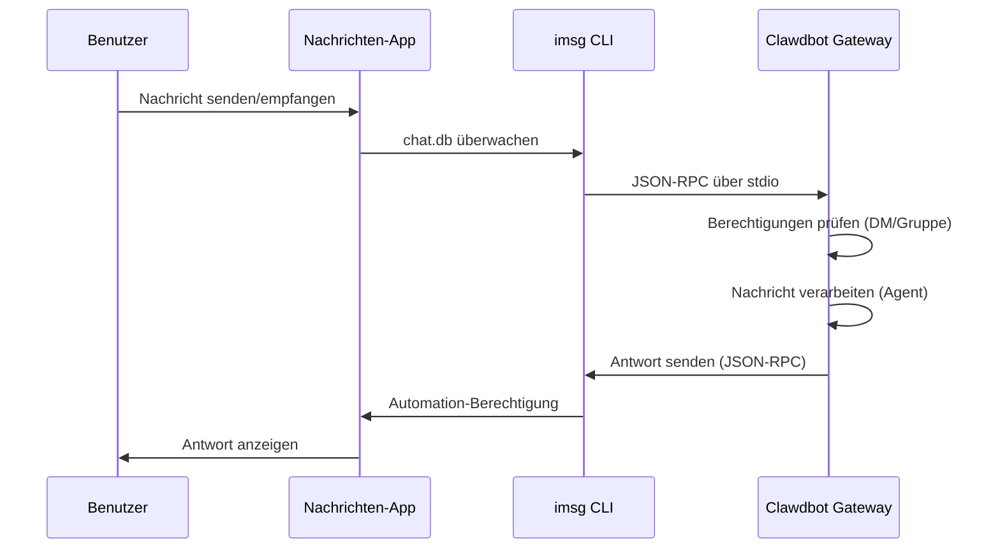

# iMessage-Konfiguration

## Was Sie nach dieser Lektion können

- 1:1-Privatchats mit einem KI-Assistenten über iMessage auf macOS
- Verwendung des KI-Assistenten in iMessage-Gruppen (mit @Erwähnungen)
- Konfiguration eines dedizierten Mac-Benutzers zur Isolation der Bot-Identität
- Remote-Zugriff auf iMessage auf einem anderen Mac über SSH/Tailscale
- Beherrschung von DM-Pairing und Gruppen-Whitelist-Zugriffskontrolle

## Ihr aktuelles Problem

Sie möchten iMessage auf macOS verwenden, um mit einem KI-Assistenten zu interagieren, wissen aber nicht wie:

- Installation und Konfiguration des `imsg` CLI-Tools
- Gewährung von Full Disk Access und Automation-Berechtigungen an Clawdbot
- Konfiguration eines lokalen oder remote Mac als iMessage-Gateway
- Einrichtung mehrerer iMessage-Konten
- Kontrolle, wer Nachrichten an den Bot senden kann

## Wann diese Methode verwenden

**Szenarien, die für den iMessage-Kanal geeignet sind**:

- Sie verwenden hauptsächlich iMessage auf macOS
- Sie möchten lokales iMessage verwenden (ohne Abhängigkeit von Drittanbieter-Servern)
- Sie benötigen Text- und Medieninteraktion mit einem KI-Assistenten über iMessage
- Sie möchten das gleiche Gesprächserlebnis wie bei anderen Kanälen (WhatsApp, Telegram) beibehalten

**Nicht geeignete Szenarien**:

- Nicht-macOS-Systeme (iMessage-Kanal unterstützt nur macOS)
- Erforderliche plattformübergreifende Synchronisierung (erwägen Sie WebChat, Telegram)
- Erforderliche Gruppen-@Erwähnungsfunktion (iMessage hat keinen nativen Mention-Mechanismus, muss manuell konfiguriert werden)

## Kernkonzepte

Der Arbeitsablauf des iMessage-Kanals:



**Wichtige Konzepte**:

| Konzept | Beschreibung |
|--- | ---|
| **imsg CLI** | Drittanbieter-Tool, das über JSON-RPC über stdio mit Messages interagiert |
| **Full Disk Access** | macOS-Berechtigung, die Clawdbot das Lesen der Messages chat.db ermöglicht |
|--- | ---|
| **chat_id** | Stabiler Chat-Bezeichner für Routing und Gesprächsisolierung |
| **pairing** | Standard-DM-Schutzmechanismus, unbekannte Absender benötigen Genehmigung |

::: tip
Der iMessage-Kanal wird über das `imsg` CLI implementiert, nicht durch direkten Aufruf der Messages-API. `imsg` kommuniziert über JSON-RPC über stdio mit Clawdbot, was bedeutet, dass es auf einem remote Mac laufen kann (über SSH).
:::

## 🎒 Vorbereitungen

Stellen Sie sicher, dass Sie bereits:

- ✅ [Schnellstart](../../start/getting-started/) abgeschlossen und Clawdbot installiert haben
- ✅ Das Gateway läuft (`clawdbot gateway --port 18789`)
- ✅ In Messages auf macOS angemeldet sind (iMessage aktiviert)
- ✅ Homebrew-Zugriff haben (für die Installation von `imsg`)

::: warning
Der iMessage-Kanal unterstützt nur macOS. Stellen Sie sicher, dass Ihr Gateway auf macOS läuft oder über SSH/Tailscale mit einem remote Mac verbunden ist.
:::

## Schritt-für-Schritt-Anleitung

### Schritt 1: imsg CLI installieren

**Warum**
`imsg` ist die Kernabhängigkeit des iMessage-Kanals und interagiert über JSON-RPC über stdio mit der Messages-App.

1. Installation mit Homebrew:
   ```bash
   brew install steipete/tap/imsg
   ```

**Was Sie sehen sollten**:
- Nach erfolgreicher Installation ist der `imsg`-Befehl verfügbar
- Ausführen von `imsg --version` zeigt Versionsinformationen

**Installation überprüfen**:

```bash
# Testen, ob imsg verfügbar ist
imsg chats --limit 1
```

**Was Sie sehen sollten**:
- Ausgabe von mindestens einem Chat-Verlauf (falls vorhanden)
- Oder Aufforderung zur Gewährung von Full Disk Access-Berechtigung

### Schritt 2: Full Disk Access-Berechtigung gewähren

**Warum**
Clawdbot muss die `chat.db`-Datenbank von Messages lesen, um neue Nachrichten zu überwachen.

1. Öffnen Sie **Systemeinstellungen** > **Datenschutz & Sicherheit**
2. Klicken Sie auf **Vollständiger Datenträgerzugriff**
3. Klicken Sie auf **+**, um die folgenden Apps hinzuzufügen:
   - `/Applications/Clawdbot.app` (bei Verwendung der macOS-App)
   - `/usr/local/bin/imsg` oder der tatsächliche Pfad von `imsg`
4. Gateway neu starten

::: warning
Nach Änderung der Berechtigungen müssen Sie das Gateway neu starten, damit sie wirksam werden!
:::

**Was Sie sehen sollten**:
- Keine Berechtigungsfehler in den Gateway-Startprotokollen
- `imsg chats --limit 1` gibt die Chat-Liste normal aus

### Schritt 3: Automation-Berechtigung gewähren

**Warum**
`imsg` sendet Nachrichten über die Apple Events Automation API und benötigt Benutzerzustimmung.

1. Beim ersten Senden einer Nachricht zeigt macOS eine Berechtigungsabfrage an
2. Klicken Sie auf **Zulassen** oder **OK**
3. Bei Verwendung eines dedizierten Mac-Benutzers führen Sie einmal einen Test in der Sitzung dieses Benutzers aus

**Automation-Berechtigung testen**:

```bash
# Testnachricht senden (durch tatsächlichen Empfänger ersetzen)
imsg send --to "+15555550123" "Testnachricht"
```

**Was Sie sehen sollten**:
- macOS zeigt Berechtigungsabfrage an (erstes Mal)
- Nach Gewährung der Berechtigung wird die Nachricht erfolgreich gesendet
- Die Testnachricht wird in der Messages-App angezeigt

### Schritt 4: Clawdbot konfigurieren

**Warum**
Clawdbot mitteilen, welchen `imsg`-Pfad und welche Messages-Datenbankposition verwendet werden soll.

**Methode A: Einfache Konfiguration (lokaler Mac)**

Bearbeiten Sie `~/.clawdbot/clawdbot.json`:

```json5
{
  channels: {
    imessage: {
      enabled: true,
      cliPath: "/usr/local/bin/imsg",
      dbPath: "/Users/<your-username>/Library/Messages/chat.db",
      dmPolicy: "pairing",
      groupPolicy: "allowlist"
    }
  }
}
```

::: info
Ersetzen Sie `<your-username>` durch Ihren tatsächlichen macOS-Benutzernamen.
:::

**Methode B: Multi-Account-Konfiguration**

```json5
{
  channels: {
    imessage: {
      enabled: true,
      accounts: {
        main: {
          name: "Main Account",
          enabled: true,
          cliPath: "/usr/local/bin/imsg",
          dbPath: "/Users/alice/Library/Messages/chat.db"
        },
        bot: {
          name: "Bot Account",
          enabled: true,
          cliPath: "/path/to/imsg-bot-wrapper",  // siehe Schritt 5
          dbPath: "/Users/botuser/Library/Messages/chat.db"
        }
      }
    }
  }
}
```

**Gateway neu starten**:

```bash
clawdbot gateway restart
```

**Was Sie sehen sollten**:
- Gateway startet und zeigt "iMessage default: enabled, configured, ..."
- Keine Protokolle für Berechtigungs- oder Pfadfehler

### Schritt 5: Testnachricht senden

**Warum**
Überprüfen, ob die Konfiguration korrekt ist und Nachrichten ordnungsgemäß übertragen werden.

1. Senden Sie eine Testnachricht über die CLI:
   ```bash
   clawdbot message --to imessage:+15555550123 "Hallo von Clawdbot!"
   ```

**Was Sie sehen sollten**:
- Die Messages-App empfängt die Nachricht
- Gateway-Protokolle zeigen, dass die Nachricht gesendet wurde
- Wenn ein KI-Modell konfiguriert ist, erhalten Sie eine KI-Antwort

::: info
Das Format `imessage:+15555550123` bedeutet, dass die Nachricht über den iMessage-Kanal an die Telefonnummer `+15555550123` gesendet wird. Sie können auch eine E-Mail-Adresse verwenden: `imessage:user@example.com`.
:::

## Checkpoint ✅

Überprüfen Sie, ob die Konfiguration erfolgreich war:

```bash
# Kanalstatus prüfen
clawdbot channels status

# Sollte anzeigen:
# iMessage default: enabled, configured, rpc listening
```

::: info
Wenn Sie Fehler sehen, führen Sie `clawdbot channels status --probe` aus, um detaillierte Diagnoseinformationen zu erhalten.
:::

## Erweiterte Konfiguration

### Dedizierten Mac-Benutzer konfigurieren (optional)

Wenn Sie eine unabhängige iMessage-Identität verwenden möchten (ohne Ihre persönlichen Messages zu verunreinigen), können Sie einen dedizierten Mac-Benutzer erstellen.

**Schritte**:

1. **Dedizierte Apple ID erstellen**:
   - Besuchen Sie [appleid.apple.com](https://appleid.apple.com)
   - Erstellen Sie eine neue Apple ID (z. B. `my-cool-bot@icloud.com`)

2. **macOS-Benutzer erstellen**:
   - Öffnen Sie **Systemeinstellungen** > **Benutzer & Gruppen**
   - Klicken Sie auf **+**, um einen neuen Benutzer zu erstellen (z. B. `botuser`)
   - Richten Sie automatische Anmeldung ein oder merken Sie sich das Passwort

3. **Bei dediziertem iMessage-Konto anmelden**:
   - Wechseln Sie zum Benutzer `botuser`
   - Öffnen Sie die Messages-App
   - Melden Sie sich mit der dedizierten Apple ID bei iMessage an

4. **Remote-Anmeldung aktivieren**:
   - Öffnen Sie **Systemeinstellungen** > **Allgemein** > **Freigaben**
   - Aktivieren Sie **Remote-Anmeldung**

5. **SSH-Passwortlose Anmeldung einrichten**:
   ```bash
   # SSH vom Hauptbenutzer testen
   ssh botuser@localhost true

   # Wenn ein Passwort erforderlich ist, SSH-Schlüssel konfigurieren:
   ssh-keygen -t ed25519
   ssh-copy-id botuser@localhost
   ```

6. **SSH-Wrapper-Skript erstellen**:

   Erstellen Sie `~/.clawdbot/scripts/imsg-bot` (`chmod +x`):

   ```bash
   #!/usr/bin/env bash
   set -euo pipefail

   # Führen Sie interaktives SSH einmal aus, um Host-Schlüssel zu akzeptieren:
   #   ssh botuser@localhost true
   exec /usr/bin/ssh -o BatchMode=yes -o ConnectTimeout=5 -T botuser@localhost \
     "/usr/local/bin/imsg" "$@"
   ```

7. **Clawdbot konfigurieren**:

   ```json5
   {
     channels: {
       imessage: {
         enabled: true,
         accounts: {
           bot: {
             name: "Bot",
             enabled: true,
             cliPath: "/Users/<your-username>/.clawdbot/scripts/imsg-bot",
             dbPath: "/Users/botuser/Library/Messages/chat.db"
           }
         }
       }
     }
   }
   ```

::: tip
Bei der ersten Konfiguration führen Sie einmal `imsg chats --limit 1` oder `imsg send ...` in der `botuser`-Sitzung aus, um Automation-Berechtigungen zu gewähren.
:::

### Remote Mac-Konfiguration (optional)

Wenn das Gateway auf Linux/VM läuft, aber iMessage auf einem Mac sein muss, können Sie über SSH eine Remote-Verbindung herstellen.

**Architektur**:

```
┌──────────────────────────────┐          SSH (imsg rpc)          ┌──────────────────────────┐
│ Gateway host (Linux/VM)      │──────────────────────────────────▶│ Mac mit Messages + imsg  │
│ - clawdbot gateway           │          SCP (Anhänge)           │ - Messages angemeldet    │
│ - channels.imessage.cliPath  │◀──────────────────────────────────│ - Remote Login aktiviert │
└──────────────────────────────┘                                   └──────────────────────────┘
               ▲
               │ Tailscale tailnet (Hostname oder 100.x.y.z)
               ▼
         user@remote-mac
```

**Konfigurationsschritte**:

1. **SSH-Wrapper erstellen** (`~/.clawdbot/scripts/imsg-ssh`):

   ```bash
   #!/usr/bin/env bash
   exec ssh -T bot@remote-mac imsg "$@"
   ```

2. **Clawdbot konfigurieren**:

   ```json5
   {
     channels: {
       imessage: {
         enabled: true,
         cliPath: "/Users/<your-username>/.clawdbot/scripts/imsg-ssh",
         remoteHost: "bot@remote-mac",
         includeAttachments: true,
         dbPath: "/Users/bot/Library/Messages/chat.db"
       }
     }
   }
   ```

::: info
`remoteHost` wird für die SCP-Anhangübertragung verwendet. Wenn nicht festgelegt, versucht Clawdbot, es automatisch aus dem SSH-Befehl zu erkennen. Explizite Konfiguration ist zuverlässiger.
:::

**Tailscale-Konfigurationsbeispiel**:

```bash
# SSH-Wrapper
#!/usr/bin/env bash
exec ssh -T bot@mac-mini.tailnet-1234.ts.net imsg "$@"
```

```json5
{
  channels: {
    imessage: {
      enabled: true,
      cliPath: "~/.clawdbot/scripts/imsg-ssh",
      remoteHost: "bot@mac-mini.tailnet-1234.ts.net",
      includeAttachments: true,
      dbPath: "/Users/bot/Library/Messages/chat.db"
    }
  }
}
```

## Konfiguration im Detail

### Grundkonfiguration

| Konfiguration | Typ | Standard | Beschreibung |
|--- | --- | --- | ---|
| `enabled` | boolean | false | Ob der iMessage-Kanal aktiviert ist |
| `cliPath` | string | "imsg" | imsg CLI-Pfad (kann SSH-Wrapper sein) |
| `dbPath` | string | - | Messages chat.db Pfad |
| `remoteHost` | string | - | SSH-Host (für SCP-Anhangübertragung) |

### DM-Richtlinie

| Konfiguration | Typ | Standard | Beschreibung |
|--- | --- | --- | ---|
| `dmPolicy` | "pairing"|"allowlist"|"open"|"disabled" | "pairing" | DM-Zugriffsrichtlinie |
| `allowFrom` | array | [] | Liste der zulässigen Absender (Handles, E-Mails, E.164, `chat_id:*`) |

**Neue Absender paaren**:

```bash
# Liste der ausstehenden Pairing-Codes
clawdbot pairing list imessage

# Pairing genehmigen
clawdbot pairing approve imessage <CODE>
```

::: tip
iMessage hat kein Benutzerkonzept, verwendet Handles (Telefonnummern oder E-Mail-Adressen) oder Chat-Ziele (`chat_id`, `chat_guid`, `chat_identifier`).
:::

### Gruppenrichtlinie

| Konfiguration | Typ | Standard | Beschreibung |
|--- | --- | --- | ---|
| `groupPolicy` | "allowlist"|"open"|"disabled" | "allowlist" | Gruppenzugriffsrichtlinie |
| `groupAllowFrom` | array | [] | Absender, die in Gruppen KI auslösen können |
| `groups` | object | {} | Gruppenkonfiguration nach chat_id |

**Gruppenkonfigurationsbeispiel**:

```json5
{
  channels: {
    imessage: {
      groupPolicy: "allowlist",
      groupAllowFrom: ["+15555550123", "alice@example.com"],
      groups: {
        "42": {
          requireMention: false,
          allowFrom: ["bob@example.com"]
        }
      }
    }
  }
}
```

### Medien- und Textbeschränkungen

| Konfiguration | Typ | Standard | Beschreibung |
|--- | --- | --- | ---|
| `includeAttachments` | boolean | false | Ob Anhänge im Kontext enthalten sein sollen |
| `mediaMaxMb` | number | 16 | Maximale Mediendateigröße (MB) |
| `textChunkLimit` | number | 4000 | Größe des ausgehenden Text-Chunks (Zeichen) |
| `chunkMode` | "length"|"newline" | "length" | Chunk-Modus: nach Länge oder nach leerer Zeile |

### Verlauf

| Konfiguration | Typ | Standard | Beschreibung |
|--- | --- | --- | ---|
| `historyLimit` | number | - | Maximale Anzahl an Gruppen-Historiennachrichten (0 deaktivieren) |
| `dmHistoryLimit` | number | - | DM-Historienlimit (Benutzer-Runden) |
| `dms["<handle>"].historyLimit` | number | - | DM-Historienlimit nach Handle überschreiben |

## Häufige Probleme

### imsg rpc-Befehl nicht verfügbar

**Symptom**: Gateway-Protokolle zeigen "imsg CLI does not support 'rpc' subcommand"

**Ursache**: `imsg`-Version ist zu alt und unterstützt den `rpc`-Unterbefehl nicht

**Lösung**:

1. `imsg` aktualisieren:
   ```bash
   brew upgrade steipete/tap/imsg
   ```

2. Version überprüfen:
   ```bash
   imsg rpc --help
   ```

### Probleme mit Full Disk Access-Berechtigung

**Symptom**: `imsg chats --limit 1` hat keine Ausgabe oder meldet "Permission denied"

**Lösung**:

1. Stellen Sie sicher, dass Clawdbot und `imsg` zum Vollständigen Datenträgerzugriff hinzugefügt wurden
2. Gateway neu starten
3. Wenn das Problem weiterhin besteht, versuchen Sie, den Mac neu zu starten

### Probleme mit Automation-Berechtigung

**Symptom**: Keine Reaktion beim Senden von Nachrichten, Gateway-Protokolle zeigen Timeout

**Ursache**: macOS hat keine Automation-Berechtigung gewährt

**Lösung**:

1. Senden Sie manuell eine Nachricht in der Messages-App
2. macOS sollte eine Berechtigungsabfrage anzeigen
3. Klicken Sie auf **Zulassen**
4. Bei Verwendung eines dedizierten Mac-Benutzers wechseln Sie zu diesem Benutzer und wiederholen Sie die Schritte

### Remote Mac-Verbindungsfehler

**Symptom**: SSH-Wrapper Timeout oder Verbindung abgelehnt

**Lösung**:

1. SSH-Verbindung testen:
   ```bash
   ssh -T bot@remote-mac imsg --version
   ```

2. Stellen Sie sicher, dass Remote-Anmeldung aktiviert ist (remote Mac)

3. Firewall- und Porteinstellungen überprüfen

4. Verwenden Sie Tailscale zur Vereinfachung von NAT-Traversal

## Zusammenfassung

- Installation des `imsg` CLI-Tools
- Konfiguration von Full Disk Access und Automation-Berechtigungen
- Erlernen der lokalen und Remote Mac-Konfigurationsmethoden
- Beherrschung von DM-Pairing und Gruppen-Whitelist-Mechanismen
- Verständnis des Unterschieds zwischen chat_id, chat_guid, chat_identifier
- Testen von 1:1 und Gruppennachrichten

## Ausblick auf die nächste Lektion

> In der nächsten Lektion lernen wir den **[LINE-Kanal](../line/)** kennen.
>
> Sie werden lernen:
> > - Wie Sie LINE Messaging API-Anmeldeinformationen erhalten
> > - Konfiguration des Webhook-Endpunkts für LINE Bots
> > - Nachrichtenformate und Einschränkungen des LINE-Kanals
> > - Konfigurationsunterschiede zum iMessage-Kanal

---

## Anhang: Quellcode-Referenz

<details>
<summary><strong>Klicken, um Quellcodepositionen anzuzeigen</strong></summary>

> Aktualisiert am: 2026-01-27

| Funktion | Dateipfad | Zeilen |
|--- | --- | ---|
| iMessage-Konfigurationstypdefinitionen | [`src/config/types.imessage.ts`](https://github.com/moltbot/moltbot/blob/main/src/config/types.imessage.ts) | 1-80 |
| iMessage-Kontenauflösung | [`src/imessage/accounts.ts`](https://github.com/moltbot/moltbot/blob/main/src/imessage/accounts.ts) | 1-83 |
| iMessage-Untersuchung | [`src/imessage/probe.ts`](https://github.com/moltbot/moltbot/blob/main/src/imessage/probe.ts) | 1-92 |
| iMessage-Senden | [`src/imessage/send.ts`](https://github.com/moltbot/moltbot/blob/main/src/imessage/send.ts) | 1-135 |
|--- | --- | ---|
| Zieladressenauflösung | [`src/imessage/targets.ts`](https://github.com/moltbot/moltbot/blob/main/src/imessage/targets.ts) | 1-200+ |
| Onboarding-Adapter | [`src/channels/plugins/onboarding/imessage.ts`](https://github.com/moltbot/moltbot/blob/main/src/channels/plugins/onboarding/imessage.ts) | 1-262 |
| iMessage-Dokumentation | [`docs/channels/imessage.md`](https://github.com/moltbot/moltbot/blob/main/docs/channels/imessage.md) | 1-262 |

**Wichtige Typen**:
- `IMessageConfig`: Vollständiges iMessage-Konfigurationsinterface
- `IMessageAccountConfig`: Einzelkontokonfiguration
- `IMessageService`: "imessage" | "sms" | "auto"
- `IMessageTargetKind`: "chat_id" | "chat_guid" | "chat_identifier" | "handle"

**Wichtige Konfigurationsfelder**:
- `cliPath`: imsg CLI-Pfad, kann lokaler Pfad oder SSH-Wrapper-Skript sein
- `dbPath`: Pfad zur Messages chat.db-Datenbank
- `remoteHost`: SSH-Host (für SCP-Anhangübertragung), automatisch erkannt oder explizit konfiguriert
- `dmPolicy`: Standard "pairing", steuert den Zugriff auf unbekannte DMs
- `groupPolicy`: Gruppenzugriffsrichtlinie, "allowlist" oder "open"
- `groups`: Gruppenkonfiguration nach `chat_id`, unterstützt Gesprächsisolierung und benutzerdefinierte Richtlinien

**Wichtige Funktionen**:
- `probeIMessage()`: Untersucht, ob imsg CLI verfügbar ist und den rpc-Unterbefehl unterstützt (`probe.ts`)
- `sendMessageIMessage()`: Sendet iMessage-Nachrichten, unterstützt Text und Medien (`send.ts`)
- `monitorIMessageProvider()`: Überwacht den iMessage-Ereignisstrom (`monitor-provider.ts`)
- `parseIMessageTarget()`: Analysiert Zieladressen (chat_id, handle, E-Mail usw.) (`targets.ts`)

**Kommunikationsmechanismus**:
- JSON-RPC-Kommunikation über stdio wird durch den `imsg rpc`-Unterbefehl implementiert
- Jedes Konto hat eine unabhängige RPC-Clientinstanz (`createIMessageRpcClient`)
- Nachrichtenereignisse werden über `monitor-provider.ts` gestreamt zum Gateway
- Beim Senden von Nachrichten werden `chat_id` (empfohlen), `chat_guid`, `chat_identifier` oder direktes handle unterstützt

**Multi-Account-Support**:
- Verwenden Sie die `channels.imessage.accounts`-Map, um mehrere Konten zu konfigurieren
- Jedes Konto hat eine unabhängige `cliPath`-, `dbPath`- und Richtlinienkonfiguration
- Die Standard-Konto-ID ist "default", kann durch das Feld `accountId` angegeben werden

</details>
