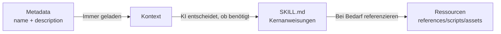

# Skill-Struktur im Detail

## Was Sie lernen werden

- Die Anforderungen und Formatspezifikationen aller SKILL.md-Felder präzise verstehen
- Die Designprinzipien und Einsatzszenarien von references/, scripts/, assets/ meistern
- Token-Nutzung und Ladepflichtance von Skills optimieren
- Häufige Formatfehler und Pfad-Auflösungsprobleme vermeiden
- Die KI-Kontext-Effizienz durch progressives Laden verbessern

## Ihre aktuelle Situation

Sie haben bereits gelernt, grundlegende Skills zu erstellen, aber die vollständigen Spezifikationen von SKILL.md sind noch nicht vollständig bekannt. Ihr Skill könnte folgende Probleme haben:

- SKILL.md zu lang, was zu hohem Token-Verbrauch führt
- Unsicherheit, welche Inhalte in references/ statt in SKILL.md gehören sollten
- KI-Agents können Ressourcen in scripts/ oder assets/ nicht korrekt laden
- YAML-Frontmatter-Formatfehler führen zu Installationsfehlern

## Wann Sie diese Methode verwenden sollten

- **Skill-Überprüfung**: Prüfen, ob vorhandene Skills den Anthropic-Spezifikationen entsprechen
- **Performance-Optimierung**: Probleme mit langsamem Skill-Laden oder Token-Limit lösen
- **Ressourcen-Refactoring**: Große Skills in SKILL.md + bundled resources aufteilen
- **Komplexe Skill-Entwicklung**: Vollständige Skills mit API-Dokumentationen und ausführbaren Skripten schreiben

## 🎒 Vorbereitungen vor dem Start

::: warning Voraussetzungen prüfen

Bevor Sie beginnen, stellen Sie sicher, dass:

- ✅ [Benutzerdefinierte Skills erstellen](../create-skills/) gelesen wurde
- ✅ Mindestens ein Skill installiert wurde (Grundlegende Abläufe verstehen)
- ✅ Grundlegende YAML- und Markdown-Syntax bekannt ist

:::

## Kernkonzept

### Designphilosophie von SKILL.md

**SKILL.md** ist der Kern des Anthropic-Skill-Systems und verwendet ein **progressives Lade-Design**:



**Vorteile des dreischichtigen Ladens**:

1. **Metadata-Schicht**: `name` und `description` aller Skills sind immer im Kontext, sodass die KI schnell verfügbare Skills erkennen kann
2. **SKILL.md-Schicht**: Nur bei Relevanz geladen, enthält Kernanweisungen (< 5000 Wörter)
3. **Ressourcen-Schicht**: Detaillierte Dokumentationen und ausführbare Dateien werden bei Bedarf geladen, um Token-Verschwendung zu vermeiden

### Klassifizierung von Bundled Resources

| Verzeichnis      | In Kontext geladen | Einsatzszenarien              | Beispieltypen                |
|--- | --- | --- | ---|
| `references/` | ✅ Bei Bedarf      | Detaillierte Dokumentationen, API-Beschreibungen      | API-Dokumente, Datenbank-Schemas  |
| `scripts/`  | ❌ Nicht geladen        | Ausführbarer Code            | Python/Bash-Skripte        |
| `assets/`   | ❌ Nicht geladen        | Vorlagen, Ausgabedateien, Bilder  | JSON-Vorlagen, Boilerplate-Code     |

## Schritt für Schritt

### Schritt 1: Vollständige Spezifikationen von YAML Frontmatter verstehen

**Warum**: YAML-Frontmatter sind die Metadaten eines Skills und müssen strengen Spezifikationen entsprechen

SKILL.md muss mit `---` beginnen und enden:

```yaml
---
name: my-skill
description: Use this skill when you need to demonstrate proper format.
---
```

**Erforderliche Felder**:

| Feld       | Typ     | Formatanforderungen                          | Beispiel                    |
|--- | --- | --- | ---|
| `name`     | string   | Bindestrich-Format (kebab-case), keine Leerzeichen | `pdf-editor`, `api-client` |
| `description` | string | 1-2 Sätze, dritte Person                | `Use this skill to edit PDF files` |

::: danger Häufige Fehler

| Fehlerbeispiel | Problem | Korrektur |
|--- | --- | ---|
| `name: My Skill` | Enthält Leerzeichen | Ändern zu `name: my-skill` |
| `name: my_skill` | Unterstrich-Format | Ändern zu `name: my-skill` |
| `description: You should use this when...` | Zweite Person | Ändern zu `description: Use this skill when...` |
| `description:` zu lang | Über 100 Wörter | Zusammenfassen auf 1-2 Sätze |
| Fehlendes abschließendes `---` | YAML nicht korrekt geschlossen | Abschließendes Trennzeichen hinzufügen |

:::

**Quellcode-Verifizierung**: OpenSkills verwendet einen nicht-gierigen Regex zur Format-Verifizierung

```typescript
// src/utils/yaml.ts
export function hasValidFrontmatter(content: string): boolean {
  return content.trim().startsWith('---');
}

export function extractYamlField(content: string, field: string): string {
  const match = content.match(new RegExp(`^${field}:\\s*(.+?)$`, 'm'));
  return match ? match[1].trim() : '';
}
```

---

### Schritt 2: SKILL.md-Hauptteil schreiben (Imperative Form)

**Warum**: KI-Agents erwarten imperative Anweisungen, keine dialogischen Beschreibungen

**Korrekte Positionierung**:

```markdown
## Instructions

To execute this task:

1. Read the input file
2. Process data using the algorithm
3. Generate output in specified format
```

**Falsche Positionierung** (vermeiden):

```markdown
## Instructions

You should execute this task by:

1. Reading the input file
2. Processing data using the algorithm
3. Generating output in specified format
```

**Vergleichstabelle**:

| ✅ Korrekt (Imperativ/Infinitiv) | ❌ Falsch (Zweite Person) |
|--- | ---|
| "Load this skill when X"       | "If you need Y"        |
| "To accomplish Z, execute A"   | "You should do Z"      |
| "See references/guide.md"     | "When you want to Z"   |

**Schreib-Regeln**:

1. **Verb am Anfang**: `Create` → `Use` → `Return`
2. **"You" weglassen**: Nicht "You should" sagen
3. **Klare Pfade**: Bei Ressourcenreferenzen `references/`, `scripts/`, `assets/`-Präfix verwenden

---

### Schritt 3: references/ für detaillierte Dokumentationen verwenden

**Warum**: SKILL.md übersichtlich halten, detaillierte Dokumentationen bei Bedarf laden

**Einsatzszenarien**:

- API-Dokumentationen (Endpoint-Beschreibungen über 500 Wörter)
- Datenbank-Schemas (Tabellenstruktur, Felddefinitionen)
- Detaillierte Anleitungen (Konfigurationsoptionen, häufige Fragen)
- Code-Beispiele (große Code-Schnipsel)

**Verzeichnisstruktur**:

```
my-skill/
├── SKILL.md              (~2.000 Wörter, Kernanweisungen)
└── references/
    ├── api-docs.md       (Detaillierte API-Dokumentation)
    ├── database-schema.md (Datenbankstruktur)
    └── troubleshooting.md (Fehlerbehebungsanleitung)
```

**Referenzierung in SKILL.md**:

```markdown
## Instructions

To interact with the API:

1. Read the request parameters
2. Call the API endpoint
3. For detailed response format, see `references/api-docs.md`
4. Parse the response
5. Handle errors (see `references/troubleshooting.md`)
```

**Beispiel references/api-docs.md**:

```markdown
# API Documentation

## Overview

This API provides endpoints for data processing.

## Endpoints

### POST /api/process

**Request:**
```json
{
  "input": "data to process",
  "options": {
    "format": "json"
  }
}
```

**Response:**
```json
{
  "status": "success",
  "result": {
    "output": "processed data"
  }
}
```

**Error Codes:**
- `400`: Invalid input format
- `500`: Server error
```

::: tip Best Practices

**Dateigrößen-Empfehlungen für references/**:
- Einzelne Datei: Empfohlen < 10.000 Wörter
- Gesamtgröße: Empfohlen < 50.000 Wörter (mehrere Dateien aufgeteilt)
- Benennung: Bindestrich-Format verwenden (`api-docs.md` statt `API_Docs.md`)

:::

---

### Schritt 4: scripts/ für deterministische Aufgaben verwenden

**Warum**: Ausführbare Skripte müssen nicht in den Kontext geladen werden, eignet sich für wiederkehrende Aufgaben

**Einsatzszenarien**:

- Datenkonvertierung (JSON → CSV, Formatkonvertierung)
- Dateiverarbeitung (Komprimierung, Dekomprimierung, Umbenennung)
- Code-Generierung (Code aus Vorlagen generieren)
- Testausführung (Unit-Tests, Integrationstests)

**Verzeichnisstruktur**:

```
my-skill/
├── SKILL.md
└── scripts/
    ├── process.py       (Python-Skript)
    ├── transform.sh     (Bash-Skript)
    └── validate.js     (Node.js-Skript)
```

**Referenzierung in SKILL.md**:

```markdown
## Instructions

To process the input data:

1. Validate the input file format
2. Execute the processing script:
   ```bash
   python scripts/process.py --input data.json --output result.json
   ```
3. Verify the output file
4. If validation fails, see `scripts/validate.py` for error messages
```

**Beispiel scripts/process.py**:

```python
#!/usr/bin/env python3
import json
import sys

def main():
    input_file = sys.argv[1]
    output_file = sys.argv[2]

    with open(input_file, 'r') as f:
        data = json.load(f)

    # Processing logic
    result = transform_data(data)

    with open(output_file, 'w') as f:
        json.dump(result, f, indent=2)

    print(f"✅ Processed {input_file} → {output_file}")

if __name__ == "__main__":
    main()
```

::: info Vorteile von scripts/

Im Vergleich zu Inline-Code in SKILL.md:

| Eigenschaft       | Inline-Code        | scripts/            |
|--- | --- | ---|
| Token-Verbrauch | ✅ Hoch           | ❌ Niedrig              |
| Wiederverwendbarkeit   | ❌ Schlecht           | ✅ Gut              |
| Testbarkeit   | ❌ Schwierig           | ✅ Einfach              |
| Komplexitätslimit | ❌ Durch Token limitiert | ✅ Unbegrenzt          |

:::

---

### Schritt 5: assets/ für Vorlagen und Ausgabedateien verwenden

**Warum**: Vorlagen und Ausgabedateien müssen nicht in den Kontext geladen werden, sparen Token

**Einsatzszenarien**:

- Ausgabevorlagen (JSON, XML, Markdown-Vorlagen)
| Boilerplate-Code (Projektgerüst, Konfigurationsdateien)
- Bilder und Diagramme (Flussdiagramme, Architekturdiagramme)
- Testdaten (Muster-Eingaben, erwartete Ausgaben)

**Verzeichnisstruktur**:

```
my-skill/
├── SKILL.md
└── assets/
    ├── template.json    (JSON-Vorlage)
    ├── boilerplate.js   (Boilerplate-Code)
    └── diagram.png     (Flussdiagramm)
```

**Referenzierung in SKILL.md**:

```markdown
## Instructions

To generate the output file:

1. Load the template: `assets/template.json`
2. Replace placeholders with actual data
3. Write to output file
4. For boilerplate code, see `assets/boilerplate.js`
```

**Beispiel assets/template.json**:

```json
{
  "title": "{{ title }}",
  "description": "{{ description }}",
  "version": "{{ version }}",
  "author": "{{ author }}",
  "created_at": "{{ timestamp }}"
}
```

**Verwenden von Vorlagen in Skripten**:

```python
import json
from string import Template

def generate_output(data, template_path):
    with open(template_path, 'r') as f:
        template_str = f.read()

    template = Template(template_str)
    output = template.safe_substitute(data)

    return output
```

::: warning Hinweise zu assets/

- **Nicht in Kontext laden**: KI-Agents können den Inhalt nicht direkt lesen, müssen über Skripte laden
- **Pfadauflösung**: Relative Pfade verwenden, z. B. `assets/template.json`
- **Dateigröße**: Empfohlene Einzelgröße < 10MB (Vermeidung von Übertragungsverzögerungen)

:::

---

### Schritt 6: Dateigröße und Performance optimieren

**Warum**: Dateigröße beeinflusst direkt den Token-Verbrauch und die Ladegeschwindigkeit des KI-Kontexts

**Dateigrößen-Richtlinien** (offizielle Empfehlungen):

| Verzeichnis      | Größenlimit        | Ladeverhalten          |
|--- | --- | ---|
| SKILL.md  | < 5.000 Wörter     | Immer geladen (bei Bedarf) |
| references/ | Keine strikte Begrenzung      | Bei Bedarf geladen         |
| scripts/  | Wird nicht in Token einbezogen    | Nicht geladen, nur ausgeführt     |
| assets/   | Nicht in Kontext geladen  | Nicht geladen, nur kopiert     |

**Performance-Optimierungs-Tipps**:

1. **references/ aufteilen**:
   ```bash
   # ❌ Einzelne große Datei (20.000 Wörter)
   references/all-docs.md

   # ✅ In mehrere kleine Dateien aufteilen (jeweils < 5.000 Wörter)
   references/
   ├── api-docs.md
   ├── database-schema.md
   └── troubleshooting.md
   ```

2. **scripts/ zur Datenverarbeitung verwenden**:
   ```markdown
   # ❌ Große Codeblöcke in SKILL.md inline (verbraucht Token)
   ## Instructions
   Execute this code:
   ```python
   # 500 lines of code...
   ```

   # ✅ Referenzieren von scripts/ (verbraucht keine Token)
   ## Instructions
   Execute: `python scripts/processor.py`
   ```

3. **SKILL.md straffen**:
   - Nur Kernanweisungen und Schritte behalten
   - Detaillierte Erklärungen nach `references/` verschieben
   - Prägnante imperative Sprache verwenden

**Verifizierung der Dateigröße**:

```bash
# Wörter in SKILL.md zählen
wc -w my-skill/SKILL.md

# Gesamtwörter in references/ zählen
find my-skill/references -name "*.md" -exec wc -w {} + | tail -1

# Dateigröße von scripts/ prüfen
du -sh my-skill/scripts/
```

---

### Schritt 7: Ressourcen-Auflösungsmechanismus verstehen

**Warum**: Pfad-Auflösungsregeln verstehen, Referenzierungsfehler vermeiden

**Konzept des Base Directory**:

Wenn ein KI-Agent einen Skill lädt, gibt `openskills read` das Base Directory aus:

```
Reading: my-skill
Base directory: /path/to/project/.claude/skills/my-skill
```

**Regeln für relative Pfadauflösung**:

| Referenzpfad              | Auflösungsergebnis                                                  |
|--- | ---|
| `references/api.md`   | `/base/directory/references/api.md`                          |
| `scripts/process.py`  | `/base/directory/scripts/process.py`                         |
| `assets/template.json` | `/base/directory/assets/template.json`                       |

**Quellcode-Verifizierung**:

```typescript
// src/commands/read.ts
export function readSkill(skillNames: string[] | string): void {
  const skill = findSkill(name);
  const content = readFileSync(skill.path, 'utf-8');

  // Base Directory ausgeben, damit KI relative Pfade auflösen kann
  console.log(`Base directory: ${skill.baseDir}`);
  console.log(content);
}
```

::: danger Beispiele für Pfadfehler

| ❌ Falsche Schreibweise                      | Problem                | ✅ Korrekte Schreibweise              |
|--- | --- | ---|
| `/absolute/path/to/api.md`      | Absoluter Pfad verwenden         | `references/api.md`     |
| `../other-skill/references/api.md` | Skill-übergreifende Referenz           | `references/api.md`     |
| `~/references/api.md`           | Tilde-Expansion verwenden      | `references/api.md`     |

:::

---

### Schritt 8: Skill-Format validieren

**Warum**: Format vor Installation validieren, Laufzeitfehler vermeiden

**Mit openskills validieren**:

```bash
npx openskills install ./my-skill
```

**Sie sollten sehen**:

```
✔ Found skill: my-skill
  Description: Use this skill when you need to demonstrate proper format.
  Size: 2.1 KB

? Select skills to install: (Use arrow keys)
❯ ☑ my-skill
```

**Validierungs-Checkliste**:

- [ ] SKILL.md beginnt mit `---`
- [ ] Enthält Feld `name` (Bindestrich-Format)
- [ ] Enthält Feld `description` (1-2 Sätze)
- [ ] YAML endet mit `---`
- [ ] Hauptteil verwendet imperative/Infinitiv-Form
- [ ] Alle `references/`, `scripts/`, `assets/`-Referenzen verwenden relative Pfade
- [ ] SKILL.md Wörter < 5.000 Wörter
- [ ] Dateinamen in references/ verwenden Bindestrich-Format

**Manuelle Validierung von YAML-Frontmatter**:

```bash
# Prüfen, ob mit --- beginnt
head -1 my-skill/SKILL.md

# YAML-Felder validieren (mit yq oder anderen Tools)
yq eval '.name' my-skill/SKILL.md
```

---

### Schritt 9: Skill-Laden testen

**Warum**: Sicherstellen, dass der Skill korrekt in den KI-Kontext geladen werden kann

**Mit openskills read testen**:

```bash
npx openskills read my-skill
```

**Sie sollten sehen**:

```
Reading: my-skill
Base directory: /path/to/project/.claude/skills/my-skill

---
name: my-skill
description: Use this skill when you need to demonstrate proper format.
---

# My Skill

## Instructions

To execute this task...

## Bundled Resources

For detailed information: see `references/skill-format.md`

Skill read: my-skill
```

**Checkpunkte**:

- ✅ Ausgabe enthält `Base directory` (für Pfadauflösung)
- ✅ SKILL.md-Inhalt vollständig (inkl. YAML und Hauptteil)
- ✅ Kein "Invalid SKILL.md"-Fehler
- ✅ Alle Referenzpfade korrekt angezeigt

## Checkpunkt ✅

Nach Abschluss der obigen Schritte sollten Sie:

- ✅ Die vollständigen Feldspezifikationen von SKILL.md verstehen
- ✅ Die Einsatzszenarien von references/, scripts/, assets/ meistern
- ✅ Die Dateigröße und Ladepflichtance von Skills optimieren können
- ✅ Wissen, wie man Skill-Formate validiert und das Laden testet
- ✅ Den Ressourcen-Auflösungsmechanismus und das Base Directory verstehen

## Fallstricke

### Problem 1: SKILL.md über 5000 Wörter führt zu Token-Limit

**Ursache**: SKILL.md enthält zu viele detaillierte Dokumentationen

**Lösung**:
1. Detaillierte Inhalte in das Verzeichnis `references/` verschieben
2. In SKILL.md referenzieren: `See references/guide.md for details`
3. Mit `wc -w SKILL.md` die Wortzahl prüfen

---

### Problem 2: scripts/-Skripte lassen sich nicht ausführen

**Ursache**:
- Skript fehlt Ausführungsrechte
- Absoluter Pfad statt relativer Pfad verwendet

**Lösung**:
```bash
# Ausführungsrechte hinzufügen
chmod +x my-skill/scripts/*.sh

# Relative Pfade in SKILL.md verwenden
## Instructions
Execute: `python scripts/process.py`  # ✅ Korrekt
Execute: `/path/to/my-skill/scripts/process.py`  # ❌ Falsch
```

---

### Problem 3: references/-Dateien werden bei Bedarf geladen, aber KI kann sie nicht lesen

**Ursache**: KI-Agent löst `references/`-Pfade nicht korrekt auf

**Lösung**:
1. Bestätigen, dass `openskills read` das `Base Directory` ausgibt
2. Bei Referenzierung klar angeben: `See references/api-docs.md in base directory`
3. Absolute Pfade oder skill-übergreifende Referenzen vermeiden

---

### Problem 4: assets/-Dateien zu groß, führt zu Übertragungsverzögerungen

**Ursache**: assets/ speichert große Binärdateien (> 10MB)

**Lösung**:
- Bilder komprimieren: PNG statt BMP verwenden, JPEG-Qualität optimieren
- Daten aufteilen: Große Datensätze in mehrere kleine Dateien aufteilen
- Externen Speicher verwenden: Für sehr große Dateien Download-Links anbieten statt direkte Einbindung

---

### Problem 5: YAML-Frontmatter-Formatfehler

**Ursache**:
- Fehlendes abschließendes `---`
- Feldwerte enthalten Sonderzeichen (Doppelpunkt, Raute) ohne Anführungszeichen

**Lösung**:
```yaml
# ❌ Falsch: Fehlendes abschließendes ---
---
name: my-skill
description: Use this skill: for testing
# Fehlendes ---

# ✅ Korrekt: Vollständig geschlossen
---
name: my-skill
description: "Use this skill: for testing"
---
```

---

### Problem 6: Anweisungen verwenden zweite Person (Second Person)

**Ursache**: Gewohnheitsmäßige Verwendung von "You should", "When you want"

**Lösung**:
- Imperative Sprache mit Verben am Anfang verwenden
- "To do X, execute Y" statt "You should do Y" verwenden
- "Load this skill when Z" statt "If you need Z" verwenden

**Vergleichstabelle**:

| Zweite Person (❌ Vermeiden)     | Imperativ (✅ Empfohlen)         |
|--- | ---|
| "You should execute..." | "To execute X, run..."   |
| "When you want to..."  | "Load this skill when..."  |
| "If you need..."       | "Use X to accomplish Y"    |

## Lektionszusammenfassung

Kernpunkte der Skill-Struktur:

1. **YAML-Frontmatter**: Erforderliche Felder `name` (Bindestrich-Format) und `description` (1-2 Sätze)
2. **Hauptteil-Format**: Imperative/Infinitiv-Form verwenden, zweite Person vermeiden
3. **references/**: Detaillierte Dokumentationen speichern, bei Bedarf in Kontext laden (< 10.000 Wörter/Datei)
4. **scripts/**: Ausführbare Skripte speichern, nicht in Kontext laden, eignet sich für deterministische Aufgaben
5. **assets/**: Vorlagen und Ausgabedateien speichern, nicht in Kontext laden
6. **Dateigröße**: SKILL.md < 5.000 Wörter, references/ kann aufgeteilt werden, scripts/ unbegrenzt
7. **Pfadauflösung**: Relative Pfade verwenden (`references/`, `scripts/`, `assets/`), auf Basis von Base Directory auflösen
8. **Validierungsmethoden**: Mit `openskills install` Format validieren, mit `openskills read` Laden testen

## Vorschau auf die nächste Lektion

> In der nächsten Lektion lernen wir **[CI/CD-Integration](../ci-integration/)**.
>
> Sie werden lernen:
> - Wie man das Flag `-y/--yes` in CI/CD-Umgebungen verwendet
> - Automatisierte Skill-Installation und -Synchronisierungsprozesse
> - Integration von OpenSkills in GitHub Actions, GitLab CI

---

## Anhang: Quellcode-Referenz

<details>
<summary><strong>Klicken Sie, um Quellcode-Position anzuzeigen</strong></summary>

> Aktualisiert: 2026-01-24

| Funktion           | Dateipfad                                                                 | Zeilennummer    |
|--- | --- | ---|
| YAML-Frontmatter-Validierung | [`src/utils/yaml.ts`](https://github.com/numman-ali/openskills/blob/main/src/utils/yaml.ts) | 12-14   |
| YAML-Feldextraktion  | [`src/utils/yaml.ts`](https://github.com/numman-ali/openskills/blob/main/src/utils/yaml.ts) | 4-7     |
| Skill-Lese-Befehl  | [`src/commands/read.ts`](https://github.com/numman-ali/openskills/blob/main/src/commands/read.ts) | 1-49    |
| Base Directory-Ausgabe | [`src/commands/read.ts`](https://github.com/numman-ali/openskills/blob/main/src/commands/read.ts) | 42      |
| Format-Validierung bei Installation  | [`src/commands/install.ts`](https://github.com/numman-ali/openskills/blob/main/src/commands/install.ts) | 242, 291, 340 |

**Beispiel-Skill-Dateien**:
- [`examples/my-first-skill/SKILL.md`](https://github.com/numman-ali/openskills/blob/main/examples/my-first-skill/SKILL.md) - Vollständiges Strukturbeispiel
- [`examples/my-first-skill/references/skill-format.md`](https://github.com/numman-ali/openskills/blob/main/examples/my-first-skill/references/skill-format.md) - Format-Spezifikationsreferenz

**Schlüsselfunktionen**:
- `hasValidFrontmatter(content: string): boolean` - Validieren, ob SKILL.md mit `---` beginnt
- `extractYamlField(content: string, field: string): string` - YAML-Feldwert extrahieren (nicht-gierige Übereinstimmung)
- `readSkill(skillNames: string[] | string): void` - Skill in Standardausgabe lesen (für KI-Verwendung)

</details>
