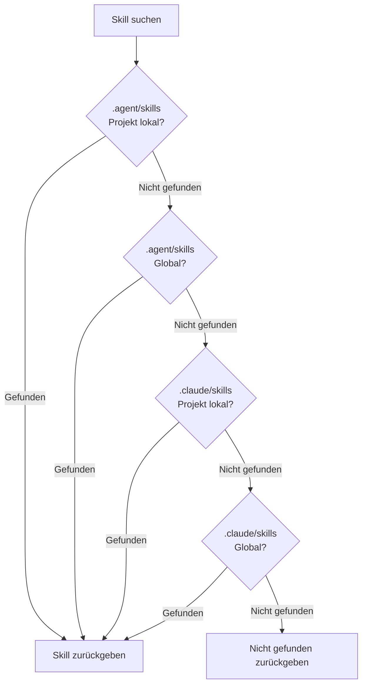

# Universal-Modus: Multi-Agent-Umgebung

## Was Sie nach diesem Tutorial können

- Den Kernwert und das Designziel des Universal-Modus verstehen
- Die Verwendung des `--universal`-Flags meistern
- Den Unterschied zwischen `.agent/skills` und `.claude/skills` verstehen
- Die 4-stufige Suchprioritätsregel verstehen
- Skills in Multi-Agent-Umgebungen einheitlich verwalten und Konflikte vermeiden
- Dieselben Skills für mehrere Agents wie Claude Code, Cursor, Windsurf, Aider usw. teilen

::: info Voraussetzungen

Dieses Tutorial setzt voraus, dass Sie [Globale Installation vs. Projektlokale Installation](../../platforms/global-vs-project/) und [Skills zu AGENTS.md synchronisieren](../../start/sync-to-agents/) bereits kennen und die grundlegenden Installationsorte und Synchronisationsabläufe verstehen.

:::

---

## Ihr aktuelles Problem

Sie haben vielleicht bereits gelernt, wie man Skills installiert und synchronisiert, aber:

- **Wie teilen mehrere Agents Skills?**: Sie verwenden gleichzeitig Claude Code und Cursor, installieren Skills jedoch separat, was zu einem chaotischen Management führt
- **Claude Code Marketplace-Konflikte**: Nach der Installation von Skills kommt es zu Konflikten mit dem nativen Plugin-Marktplatz von Claude Code
- **AGENTS.md-Speicherorte sind nicht einheitlich**: Verschiedene Agents benötigen unterschiedliche AGENTS.md-Pfade, was die Wartung erschwert
- **Skills sind doppelt installiert**: Jeder Agent muss seinen eigenen Satz an Skills installieren, was Speicherplatz verschwendet

Tatsächlich bietet OpenSkills den Universal-Modus, der speziell für die Skill-Verwaltung in Multi-Agent-Umgebungen entwickelt wurde.

---

## Wann verwenden Sie diesen Ansatz

**Anwendungsszenarien für den Universal-Modus**:

| Szenario | Universal-Modus erforderlich | Beispiel |
|--- | --- | ---|
| **Einzelner Agent** (nur Claude Code) | ❌ Nein | Nur Claude Code verwenden, direkt das Standard-`.claude/skills` verwenden |
| **Multi-Agent** (Claude Code + andere) | ✅ Ja | Gleichzeitig Claude Code und Cursor/Windsurf/Aider verwenden |
| **Marketplace-Konflikte vermeiden** | ✅ Ja | Keine Konflikte mit dem nativen Plugin-Marktplatz von Claude Code |
| **Einheitliche AGENTS.md-Verwaltung** | ✅ Ja | Mehrere Agents teilen sich dieselbe AGENTS.md-Datei |

::: tip Empfohlene Vorgehensweise

- **Einzelner Agent: Standardmodus**: Bei nur Claude Code mit dem Standard-`.claude/skills` installieren
- **Multi-Agent: Universal-Modus**: Bei gleichzeitiger Verwendung mehrerer Agents mit `--universal` in `.agent/skills` installieren
- **Teamarbeit: Einheitliche Standards**: Im Team klar festlegen, welcher Modus verwendet wird, um Verwirrung zu vermeiden

:::

---

## Kernkonzept: Einheitliches Verzeichnis, Multi-Agent-Sharing

OpenSkills bietet zwei Verzeichnismodi für Skills:

**Standardmodus (`.claude/skills`)**:
- Speziell für Claude Code entwickelt
- Kompatibel mit Claude Code Marketplace
- Installationsort: `./.claude/skills/` oder `~/.claude/skills/`

**Universal-Modus (`.agent/skills`)**:
- Speziell für Multi-Agent-Umgebungen entwickelt
- Vermeidet Konflikte mit Claude Code Marketplace
- Installationsort: `./.agent/skills/` oder `~/.agent/skills/`

::: info Wichtiges Konzept

**Universal-Modus**: Verwenden Sie das `--universal`-Flag, um Skills in das `.agent/skills/`-Verzeichnis zu installieren, sodass mehrere KI-Codierungs-Agents (Claude Code, Cursor, Windsurf, Aider usw.) denselben Satz an Skills teilen und einheitlich über AGENTS.md verwaltet werden können.

:::

**4-stufige Suchpriorität** (Quellcode `dirs.ts:18-24`):

```typescript
export function getSearchDirs(): string[] {
  return [
    join(process.cwd(), '.agent/skills'),   // 1. Project universal (höchste Priorität)
    join(homedir(), '.agent/skills'),        // 2. Global universal
    join(process.cwd(), '.claude/skills'),  // 3. Project claude
    join(homedir(), '.claude/skills'),       // 4. Global claude
  ];
}
```

**Prioritätserklärung**:
1. **Project Universal** (am höchsten): `.agent/skills/` hat Vorrang vor `.claude/skills/`
2. **Global Universal**: Zweitens wird nach global `.agent/skills/` gesucht
3. **Project Claude**: Dann das projektlokale `.claude/skills/`
4. **Global Claude** (am niedrigsten): Zuletzt das globale `.claude/skills/`

---

## Schritt für Schritt

### Schritt 1: Skills im Universal-Modus installieren

**Warum**
Lernen Sie zuerst, wie Sie Skills mit dem `--universal`-Flag installieren.

Öffnen Sie das Terminal und führen Sie den Befehl in einem beliebigen Projekt aus:

```bash
# Skills im Universal-Modus installieren
npx openskills install anthropics/skills --universal -y

# Skill-Liste anzeigen
npx openskills list
```

**Sie sollten sehen**: Hinter jeder Skill in der Skill-Liste steht ein `(project)`-Tag

```
  codebase-reviewer         (project)
    Review code changes for issues...

Summary: 3 project, 0 global (3 total)
```

**Erklärung**:
- Nach Verwendung des `--universal`-Flags werden Skills im Verzeichnis `./.agent/skills/` installiert
- Der `list`-Befehl zeigt weiterhin die Tags `(project)` oder `(global)` an
- `.agent/skills/` und das Standard-`.claude/skills/` geraten nicht in Konflikt

---

### Schritt 2: Skill-Installationsort anzeigen

**Warum**
Bestätigen Sie den tatsächlichen Speicherort der Skill-Dateien und verstehen Sie die Verzeichnisstruktur des Universal-Modus.

Führen Sie den Befehl im Projektstammverzeichnis aus:

```bash
# Skill-Verzeichnis im Universal-Modus anzeigen
ls -la .agent/skills/

# Inhalt des Skill-Verzeichnisses anzeigen
ls -la .agent/skills/codebase-reviewer/
```

**Sie sollten sehen**:

```
.agent/skills/
├── codebase-reviewer/
│   ├── SKILL.md
│   └── .openskills.json    # Installations-Metadaten
├── file-writer/
│   ├── SKILL.md
│   └── .openskills.json
└── ...
```

**Erklärung**:
- Skills im Universal-Modus werden im Verzeichnis `.agent/skills/` installiert
- Jede Skill hat ihr eigenes Verzeichnis und Metadaten
- Dies ist identisch mit der Struktur des Standard-`.claude/skills/`

---

### Schritt 3: Verzeichnisstrukturen beider Modi vergleichen

**Warum**
Durch einen tatsächlichen Vergleich verstehen Sie den Unterschied zwischen `.claude/skills` und `.agent/skills`.

Führen Sie die folgenden Befehle aus:

```bash
# Skill-Verzeichnisse beider Modi anzeigen
echo "=== .claude/skills (Standardmodus) ==="
ls -la .claude/skills/ 2>/dev/null || echo "Verzeichnis existiert nicht"

echo "=== .agent/skills (Universal-Modus) ==="
ls -la .agent/skills/

# Global installierte Verzeichnisse anzeigen
echo "=== ~/.claude/skills (global Standard) ==="
ls -la ~/.claude/skills/ 2>/dev/null || echo "Verzeichnis existiert nicht"

echo "=== ~/.agent/skills (global Universal) ==="
ls -la ~/.agent/skills/ 2>/dev/null || echo "Verzeichnis existiert nicht"
```

**Sie sollten sehen**:

```
=== .claude/skills (Standardmodus) ===
Verzeichnis existiert nicht

=== .agent/skills (Universal-Modus) ===
codebase-reviewer
file-writer

=== ~/.claude/skills (global Standard) ===
git-helper
test-generator

=== ~/.agent/skills (global Universal) ===
Verzeichnis existiert nicht
```

**Erklärung**:
- `.claude/skills/` und `.agent/skills/` sind zwei unabhängige Verzeichnisse
- Sie können gleichzeitig existieren und sich gegenseitig nicht stören
- Es werden sowohl projektlokale als auch globale Installationsarten unterstützt

---

### Schritt 4: Globale Universal-Installation

**Warum**
Erfahren Sie, wie Sie Universal-Skills global installieren, um alle Projekte zu bedienen.

Führen Sie den Befehl aus:

```bash
# Skills global im Universal-Modus installieren
npx openskills install anthropics/skills --universal --global -y

# Skill-Liste anzeigen
npx openskills list
```

**Sie sollten sehen**:

```
  codebase-reviewer         (project)
    Review code changes for issues...
  file-writer              (global)
    Write files with format...

Summary: 1 project, 2 global (3 total)
```

**Erklärung**:
- `--universal` und `--global` können kombiniert werden
- Installation im Verzeichnis `~/.agent/skills/`
- Alle Projekte können diese Skills verwenden

---

### Schritt 5: 4-stufige Suchpriorität verifizieren

**Warum**
Verstehen Sie, wie OpenSkills Skills in den 4 Verzeichnissen sucht.

Führen Sie den Befehl aus:

```bash
# Installieren Sie Skills mit demselben Namen an 4 Positionen (verschiedene Versionen)
# 1. Project Universal
npx openskills install anthropics/skills --universal -y
# 2. Global Universal
npx openskills install anthropics/skills --universal --global -y
# 3. Project Claude
npx openskills install anthropics/skills -y
# 4. Global Claude
npx openskills install anthropics/skills --global -y

# Skill lesen (wird die Project Universal-Version bevorzugen)
npx openskills read codebase-reviewer | head -5
```

**Sie sollten sehen**: Die Ausgabe ist der Inhalt der `.agent/skills/` (Project Universal)-Version des Skills.

**Visualisierung der Suchpriorität**:



**Erklärung**:
- `.agent/skills/` hat eine höhere Priorität als `.claude/skills/`
- Projektlokale Priorität ist höher als globale
- Wenn Skills mit demselben Namen gleichzeitig vorhanden sind, wird die Project Universal-Version bevorzugt
- Auf diese Weise kann eine flexible Konfiguration mit "Universal-Priorität" erreicht werden

---

### Schritt 6: Claude Code Marketplace-Konflikte vermeiden

**Warum**
Verstehen Sie, wie der Universal-Modus Konflikte mit dem Claude Code Marketplace löst.

Führen Sie den Befehl aus:

```bash
# Skills im Universal-Modus installieren
npx openskills install anthropics/skills --universal -y

# Zu AGENTS.md synchronisieren
npx openskills sync

# AGENTS.md anzeigen
cat AGENTS.md
```

**Sie sollten sehen**: AGENTS.md enthält eine Skill-Liste und gerät nicht mit dem Claude Code Marketplace in Konflikt.

**Erklärung**:
- Der Universal-Modus verwendet `.agent/skills/`, getrennt von `.claude/skills/` von Claude Code
- Vermeidet Konflikte zwischen von OpenSkills installierten Skills und Claude Code Marketplace-Plugins
- Mehrere Agents können dieselbe AGENTS.md teilen und einheitlich verwaltet werden

---

## Kontrollpunkt ✅

Führen Sie die folgenden Überprüfungen durch, um zu bestätigen, dass Sie den Inhalt dieses Tutorials beherrschen:

- [ ] Können Sie zwischen den beiden Modi `.claude/skills` und `.agent/skills` unterscheiden
- [ ] Wissen Sie, was das `--universal`-Flag bewirkt
- [ ] Verstehen Sie die 4-stufige Suchprioritätsregel
- [ ] Können Sie den geeigneten Installationsmodus basierend auf dem Szenario wählen
- [ ] Wissen Sie, wie Sie Skills in Multi-Agent-Umgebungen einheitlich verwalten
- [ ] Verstehen Sie, wie der Universal-Modus Marketplace-Konflikte vermeidet

---

## Häufige Fehler

### Häufiger Fehler 1: Universal-Modus fälschlicherweise bei einem einzelnen Agent verwenden

**Fehlerszenario**: Nur Claude Code verwenden, aber den Universal-Modus verwenden

```bash
# ❌ Fehler: Einzelner Agent benötigt keinen Universal-Modus
npx openskills install anthropics/skills --universal
```

**Problem**:
- Unnötige Komplexität hinzugefügt
- Kein reibungsloses Zusammenarbeiten mit Claude Code Marketplace-Plugins möglich
- AGENTS.md-Speicherort entspricht möglicherweise nicht den Erwartungen von Claude Code

**Richtige Vorgehensweise**:

```bash
# ✅ Richtig: Einzelner Agent verwendet Standardmodus
npx openskills install anthropics/skills
```

---

### Häufiger Fehler 2: Multi-Agent ohne Universal-Modus verwenden

**Fehlerszenario**: Gleichzeitig mehrere Agents verwenden, aber den Universal-Modus nicht verwenden

```bash
# ❌ Fehler: Jeder Agent installiert Skills separat, Management chaotisch
npx openskills install anthropics/skills  # Für Claude Code
npx openskills install anthropics/skills --global  # Für Cursor
```

**Problem**:
- Skills sind doppelt installiert, Speicherplatz verschwendet
- Skills-Versionen, die von verschiedenen Agents verwendet werden, können inkonsistent sein
- AGENTS.md muss separat gewartet werden

**Richtige Vorgehensweise**:

```bash
# ✅ Richtig: Multi-Agent verwendet Universal-Modus für einheitliche Verwaltung
npx openskills install anthropics/skills --universal
# Alle Agents teilen sich denselben Satz an Skills und AGENTS.md
```

---

### Häufiger Fehler 3: Suchpriorität des Universal-Modus vergessen

**Fehlerszenario**: In `.claude/skills` und `.agent/skills` Skills mit demselben Namen installiert, aber die `.claude/skills`-Version erwartet

```bash
# .agent/skills und .claude/skills haben beide codebase-reviewer
# Aber die .claude/skills-Version verwenden wollen
npx openskills install anthropics/skills --universal  # Neue Version in .agent/skills installieren
npx openskills install anthropics/skills  # Alte Version in .claude/skills installieren
npx openskills read codebase-reviewer  # ❌ Immer noch .agent/skills-Version gelesen
```

**Problem**:
- `.agent/skills` hat eine höhere Priorität als `.claude/skills`
- Selbst wenn `.claude/skills` eine neue Version installiert, wird weiterhin die `.agent/skills`-Version gelesen

**Richtige Vorgehensweise**:

```bash
# Lösung 1: .agent/skills-Version löschen
npx openskills remove codebase-reviewer  # .agent/skills-Version löschen
npx openskills read codebase-reviewer  # ✅ Jetzt .claude/skills-Version gelesen

# Lösung 2: .agent/skills-Version aktualisieren
npx openskills update codebase-reviewer  # .agent/skills-Version aktualisieren
```

---

### Häufiger Fehler 4: AGENTS.md-Pfadkonfiguration falsch

**Fehlerszenario**: Verschiedene Agents benötigen unterschiedliche AGENTS.md-Pfade

```bash
# Claude Code erwartet AGENTS.md im Stammverzeichnis
# Cursor erwartet AGENTS.md im Verzeichnis .cursor/
# Windsurf erwartet AGENTS.md im Verzeichnis .windsurf/
npx openskills sync  # Nur eine AGENTS.md generiert
```

**Problem**:
- Verschiedene Agents können AGENTS.md nicht finden
- Skill-Ladung schlägt fehl

**Richtige Vorgehensweise**:

```bash
# AGENTS.md an verschiedenen Positionen für verschiedene Agents generieren
npx openskills sync -o AGENTS.md           # Claude Code
npx openskills sync -o .cursor/AGENTS.md    # Cursor
npx openskills sync -o .windsurf/AGENTS.md  # Windsurf
```

---

## Zusammenfassung

**Kernpunkte**:

1. **Universal-Modus für Multi-Agent-Umgebungen**: Mit `--universal` in `.agent/skills/` installieren
2. **4-stufige Suchpriorität**: Project Universal > Global Universal > Project Claude > Global Claude
3. **Marketplace-Konflikte vermeiden**: `.agent/skills/` ist von `.claude/skills/` von Claude Code getrennt
4. **Einheitliche AGENTS.md-Verwaltung**: Mehrere Agents teilen sich dieselbe AGENTS.md-Datei
5. **Empfohlene Prinzipien**: Einzelner Agent verwendet Standardmodus, Multi-Agent verwendet Universal-Modus

**Entscheidungsablauf**:

```
[Skills installieren] → [Verwenden Sie mehrere Agents?]
                       ↓ Ja
               [Universal-Modus verwenden (--universal)]
                       ↓ Nein
               [Nur Claude Code verwenden?]
                       ↓ Ja
               [Standardmodus verwenden (.claude/skills)]
                       ↓ Nein
               [Spezifische Agent-Dokumentation lesen, geeigneten Modus wählen]
```

**Erinnerungshilfe**:

- **Einzelner Agent**: Standardmodus am einfachsten, Claude Code verwendet `.claude`
- **Multi-Agent**: Universal-Modus für einheitliche Verwaltung, `.agent/skills` vermeidet Konflikte

---

## Vorschau auf das nächste Tutorial

> Im nächsten Tutorial lernen wir **[Benutzerdefinierter Ausgabepfad](../custom-output-path/)**.
>
> Sie werden lernen:
> - Wie Sie das `--output/-o`-Flag verwenden, um den AGENTS.md-Ausgabepfad anzupassen
> - Wie Sie AGENTS.md an verschiedenen Positionen für verschiedene Agents generieren
> - Wie Sie benutzerdefinierte Ausgabepfade in CI/CD-Umgebungen verwenden
> - Wie Sie in bestehende Dokumentationssysteme integrieren

---

## Anhang: Quellcode-Referenz

<details>
<summary><strong>Klicken, um Quellcode-Positionen anzuzeigen</strong></summary>

> Aktualisiert: 2026-01-24

| Funktion | Dateipfad                                                                                          | Zeile    |
|--- | --- | ---|
| Verzeichnispfad-Tools | [`src/utils/dirs.ts`](https://github.com/numman-ali/openskills/blob/main/src/utils/dirs.ts#L7-L25)     | 7-25    |
| Installationsort-Prüfung | [`src/commands/install.ts`](https://github.com/numman-ali/openskills/blob/main/src/commands/install.ts#L84-L92) | 84-92   |
| Befehlszeilenparameter-Definition | [`src/cli.ts`](https://github.com/numman-ali/openskills/blob/main/src/cli.ts#L48)                    | 48      |

**Wichtige Konstanten**:
- `.claude/skills`: Standard-Skill-Verzeichnis (Claude Code kompatibel)
- `.agent/skills`: Universelles Skill-Verzeichnis (Multi-Agent-Umgebung)

**Wichtige Funktionen**:
- `getSkillsDir(projectLocal, universal)`: Gibt den Skill-Verzeichnispfad basierend auf dem Flag zurück
- `getSearchDirs()`: Gibt die Liste der Skill-Suchverzeichnisse zurück (4-stufige Priorität)

**Geschäftsregeln**:
- Universal-Modus verwendet das `.agent/skills/`-Verzeichnis
- 4-stufige Suchpriorität: Project Universal > Global Universal > Project Claude > Global Claude
- `--universal` und `--global` können kombiniert werden

</details>
