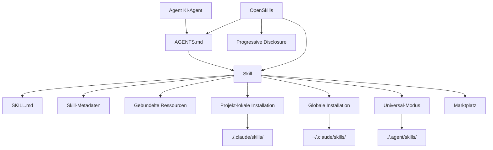

# Glossar

Dieses Glossar erklärt die Schlüsselkonzepte von OpenSkills und dem KI-Skill-System und hilft Ihnen, Fachbegriffe schnell zu verstehen.

::: info Hinweis
Dieses Glossar ist alphabetisch sortiert. Verwandte Begriffe werden in den Definitionen verlinkt.
:::

---

## A

### Agent (KI-Agent)

**Definition**: Ein KI-Agent ist ein KI-Tool, das Codierungsaufgaben ausführen kann, wie z.B. Claude Code, Cursor, Windsurf, Aider usw.

**Eigenschaften**:
- Kann die Konfigurationsdatei `AGENTS.md` lesen
- Unterstützt das Laden von Skills im SKILL.md-Format
- Kann externe Tools über die Kommandozeile aufrufen (z.B. `npx openskills read`)

**Rolle in OpenSkills**: OpenSkills ermöglicht es jedem Agenten, der AGENTS.md lesen kann, das Skill-Format von Anthropic zu nutzen.

**Verwandte Begriffe**: [Skill](#skill), [AGENTS.md](#agentsmd)

---

## B

### Base Directory (Basisverzeichnis)

**Definition**: Der vollständige Pfad des Skill-Verzeichnisses, der zur Auflösung relativer Pfadreferenzen innerhalb des Skills verwendet wird.

**Funktion**:
- Bietet den absoluten Pfad des Skill-Verzeichnisses
- Wird zur Auflösung relativer Pfade zu gebündelten Ressourcen wie `references/`, `scripts/`, `assets/` verwendet

**Beispiel**:
```
Basisverzeichnis: /path/to/my-first-skill
```

Wenn ein Skill auf `references/skill-format.md` verweist, wird dies tatsächlich aufgelöst als:
```
/path/to/my-first-skill/references/skill-format.md
```

**Verwandte Begriffe**: [Skill](#skill), [Bundled Resources](#bundled-resources)

---

### Bundled Resources (Gebündelte Ressourcen)

**Definition**: Ressourcendateien, die im Skill-Verzeichnis enthalten sind und detaillierte Informationen oder Tools für die Skill-Ausführung bereitstellen.

**Typen**:
- **`references/`** - Referenzdokumente, API-Dokumentation usw.
- **`scripts/`** - Ausführbare Skriptdateien
- **`assets/`** - Vorlagen, Beispieldateien usw.

**Verwendung**:
- Verschieben Sie detaillierte Dokumentation nach `references/`, um SKILL.md übersichtlich zu halten
- Platzieren Sie ausführbaren Code in `scripts/` für einfachen Aufruf
- Legen Sie Vorlagen und Beispiele in `assets/` ab, als Referenz für Benutzer

**Beispiel**:
```
my-skill/
├── SKILL.md
├── references/
│   └── api-docs.md
├── scripts/
│   └── helper.py
└── assets/
    └── template.json
```

**Verwandte Begriffe**: [Skill](#skill), [SKILL.md](#skillmd)

---

## G

### Global Install (Globale Installation)

**Definition**: Installiert einen Skill im Verzeichnis `.claude/skills` im Benutzer-Home-Verzeichnis, sodass alle Projekte auf diesen Skill zugreifen können.

**Befehlsbeispiel**:
```bash
npx openskills install anthropics/skills --global
```

**Zielpfad**:
- macOS/Linux: `~/.claude/skills/`
- Windows: `%USERPROFILE%\.claude\skills\`

**Anwendungsfälle**:
- Wenn Sie denselben Skill in mehreren Projekten verwenden möchten
- Wenn Sie nicht möchten, dass der Skill mit dem Projekt-Repository versioniert wird

**Priorität**: Bei der Skillsuche hat die globale Installation niedrigere Priorität als die projekt-lokale Installation (siehe [Skill-Suchpriorität](#skill-suchpriorität)).

**Verwandte Begriffe**: [Project Install](#project-install), [Skill-Suchpriorität](#skill-suchpriorität)

---

## M

### Marketplace (Marktplatz)

**Definition**: Ein GitHub-Repository, das Skills speichert, zum Veröffentlichen und Entdecken von Skills.

**Anthropic Marketplace**:
- Offizielles Skill-Repository: `anthropics/skills`
- Bietet offiziell gewartete Skills (z.B. pdf, git-workflow, skill-creator usw.)

**Drittanbieter-Märkte**:
- Jedes GitHub-Repository kann als Skill-Quelle dienen
- Unterstützt private Repositories

**Installation vom Marktplatz**:
```bash
# Von Anthropic offiziellem Marktplatz installieren
npx openskills install anthropics/skills

# Von Drittanbieter-Repository installieren
npx openskills install your-org/your-skills

# Von privatem Repository installieren
npx openskills install git@github.com:your-org/private-skills.git
```

**Verwandte Begriffe**: [Skill](#skill), [Global Install](#global-install)

---

## O

### OpenSkills

**Definition**: OpenSkills ist ein universeller Loader für das Anthropic Skill-System, der es jedem KI-Codierungs-Agenten ermöglicht, Skills im standardisierten SKILL.md-Format zu verwenden.

**Kernwerte**:
- **Einheitlicher Standard** - Alle Agenten verwenden dasselbe Skill-Format und dieselbe AGENTS.md-Beschreibung
- **Progressive Disclosure** - Skills werden bei Bedarf geladen, um den Kontext schlank zu halten
- **Multi-Agent-Unterstützung** - Ein Skill-Set für mehrere Agenten
- **Open-Source-freundlich** - Unterstützt lokale Pfade und private Git-Repositories
- **Hohe Kompatibilität** - Vollständig kompatibel mit dem Claude Code-Format

**Hauptbefehle**:
- `install` - Skill installieren
- `list` - Installierte Skills auflisten
- `read` - Skill-Inhalt lesen (für KI-Agenten)
- `sync` - Skills mit AGENTS.md synchronisieren
- `update` - Installierte Skills aktualisieren
- `manage` / `remove` - Skill entfernen

**Offizielles Repository**: https://github.com/numman-ali/openskills

**Verwandte Begriffe**: [Skill](#skill), [SKILL.md](#skillmd), [AGENTS.md](#agentsmd)

---

## P

### Progressive Disclosure (Progressive Offenlegung)

**Definition**: Skills werden nur geladen, wenn sie tatsächlich benötigt werden, um eine Kontextaufblähung durch das Laden aller Skills auf einmal zu vermeiden.

**Funktionsweise**:
1. Skill-Informationen werden als kurze Beschreibung in AGENTS.md gespeichert
2. Wenn ein Benutzer eine Aufgabe anfordert, prüft der KI-Agent, ob ein passender Skill vorhanden ist
3. Falls ja, wird der vollständige Skill-Inhalt über `npx openskills read <skill-name>` geladen
4. Der Skill-Inhalt ist nur im Kontext der aktuellen Aufgabe gültig

**Vorteile**:
- Hält den Kontext des KI-Agenten schlank
- Reduziert Token-Verbrauch
- Erhöht die Reaktionsgeschwindigkeit

**Beispiel**:
```xml
<!-- AGENTS.md enthält nur eine kurze Beschreibung -->
<available_skills>
<skill>
<name>pdf</name>
<description>Umfassendes PDF-Manipulationstoolkit...</description>
</skill>
</available_skills>

<!-- Vollständiger Inhalt wird erst bei PDF-Anfrage geladen -->
npx openskills read pdf
```

**Verwandte Begriffe**: [AGENTS.md](#agentsmd), [Skill](#skill)

---

### Project Install (Projekt-lokale Installation)

**Definition**: Installiert einen Skill im Verzeichnis `.claude/skills` oder `.agent/skills` des Projekts, sodass der Skill mit dem Projekt-Repository versioniert wird.

**Befehlsbeispiel**:
```bash
# Projekt-lokale Installation (Standard)
npx openskills install anthropics/skills

# Projekt-lokale Installation nach .agent/skills (Universal-Modus)
npx openskills install anthropics/skills --universal
```

**Zielpfad**:
- Standard: `./.claude/skills/`
- Universal-Modus: `./.agent/skills/`

**Anwendungsfälle**:
- Projekt benötigt spezifische Skills
- Skill soll mit dem Projekt-Repository versioniert werden
- Einheitliche Skill-Version bei Teamarbeit

**Priorität**: Bei der Skillsuche hat die projekt-lokale Installation höhere Priorität als die globale Installation (siehe [Skill-Suchpriorität](#skill-suchpriorität)).

**Verwandte Begriffe**: [Global Install](#global-install), [Universal Mode](#universal-mode), [Skill-Suchpriorität](#skill-suchpriorität)

---

## S

### Skill

**Definition**: Ein Dokument, das einem KI-Agenten Anleitungen zur Ausführung spezifischer Aufgaben bietet, mit detaillierten Anweisungen, Schritten und gebündelten Ressourcen.

**Kernmerkmale**:
- **Statische Anweisungen** - Enthält nur Text und Ressourcen, keine dynamische Logik
- **Kombinierbar** - Mehrere Skills können kombiniert werden
- **Versionierbar** - Wird mit dem Projekt-Repository verwaltet

**Skill-Struktur**:
```
skill-name/
├── SKILL.md          # Hauptskill-Datei
├── .openskills.json  # Installationsmetadaten (automatisch generiert)
├── references/       # Referenzdokumente (optional)
├── scripts/          # Ausführbare Skripte (optional)
└── assets/           # Vorlagen und Beispiele (optional)
```

**Anwendungsszenarien**:
- Wenn ein Benutzer eine Aufgabe anfordert, prüft der KI-Agent, ob ein passender Skill vorhanden ist
- Falls ja, wird der Skill über `npx openskills read <name>` geladen
- Der KI-Agent führt die Aufgabe gemäß den Skill-Anweisungen aus

**Beispiel-Skills**:
- `pdf` - PDF-Verarbeitungstool
- `git-workflow` - Git-Workflow
- `check-branch-first` - Branch-Überprüfung

**Verwandte Begriffe**: [SKILL.md](#skillmd), [Bundled Resources](#bundled-resources), [Agent](#agent)

---

### Skill Metadata (Skill-Metadaten)

**Definition**: Eine JSON-Datei (`.openskills.json`), die Informationen zur Skill-Installationsquelle speichert, um Skill-Updates zu unterstützen.

**Dateiposition**: `.openskills.json` im Skill-Verzeichnis

**Feldbeschreibung**:
```json
{
  "source": "anthropics/skills",
  "sourceType": "github",
  "repoUrl": "https://github.com/anthropics/skills",
  "subpath": "skills/pdf",
  "installedAt": "2025-01-24T10:30:00.000Z"
}
```

**Funktion**:
- Speichert die Skill-Quelle (GitHub, lokaler Pfad usw.)
- Unterstützt den Befehl `openskills update` zum Aktualisieren von der Quelle
- Erkennt Skills, die aktualisiert werden müssen, aber keine Quelle haben

**Verwandte Begriffe**: [Skill](#skill), [Global Install](#global-install), [Project Install](#project-install)

---

### Skill-Suchpriorität

**Definition**: OpenSkills durchsucht bei der Skillsuche mehrere Verzeichnisse in einer festen Prioritätsreihenfolge.

**Prioritätsreihenfolge** (von hoch nach niedrig):

| Priorität | Verzeichnis | Installationsart | Anwendungsfall |
|-----------|-------------|------------------|----------------|
| 1 | `./.agent/skills/` | `--universal` | Multi-Agent-Umgebung, Vermeidung von Konflikten mit Claude Code |
| 2 | `~/.agent/skills/` | `--universal --global` | Globale Skills in Multi-Agent-Umgebung |
| 3 | `./.claude/skills/` | Standard (projekt-lokal) | Projekt-lokale Skills (Standardwahl) |
| 4 | `~/.claude/skills/` | `--global` | Globale Skills |

**Suchregeln**:
- Suche in der Prioritätsreihenfolge
- Stoppt beim ersten gefundenen passenden Skill
- Projekt-lokale Skills überschreiben gleichnamige globale Skills

**Beispiel**:
```bash
# Suche nach dem Skill "pdf"
# 1. Zuerst ./.agent/skills/pdf prüfen
# 2. Dann ~/.agent/skills/pdf prüfen
# 3. Dann ./.claude/skills/pdf prüfen
# 4. Zuletzt ~/.claude/skills/pdf prüfen
```

**Verwandte Begriffe**: [Project Install](#project-install), [Global Install](#global-install), [Universal Mode](#universal-mode)

---

### SKILL.md

**Definition**: Die Standardformat-Datei für Skills, die YAML-Frontmatter und Markdown-Inhalt verwendet, um Skill-Metadaten und Anweisungen zu definieren.

**Dateiformat**:
```markdown
---
name: my-skill
description: Wann dieser Skill verwendet wird
---

# Skill-Anweisungen

Detaillierte Anweisungen für den KI-Agenten...

## Gebündelte Ressourcen

Siehe `references/skill-format.md` für Details.
```

**Erforderliche Felder**:
- `name` - Skill-Name (eindeutige Kennung)
- `description` - Skill-Beschreibung (wird in AGENTS.md angezeigt)

**Optionale Felder**:
- `context` - Kontext-Hinweis (leitet den KI-Agenten bei der Skill-Verwendung an)

**Best Practices**:
- Verwenden Sie Imperativ/Infinitiv: `"Um X zu tun, führen Sie Y aus"`
- Vermeiden Sie die zweite Person: Schreiben Sie nicht `"Sie sollten..."`
- Halten Sie es unter 5.000 Wörtern
- Verschieben Sie detaillierte Inhalte in das `references/`-Verzeichnis

**Verwandte Begriffe**: [Skill](#skill), [AGENTS.md](#agentsmd), [Bundled Resources](#bundled-resources)

---

## U

### Universal Mode (Universal-Modus)

**Definition**: Ein Installationsmodus für Multi-Agent-Umgebungen, der Skills im Verzeichnis `.agent/skills/` installiert, um Konflikte mit dem Claude Code-Marktplatz zu vermeiden.

**Befehlsbeispiel**:
```bash
npx openskills install anthropics/skills --universal
```

**Zielpfad**: `./.agent/skills/` oder `~/.agent/skills/` (mit `--global`)

**Anwendungsfälle**:
- Gleichzeitige Verwendung von Claude Code und anderen KI-Agenten (z.B. Cursor, Windsurf)
- Wunsch nach gemeinsamem Skill-Set für alle Agenten
- Vermeidung von Installationskonflikten

**Suchpriorität**: Im Universal-Modus installierte Skills haben die höchste Priorität (siehe [Skill-Suchpriorität](#skill-suchpriorität)).

**Verwandte Begriffe**: [Project Install](#project-install), [Skill-Suchpriorität](#skill-suchpriorität)

---

## A

### AGENTS.md

**Definition**: Eine Konfigurationsdatei, die von KI-Agenten gelesen wird, enthält eine Liste verfügbarer Skills und Verwendungsanweisungen im XML-Format.

**Dateiposition**: Projekt-Root oder benutzerdefinierter Pfad (Standard: Projekt-Root)

**Dateiformat**:
```xml
<skills_system priority="1">

## Verfügbare Skills

<!-- SKILLS_TABLE_START -->
<usage>
Wenn Benutzer Sie bitten, Aufgaben auszuführen, prüfen Sie, ob einer der unten verfügbaren Skills bei der effektiveren Erledigung helfen kann.

So verwenden Sie Skills:
- Aufruf: `npx openskills read <skill-name>` (in Ihrer Shell ausführen)
- Der Skill-Inhalt wird mit detaillierten Anweisungen geladen
- Basisverzeichnis in der Ausgabe zur Auflösung gebündelter Ressourcen angegeben
</usage>

<available_skills>

<skill>
<name>pdf</name>
<description>Umfassendes PDF-Manipulationstoolkit...</description>
<location>project</location>
</skill>

</available_skills>
<!-- SKILLS_TABLE_END -->

</skills_system>
```

**Funktion**:
- Deklariert die Liste verfügbarer Skills
- Bietet Anweisungen zur Skill-Verwendung
- Unterstützt die Beibehaltung benutzerdefinierter Inhalte bei Skill-Updates

**Generierungsmethode**:
```bash
npx openskills sync
```

**Aktualisierungsmethode**:
```bash
# AGENTS.md neu generieren (überschreibt vorhandenen Inhalt)
npx openskills sync -y

# In benutzerdefinierte Datei ausgeben
npx openskills sync -o custom-agents.md
```

**Verwandte Begriffe**: [OpenSkills](#openskills), [Skill](#skill), [Progressive Disclosure](#progressive-disclosure)

---

## Begriffsbeziehungsdiagramm

Hier sind die Beziehungen zwischen den Kernbegriffen:



---

## Nächste Lektion

> Das Glossar endet hier. Sie haben nun die Kernkonzepte von OpenSkills verstanden.
>
> Als Nächstes können Sie:
> - Zurück zu [Schnellstart](../../start/quick-start/) gehen, um Installation und Verwendung zu üben
> - [CLI API-Referenz](../cli-api/) konsultieren für vollständige Befehle
> - [Fehlerbehebung](../../faq/troubleshooting/) lesen, um häufige Probleme zu lösen

---

## Anhang: Quellcode-Referenz

<details>
<summary><strong>Klicken zum Anzeigen der Quellcode-Positionen</strong></summary>

> Aktualisiert: 2026-01-24

| Begriff/Funktion | Dateipfad | Zeilennummer |
|------------------|-----------|--------------|
| Skill-Typdefinition | [`src/types.ts`](https://github.com/numman-ali/openskills/blob/main/src/types.ts#L1-L6) | 1-6 |
| SkillLocation-Typ | [`src/types.ts`](https://github.com/numman-ali/openskills/blob/main/src/types.ts#L8-L12) | 8-12 |
| InstallOptions-Typ | [`src/types.ts`](https://github.com/numman-ali/openskills/blob/main/src/types.ts#L14-L18) | 14-18 |
| SkillMetadata-Typ | [`src/types.ts`](https://github.com/numman-ali/openskills/blob/main/src/types.ts#L20-L24) | 20-24 |
| Skill-Suchlogik | [`src/utils/skills.ts`](https://github.com/numman-ali/openskills/blob/main/src/utils/skills.ts) | Volltext |
| Verzeichnispfad-Berechnung | [`src/utils/dirs.ts`](https://github.com/numman-ali/openskills/blob/main/src/utils/dirs.ts) | Volltext |
| AGENTS.md-Generierung | [`src/utils/agents-md.ts`](https://github.com/numman-ali/openskills/blob/main/src/utils/agents-md.ts) | Volltext |
| Skill-Metadaten Lesen/Schreiben | [`src/utils/skill-metadata.ts`](https://github.com/numman-ali/openskills/blob/main/src/utils/skill-metadata.ts) | Volltext |

**Wichtige Konstanten**:
- Keine (Logik basiert auf Parametern und Verzeichnisberechnungen)

**Wichtige Funktionen**:
- `findAllSkills()` - Findet alle installierten Skills
- `findSkill(name)` - Findet einen bestimmten Skill (nach Priorität)
- `getSkillsDir(options)` - Berechnet das Skill-Installationsverzeichnis
- `generateSkillsXml(skills)` - Generiert AGENTS.md XML-Inhalt

</details>
