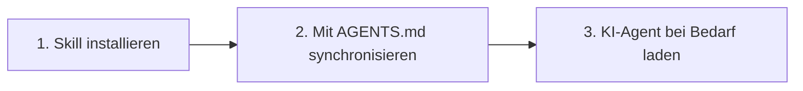

# OpenSkills Schnellstart: In 5 Minuten loslegen mit KI-Skillsystem

## Was Sie nach dieser Lektion können

Nach Abschluss dieser Lektion werden Sie in der Lage sein:

- Die Installation und Bereitstellung des ersten OpenSkills-Skills in 5 Minuten abzuschließen
- Die Befehle `openskills install` und `openskills sync` zur Verwaltung von Skills zu verwenden
- KI-Agents (Claude Code, Cursor, Windsurf usw.) erkennen und verwenden installierte Skills
- Die Kernwerte von OpenSkills zu verstehen: einheitliches Skill-Format, progressives Laden, Multi-Agent-Unterstützung

## Ihr aktuelles Problem

Möglicherweise haben Sie folgende Probleme:

- **Skills nicht zwischen Agents verwendbar**: Skills von Claude Code können nicht in Cursor oder Windsurf wiederverwendet werden
- **Kontext-Explosion**: Zu viele geladene Skills führen zu zu schnellem Token-Verbrauch von KI-Agents
- **Skill-Format-Chaos**: Verschiedene Agents verwenden unterschiedliche Skill-Definitionsarten, hohe Lernkurve
- **Private Skills nicht teilbar**: Interne Unternehmens-Skills können nicht einfach an Teammitglieder verteilt werden

OpenSkills löst diese Probleme.

## Wann diese Methode verwenden

Wenn Sie müssen:

- Spezialisierte Skills für KI-Coding-Agents installieren (z. B. PDF-Verarbeitung, Git-Workflow, Code-Review usw.)
- Skill-Verwaltung zwischen mehreren KI-Agents vereinheitlichen
- Private oder angepasste Skill-Repositorys verwenden
- KI Skills bei Bedarf laden, um den Kontext präzise zu halten

## 🎒 Vorbereitungen

::: warning Vorabprüfung

Bitte stellen Sie vor Beginn sicher:

1. **Node.js 20.6 oder höher**
   ```bash
   node --version
   ```
   Die Ausgabe sollte `v20.6.0` oder eine höhere Version zeigen

2. **Git installiert** (zum Klonen von Skills aus GitHub-Repositorys)
   ```bash
   git --version
   ```

:::

## Kernkonzept

Das Funktionsprinzip von OpenSkills lässt sich in drei Schritte zusammenfassen:



### Schritt 1: Skill installieren

Verwenden Sie `openskills install`, um Skills aus GitHub, lokalen Pfaden oder privaten Repositorys zu installieren. Skills werden in das Verzeichnis `.claude/skills/` des Projekts kopiert.

### Schritt 2: Mit AGENTS.md synchronisieren

Verwenden Sie `openskills sync`, um die Datei AGENTS.md zu generieren, die XML-Tags der Skill-Liste enthält. KI-Agents lesen diese Datei, um verfügbare Skills zu kennen.

### Schritt 3: KI-Agent bei Bedarf laden

Wenn Benutzer eine bestimmte Aufgabe anfordern, laden KI-Agents dynamisch den entsprechenden Skill-Inhalt über `npx openskills read <skill-name>`, anstatt alle Skills auf einmal zu laden.

::: info Warum "progressives Laden"?

Traditionelle Methode: Alle Skills werden vorab in den Kontext geladen → hoher Token-Verbrauch, langsame Reaktion
OpenSkills: Laden bei Bedarf → nur benötigte Skills werden geladen → präziser Kontext, schnelle Reaktion

:::

---

## Lernen Sie durch Handlung

Jetzt führen wir den Installations- und Verwendungsprozess Schritt für Schritt durch.

### Schritt 1: Wechseln Sie in Ihr Projektverzeichnis

Wechseln Sie zunächst in das Verzeichnis Ihres Entwicklungsprojekts:

```bash
cd /path/to/your/project
```

**Warum**

OpenSkills installiert Skills standardmäßig im Verzeichnis `.claude/skills/` des Projekts, damit Skills mit der Projekt-Versionskontrolle versioniert werden können und Teammitglieder sie gemeinsam nutzen können.

**Sie sollten sehen**:

Ihr Projektverzeichnis sollte eines der folgenden Inhalte enthalten:

- `.git/` (Git-Repository)
- `package.json` (Node.js-Projekt)
- Andere Projektdateien

::: tip Empfohlene Vorgehensweise

Selbst bei einem neuen Projekt wird empfohlen, zuerst ein Git-Repository zu initialisieren, um Skill-Dateien besser verwalten zu können.

:::

---

### Schritt 2: Ersten Skill installieren

Verwenden Sie den folgenden Befehl, um Skills aus dem offiziellen Anthropic-Skill-Repository zu installieren:

```bash
npx openskills install anthropics/skills
```

**Warum**

`anthropics/skills` ist das von Anthropic offiziell verwaltete Skill-Repository und enthält hochwertige Skill-Beispiele, die für die erste Erfahrung geeignet sind.

**Sie sollten sehen**:

Der Befehl startet eine interaktive Auswahlbenutzeroberfläche:

```
? Select skills to install: (Press <space> to select, <a> to toggle all, <i> to invert selection, and <enter> to proceed)
❯ ◉ pdf                 Comprehensive PDF manipulation toolkit for extracting text and tables...
  ◯ check-branch-first  Git workflow: Always check current branch before making changes...
  ◯ git-workflow        Git workflow: Best practices for commits, branches, and PRs...
  ◯ skill-creator       Guide for creating effective skills...
```

Verwenden Sie die Leertaste, um die zu installierenden Skills auszuwählen, und drücken Sie dann die Eingabetaste, um zu bestätigen.

::: tip Tipp

Beim ersten Mal wird empfohlen, nur 1-2 Skills auszuwählen (z. B. `pdf` und `git-workflow`), nach dem Kennenlernen des Ablaufs können Sie weitere installieren.

:::

**Sie sollten sehen** (nach erfolgreicher Installation):

```
✓ Installed: pdf
✓ Installed: git-workflow

Skills installed to: /path/to/your/project/.claude/skills/

Next steps:
  Run: npx openskills sync
  This will update AGENTS.md with your installed skills
```

---

### Schritt 3: Skills mit AGENTS.md synchronisieren

Führen Sie jetzt den Synchronisierungsbefehl aus:

```bash
npx openskills sync
```

**Warum**

Der Befehl `sync` generiert die Datei AGENTS.md, die XML-Tags der Skill-Liste enthält. KI-Agents lesen diese Datei, um verfügbare Skills zu kennen.

**Sie sollten sehen**:

```
? Select skills to sync: (Press <space> to select, <a> to toggle all, <i> to invert selection, and <enter> to proceed)
❯ ◉ pdf                 [project]
  ◯ git-workflow        [project]
```

Verwenden Sie ebenfalls die Leertaste, um die zu synchronisierenden Skills auszuwählen, und drücken Sie dann die Eingabetaste, um zu bestätigen.

**Sie sollten sehen** (nach erfolgreicher Synchronisation):

```
✓ Synced: pdf
✓ Synced: git-workflow

Updated: AGENTS.md
```

---

### Schritt 4: Datei AGENTS.md prüfen

Zeigen Sie die generierte Datei AGENTS.md an:

```bash
cat AGENTS.md
```

**Sie sollten sehen**:

```xml
<skills_system priority="1">

## Available Skills

<!-- SKILLS_TABLE_START -->
<usage>
When users ask you to perform tasks, check if any of available skills below can help complete task more effectively.

How to use skills:
- Invoke: `npx openskills read <skill-name>` (run in your shell)
- The skill content will load with detailed instructions
- Base directory provided in output for resolving bundled resources

Usage notes:
- Only use skills listed in <available_skills> below
- Do not invoke a skill that is already loaded in your context
</usage>

<available_skills>

<skill>
<name>pdf</name>
<description>Comprehensive PDF manipulation toolkit for extracting text and tables...</description>
<location>project</location>
</skill>

<skill>
<name>git-workflow</name>
<description>Git workflow: Best practices for commits, branches, and PRs...</description>
<location>project</location>
</skill>

</available_skills>
<!-- SKILLS_TABLE_END -->

</skills_system>
```

---

### Schritt 5: Installierte Skills anzeigen

Verwenden Sie den Befehl `list`, um installierte Skills anzuzeigen:

```bash
npx openskills list
```

**Sie sollten sehen**:

```
Installed Skills:

pdf              [project]
  Comprehensive PDF manipulation toolkit for extracting text and tables...

git-workflow     [project]
  Git workflow: Best practices for commits, branches, and PRs...

Total: 2 skills (project: 2, global: 0)
```

**Sie sollten sehen** (Erklärung):

- Skill-Name auf der linken Seite
- `[project]`-Tag zeigt an, dass dies ein lokal im Projekt installierter Skill ist
- Skill-Beschreibung wird unten angezeigt

---

## Kontrollpunkt ✅

Nach den obigen Schritten sollten Sie Folgendes bestätigen:

- [ ] Das Verzeichnis `.claude/skills/` wurde erstellt und enthält Ihre installierten Skills
- [ ] Die Datei `AGENTS.md` wurde generiert und enthält XML-Tags der Skill-Liste
- [ ] Das Ausführen von `openskills list` zeigt installierte Skills an

Wenn alle Prüfungen bestanden sind, herzlichen Glückwunsch! Sie haben OpenSkills erfolgreich installiert und konfiguriert.

---

## Häufige Fehler

### Problem 1: `npx`-Befehl nicht gefunden

**Fehlermeldung**:

```
command not found: npx
```

**Ursache**: Node.js ist nicht installiert oder nicht im PATH konfiguriert

**Lösung**:

1. Node.js neu installieren (empfohlen: [nvm](https://github.com/nvm-sh/nvm) zur Verwaltung von Node.js-Versionen verwenden)
2. Nach der Installation Terminal neu starten

---

### Problem 2: Netzwerk-Timeout bei Installation

**Fehlermeldung**:

```
Error: git clone failed
```

**Ursache**: GitHub-Zugriff eingeschränkt oder Netzwerk instabil

**Lösung**:

1. Netzwerkverbindung prüfen
2. Proxy konfigurieren (falls erforderlich):
   ```bash
   git config --global http.proxy http://proxy.example.com:8080
   ```
3. Mirror-Quelle verwenden (falls verfügbar)

---

### Problem 3: Berechtigungsfehler

**Fehlermeldung**:

```
Error: EACCES: permission denied
```

**Ursache**: Keine Schreibberechtigung für das Zielverzeichnis

**Lösung**:

1. Verzeichnisberechtigungen prüfen:
   ```bash
   ls -la .claude/
   ```
2. Wenn das Verzeichnis nicht existiert, zuerst erstellen:
   ```bash
   mkdir -p .claude/skills
   ```
3. Wenn Berechtigungen unzureichend sind, Berechtigungen ändern (mit Vorsicht verwenden):
   ```bash
   chmod -R 755 .claude/
   ```

---

## Zusammenfassung

In dieser Lektion haben wir gelernt:

1. **Kernwerte von OpenSkills**: Einheitliches Skill-Format, progressives Laden, Multi-Agent-Unterstützung
2. **Drei-Schritte-Arbeitsablauf**: Skills installieren → Mit AGENTS.md synchronisieren → KI-Agent bei Bedarf laden
3. **Grundlegende Befehle**:
   - `npx openskills install <source>` - Skills installieren
   - `npx openskills sync` - Skills mit AGENTS.md synchronisieren
   - `npx openskills list` - Installierte Skills anzeigen
4. **Fehlerbehebung**: Netzwerkprobleme, Berechtigungsprobleme usw.

Jetzt können KI-Agents diese Skills verwenden. Wenn KI-Agents PDF-Verarbeitung oder Git-Operationen ausführen müssen, rufen sie automatisch `npx openskills read <skill-name>` auf, um den entsprechenden Skill-Inhalt zu laden.

---

## Vorschau auf die nächste Lektion

> In der nächsten Lektion lernen wir **[Was ist OpenSkills?](../what-is-openskills/)**
>
> Sie lernen:
> - Die Beziehung zwischen OpenSkills und Claude Code
> - Kernkonzepte des Skills-Systems
> - Warum CLI statt MCP gewählt wurde

---

## Anhang: Quellcode-Referenz

<details>
<summary><strong>Klicken, um Quellcodeposition anzuzeigen</strong></summary>

> Aktualisierungsdatum: 2026-01-24

### Kernfunktionen

| Funktion            | Dateipfad                                                                                     | Zeile      |
|--- | --- | ---|
| Skill installieren        | [`src/commands/install.ts`](https://github.com/numman-ali/openskills/blob/main/src/commands/install.ts) | 83-424    |
| Mit AGENTS.md synchronisieren | [`src/commands/sync.ts`](https://github.com/numman-ali/openskills/blob/main/src/commands/sync.ts)     | 18-109    |
| Skills auflisten        | [`src/commands/list.ts`](https://github.com/numman-ali/openskills/blob/main/src/commands/list.ts)     | 7-43      |
| Alle Skills suchen    | [`src/utils/skills.ts`](https://github.com/numman-ali/openskills/blob/main/src/utils/skills.ts)     | 30-64     |
| XML generieren        | [`src/utils/agents-md.ts`](https://github.com/numman-ali/openskills/blob/main/src/utils/agents-md.ts) | 23-93     |
| Verzeichnispfad-Tool    | [`src/utils/dirs.ts`](https://github.com/numman-ali/openskills/blob/main/src/utils/dirs.ts)        | 18-25     |

### Wichtige Funktionen

**install.ts**
- `installSkill(source, options)` - Hauptinstallationsfunktion, unterstützt GitHub, lokale Pfade und private Repositorys
- `isLocalPath(source)` - Prüft, ob es sich um einen lokalen Pfad handelt
- `isGitUrl(source)` - Prüft, ob es sich um eine Git-URL handelt
- `getRepoName(repoUrl)` - Extrahiert Repository-Namen aus Git-URL
- `isPathInside(targetPath, targetDir)` - Pfaddurchlauf-Sicherheitsprüfung

**sync.ts**
- `syncAgentsMd(options)` - Synchronisiert Skills mit AGENTS.md, unterstützt interaktive Auswahl
- Unterstützt benutzerdefinierten Ausgabepfad (`--output`-Flag)
- Vorabauswahl der im aktuellen Datei bereits aktivierten Skills

**agents-md.ts**
- `parseCurrentSkills(content)` - Analysiert aktuelle Skills in AGENTS.md
- `generateSkillsXml(skills)` - Generiert XML im Claude-Code-Format
- `replaceSkillsSection(content, xml)` - Ersetzt den Skill-Abschnitt in der Datei

**skills.ts**
- `findAllSkills()` - Sucht alle installierten Skills, entfernt Duplikate nach Priorität
- `findSkill(skillName)` - Sucht einen bestimmten Skill
- Unterstützt Symlink-Erkennung und Deduplizierung

**dirs.ts**
- `getSkillsDir(projectLocal, universal)` - Ruft Skill-Verzeichnispfad ab
- `getSearchDirs()` - Gibt Suchverzeichnisliste zurück (Priorität: .agent Projekt → .agent global → .claude Projekt → .claude global)

### Wichtige Konstanten

- `.claude/skills/` - Standard-Installationspfad für Projekt lokal
- `.agent/skills/` - Universal-Modus-Installationspfad
- `~/.claude/skills/` - Globaler Installationspfad
- `AGENTS.md` - Standard-Synchronisationsausgabedatei

</details>
