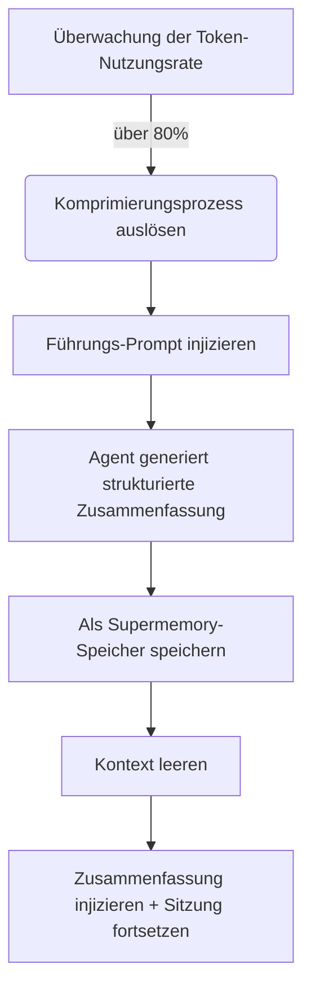

# Präemptive Komprimierungsprinzipien: Kontextvergessenheit verhindern

## Was Sie nach dieser Lektion können

Nach dieser Lektion können Sie:
1.  **Verstehen**, warum der Agent in langen Sitzungen "dümmer" wird und wie Supermemory dieses Problem löst.
2.  **Meistern** die Auslösebedingungen und den Arbeitsablauf der präemptiven Komprimierung (Preemptive Compaction).
3.  **Konfigurieren** Sie für Ihr Projekt geeignete Komprimierungsschwellenwerte, um Kosten und Speicherqualität auszugleichen.
4.  **Verifizieren**, ob die Komprimierung normal funktioniert, und zeigen Sie die generierten Sitzungszusammenfassungen an.

## Ihre aktuelle Situation

Bei der Paarprogrammierung mit AI sind Sie möglicherweise auf folgende Situationen gestoßen:
*   **Plötzlich vergessen**: Bei einer langen Refaktorisierungsaufgabe vergisst der Agent plötzlich die ursprünglich vereinbarten Benennungsregeln.
*   **Gezwungen, die Sitzung neu zu starten**: Das Kontextfenster (Context Window) ist voll, die IDE warnt, dass der Verlauf geleert werden muss, was dazu führt, dass Sie den Kontext aller abgeschlossenen Arbeit verlieren.
*   **Schlechte Zusammenfassungsqualität**: Gewöhnliche automatische Komprimierung ist nur einfaches Abschneiden oder vage Zusammenfassung und verliert wichtige Informationen wie "was als Nächstes zu tun ist".

## Wann Sie diese Methode anwenden sollten

*   Wenn Sie **große Refaktorisierungen** oder **komplexe Funktionsentwicklungen** durchführen und erwarten, dass die Sitzung lange dauert.
*   Wenn Sie ein Modell mit kleinem Kontextfenster verwenden (z. B. 32k/128k), das leicht an die Grenzen stößt.
*   Wenn Sie möchten, dass der Agent nach dem Löschen des Kontexts immer noch präzise weiß "wo wir stehen".

---

## Kernkonzept: Präemptiv vs. Passiv

Die traditionelle Kontextverwaltung ist oft **passiv**: Erst wenn der Kontext vollständig voll ist (100 %), werden alte Nachrichten gezwungen verworfen. Das ist wie erst anfangen, Dateien zu löschen, wenn die Festplatte voll ist - oft zu spät, um zu organisieren.

Supermemory verwendet **präemptive Komprimierung (Preemptive Compaction)**:

1.  **Vorzeitiges Eingreifen**: Wird standardmäßig ausgelöst, wenn die Token-Nutzungsrate **80 %** erreicht, wobei ausreichend Platz zum Nachdenken und Zusammenfassen reserviert wird.
2.  **Strukturierte Führung**: Der Agent wird nicht einfach eine Zusammenfassung schreiben lassen, sondern ein spezifischer Prompt injiziert, der ihn zwingt, im Format "Ziel-Fortschritt-Todo" zusammenzufassen.
3.  **Persistente Speicherung**: Die generierte Zusammenfassung wird nicht nur zur Wiederherstellung der aktuellen Sitzung verwendet, sondern auch als Speicher vom Typ `conversation` für zukünftige Abrufe gespeichert.

### Workflow-Diagramm



---

## Auslösemechanismus-Detaillierung

Supermemory überwacht in Echtzeit die Token-Nutzung jeder Sitzung. Der Komprimierungsprozess wird von den folgenden drei harten Bedingungen gemeinsam ausgelöst:

### 1. Token-Nutzungsschwellenwert

Standardmäßig wird ausgelöst, wenn die Gesamtanzahl der Tokens (Eingabe + Ausgabe + Cache) **80 %** des Modelllimits überschreitet.

*   **Konfigurationselement**: `compactionThreshold`
*   **Standardwert**: `0.80`
*   **Quellcode-Referenz**: [`src/services/compaction.ts`](https://github.com/supermemoryai/opencode-supermemory/blob/main/src/services/compaction.ts#L11)

### 2. Minimale Token-Beschränkung

Um Fehlauslösungen in kurzen Sitzungen zu verhindern (z. B. großer Modellkontext, aber nur wenige Sätze gesprochen), hat das System ein Untergrenze hartcodiert. Nur wenn die Nutzung **50.000 Tokens** überschreitet, wird eine Komprimierung in Betracht gezogen.

*   **Konstante**: `MIN_TOKENS_FOR_COMPACTION`
*   **Wert**: `50,000`
*   **Quellcode-Referenz**: [`src/services/compaction.ts`](https://github.com/supermemoryai/opencode-supermemory/blob/main/src/services/compaction.ts#L12)

### 3. Abklingzeit

Um kontinuierliche Auslösungen zu verhindern, die zu einer Endlosschleife führen, müssen zwischen zwei Komprimierungen mindestens **30 Sekunden** liegen.

*   **Konstante**: `COMPACTION_COOLDOWN_MS`
*   **Wert**: `30,000` (ms)
*   **Quellcode-Referenz**: [`src/services/compaction.ts`](https://github.com/supermemoryai/opencode-supermemory/blob/main/src/services/compaction.ts#L13)

---

## Strukturierte Zusammenfassungsvorlage

Wenn die Komprimierung ausgelöst wird, injiziert Supermemory einen speziellen System-Prompt (`[COMPACTION CONTEXT INJECTION]`) in den Agenten und fordert zwingend, dass die Zusammenfassung die folgenden 5 Teile enthält:

| Abschnitt | Inhaltsbeschreibung | Zweck |
| :--- | :--- | :--- |
| **1. User Requests** | Ursprüngliche Benutzeranforderungen (unverändert) | Verhindert Zielabweichungen |
| **2. Final Goal** | Das letztendlich zu erreichende Ziel | Klart den Endzustand |
| **3. Work Completed** | Abgeschlossene Arbeit, geänderte Dateien | Vermeidet Wiederholung |
| **4. Remaining Tasks** | Verbleibende Aufgaben | Klart die nächsten Schritte |
| **5. MUST NOT Do** | Explizit verbotene Dinge, fehlgeschlagene Versuche | Vermeidet Wiederholung der gleichen Fehler |

::: details Klicken Sie, um die Prompt-Quellcode-Injektion anzuzeigen
```typescript
// src/services/compaction.ts

return `[COMPACTION CONTEXT INJECTION]

When summarizing this session, you MUST include the following sections in your summary:

## 1. User Requests (As-Is)
- List all original user requests exactly as they were stated
...

## 2. Final Goal
...

## 3. Work Completed
...

## 4. Remaining Tasks
...

## 5. MUST NOT Do (Critical Constraints)
...
This context is critical for maintaining continuity after compaction.
`;
```
:::

---

## Führen Sie es mit mir aus: Konfiguration und Verifizierung

### Schritt 1: Komprimierungsschwellenwert anpassen (optional)

Wenn Sie 80 % zu früh oder zu spät finden, können Sie ihn in `~/.config/opencode/supermemory.jsonc` anpassen.

```jsonc
// ~/.config/opencode/supermemory.jsonc
{
  // ... andere Konfigurationen
  "compactionThreshold": 0.90
}
```

::: warning Konfliktwarnung
Wenn Sie `oh-my-opencode` oder andere Kontextverwaltungs-Plugins installiert haben, **müssen Sie** deren integrierte Komprimierungsfunktion (z. B. `context-window-limit-recovery`) deaktivieren, andernfalls kommt es zu doppelter Komprimierung oder Logikkonflikten.
:::

### Schritt 2: Komprimierungsauslösung beobachten

Wenn Sie den Schwellenwert in einer langen Sitzung erreichen, beachten Sie die Toast-Benachrichtigung unten rechts in der IDE.

**Was Sie sehen sollten**:

1.  **Warnung**:
    > "Preemptive Compaction: Context at 81% - compacting with Supermemory context..."
    
    Das System generiert gerade eine Zusammenfassung.

2.  **Fertigstellung**:
    > "Compaction Complete: Session compacted with Supermemory context. Resuming..."
    
    Der Kontext ist jetzt geleert und eine neue Zusammenfassung wurde injiziert.

### Schritt 3: Speicherung verifizieren

Nach Abschluss der Komprimierung wird die generierte Zusammenfassung automatisch in Supermemory gespeichert. Sie können sie über die CLI verifizieren.

**Operation**:
Führen Sie den folgenden Befehl im Terminal aus, um die neuesten Speicher anzuzeigen:

```bash
opencode run supermemory list --scope project --limit 1
```

**Was Sie sehen sollten**:
Ein Speicher vom Typ `conversation`, dessen Inhalt genau die soeben generierte strukturierte Zusammenfassung ist.

```json
{
  "id": "mem_123abc",
  "content": "[Session Summary]\n## 1. User Requests\n...",
  "type": "conversation",
  "scope": "opencode_project_..."
}
```

---

## Häufige Fragen (FAQ)

### F: Warum wurde meine Sitzung noch nicht komprimiert, obwohl sie sehr lang ist?
**A**: Überprüfen Sie folgende Punkte:
1.  **Gesamtanzahl der Tokens**: Haben Sie 50.000 Tokens überschritten? (Kurze Sitzungen werden auch bei hohem Anteil nicht ausgelöst).
2.  **Modelllimit**: Hat OpenCode das Kontextlimit des aktuellen Modells korrekt erkannt? Wenn die Erkennung fehlschlägt, wird auf den Standardwert von 200k zurückgegriffen, was zu einer niedrigeren Prozentberechnung führt.
3.  **Abklingzeit**: Liegt seit der letzten Komprimierung weniger als 30 Sekunden?

### F: Wie viele Tokens verbraucht die komprimierte Zusammenfassung?
**A**: Dies hängt vom Detaillierungsgrad der Zusammenfassung ab, normalerweise zwischen 500-2000 Tokens. Dies ist eine enorme Ersparnis im Vergleich zum ursprünglichen Kontext von 100k+.

### F: Kann ich die Komprimierung manuell auslösen?
**A**: Die aktuelle Version (v1.0) unterstützt keinen manuellen Auslöser; sie wird vollständig vom Algorithmus verwaltet.

---

## Zusammenfassung dieser Lektion

Präemptive Komprimierung ist das "Langlaufgeheimnis" von Supermemory. Durch **vorzeitiges Eingreifen** und **strukturierte Zusammenfassung** wandelt sie den linearen Dialogstrom in raffinierte Speicher-Snapshots um. Dies löst nicht nur das Problem des Kontextüberlaufs, sondern wichtiger noch, es ermöglicht dem Agenten, auch nach dem "Vergessen" (Löschen des Kontexts) nahtlos die vorherige Arbeit fortzusetzen, indem er die Snapshots liest.

## Vorschau auf die nächste Lektion

> In der nächsten Lektion lernen wir **[Tiefenkonfiguration-Detaillierung](../configuration/index.md)**.
>
> Sie werden lernen:
> - Wie man den Speicherpfad für Speicher anpasst
> - Konfigurieren Sie die Mengenbegrenzung für Suchergebnisse
> - Passen Sie die Regeln für den Datenschutzfilter an

---

## Anhang: Quellcode-Referenz

<details>
<summary><strong>Klicken Sie, um die Quellcodepositionen anzuzeigen</strong></summary>

> Aktualisierungszeit: 2026-01-23

| Funktion | Dateipfad | Zeilennummer |
| :--- | :--- | :--- |
| Schwellenwertkonstantendefinition | [`src/services/compaction.ts`](https://github.com/supermemoryai/opencode-supermemory/blob/main/src/services/compaction.ts#L11-L14) | 11-14 |
| Führungs-Prompt-Generierung | [`src/services/compaction.ts`](https://github.com/supermemoryai/opencode-supermemory/blob/main/src/services/compaction.ts#L58-L98) | 58-98 |
| Auslöseerkennungslogik | [`src/services/compaction.ts`](https://github.com/supermemoryai/opencode-supermemory/blob/main/src/services/compaction.ts#L317-L358) | 317-358 |
| Zusammenfassungsspeicherungslogik | [`src/services/compaction.ts`](https://github.com/supermemoryai/opencode-supermemory/blob/main/src/services/compaction.ts#L294-L315) | 294-315 |
| Konfigurationselementdefinition | [`src/config.ts`](https://github.com/supermemoryai/opencode-supermemory/blob/main/src/config.ts#L22) | 22 |

**Wichtige Konstanten**:
- `DEFAULT_THRESHOLD = 0.80`: Standard-Auslöseschwellenwert
- `MIN_TOKENS_FOR_COMPACTION = 50_000`: Minimale Anzahl der auslösenden Tokens
- `COMPACTION_COOLDOWN_MS = 30_000`: Abklingzeit (Millisekunden)

</details>
