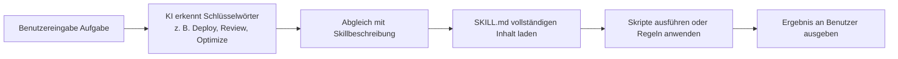

# Agent Skills Erste Schritte

## Was Sie nach diesem Kurs können

- Verstehen, was Agent Skills ist und wie es die Fähigkeiten von KI-Coding-Agenten erweitert
- Die Funktionen und Anwendungsfälle der drei Kernskillpakete kennen
- Wann es sinnvoll ist, Agent Skills zur Steigerung der Entwicklungseffizienz einzusetzen

## Ihre aktuelle Herausforderung

Bei der täglichen Arbeit mit Claude, Cursor oder anderen KI-Coding-Agenten stoßen Sie möglicherweise auf folgende Probleme:
- Sie möchten Best Practices befolgen, wissen aber nicht, welche Regeln Sie beachten müssen
- Sie führen häufig ähnliche Deployment-Operationen aus und möchten diese automatisieren
- Die von der KI generierte Codequalität variiert stark und es fehlt ein einheitlicher Standard

## Kernkonzept

**Agent Skills ist ein Skillpaket-System** – es bietet erweiterbare "Plugins" für KI-Coding-Agenten. Jeder Skill enthält:

- **SKILL.md**: Die Skilldefinitionsdatei, die dem KI-Agenten mitteilt, wann dieser Skill aktiviert werden soll
- **scripts/**: Hilfsskripte (z. B. Deployment-Skripte), die spezifische Aufgaben ausführen
- **references/**: Hilfsdokumentation (optional), die detaillierte Referenzmaterialien bereitstellt

::: tip Designprinzip
Skills verwenden einen **On-Demand-Lademechanismus**: Nur der Skillname und die Beschreibung werden beim Start geladen. Der vollständige Inhalt wird erst gelesen, wenn die KI dies als notwendig erachtet. Dies reduziert die Kontextnutzung und erhöht die Effizienz.
:::

## Verfügbare Skillpakete

Das Projekt bietet drei Kernskillpakete, die jeweils für spezifische Szenarien konzipiert sind:

### react-best-practices

Leitfaden zur Performance-Optimierung von React und Next.js basierend auf den Standards von Vercel Engineering. Enthält 50+ Regeln, sortiert nach Auswirkungsstufe.

**Anwendungsfälle**:
- Schreiben neuer React-Komponenten oder Next.js-Seiten
- Überprüfung von Performance-Problemen im Code
- Optimierung der Bundle-Größe oder Ladezeiten

**Abgedeckte Kategorien**:
- Beseitigung von Waterfalls (Kritisch)
- Bundle-Größen-Optimierung (Kritisch)
- Server-Side Performance (Hoch)
- Client-Side Data Fetching (Mittel-Hoch)
- Re-render-Optimierung (Mittel)
- Rendering-Performance (Mittel)
- JavaScript-Mikro-Optimierungen (Niedrig-Mittel)
- Erweiterte Muster (Niedrig)

### web-design-guidelines

Prüfung von Web-Interface-Design-Richtlinien, die überprüft, ob der Code近百条 Best Practices entspricht.

**Anwendungsfälle**:
- Prompt: "Review my UI"
- Überprüfung der Barrierefreiheit (Accessibility)
- Audit der Design-Konsistenz
- Überprüfung von Performance und UX

**Abgedeckte Kategorien**:
- Barrierefreiheit (aria-labels, semantisches HTML, Tastaturbehandlung)
- Focus-Zustände (sichtbarer Focus, focus-visible-Modus)
- Formulare (Autovervollständigung, Validierung, Fehlerbehandlung)
- Animationen (prefers-reduced-motion, kompatible Transformationen)
- Bilder (Maße, Lazy Loading, Alt-Texte)
- Typografie, Performance, Navigation usw.

### vercel-deploy-claimable

Ein-Klick-Deployment von Apps und Websites auf Vercel, gibt Vorschaulinks und Übertragungslinks für die Eigentümerschaft zurück.

**Anwendungsfälle**:
- Prompt: "Deploy my app"
- Schnelles Teilen von Projektvorschauen
- Deployment ohne Konfiguration, ohne Authentifizierung

**Kernfunktionen**:
- Automatische Erkennung von 40+ Frameworks (Next.js, Vite, Astro usw.)
- Gibt Vorschaualle (Live-Site) und Claim-URL (Eigentümerschaftsübertragung) zurück
- Automatische Behandlung von statischen HTML-Projekten
- Schließt `node_modules` und `.git` beim Hochladen aus

## Wie Skills funktionieren

Wenn Sie Claude oder einen anderen KI-Agenten verwenden, läuft die Skill-Aktivierung wie folgt ab:



**Beispielablauf**:

1. **Benutzereingabe**: "Deploy my app"
2. **KI-Erkennung**: Erkennt das Schlüsselwort "Deploy", stimmt mit dem Skill `vercel-deploy` überein
3. **Skill laden**: Lest den vollständigen Inhalt von `SKILL.md`
4. **Deployment ausführen**:
   - Führt das `deploy.sh`-Skript aus
   - Erkennt das Framework (liest package.json)
   - Packt das Projekt als tarball
   - Lädt auf die Vercel API hoch
5. **Ergebnis zurückgeben**:
   ```json
   {
     "previewUrl": "https://skill-deploy-abc123.vercel.app",
     "claimUrl": "https://vercel.com/claim-deployment?code=..."
   }
   ```

## Wann man diesen Ansatz anwendet

Die besten Momente für die Verwendung von Agent Skills:

| Szenario | Verwendeter Skill | Beispiel für Auslösenden-Keywords |
|--- | --- | ---|
| React-Komponenten schreiben | react-best-practices | "Review this React component for performance issues" |
| Next.js-Seiten optimieren | react-best-practices | "Help me optimize this Next.js page" |
| UI-Qualität überprüfen | web-design-guidelines | "Check accessibility of my site" |
| Projekt部署 | vercel-deploy-claimable | "Deploy my app to production" |

## Sicherheitsmodell

::: info Sicherheitshinweis
- **Lokale Ausführung**: Alle Skills werden lokal ausgeführt, keine Daten werden an Drittanbieter-Services hochgeladen (mit Ausnahme der Vercel-Deployment-API)
- **On-Demand-Aktivierung**: Skills laden detaillierte Inhalte nur, wenn die KI dies als relevant erachtet, was das Risiko von Datenschutzlecks verringert
- **Open-Source-Transparenz**: Alle Skills und Skripte sind Open-Source und können geprüft werden
:::

## Häufige Fallstricke

### Skill nicht aktiviert

Wenn der Skill nicht aktiviert wurde, überprüfen Sie:
- Ob der Prompt ausreichende Schlüsselwörter enthält (z. B. "Deploy", "Review")
- Ob der Skill korrekt im Verzeichnis `~/.claude/skills/` installiert wurde
- Wenn Sie claude.ai verwenden, bestätigen Sie, dass der Skill zum Projekt-Wissensbasis hinzugefügt wurde

### Netzwerkberechtigungen

Einige Skills benötigen Netzwerkzugriff:
- `vercel-deploy-claimable` benötigt Zugriff auf die Vercel-Deployment-API
- `web-design-guidelines` muss die neuesten Regeln von GitHub abrufen

**Lösung**: Fügen Sie die benötigten Domains in claude.ai/settings/capabilities hinzu.

## Zusammenfassung dieser Lektion

Agent Skills ist ein für KI-Coding-Agenten konzipiertes Skillpaket-System, das Folgendes bietet:
- **react-best-practices**: 50+ Regeln zur React/Next.js-Performance-Optimierung
- **web-design-guidelines**: Nahezu 100 Web-Design-Best-Practices
- **vercel-deploy-claimable**: Ein-Klick-Deployment auf Vercel

Skills verwenden einen On-Demand-Lademechanismus, um die Kontextnutzung zu reduzieren. Nach der Installation aktivieren KI-Agenten automatisch die entsprechenden Skills bei relevanten Aufgaben.

## Vorschau auf die nächste Lektion

> Die nächste Lektion behandelt **[Installation von Agent Skills](../installation/)**.
>
> Sie werden lernen:
> - Zwei Installationsmethoden: Claude Code und claude.ai
> - Konfiguration von Netzwerkberechtigungen
> - Überprüfung, ob Skills korrekt installiert wurden

---

## Anhang: Quellcodereferenz

<details>
<summary><strong>Klicken zum Anzeigen der Quellcodepositionen</strong></summary>

> Aktualisierungszeit: 2026-01-25

| Funktion        | Dateipfad                                                              | Zeilen    |
|--- | --- | ---|
| Skillpaketliste   | [`README.md`](https://github.com/vercel-labs/agent-skills/blob/main/README.md#L7-L80) | 7-80    |
| Skillstrukturbeschreibung | [`README.md`](https://github.com/vercel-labs/agent-skills/blob/main/README.md#L103-L110) | 103-110 |
| AGENTS.md Spezifikation | [`AGENTS.md`](https://github.com/vercel-labs/agent-skills/blob/main/AGENTS.md) | Ganze Datei    |
|--- | --- | ---|
| SKILL.md Format | [`AGENTS.md`](https://github.com/vercel-labs/agent-skills/blob/main/AGENTS.md#L29-L68) | 29-68   |
|--- | --- | ---|
| Benutzerinstallationsmethode | [`AGENTS.md`](https://github.com/vercel-labs/agent-skills/blob/main/AGENTS.md#L98-L110) | 98-110  |
|--- | --- | ---|
| Build-Tool-Skript | [`packages/react-best-practices-build/package.json`](https://github.com/vercel-labs/agent-skills/blob/main/packages/react-best-practices-build/package.json) | Ganze Datei    |

**Wichtige Konstanten**:
- Keine hartcodierten Konstanten

**Wichtige Funktionen**:
- `build.ts`: Erstellung von AGENTS.md und Testfällen
- `validate.ts`: Validierung der Vollständigkeit der Regeldateien
- `extract-tests.ts`: Extraktion von Testfällen aus Regeln

</details>
