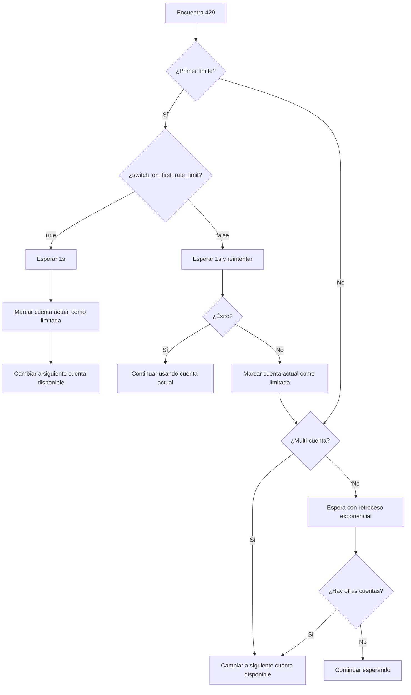

# Manejo de Límites de Velocidad: Mecanismos de Reintento Automático y Cambio de Cuentas

## Lo Que Aprenderás

Comprende y domina el mecanismo inteligente de manejo de límites de velocidad de Antigravity Auth:
- Distinguir entre 5 tipos diferentes de errores 429 (cuota agotada, límite de velocidad, capacidad agotada, etc.)
- Comprender el algoritmo de retroceso exponencial para reintentos automáticos
- Dominar la lógica de cambio automático en escenarios multi-cuenta
- Configurar cambio inmediato en el primer límite o cambio después de dos reintentos
- Usar el fallback de pool de cuotas dual de Gemini para mejorar la disponibilidad

No más frustración por "todas las cuentas están limitadas, pero la cuota aún no se ha agotado".

## Tu Situación Actual

Al usar múltiples cuentas de Google encuentras:
- Frecuentes límites de velocidad 429, sin saber si reintentar o cambiar de cuenta
- Tiempos de espera muy diferentes para distintos tipos de 429, sin saber cuánto esperar
- Todas las cuentas limitadas pero la cuota real no agotada, debido a detección imprecisa de límites
- Momento de cambio del pool de cuotas dual de Gemini poco claro, causando desperdicio de cuota

## Cuándo Usar Esta Técnica

Cuando:
- Has configurado múltiples cuentas pero encuentras frecuentes errores 429
- Quieres optimizar la tasa de éxito de solicitudes en escenarios multi-cuenta
- Necesitas ajustar la estrategia de reintento (como cambio inmediato en el primer límite)
- Usas modelos Gemini y quieres aprovechar el pool de cuotas dual

## Conceptos Principales

### Qué es el Manejo de Límites de Velocidad

Cuando el plugin Antigravity Auth encuentra un error 429, ejecuta automáticamente las siguientes operaciones:

1. **Detectar tipo de límite**: Analiza el `reason` o `message` en la respuesta, distinguiendo 5 tipos de limitación
2. **Calcular tiempo de retroceso**: Calcula inteligentemente el tiempo de espera según el tipo de límite y número de fallos
3. **Ejecutar estrategia**:
   - **Multi-cuenta**: Prioriza cambiar a una cuenta disponible
   - **Cuenta única**: Reintento con retroceso exponencial
4. **Registrar estado**: Actualiza el estado de limitación de la cuenta para referencia en solicitudes futuras

::: info ¿Por qué se necesita manejo inteligente?
Google tiene límites de velocidad para cada cuenta. Si simplemente "cambias de cuenta al encontrar 429", podrías cambiar frecuentemente y perder cuentas que se recuperan rápidamente; si simplemente "esperas y reintentas", podrías desperdiciar la cuota de otras cuentas disponibles. El manejo inteligente necesita encontrar el equilibrio óptimo entre "cambiar" y "esperar".
:::

### 5 Tipos de Límites de Velocidad

Antigravity Auth distingue los siguientes 5 tipos de limitación según el campo `reason` o contenido del `message` en la respuesta de la API:

| Tipo | Razón | Estrategia de Retroceso | Escenario Típico |
| --- | --- | --- | --- |
| `QUOTA_EXHAUSTED` | Cuota agotada (diaria o mensual) | Retroceso incremental: 1min → 5min → 30min → 120min | Cuota diaria agotada |
| `RATE_LIMIT_EXCEEDED` | Solicitudes muy rápidas (límite por minuto) | Fijo 30 segundos | Muchas solicitudes en poco tiempo |
| `MODEL_CAPACITY_EXHAUSTED` | Capacidad del servidor del modelo insuficiente | Fijo 15 segundos | Horas pico |
| `SERVER_ERROR` | Error interno del servidor (5xx) | Fijo 20 segundos | Servicio inestable |
| `UNKNOWN` | Razón desconocida | Fijo 60 segundos | Error no analizable |

**Fórmula de cálculo del tiempo de retroceso** (accounts.ts:51-75):

```typescript
// QUOTA_EXHAUSTED: Retroceso incremental (basado en fallos consecutivos)
// Fallo 1: 1min (60_000ms)
// Fallo 2: 5min (300_000ms)
// Fallo 3: 30min (1_800_000ms)
// Fallo 4+: 120min (7_200_000ms)

// Otros tipos: Retroceso fijo
// RATE_LIMIT_EXCEEDED: 30s
// MODEL_CAPACITY_EXHAUSTED: 15s
// SERVER_ERROR: 20s
// UNKNOWN: 60s
```

### Algoritmo de Retroceso Exponencial

Antigravity Auth usa un algoritmo de **retroceso exponencial con deduplicación**:

**Lógica central** (plugin.ts:509-567):

```typescript
// 1. Ventana de deduplicación: 429 concurrentes dentro de 2 segundos se consideran el mismo evento
const RATE_LIMIT_DEDUP_WINDOW_MS = 2000;

// 2. Reinicio de estado: Reinicia el contador después de 2 minutos sin 429
const RATE_LIMIT_STATE_RESET_MS = 120_000;

// 3. Retroceso exponencial: baseDelay * 2^(attempt-1), máximo 60s
const expBackoff = Math.min(baseDelay * Math.pow(2, attempt - 1), 60000);
```

**¿Por qué se necesita la ventana de deduplicación?**

Supongamos que tienes 3 solicitudes concurrentes que disparan 429 simultáneamente:
- **Sin deduplicación**: Cada solicitud incrementa el contador +1, resultando en attempt=3, retroceso 4s (2^2 × 1s)
- **Con deduplicación**: Se considera el mismo evento, attempt=1, retroceso 1s

La ventana de deduplicación evita que las solicitudes concurrentes amplifiquen excesivamente el tiempo de retroceso.

### Lógica de Cambio Multi-Cuenta

Antigravity Auth adopta una estrategia de **priorizar cambio, reintento como respaldo** en escenarios multi-cuenta:

**Flujo de decisión**:



**Configuraciones clave** (config/schema.ts:256-259):

| Opción de Configuración | Valor por Defecto | Descripción |
| --- | --- | --- |
| `switch_on_first_rate_limit` | `true` | Si cambiar de cuenta inmediatamente en el primer límite (después de esperar 1s) |
| `max_rate_limit_wait_seconds` | `300` | Tiempo máximo de espera cuando todas las cuentas están limitadas (5 minutos) |

**Configuración recomendada**:

- **Multi-cuenta (2+)**: `switch_on_first_rate_limit: true`, cambio inmediato, evita desperdiciar cuota
- **Cuenta única**: Esta configuración no tiene efecto, usa automáticamente reintento con retroceso exponencial

### Fallback de Pool de Cuotas Dual de Gemini

Los modelos Gemini soportan dos pools de cuotas independientes:
- **Pool de cuotas Antigravity**: Uso prioritario, pero capacidad menor
- **Pool de cuotas Gemini CLI**: Uso alternativo, capacidad mayor

**Lógica de Fallback** (plugin.ts:1318-1345):

```
1. Iniciar solicitud usando pool de cuotas Antigravity
2. Encuentra límite 429
3. Verificar si hay cuota Antigravity disponible en otras cuentas
   - Sí: Cambiar cuenta, continuar usando Antigravity
   - No: Si quota_fallback=true, cambiar a pool de cuotas Gemini CLI
```

**Opción de configuración** (config/schema.ts:179):

```json
{
  "quota_fallback": true  // Por defecto false
}
```

**Ejemplo**:

Tienes 2 cuentas, ambas encuentran 429:

| Estado | quota_fallback=false | quota_fallback=true |
| --- | --- | --- |
| Cuenta 1 (Antigravity) | Limitada | Limitada → Intenta Gemini CLI |
| Cuenta 2 (Antigravity) | Limitada | Limitada → Intenta Gemini CLI |
| Resultado | Esperar 5 minutos y reintentar | Cambiar a Gemini CLI, sin espera |

::: tip Ventajas del pool de cuotas dual
El pool de cuotas Gemini CLI suele ser mayor, el fallback puede mejorar significativamente la tasa de éxito de solicitudes. Pero nota:
- Los modelos con sufijo explícito `:antigravity` no harán fallback
- Solo hace fallback cuando la cuota Antigravity de todas las cuentas está agotada
:::

### Lógica de Reintento para Cuenta Única

Si solo tienes una cuenta, Antigravity Auth usa **reintento con retroceso exponencial**:

**Fórmula de reintento** (plugin.ts:1373-1375):

```typescript
// Primera vez: 1s
// Segunda vez: 2s (1s × 2^1)
// Tercera vez: 4s (1s × 2^2)
// Cuarta vez: 8s (1s × 2^3)
// ...
// Máximo: 60s
const expBackoffMs = Math.min(1000 * Math.pow(2, attempt - 1), 60000);
```

**Flujo de reintento**:

```
Primera vez: Encuentra 429
  ↓ Esperar 1s y reintentar (reintento rápido)
Segunda vez: Sigue siendo 429
  ↓ Esperar 2s y reintentar
Tercera vez: Sigue siendo 429
  ↓ Esperar 4s y reintentar
...
```

**Diferencia con multi-cuenta**:

| Escenario | Estrategia | Tiempo de Espera |
| --- | --- | --- |
| Cuenta única | Reintento con retroceso exponencial | 1s → 2s → 4s → 8s → ... → 60s |
| Multi-cuenta | Cambio de cuenta | 1s (primera vez) o 5s (segunda vez) |

## 🎒 Preparativos Antes de Comenzar

::: warning Verificación Prerequisito
Asegúrate de haber completado:
- [x] Configuración multi-cuenta (al menos 2 cuentas de Google)
- [x] Comprensión de [Estrategias de Selección de Cuentas](/es/NoeFabris/opencode-antigravity-auth/advanced/account-selection-strategies/)
- [x] Comprensión del [Sistema de Cuotas Dual](/es/NoeFabris/opencode-antigravity-auth/platforms/dual-quota-system/)
:::

## Sígueme Paso a Paso

### Paso 1: Habilitar Logs de Depuración para Observar Límites de Velocidad

**Por qué**
Los logs de depuración muestran información detallada sobre límites de velocidad, ayudándote a entender cómo funciona el plugin.

**Operación**

Habilitar logs de depuración:

```bash
export OPENCODE_ANTIGRAVITY_DEBUG=1
```

Iniciar solicitudes para disparar límites de velocidad:

```bash
# Iniciar múltiples solicitudes concurrentes (asegurar que dispare 429)
for i in {1..10}; do
  opencode run "Test $i" --model=google/antigravity-gemini-3-pro &
done
wait
```

**Deberías ver**:

```
[RateLimit] 429 on Account 0 family=claude retryAfterMs=60000
  message: You have exceeded the quota for this request.
  quotaResetTime: 2026-01-23T12:00:00Z
  retryDelayMs: 60000
  reason: QUOTA_EXHAUSTED

Rate limited. Quick retry in 1s... (notificación toast)
```

**Interpretación del log**:

- `429 on Account 0 family=claude`: Cuenta 0 limitada para modelo Claude
- `retryAfterMs=60000`: El servidor sugiere esperar 60 segundos
- `reason: QUOTA_EXHAUSTED`: Cuota agotada (tiempo de retroceso incremental)

### Paso 2: Configurar Cambio Inmediato en el Primer Límite

**Por qué**
Si tienes múltiples cuentas, el cambio inmediato en el primer límite maximiza la utilización de cuotas, evitando esperas.

**Operación**

Modificar archivo de configuración:

```bash
cat > ~/.config/opencode/antigravity.json << 'EOF'
{
  "$schema": "https://raw.githubusercontent.com/NoeFabris/opencode-antigravity-auth/main/assets/antigravity.schema.json",
  "switch_on_first_rate_limit": true
}
EOF
```

**Deberías ver**: Archivo de configuración actualizado.

**Verificar que la configuración está activa**:

Iniciar múltiples solicitudes y observar el comportamiento después del primer límite:

```bash
export OPENCODE_ANTIGRAVITY_DEBUG=1
for i in {1..5}; do
  opencode run "Test $i" --model=google/antigravity-gemini-3-pro &
done
wait
```

**Deberías ver**:

```
[RateLimit] 429 on Account 0 family=gemini retryAfterMs=30000
Server at capacity. Switching account in 1s... (notificación toast)
[AccountContext] Selected account: user2@gmail.com (index: 1)
```

**Puntos clave**:
- Después del primer 429, espera 1s
- Cambia automáticamente a la siguiente cuenta disponible (index: 1)
- No reintenta con la cuenta actual

### Paso 3: Deshabilitar Cambio Inmediato en el Primer Límite

**Por qué**
Si prefieres reintentar primero con la cuenta actual (evitar cambios frecuentes), puedes deshabilitar esta opción.

**Operación**

Modificar archivo de configuración:

```bash
cat > ~/.config/opencode/antigravity.json << 'EOF'
{
  "$schema": "https://raw.githubusercontent.com/NoeFabris/opencode-antigravity-auth/main/assets/antigravity.schema.json",
  "switch_on_first_rate_limit": false
}
EOF
```

**Deberías ver**: Archivo de configuración actualizado.

**Verificar que la configuración está activa**:

Iniciar múltiples solicitudes nuevamente:

```bash
export OPENCODE_ANTIGRAVITY_DEBUG=1
for i in {1..5}; do
  opencode run "Test $i" --model=google/antigravity-gemini-3-pro &
done
wait
```

**Deberías ver**:

```
[RateLimit] 429 on Account 0 family=gemini retryAfterMs=30000
Rate limited. Quick retry in 1s... (notificación toast)
[RateLimit] 429 on Account 0 family=gemini retryAfterMs=30000
Rate limited again. Switching account in 5s... (notificación toast)
[AccountContext] Selected account: user2@gmail.com (index: 1)
```

**Puntos clave**:
- Primer 429: Espera 1s y **reintenta con la cuenta actual**
- Segundo 429: Espera 5s y luego **cambia de cuenta**
- Si el reintento tiene éxito, continúa usando la cuenta actual

### Paso 4: Habilitar Fallback de Pool de Cuotas Dual de Gemini

**Por qué**
Los modelos Gemini soportan pool de cuotas dual, habilitar fallback puede mejorar significativamente la tasa de éxito de solicitudes.

**Operación**

Modificar archivo de configuración:

```bash
cat > ~/.config/opencode/antigravity.json << 'EOF'
{
  "$schema": "https://raw.githubusercontent.com/NoeFabris/opencode-antigravity-auth/main/assets/antigravity.schema.json",
  "quota_fallback": true
}
EOF
```

**Deberías ver**: Archivo de configuración actualizado.

**Verificar que la configuración está activa**:

Iniciar solicitudes Gemini (asegurar que dispare límite del pool de cuotas Antigravity):

```bash
export OPENCODE_ANTIGRAVITY_DEBUG=1
for i in {1..5}; do
  opencode run "Test $i" --model=google/antigravity-gemini-3-pro &
done
wait
```

**Deberías ver**:

```
[RateLimit] 429 on Account 0 family=gemini retryAfterMs=30000
Antigravity quota exhausted for gemini-3-pro. Switching to Gemini CLI quota... (notificación toast)
[DEBUG] quota fallback: gemini-cli
```

**Puntos clave**:
- Después de agotar la cuota Antigravity de todas las cuentas
- Cambia automáticamente al pool de cuotas Gemini CLI
- Sin espera, reintento directo

**Forzar uso de cuota Antigravity** (sin fallback):

```bash
# Usar sufijo explícito :antigravity
opencode run "Test" --model=google/antigravity-gemini-3-pro:antigravity
```

### Paso 5: Configurar Tiempo Máximo de Espera

**Por qué**
Si todas las cuentas están limitadas, el plugin esperará el tiempo de reinicio más corto. Puedes configurar el tiempo máximo de espera para evitar esperas indefinidas.

**Operación**

Modificar archivo de configuración:

```bash
cat > ~/.config/opencode/antigravity.json << 'EOF'
{
  "$schema": "https://raw.githubusercontent.com/NoeFabris/opencode-antigravity-auth/main/assets/antigravity.schema.json",
  "max_rate_limit_wait_seconds": 60
}
EOF
```

**Deberías ver**: Archivo de configuración actualizado.

**Verificar que la configuración está activa**:

Disparar límite en todas las cuentas:

```bash
export OPENCODE_ANTIGRAVITY_DEBUG=1
for i in {1..20}; do
  opencode run "Test $i" --model=google/antigravity-claude-opus-4.5 &
done
wait
```

**Deberías ver**:

```
[RateLimit] 429 on Account 0 family=claude retryAfterMs=60000
[RateLimit] 429 on Account 1 family=claude retryAfterMs=60000
[DEBUG] All accounts rate limited. Min wait time: 60s, max wait: 60s
Rate limited. Retrying in 60s... (notificación toast)
```

**Puntos clave**:
- Cuando todas las cuentas están limitadas, espera el tiempo de reinicio más corto
- Si el tiempo de reinicio más corto > `max_rate_limit_wait_seconds`, usa el valor máximo
- Espera máxima por defecto: 300 segundos (5 minutos)

## Punto de Control ✅

::: tip ¿Cómo verificar que la configuración está activa?
1. Verifica el archivo de configuración para confirmar las opciones correctas
2. Habilita logs de depuración: `OPENCODE_ANTIGRAVITY_DEBUG=1`
3. Observa los eventos `[RateLimit]` en los logs
4. Observa el comportamiento de cambio de cuentas (logs `AccountContext`)
5. Verifica que las notificaciones toast se muestren según lo esperado
:::

## Advertencias de Errores Comunes

### ❌ Ignorar la Ventana de Deduplicación, Malinterpretar el Tiempo de Retroceso

**Comportamiento incorrecto**:
- Iniciar 10 solicitudes concurrentes, todas encuentran 429
- Pensar que el tiempo de retroceso es 2^10 × 1s = 1024s
- En realidad es 1s (debido a la ventana de deduplicación)

**Práctica correcta**: Entender la ventana de deduplicación de 2 segundos, las solicitudes concurrentes no se cuentan repetidamente.

### ❌ Mezclar `switch_on_first_rate_limit` con Cuenta Única

**Comportamiento incorrecto**:
- Solo tienes 1 cuenta, pero configuras `switch_on_first_rate_limit: true`
- Pensar que cambiará de cuenta, pero no hay otra cuenta disponible

**Práctica correcta**: En escenarios de cuenta única esta configuración no tiene efecto, usa automáticamente reintento con retroceso exponencial.

### ❌ Sufijo Explícito de Gemini Bloquea el Fallback

**Comportamiento incorrecto**:
- Usar `google/antigravity-gemini-3-pro:antigravity`
- Configurar `quota_fallback: true`
- Pero al encontrar 429 no hace fallback a Gemini CLI

**Práctica correcta**: El sufijo explícito fuerza el uso del pool de cuotas especificado, si necesitas fallback, no uses el sufijo.

### ❌ Tiempo de Espera Excesivo Cuando Todas las Cuentas Están Limitadas

**Comportamiento incorrecto**:
- Configurar `max_rate_limit_wait_seconds: 600` (10 minutos)
- Todas las cuentas limitadas por 60s, pero esperar 10 minutos

**Práctica correcta**: `max_rate_limit_wait_seconds` es el **valor máximo**, el tiempo de espera real es el tiempo de reinicio más corto, no excederá el máximo.

## Resumen de Esta Lección

| Mecanismo | Característica Principal | Escenario Aplicable |
| --- | --- | --- |
| **Detección de límites de velocidad** | Distingue 5 tipos (QUOTA_EXHAUSTED, RATE_LIMIT_EXCEEDED, etc.) | Todos los escenarios |
| **Retroceso exponencial** | Más fallos = más tiempo de espera (1s → 2s → 4s → ... → 60s) | Cuenta única |
| **Cambio de cuenta** | Multi-cuenta prioriza cambio, cuenta única usa retroceso | Multi-cuenta |
| **Ventana de deduplicación** | 429 concurrentes dentro de 2 segundos se consideran el mismo evento | Escenarios concurrentes |
| **Fallback de pool de cuotas dual** | Intenta Gemini CLI después de límite en Antigravity | Modelos Gemini |

**Configuraciones clave**:

| Opción de Configuración | Valor por Defecto | Valor Recomendado | Descripción |
| --- | --- | --- | --- |
| `switch_on_first_rate_limit` | `true` | `true` (multi-cuenta) | Cambio inmediato en primer límite |
| `quota_fallback` | `false` | `true` (Gemini) | Habilitar fallback de pool de cuotas dual |
| `max_rate_limit_wait_seconds` | `300` | `300` | Tiempo máximo de espera (segundos) |

**Métodos de depuración**:

- Habilitar logs de depuración: `OPENCODE_ANTIGRAVITY_DEBUG=1`
- Ver eventos `[RateLimit]`: Conocer tipo de límite y tiempo de retroceso
- Ver logs `[AccountContext]`: Observar comportamiento de cambio de cuentas

## Vista Previa de la Siguiente Lección

> En la próxima lección aprenderemos sobre **[Recuperación de Sesiones](/es/NoeFabris/opencode-antigravity-auth/advanced/session-recovery/)**.
>
> Aprenderás:
> - Cómo recuperar automáticamente llamadas a herramientas interrumpidas
> - Mecanismo de recuperación de sesiones para modelos Thinking
> - Principio de inyección de tool_result sintético

---

## Apéndice: Referencia de Código Fuente

<details>
<summary><strong>Haz clic para expandir y ver la ubicación del código fuente</strong></summary>

> Última actualización: 2026-01-23

| Función | Ruta del Archivo | Número de Línea |
| --- | --- | --- |
| Definición de tipos de límite de velocidad | [`src/plugin/accounts.ts`](https://github.com/NoeFabris/opencode-antigravity-auth/blob/main/src/plugin/accounts.ts#L10-L20) | 10-20 |
| Análisis de razón de límite | [`src/plugin/accounts.ts`](https://github.com/NoeFabris/opencode-antigravity-auth/blob/main/src/plugin/accounts.ts#L29-L49) | 29-49 |
| Cálculo de tiempo de retroceso | [`src/plugin/accounts.ts`](https://github.com/NoeFabris/opencode-antigravity-auth/blob/main/src/plugin/accounts.ts#L51-L75) | 51-75 |
| Algoritmo de retroceso exponencial | [`src/plugin.ts`](https://github.com/NoeFabris/opencode-antigravity-auth/blob/main/src/plugin.ts#L532-L567) | 532-567 |
| Marcar cuenta como limitada | [`src/plugin/accounts.ts`](https://github.com/NoeFabris/opencode-antigravity-auth/blob/main/src/plugin/accounts.ts#L434-L461) | 434-461 |
| Verificar si cuenta está limitada | [`src/plugin/accounts.ts`](https://github.com/NoeFabris/opencode-antigravity-auth/blob/main/src/plugin/accounts.ts#L134-L152) | 134-152 |
| Manejo de errores 429 | [`src/plugin.ts`](https://github.com/NoeFabris/opencode-antigravity-auth/blob/main/src/plugin.ts#L1260-L1396) | 1260-1396 |
| Fallback de pool de cuotas dual Gemini | [`src/plugin.ts`](https://github.com/NoeFabris/opencode-antigravity-auth/blob/main/src/plugin.ts#L1318-L1345) | 1318-1345 |
| Logs de límite de velocidad | [`src/plugin/debug.ts`](https://github.com/NoeFabris/opencode-antigravity-auth/blob/main/src/plugin/debug.ts#L354-L396) | 354-396 |
| Esquema de configuración | [`src/plugin/config/schema.ts`](https://github.com/NoeFabris/opencode-antigravity-auth/blob/main/src/plugin/config/schema.ts#L256-L221) | 256-221 |

**Constantes clave**:

- `QUOTA_EXHAUSTED_BACKOFFS = [60_000, 300_000, 1_800_000, 7_200_000]`: Tiempos de retroceso incremental para cuota agotada (accounts.ts:22)
- `RATE_LIMIT_EXCEEDED_BACKOFF = 30_000`: Retroceso fijo de 30 segundos para límite de velocidad (accounts.ts:23)
- `MODEL_CAPACITY_EXHAUSTED_BACKOFF = 15_000`: Retroceso fijo de 15 segundos para capacidad agotada (accounts.ts:24)
- `SERVER_ERROR_BACKOFF = 20_000`: Retroceso fijo de 20 segundos para error de servidor (accounts.ts:25)
- `RATE_LIMIT_DEDUP_WINDOW_MS = 2000`: Ventana de deduplicación de 2 segundos (plugin.ts:509)
- `RATE_LIMIT_STATE_RESET_MS = 120_000`: Reinicio de estado después de 2 minutos (plugin.ts:510)
- `FIRST_RETRY_DELAY_MS = 1000`: Primer reintento rápido de 1 segundo (plugin.ts:1304)

**Funciones clave**:

- `parseRateLimitReason(reason?, message?)`: Analiza la razón del límite (accounts.ts:29)
- `calculateBackoffMs(reason, consecutiveFailures, retryAfterMs?)`: Calcula tiempo de retroceso (accounts.ts:51)
- `markRateLimitedWithReason(account, family, headerStyle, model, reason, retryAfterMs?)`: Marca cuenta como limitada (accounts.ts:445)
- `isRateLimitedForHeaderStyle(account, family, headerStyle, model?)`: Verifica si cuenta está limitada (accounts.ts:536)
- `getRateLimitBackoff(accountIndex, quotaKey, serverRetryAfterMs)`: Obtiene tiempo de retroceso con deduplicación (plugin.ts:532)
- `resetRateLimitState(accountIndex, quotaKey)`: Reinicia estado de límite (plugin.ts:573)

</details>
