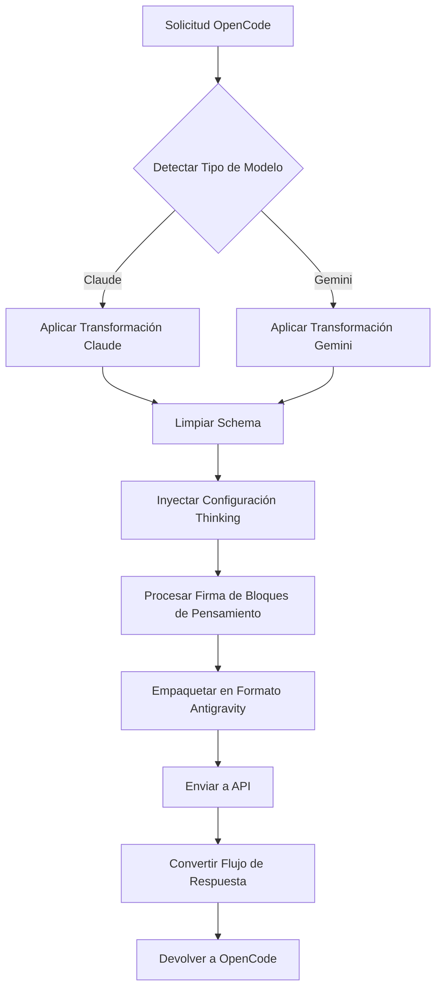

# Mecanismo de Transformación de Solicitudes: Compatibilidad Multi-Modelo

## Lo Que Podrás Hacer al Terminar

- Comprender cómo el plugin transforma el formato de solicitudes entre OpenCode y la API de Antigravity
- Dominar las diferencias de protocolo entre los modelos Claude y Gemini y sus reglas de transformación
- Solucionar errores 400 causados por incompatibilidad de Schema
- Optimizar la configuración de Thinking para obtener el mejor rendimiento

## Tu Situación Actual

Probablemente encuentres estos problemas:

- ❌ El servidor MCP devuelve error `400 Unknown name 'parameters'`
- ❌ Al usar modelos Gemini aparece `400 Unknown name 'const'`
- ❌ Los bloques de pensamiento de modelos Thinking se muestran con formato incorrecto
- ❌ Fallo en la llamada a herramientas con error de verificación de firma
- ❌ No entiendes por qué el plugin puede soportar tanto Claude como Gemini

## Cuándo Usar Esta Técnica

Cuando necesites:

| Escenario | Por Qué Necesitas Entender el Mecanismo de Transformación |
|---|---|
| Desarrollar servidores MCP personalizados | Asegurar compatibilidad del Schema de herramientas con la API de Antigravity |
| Solucionar errores 400/500 | Determinar si es un problema de Schema o de lógica de transformación |
| Optimizar rendimiento de Thinking | Comprender el mecanismo de firma y caché de bloques de pensamiento |
| Depurar fallos en llamadas a herramientas | Verificar asignación de ID de herramientas y firma de parámetros |

::: warning Verificación Prerequisito
Antes de comenzar este tutorial, asegúrate de que ya has:
- ✅ Instalado el plugin opencode-antigravity-auth
- ✅ Entendido los modelos disponibles y sus variantes
- ✅ Comprendido los conceptos básicos de los modelos Thinking

[Tutorial de Lista de Modelos](../../platforms/available-models/) | [Tutorial de Modelos Thinking](../../platforms/thinking-models/)
:::

## Idea Central

La transformación de solicitudes es el mecanismo central del plugin que hace tres cosas:

1. **Interceptar solicitudes OpenCode** — Intercepta las llamadas `fetch(generativeLanguage.googleapis.com)`
2. **Aplicar transformación de modelo** — Transforma el formato según el tipo de modelo (Claude/Gemini)
3. **Empaquetar y enviar** — Empaqueta en formato Antigravity y llama a la API
4. **Transformar respuesta** — Convierte la respuesta a un formato reconocible por OpenCode

**Diagrama de Flujo de Transformación**:



**Puntos Clave de Transformación**:

| Tipo de Transformación | Propósito | Ubicación del Código |
|---|---|---|
| Limpieza de Schema | Eliminar campos no soportados por la API de Antigravity | `src/plugin/request-helpers.ts` |
| Configuración de Thinking | Inyectar configuración de pensamiento correcta según la familia de modelos | `src/plugin/transform/claude.ts`, `src/plugin/transform/gemini.ts` |
| Procesamiento de Bloques de Pensamiento | Eliminar bloques de pensamiento históricos e inyectar firmas | `src/plugin/request.ts` |
| Transformación de Flujo de Respuesta | Convertir eventos SSE a formato OpenCode | `src/plugin/core/streaming.ts` |

## Paso a Paso

### Paso 1: Entender las Reglas de Transformación Claude

**Por Qué**
Los modelos Claude usan formatos de protocolo diferentes (snake_case, modo VALIDATED) que requieren manejo especial.

**Reglas Clave de Transformación**

| Formato Original | Formato Transformado | Explicación |
|---|---|---|
| `toolConfig.functionCallingConfig.mode` | `"VALIDATED"` | Forzar activación de validación de llamadas a herramientas |
| `thinkingConfig.includeThoughts` | `include_thoughts` | Formato snake_case |
| `thinkingConfig.thinkingBudget` | `thinking_budget` | Formato snake_case |
| `maxOutputTokens` | Ajustar automáticamente a 64,000 | Los modelos Thinking necesitan más espacio de salida |

**Ubicación del Código**: [`src/plugin/transform/claude.ts:43-56`](https://github.com/NoeFabris/opencode-antigravity-auth/blob/main/src/plugin/transform/claude.ts#L43-L56)

**Ejemplo**

```typescript
// Antes de la transformación (formato OpenCode)
{
  "toolConfig": {
    "functionCallingConfig": {
      "mode": "AUTO"
    }
  },
  "thinkingConfig": {
    "includeThoughts": true,
    "thinkingBudget": 32000
  }
}

// Después de la transformación (formato Antigravity)
{
  "toolConfig": {
    "functionCallingConfig": {
      "mode": "VALIDATED"  // Forzar VALIDATED
    }
  },
  "thinkingConfig": {
    "include_thoughts": true,  // snake_case
    "thinking_budget": 32000   // snake_case
  },
  "generationConfig": {
    "maxOutputTokens": 64000   // Ajustar automáticamente para modelos Thinking
  }
}
```

**Deberías Ver**:
- Todas las transformaciones de modelos Claude siguen la convención snake_case
- `maxOutputTokens` se ajusta automáticamente a un valor suficientemente grande (`CLAUDE_THINKING_MAX_OUTPUT_TOKENS = 64,000`)

### Paso 2: Entender las Reglas de Transformación Gemini

**Por Qué**
Los modelos Gemini usan formato camelCase y tienen requisitos estrictos para JSON Schema (type en mayúsculas).

**Reglas Clave de Transformación**

| Formato Original | Formato Transformado | Explicación |
|---|---|---|
| JSON Schema `type: "object"` | `type: "OBJECT"` | El tipo debe estar en mayúsculas |
| `additionalProperties: false` | Eliminar | La API de Gemini no lo soporta |
| `$ref: "#/$defs/Foo"` | Convertir a `description: "Ver: Foo"` | Las referencias se convierten en descripciones |
| `const: "foo"` | `enum: ["foo"]` | const se convierte en enum |
| `enum: ["a", "b"]` | Agregar descripción con sugerencia `(Permitido: a, b)` | Las enumeraciones de 2-10 elementos obtienen sugerencias automáticas |

**Ubicación del Código**: [`src/plugin/transform/gemini.ts:52-124`](https://github.com/NoeFabris/opencode-antigravity-auth/blob/main/src/plugin/transform/gemini.ts#L52-L124)

**Ejemplo**

```json
// Antes de la transformación (formato OpenCode)
{
  "parameters": {
    "type": "object",
    "properties": {
      "status": {
        "type": "string",
        "const": "active",
        "enum": ["active", "inactive"]
      }
    }
  }
}

// Después de la transformación (formato Gemini)
{
  "parameters": {
    "type": "OBJECT",  // En mayúsculas
    "properties": {
      "status": {
        "type": "STRING",  // En mayúsculas
        "enum": ["active", "inactive"],  // const eliminado
        "description": "(Permitido: active, inactive)"  // Sugerencia añadida automáticamente
      }
    }
  }
}
```

**Deberías Ver**:
- Todos los tipos de Schema Gemini se convierten a mayúsculas (`STRING`, `OBJECT`, `ARRAY`)
- El campo `const` se elimina y se convierte en `enum`
- Los campos no soportados (`$ref`, `additionalProperties`) se eliminan

### Paso 3: Entender el Flujo de Limpieza de Schema

**Por Qué**
La API de Antigravity usa validación estricta respaldada por protobuf y no soporta todos los campos de JSON Schema estándar.

**Flujo de Limpieza de Cuatro Fases**

1. **Fase 1a: Convertir $ref a descripción**
   - `$ref: "#/$defs/Foo"` → `{ description: "Ver: Foo" }`

2. **Fase 1b: Convertir const a enum**
   - `const: "foo"` → `enum: ["foo"]`

3. **Fase 1c: Agregar sugerencias de enumeración**
   - `enum: ["a", "b"]` → Agregar `(Permitido: a, b)` a descripción

4. **Fase 1d: Eliminar campos no soportados**
   - Eliminar: `$schema`, `$defs`, `additionalProperties`, `pattern`, `minLength`, `maxLength`, etc.

**Ubicación del Código**: [`src/plugin/request-helpers.ts:20-280`](https://github.com/NoeFabris/opencode-antigravity-auth/blob/main/src/plugin/request-helpers.ts#L20-L280)

**Lista de Campos No Soportados**:

| Campo | Por Qué No Está Soportado | Solución Alternativa |
|---|---|---|
| `$ref` | No se permiten referencias | Convertir a descripción con sugerencia |
| `const` | No se permiten constantes | Usar `enum` |
| `additionalProperties` | No se validan propiedades adicionales | Anotar en descripción |
| `$schema`, `$defs` | No se usa JSON Draft | Eliminar |
| `pattern`, `minLength`, `maxLength` | Las restricciones de string son manejadas por el servidor | Eliminar |
| `minItems`, `maxItems` | Las restricciones de array son manejadas por el servidor | Eliminar |

**Deberías Ver**:
- El Schema del servidor MCP se limpia a un formato compatible con Antigravity
- Los errores 400 se reducen y los mensajes de error son más claros

### Paso 4: Entender el Mecanismo de Procesamiento de Bloques de Pensamiento

**Por Qué**
Los modelos Claude y Gemini 3 necesitan firmas estables para bloques de pensamiento, de lo contrario ocurren errores de verificación de firma.

**Flujo de Procesamiento de Tres Pasos**

1. **Eliminar Bloques de Pensamiento Históricos**
   - Eliminar recursivamente todos los bloques `thinking` históricos (evitar conflictos de firma)
   - Usar caché para validar validez de firmas

2. **Inyectar Nueva Firma de Pensamiento**
   - Generar firma estable para nuevos bloques de pensamiento
   - Caché de firmas para uso en conversaciones de múltiples turnos

3. **Asegurar Orden de Bloques de Pensamiento**
   - Claude: thinking debe estar antes de tool_use
   - Gemini: thinking puede aparecer en cualquier posición

**Ubicación del Código**:
- [`src/plugin/request.ts:711-724`](https://github.com/NoeFabris/opencode-antigravity-auth/blob/main/src/plugin/request.ts#L711-L724)

**Ejemplo de Firma de Bloque de Pensamiento**:

```typescript
// Formato de Bloque de Pensamiento Claude
{
  "type": "thinking",
  "text": "Necesito analizar la necesidad del usuario...",
  "signature": "sig-abc123",  // Firma inyectada por el plugin
  "cache_control": { "type": "ephemeral" }  // Control de caché
}

// Bloque de Pensamiento Histórico (eliminado)
{
  "type": "thinking",
  "text": "Análisis antiguo...",  // Eliminado
  "signature": "sig-old456"  // Firma inválida
}
```

**Deberías Ver**:
- En conversaciones de múltiples turnos, los bloques de pensamiento históricos no se muestran repetidamente
- Los nuevos bloques de pensamiento tienen firmas correctas
- Hay un proceso de pensamiento completo antes de la llamada a herramientas

### Paso 5: Entender la Transformación de Flujo de Respuesta

**Por Qué**
La API de Antigravity devuelve flujos SSE (Server-Sent Events) que necesitan ser convertidos a un formato reconocible por OpenCode.

**Reglas Clave de Transformación**

| Formato Original | Formato Transformado | Explicación |
|---|---|---|
| `thought: true` | `type: "reasoning"` | Transformación de formato de bloque de pensamiento |
| `text` | Mantener sin cambios | Contenido de texto |
| `tool_use` | Mantener sin cambios | Llamada a herramientas |
| `tool_result` | Mantener sin cambios | Resultado de herramienta |

**Ubicación del Código**: [`src/plugin/core/streaming.ts`](https://github.com/NoeFabris/opencode-antigravity-auth/blob/main/src/plugin/core/streaming.ts)

**Ejemplo de Eventos SSE**:

```
// Respuesta de API Antigravity
data: {"type": "thinking", "text": "Analizando...", "thought": true}

// Después de transformación
data: {"type": "reasoning", "text": "Analizando..."}

// Evento de texto
data: {"type": "text", "text": "Hola"}

// Evento de llamada a herramientas
data: {"type": "tool_use", "id": "tool-123", "name": "my_function"}
```

**Deberías Ver**:
- Los bloques de pensamiento se muestran correctamente en la interfaz como tipo `reasoning`
- La respuesta de flujo sin demora, transformación línea por línea
- El formato de eventos de llamada a herramientas es correcto

## Punto de Verificación ✅

Después de completar los pasos anteriores, deberías poder responder las siguientes preguntas:

- [ ] ¿A qué se establecerá `toolConfig.mode` para modelos Claude?
- [ ] ¿A qué se convertirá `type: "string"` del Schema de Gemini?
- [ ] ¿Por qué es necesario eliminar bloques de pensamiento históricos?
- [ ] ¿A qué formato se convertirá el campo `const`?
- [ ] ¿Qué función cumple la firma de bloques de pensamiento?

## Advertencias de Problemas Comunes

### Problema 1: Schema de MCP contiene $ref causando error 400

**Mensaje de Error**: `400 Unknown name 'parameters'`

**Causa**: El servidor MCP usa referencias `$ref` de JSON Schema que la API de Antigravity no soporta.

**Solución**:
- Revisar la definición de Schema del servidor MCP
- Eliminar `$ref`, expandir directamente la estructura del objeto
- O modificar el código del servidor MCP

**Ejemplo**:

```json
// ❌ Error: usando $ref
{
  "properties": {
    "data": { "$ref": "#/$defs/DataModel" }
  },
  "$defs": {
    "DataModel": { "type": "string" }
  }
}

// ✅ Correcto: expansión directa
{
  "properties": {
    "data": { "type": "string" }
  }
}
```

### Problema 2: Campo const causa error 400 en modelos Gemini

**Mensaje de Error**: `400 Unknown name 'const'`

**Causa**: El endpoint de Gemini de la API de Antigravity no soporta el campo `const`.

**Solución**:
- Convertir manualmente `const` a `enum`
- O confiar en la transformación automática del plugin (ya implementada)

**Ejemplo**:

```json
// ❌ Error: usando const
{
  "properties": {
    "status": { "type": "string", "const": "active" }
  }
}

// ✅ Correcto: usando enum
{
  "properties": {
    "status": { "type": "string", "enum": ["active"] }
  }
}
```

### Problema 3: Modelo Thinking muestra caracteres corruptos

**Mensaje de Error**: El bloque de pensamiento se muestra como `[object Object]` o con formato incorrecto

**Causa**: Bug en la lógica de transformación de respuesta, o caché de firmas inválido.

**Solución**:
1. Revisar logs de depuración: `opencode --debug`
2. Limpiar caché de firmas: eliminar el campo de caché en `~/.config/opencode/antigravity-accounts.json`
3. Reiniciar OpenCode

### Problema 4: Fallo en llamada a herramientas, error de firma

**Mensaje de Error**: `tool_result_missing` o fallo de verificación de firma

**Causa**:
- Orden incorrecto de bloques de pensamiento (thinking debe estar antes de tool_use)
- Inconsistencia en caché de firmas
- Error en asignación de ID de herramienta

**Solución**:
- El plugin reintentará automáticamente (mecanismo de recuperación de sesión)
- Habilitar modo de depuración para ver errores detallados
- Revisar si la definición de herramienta es correcta

## Resumen de Esta Lección

Puntos clave del mecanismo de transformación de solicitudes:

1. **La familia de modelos determina las reglas de transformación** — Claude (snake_case, VALIDATED) vs Gemini (camelCase, Schema en mayúsculas)
2. **La limpieza de Schema es obligatoria** — Eliminar campos no soportados como `$ref`, `const`, `additionalProperties`
3. **La firma de bloques de pensamiento es clave** — Firmas estables aseguran consistencia en conversaciones de múltiples turnos
4. **Transformación de flujo de respuesta** — Convertir eventos SSE a formato OpenCode en tiempo real

**Ubicaciones Clave del Código Fuente**:
- Transformación principal de solicitudes: [`src/plugin/request.ts:585`](https://github.com/NoeFabris/opencode-antigravity-auth/blob/main/src/plugin/request.ts#L585)
- Transformación Claude: [`src/plugin/transform/claude.ts`](https://github.com/NoeFabris/opencode-antigravity-auth/blob/main/src/plugin/transform/claude.ts)
- Transformación Gemini: [`src/plugin/transform/gemini.ts`](https://github.com/NoeFabris/opencode-antigravity-auth/blob/main/src/plugin/transform/gemini.ts)
- Limpieza de Schema: [`src/plugin/request-helpers.ts`](https://github.com/NoeFabris/opencode-antigravity-auth/blob/main/src/plugin/request-helpers.ts)
- Transformación de streaming: [`src/plugin/core/streaming.ts`](https://github.com/NoeFabris/opencode-antigravity-auth/blob/main/src/plugin/core/streaming.ts)

## Avance de la Siguiente Lección

> En la siguiente lección aprenderemos sobre el **[Mecanismo de Recuperación de Sesión](../session-recovery/)**.
>
> Aprenderás:
> - Cómo funciona la recuperación de sesiones
> - Cómo manejar automáticamente fallos en llamadas a herramientas
> - Cómo reparar el orden corrupto de bloques de pensamiento

---

## Apéndice: Referencia de Código Fuente

<details>
<summary><strong>Haz clic para expandir y ver ubicaciones del código fuente</strong></summary>

> Última actualización: 2026-01-23

| Función | Ruta del Archivo | Número de Línea |
|---|---|---|
| Entrada principal de transformación de solicitudes | [`src/plugin/request.ts`](https://github.com/NoeFabris/opencode-antigravity-auth/blob/main/src/plugin/request.ts#L585) | 585-1443 |
| Entrada de transformación de respuestas | [`src/plugin/request.ts`](https://github.com/NoeFabris/opencode-antigravity-auth/blob/main/src/plugin/request.ts#L1445) | 1445-1663 |
| Detección de modelo Claude | [`src/plugin/transform/claude.ts`](https://github.com/NoeFabris/opencode-antigravity-auth/blob/main/src/plugin/transform/claude.ts#L27) | 27-29 |
| Configuración de Thinking Claude | [`src/plugin/transform/claude.ts`](https://github.com/NoeFabris/opencode-antigravity-auth/blob/main/src/plugin/transform/claude.ts#L62) | 62-72 |
| Configuración de Tool Claude | [`src/plugin/transform/claude.ts`](https://github.com/NoeFabris/opencode-antigravity-auth/blob/main/src/plugin/transform/claude.ts#L43) | 43-57 |
| Detección de modelo Gemini | [`src/plugin/transform/gemini.ts`](https://github.com/NoeFabris/opencode-antigravity-auth/blob/main/src/plugin/transform/gemini.ts#L129) | 129-132 |
| Configuración de Thinking Gemini 3 | [`src/plugin/transform/gemini.ts`](https://github.com/NoeFabris/opencode-antigravity-auth/blob/main/src/plugin/transform/gemini.ts) | Buscar `buildGemini3ThinkingConfig` |
| Transformación de Schema Gemini | [`src/plugin/transform/gemini.ts`](https://github.com/NoeFabris/opencode-antigravity-auth/blob/main/src/plugin/transform/gemini.ts#L52) | 52-124 |
|---|---|---|
|---|---|---|
|---|---|---|
| Eliminación de bloques de pensamiento | [`src/plugin/request-helpers.ts`](https://github.com/NoeFabris/opencode-antigravity-auth/blob/main/src/plugin/request-helpers.ts) | Buscar `deepFilterThinkingBlocks` |
| Inyección de firma de bloques de pensamiento | [`src/plugin/request.ts`](https://github.com/NoeFabris/opencode-antigravity-auth/blob/main/src/plugin/request.ts#L715) | 715-720 |
| Transformación de respuesta de streaming | [`src/plugin/core/streaming.ts`](https://github.com/NoeFabris/opencode-antigravity-auth/blob/main/src/plugin/core/streaming.ts) | Completo |

**Constantes Clave**:
- `CLAUDE_THINKING_MAX_OUTPUT_TOKENS = 64_000` ([`src/plugin/transform/claude.ts:18`](https://github.com/NoeFabris/opencode-antigravity-auth/blob/main/src/plugin/transform/claude.ts#L18)): Límite máximo de tokens de salida para modelos Claude Thinking
- `UNSUPPORTED_SCHEMA_FIELDS` ([`src/plugin/transform/gemini.ts:27`](https://github.com/NoeFabris/opencode-antigravity-auth/blob/main/src/plugin/transform/gemini.ts#L27)): Conjunto de campos de Schema no soportados por la API de Gemini

**Funciones Clave**:
- `prepareAntigravityRequest()` ([`src/plugin/request.ts:585`](https://github.com/NoeFabris/opencode-antigravity-auth/blob/main/src/plugin/request.ts#L585)): Función principal para preparar solicitudes a la API de Antigravity
- `transformAntigravityResponse()` ([`src/plugin/request.ts:1445`](https://github.com/NoeFabris/opencode-antigravity-auth/blob/main/src/plugin/request.ts#L1445)): Función principal para transformar respuestas de la API de Antigravity
- `toGeminiSchema()` ([`src/plugin/transform/gemini.ts:52`](https://github.com/NoeFabris/opencode-antigravity-auth/blob/main/src/plugin/transform/gemini.ts#L52)): Convertir JSON Schema a formato compatible con Gemini
- `cleanJSONSchemaForAntigravity()` ([`src/plugin/request-helpers.ts`](https://github.com/NoeFabris/opencode-antigravity-auth/blob/main/src/plugin/request-helpers.ts)): Limpieza de Schema en cuatro fases
- `createStreamingTransformer()` ([`src/plugin/core/streaming.ts`](https://github.com/NoeFabris/opencode-antigravity-auth/blob/main/src/plugin/core/streaming.ts)): Crear transformador de flujo SSE

</details>
