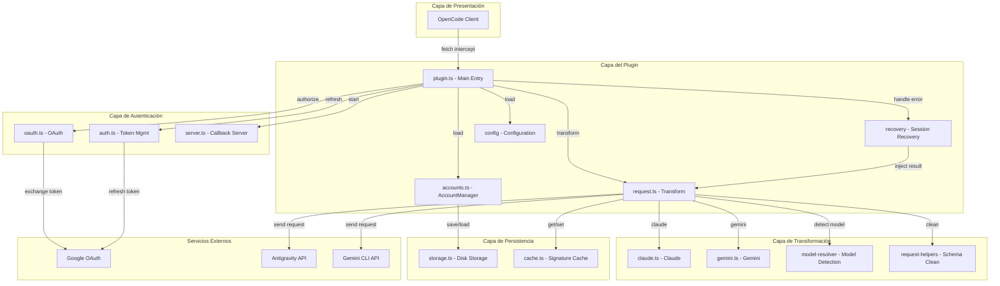
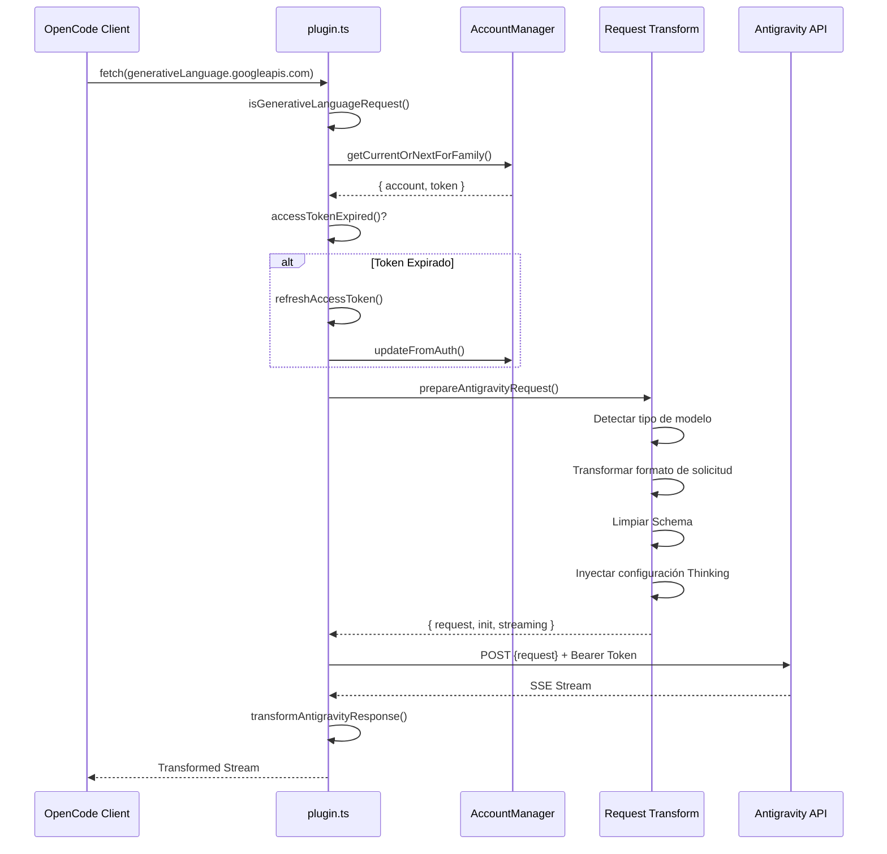
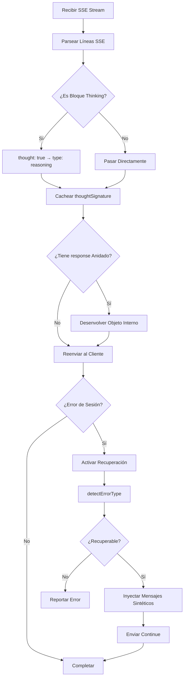

# Visión General de la Arquitectura del Plugin: Comprendiendo el Diseño Interno de OpenCode Antigravity Auth

## Qué Aprenderás

Este curso te guiará a través de una comprensión profunda del diseño arquitectónico y los principios de funcionamiento interno del plugin Antigravity Auth. Al completarlo, serás capaz de:

- Comprender la estructura de módulos del plugin y las responsabilidades de cada módulo
- Dominar el flujo completo de procesamiento de solicitudes desde OpenCode hasta la API de Antigravity
- Entender el mecanismo de balanceo de carga en la gestión multi-cuenta
- Comprender cómo funciona la recuperación de sesión
- Dominar los detalles técnicos de la transformación de formatos de solicitud

## El Valor Central del Plugin

El papel central del plugin Antigravity Auth es construir un "puente de traducción" entre OpenCode y la API de Antigravity:

1. **Conversión de Protocolo** - Transforma el formato de solicitud de OpenCode al formato requerido por la API de Antigravity
2. **Gestión de Autenticación** - Obtiene y actualiza tokens de acceso de forma segura mediante Google OAuth 2.0 PKCE
3. **Balanceo de Carga** - Pool de múltiples cuentas con rotación automática para evitar límites de tasa
4. **Recuperación de Errores** - Detección y reparación automática de problemas de interrupción de sesión

::: info ¿Por qué es importante entender la arquitectura?
Comprender la arquitectura del plugin te ayuda a:
- Localizar rápidamente el módulo donde ocurre un problema
- Entender el alcance de las opciones de configuración
- Optimizar estrategias de uso multi-cuenta
- Participar en el desarrollo y depuración del plugin
:::

## Visión General de la Estructura de Módulos

El plugin adopta una arquitectura en capas con responsabilidades claramente definidas para cada módulo:



### Responsabilidades de Cada Módulo

| Módulo | Archivo | Responsabilidad |
| --- | --- | --- |
| **Entrada Principal** | `plugin.ts` | Interceptor fetch, inicialización del plugin, manejo de eventos |
| **Gestión de Cuentas** | `accounts.ts` | Pool multi-cuenta, estrategias de balanceo de carga, seguimiento de límites de tasa |
| **Transformación de Solicitudes** | `request.ts` | Transformación de formato de solicitud, procesamiento de respuestas en streaming |
| **Transformación de Modelos** | `transform/` | Lógica de transformación específica para Claude/Gemini |
| **Autenticación OAuth** | `antigravity/oauth.ts` | Flujo de autenticación PKCE, intercambio de tokens |
| **Recuperación de Sesión** | `recovery/` | Detección de errores, reparación automática de sesiones interrumpidas |
| **Gestión de Configuración** | `config/` | Carga de configuración, validación de Schema |
| **Capa de Almacenamiento** | `storage.ts` | Persistencia de cuentas (archivo JSON) |
| **Capa de Caché** | `cache.ts` | Caché de firmas, reducción de cálculos repetidos |
| **Registro de Depuración** | `debug.ts` | Logs estructurados, resolución de problemas |

## Flujo de Procesamiento de Solicitudes

Cuando una solicitud de modelo se envía desde OpenCode, el plugin pasa por una cadena de procesamiento completa:



### Explicación Detallada de los Pasos

**Paso 1: Intercepción de Solicitud**
- El plugin captura todas las solicitudes a `generativelanguage.googleapis.com` mediante el interceptor `fetch`
- Usa `isGenerativeLanguageRequest()` para determinar si es una solicitud relacionada con Antigravity
- Las solicitudes no objetivo se pasan directamente para evitar afectar otras funcionalidades

**Paso 2: Selección de Cuenta**
- Selecciona una cuenta disponible del pool de cuentas (según la estrategia configurada: sticky/round-robin/hybrid)
- Verifica si el token ha expirado; si es así, lo actualiza automáticamente
- Aplica el desplazamiento PID (si está habilitado) para asegurar una distribución uniforme de cuentas en escenarios multi-agente

**Paso 3: Transformación de Solicitud** (`request.ts`)
- **Detección de Modelo**: Identifica si es un modelo Claude o Gemini
- **Procesamiento de Thinking**:
  - Claude: Elimina todos los bloques de pensamiento históricos para evitar conflictos de firma
  - Gemini: Añade configuración `thinkingConfig`
- **Transformación de Tools**: Convierte las tools de OpenCode al formato `functionDeclarations`
- **Limpieza de Schema**: Elimina campos JSON Schema no soportados (`const`, `$ref`, `$defs`, etc.)
- **Empaquetado de Solicitud**: Encapsula en formato `{ project, model, request: {...} }`

**Paso 4: Envío de Solicitud**
- Añade headers específicos de Antigravity (User-Agent, Client-Metadata)
- Usa autenticación Bearer Token
- Soporta fallback de endpoint (daily → autopush → prod)

**Paso 5: Transformación de Respuesta**
- Recepción en streaming SSE, transformación línea por línea
- Convierte `thought: true` a `type: "reasoning"`
- Almacena en caché la firma de thinking para solicitudes posteriores
- Desenvuelve el objeto `response` interno para mantener consistencia de formato

## Flujo de Procesamiento de Respuestas

El procesamiento de respuestas involucra principalmente transformación en streaming y recuperación de sesión:



### Mecanismos de Procesamiento Clave

**1. Transformación de Bloques de Pensamiento**

El formato de bloques de pensamiento devuelto por la API de Antigravity es:
```json
{ "thought": true, "text": "Contenido del pensamiento" }
```

El plugin lo transforma al formato compatible con OpenCode:
```json
{ "type": "reasoning", "reasoning": "Contenido del pensamiento" }
```

**2. Caché de Firmas**

Los modelos Claude y Gemini 3 requieren coincidencia de firmas de bloques de pensamiento en conversaciones multi-turno:
- Extrae `thoughtSignature` de la respuesta
- Almacena en memoria y disco usando `cacheSignature()`
- En la siguiente solicitud, obtiene e inyecta usando `getCachedSignature()`

::: tip ¿Por qué es necesario el caché de firmas?
Las APIs de Claude y Gemini 3 requieren que los bloques de pensamiento antes de llamadas a herramientas tengan la firma correcta. El caché de firmas permite:
- Evitar fallos de solicitud por errores de firma
- Reducir la regeneración del mismo contenido de pensamiento
- Mejorar la continuidad en conversaciones multi-turno
:::

**3. Recuperación de Sesión**

Cuando se detecta un error de sesión:
1. Captura el error mediante el evento `session.error`
2. Llama a `detectErrorType()` para determinar si es recuperable
3. Para errores `tool_result_missing`:
   - Extrae los IDs de `tool_use` fallidos
   - Inyecta mensajes sintéticos `tool_result`
   - Envía automáticamente "continue" (si está habilitado)
4. Para errores de orden de bloques de pensamiento:
   - Analiza el estado de la conversación
   - Cierra el turno dañado
   - Inicia un nuevo turno para que el modelo regenere

## Explicación Detallada de Mecanismos Centrales

### Mecanismo de Autenticación OAuth

El plugin usa el flujo OAuth 2.0 con PKCE (Proof Key for Code Exchange):

```mermaid
flowchart LR
    A[Usuario ejecuta opencode auth login] --> B[Generar par de claves PKCE]
    B --> C[Construir URL de autorización]
    C --> D[Iniciar servidor local]
    D --> E[Abrir página de autorización en navegador]
    E --> F[Usuario autoriza]
    F --> G[Recibir código de callback]
    G --> H[Intercambiar token de acceso]
    H --> I[Obtener Project ID]
    I --> J[Almacenar en antigravity-accounts.json]
```



**Seguridad PKCE**:
- Genera `code_verifier` y `code_challenge` aleatorios
- La URL de autorización incluye `code_challenge` para prevenir ataques man-in-the-middle
- El intercambio de tokens verifica `code_verifier` para asegurar que la solicitud proviene del mismo cliente

**Gestión de Tokens**:
- Access Token: Expira por defecto en 1 hora, se actualiza automáticamente 30 minutos antes de expirar
- Refresh Token: Válido a largo plazo, usado para obtener nuevos Access Tokens
- Persistido en `~/.config/opencode/antigravity-accounts.json`

### Mecanismo de Gestión Multi-Cuenta

La gestión multi-cuenta es una de las características centrales del plugin, incluyendo los siguientes componentes clave:

**1. Estructura del Pool de Cuentas**

```typescript
interface AccountPool {
  version: 3;
  accounts: Account[];
  activeIndex: number;
  activeIndexByFamily: {
    claude: number;
    gemini: number;
  };
}
```

**2. Estrategias de Selección de Cuenta**

| Estrategia | Descripción | Escenario de Uso |
| --- | --- | --- |
| **sticky** | Mantiene la cuenta actual hasta alcanzar el límite de tasa | Uso de sesión única, preserva caché de prompts |
| **round-robin** | Rota a la siguiente cuenta en cada solicitud | Sesiones paralelas múltiples, maximiza throughput |
| **hybrid** | Decisión combinada de puntuación de salud + Token bucket + LRU | Estrategia por defecto, equilibra rendimiento y fiabilidad |

**3. Seguimiento de Límites de Tasa**

Cada cuenta se rastrea independientemente por familia de modelos:
- `claude`: Cuota de modelos Claude
- `gemini-antigravity`: Cuota de Gemini Antigravity
- `gemini-cli`: Cuota de Gemini CLI

El estado de límite de tasa incluye:
- `rateLimitResetTimes`: Tiempos de reinicio de cada cuota
- `cooldownEndAt`: Tiempo de fin del período de enfriamiento de la cuenta
- `consecutiveFailures`: Número de fallos consecutivos

**4. Pool de Cuota Dual (Específico para Gemini)**

Los modelos Gemini soportan dos pools de cuota independientes:
- **Cuota Antigravity**: Entorno sandbox diario
- **Cuota Gemini CLI**: Entorno de producción

Mediante la configuración `quota_fallback`:
- Usa primero la cuota preferida (determinada por el sufijo del modelo)
- Cuando la cuota preferida se agota, intenta la cuota de respaldo
- Cuando ambos pools se agotan, cambia a la siguiente cuenta

**5. Optimización de Desplazamiento PID**

Con `pid_offset_enabled` habilitado:
- Diferentes procesos (PID) de agentes comienzan desde diferentes cuentas
- Evita que todos los agentes compitan por la misma cuenta
- Adecuado para escenarios de agentes paralelos múltiples

### Mecanismo de Transformación de Solicitudes

La transformación de solicitudes es la parte más compleja del plugin, manejando diferencias de protocolo entre diferentes modelos:

**Puntos Clave de Transformación para Modelos Claude**:

1. **Procesamiento de Bloques de Pensamiento**
   ```typescript
   // Eliminar todos los bloques de pensamiento históricos (evitar conflictos de firma)
   const filteredContents = deepFilterThinkingBlocks(contents);

   // Construir nuevo thinkingConfig
   const thinkingConfig = {
     budgetTokens: variantThinkingConfig?.budget || DEFAULT_THINKING_BUDGET,
   };
   ```

2. **Limpieza de Tool Schema**
   - Lista blanca de campos: `type`, `properties`, `required`, `description`, `enum`, `items`
   - Campos eliminados: `const`, `$ref`, `$defs`, `default`, `examples`, `additionalProperties`, `$schema`, `title`
   - Conversión especial: `const: "value"` → `enum: ["value"]`

3. **Inyección de Firma de Parámetros en Herramientas**
   ```typescript
   injectParameterSignatures(tool, signature) {
     tool.description += `\n\nParameters: ${signature}`;
   }
   ```

**Puntos Clave de Transformación para Modelos Gemini**:

1. **Configuración de Thinking**
   ```typescript
   // Gemini 3 Pro/Flash
   if (isGemini3Model(model)) {
     request.thinkingConfig = {
       thinkingLevel: "high" | "medium" | "low" | "minimal",
     };
   }

   // Gemini 2.5
   else if (isGemini2Model(model)) {
     request.thinkingConfig = {
       thinkingLevel: "high" | "medium" | "low",
     };
   }
   ```

2. **Google Search Grounding**
   ```typescript
   if (webSearchConfig) {
     request.generationConfig = {
       ...request.generationConfig,
       dynamicRetrievalConfig: {
         mode: webSearchConfig.mode, // "auto" | "off"
         dynamicRetrievalConfig: {
           scoreThreshold: webSearchConfig.threshold, // 0.0 - 1.0
         },
       },
     };
   }
   ```

3. **Configuración de Generación de Imágenes**
   ```typescript
   if (isImageGenerationModel(model)) {
     request.generationConfig = {
       ...request.generationConfig,
       responseModalities: ["IMAGE", "TEXT"],
     };
   }
   ```

### Mecanismo de Recuperación de Sesión

El mecanismo de recuperación de sesión asegura que las conversaciones puedan continuar después de interrupciones inesperadas:

**1. Detección de Errores**

```typescript
function detectErrorType(error: unknown): RecoverableError | null {
  if (errorString.includes("tool_use ids were found without tool_result")) {
    return { type: "tool_result_missing" };
  }
  if (errorString.includes("Expected thinking but found text")) {
    return { type: "thinking_order_error" };
  }
  return null;
}
```

**2. Detección de Límites de Turno**

```typescript
// Límite de turno = primer mensaje assistant después del mensaje de usuario
function analyzeConversationState(messages: Message[]): ConversationState {
  const lastUserMessage = findLastMessageByRole(messages, "user");
  const firstAssistantAfterUser = messages.find(m =>
    m.role === "assistant" && m.timestamp > lastUserMessage.timestamp
  );

  return {
    isTurnStart: true,
    turnAssistantMessage: firstAssistantAfterUser,
  };
}
```

**3. Inyección de Mensajes Sintéticos**

```typescript
// Inyectar tool_result sintético
function createSyntheticErrorResponse(toolUseIds: string[]): Message[] {
  return toolUseIds.map(id => ({
    type: "tool_result",
    tool_use_id: id,
    content: "Operation cancelled",
    isSynthetic: true,
  }));
}

// Cerrar turno dañado
function closeToolLoopForThinking(sessionId: string): Message[] {
  return [
    {
      type: "text",
      text: "[Conversation turn closed due to error]",
      isSynthetic: true,
    },
  ];
}
```

**4. Auto-Resume**

Con `auto_resume` habilitado, el flujo de recuperación envía automáticamente el comando de continuación:
```typescript
await client.session.prompt({
  path: { id: sessionID },
  body: { parts: [{ type: "text", text: config.resume_text }] },
  query: { directory },
});
```

## Resumen de Esta Lección

Esta lección analizó en profundidad el diseño arquitectónico del plugin Antigravity Auth:

**Arquitectura Central**:
- Diseño modular en capas con responsabilidades claras
- Capa del plugin, capa de autenticación, capa de transformación y capa de persistencia, cada una con su función
- `plugin.ts` como punto de entrada unificado que coordina todos los módulos

**Flujo de Solicitudes**:
- Intercepción → Selección de cuenta → Actualización de token → Transformación de solicitud → Envío de solicitud → Transformación de respuesta
- Cada paso tiene manejo de errores detallado y mecanismos de reintento

**Mecanismos Clave**:
- **OAuth 2.0 PKCE**: Flujo de autenticación seguro
- **Gestión Multi-Cuenta**: Balanceo de carga, seguimiento de límites de tasa, pool de cuota dual
- **Transformación de Solicitudes**: Compatibilidad de protocolo, limpieza de Schema, procesamiento de Thinking
- **Recuperación de Sesión**: Detección automática de errores, inyección de mensajes sintéticos, Auto-Resume

Comprender estos mecanismos te ayudará a usar y optimizar mejor la configuración del plugin, así como a participar en su desarrollo y depuración.

## Avance de la Siguiente Lección

> En la siguiente lección aprenderemos **[Especificación Interna de la API de Antigravity](../api-spec/)**.
>
> Aprenderás:
> - Formatos de solicitud y respuesta de la API de Antigravity
> - Funciones y parámetros de cada endpoint
> - Significado de códigos de error y códigos de estado
> - Funciones avanzadas y características experimentales

---

## Apéndice: Referencia del Código Fuente

<details>
<summary><strong>Haz clic para ver la ubicación del código fuente</strong></summary>

> Última actualización: 2026-01-23

| Funcionalidad | Ruta del Archivo | Líneas |
| --- | --- | --- |
| Entrada principal del plugin, interceptor fetch | [`src/plugin.ts`](https://github.com/NoeFabris/opencode-antigravity-auth/blob/main/src/plugin.ts) | 654-1334 |
| Gestor de cuentas, balanceo de carga | [`src/plugin/accounts.ts`](https://github.com/NoeFabris/opencode-antigravity-auth/blob/main/src/plugin/accounts.ts) | 1-715 |
| Transformación de solicitudes, streaming de respuestas | [`src/plugin/request.ts`](https://github.com/NoeFabris/opencode-antigravity-auth/blob/main/src/plugin/request.ts) | 1-1664 |
| Transformación de modelos Claude | [`src/plugin/transform/claude.ts`](https://github.com/NoeFabris/opencode-antigravity-auth/blob/main/src/plugin/transform/claude.ts) | Completo |
| Transformación de modelos Gemini | [`src/plugin/transform/gemini.ts`](https://github.com/NoeFabris/opencode-antigravity-auth/blob/main/src/plugin/transform/gemini.ts) | Completo |
| Recuperación de sesión | [`src/plugin/recovery/index.ts`](https://github.com/NoeFabris/opencode-antigravity-auth/blob/main/src/plugin/recovery/index.ts) | Completo |
| Recuperación de bloques de pensamiento | [`src/plugin/recovery/thinking-recovery.ts`](https://github.com/NoeFabris/opencode-antigravity-auth/blob/main/src/plugin/recovery/thinking-recovery.ts) | Completo |
| Autenticación OAuth | [`src/antigravity/oauth.ts`](https://github.com/NoeFabris/opencode-antigravity-auth/blob/main/src/antigravity/oauth.ts) | 1-271 |
| Gestión de tokens | [`src/plugin/token.ts`](https://github.com/NoeFabris/opencode-antigravity-auth/blob/main/src/plugin/token.ts) | Completo |
| Schema de configuración | [`src/plugin/config/schema.ts`](https://github.com/NoeFabris/opencode-antigravity-auth/blob/main/src/plugin/config/schema.ts) | 1-373 |
| Almacenamiento de cuentas | [`src/plugin/storage.ts`](https://github.com/NoeFabris/opencode-antigravity-auth/blob/main/src/plugin/storage.ts) | Completo |
| Caché de firmas | [`src/plugin/cache.ts`](https://github.com/NoeFabris/opencode-antigravity-auth/blob/main/src/plugin/cache.ts) | Completo |
| Registro de depuración | [`src/plugin/debug.ts`](https://github.com/NoeFabris/opencode-antigravity-auth/blob/main/src/plugin/debug.ts) | Completo |

**Constantes Clave**:
- `MAX_OAUTH_ACCOUNTS = 10`: Número máximo de cuentas
- `RATE_LIMIT_DEDUP_WINDOW_MS = 2000`: Ventana de deduplicación de límite de tasa (2 segundos)
- `RATE_LIMIT_STATE_RESET_MS = 120000`: Tiempo de reinicio del estado de límite de tasa (2 minutos)
- `FAILURE_COOLDOWN_MS = 30000`: Tiempo de enfriamiento de cuenta (30 segundos)

**Funciones Clave**:
- `createAntigravityPlugin()`: Función de entrada principal del plugin
- `prepareAntigravityRequest()`: Función principal de transformación de solicitudes
- `transformAntigravityResponse()`: Función de transformación de respuestas en streaming
- `AccountManager.getCurrentOrNextForFamily()`: Función de selección de cuenta
- `handleSessionRecovery()`: Función de manejo de recuperación de sesión
- `refreshAccessToken()`: Función de actualización de tokens

</details>
