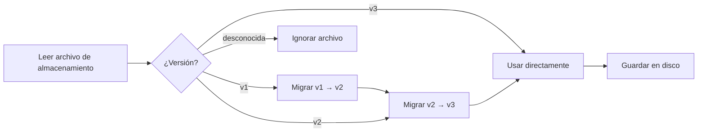

# Formato de Almacenamiento de Cuentas y Gestión de Versiones

## Qué Aprenderás

- Comprender la estructura del archivo de almacenamiento de cuentas y el significado de cada campo
- Editar manualmente el archivo de almacenamiento (solo cuando sea necesario)
- Entender el mecanismo de migración de versiones y la compatibilidad
- Migrar la configuración de cuentas entre máquinas

## Tu Situación Actual

Podrías encontrarte en las siguientes situaciones:

- Quieres hacer una copia de seguridad o migrar cuentas a otra máquina
- Necesitas modificar manualmente el `projectId` o eliminar cuentas no válidas
- Ves advertencias de versión o registros de migración y quieres entender qué está sucediendo
- Sincronizar el estado de cuentas entre varias máquinas

## Ubicación del Archivo

El archivo de almacenamiento de cuentas se encuentra en:

| Sistema Operativo | Ruta |
|--- | ---|
| macOS/Linux | `~/.config/opencode/antigravity-accounts.json` |
| Windows | `%APPDATA%\opencode\antigravity-accounts.json` |

::: warning Aviso de Seguridad
Este archivo contiene **OAuth refresh tokens**, equivalente a un archivo de contraseñas. No lo compartas con otros ni lo envíes a repositorios Git.
:::

## Versiones del Formato de Almacenamiento

El formato de almacenamiento tiene control de versiones, la actual es **v3**. El complemento procesa automáticamente la migración de versiones sin necesidad de intervención manual.

### Formato v3 (Versión Actual)

```json
{
  "version": 3,
  "accounts": [
    {
      "email": "user1@gmail.com",
      "refreshToken": "1//0abc...",
      "projectId": "my-gcp-project",
      "managedProjectId": "managed-project-123",
      "addedAt": 1737600000000,
      "lastUsed": 1737603600000,
      "lastSwitchReason": "initial",
      "rateLimitResetTimes": {
        "claude": 1737607200000,
        "gemini-antigravity": 1737607200000,
        "gemini-cli": 1737607200000
      },
      "coolingDownUntil": 1737600000000,
      "cooldownReason": "auth-failure"
    }
  ],
  "activeIndex": 0,
  "activeIndexByFamily": {
    "claude": 0,
    "gemini": 0
  }
}
```

**Descripción de Campos**:

| Campo | Tipo | Requerido | Descripción |
|--- | --- | --- | ---|
| `version` | number | Sí | Versión del formato de almacenamiento (fijo en 3) |
| `accounts` | array | Sí | Lista de cuentas |
| `activeIndex` | number | Sí | Índice de la cuenta activa actual (comienza en 0) |
| `activeIndexByFamily` | object | No | Rastrea cuentas activas por familia de modelos (`claude`/`gemini`) |

**Campos del Objeto de Cuenta**:

| Campo | Tipo | Requerido | Descripción |
|--- | --- | --- | ---|
| `email` | string | No | Correo electrónico de la cuenta de Google |
| `refreshToken` | string | Sí | Token de actualización OAuth (identificador único) |
| `projectId` | string | No | ID del proyecto GCP (necesario para modelos Gemini CLI) |
| `managedProjectId` | string | No | ID del proyecto gestionado |
| `addedAt` | number | Sí | Marca de tiempo de adición (milisegundos Unix) |
| `lastUsed` | number | Sí | Marca de tiempo del último uso |
| `lastSwitchReason` | string | No | Motivo del cambio: `"rate-limit"` / `"initial"` / `"rotation"` |
| `rateLimitResetTimes` | object | No | Tiempos de restablecimiento de límite de velocidad (rastreados por grupo de cuota) |
| `coolingDownUntil` | number | No | Marca de tiempo de fin del período de enfriamiento de la cuenta |
| `cooldownReason` | string | No | Motivo del enfriamiento: `"auth-failure"` / `"network-error"` / `"project-error"` |

### Formato v2 (Versión Histórica)

El formato v2 es similar a v3, pero tiene las siguientes diferencias:

- `rateLimitResetTimes` solo tiene los campos `claude` y `gemini`
- No tiene `coolingDownUntil` y `cooldownReason`
- No tiene `activeIndexByFamily` (todos los modelos comparten una cuenta activa)

Durante la migración, el campo `gemini` se asigna a `gemini-antigravity`, y el grupo de cuota `gemini-cli` se inicializa vacío.

### Formato v1 (Versión Histórica)

El formato v1 usa marcadores booleanos y una sola marca de tiempo:

```json
{
  "version": 1,
  "accounts": [
    {
      "email": "user1@gmail.com",
      "refreshToken": "1//0abc...",
      "isRateLimited": true,
      "rateLimitResetTime": 1737607200000
    }
  ],
  "activeIndex": 0
}
```

Durante la migración, si `isRateLimited` es `true` y `rateLimitResetTime` no ha expirado, se establecen los tiempos de restablecimiento para `claude` y `gemini`.

## Mecanismo de Migración de Versiones

El complemento detecta automáticamente la versión y ejecuta la migración al cargar el archivo de almacenamiento:



**Reglas de Migración**:

1. **Migración automática**: Después de la migración, el nuevo formato se guarda automáticamente en disco
2. **Retención de datos**: Los estados de límite de velocidad no expirados se conservan
3. **Degradación ante fallos**: Si la guarda falla, se sigue usando los datos migrados en memoria
4. **Compatibilidad hacia adelante**: El complemento de nueva versión puede leer archivos de formato antiguo

## Detalles del Mecanismo de Almacenamiento

### Bloqueo de Archivos

Usa `proper-lockfile` para garantizar acceso seguro multiproceso:

- **Mecanismo de bloqueo**: Crea un archivo de bloqueo al escribir (`.antigravity-accounts.json.lock`)
- **Configuración de tiempo de espera**: El archivo de bloqueo expira después de 10 segundos (previene bloqueos muertos)
- **Estrategia de reintentos**: Máximo 5 reintentos, tiempo de espera exponencial 100ms → 1000ms
- **Escritura atómica**: Escribe primero a un archivo temporal (`.tmp`), luego renombra al archivo objetivo

### Fusión de Cuentas

Cuando varios procesos escriben simultáneamente en el archivo de almacenamiento, se ejecuta una estrategia de fusión:

```typescript
// Lógica de fusión
function mergeAccountStorage(existing, incoming) {
  // Fusionar cuentas usando refreshToken como clave
  // Conservar projectId/managedProjectId configurados manualmente
  // Fusionar rateLimitResetTimes
  // Conservar el lastUsed mayor
}
```

### Mecanismo de Deduplicación

Deduplicación basada en `email`, conservando la cuenta más reciente de cada correo electrónico (por `lastUsed`, luego por `addedAt`):

```typescript
// Reglas de deduplicación
1. Cuentas sin email → Conservar (no se puede deduplicar)
2. Cuentas con el mismo email → Conservar la con lastUsed mayor
3. Mismo lastUsed → Conservar la con addedAt mayor
```

## Guía de Edición Manual

::: danger Riesgo de Edición Manual
Al editar el archivo de almacenamiento, el proceso del complemento no debería estar ejecutándose, de lo contrario podría ser sobrescrito. Se recomienda detener OpenCode antes de editar.
:::

### Agregar Cuenta

Al agregar una cuenta manualmente, al menos necesitas proporcionar `refreshToken`:

```json
{
  "accounts": [
    {
      "refreshToken": "Copiado de otra máquina u obtenido del flujo OAuth",
      "email": "user@example.com",
      "addedAt": Date.now(),
      "lastUsed": Date.now()
    }
  ]
}
```

### Eliminar Cuenta

Elimina la entrada correspondiente del array `accounts`, luego ajusta `activeIndex`:

```json
{
  "accounts": [
    { "email": "user1@gmail.com", "refreshToken": "..." },  // Conservar
    // { "email": "user2@gmail.com", "refreshToken": "..." },  // Eliminar
    { "email": "user3@gmail.com", "refreshToken": "..." }   // Conservar
  ],
  "activeIndex": 0  // Asegurar que el índice esté en rango válido
}
```

### Modificar projectId

Agregar o modificar el `projectId` para una cuenta:

```json
{
  "accounts": [
    {
      "email": "user@gmail.com",
      "refreshToken": "1//0abc...",
      "projectId": "your-gcp-project-id"  // Agregar o modificar
    }
  ]
}
```

### Limpiar Estado de Límite de Velocidad

Eliminar manualmente los marcadores de límite de velocidad:

```json
{
  "accounts": [
    {
      "email": "user@gmail.com",
      "refreshToken": "1//0abc...",
      "rateLimitResetTimes": {}  // Vaciar o eliminar este campo
    }
  ]
}
```

## Migración Entre Máquinas

### Migración Simple

Copia directamente el archivo de almacenamiento al directorio de configuración de la máquina destino:

```bash
# macOS/Linux
cp ~/.config/opencode/antigravity-accounts.json /ruta/a/backup/

# Windows
copy %APPDATA%\opencode\antigravity-accounts.json backup\
```

### Fusión de Cuentas

Si la máquina destino ya tiene cuentas, el complemento las fusionará automáticamente (deduplicación basada en `refreshToken`).

**Pasos de fusión manual**:

1. Haz copia de seguridad de los archivos de almacenamiento de ambas máquinas
2. Abre ambos archivos, copia el array de cuentas destino al archivo origen
3. Ajusta `activeIndex` y `activeIndexByFamily`
4. Guarda y reinicia el complemento

## Preguntas Frecuentes

### ¿Qué hacer si la migración falla?

Si la migración falla, el complemento registrará una advertencia en el registro:

```
Failed to persist migrated storage: { error: "..." }
```

**Solución**:

1. Verifica los permisos del archivo
2. Confirma que haya suficiente espacio en disco
3. Haz una copia de seguridad manual del archivo antiguo, luego elimínalo y agrega las cuentas nuevamente

### Error de Versión Incompatible

Si ves el error "Unknown storage version":

```json
{
  "version": 99  // Versión desconocida
}
```

**Solución**:

1. Haz una copia de seguridad del archivo actual
2. Cambia manualmente `version` a `2` o `3`
3. Reinicia el complemento para activar la migración
4. Si la migración falla, elimina el archivo y agrega las cuentas nuevamente

### Pérdida de Deduplicación de Cuentas

Si descubres que cuentas duplicadas fueron eliminadas:

**Causa**: El complemento deduplica basándose en `email`, conservando la cuenta usada más recientemente.

**Solución**: Si necesitas conservar dos cuentas con el mismo correo electrónico (caso raro), edita manualmente el archivo asegurando que el campo `email` esté vacío o sea diferente.

## Resumen de la Lección

- Ubicación del archivo de almacenamiento: `~/.config/opencode/antigravity-accounts.json`
- Versión actual: v3, soporta grupos de cuota duales y mecanismo de enfriamiento
- Migración automática: v1/v2 se actualizan automáticamente a v3
- Bloqueo de archivos: Usa `proper-lockfile` para garantizar seguridad concurrente
- Edición manual: Se recomienda detener el complemento antes de editar para evitar sobrescritura

## Anticipación de la Próxima Lección

> En la próxima lección aprenderemos **[Todas las Opciones de Configuración](../all-config-options/)**.
>
> Aprenderás:
> - Lista completa de opciones de configuración
> - Valores predeterminados y alcance de cada opción
> - Técnicas de configuración avanzadas

---

## Apéndice: Referencia del Código Fuente

<details>
<summary><strong>Haz clic para expandir y ver la ubicación del código fuente</strong></summary>

> Última actualización: 2026-01-23

| Funcionalidad | Ruta del Archivo | Líneas |
|--- | --- | ---|
| Definición del formato de almacenamiento | [`src/plugin/storage.ts`](https://github.com/NoeFabris/opencode-antigravity-auth/blob/main/src/plugin/storage.ts) | 128-198 |
| Migración v1 → v2 | [`src/plugin/storage.ts`](https://github.com/NoeFabris/opencode-antigravity-auth/blob/main/src/plugin/storage.ts) | 366-395 |
| Migración v2 → v3 | [`src/plugin/storage.ts`](https://github.com/NoeFabris/opencode-antigravity-auth/blob/main/src/plugin/storage.ts) | 397-431 |
| Cargar cuentas | [`src/plugin/storage.ts`](https://github.com/NoeFabris/opencode-antigravity-auth/blob/main/src/plugin/storage.ts) | 433-518 |
| Guardar cuentas | [`src/plugin/storage.ts`](https://github.com/NoeFabris/opencode-antigravity-auth/blob/main/src/plugin/storage.ts) | 520-536 |
| Mecanismo de bloqueo de archivos | [`src/plugin/storage.ts`](https://github.com/NoeFabris/opencode-antigravity-auth/blob/main/src/plugin/storage.ts) | 219-257 |
| Fusión de cuentas | [`src/plugin/storage.ts`](https://github.com/NoeFabris/opencode-antigravity-auth/blob/main/src/plugin/storage.ts) | 259-299 |
| Mecanismo de deduplicación | [`src/plugin/storage.ts`](https://github.com/NoeFabris/opencode-antigravity-auth/blob/main/src/plugin/storage.ts) | 301-364 |

**Definiciones de Clave**:

- `AccountStorageV1`: Formato de almacenamiento v1
- `AccountStorageV2`: Formato de almacenamiento v2
- `AccountStorageV3`: Formato de almacenamiento v3 (actual)
- `RateLimitStateV3`: Estado de límite de velocidad v3 (soporta múltiples grupos de cuota)

**Funciones Clave**:

- `loadAccounts()`: Carga cuentas y ejecuta migraciones
- `saveAccounts()`: Guarda cuentas (con bloqueo de archivos y fusión)
- `migrateV1ToV2()`: Migración v1 → v2
- `migrateV2ToV3()`: Migración v2 → v3
- `mergeAccountStorage()`: Fusiona dos objetos de almacenamiento
- `deduplicateAccountsByEmail()`: Deduplica basándose en email

</details>
