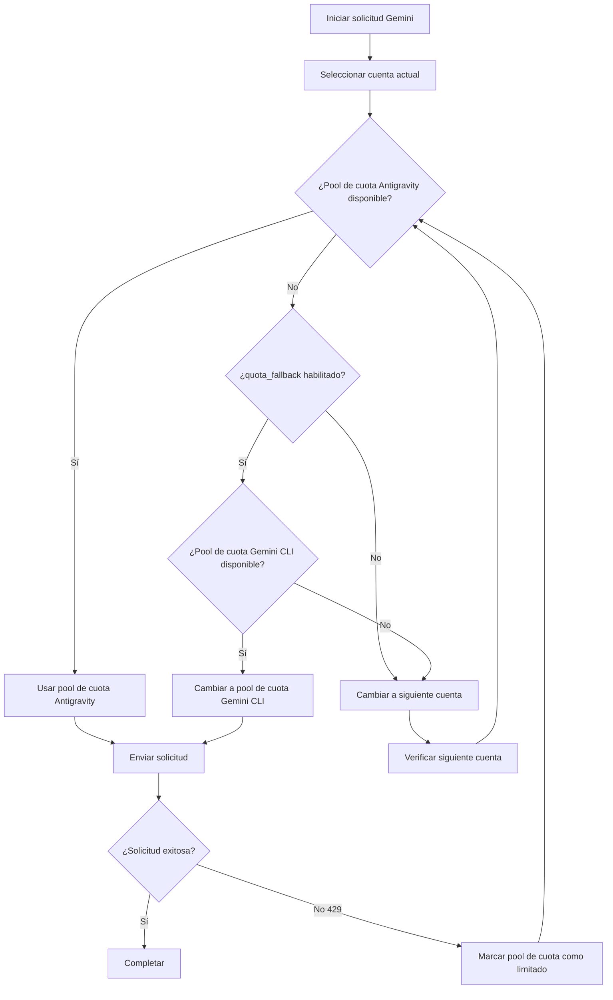

# Sistema de Doble Cuota: Comprendiendo los Pools de Cuota de Antigravity y Gemini CLI

## Lo que Aprenderás

- Entender cómo cada cuenta tiene dos pools de cuota Gemini independientes
- Habilitar el fallback automático entre los pools de cuota de Antigravity y Gemini CLI
- Especificar explícitamente qué pool de cuota usar para un modelo
- Maximizar la utilización de tu cuota a través del sistema de doble cuota

---

## Tu Situación Actual

Estás usando el plugin Antigravity Auth para llamar modelos Gemini, frecuentemente encuentras límites de cuota, pero quizás no entiendes el **sistema de doble cuota**:

- Después de que una solicitud sea limitada en velocidad, necesitas esperar a que la cuota se reinicie para continuar
- Aunque configuraste múltiples cuentas, la cuota Gemini de cada cuenta sigue siendo insuficiente
- No estás seguro por qué algunos modelos pueden hacer solicitudes mientras otros frecuentemente devuelven 429

**Dolor Central**: Piensas que cada cuenta solo tiene un pool de cuota Gemini, pero en realidad cada cuenta tiene **dos pools independientes** de cuota. Si se configura adecuadamente, puede duplicar tu cuota Gemini.

---

## Concepto Central

### ¿Qué es el Sistema de Doble Cuota?

El **Sistema de Doble Cuota** es el mecanismo del plugin Antigravity Auth que mantiene dos pools de cuota Gemini independientes para cada cuenta. Los pools de cuota de Antigravity y Gemini CLI rastrean independientemente el estado de limitación de velocidad, y cuando Antigravity está limitado se puede cambiar al pool CLI, logrando duplicar la cuota.

El plugin Antigravity Auth mantiene **dos pools de cuota Gemini independientes** para cada cuenta de Google:

| Pool de Cuota | Tipo | Prioridad | Regla de Reinicio |
| --- | --- | --- | --- |
| **Antigravity** | Pool Principal | Usar prioritariamente | Calcular dinámicamente según el tiempo de reinicio devuelto por el servidor |
| **Gemini CLI** | Pool de Respaldo | Usar en fallback | Calcular dinámicamente según el tiempo de reinicio devuelto por el servidor |

El estado de límite de velocidad de cada pool de cuota se rastrea independientemente, sin afectarse mutuamente. Esto significa:

- Cuando el pool de cuota Antigravity está limitado en velocidad, si el pool de cuota Gemini CLI aún está disponible, se puede cambiar automáticamente
- Equivalente a **duplicar** la cuota Gemini de cada cuenta

### Especificación Explícita vs Fallback Automático

Hay dos formas de usar el sistema de doble cuota:

1. **Especificación Explícita**: Agrega el sufijo `:antigravity` o `:gemini-cli` después del nombre del modelo para forzar el uso de un pool de cuota específico
2. **Fallback Automático**: Habilita la configuración `quota_fallback`, permitiendo que el plugin cambie automáticamente entre pools de cuota

**Comportamiento Predeterminado**: No habilita el fallback automático, solo usa el pool de cuota Antigravity

---

## Práctica Guiada

### Paso 1: Habilitar Fallback Automático

Abre tu archivo de configuración `~/.config/opencode/antigravity.json`:

```bash
cat ~/.config/opencode/antigravity.json
```

Agrega o modifica la configuración `quota_fallback`:

```json
{
  "quota_fallback": true
}
```

**Por qué**: Por defecto `quota_fallback` es `false`, el plugin solo usa el pool de cuota Antigravity. Después de habilitarlo, cuando Antigravity esté limitado en velocidad intentará automáticamente el pool de cuota Gemini CLI.

Deberías ver que el archivo de configuración se ha actualizado.

---

### Paso 2: Observar el Comportamiento de Fallback Automático

Inicia una solicitud al modelo Gemini (por ejemplo, usando Gemini 3 Flash):

```bash
opencode run "Explica qué es la computación cuántica" --model=google/antigravity-gemini-3-flash
```

Si el pool de cuota Antigravity está limitado, verás el siguiente comportamiento de fallback automático:

```
[Toast Notificación] Cuota de Antigravity agotada, usando cuota de Gemini CLI
```

El plugin:

1. Detecta que el pool de cuota Antigravity está limitado en velocidad (respuesta 429)
2. Intenta cambiar al pool de cuota Gemini CLI (si no está limitado)
3. Reenvía la solicitud usando el nuevo pool de cuota
4. Muestra una notificación toast informando sobre el cambio

**Por qué**: Esta es la lógica central del fallback automático—cambiar entre dos pools de cuota de la misma cuenta, en lugar de cambiar inmediatamente a la siguiente cuenta.

Deberías ver que la solicitud se completa exitosamente, en lugar de fallar debido al límite de cuota.

---

### Paso 3: Especificar el Pool de Cuota Explícitamente

Si quieres forzar el uso de un pool de cuota específico, puedes agregar un sufijo después del nombre del modelo:

**Usar el pool de cuota Antigravity** (mediante el prefijo `antigravity-`):

```bash
opencode run "Explica qué es la computación cuántica" --model=google/antigravity-gemini-3-flash
```

**Usar el pool de cuota Gemini CLI** (sin el prefijo `antigravity-`):

```bash
opencode run "Explica qué es la computación cuántica" --model=google/gemini-3-flash-preview
```

**Por qué**: Mediante el prefijo `antigravity-` puedes especificar explícitamente usar el pool de cuota Antigravity; sin prefijo usa el pool de cuota Gemini CLI. En este momento el plugin ignora la configuración `quota_fallback`, si el pool de cuota especificado está limitado en velocidad, cambiará inmediatamente a la siguiente cuenta, en lugar de intentar el otro pool de cuota.

Deberías ver que la solicitud se enruta al pool de cuota especificado.

---

### Paso 4: Ver el Estado de Cuota (Modo de Depuración)

Si quieres ver el estado de límite de velocidad de cada pool de cuota, habilita el modo de depuración:

Edita `~/.config/opencode/antigravity.json`:

```json
{
  "quota_fallback": true,
  "debug": true
}
```

Después de iniciar la solicitud, revisa el archivo de registro:

```bash
tail -f ~/.config/opencode/antigravity-logs/*.log
```

Verás un registro similar:

```
[DEBUG] headerStyle=antigravity explicit=false
[DEBUG] quota fallback: gemini-cli
[INFO] rate-limit triggered for account 0, family gemini, quota: gemini-antigravity
```

**Por qué**: Los registros de depuración pueden permitirte ver claramente qué pool de cuota eligió el plugin, y cuándo se activó el fallback. Esto es muy útil para solucionar problemas de cuota.

Deberías ver registros detallados de cambio de cuota.

---

## Puntos de Verificación ✅

### Verificar que el Fallback Automático Está Habilitado

```bash
cat ~/.config/opencode/antigravity.json | grep quota_fallback
```

Deberías ver:

```json
"quota_fallback": true
```

### Verificar el Sufijo de Especificación Explícita

Intenta usar un nombre de modelo con sufijo, confirma que no reporta error:

```bash
opencode run "prueba" --model=google/antigravity-gemini-3-flash:gemini-cli
```

Deberías ver que la solicitud se completa exitosamente.

### Verificar el Registro de Depuración

```bash
ls -la ~/.config/opencode/antigravity-logs/
```

Deberías ver que el archivo de registro existe y contiene información relacionada con cambios de cuota.

---

## Advertencias de Problemas Comunes

### Trampa 1: Especificación Explícita de Sufijo no Hace Fallback

**Problema**: Agregaste el sufijo `:antigravity` o `:gemini-cli` al nombre del modelo, pero `quota_fallback` parece no funcionar.

**Causa**: Cuando se especifica explícitamente un sufijo, el plugin ignora la configuración `quota_fallback` y fuerza el uso del pool de cuota especificado. Si ese pool de cuota está limitado en velocidad, cambiará inmediatamente a la siguiente cuenta, en lugar de intentar el otro pool de cuota.

**Solución**:
- Si quieres usar fallback automático, no agregues sufijo al nombre del modelo
- Si quieres forzar el uso de un pool de cuota específico, agrega el sufijo

### Trampa 2: Modelos Claude no Tienen Sistema de Doble Cuota

**Problema**: Habilitaste `quota_fallback`, pero los modelos Claude parecen no tener comportamiento de fallback.

**Causa**: El sistema de doble cuota **solo se aplica a modelos Gemini**. Los modelos Claude solo usan el pool de cuota Antigravity, no tienen pool de cuota Gemini CLI.

**Solución**:
- Los modelos Claude no necesitan configurar el sistema de doble cuota
- Solo la rotación de múltiples cuentas puede mejorar la cuota de Claude

### Trampa 3: Demasiados Registros de Depuración Afectan el Rendimiento

**Problema**: Habilitaste `debug: true`, pero el archivo de registro crece demasiado rápido.

**Causa**: El modo de depuración registrará todos los detalles de las solicitudes, incluyendo cambios de cuota, selección de cuentas, etc.

**Solución**:
- Después de completar la depuración, desactiva la configuración `debug`
- O limpia regularmente los archivos de registro: `rm ~/.config/opencode/antigravity-logs/*.log`

---

## Diagrama de Flujo del Sistema de Doble Cuota

El siguiente es el flujo de trabajo del fallback automático:



---

## Mecanismo de Seguimiento Independiente de Pools de Doble Cuota

### Definición de Claves de Cuota

El plugin usa las siguientes claves de cuota para rastrear límites de velocidad (código fuente: `accounts.ts:77`):

| Clave de Cuota | Significado |
| --- | --- |
| `claude` | Cuota de modelos Claude |
| `gemini-antigravity` | Pool de cuota Gemini Antigravity |
| `gemini-cli` | Pool de cuota Gemini CLI |

El objeto `rateLimitResetTimes` de cada cuenta almacena las marcas de tiempo de reinicio de estas claves de cuota:

```json
{
  "rateLimitResetTimes": {
    "claude": 1234567890,
    "gemini-antigravity": 1234567890,
    "gemini-cli": 1234567890
  }
}
```

### Verificación de Pools de Cuota Disponibles

Al seleccionar un pool de cuota, el plugin verifica en el siguiente orden (código fuente: `accounts.ts:545-557`):

1. **Pool de cuota Antigravity**: Si no está limitado, usar directamente
2. **Pool de cuota Gemini CLI**: Si Antigravity está limitado y este pool está disponible, usar este pool
3. **Retornar null**: Ambos pools están limitados, activar cambio de cuenta

---

## Condiciones de Activación para Cambio de Pool de Cuota

El fallback automático se activará cuando se cumplan las siguientes condiciones:

| Condición | Descripción | Ubicación del Código |
| --- | --- | --- |
| `quota_fallback = true` | Configuración de fallback automático habilitada | `config/schema.ts:234` |
| Pool de cuota Antigravity de cuenta actual limitado | Recibió respuesta 429 | `plugin.ts:1149` |
| Modelo no especificó explícitamente el pool de cuota | El nombre del modelo no contiene sufijo `:antigravity` o `:gemini-cli` | `plugin.ts:1151` |
| Pool de cuota Gemini CLI de cuenta actual disponible | No limitado | `accounts.ts:553` |

Si alguna condición no se cumple, el plugin cambiará directamente a la siguiente cuenta, en lugar de intentar el fallback.

---

## Resumen de Esta Lección

En esta lección aprendimos sobre el sistema de doble cuota del plugin Antigravity Auth:

- **Doble Cuota**: Cada cuenta tiene dos pools de cuota Gemini independientes: Antigravity y Gemini CLI
- **Fallback Automático**: Después de habilitar `quota_fallback`, cuando Antigravity está limitado intenta automáticamente el pool de cuota Gemini CLI
- **Especificación Explícita**: Usa el sufijo `:antigravity` o `:gemini-cli` para forzar el uso de un pool de cuota específico
- **Seguimiento Independiente**: El estado de límite de velocidad de cada pool de cuota se almacena y verifica independientemente
- **Solo para Gemini**: El sistema de doble cuota solo se aplica a modelos Gemini, los modelos Claude solo tienen el pool de cuota Antigravity

Al usar razonablemente el sistema de doble cuota, puedes duplicar la cuota Gemini de cada cuenta, reduciendo las fallas de solicitud causadas por límites de cuota.

---

## Avance de la Siguiente Lección

> En la siguiente lección aprenderemos **[Configuración de Múltiples Cuentas: Configurar Balanceo de Carga para Mejorar Cuota](../../advanced/multi-account-setup/)**.
>
> Aprenderás:
> - Cómo agregar múltiples cuentas de Google
> - Mejores prácticas para configurar diferentes estrategias de selección de cuentas
> - Técnicas de uso de pools de cuota en escenarios de múltiples cuentas

---

## Apéndice: Referencia del Código Fuente

<details>
<summary><strong>Haz clic para expandir y ver la ubicación del código fuente</strong></summary>

> Última actualización: 2026-01-23

| Funcionalidad | Ruta del Archivo | Número de Línea |
| --- | --- | --- |
| Definición de claves de cuota (BaseQuotaKey) | [`src/plugin/accounts.ts`](https://github.com/NoeFabris/opencode-antigravity-auth/blob/main/src/plugin/accounts.ts#L77-L78) | 77-78 |
| Obtener clave de cuota (getQuotaKey) | [`src/plugin/accounts.ts`](https://github.com/NoeFabris/opencode-antigravity-auth/blob/main/src/plugin/accounts.ts#L107-L116) | 107-116 |
| Verificar estado de límite de velocidad del pool de cuota | [`src/plugin/accounts.ts`](https://github.com/NoeFabris/opencode-antigravity-auth/blob/main/src/plugin/accounts.ts#L134-L152) | 134-152 |
| Obtener pool de cuota disponible | [`src/plugin/accounts.ts`](https://github.com/NoeFabris/opencode-antigravity-auth/blob/main/src/plugin/accounts.ts#L545-L557) | 545-557 |
| Definición de configuración quota_fallback | [`src/plugin/config/schema.ts`](https://github.com/NoeFabris/opencode-antigravity-auth/blob/main/src/plugin/config/schema.ts#L224-L234) | 224-234 |
| Lógica de fallback automático | [`src/plugin/plugin.ts`](https://github.com/NoeFabris/opencode-antigravity-auth/blob/main/src/plugin/plugin.ts#L1151-L1163) | 1151-1163 |
| Documentación del sistema de doble cuota | [`docs/MULTI-ACCOUNT.md`](https://github.com/NoeFabris/opencode-antigravity-auth/blob/main/docs/MULTI-ACCOUNT.md#L21-L31) | 21-31 |

**Constantes Clave**:
- `BaseQuotaKey = "claude" | "gemini-antigravity" | "gemini-cli"`: Definición de tipo de clave de cuota

**Funciones Clave**:
- `getAvailableHeaderStyle()`: Devuelve el pool de cuota disponible según el estado del pool de cuota de la cuenta actual
- `isRateLimitedForHeaderStyle()`: Verifica si el pool de cuota especificado está limitado en velocidad
- `getQuotaKey()`: Genera la clave de cuota según la familia del modelo y headerStyle

</details>
