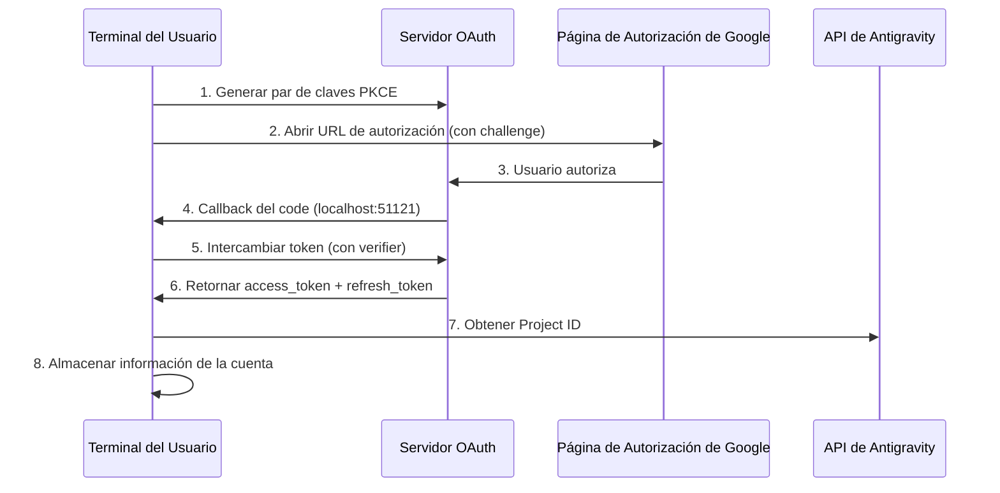

# Autenticación OAuth 2.0 PKCE: Completa el Primer Inicio de Sesión

## Lo Que Aprenderás

- Entender el mecanismo de seguridad del flujo de autenticación OAuth 2.0 PKCE
- Completar el primer inicio de sesión del plugin y obtener permisos de acceso a la API de Antigravity
- Entender el mecanismo automático de obtención y almacenamiento del Project ID
- Conocer el manejo automatizado de la renovación de tokens

## Tu Situación Actual

Ya has instalado el plugin y configurado las definiciones de modelos, pero aún no lo has usado realmente. Cada vez que ejecutas `opencode run`, te pide que te autentiques, pero no sabes:

- ¿Qué es OAuth? ¿Por qué usar un método de autenticación tan complejo?
- ¿Qué sucede durante el proceso de autenticación? ¿Es seguro?
- ¿Qué necesitas preparar para el primer inicio de sesión? ¿Qué opciones habrá?
- ¿Qué pasa si el token expira? ¿Necesitas iniciar sesión nuevamente?

## Cuándo Usar Este Método

- **Después de instalar el plugin por primera vez**: Debes completar la autenticación antes de usarlo por primera vez
- **Al agregar una nueva cuenta**: Al configurar la rotación entre múltiples cuentas, necesitas autenticar cada una
- **Después de que el token expire**: Si la cuenta fue revocada o la contraseña cambió, necesitas reautenticarte
- **Al cambiar a un nuevo dispositivo**: Al migrar tu cuenta, necesitas iniciar sesión nuevamente en el nuevo dispositivo

## 🎒 Preparativos Antes de Comenzar

::: warning Comprobación de Requisitos Previos

Confirma que has completado los siguientes pasos:

1. **Plugin instalado**: Consulta [Instalación Rápida](/es/NoeFabris/opencode-antigravity-auth/start/quick-install/)
2. **Modelos configurados**: Has agregado las definiciones de modelos a `~/.config/opencode/opencode.json`
3. **Cuenta de Google disponible**: Se recomienda usar una cuenta ya establecida, evita usar una cuenta recién creada

:::

## Conceptos Fundamentales

### ¿Qué es OAuth 2.0 PKCE?

**OAuth 2.0** (Open Authorization 2.0) es un protocolo de autorización que permite que aplicaciones de terceros (este plugin) obtengan acceso a la API de Google sin obtener directamente la contraseña del usuario.

**PKCE** (Proof Key for Code Exchange) es una extensión de seguridad de OAuth 2.0 diseñada específicamente para clientes públicos (como herramientas de CLI). Previene ataques de interceptación de código de autorización mediante el siguiente mecanismo:

```
┌─────────────────────────────────────────────────────────────────┐
│  Mecanismo de Protección PKCE                              │
├─────────────────────────────────────────────────────────────────┤
│  1. El cliente genera un par de claves:                      │
│     - code_verifier (cadena aleatoria, confidencial)            │
│     - code_challenge (valor hash del verifier, público)          │
│  2. La URL de autorización incluye code_challenge            │
│  3. El servidor de callback recibe el code y lo verifica      │
│     con el code_verifier                                     │
│  4. Un atacante que intercepte el code no puede intercambiar   │
│     el token sin el verifier                                │
└─────────────────────────────────────────────────────────────────┘
```

::: info

**PKCE vs OAuth Tradicional**

OAuth tradicional usa `client_secret` para verificar la identidad, pero esto requiere que el cliente pueda almacenar la clave de forma segura. Las herramientas de CLI no pueden hacer esto, por lo que PKCE usa un `verifier` generado dinámicamente en lugar de una clave estática, logrando la misma seguridad sin depender de secretos prealmacenados.

:::

### Resumen del Flujo de Autenticación



## Sigue los Pasos

### Paso 1: Iniciar el Inicio de Sesión OAuth

**Por qué**

El comando `opencode auth login` iniciará el servidor OAuth local, generará la URL de autorización y esperará el callback de Google.

**Ejecuta el comando**:

```bash
opencode auth login
```

**Deberías ver**:

```
🔑 Initializing Antigravity OAuth...
📋 Starting local OAuth server on http://127.0.0.1:51121
🌐 Opening browser for authorization...

If the browser doesn't open, visit this URL manually:
https://accounts.google.com/o/oauth2/v2/auth?client_id=...&code_challenge=...
```

::: tip

**Detección del Entorno**

El plugin detectará automáticamente el entorno de ejecución:

| Entorno | Dirección de Enlace | Razón |
|--- | --- | ---|
| macOS/Linux/Windows local | `127.0.0.1` | Más seguro, solo acepta conexiones locales |
| WSL / Docker / SSH remoto | `0.0.0.0` | Permite que el navegador acceda desde el host |

Puedes sobrescribir la configuración predeterminada con la variable de entorno `OPENCODE_ANTIGRAVITY_OAUTH_BIND`.

:::

### Paso 2: Autorizar en el Navegador

**Por qué**

La página de autorización de Google mostrará los permisos (Scope) solicitados por el plugin, y necesitas otorgar tu consentimiento explícito.

**Verás**:

Página de autorización de Google OAuth, mostrando:
- Solicitante: Antigravity Auth Plugin
- Permisos solicitados:
  - Ver tu dirección de correo electrónico
  - Ver tu información de perfil
  - Acceder a tus proyectos de Cloud Platform
  - Acceder a registros y configuraciones de experimentos de Google Cloud

**Acciones**:

1. Confirma que los permisos solicitados coinciden con lo esperado (sin permisos sensibles fuera de alcance)
2. Haz clic en el botón "Permitir" o "Autorizar"
3. Espera a que la página redirija a `http://localhost:51121/oauth-callback`

**Deberías ver**:

```html
<!DOCTYPE html>
<html>
  <!-- ... -->
  <h1>All set!</h1>
  <p>You've successfully authenticated with Antigravity.</p>
  <!-- ... -->
</html>
```

::: warning

**Problema de Cierre de Página de Autorización**

Si después de la autorización exitosa el navegador no se cierra automáticamente, simplemente cierra la pestaña manualmente. Esta es una restricción de seguridad del navegador y no afecta el resultado de la autenticación.

:::

### Paso 3: Intercambiar Token Automáticamente y Obtener Project ID

**Por qué**

El código de autorización es solo una credencial temporal que necesita ser intercambiada por un `refresh_token` de larga duración, mientras se obtiene el `Project ID` necesario para el proyecto Antigravity.

**Ocurre Automáticamente en Segundo Plano**:

El plugin ejecutará automáticamente las siguientes operaciones (sin tu intervención):

1. **Verificar PKCE**: Verificar la validez del código de autorización con `code_verifier`
2. **Intercambiar Token**: Enviar solicitud POST a `oauth2.googleapis.com/token`

   ```typescript
   // Código fuente: src/antigravity/oauth.ts:209
   POST https://oauth2.googleapis.com/token
   Content-Type: application/x-www-form-urlencoded

   {
     client_id: "...",
     client_secret: "...",
     code: "código de autorización",
     grant_type: "authorization_code",
     redirect_uri: "http://localhost:51121/oauth-callback",
     code_verifier: "PKCE verifier"
   }
   ```

3. **Obtener Información del Usuario**: Verificar la dirección de correo

   ```typescript
   // Código fuente: src/antigravity/oauth.ts:231
   GET https://www.googleapis.com/oauth2/v1/userinfo?alt=json
   Authorization: Bearer {access_token}
   ```

4. **Obtener Project ID Automáticamente**: Intentar obtener tu ID de proyecto desde la API de Antigravity

   ```typescript
   // Código fuente: src/antigravity/oauth.ts:131
   // Intentar múltiples endpoints en orden de prioridad
   - https://cloudcode-pa.googleapis.com/v1internal:loadCodeAssist (prod)
   - https://daily-cloudcode-pa.sandbox.googleapis.com/v1internal:loadCodeAssist (daily)
   - https://autopush-cloudcode-pa.sandbox.googleapis.com/v1internal:loadCodeAssist (autopush)
   ```

5. **Almacenar Información de la Cuenta**: Guardar en `~/.config/opencode/antigravity-accounts.json`

   ```json
   {
     "version": 3,
     "accounts": [
       {
         "email": "your.email@gmail.com",
         "refreshToken": "1//0g...|rising-fact-p41fc",
         "projectId": "rising-fact-p41fc",
         "addedAt": 1737609600000,
         "lastUsed": 1737609600000
       }
     ]
   }
   ```

::: details

**Propósito del Project ID**

El Project ID es el identificador único del proyecto de Google Cloud, usado para determinar a qué proyecto pertenecen las llamadas a la API. Antigravity rastreará el uso de cuotas según el Project ID.

- **Obtención Exitosa**: Usa tu Project ID real (recomendado)
- **Fallo en Obtención**: Usa el Project ID predeterminado (`rising-fact-p41fc`)

:::

**Deberías ver**:

```
✅ Authentication successful
📧 Account: your.email@gmail.com
🆔 Project ID: rising-fact-p41fc
💾 Saved to: ~/.config/opencode/antigravity-accounts.json
```

### Punto de Control ✅

**Verifica que la cuenta se ha almacenado correctamente**:

```bash
cat ~/.config/opencode/antigravity-accounts.json
```

**Salida esperada**:

```json
{
  "version": 3,
  "accounts": [
    {
      "email": "your.email@gmail.com",
      "refreshToken": "1//0g...|rising-fact-p41fc",
      "projectId": "rising-fact-p41fc",
      "addedAt": 1737609600000,
      "lastUsed": 1737609600000
    }
  ]
}
```

::: tip

**Formato de Almacenamiento de Cuenta**

El formato del campo `refreshToken` es: `{refresh_token}|{project_id}`, este diseño permite almacenar el token y el ID del proyecto en un solo campo, simplificando la lógica de almacenamiento.

:::

## Advertencias de Problemas Comunes

### Problema 1: Puerto Ocupado

**Mensaje de error**:

```
❌ Port 51121 is already in use.
Another process is occupying this port.
```

**Causa**: Otro proceso de OpenCode se está ejecutando, u otro programa está ocupando el puerto.

**Solución**:

1. Verifica y termina el proceso que ocupa el puerto:

   ```bash
   # macOS/Linux
   lsof -ti:51121 | xargs kill -9

   # Windows
   netstat -ano | findstr :51121
   taskkill /PID <PID> /F
   ```

2. Ejecuta `opencode auth login` nuevamente

### Problema 2: Navegador No Se Abre Automáticamente

**Causa**: En entornos WSL, Docker o remotos, `localhost` no es igual a la dirección del host.

**Solución**:

El plugin detectará automáticamente el entorno y mostrará la URL para acceso manual:

```
🌐 Opening browser for authorization...

If the browser doesn't open, visit this URL manually:
https://accounts.google.com/o/oauth2/v2/auth?...
```

Copia la URL y accede desde el navegador del host.

### Problema 3: Fallo en Obtención de Project ID

**Advertencia**:

```
⚠️ Failed to resolve Antigravity project via loadCodeAssist
Using default project ID: rising-fact-p41fc
```

**Causa**: En ciertas cuentas corporativas o configuraciones de permisos especiales, la API `loadCodeAssist` no puede ser accesible.

**Solución**:

1. Si solo usas modelos Antigravity (con sufijo `:antigravity`), puedes usar el Project ID predeterminado
2. Si necesitas usar modelos Gemini CLI (como `gemini-2.5-pro`), configura el Project ID manualmente:

   ```json
   // Edita ~/.config/opencode/antigravity-accounts.json
   {
     "accounts": [
       {
         "email": "your.email@gmail.com",
         "refreshToken": "1//0g...|your-custom-project-id",
         "projectId": "your-custom-project-id"
       }
     ]
   }
   ```

   Pasos para obtener el Project ID:
   - Visita [Google Cloud Console](https://console.cloud.google.com/)
   - Crea o selecciona un proyecto
   - Habilita **Gemini for Google Cloud API**
   - Copia el ID del proyecto (formato: `rising-fact-p41fc`)

### Problema 4: Error invalid_grant

**Mensaje de error**:

```
❌ Token exchange failed: invalid_grant
```

**Causas**:
- El código de autorización ha expirado (generalmente válido por 10 minutos)
- El usuario revocó los permisos de acceso de la aplicación después de autorizar
- La contraseña de la cuenta cambió o se activó un evento de seguridad

**Solución**: Ejecuta `opencode auth login` nuevamente

## Mecanismo de Renovación de Tokens

**Renovación Automática**: No necesitas preocuparte por la expiración de tokens.

El plugin renovará automáticamente en las siguientes situaciones:

| Condición de Disparo | Acción | Ubicación del Código |
|--- | --- | ---|
| 60 segundos antes de que expire el token | Renovación automática | `src/plugin/auth.ts:33` |
| Al recibir 401 Unauthorized | Intentar renovar | `src/plugin/auth.ts:33` |
| Fallo en renovación | Pedir al usuario que inicie sesión nuevamente | `src/plugin.ts:995` |

**Lógica de Renovación**:

```typescript
// Código fuente: src/plugin/auth.ts:33
export function accessTokenExpired(auth: OAuthAuthDetails): boolean {
  // Renovar 60 segundos antes (reservar desfase de reloj)
  return auth.expires <= Date.now() + 60 * 1000;
}
```

## Resumen de la Lección

Puntos clave del flujo de autenticación OAuth 2.0 PKCE:

1. **Mecanismo de Seguridad PKCE**: Usa un `verifier` dinámico en lugar de una clave estática, previniendo la interceptación del código de autorización
2. **Servidor de Callback Local**: Escucha en `localhost:51121`, recibe el callback de autorización de Google
3. **Intercambio de Tokens**: Intercambia el código de autorización por `access_token` y `refresh_token`
4. **Project ID Automático**: Intenta obtener desde la API de Antigravity, usa el valor predeterminado si falla
5. **Renovación Automática**: Renueva automáticamente 60 segundos antes de que expire el token, sin intervención manual
6. **Almacenamiento de Cuenta**: Toda la información se guarda en `~/.config/opencode/antigravity-accounts.json`

¡Ahora puedes hacer tu primera solicitud de modelo!

## Próxima Lección

> En la próxima lección aprenderemos **[Hacer la Primera Solicitud de Modelo](/es/NoeFabris/opencode-antigravity-auth/start/first-request/)**.
>
> Aprenderás:
> - Cómo usar `opencode run` para hacer solicitudes
> - Verificar que la autenticación fue exitosa
> - Entender la configuración de variantes de modelo

---

## Apéndice: Referencia del Código Fuente

<details>
<summary><strong>Haz clic para expandir y ver las ubicaciones del código fuente</strong></summary>

> Fecha de actualización: 2026-01-23

| Función        | Ruta del Archivo                                                                                               | Línea    |
|--- | --- | ---|
| Generación de claves PKCE | [`src/antigravity/oauth.ts`](https://github.com/NoeFabris/opencode-antigravity-auth/blob/main/src/antigravity/oauth.ts#L91-L113)         | 91-113  |
| Construcción de URL de autorización   | [`src/antigravity/oauth.ts`](https://github.com/NoeFabris/opencode-antigravity-auth/blob/main/src/antigravity/oauth.ts#L91-L113)         | 91-113  |
| Intercambio de tokens     | [`src/antigravity/oauth.ts`](https://github.com/NoeFabris/opencode-antigravity-auth/blob/main/src/antigravity/oauth.ts#L201-L270)         | 201-270 |
| Obtener información del usuario   | [`src/antigravity/oauth.ts`](https://github.com/NoeFabris/opencode-antigravity-auth/blob/main/src/antigravity/oauth.ts#L231-L242)         | 231-242 |
| Obtener Project ID automáticamente | [`src/antigravity/oauth.ts`](https://github.com/NoeFabris/opencode-antigravity-auth/blob/main/src/antigravity/oauth.ts#L131-L196)      | 131-196 |
| Detección del entorno       | [`src/plugin/server.ts`](https://github.com/NoeFabris/opencode-antigravity-auth/blob/main/src/plugin/server.ts#L31-L134)           | 31-134  |
| Servidor de callback OAuth | [`src/plugin/server.ts`](https://github.com/NoeFabris/opencode-antigravity-auth/blob/main/src/plugin/server.ts#L140-L366)           | 140-366 |
| Verificación de expiración de token   | [`src/plugin/auth.ts`](https://github.com/NoeFabris/opencode-antigravity-auth/blob/main/src/plugin/auth.ts#L33-L38)               | 33-38   |
| Calcular tiempo de expiración de token   | [`src/plugin/auth.ts`](https://github.com/NoeFabris/opencode-antigravity-auth/blob/main/src/plugin/auth.ts#L45-L52)               | 45-52   |

**Constantes clave**:
- `ANTIGRAVITY_CLIENT_ID`: ID de cliente OAuth (`constants.ts:4`)
- `ANTIGRAVITY_CLIENT_SECRET`: Secreto de cliente OAuth (`constants.ts:9`)
- `ANTIGRAVITY_REDIRECT_URI`: URL de callback OAuth `http://localhost:51121/oauth-callback` (`constants.ts:25`)
- `ANTIGRAVITY_SCOPES`: Lista de permisos solicitados (`constants.ts:14-20`)
- `ANTIGRAVITY_DEFAULT_PROJECT_ID`: ID de proyecto predeterminado `rising-fact-p41fc` (`constants.ts:71`)

**Funciones clave**:
- `authorizeAntigravity()`: Genera par de claves PKCE y URL de autorización (`oauth.ts:91`)
- `exchangeAntigravity()`: Intercambia código de autorización por token de acceso (`oauth.ts:201`)
- `fetchProjectID()`: Obtiene ID de proyecto desde la API de Antigravity (`oauth.ts:131`)
- `startOAuthListener()`: Inicia el servidor OAuth local (`server.ts:140`)
- `accessTokenExpired()`: Verifica si el token ha expirado (`auth.ts:33`)

**Reglas de negocio importantes**:
- PKCE usa el algoritmo de hash S256 (`oauth.ts:100`)
- Renovación automática 60 segundos antes de que expire el token (`auth.ts:3`)
- Soporta acceso sin conexión (`access_type=offline`) (`oauth.ts:105`)
- Orden de respaldo de endpoints Project ID: prod → daily → autopush (`oauth.ts:141-143`)

</details>
