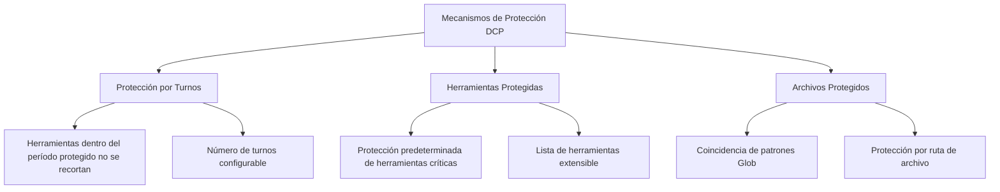

# Mecanismos de Protección: Evitar Recortes Erróneos de Contenido Crítico

## Lo que podrás hacer después de este curso

- Configurar la protección por turnos para dar tiempo a la IA de referenciar salidas de herramientas recientes
- Extender la lista de herramientas protegidas para prevenir el recorte de operaciones críticas
- Establecer patrones de archivos protegidos para proteger archivos específicos de recortes erróneos
- Comprender el mecanismo de protección de subagentes para evitar afectar el comportamiento de resumen

## Tu situación actual

DCP recorta automáticamente las llamadas a herramientas redundantes en el historial de conversación, lo cual ahorra tokens, pero a veces surgen problemas:

- La IA acaba de leer un archivo y quiere analizarlo basándose en su contenido, pero DCP lo recorta
- Usaste la herramienta `write` para escribir un archivo de configuración que necesitas leer después, pero tras el recorte no puedes encontrar la ruta del archivo
- La IA dice "según el código anterior", pero el código ya no está en el contexto

Estas situaciones indican que: **cierto contenido debe protegerse y no puede ser recortado**.

## Cuándo usar esta técnica

- Cuando la IA necesita referenciar contenido de archivos leídos previamente
- Cuando necesitas proteger operaciones críticas (como escribir configuraciones, planificar tareas)
- Cuando ciertas rutas de archivos (como secrets, claves) necesitan protección especial
- Al desarrollar funcionalidades de subagentes (DCP las omite automáticamente)

## Concepto central

DCP proporciona **tres capas de mecanismos de protección** que previenen el recorte erróneo de contenido crítico desde diferentes dimensiones:



**Niveles de protección**:
1. **Protección por turnos** (dimensión temporal): Protección automática de herramientas de los últimos N turnos
2. **Protección de herramientas** (dimensión de herramienta): Herramientas específicas nunca se recortan
3. **Protección de archivos** (dimensión de ruta): Herramientas que operan en archivos específicos no se recortan

Los tres pueden combinarse para formar una red de protección multinivel.

---

## Protección por Turnos

### Qué es la protección por turnos

La protección por turnos (Turn Protection) es un **mecanismo de ventana de tiempo de protección** proporcionado por DCP. Cuando está habilitada, las llamadas a herramientas dentro del período de protección no se agregan a la caché de recorte y, por lo tanto, no son recortadas por ninguna estrategia.

**Propósito**: Dar tiempo a la IA para referenciar salidas de herramientas recientes, evitando la situación incómoda de "recién mencionado, ya eliminado".

### Configurar la protección por turnos

Agrega en el archivo de configuración:

```jsonc
{
  "turnProtection": {
    "enabled": true,
    "turns": 4
  }
}
```

**Descripción de parámetros**:
- `enabled`: Si habilitar la protección por turnos (predeterminado `false`)
- `turns`: Número de turnos protegidos (predeterminado `4`), indica que las herramientas de los últimos 4 turnos no se recortarán

### Cómo funciona la protección por turnos

DCP calcula el número de turnos de cada herramienta al sincronizar la caché de herramientas (antes de que la IA envíe cada mensaje):

```typescript
// Si turno actual - turno de creación de herramienta < número de turnos protegidos
// entonces esa herramienta no se recortará
state.currentTurn - turnCounter < turnProtectionTurns
```

**Ejemplo**:
- Turno actual: 10
- Turno de creación de herramienta: 8
- Número de turnos protegidos: 4
- Resultado: 10 - 8 = 2 < 4 → **Protegida, no se recorta**

**Efecto**:
- Dentro del período de protección, las herramientas no aparecen en la lista `<prunable-tools>`
- No se ven afectadas por estrategias automáticas (deduplicación, sobrescritura de escrituras, limpieza de errores)
- La IA no puede recortarlas mediante las herramientas `discard`/`extract`

### Configuración recomendada

| Escenario | Turnos recomendados | Explicación |
| --- | --- | --- |
| Conversaciones largas (10+ turnos) | 4-6 | Da tiempo suficiente a la IA para referenciar contenido histórico |
| Conversaciones cortas (< 5 turnos) | 2-3 | No necesita un período de protección largo |
| Tareas altamente dependientes del contexto | 6-8 | Como refactorización de código, análisis de documentos largos |
| Predeterminado (no depende del contexto) | 0-2 | No habilitar o usar valor mínimo |

::: tip Nota
La protección por turnos aumenta el tamaño del contexto porque se conservan más salidas de herramientas. Si notas un aumento significativo en el consumo de tokens, puedes reducir el número de turnos protegidos.
:::

---

## Herramientas Protegidas

### Herramientas protegidas por defecto

DCP protege las siguientes herramientas por defecto, que **nunca** serán recortadas:

| Nombre de herramienta | Explicación |
| --- | --- |
| `task` | Herramienta de gestión de tareas |
| `todowrite` | Escribir elementos de tareas pendientes |
| `todoread` | Leer elementos de tareas pendientes |
| `discard` | Herramienta de descarte de DCP (operación de recorte en sí) |
| `extract` | Herramienta de extracción de DCP (operación de recorte en sí) |
| `batch` | Herramienta de operaciones por lotes |
| `write` | Herramienta de escritura de archivos |
| `edit` | Herramienta de edición de archivos |
| `plan_enter` | Marcador de entrada de planificación |
| `plan_exit` | Marcador de salida de planificación |

**Por qué estas herramientas están protegidas**:
- `task`, `todowrite`, `todoread`: La gestión de tareas es el núcleo del estado de la sesión, eliminarlas causaría pérdida de contexto
- `discard`, `extract`: Son las propias herramientas de recorte de DCP, no pueden recortarse a sí mismas
- `batch`, `write`, `edit`: Las operaciones de archivos son el núcleo de la interacción de la IA con el código del usuario
- `plan_enter`, `plan_exit`: Los marcadores de planificación ayudan a entender la estructura de la sesión

### Extender la lista de herramientas protegidas

Si necesitas proteger más herramientas, puedes extenderlas en la configuración:

```jsonc
{
  "tools": {
    "settings": {
      "protectedTools": [
        "task",
        "todowrite",
        "todoread",
        "discard",
        "extract",
        "batch",
        "write",
        "edit",
        "plan_enter",
        "plan_exit",
        // Agrega las herramientas que necesitas proteger
        "read",
        "filesearch"
      ]
    }
  }
}
```

**Protección global de herramientas**:
- Las herramientas en `tools.settings.protectedTools` estarán protegidas en todas las estrategias
- Adecuado para herramientas que no quieres que ninguna estrategia recorte

### Protección de herramientas a nivel de estrategia

También puedes establecer herramientas protegidas para estrategias específicas:

```jsonc
{
  "strategies": {
    "deduplication": {
      "enabled": true,
      "protectedTools": [
        "read",  // Proteger herramienta read durante la deduplicación
        "filesearch"
      ]
    },
    "purgeErrors": {
      "enabled": true,
      "turns": 4,
      "protectedTools": [
        "write"  // Proteger herramienta write durante la limpieza de errores
      ]
    }
  }
}
```

**Casos de uso**:
- Proteger herramientas solo en una estrategia específica, otras estrategias pueden recortarlas
- Por ejemplo: Permitir que la deduplicación recorte `read`, pero la estrategia de limpieza de errores no puede recortar `write`

::: info Diferencia entre protección de herramientas y protección por turnos
- **Protección de herramientas**: Independientemente del turno en que se creó la herramienta, si está en la lista de protección, nunca se recortará
- **Protección por turnos**: Todas las herramientas (excepto las protegidas) no se recortan dentro del período de protección, pero pueden recortarse después
:::

---

## Patrones de Archivos Protegidos

### Qué son los patrones de archivos protegidos

Los patrones de archivos protegidos te permiten, mediante patrones Glob, **proteger operaciones en rutas de archivos específicas de ser recortadas**.

**Escenarios aplicables**:
- Proteger archivos de claves (`.env`, `secrets.json`)
- Proteger archivos de configuración (configuraciones importantes no pueden perderse)
- Proteger archivos centrales del proyecto (archivos de entrada, bibliotecas centrales)
- Proteger directorios sensibles (como `src/api/`, `tests/fixtures/`)

### Configurar patrones de archivos protegidos

Agrega en el archivo de configuración:

```jsonc
{
  "protectedFilePatterns": [
    "**/.env*",
    "**/secrets.json",
    "**/config/*.json",
    "src/core/**/*.ts",
    "tests/fixtures/**/*"
  ]
}
```

### Explicación de patrones Glob

DCP soporta patrones Glob estándar:

| Patrón | Explicación | Ejemplo de ruta coincidente |
| --- | --- | --- |
| `**` | Coincide con cualquier nivel de directorios | `src/`, `src/components/`, `a/b/c/` |
| `*` | Coincide con cualquier archivo en un solo nivel de directorio | `src/*.ts` coincide con `src/index.ts` |
| `?` | Coincide con un solo carácter | `file?.txt` coincide con `file1.txt`, `file2.txt` |
| `*.json` | Coincide con extensión específica | `config.json`, `data.json` |
| `**/*.json` | Coincide con archivos JSON en cualquier nivel | `a/b/c.json`, `d.json` |

**Notas**:
- `*` y `?` no coinciden con `/` (separador de directorio)
- La coincidencia se realiza contra la ruta completa del archivo
- El separador de ruta es unificado como `/` (incluso en Windows)

### Casos prácticos

#### Caso 1: Proteger archivos de variables de entorno

```jsonc
{
  "protectedFilePatterns": [
    "**/.env",
    "**/.env.local",
    "**/.env.production"
  ]
}
```

**Efecto**: Cualquier herramienta que opere en archivos `.env` no será recortada.

#### Caso 2: Proteger archivos centrales del proyecto

```jsonc
{
  "protectedFilePatterns": [
    "src/index.ts",
    "src/core/**/*.ts",
    "src/api/**/*.ts"
  ]
}
```

**Efecto**: Las salidas de herramientas que operan en módulos centrales y API se conservarán, asegurando que la IA siempre pueda ver la estructura del proyecto.

#### Caso 3: Proteger datos fijos de pruebas

```jsonc
{
  "protectedFilePatterns": [
    "tests/fixtures/**/*",
    "tests/mocks/**/*.json"
  ]
}
```

**Efecto**: Los datos simulados y entradas fijas para pruebas no se recortarán, evitando inconsistencias en los resultados de las pruebas.

---

## Protección de Subagentes

### Qué es un subagente

Un subagente (Subagent) es un mecanismo de OpenCode donde el agente principal puede derivar subagentes para manejar tareas específicas (como búsqueda de archivos, análisis de código). Los subagentes devuelven resultados resumidos al agente principal.

### Protección de subagentes de DCP

DCP detecta automáticamente sesiones de subagentes y **omite todas las operaciones de recorte**.

**Principio de implementación**:
```typescript
// lib/state/utils.ts
export async function isSubAgentSession(client: any, sessionID: string): Promise<boolean> {
    const result = await client.session.get({ path: { id: sessionID } })
    return !!result.data?.parentID  // Si tiene parentID, es un subagente
}
```

**Por qué se necesita protección**:
- La salida del subagente es un resumen para que lo vea el agente principal
- Si se recortan las salidas de herramientas del subagente, el agente principal puede no entender el contexto
- La tarea del subagente es "ejecución eficiente", no "ahorrar tokens"

::: info Percepción del usuario
La protección de subagentes es automática, no necesitas configurar nada. DCP registrará las sesiones de subagentes detectadas en los logs.
:::

---

## Sigue los pasos: Configurar mecanismos de protección

### Paso 1: Editar el archivo de configuración

Abre el archivo de configuración global (o de proyecto):

```bash
# macOS/Linux
code ~/.config/opencode/dcp.jsonc

# Windows
code $env:APPDATA\opencode\dcp.jsonc
```

### Paso 2: Agregar configuración de protección

```jsonc
{
  "$schema": "https://raw.githubusercontent.com/Opencode-DCP/opencode-dynamic-context-pruning/main/dcp.schema.json",
  "enabled": true,
  "debug": false,

  // Protección por turnos
  "turnProtection": {
    "enabled": true,
    "turns": 4
  },

  // Patrones de archivos protegidos
  "protectedFilePatterns": [
    "**/.env*",
    "**/secrets.json"
  ],

  // Extender herramientas protegidas
  "tools": {
    "settings": {
      "nudgeEnabled": true,
      "nudgeFrequency": 10,
      "protectedTools": [
        "task",
        "todowrite",
        "todoread",
        "discard",
        "extract",
        "batch",
        "write",
        "edit",
        "plan_enter",
        "plan_exit",
        "read"
      ]
    },
    "discard": {
      "enabled": true
    },
    "extract": {
      "enabled": true,
      "showDistillation": false
    }
  },

  // Protección a nivel de estrategia
  "strategies": {
    "deduplication": {
      "enabled": true,
      "protectedTools": ["filesearch"]
    },
    "supersedeWrites": {
      "enabled": false
    },
    "purgeErrors": {
      "enabled": true,
      "turns": 4,
      "protectedTools": ["write"]
    }
  }
}
```

### Paso 3: Reiniciar OpenCode

Después de modificar la configuración, reinicia OpenCode para que los cambios surtan efecto:

- macOS/Linux: Haz clic derecho en el ícono de OpenCode en el Dock → Salir → Volver a abrir
- Windows: Haz clic derecho en OpenCode en la barra de tareas → Cerrar ventana → Volver a abrir

### Paso 4: Verificar los mecanismos de protección

En la conversación de OpenCode, ingresa `/dcp context` para ver el análisis del contexto actual:

```
Session Context Breakdown:
──────────────────────────────────────────────────────────

System         15.2% │████████████████▒▒▒▒▒▒▒▒▒▒▒▒▒▒▒▒▒▒▒▒▒▒▒│  25.1K tokens
User            5.1% │████▒▒▒▒▒▒▒▒▒▒▒▒▒▒▒▒▒▒▒▒▒▒▒▒▒▒▒▒▒▒▒▒▒▒▒▒▒▒│   8.4K tokens
Assistant       35.8% │██████████████████████████████████████▒▒▒▒▒▒▒│  59.2K tokens
Tools (45)      43.9% │████████████████████████████████████████████████│  72.6K tokens

──────────────────────────────────────────────────────────

Summary:
  Pruned:          12 tools (~15.2K tokens)
  Current context: ~165.3K tokens
  Without DCP:     ~180.5K tokens
```

**Deberías ver**:
- El número de `Pruned` puede disminuir (porque las herramientas protegidas no se recortan)
- `Current context` puede aumentar (porque la protección por turnos conserva más contenido)

---

## Errores comunes

### ❌ Error 1: Protección excesiva causa desperdicio de tokens

**Problema**: Establecer un número de turnos de protección demasiado largo o agregar demasiadas herramientas protegidas, causando que el contexto siempre sea grande.

**Solución**:
- La protección por turnos generalmente se establece en 2-4 turnos
- Solo protege herramientas verdaderamente críticas (como `task`, `write`)
- Revisa periódicamente `/dcp context` para monitorear el tamaño del contexto

### ❌ Error 2: Fallo en la coincidencia de patrones Glob

**Problema**: Estableciste `*.json`, pero algunos archivos JSON aún se recortan.

**Causa**: `*` no coincide con `/`, por lo que `a/b/c.json` no coincidirá.

**Solución**: Usa `**/*.json` para coincidir con archivos JSON en cualquier nivel.

### ❌ Error 3: Olvidar reiniciar OpenCode

**Problema**: Después de modificar la configuración, los mecanismos de protección no surten efecto.

**Causa**: DCP solo carga el archivo de configuración al iniciar.

**Solución**: Después de modificar la configuración, debes reiniciar OpenCode.

### ❌ Error 4: Herramientas protegidas aparecen en la lista de recorte

**Problema**: Estableciste herramientas protegidas, pero aún aparecen en la lista `<prunable-tools>`.

**Causa**: Las herramientas protegidas no se recortarán, pero si están fuera del período de protección, aún aparecerán en la lista `<prunable-tools>` (para que la IA las vea), solo que cuando la IA intente recortarlas, fallará.

**Solución**: Este es el comportamiento normal. Cuando la IA intenta recortar herramientas protegidas, DCP rechazará la operación y devolverá un error.

---

## Resumen de esta lección

Los mecanismos de protección de DCP incluyen tres capas:

1. **Protección por turnos**: Las herramientas dentro del período de protección no se recortan, dando tiempo a la IA para referenciar contenido histórico
2. **Herramientas protegidas**: Herramientas específicas (como `task`, `write`) nunca se recortan, se puede extender la lista personalizada
3. **Patrones de archivos protegidos**: Proteger operaciones en rutas de archivos específicas mediante patrones Glob
4. **Protección de subagentes**: DCP detecta automáticamente y omite operaciones de recorte en sesiones de subagentes

**Estrategia de configuración recomendada**:
- Fase de desarrollo: Habilitar protección por turnos (2-4 turnos), proteger archivos de configuración y módulos centrales
- Fase de producción: Ajustar según necesidades reales, equilibrando ahorro de tokens e integridad del contexto
- Tareas críticas: Habilitar todos los mecanismos de protección para asegurar que el contenido crítico no se pierda

---

## Avance de la próxima lección

> En la próxima lección aprenderemos **[Persistencia de Estado](../state-persistence/)**.
>
> Aprenderás:
> - Cómo DCP conserva el estado de recorte y datos estadísticos entre sesiones
> - Ubicación y formato de los archivos de persistencia
> - Cómo ver el efecto acumulado de ahorro de tokens
> - Métodos para limpiar datos persistentes

---

## Apéndice: Referencia de código fuente

<details>
<summary><strong>Haz clic para expandir y ver las ubicaciones del código fuente</strong></summary>

> Fecha de actualización: 2026-01-23

| Funcionalidad | Ruta del archivo | Líneas |
| --- | --- | --- |
| Lógica de protección por turnos | [`lib/state/tool-cache.ts`](https://github.com/Opencode-DCP/opencode-dynamic-context-pruning/blob/main/lib/state/tool-cache.ts#L39-L44) | 39-44 |
| Herramientas protegidas por defecto | [`lib/config.ts`](https://github.com/Opencode-DCP/opencode-dynamic-context-pruning/blob/main/lib/config.ts#L68-L79) | 68-79 |
| Coincidencia de archivos protegidos | [`lib/protected-file-patterns.ts`](https://github.com/Opencode-DCP/opencode-dynamic-context-pruning/blob/main/lib/protected-file-patterns.ts#L77-L82) | 77-82 |
| Detección de subagentes | [`lib/state/utils.ts`](https://github.com/Opencode-DCP/opencode-dynamic-context-pruning/blob/main/lib/state/utils.ts#L1-L8) | 1-8 |
| Verificación de protección en estrategia de deduplicación | [`lib/strategies/deduplication.ts`](https://github.com/Opencode-DCP/opencode-dynamic-context-pruning/blob/main/lib/strategies/deduplication.ts#L49-L57) | 49-57 |
| Verificación de protección en herramienta Discard | [`lib/strategies/tools.ts`](https://github.com/Opencode-DCP/opencode-dynamic-context-pruning/blob/main/lib/strategies/tools.ts#L89-L112) | 89-112 |

**Constantes clave**:
- `DEFAULT_PROTECTED_TOOLS = ["task", "todowrite", "todoread", "discard", "extract", "batch", "write", "edit", "plan_enter", "plan_exit"]`: Lista de herramientas protegidas por defecto

**Funciones clave**:
- `isProtectedFilePath(filePath, patterns)`: Verifica si la ruta del archivo coincide con el patrón de protección
- `isSubAgentSession(client, sessionID)`: Detecta si la sesión es un subagente

</details>
