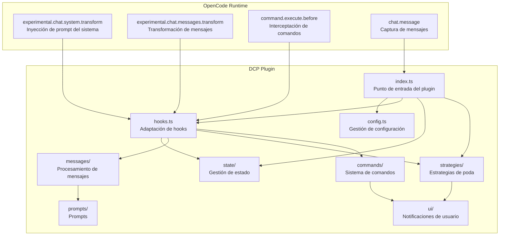
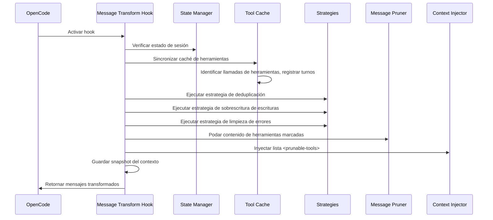
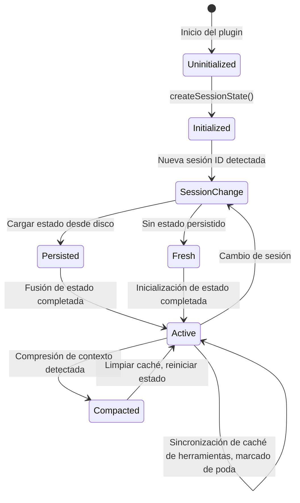
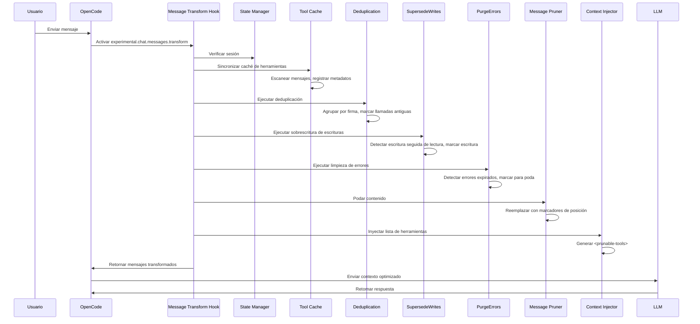
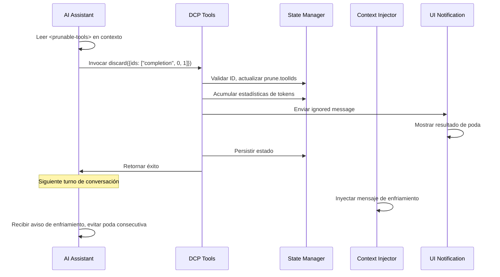

# Visión General de la Arquitectura: Funcionamiento Interno de DCP

## Lo que aprenderás

Esta sección no involucra operaciones, sino que te ayuda a comprender en profundidad el diseño interno de DCP. Después de completarla, podrás:
- Entender cómo DCP se integra con el flujo de conversación a través del sistema de hooks de OpenCode
- Dominar las responsabilidades y formas de interacción de cada módulo
- Comprender la cadena de llamadas completa desde la recepción de mensajes hasta la finalización de la poda
- Conocer las ideas de diseño de la gestión de estado, procesamiento de mensajes y estrategias de poda

## Idea Central

DCP es un plugin basado en el OpenCode Plugin SDK que extiende las capacidades de conversación de OpenCode mediante el registro de hooks y herramientas. Todo el sistema gira en torno al concepto central de "transformación de mensajes" (message transform): cada vez que la IA se prepara para responder al usuario, DCP escanea, analiza y poda el historial de conversación, y luego envía el contexto optimizado al LLM.

::: info ¿Por qué "transformación de mensajes"?

OpenCode proporciona el hook `experimental.chat.messages.transform`, que permite a los plugins modificar los mensajes antes de enviarlos al LLM. Esta es exactamente la capacidad que DCP necesita: eliminar llamadas de herramientas redundantes antes de que el LLM vea el contexto.

:::

El sistema adopta un diseño modular, con responsabilidades claras para cada módulo:
- **config**: Gestión de configuración, soporta sobrescritura multinivel
- **state**: Gestión de estado, mantiene el estado de ejecución a nivel de sesión
- **messages**: Procesamiento de mensajes, ejecuta operaciones reales de poda e inyección
- **strategies**: Estrategias de poda, define reglas de limpieza automática
- **commands**: Sistema de comandos, proporciona control manual y consultas estadísticas
- **hooks**: Adaptación de hooks, conecta OpenCode con los módulos DCP
- **ui**: Notificaciones de usuario, muestra resultados de poda e información estadística

## Diagrama de Arquitectura de Módulos



## Punto de Entrada e Inicialización del Plugin

El punto de entrada del plugin se define en `index.ts`, siendo el único punto de conexión entre DCP y la API de OpenCode Plugin.

### Flujo de Registro del Plugin

```typescript
const plugin: Plugin = (async (ctx) => {
    const config = getConfig(ctx)
    if (!config.enabled) {
        return {}
    }

    const logger = new Logger(config.debug)
    const state = createSessionState()

    return {
        "experimental.chat.system.transform": createSystemPromptHandler(...),
        "experimental.chat.messages.transform": createChatMessageTransformHandler(...),
        "chat.message": async (input, _output) => { /* Cachear variant */ },
        "command.execute.before": createCommandExecuteHandler(...),
        tool: {
            discard: createDiscardTool(...),
            extract: createExtractTool(...),
        },
        config: async (opencodeConfig) => { /* Modificar configuración de OpenCode */ },
    }
}) satisfies Plugin
```

**Fase de inicialización**:
1. Cargar configuración (soporta fusión multinivel: valores predeterminados → global → variables de entorno → proyecto)
2. Si el plugin está deshabilitado, retornar inmediatamente un objeto vacío
3. Crear sistema de logs y objeto de estado de sesión
4. Registrar cuatro hooks y dos herramientas

**Fase de modificación de configuración**:
- A través del hook `config`, agregar las herramientas `discard` y `extract` a `experimental.primary_tools`
- Registrar el comando `/dcp`

## Sistema de Hooks y Transformación de Mensajes

`hooks.ts` es responsable de convertir los eventos de hooks de OpenCode en llamadas a módulos internos de DCP. Esta es la capa de despacho central de DCP.

### Hook de Inyección de Prompt del Sistema

```typescript
createSystemPromptHandler(state, logger, config)
```

**Momento de invocación**: Cada vez que se construye el prompt del sistema

**Responsabilidades principales**:
1. Detectar sesiones de subagentes (si es subagente, omitir inyección)
2. Detectar agentes internos (como generador de resúmenes de conversación, omitir inyección)
3. Seleccionar la plantilla de prompt apropiada según la configuración:
   - Ambos discard y extract habilitados: `system/system-prompt-both`
   - Solo discard habilitado: `system/system-prompt-discard`
   - Solo extract habilitado: `system/system-prompt-extract`
4. Inyectar descripción de herramientas en el prompt del sistema

**¿Por qué se necesita la inyección de prompt del sistema?**

La IA necesita saber que puede usar las herramientas `discard` y `extract` para optimizar el contexto. Al describir el propósito de estas herramientas en el prompt del sistema, la IA puede decidir autónomamente cuándo invocarlas.

### Hook de Transformación de Mensajes

```typescript
createChatMessageTransformHandler(ctx.client, state, logger, config)
```

**Momento de invocación**: Cada vez que la IA se prepara para responder un mensaje (antes de enviarlo al LLM)

**Flujo de procesamiento**:



**Pasos centrales**:

1. **Verificación de sesión** (`checkSession`)
   - Detectar cambios en el ID de sesión
   - Si es una nueva sesión, cargar estado persistido desde disco
   - Detectar compresión de contexto (mecanismo summary de OpenCode), si se detecta compresión, limpiar caché de herramientas

2. **Sincronización de caché de herramientas** (`syncToolCache`)
   - Escanear llamadas de herramientas en todos los mensajes
   - Registrar `callID`, nombre de herramienta, parámetros, estado, número de turno de cada herramienta
   - Omitir herramientas protegidas y herramientas dentro del período de protección de turnos
   - Mantener `nudgeCounter` (contador de herramientas no podadas)

3. **Ejecutar estrategias automáticas**
   - `deduplicate`: Deduplicación, mantener la llamada más reciente
   - `supersedeWrites`: Limpiar operaciones de escritura sobrescritas por lecturas
   - `purgeErrors`: Limpiar entrada de herramientas con errores expirados

4. **Podar contenido** (`prune`)
   - Reemplazar `output` de herramientas marcadas con marcador de posición
   - Reemplazar `input` de herramientas con error con marcador de posición

5. **Inyectar lista de herramientas** (`insertPruneToolContext`)
   - Generar lista `<prunable-tools>` (contiene ID numérico, nombre de herramienta, resumen de parámetros)
   - Inyectar mensaje de recordatorio (nudge) según sea necesario
   - Si la última operación fue poda, inyectar mensaje de enfriamiento

6. **Guardar snapshot del contexto**
   - Guardar mensajes transformados en el directorio de logs para facilitar depuración

### Hook de Interceptación de Comandos

```typescript
createCommandExecuteHandler(ctx.client, state, logger, config, ctx.directory)
```

**Momento de invocación**: Cuando el usuario ejecuta un comando

**Responsabilidades principales**:
- Interceptar comandos que comienzan con `/dcp`
- Despachar al manejador de comando correspondiente:
  - `/dcp` → Mostrar ayuda
  - `/dcp context` → Mostrar análisis de uso de tokens
  - `/dcp stats` → Mostrar estadísticas acumuladas de poda
  - `/dcp sweep [n]` → Podar herramientas manualmente
- Prevenir que OpenCode ejecute el manejo de comando predeterminado lanzando errores especiales (`__DCP_*_HANDLED__`)

## Gestión de Estado

El módulo `state/` es responsable de mantener el estado de ejecución a nivel de sesión y la persistencia.

### Estructuras de Datos Centrales

**SessionState** (estado en memoria):
```typescript
{
    sessionId: string | null,           // ID de sesión actual
    isSubAgent: boolean,               // ¿Es sesión de subagente?
    prune: { toolIds: string[] },       // Lista de IDs de herramientas marcadas para poda
    stats: {
        pruneTokenCounter: number,      // Tokens podados en sesión actual
        totalPruneTokens: number,       // Tokens podados acumulados históricos
    },
    toolParameters: Map<string, ToolParameterEntry>,  // Caché de llamadas de herramientas
    nudgeCounter: number,               // Contador de herramientas no podadas (para activar recordatorios)
    lastToolPrune: boolean,             // ¿La última operación fue poda de herramienta?
    lastCompaction: number,             // Timestamp de última compresión de contexto
    currentTurn: number,                // Número de turno actual
    variant: string | undefined,       // Variante del modelo (ej. claude-3.5-sonnet)
}
```

**ToolParameterEntry** (metadatos de herramienta):
```typescript
{
    tool: string,                       // Nombre de herramienta
    parameters: any,                    // Parámetros de herramienta
    status: ToolStatus | undefined,     // Estado de ejecución
    error: string | undefined,          // Información de error
    turn: number,                       // Número de turno que creó esta llamada
}
```

### Ciclo de Vida del Estado



**Transiciones de estado clave**:

1. **Inicialización de sesión** (`ensureSessionInitialized`)
   - Detectar cambios en `sessionID`
   - Detectar si es subagente (a través de `session.parentID`)
   - Cargar `PersistedSessionState` desde disco
   - Inicializar contador de turnos y timestamp de compresión

2. **Manejo de compresión de contexto**
   - Detectar mensaje `summary` de OpenCode (`msg.info.summary === true`)
   - Limpiar caché de herramientas y lista de poda
   - Registrar timestamp de compresión para prevenir limpieza duplicada

3. **Persistencia**
   - Guardar asincrónicamente en `~/.local/share/opencode/storage/plugin/dcp/{sessionId}.json` después de completar operación de poda
   - Incluye nombre de sesión, lista de poda, datos estadísticos, última actualización


## Módulo de Procesamiento de Mensajes

El módulo `messages/` es responsable de las operaciones reales de poda e inyección.

### Operación de Poda (prune.ts)

**Función central**: `prune(state, logger, config, messages)`

**Tres subfunciones**:

1. **`pruneToolOutputs`**
   - Reemplazar `output` de herramientas marcadas con marcador de posición
   - Solo procesar herramientas con estado `completed`
   - Omitir herramienta `question` (manejo especial para herramientas de pregunta)

2. **`pruneToolInputs`**
   - Solo procesar herramienta `question`
   - Reemplazar campo `questions` con marcador de posición (mantener respuestas del usuario)

3. **`pruneToolErrors`**
   - Limpiar parámetros de entrada de herramientas con error
   - Mantener mensaje de error, solo eliminar entrada de cadena (parámetros potencialmente grandes)

**Diseño de marcadores de posición**:
```
[Output removed to save context - information superseded or no longer needed]
[input removed due to failed tool call]
[questions removed - see output for user's answers]
```

### Inyección de Contexto (inject.ts)

**Función central**: `insertPruneToolContext(state, config, logger, messages)`

**Flujo**:

1. **Generar lista de herramientas** (`buildPrunableToolsList`)
   - Recorrer caché de herramientas, excluir:
     - Herramientas ya podadas
     - Herramientas protegidas (`task`, `write`, `edit`, etc.)
     - Rutas de archivos protegidos (coinciden con `protectedFilePatterns`)
   - Generar descripción para cada herramienta: `{numericId}: {toolName}, {paramKey}`
   - Ejemplo: `3: read, src/config.ts`

2. **Envolver en etiqueta `<prunable-tools>`**
   ```html
   <prunable-tools>
   The following tools have been invoked and are available for pruning. This list does not mandate immediate action. Consider your current goals and resources you need before discarding valuable tool inputs or outputs. Consolidate your prunes for efficiency; it is rarely worth pruning a single tiny tool output. Keep your context free of noise.
   0: read, src/config.ts
   1: read, src/config.ts
   2: read, src/utils.ts
   </prunable-tools>
   ```

3. **Manejar estado de enfriamiento**
   - Si la última operación fue `discard` o `extract`, inyectar mensaje de enfriamiento:
   ```html
   <prunable-tools>
   Context management was just performed. Do not use discard or extract tools again. A fresh list will be available after your next tool use.
   </prunable-tools>
   ```

4. **Inyectar mensaje de recordatorio**
   - Si `nudgeCounter >= nudgeFrequency`, agregar texto de recordatorio
   - Formato de recordatorio: `"You have not used context pruning in a while. Consider using discard/extract tools to reduce token usage."`

5. **Seleccionar posición de inserción del mensaje**
   - Si el último mensaje es un mensaje de usuario, insertar mensaje de usuario sintético
   - De lo contrario, insertar mensaje de asistente sintético
   - Usar `variant` para asegurar compatibilidad del formato del mensaje con diferentes modelos

## Módulo de Estrategias de Poda

El módulo `strategies/` define reglas de limpieza automática.

### Estrategia de Deduplicación (deduplication.ts)

**Función central**: `deduplicate(state, logger, config, messages)`

**Algoritmo**:
1. Construir lista de todos los IDs de herramientas en orden cronológico
2. Calcular "firma" para cada herramienta: `tool::normalizedParameters`
   - Normalizar parámetros: eliminar `null`/`undefined`
   - Ordenar claves: asegurar que `{"b":1,"a":2}` y `{"a":2,"b":1}` generen la misma firma
3. Agrupar por firma
4. En cada grupo, mantener el último (más reciente), marcar otros para poda

**Ejemplo**:
```typescript
// Llamadas de herramientas originales
Tool Call 1: read({filePath: "src/config.ts"})
Tool Call 2: read({filePath: "src/config.ts"})
Tool Call 3: read({filePath: "src/utils.ts"})

// Agrupación por firma
Signature 1: "read::{\"filePath\":\"src/config.ts\"}" → [Tool Call 1, Tool Call 2]
Signature 2: "read::{\"filePath\":\"src/utils.ts\"}" → [Tool Call 3]

// Resultado de poda
Marcar para poda: [Tool Call 1]  // Mantener Tool Call 2 (más reciente)
Mantener: [Tool Call 2, Tool Call 3]
```

### Estrategia de Sobrescritura de Escrituras (supersede-writes.ts)

**Función central**: `supersedeWrites(state, logger, config, messages)`

**Algoritmo**:
1. Escanear todas las llamadas de herramientas en orden cronológico
2. Mantener tabla de seguimiento de archivos:
   ```typescript
   {
       "src/config.ts": {
           lastWrite: callId,
           lastWriteTime: timestamp,
           lastRead: callId,
           lastReadTime: timestamp,
       }
   }
   ```
3. Detectar patrón:
   - Si `lastWriteTime < lastReadTime` del archivo, significa que la operación de escritura fue sobrescrita por lectura
   - Marcar `input` de esa operación de escritura para poda

**Escenario**:
```typescript
// Línea de tiempo
Turn 1: write({filePath: "src/config.ts", content: "..."})  // lastWrite = call1
Turn 2: read({filePath: "src/config.ts"})                 // lastRead = call2 (sobrescribió escritura)
Turn 3: read({filePath: "src/config.ts"})                 // Mantener lectura más reciente

// Resultado de poda
Marcar para poda: [Llamada write del Turn 1]
```

### Estrategia de Limpieza de Errores (purge-errors.ts)

**Función central**: `purgeErrors(state, logger, config, messages)`

**Algoritmo**:
1. Escanear todas las herramientas con estado `error`
2. Verificar diferencia entre número de turno actual y turno de creación de herramienta
3. Si diferencia > `strategies.purgeErrors.turns` (predeterminado 4), marcar para poda

**Mecanismo de protección**:
- Mensaje de error se mantiene (`part.state.error`)
- Solo eliminar parámetros de entrada (`part.state.input`), porque entrada de error puede ser grande

**Escenario**:
```typescript
Turn 1: read({filePath: "nonexistent.txt"}) → error
Turn 2-5: Otras operaciones
Turn 6: Usuario continúa conversación

// Si purgeErrors.turns = 4
// Turn 6 - Turn 1 = 5 > 4
// Marcar entrada de error del Turn 1 para poda
```

### Herramientas Impulsadas por LLM (tools.ts)

**Herramienta Discard**:
```typescript
{
    name: "discard",
    description: "Remove completed task or noise tool outputs",
    parameters: {
        ids: ["completion", 0, 1, 2]  // Primer elemento es razón: 'completion' o 'noise'
    }
}
```

**Herramienta Extract**:
```typescript
{
    name: "extract",
    description: "Extract key findings then remove original tool outputs",
    parameters: {
        ids: [0, 1, 2],
        distillation: ["key finding 1", "key finding 2", "key finding 3"]
    }
}
```

**Flujo de procesamiento**:
1. IA invoca herramienta, proporciona lista de IDs numéricos
2. Mapear IDs numéricos de vuelta a `callID` reales
3. Validar que herramienta no esté en lista de protección
4. Actualizar `prune.toolIds`
5. Mostrar resultado de poda a través de `ignored message`
6. Persistir estado


## Sistema de Comandos

El módulo `commands/` proporciona control manual y consultas estadísticas.

### Comando Context

```bash
/dcp context
```

**Salida**: Análisis de uso de tokens (gráfico de barras)
```
╭───────────────────────────────────────────────────────────╮
│                  Análisis de Contexto DCP                 │
╰───────────────────────────────────────────────────────────╯

Desglose del Contexto de Sesión:
───────────────────────────────────────────────────────────

System         15.2% │████████████████▒▒▒▒▒▒▒▒▒▒▒▒▒▒▒▒▒▒▒▒▒▒▒│  25.1K tokens
User            5.1% │████▒▒▒▒▒▒▒▒▒▒▒▒▒▒▒▒▒▒▒▒▒▒▒▒▒▒▒▒▒▒▒▒▒▒▒▒▒▒│   8.4K tokens
Assistant       35.8% │██████████████████████████████████████▒▒▒▒▒▒│  59.2K tokens
Tools (45)      43.9% │████████████████████████████████████████████████│  72.6K tokens

───────────────────────────────────────────────────────────

Resumen:
  Podado:          12 herramientas (~15.2K tokens)
  Contexto actual: ~165.3K tokens
  Sin DCP:         ~180.5K tokens
```

**Lógica de cálculo**:
- System: `firstAssistant.input + cache.read - tokenizer(firstUserMessage)`
- User: `tokenizer(all user messages)`
- Tools: `tokenizer(toolInputs + toolOutputs) - prunedTokens`
- Assistant: cálculo residual

### Comando Stats

```bash
/dcp stats
```

**Salida**: Estadísticas acumuladas de poda
```
╭───────────────────────────────────────────────────────────╮
│                    Estadísticas DCP                       │
╰───────────────────────────────────────────────────────────╯

Poda de Sesión:
  Herramientas podadas: 12
  Tokens ahorrados: ~15.2K
  Última poda:   discard (hace 2 turnos)

Estadísticas de Vida Útil:
  Total de tokens ahorrados: ~145.8K
```

### Comando Sweep

```bash
/dcp sweep [n]
```

**Dos modos**:
1. Predeterminado: podar todas las herramientas después del último mensaje del usuario
2. Especificado: `/dcp sweep 5`, podar las últimas 5 herramientas

**Flujo de procesamiento**:
1. Encontrar posición del último mensaje del usuario
2. Extraer llamadas de herramientas subsiguientes
3. Filtrar herramientas protegidas y archivos protegidos
4. Marcar para poda
5. Mostrar resultados y ahorro de tokens

## Sistema de Configuración

`config.ts` es responsable de la carga y validación de configuración.

### Prioridad de Configuración

```
Predeterminado (1) < Global (2) < Variables de entorno (3) < Proyecto (4)
```

**Rutas de configuración**:
- Global: `~/.config/opencode/dcp.jsonc`
- Variables de entorno: `$OPENCODE_CONFIG_DIR/dcp.jsonc`
- Proyecto: `<project>/.opencode/dcp.jsonc`

### Flujo de Fusión de Configuración

```typescript
const defaultConfig = { /* valores predeterminados codificados */ }
const globalConfig = loadConfig(globalPath) || {}
const envConfig = loadConfig(envPath) || {}
const projectConfig = loadConfig(projectPath) || {}

const finalConfig = {
    ...defaultConfig,
    ...globalConfig,
    ...envConfig,
    ...projectConfig,
}
```

### Mecanismo de Validación

- Usa Zod Schema para definir estructura de configuración
- Si la configuración es inválida, usa Toast para advertir y degradar a valores predeterminados
- Crea automáticamente configuración predeterminada cuando el archivo de configuración no existe

## Relaciones de Dependencia de Módulos

| Módulo | Responsabilidad | Depende de | Dependido por |
| --- | --- | --- | --- |
| config | Gestión de configuración | - | index, hooks, strategies, commands |
| hooks | Adaptación de hooks | config, state, logger, messages, strategies, commands | index |
| state | Gestión de estado | logger | index, hooks, strategies |
| messages | Procesamiento de mensajes | state, logger, prompts, ui, protected-file-patterns | hooks |
| strategies | Estrategias de poda | state, logger, messages, ui, protected-file-patterns | hooks |
| commands | Manejo de comandos | state, logger, messages, ui, strategies | hooks |
| ui | Notificaciones de usuario | state, logger, prompts | strategies, commands |
| prompts | Gestión de prompts | - | hooks, messages, strategies |
| logger | Sistema de logs | - | index, config, hooks, strategies, state, ui, commands |

## Cadena de Llamadas Completa

### Flujo de Poda Automática



### Flujo de Poda Impulsada por LLM



## Consideraciones de Rendimiento

### Límites de Caché de Herramientas

- Capacidad máxima: 1000 entradas (`MAX_TOOL_CACHE_SIZE`)
- Estrategia de limpieza: FIFO (primero en entrar, primero en salir)
- Condición de activación: verificar tamaño después de cada sincronización

### Sistema de Logs

- Logs de depuración: `~/.config/opencode/logs/dcp/daily/YYYY-MM-DD.log`
- Snapshots de contexto: `~/.config/opencode/logs/dcp/context/{sessionId}/`
- Nivel de log: configurable (`config.debug`)

### Detección de Subagentes

- Método de detección: si existe `session.parentID`
- Estrategia de manejo: omitir todas las operaciones de poda (evitar poda duplicada)


## Resumen de la Lección

El diseño de arquitectura de DCP gira en torno al concepto central de "transformación de mensajes", integrándose perfectamente con el flujo de conversación a través del sistema de hooks de OpenCode. El sistema adopta un diseño modular con responsabilidades claras para cada módulo:

- **Punto de entrada del plugin** (`index.ts`) es responsable de registrar hooks y herramientas
- **Sistema de hooks** (`hooks.ts`) es responsable del despacho de eventos y la programación
- **Gestión de estado** (`state/`) es responsable del estado a nivel de sesión y la persistencia
- **Procesamiento de mensajes** (`messages/`) es responsable de la poda e inyección reales
- **Estrategias de poda** (`strategies/`) definen reglas de limpieza automática
- **Sistema de comandos** (`commands/`) proporciona control manual
- **Sistema de configuración** (`config.ts`) soporta configuración multinivel

Todo el flujo se completa en el hook `experimental.chat.messages.transform`: sincronización de caché de herramientas → ejecución de estrategias automáticas → poda de contenido → inyección de lista de herramientas. Este diseño asegura que DCP complete la optimización antes de que el LLM vea el contexto, mientras mantiene la mantenibilidad y extensibilidad del plugin.

---

## Apéndice: Referencia del Código Fuente

<details>
<summary><strong>Haz clic para expandir y ver las ubicaciones del código fuente</strong></summary>

> Fecha de actualización: 2026-01-23

| Funcionalidad | Ruta del archivo | Líneas |
| --- | --- | --- |
| Punto de entrada del plugin y registro de hooks | [`index.ts`](https://github.com/Opencode-DCP/opencode-dynamic-context-pruning/blob/main/index.ts) | 12-102 |
| Hook de inyección de prompt del sistema | [`lib/hooks.ts`](https://github.com/Opencode-DCP/opencode-dynamic-context-pruning/blob/main/lib/hooks.ts) | 20-53 |
| Hook de transformación de mensajes | [`lib/hooks.ts`](https://github.com/Opencode-DCP/opencode-dynamic-context-pruning/blob/main/lib/hooks.ts) | 55-82 |
| Hook de interceptación de comandos | [`lib/hooks.ts`](https://github.com/Opencode-DCP/opencode-dynamic-context-pruning/blob/main/lib/hooks.ts) | 84-156 |
| Gestión de estado de sesión | [`lib/state/state.ts`](https://github.com/Opencode-DCP/opencode-dynamic-context-pruning/blob/main/lib/state/state.ts) | 7-143 |
| Sincronización de caché de herramientas | [`lib/state/tool-cache.ts`](https://github.com/Opencode-DCP/opencode-dynamic-context-pruning/blob/main/lib/state/tool-cache.ts) | 11-86 |
| Persistencia de estado | [`lib/state/persistence.ts`](https://github.com/Opencode-DCP/opencode-dynamic-context-pruning/blob/main/lib/state/persistence.ts) | - |
| Poda de mensajes | [`lib/messages/prune.ts`](https://github.com/Opencode-DCP/opencode-dynamic-context-pruning/blob/main/lib/messages/prune.ts) | 11-106 |
| Inyección de contexto | [`lib/messages/inject.ts`](https://github.com/Opencode-DCP/opencode-dynamic-context-pruning/blob/main/lib/messages/inject.ts) | 102-157 |
| Estrategia de deduplicación | [`lib/strategies/deduplication.ts`](https://github.com/Opencode-DCP/opencode-dynamic-context-pruning/blob/main/lib/strategies/deduplication.ts) | 13-83 |
| Estrategia de sobrescritura de escrituras | [`lib/strategies/supersede-writes.ts`](https://github.com/Opencode-DCP/opencode-dynamic-context-pruning/blob/main/lib/strategies/supersede-writes.ts) | - |
| Estrategia de limpieza de errores | [`lib/strategies/purge-errors.ts`](https://github.com/Opencode-DCP/opencode-dynamic-context-pruning/blob/main/lib/strategies/purge-errors.ts) | - |
| Herramientas impulsadas por LLM | [`lib/strategies/tools.ts`](https://github.com/Opencode-DCP/opencode-dynamic-context-pruning/blob/main/lib/strategies/tools.ts) | - |
| Comando Context | [`lib/commands/context.ts`](https://github.com/Opencode-DCP/opencode-dynamic-context-pruning/blob/main/lib/commands/context.ts) | - |
| Comando Stats | [`lib/commands/stats.ts`](https://github.com/Opencode-DCP/opencode-dynamic-context-pruning/blob/main/lib/commands/stats.ts) | - |
| Comando Sweep | [`lib/commands/sweep.ts`](https://github.com/Opencode-DCP/opencode-dynamic-context-pruning/blob/main/lib/commands/sweep.ts) | - |
| Gestión de configuración | [`lib/config.ts`](https://github.com/Opencode-DCP/opencode-dynamic-context-pruning/blob/main/lib/config.ts) | - |
| Sistema de logs | [`lib/logger.ts`](https://github.com/Opencode-DCP/opencode-dynamic-context-pruning/blob/main/lib/logger.ts) | - |

**Constantes clave**:
- `MAX_TOOL_CACHE_SIZE = 1000`: Capacidad máxima de caché de herramientas, previene crecimiento ilimitado de memoria (`lib/state/tool-cache.ts:6`)

**Funciones clave**:
- `createSystemPromptHandler()`: Crea hook de inyección de prompt del sistema, responsable de explicar a la IA las herramientas de poda disponibles (`lib/hooks.ts:20-53`)
- `createChatMessageTransformHandler()`: Crea hook de transformación de mensajes, es el despachador central de DCP, coordina gestión de estado, ejecución de estrategias, poda de mensajes e inyección de contexto (`lib/hooks.ts:55-82`)
- `syncToolCache()`: Sincroniza caché de parámetros de herramientas, registra metadatos de cada llamada de herramienta (callID, parámetros, estado, número de turno), usado para estrategias de poda subsiguientes (`lib/state/tool-cache.ts:11-86`)
- `deduplicate()`: Estrategia de deduplicación, identifica llamadas de herramientas duplicadas mediante coincidencia de firma, mantiene la más reciente (`lib/strategies/deduplication.ts:13-83`)
- `supersedeWrites()`: Estrategia de sobrescritura de escrituras, limpia entrada de operaciones de escritura sobrescritas por lecturas subsiguientes (`lib/strategies/supersede-writes.ts`)
- `purgeErrors()`: Estrategia de limpieza de errores, limpia parámetros de entrada de herramientas con errores expirados (`lib/strategies/purge-errors.ts`)
- `prune()`: Función principal de poda de mensajes, invoca tres subfunciones para podar salida de herramientas, entrada de herramientas y entrada de errores respectivamente (`lib/messages/prune.ts:11-20`)
- `insertPruneToolContext()`: Inyecta lista `<prunable-tools>` en el contexto, proporcionada a la IA para identificar herramientas podables (`lib/messages/inject.ts:102-157`)
- `createDiscardTool()`: Crea especificación de herramienta discard, permite a la IA eliminar salidas de herramientas de tareas completadas o ruido (`lib/strategies/tools.ts`)
- `createExtractTool()`: Crea especificación de herramienta extract, permite a la IA extraer hallazgos clave y luego eliminar salidas de herramientas originales (`lib/strategies/tools.ts`)
- `createSessionState()`: Crea nuevo objeto de estado de sesión, inicializa todos los campos de estado (`lib/state/state.ts:42-60`)
- `ensureSessionInitialized()`: Asegura inicialización de sesión, maneja cambio de sesión, detección de subagente, carga de estado (`lib/state/state.ts:80-116`)

**Estructuras de datos clave**:
- `SessionState`: Estado de ejecución a nivel de sesión, contiene sessionId, lista de poda, datos estadísticos, caché de herramientas, contador de turnos, etc. (`lib/state/types.ts:27-38`)
- `ToolParameterEntry`: Caché de metadatos de una sola llamada de herramienta, contiene nombre de herramienta, parámetros, estado, información de error, número de turno (`lib/state/types.ts:10-16`)
- `Prune`: Estado de poda, registra lista de IDs de llamadas de herramientas marcadas para poda (`lib/state/types.ts:23-25`)
- `SessionStats`: Datos estadísticos de sesión, contiene número de tokens podados en sesión actual y número de tokens podados acumulados históricos (`lib/state/types.ts:18-21`)

**Definiciones de tipos clave**:
- `ToolStatus`: Enumeración de estado de ejecución de herramienta, incluye pending (esperando ejecución), running (en ejecución), completed (completado), error (fallido) (`lib/state/types.ts:8`)

</details>

---

## Avance de la Próxima Lección

> En la próxima lección aprenderemos **[Principios del Cálculo de Tokens](../token-calculation/)**.
>
> Aprenderás:
> - Cómo DCP calcula con precisión el uso de tokens
> - Métodos de cálculo para diferentes tipos de mensajes (System, User, Assistant, Tools)
> - Mecanismo de acumulación de estadísticas de ahorro de tokens
> - Cómo depurar problemas de cálculo de tokens
