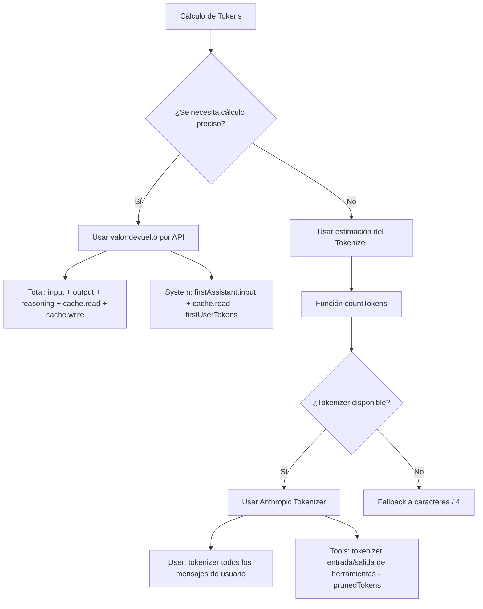

# Principios del Cálculo de Tokens

## Lo que aprenderás

- Entender la estrategia de cálculo de tokens de DCP (valores API vs estimaciones)
- Interpretar la distribución de tokens en la salida de `/dcp context`
- Conocer el margen de error de las estimaciones de tokens y métodos de optimización
- Evaluar con precisión el efecto de ahorro de DCP

## Tu situación actual

Estás mirando la salida de `/dcp context`, un montón de números y porcentajes, pero no sabes cómo se calculan:

```
Session Context Breakdown:
─────────────────────────────────────────────────────────

System         15.2% │████████████████▒▒▒▒▒▒▒▒▒▒▒▒▒▒▒▒▒▒▒▒▒│  25.1K tokens
User            5.1% │████▒▒▒▒▒▒▒▒▒▒▒▒▒▒▒▒▒▒▒▒▒▒▒▒▒▒▒▒▒▒▒▒▒▒▒▒▒▒▒▒▒│   8.4K tokens
Assistant       35.8% │██████████████████████████████████████▒▒▒▒▒▒│  59.2K tokens
Tools (45)      43.9% │████████████████████████████████████████████████│  72.6K tokens
─────────────────────────────────────────────────────────

Summary:
  Pruned:          12 tools (~15.2K tokens)
  Current context: ~165.3K tokens
  Without DCP:     ~180.5K tokens
```

¿De dónde vienen estos números? ¿Por qué Assistant se calcula como "residuo"? ¿Cómo se calculan los prunedTokens?

## Cuándo usar esto

- Cuando quieras evaluar con precisión el efecto de ahorro de DCP
- Cuando necesites analizar la estructura de consumo de tokens (qué parte consume más)
- Cuando sospeches que hay errores en el cálculo de tokens y quieras verificar la precisión
- Cuando necesites reportar los resultados de optimización de DCP a tu equipo

## Concepto central

El cálculo de tokens de DCP utiliza una **estrategia híbrida**: **prioriza los valores precisos devueltos por la API, y usa estimaciones cuando es necesario**.



**Principios clave**:
1. **Prioridad a valores API**: Total y System usan valores precisos devueltos por la API
2. **Estimaciones complementarias**: User y Tools usan estimaciones del tokenizer (porque la API no proporciona estos valores)
3. **Cálculo residual**: Assistant se calcula mediante Total - System - User - Tools

---

## Estrategia de Cálculo de Tokens

### Valores precisos devueltos por la API

La API de OpenCode devuelve estadísticas precisas de tokens para cada respuesta de IA:

| Campo | Descripción | Fuente |
| --- | --- | --- |
| `tokens.input` | Número de tokens de entrada de esta solicitud | Valor preciso de API |
| `tokens.output` | Número de tokens de salida generados en esta solicitud | Valor preciso de API |
| `tokens.reasoning` | Número de tokens de razonamiento (como cadena de pensamiento de Claude 3.5) | Valor preciso de API (si aplica) |
| `tokens.cache.read` | Número de tokens leídos de caché | Valor preciso de API |
| `tokens.cache.write` | Número de tokens escritos en caché | Valor preciso de API |

**Estos valores son precisos** porque provienen directamente del sistema de facturación del proveedor de LLM.

### Método de cálculo de estimaciones

Para valores que la API no proporciona (como mensajes de usuario, llamadas de herramientas), DCP usa el **Anthropic Tokenizer** para estimar.

**Código de implementación** (`lib/strategies/utils.ts:36-43`):

```typescript
export function countTokens(text: string): number {
    if (!text) return 0
    try {
        // Priorizar uso de Anthropic Tokenizer
        return anthropicCountTokens(text)
    } catch {
        // Fallback a caracteres / 4 en caso de fallo
        return Math.round(text.length / 4)
    }
}
```

**¿Por qué usar caracteres/4 como respaldo?**:
- La proporción promedio de tokens en texto en inglés es aproximadamente 4 caracteres = 1 token
- Esta es solo una estimación aproximada, puede haber errores
- Solo se usa cuando el Tokenizer no está disponible (como problemas de red, fallo al cargar la biblioteca)

---

## Lógica de Cálculo de Tokens por Categoría

### Total (Número total de tokens)

**Fórmula de cálculo**:

```typescript
total = input + output + reasoning + cache.read + cache.write
```

**Código de implementación** (`lib/commands/context.ts:103-108`):

```typescript
const apiInput = lastAssistant?.tokens?.input || 0
const apiOutput = lastAssistant?.tokens?.output || 0
const apiReasoning = lastAssistant?.tokens?.reasoning || 0
const apiCacheRead = lastAssistant?.tokens?.cache?.read || 0
const apiCacheWrite = lastAssistant?.tokens?.cache?.write || 0
breakdown.total = apiInput + apiOutput + apiReasoning + apiCacheRead + apiCacheWrite
```

**Explicación**:
- Usa las estadísticas de tokens de la última respuesta del Assistant
- Incluye todos los valores devueltos por la API
- Coincide con el número total de tokens mostrado en la UI de OpenCode

### System (Tokens del prompt del sistema)

**Fórmula de cálculo**:

```typescript
system = firstAssistant.input + firstAssistant.cache.read - firstUserTokens
```

**Código de implementación** (`lib/commands/context.ts:161-165`):

```typescript
if (firstAssistant) {
    const firstInput =
        (firstAssistant.tokens?.input || 0) + (firstAssistant.tokens?.cache?.read || 0)
    breakdown.system = Math.max(0, firstInput - firstUserTokens)
}
```

**Principio**:
1. **El input de la primera respuesta del Assistant** incluye: prompt del sistema + primer mensaje del usuario
2. **Restar los tokens del primer mensaje del usuario** (estimados con tokenizer), obtenemos los tokens puros del prompt del sistema
3. **Sumar cache.read** (la lectura de caché también cuenta como tokens del sistema)

::: info ¿Por qué es un cálculo residual?
La API no proporciona directamente el número de tokens del "prompt del sistema", solo se puede inferir mediante "input de la primera respuesta - primer mensaje del usuario". Este es el método de estimación estándar.
:::

### User (Tokens de mensajes del usuario)

**Fórmula de cálculo**:

```typescript
user = tokenizer(all user messages)
```

**Código de implementación** (`lib/commands/context.ts:110-157`):

```typescript
const userTextParts: string[] = []

for (const msg of messages) {
    if (isMessageCompacted(state, msg)) continue
    if (msg.info.role === "user" && isIgnoredUserMessage(msg)) continue

    const parts = Array.isArray(msg.parts) ? msg.parts : []
    for (const part of parts) {
        if (part.type === "text" && msg.info.role === "user") {
            const textPart = part as TextPart
            const text = textPart.text || ""
            userTextParts.push(text)
        }
    }
}

breakdown.user = countTokens(userTextParts.join("\n"))
```

**Explicación**:
- Usa el tokenizer para calcular los tokens de todos los mensajes del usuario
- Omite mensajes que han sido compactados (`isMessageCompacted`)
- Omite mensajes ignorados (mensajes internos del sistema)

### Tools (Tokens de llamadas de herramientas)

**Fórmula de cálculo**:

```typescript
tools = tokenizer(toolInputs + toolOutputs) - prunedTokens
```

**Código de implementación** (`lib/commands/context.ts:110-167`):

```typescript
const toolInputParts: string[] = []
const toolOutputParts: string[] = []

for (const msg of messages) {
    if (isMessageCompacted(state, msg)) continue

    const parts = Array.isArray(msg.parts) ? msg.parts : []
    for (const part of parts) {
        if (part.type === "tool") {
            const toolPart = part as ToolPart
            breakdown.toolCount++

            // Extraer entrada de herramienta
            if (toolPart.state?.input) {
                const inputStr =
                    typeof toolPart.state.input === "string"
                        ? toolPart.state.input
                        : JSON.stringify(toolPart.state.input)
                toolInputParts.push(inputStr)
            }

            // Extraer salida de herramienta (solo estados completados)
            if (toolPart.state?.status === "completed" && toolPart.state?.output) {
                const outputStr =
                    typeof toolPart.state.output === "string"
                        ? toolPart.state.output
                        : JSON.stringify(toolPart.state.output)
                toolOutputParts.push(outputStr)
            }
        }
    }
}

const toolInputTokens = countTokens(toolInputParts.join("\n"))
const toolOutputTokens = countTokens(toolOutputParts.join("\n"))
breakdown.tools = Math.max(0, toolInputTokens + toolOutputTokens - breakdown.prunedTokens)
```

**Explicación**:
- Calcula los tokens de entrada y salida de todas las herramientas
- Resta los tokens de herramientas podadas (`prunedTokens`)
- Solo cuenta la salida de herramientas con `status === "completed"`

### Assistant (Tokens de mensajes del asistente)

**Fórmula de cálculo**:

```typescript
assistant = total - system - user - tools
```

**Código de implementación** (`lib/commands/context.ts:168-171`):

```typescript
breakdown.assistant = Math.max(
    0,
    breakdown.total - breakdown.system - breakdown.user - breakdown.tools,
)
```

**Principio**:
- Assistant es un **cálculo residual** (Residual Calculation)
- Restando System, User y Tools del Total, lo que queda es Assistant

::: info ¿Por qué Assistant incluye tokens de razonamiento?
Si el modelo persiste los tokens de razonamiento (reasoning) en el contexto, pertenecen al "contenido generado por el Assistant", por lo que se clasifican en la categoría Assistant. Esto es razonable, ya que el razonamiento es el asistente "pensando".
:::

---

## Cálculo del Ahorro de Tokens

### Cálculo de prunedTokens

**Firma de función** (`lib/strategies/utils.ts:49-94`):

```typescript
export const calculateTokensSaved = (
    state: SessionState,
    messages: WithParts[],
    pruneToolIds: string[],
): number
```

**Lógica de cálculo**:

1. Recorrer todos los mensajes
2. Encontrar herramientas podadas (coincidiendo `pruneToolIds` con `part.callID`)
3. Extraer el contenido de entrada y salida de la herramienta
4. Usar `countTokens` para calcular el número de tokens
5. Acumular los tokens de todas las herramientas podadas

**Código de implementación**:

```typescript
export const calculateTokensSaved = (
    state: SessionState,
    messages: WithParts[],
    pruneToolIds: string[],
): number => {
    try {
        const contents: string[] = []
        for (const msg of messages) {
            if (isMessageCompacted(state, msg)) {
                continue
            }
            const parts = Array.isArray(msg.parts) ? msg.parts : []
            for (const part of parts) {
                if (part.type !== "tool" || !pruneToolIds.includes(part.callID)) {
                    continue
                }
                // Manejar caso especial de herramienta question
                if (part.tool === "question") {
                    const questions = part.state.input?.questions
                    if (questions !== undefined) {
                        const content =
                            typeof questions === "string" ? questions : JSON.stringify(questions)
                        contents.push(content)
                    }
                    continue
                }
                // Extraer salida de herramientas completadas
                if (part.state.status === "completed") {
                    const content =
                        typeof part.state.output === "string"
                            ? part.state.output
                            : JSON.stringify(part.state.output)
                    contents.push(content)
                } else if (part.state.status === "error") {
                    // Extraer mensaje de error de herramientas con error
                    const content =
                        typeof part.state.error === "string"
                            ? part.state.error
                            : JSON.stringify(part.state.error)
                    contents.push(content)
                }
            }
        }
        const tokenCounts: number[] = estimateTokensBatch(contents)
        return tokenCounts.reduce((sum, count) => sum + count, 0)
    } catch (error: any) {
        return 0
    }
}
```

**Explicación**:
- Solo calcula los tokens de herramientas podadas
- Para herramientas completadas, calcula su salida
- Para herramientas con error, calcula su mensaje de error
- Si el cálculo falla (excepción), devuelve 0

---

## Margen de Error en el Cálculo de Tokens

### Fuentes de error en estimaciones

| Categoría | Precisión | Fuente de error | Impacto |
| --- | --- | --- | --- |
| Total | 100% | Valor preciso de API, sin error | Ninguno |
| System | 95-98% | Ligero error en la estimación de tokens del primer mensaje del usuario | Muy pequeño |
| User | 90-95% | Diferencias entre el tokenizer y la tokenización real del modelo | Medio |
| Tools | 90-95% | Tokenizer + impacto del formato de serialización de parámetros de herramientas | Medio |
| Assistant | 90-95% | Propagación de errores de User y Tools | Medio |

### Control de errores

**DCP utiliza varios métodos para controlar errores**:

1. **Uso de Anthropic Tokenizer**:
   - Más cercano a la lógica de tokenización real de Claude
   - Para OpenAI, Gemini, puede haber ligeras diferencias

2. **Omitir mensajes internos del sistema**:
   - `isIgnoredUserMessage` filtra mensajes internos de OpenCode
   - Evita calcular tokens irrelevantes

3. **Math.max(0, ...)**:
   - Asegura que el resultado no sea negativo
   - Previene situaciones anómalas

::: tip Observación de errores reales
En pruebas, la diferencia entre la estimación de tokens de DCP y lo mostrado en la UI de OpenCode suele estar dentro de ±5%. Para estimar el efecto de ahorro de tokens, esta precisión es suficiente.
:::

---

## Interpretación de la Salida de /dcp context

### Gráfico de distribución de tokens

```
System         15.2% │████████████████▒▒▒▒▒▒▒▒▒▒▒▒▒▒▒▒▒▒▒▒▒│  25.1K tokens
User            5.1% │████▒▒▒▒▒▒▒▒▒▒▒▒▒▒▒▒▒▒▒▒▒▒▒▒▒▒▒▒▒▒▒▒▒▒▒▒▒▒▒▒▒│   8.4K tokens
Assistant       35.8% │██████████████████████████████████████▒▒▒▒▒▒│  59.2K tokens
Tools (45)      43.9% │████████████████████████████████████████████████│  72.6K tokens
```

**Significado de cada elemento**:

| Elemento | Descripción | Rango normal de porcentaje |
| --- | --- | --- |
| System | Tokens del prompt del sistema | 10-20% |
| User | Tokens de todos los mensajes del usuario | 3-8% |
| Assistant | Salida de texto del asistente + tokens de razonamiento | 30-40% |
| Tools (n) | Tokens de llamadas de herramientas (n = número de herramientas en contexto) | 40-50% |

### Interpretación del Summary

```
Summary:
  Pruned:          12 tools (~15.2K tokens)
  Current context: ~165.3K tokens
  Without DCP:     ~180.5K tokens
```

**Significado de cada elemento**:

| Elemento | Método de cálculo | Descripción |
| --- | --- | --- |
| Pruned | `state.prune.toolIds.length` herramientas + `prunedTokens` | Número de herramientas podadas y tokens ahorrados |
| Current context | `breakdown.total` (valor preciso de API) | Número real de tokens del contexto actual |
| Without DCP | `total + prunedTokens` | Número teórico de tokens sin DCP |

**Cálculo de tasa de ahorro**:

```
Tasa de ahorro = prunedTokens / Without DCP
              = 15.2K / 180.5K
              ≈ 8.4%
```

::: tip Referencia de tasas de ahorro
- Uso ligero: 5-10% (lectura ocasional de archivos repetidos)
- Uso moderado: 10-20% (deduplicación frecuente, poda de escrituras sobrescritas)
- Uso intensivo: 20-30% (muchas llamadas de herramientas, poda activa por IA)
:::

---

## Práctica: Análisis de Distribución de Tokens

### Escenario 1: Demasiadas llamadas de herramientas

**Problema**: `Tools` supera el 60%, el contexto es muy grande.

```
Tools (120)     65.2% │████████████████████████████████████████████████│  120.5K tokens
```

**Posibles causas**:
- Se llamaron muchas herramientas en la conversación (como múltiples lecturas de archivos, búsquedas)
- El contenido de salida de las herramientas es muy grande (como leer archivos largos)

**Sugerencias de optimización**:
- Activar **estrategia de deduplicación** (`strategies.deduplication.enabled: true`)
- Activar **estrategia de sobrescritura de escrituras** (`strategies.supersedeWrites.enabled: true`)
- Usar `/dcp sweep` para limpiar manualmente herramientas antiguas

### Escenario 2: Porcentaje de Assistant demasiado alto

**Problema**: `Assistant` supera el 50%, posiblemente tokens de razonamiento.

```
Assistant       52.3% │██████████████████████████████████████████████▒▒▒▒▒▒│  95.2K tokens
```

**Posibles causas**:
- Se está usando un modelo con razonamiento (como Claude 3.5)
- El asistente generó mucho texto

**Sugerencias de optimización**:
- Los tokens de razonamiento no se pueden podar (pertenecen al contenido generado por el Assistant)
- Se puede reducir acortando la salida del asistente (hacer que la IA sea más concisa)
- Verificar si hay llamadas de herramientas redundantes (mediante poda por deduplicación)

### Escenario 3: Tasa de ahorro baja

**Problema**: `Pruned` es muy pequeño, tasa de ahorro < 5%.

```
Summary:
  Pruned:          2 tools (~1.2K tokens)
  Current context: ~165.3K tokens
  Without DCP:     ~166.5K tokens
```

**Posibles causas**:
- Pocas llamadas de herramientas repetidas en la conversación
- No se activaron las estrategias automáticas (deduplicación, sobrescritura de escrituras, limpieza de errores)
- La IA no llamó activamente a las herramientas `discard`/`extract`

**Sugerencias de optimización**:
- Activar todas las estrategias automáticas:
  ```jsonc
  {
    "strategies": {
      "deduplication": { "enabled": true },
      "supersedeWrites": { "enabled": true },
      "purgeErrors": { "enabled": true }
    }
  }
  ```
- Activar **función de recordatorio** (`tools.settings.nudgeEnabled: true`), para que la IA pode activamente

---

## Errores Comunes

### ❌ Error 1: Esperar 100% de precisión

**Problema**: Esperar que el cálculo de tokens coincida exactamente con la factura de la API.

**Realidad**: El cálculo de DCP es una **estimación**, con un error de ±5%.

**Solución**:
- Usar las estadísticas de DCP como **referencia relativa** (como tasa de ahorro)
- No usar para auditoría precisa de facturación
- La factura de la API es el único registro preciso de consumo

### ❌ Error 2: Ignorar tokens de razonamiento

**Problema**: Los tokens de razonamiento se clasifican en Assistant, pero el usuario piensa que se omitieron.

**Realidad**: Los tokens de razonamiento son parte de lo generado por el Assistant, la clasificación es correcta.

**Solución**:
- Los tokens de razonamiento no se pueden podar (no pertenecen a ninguna herramienta)
- Si los tokens de razonamiento son demasiado altos (> 30%), puedes intentar:
  - Usar un modelo sin razonamiento
  - Simplificar la tarea, reducir la necesidad de razonamiento

### ❌ Error 3: Los tokens de caché no cuentan en Total

**Problema**: Pensar que `cache.read` no cuenta en `Total`, causando malentendidos.

**Realidad**: `cache.read` sí cuenta en `Total`, pero no genera costos reales (porque ya está en caché).

**Solución**:
- `Total` es el **tamaño del contexto**, no el **costo real**
- Los tokens con hit de caché aún ocupan espacio en el contexto
- Si necesitas optimizar costos, puedes ver el ahorro acumulado en `/dcp stats`

### ❌ Error 4: Después de podar entrada de herramienta, los tokens no disminuyen

**Problema**: DCP podó la entrada de una herramienta, pero `Current context` en `/dcp context` no cambió.

**Realidad**: `Current context` muestra los **tokens enviados al LLM**, el contenido podado no está incluido.

**Solución**:
- `Current context` = `Without DCP` - `prunedTokens`
- Si `prunedTokens` aumenta, significa que la poda funcionó
- Si `Current context` no disminuye, puede ser que `prunedTokens` sea muy pequeño, o que nuevos mensajes hayan agregado tokens

---

## Resumen de la Lección

El cálculo de tokens de DCP utiliza una estrategia híbrida:

1. **Valores precisos de API**: Total, System usan valores precisos devueltos por la API
2. **Estimación con Tokenizer**: User, Tools usan estimaciones del Anthropic Tokenizer
3. **Cálculo residual**: Assistant se calcula mediante Total - System - User - Tools

**Funciones principales**:
- `countTokens()`: Calcula tokens de texto (prioriza Anthropic Tokenizer)
- `calculateTokensSaved()`: Calcula tokens ahorrados de herramientas podadas
- `analyzeTokens()`: Analiza la distribución de tokens del contexto

**Margen de error**:
- Total: 100% preciso (valor de API)
- Otras categorías: 90-98% (valores estimados)
- Error general: ±5%

**Casos de uso**:
- Usar `/dcp context` para ver la distribución de tokens
- Optimizar la configuración de estrategias según la distribución
- Usar `/dcp stats` para ver el efecto de ahorro acumulado

---

## Próxima Lección

> En la próxima lección aprenderemos **[Referencia de API](../api-reference/)**.
>
> Aprenderás:
> - Documentación de interfaces API del plugin DCP
> - Descripción completa de opciones de configuración
> - Interfaces de gestión de estado
> - Puntos de extensión para desarrolladores de plugins

---

## Apéndice: Referencia del Código Fuente

<details>
<summary><strong>Haz clic para expandir y ver las ubicaciones del código fuente</strong></summary>

> Fecha de actualización: 2026-01-23

| Funcionalidad | Ruta del archivo | Líneas |
| --- | --- | --- |
| Función countTokens | [`lib/strategies/utils.ts`](https://github.com/Opencode-DCP/opencode-dynamic-context-pruning/blob/main/lib/strategies/utils.ts#L36-L43) | 36-43 |
| calculateTokensSaved | [`lib/strategies/utils.ts`](https://github.com/Opencode-DCP/opencode-dynamic-context-pruning/blob/main/lib/strategies/utils.ts#L49-L94) | 49-94 |
| Función analyzeTokens | [`lib/commands/context.ts`](https://github.com/Opencode-DCP/opencode-dynamic-context-pruning/blob/main/lib/commands/context.ts#L68-L174) | 68-174 |
| Comentarios de estrategia de cálculo de tokens | [`lib/commands/context.ts`](https://github.com/Opencode-DCP/opencode-dynamic-context-pruning/blob/main/lib/commands/context.ts#L5-L38) | 5-38 |
| handleContextCommand | [`lib/commands/context.ts`](https://github.com/Opencode-DCP/opencode-dynamic-context-pruning/blob/main/lib/commands/context.ts#L238-L247) | 238-247 |

**Funciones clave**:
- `countTokens(text: string): number`: Calcula tokens de texto, usa Anthropic Tokenizer o fallback a caracteres/4
- `calculateTokensSaved(state, messages, pruneToolIds): number`: Calcula tokens ahorrados de herramientas podadas
- `analyzeTokens(state, messages): TokenBreakdown`: Analiza la distribución de tokens del contexto

**Interfaces clave**:
- `TokenBreakdown`: Resultado del análisis de distribución de tokens
  ```typescript
  interface TokenBreakdown {
      system: number
      user: number
      assistant: number
      tools: number
      toolCount: number
      prunedTokens: number
      prunedCount: number
      total: number
  }
  ```

</details>
