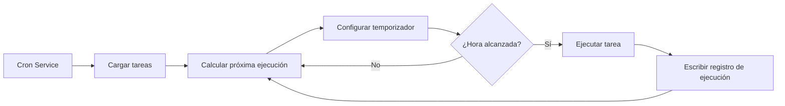

# Tareas Programadas Cron y Webhook

## Lo que podrás hacer después de esta lección

Al completar esta lección, podrás:

- Crear tareas programadas Cron que ejecuten tareas de IA automáticamente a una hora específica o periodicidad
- Comprender los escenarios de uso de los tres métodos de programación (at, every, cron)
- Configurar Webhooks para recibir activaciones de eventos externos
- Configurar la integración con Gmail Pub/Sub para implementar respuestas de IA activadas por correo
- Gestionar el historial y los registros de ejecución de tareas

## Tu problema actual

Es posible que te encuentres en estas situaciones:

- Necesitas recordarte que hagas algo a una hora específica
- Quieres resumir periódicamente el progreso del trabajo o generar informes
- Necesitas activar automáticamente el análisis de IA cuando recibes correos específicos
- No quieres enviar mensajes manualmente a la IA cada vez

## Cuándo usar esta técnica

**Tareas programadas Cron** son adecuadas para estos escenarios:

| Escenario | Ejemplo | Método de programación |
|-----------|---------|----------------------|
| Recordatorio único | "Recuérdame la reunión mañana a las 9 de la mañana" | at |
| Comprobación periódica | "Comprobar el estado del sistema cada 30 minutos" | every |
| Ejecución programada | "Generar informe diario cada tarde a las 5" | cron |
| Ciclo complejo | "Lunes a viernes a las 9 de la mañana" | cron |

**Webhooks** son adecuados para estos escenarios:

- Recibir notificaciones de push de GitHub, GitLab
- Recibir notificaciones de pago exitoso de Stripe
- Recibir notificaciones de llamadas entrantes de Twilio
- Cualquier servicio que pueda enviar HTTP POST

**Gmail Pub/Sub** es adecuado para estos escenarios:

- Analizar automáticamente cuando se reciben correos importantes
- Clasificación y respuesta automática de correos
- Extracción y archivado de contenido de correos

---

## Conceptos clave

### Flujo de trabajo de las tareas Cron



### Comparación de tres métodos de programación

| Método | Escenario de uso | Ejemplo | Precisión |
|--------|------------------|---------|-----------|
| `at` | Tarea única | 2026-01-27 09:00:00 | Nivel de milisegundos |
| `every` | Intervalo fijo | Cada 30 minutos | Nivel de milisegundos |
| `cron` | Ciclo complejo | Todos los días a las 9 de la mañana | Nivel de minutos |

### Dos objetivos de sesión

| Objetivo de sesión | Tipo de Payload | Descripción |
|-------------------|----------------|-------------|
| `main` | `systemEvent` | Inyectar eventos del sistema en la sesión principal |
| `isolated` | `agentTurn` | Ejecutar Agent en sesión aislada |

**Restricción clave**:
- `sessionTarget="main"` debe usar `payload.kind="systemEvent"`
- `sessionTarget="isolated"` debe usar `payload.kind="agentTurn"`

---

## 🎒 Preparativos antes de comenzar

Antes de comenzar, asegúrate de:

::: warning Verificación previa
- [ ] Gateway está ejecutándose（[Iniciar Gateway](../../start/gateway-startup/)）
- [ ] Modelo de IA está configurado（[Configuración del modelo de IA](../models-auth/)）
- [ ] Comprender la sintaxis básica de expresiones Cron（si usa programación cron）
:::

---

## Sígueme

### Paso 1: Verificar el estado del servicio Cron

**Por qué**: Confirmar que el servicio Cron esté habilitado y ejecutándose

```bash
## Verificar el estado de Cron usando CLI
clawdbot cron status
```

**Deberías ver**:

```
✓ Cron enabled
  Store: ~/.clawdbot/cron.json
  Jobs: 0
  Next wake: null
```

Si muestra `disabled`, necesitas habilitarlo en el archivo de configuración:

```json
{
  "cron": {
    "enabled": true,
    "store": "~/.clawdbot/cron.json",
    "maxConcurrentRuns": 5
  }
}
```

---

### Paso 2: Crear tarea programada única

**Por qué**: Aprender el método de programación `at` más básico

Usa la herramienta cron para agregar una tarea que se ejecutará en 1 minuto:

```json
{
  "action": "add",
  "job": {
    "name": "Recordatorio de prueba",
    "enabled": true,
    "schedule": {
      "kind": "at",
      "atMs": 1738000000000
    },
    "sessionTarget": "main",
    "wakeMode": "next-heartbeat",
    "payload": {
      "kind": "systemEvent",
      "text": "Este es un recordatorio de prueba: verificar el progreso del trabajo"
    }
  }
}
```

**Deberías ver**:

```
✓ Job added: job_xxx
  Name: Recordatorio de prueba
  Next run: 2026-01-27 10:00:00
```

**Consejo**: `atMs` es la marca de tiempo Unix (en milisegundos). Puedes calcularlo usando JavaScript:

```javascript
Date.now() + 60 * 1000  // 1 minuto después
```

---

### Paso 3: Crear tarea de intervalo repetido

**Por qué**: Aprender el método de programación `every`, adecuado para comprobaciones periódicas

Crear una tarea que se ejecute cada 30 minutos:

```json
{
  "action": "add",
  "job": {
    "name": "Verificar sistema cada 30 minutos",
    "enabled": true,
    "schedule": {
      "kind": "every",
      "everyMs": 1800000
    },
    "sessionTarget": "main",
    "wakeMode": "next-heartbeat",
    "payload": {
      "kind": "systemEvent",
      "text": "Verificar estado del sistema: CPU, memoria, disco"
    }
  }
}
```

**Deberías ver**:

```
✓ Job added: job_xxx
  Name: Verificar sistema cada 30 minutos
  Interval: 30 minutes
  Next run: 2026-01-27 10:00:00
```

**Descripción de parámetros**:
- `everyMs`: Tiempo de intervalo (en milisegundos)
  - 1 minuto = 60,000 ms
  - 5 minutos = 300,000 ms
  - 30 minutos = 1,800,000 ms
  - 1 hora = 3,600,000 ms
- `anchorMs` (opcional): Tiempo de inicio para la primera ejecución

---

### Paso 4: Crear tarea con expresión Cron

**Por qué**: Aprender el método de programación `cron`, adecuado para ciclos complejos

Crear una tarea que se ejecute todos los días a las 9 de la mañana:

```json
{
  "action": "add",
  "job": {
    "name": "Informe diario cada mañana a las 9",
    "enabled": true,
    "schedule": {
      "kind": "cron",
      "expr": "0 9 * * *",
      "tz": "Asia/Shanghai"
    },
    "sessionTarget": "main",
    "wakeMode": "next-heartbeat",
    "payload": {
      "kind": "systemEvent",
      "text": "Generar informe diario de trabajo de hoy"
    }
  }
}
```

**Deberías ver**:

```
✓ Job added: job_xxx
  Name: Informe diario cada mañana a las 9
  Schedule: 0 9 * * * (Asia/Shanghai)
  Next run: 2026-01-27 09:00:00
```

**Formato de expresión Cron**:

```
┌───────────── Minuto (0 - 59)
│ ┌─────────── Hora (0 - 23)
│ │ ┌───────── Día (1 - 31)
│ │ │ ┌─────── Mes (1 - 12)
│ │ │ │ ┌───── Día de la semana (0 - 7, 0 y 7 representan domingo)
│ │ │ │ │
* * * * *
```

**Expresiones comunes**:

| Expresión | Descripción |
|-----------|-------------|
| `0 9 * * *` | Todos los días a las 9 de la mañana |
| `0 9 * * 1-5` | Lunes a viernes a las 9 de la mañana |
| `0 */6 * * *` | Cada 6 horas |
| `0 0 * * 0` | Todos los domingos a medianoche |
| `0 9,17 * * *` | Todos los días a las 9 y 17 horas |

::: info Configuración de zona horaria
Las expresiones Cron usan por defecto la zona horaria UTC. Usa el campo `tz` para especificar la zona horaria (ej. `"Asia/Shanghai"`), asegurando que las tareas se ejecuten a la hora que esperas.
:::

---

### Paso 5: Ejecutar tarea en sesión aislada

**Por qué**: Ejecutar tareas de IA en un entorno aislado para evitar interferir con la sesión principal

Crear una tarea que se ejecute en una sesión aislada:

```json
{
  "action": "add",
  "job": {
    "name": "Resumen diario",
    "enabled": true,
    "schedule": {
      "kind": "cron",
      "expr": "0 18 * * *",
      "tz": "Asia/Shanghai"
    },
    "sessionTarget": "isolated",
    "wakeMode": "next-heartbeat",
    "payload": {
      "kind": "agentTurn",
      "message": "Resumir el trabajo de hoy: 1. Tareas completadas 2. Problemas encontrados 3. Plan de mañana",
      "model": "anthropic/claude-sonnet-4-20250514",
      "thinking": "low"
    }
  }
}
```

**Deberías ver**:

```
✓ Job added: job_xxx
  Name: Resumen diario
  Session: isolated
  Next run: 2026-01-27 18:00:00
```

**Parámetros del Payload `agentTurn`**:

| Parámetro | Tipo | Descripción |
|-----------|------|-------------|
| `message` | string | Prompt enviado al Agent |
| `model` | string | Anular el modelo a usar (opcional) |
| `thinking` | string | Nivel de pensamiento: "off" \| "minimal" \| "low" \| "medium" \| "high" |
| `timeoutSeconds` | number | Tiempo de espera (segundos) |
| `deliver` | boolean | Si enviar el resultado al canal |
| `channel` | string | Canal de destino (ej. `"whatsapp"`, `"telegram"`) |
| `to` | string | Identificador del destinatario |
| `bestEffortDeliver` | boolean | Si intentar otros canales cuando no se puede enviar al canal especificado |

**Configuración de sesión aislada** (opcional):

```json
{
  "isolation": {
    "postToMainPrefix": "📊 Resumen diario:",
    "postToMainMode": "summary",
    "postToMainMaxChars": 8000
  }
}
```

| Parámetro | Descripción |
|-----------|-------------|
| `postToMainPrefix` | Prefijo al reenviar resultados a la sesión principal |
| `postToMainMode` | "summary" (resumen) o "full" (texto completo) |
| `postToMainMaxChars` | Máximo de caracteres cuando `postToMainMode="full"` |

---

### Paso 6: Listar y gestionar tareas

**Por qué**: Ver todas las tareas y gestionar su estado

**Listar todas las tareas**:

```bash
clawdbot cron list
```

**Deberías ver**:

```
Jobs: 3
  ✓ job_xxx: Recordatorio de prueba (enabled, next: 2026-01-27 10:00:00)
  ✓ job_yyy: Verificar sistema cada 30 minutos (enabled, next: 2026-01-27 10:00:00)
  ✓ job_zzz: Informe diario cada mañana a las 9 (enabled, next: 2026-01-27 09:00:00)
```

**Incluir tareas deshabilitadas**:

```bash
clawdbot cron list --include-disabled
```

**Deshabilitar tarea**:

```json
{
  "action": "update",
  "jobId": "job_xxx",
  "patch": {
    "enabled": false
  }
}
```

**Habilitar tarea**:

```json
{
  "action": "update",
  "jobId": "job_xxx",
  "patch": {
    "enabled": true
  }
}
```

**Eliminar tarea**:

```json
{
  "action": "remove",
  "jobId": "job_xxx"
}
```

---

### Paso 7: Ejecutar tarea inmediatamente

**Por qué**: Probar si la tarea funciona normalmente sin esperar la programación

```json
{
  "action": "run",
  "jobId": "job_xxx"
}
```

**Deberías ver**:

```
✓ Job ran: job_xxx
  Status: ok
  Duration: 1234ms
```

**Ver historial de ejecución**:

```json
{
  "action": "runs",
  "jobId": "job_xxx",
  "limit": 10
}
```

**Deberías ver**:

```
Runs for job_xxx (10 most recent):
  2026-01-27 10:00:00 - ok - 1234ms
  2026-01-26 10:00:00 - ok - 1189ms
  2026-01-25 10:00:00 - ok - 1245ms
```

---

### Paso 8: Agregar contexto a tarea de recordatorio

**Por qué**: Permitir que la IA entienda el contexto reciente de la conversación y proporcionar recordatorios más relevantes

Usar el parámetro `contextMessages` para agregar historial de mensajes recientes:

```json
{
  "action": "add",
  "job": {
    "name": "Recordatorio de seguimiento de tareas",
    "enabled": true,
    "schedule": {
      "kind": "cron",
      "expr": "0 10,16 * * *",
      "tz": "Asia/Shanghai"
    },
    "sessionTarget": "main",
    "wakeMode": "next-heartbeat",
    "payload": {
      "kind": "systemEvent",
      "text": "Seguir el progreso de tus tareas: 1. Verificar pendientes 2. Actualizar estado del proyecto"
    },
    "contextMessages": 5
  }
}
```

**Límites de mensajes de contexto**:
- Máximo de mensajes: 10
- Máximo de caracteres por mensaje: 220
- Límite total de caracteres: 700
- Formato: `- User: ...\n- Assistant: ...`

**Contexto agregado automáticamente**:

```
Seguir el progreso de tus tareas: 1. Verificar pendientes 2. Actualizar estado del proyecto

Recent context:
- User: Necesito completar el informe hoy
- Assistant: Entendido, ¿qué tipo de informe necesitas?
- User: Es un informe semanal, incluye el resumen del trabajo de esta semana
```

---

## Configuración de Webhook

### Descripción general de Webhook

Los Webhooks permiten que servicios externos activen eventos internos de Clawdbot a través de solicitudes HTTP POST. Usos comunes:

- **GitHub/GitLab**: Notificaciones de push activan procesos CI/CD
- **Stripe**: Notificaciones de pago exitoso activan procesamiento de pedidos
- **Twilio**: Notificaciones de llamadas entrantes activan respuestas de voz de IA
- **Jira**: Notificaciones de creación de tickets activan respuestas automáticas

### Configurar Webhook

**Habilitar sistema de Hooks**:

```json
{
  "hooks": {
    "enabled": true,
    "path": "/hooks",
    "token": "your-secret-token-here"
  }
}
```

**Configurar reglas de mapeo**:

```json
{
  "hooks": {
    "enabled": true,
    "token": "your-secret-token-here",
    "mappings": [
      {
        "id": "github-push",
        "match": {
          "path": "/hooks/github"
        },
        "action": "wake",
        "wakeMode": "now",
        "sessionKey": "main",
        "messageTemplate": "Notificación push de GitHub: {{ repository }} - {{ ref }}"
      }
    ]
  }
}
```

**Parámetros de configuración de mapeo**:

| Parámetro | Descripción |
|-----------|-------------|
| `match.path` | Ruta URL a coincidir |
| `match.source` | Cabecera de origen de solicitud a coincidir |
| `action` | `"wake"` o `"agent"` |
| `wakeMode` | `"now"` o `"next-heartbeat"` |
| `sessionKey` | Clave de sesión de destino (ej. `"main"`) |
| `messageTemplate` | Plantilla de mensaje usando sintaxis Mustache |
| `deliver` | Si enviar al canal |
| `channel` | Canal de destino (ej. `"whatsapp"`) |
| `to` | Identificador del destinatario |
| `transform` | Módulo de transformación (procesa cuerpo de solicitud) |

---

## Integración con Gmail Pub/Sub

### Descripción general de Gmail Pub/Sub

Gmail Pub/Sub te permite activar Clawdbot en tiempo real cuando recibes nuevos correos, implementando respuestas de IA impulsadas por correo.

### Configurar Gmail Pub/Sub

**Configuración básica**:

```json
{
  "hooks": {
    "enabled": true,
    "token": "your-hook-token",
    "gmail": {
      "account": "your-email@gmail.com",
      "label": "INBOX",
      "topic": "projects/your-project-id/topics/gmail-topic",
      "subscription": "gmail-subscription",
      "pushToken": "your-push-token",
      "hookUrl": "http://127.0.0.1:18789/hooks/gmail",
      "includeBody": true,
      "maxBytes": 20000,
      "renewEveryMinutes": 720
    }
  }
}
```

**Descripción de parámetros de configuración**:

| Parámetro | Descripción | Valor predeterminado |
|-----------|-------------|---------------------|
| `account` | Dirección de cuenta Gmail | - |
| `label` | Etiqueta Gmail a monitorear | `INBOX` |
| `topic` | Ruta del tema Pub/Sub de Google Cloud | - |
| `subscription` | Nombre de suscripción Pub/Sub | `gmail-subscription` |
| `pushToken` | Token de push de Gmail | - |
| `hookUrl` | URL de recepción de Webhook | Generado automáticamente |
| `includeBody` | Si incluir cuerpo del correo | `true` |
| `maxBytes` | Máximo de bytes del correo | `20000` |
| `renewEveryMinutes` | Intervalo de renovación de suscripción (minutos) | `720` (12 horas) |

### Integración con Tailscale (opcional)

**Exponer Webhook usando Tailscale Serve**:

```json
{
  "hooks": {
    "gmail": {
      "tailscale": {
        "mode": "serve",
        "path": "/gmail-pubsub",
        "target": "10000"
      }
    }
  }
}
```

**Usar Tailscale Funnel**:

```json
{
  "hooks": {
    "gmail": {
      "tailscale": {
        "mode": "funnel",
        "path": "/gmail-pubsub"
      }
    }
  }
}
```

| Modo | Descripción |
|------|-------------|
| `off` | No usar Tailscale |
| `serve` | Exponer servicio local a través de Tailscale Serve |
| `funnel` | Acceso desde internet a través de Tailscale Funnel |

### Iniciar Gmail Watcher

**Iniciar servicio Gmail Watcher**:

```bash
clawdbot hooks gmail-watch
```

**Deberías ver**:

```
✓ Gmail watcher started
  Account: your-email@gmail.com
  Label: INBOX
  Watching...
```

**Gmail Watcher hará**:
1. Suscribirse a cambios de etiqueta de Gmail
2. Recibir nuevos push de correos
3. Enviar información del correo al Webhook
4. Activar eventos internos de Clawdbot

---

## Punto de control ✅

**Confirma que has dominado**:

- [ ] Puedes crear tres tipos de tareas Cron (at, every, cron)
- [ ] Entiendes la diferencia entre objetivos de sesión `main` y `isolated`
- [ ] Puedes listar, habilitar, deshabilitar y eliminar tareas
- [ ] Puedes ver el historial de ejecución de tareas
- [ ] Entiendes la configuración y el principio de funcionamiento de Webhook
- [ ] Puedes configurar la integración con Gmail Pub/Sub

---

## Solución de problemas

### Tarea no se ejecuta

**Problema**: La tarea se agregó pero nunca se ejecuta

**Posibles causas**:

| Causa | Solución |
|-------|----------|
| Servicio Cron no habilitado | Verificar configuración `cron.enabled` |
| Hora no alcanzada | Verificar próxima ejecución con `clawdbot cron list` |
| Zona horaria incorrecta | Verificar que el campo `tz` sea correcto |
| Tarea deshabilitada | Verificar estado de tarea con `--include-disabled` |

### Error en expresión Cron

**Problema**: La tarea se ejecuta en el momento incorrecto

**Errores comunes**:

| Error | Correcto | Descripción |
|-------|----------|-------------|
| `9 * * *` | `0 9 * * *` | Falta campo de minuto |
| `0 9 * * * *` | `0 9 * * *` | Hay un campo extra |
| `0 9 1-5 * *` | `0 9 * * 1-5` | Posición de campo de día de la semana incorrecta |

**Herramienta de validación**: Usa [crontab.guru](https://crontab.guru/) para validar expresiones Cron.

### Gmail Pub/Sub no funciona

**Problema**: Se recibe correo pero no se activa

**Lista de verificación**:

- [ ] ¿Está el servicio Gmail Watcher ejecutándose?
- [ ] ¿Es accesible la `hookUrl`? (probar con curl)
- [ ] ¿Está el `token` configurado correctamente?
- [ ] ¿Están creados correctamente el tema y suscripción Pub/Sub?
- [ ] ¿Es normal la conexión de red? (cuando se usa Tailscale)

### Sesión aislada sin respuesta

**Problema**: Las tareas con `sessionTarget="isolated"` no tienen salida

**Posibles causas**:

- Falta campo `model`, usando modelo predeterminado pero no configurado
- El prompt `message` no es lo suficientemente claro
- `timeoutSeconds` muy corto, tarea se agota tiempo
- `deliver=false` pero `postToMainMode` no configurado

**Solución**:

1. Aumentar nivel de detalle de registro
2. Verificar registros de Gateway
3. Usar `bestEffortDeliver=true` para asegurar que el resultado se reenvíe al menos a la sesión principal

---

## Resumen de la lección

Cron y Webhook son poderosas herramientas de automatización de Clawdbot:

**Sistema Cron**:
- Tres métodos de programación: `at` (único), `every` (intervalo), `cron` (ciclo complejo)
- Dos objetivos de sesión: `main` (inyectar evento del sistema), `isolated` (ejecutar Agent)
- Soporta historial de tareas y registros de ejecución
- Puede agregar mensajes de contexto para proporcionar recordatorios más relevantes

**Sistema Webhook**:
- Recibir solicitudes HTTP POST externas
- Soporta reglas de mapeo y plantillas de mensajes
- Puede configurar Tailscale para exposición pública en internet

**Gmail Pub/Sub**:
- Monitorear nuevos correos en tiempo real
- Soporta filtrado por etiquetas
- Integración con Tailscale Serve/Funnel

Al configurar estas funciones adecuadamente, puedes construir un asistente de IA completamente automatizado que responda en el momento adecuado.

---

## Vista previa de la próxima lección

> En la próxima lección aprenderemos **[Sistema de memoria y búsqueda vectorial](../memory-system/)**.
>
> Podrás:
> - Estructura de archivos y mecanismo de indexación del sistema de memoria
> - Configurar proveedores de búsqueda vectorial (OpenAI, Gemini, local)
> - Usar búsqueda híbrida (BM25 + vectorial) para mejorar precisión de recuperación
> - Gestionar índices de memoria y búsqueda a través de CLI

---

## Apéndice: Referencia de código fuente

<details>
<summary><strong>Haz clic para ver ubicaciones del código fuente</strong></summary>

> Fecha de actualización: 2026-01-27

| Función | Ruta del archivo | Número de líneas |
|---------|-----------------|------------------|
| Definición de tipos de configuración Cron | [`src/config/types.cron.ts`](https://github.com/clawdbot/clawdbot/blob/main/src/config/types.cron.ts#L1-L6) | 1-6 |
| Definición de tipos centrales Cron | [`src/cron/types.ts`](https://github.com/clawdbot/clawdbot/blob/main/src/cron/types.ts#L1-L95) | 1-95 |
| Cron Service | [`src/cron/service.ts`](https://github.com/clawdbot/clawdbot/blob/main/src/cron/service.ts#L1-L49) | 1-49 |
| Implementación de operaciones Cron | [`src/cron/service/ops.ts`](https://github.com/clawdbot/clawdbot/blob/main/src/cron/service/ops.ts#L1-L141) | 1-141 |
| Implementación de herramienta Cron | [`src/agents/tools/cron-tool.ts`](https://github.com/clawdbot/clawdbot/blob/main/src/agents/tools/cron-tool.ts#L1-L291) | 1-291 |
| Métodos Cron de Gateway | [`src/gateway/server-methods/cron.ts`](https://github.com/clawdbot/clawdbot/blob/main/src/gateway/server-methods/cron.ts#L1-L205) | 1-205 |
| Definición de tipos de configuración Hooks | [`src/config/types.hooks.ts`](https://github.com/clawdbot/clawdbot/blob/main/src/config/types.hooks.ts#L1-L125) | 1-125 |
| Herramienta Gmail de Hooks | [`src/hooks/gmail.ts`](https://github.com/clawdbot/clawdbot/blob/main/src/hooks/gmail.ts#L1-L267) | 1-267 |
| Eventos internos de Hooks | [`src/hooks/hooks.ts`](https://github.com/clawdbot/clawdbot/blob/main/src/hooks/hooks.ts#L1-L15) | 1-15 |
| Comandos CLI de Hooks | [`src/cli/hooks-cli.ts`](https://github.com/clawdbot/clawdbot/blob/main/src/cli/hooks-cli.ts#L1-L839) | 1-839 |

**Constantes clave**:
- `DEFAULT_GMAIL_LABEL = "INBOX"`: Etiqueta predeterminada de Gmail
- `DEFAULT_GMAIL_TOPIC = "gog-gmail-watch"`: Nombre predeterminado de tema de Gmail
- `DEFAULT_GMAIL_SUBSCRIPTION = "gog-gmail-watch-push"`: Nombre predeterminado de suscripción de Gmail
- `DEFAULT_GMAIL_MAX_BYTES = 20000`: Máximo predeterminado de bytes del correo
- `DEFAULT_GMAIL_RENEW_MINUTES = 720`: Intervalo predeterminado de renovación (12 horas)

**Funciones clave**:
- `CronService.start()`: Iniciar servicio Cron
- `CronService.add()`: Agregar tarea programada
- `CronService.update()`: Actualizar tarea
- `CronService.remove()`: Eliminar tarea
- `CronService.run()`: Ejecutar tarea inmediatamente
- `createCronTool()`: Crear herramienta Cron
- `resolveGmailHookRuntimeConfig()`: Analizar configuración de Gmail Hook
- `buildGogWatchStartArgs()`: Construir argumentos de inicio de Gmail Watch
- `buildGogWatchServeArgs()`: Construir argumentos de servicio de Gmail Watch

</details>
