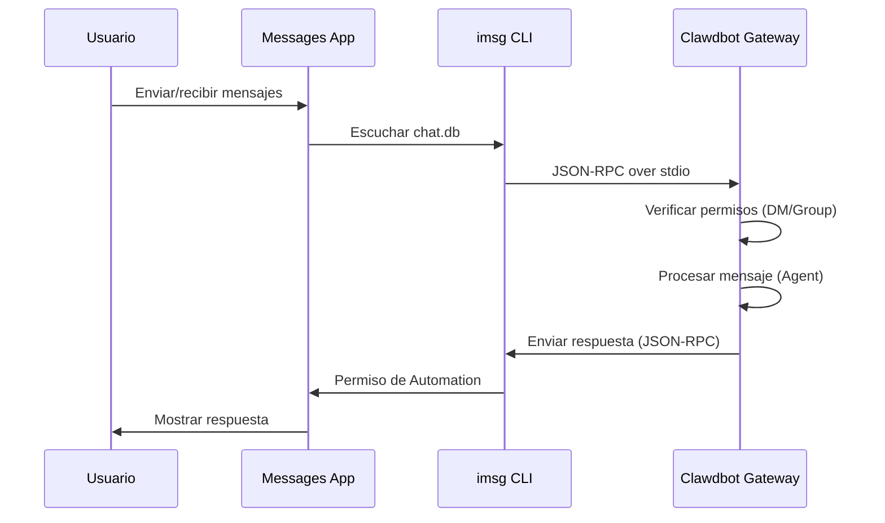

# Configuración del canal iMessage

## Lo que aprenderás

Al completar este tutorial, podrás:

- Realizar chats privados 1:1 con el asistente de IA a través de iMessage en macOS
- Usar el asistente de IA en grupos de iMessage (soporta @menciones)
- Configurar un usuario de Mac dedicado para aislar la identidad del bot
- Acceder remotamente a iMessage en otro Mac a través de SSH/Tailscale
- Dominar el mecanismo de emparejamiento DM y la lista blanca de grupos

## Tu situación actual

Quieres usar iMessage en macOS para interactuar con el asistente de IA, pero no sabes cómo:

- Instalar y configurar la herramienta `imsg` CLI
- Otorgar permisos de Full Disk Access y Automation a Clawdbot
- Configurar un Mac local o remoto como puerta de enlace de iMessage
- Configurar múltiples cuentas de iMessage
- Controlar quién puede enviar mensajes al bot

## Cuándo usar esto

**Escenarios adecuados para usar el canal iMessage**:

- Usas principalmente iMessage en macOS
- Deseas usar iMessage local (sin depender de servidores de terceros)
- Necesitas interactuar con texto y multimedia con el asistente de IA a través de iMessage
- Quieres mantener la misma experiencia de sesión que otros canales (WhatsApp, Telegram)

**Escenarios no adecuados**:

- Sistemas que no son macOS (el canal iMessage solo admite macOS)
- Necesidad de sincronización multiplataforma (considera usar WebChat, Telegram)
- Necesidad de función de @mención en grupos (iMessage no tiene mecanismo nativo de mention, requiere configuración manual)

## Conceptos clave

Flujo de trabajo del canal iMessage:



**Conceptos clave**:

| Concepto | Descripción |
| ------ | ------ |
| **imsg CLI** | Herramienta de terceros, interactúa con Messages a través de JSON-RPC over stdio |
| **Full Disk Access** | Permiso de macOS, permite que Clawdbot lea chat.db de Messages |
| **Permiso de Automation** | Permiso de macOS, permite que imsg envíe mensajes a través de la API de Automation |
| **chat_id** | Identificador de chat estable, usado para enrutamiento y aislamiento de sesiones |
| **pairing** | Mecanismo de protección DM predeterminado, los remitentes desconocidos requieren aprobación |

::: tip
El canal iMessage se implementa a través del CLI `imsg`, no llamando directamente a la API de Messages. `imsg` se comunica con Clawdbot a través de JSON-RPC over stdio, lo que significa que puede ejecutarse en un Mac remoto (a través de SSH).
:::

## 🎒 Preparativos

Antes de comenzar, asegúrate de haber:

- ✅ Completado [Inicio rápido](../../start/getting-started/) e instalado Clawdbot
- ✅ Gateway en ejecución (`clawdbot gateway --port 18789`)
- ✅ Iniciado sesión en Messages en macOS (iMessage habilitado)
- ✅ Tener acceso a Homebrew (para instalar `imsg`)

::: warning
El canal iMessage solo admite macOS. Asegúrate de que tu Gateway se ejecute en macOS o que se conecte a un Mac remoto a través de SSH/Tailscale.
:::

## Sigue estos pasos

### Paso 1: Instalar imsg CLI

**Por qué**
`imsg` es la dependencia principal del canal iMessage, interactúa con la aplicación Messages a través de JSON-RPC over stdio.

1. Instalar usando Homebrew:
   ```bash
   brew install steipete/tap/imsg
   ```

**Deberías ver**:
- Después de una instalación exitosa, el comando `imsg` está disponible
- Ejecutar `imsg --version` muestra información de la versión

**Verificar la instalación**:

```bash
# Probar si imsg está disponible
imsg chats --limit 1
```

**Deberías ver**:
- Salida de al menos un registro de chat (si existe)
- O un mensaje solicitando otorgar permisos de Full Disk Access

### Paso 2: Otorgar permisos de Full Disk Access

**Por qué**
Clawdbot necesita leer la base de datos `chat.db` de Messages para escuchar nuevos mensajes.

1. Abrir **Configuración del sistema** > **Privacidad y seguridad**
2. Hacer clic en **Acceso total al disco**
3. Hacer clic en **+** para agregar las siguientes aplicaciones:
   - `/Applications/Clawdbot.app` (si usas la aplicación macOS)
   - `/usr/local/bin/imsg` o la ruta real de `imsg`
4. Reiniciar Gateway

::: warning
¡Debes reiniciar Gateway después de cambiar los permisos para que surtan efecto!
:::

**Deberías ver**:
- Sin errores de permisos en los registros de inicio de Gateway
- `imsg chats --limit 1` puede generar normalmente la lista de chats

### Paso 3: Otorgar permisos de Automation

**Por qué**
`imsg` envía mensajes a través de la API de Automation de Apple Events, requiere autorización del usuario.

1. Al enviar un mensaje por primera vez, macOS mostrará un mensaje de permiso
2. Hacer clic en **Permitir** o **OK**
3. Si usas un usuario de Mac dedicado, ejecuta una prueba en la sesión de ese usuario

**Probar permiso de Automation**:

```bash
# Enviar mensaje de prueba (reemplaza con el destinatario real)
imsg send --to "+15555550123" "Test message"
```

**Deberías ver**:
- macOS muestra un mensaje de permiso (primera vez)
- Después de otorgar permiso, el mensaje se envía correctamente
- El mensaje de prueba aparece en la aplicación Messages

### Paso 4: Configurar Clawdbot

**Por qué**
Decirle a Clawdbot qué ruta `imsg` usar y la ubicación de la base de datos de Messages.

**Método A: Configuración simple (Mac local)**

Editar `~/.clawdbot/clawdbot.json`:

```json5
{
  channels: {
    imessage: {
      enabled: true,
      cliPath: "/usr/local/bin/imsg",
      dbPath: "/Users/<your-username>/Library/Messages/chat.db",
      dmPolicy: "pairing",
      groupPolicy: "allowlist"
    }
  }
}
```

::: info
Reemplaza `<your-username>` con tu nombre de usuario de macOS real.
:::

**Método B: Configuración multicuenta**

```json5
{
  channels: {
    imessage: {
      enabled: true,
      accounts: {
        main: {
          name: "Main Account",
          enabled: true,
          cliPath: "/usr/local/bin/imsg",
          dbPath: "/Users/alice/Library/Messages/chat.db"
        },
        bot: {
          name: "Bot Account",
          enabled: true,
          cliPath: "/path/to/imsg-bot-wrapper",  // Ver paso 5
          dbPath: "/Users/botuser/Library/Messages/chat.db"
        }
      }
    }
  }
}
```

**Reiniciar Gateway**:

```bash
clawdbot gateway restart
```

**Deberías ver**:
- Gateway se inicia y muestra "iMessage default: enabled, configured, ..."
- Sin registros de errores de permisos o rutas

### Paso 5: Enviar mensaje de prueba

**Por qué**
Verificar que la configuración es correcta y los mensajes se envían normalmente.

1. Enviar mensaje de prueba usando CLI:
   ```bash
   clawdbot message --to imessage:+15555550123 "Hello from Clawdbot!"
   ```

**Deberías ver**:
- La aplicación Messages recibe el mensaje
- Los registros de Gateway muestran que el mensaje se envió
- Si se configura un modelo de IA, recibirás una respuesta de IA

::: info
El formato `imessage:+15555550123` indica enviar a través del canal iMessage al número de teléfono `+15555550123`. También puedes usar una dirección de correo electrónico `imessage:user@example.com`.
:::

## Punto de control ✅

Verificar que la configuración fue exitosa:

```bash
# Verificar estado del canal
clawdbot channels status

# Debería mostrar:
# iMessage default: enabled, configured, rpc listening
```

::: info
Si ves errores, ejecuta `clawdbot channels status --probe` para ver información de diagnóstico detallada.
:::

## Configuración avanzada

### Configurar usuario de Mac dedicado (opcional)

Si deseas usar una identidad de iMessage independiente (sin contaminar tus Messages personales), puedes crear un usuario de Mac dedicado.

**Pasos**:

1. **Crear Apple ID dedicado**:
   - Visitar [appleid.apple.com](https://appleid.apple.com)
   - Crear un nuevo Apple ID (por ejemplo, `my-cool-bot@icloud.com`)

2. **Crear usuario de macOS**:
   - Abrir **Configuración del sistema** > **Usuarios y grupos**
   - Hacer clic en **+** para crear un nuevo usuario (por ejemplo, `botuser`)
   - Configurar inicio de sesión automático o recordar la contraseña

3. **Iniciar sesión en la cuenta de iMessage dedicada**:
   - Cambiar al usuario `botuser`
   - Abrir la aplicación Messages
   - Iniciar sesión en iMessage con el Apple ID dedicado

4. **Habilitar inicio de sesión remoto**:
   - Abrir **Configuración del sistema** > **General** > **Compartir**
   - Habilitar **Inicio de sesión remoto**

5. **Configurar inicio de sesión SSH sin contraseña**:
   ```bash
   # Probar SSH desde el usuario principal
   ssh botuser@localhost true

   # Si se requiere contraseña, configurar claves SSH:
   ssh-keygen -t ed25519
   ssh-copy-id botuser@localhost
   ```

6. **Crear script de wrapper SSH**:

   Crear `~/.clawdbot/scripts/imsg-bot` (`chmod +x`):

   ```bash
   #!/usr/bin/env bash
   set -euo pipefail

   # Ejecutar SSH interactivo una vez para aceptar claves de host:
   #   ssh botuser@localhost true
   exec /usr/bin/ssh -o BatchMode=yes -o ConnectTimeout=5 -T botuser@localhost \
     "/usr/local/bin/imsg" "$@"
   ```

7. **Configurar Clawdbot**:

   ```json5
   {
     channels: {
       imessage: {
         enabled: true,
         accounts: {
           bot: {
             name: "Bot",
             enabled: true,
             cliPath: "/Users/<your-username>/.clawdbot/scripts/imsg-bot",
             dbPath: "/Users/botuser/Library/Messages/chat.db"
           }
         }
       }
     }
   }
   ```

::: tip
Durante la configuración inicial, ejecuta `imsg chats --limit 1` o `imsg send ...` una vez en la sesión de `botuser` para otorgar permisos de Automation.
:::

### Configuración de Mac remoto (opcional)

Si Gateway se ejecuta en Linux/VM pero iMessage debe estar en Mac, puedes conectarte remotamente a través de SSH.

**Arquitectura**:

```
┌──────────────────────────────┐          SSH (imsg rpc)          ┌──────────────────────────┐
│ Gateway host (Linux/VM)      │──────────────────────────────────▶│ Mac with Messages + imsg │
│ - clawdbot gateway           │          SCP (attachments)        │ - Messages signed in     │
│ - channels.imessage.cliPath  │◀──────────────────────────────────│ - Remote Login enabled   │
└──────────────────────────────┘                                   └──────────────────────────┘
              ▲
              │ Tailscale tailnet (hostname or 100.x.y.z)
              ▼
        user@remote-mac
```

**Pasos de configuración**:

1. **Crear wrapper SSH** (`~/.clawdbot/scripts/imsg-ssh`):

   ```bash
   #!/usr/bin/env bash
   exec ssh -T bot@remote-mac imsg "$@"
   ```

2. **Configurar Clawdbot**:

   ```json5
   {
     channels: {
       imessage: {
         enabled: true,
         cliPath: "/Users/<your-username>/.clawdbot/scripts/imsg-ssh",
         remoteHost: "bot@remote-mac",
         includeAttachments: true,
         dbPath: "/Users/bot/Library/Messages/chat.db"
       }
     }
   }
   ```

::: info
`remoteHost` se usa para transferir de adjuntos a través de SCP. Si no se configura, Clawdbot intentará detectarlo automáticamente desde el comando SSH. La configuración explícita es más confiable.
:::

**Ejemplo de configuración de Tailscale**:

```bash
# SSH wrapper
#!/usr/bin/env bash
exec ssh -T bot@mac-mini.tailnet-1234.ts.net imsg "$@"
```

```json5
{
  channels: {
    imessage: {
      enabled: true,
      cliPath: "~/.clawdbot/scripts/imsg-ssh",
      remoteHost: "bot@mac-mini.tailnet-1234.ts.net",
      includeAttachments: true,
      dbPath: "/Users/bot/Library/Messages/chat.db"
    }
  }
}
```

## Explicación detallada de la configuración

### Configuración básica

| Configuración | Tipo | Predeterminado | Descripción |
| -------- | ------ | -------- | ------ |
| `enabled` | boolean | false | Si habilitar el canal iMessage |
| `cliPath` | string | "imsg" | Ruta del CLI imsg (puede ser un wrapper SSH) |
| `dbPath` | string | - | Ruta de chat.db de Messages |
| `remoteHost` | string | - | Host SSH (usado para transferencia de adjuntos SCP) |

### Política de DM

| Configuración | Tipo | Predeterminado | Descripción |
| -------- | ------ | -------- | ------ |
| `dmPolicy` | "pairing"|"allowlist"|"open"|"disabled" | "pairing" | Política de acceso DM |
| `allowFrom` | array | [] | Lista de remitentes permitidos (handles, correos, E.164, `chat_id:*`) |

**Emparejar nuevo remitente**:

```bash
# Listar códigos de emparejamiento pendientes
clawdbot pairing list imessage

# Aprobar emparejamiento
clawdbot pairing approve imessage <CODE>
```

::: tip
iMessage no tiene concepto de nombre de usuario, usa handles (números de teléfono o direcciones de correo) o destinos de chat (`chat_id`, `chat_guid`, `chat_identifier`).
:::

### Política de grupo

| Configuración | Tipo | Predeterminado | Descripción |
| -------- | ------ | -------- | ------ |
| `groupPolicy` | "allowlist"|"open"|"disabled" | "allowlist" | Política de acceso de grupos |
| `groupAllowFrom` | array | [] | Remitentes permitidos para activar AI en grupos |
| `groups` | object | {} | Configuración de grupos por chat_id |

**Ejemplo de configuración de grupos**:

```json5
{
  channels: {
    imessage: {
      groupPolicy: "allowlist",
      groupAllowFrom: ["+15555550123", "alice@example.com"],
      groups: {
        "42": {
          requireMention: false,
          allowFrom: ["bob@example.com"]
        }
      }
    }
  }
}
```

### Límites de medios y texto

| Configuración | Tipo | Predeterminado | Descripción |
| -------- | ------ | -------- | ------ |
| `includeAttachments` | boolean | false | Si incluir adjuntos en el contexto |
| `mediaMaxMb` | number | 16 | Tamaño máximo de archivo multimedia (MB) |
| `textChunkLimit` | number | 4000 | Tamaño de fragmentación de texto de salida (caracteres) |
| `chunkMode` | "length"|"newline" | "length" | Modo de fragmentación: por longitud o por línea vacía |

### Historial

| Configuración | Tipo | Predeterminado | Descripción |
| -------- | ------ | -------- | ------ |
| `historyLimit` | number | - | Número máximo de mensajes históricos en grupos (0 para deshabilitar) |
| `dmHistoryLimit` | number | - | Límite de mensajes históricos DM (vueltas de usuario) |
| `dms["<handle>"].historyLimit` | number | - | Anular límite de historial DM por handle |

## Advertencias de problemas comunes

### Comando imsg rpc no disponible

**Síntoma**: Los registros de Gateway muestran "imsg CLI does not support 'rpc' subcommand"

**Causa**: La versión de `imsg` es demasiado antigua y no admite el subcomando `rpc`

**Solución**:

1. Actualizar `imsg`:
   ```bash
   brew upgrade steipete/tap/imsg
   ```

2. Verificar versión:
   ```bash
   imsg rpc --help
   ```

### Problemas de permisos de Full Disk Access

**Síntoma**: `imsg chats --limit 1` no muestra salida o error "Permission denied"

**Solución**:

1. Asegúrate de haber agregado Clawdbot y `imsg` a Acceso total al disco
2. Reiniciar Gateway
3. Si el problema persiste, intenta reiniciar Mac

### Problemas de permisos de Automation

**Síntoma**: No hay respuesta al enviar mensajes, los registros de Gateway muestran tiempo de espera

**Causa**: macOS no otorgó permiso de Automation

**Solución**:

1. Enviar manualmente un mensaje en la aplicación Messages
2. macOS debería mostrar un mensaje de permiso
3. Hacer clic en **Permitir**
4. Si usas un usuario de Mac dedicado, cambia a ese usuario y repite los pasos

### Fallo de conexión Mac remoto

**Síntoma**: Wrapper SSH agotado o conexión rechazada

**Solución**:

1. Probar conexión SSH:
   ```bash
   ssh -T bot@remote-mac imsg --version
   ```

2. Asegúrate de que Inicio de sesión remoto esté habilitado (Mac remoto)

3. Verificar firewall y configuración de puertos

4. Usar Tailscale para simplificar la penetración de red interna

## Resumen de esta lección

En esta lección aprendiste:

- ✅ Instalar la herramienta CLI `imsg`
- ✅ Configurar permisos de Full Disk Access y Automation
- ✅ Métodos de configuración de Mac local y remoto
- ✅ Dominar el mecanismo de emparejamiento DM y lista blanca de grupos
- ✅ Entender las diferencias entre chat_id, chat_guid, chat_identifier
- ✅ Probar mensajes 1:1 y de grupo

## Vista previa de la siguiente lección

> En la siguiente lección aprenderemos **[Canal de LINE](../line/)**.
>
> Aprenderás:
> - Cómo obtener credenciales de la API de LINE Messaging
> - Configurar el endpoint de Webhook de LINE Bot
> - Formatos de mensajes y limitaciones del canal LINE
> - Diferencias de configuración con el canal iMessage

---

## Apéndice: Referencia del código fuente

<details>
<summary><strong>Haz clic para expandir y ver la ubicación del código fuente</strong></summary>

> Fecha de actualización: 2026-01-27

| Función | Ruta del archivo | Número de línea |
| ------ | --------- | ---- |
| Definición de tipos de configuración iMessage | [`src/config/types.imessage.ts`](https://github.com/clawdbot/clawdbot/blob/main/src/config/types.imessage.ts) | 1-80 |
| Análisis de cuentas iMessage | [`src/imessage/accounts.ts`](https://github.com/clawdbot/clawdbot/blob/main/src/imessage/accounts.ts) | 1-83 |
| Sondaje iMessage | [`src/imessage/probe.ts`](https://github.com/clawdbot/clawdbot/blob/main/src/imessage/probe.ts) | 1-92 |
| Envío de iMessage | [`src/imessage/send.ts`](https://github.com/clawdbot/clawdbot/blob/main/src/imessage/send.ts) | 1-135 |
| Proveedor de monitorización iMessage | [`src/imessage/monitor/monitor-provider.ts`](https://github.com/clawdbot/clawdbot/blob/main/src/imessage/monitor/monitor-provider.ts) | 1-600+ |
| Análisis de destino | [`src/imessage/targets.ts`](https://github.com/clawdbot/clawdbot/blob/main/src/imessage/targets.ts) | 1-200+ |
| Adaptador de Onboarding | [`src/channels/plugins/onboarding/imessage.ts`](https://github.com/clawdbot/clawdbot/blob/main/src/channels/plugins/onboarding/imessage.ts) | 1-262 |
| Documentación de iMessage | [`docs/channels/imessage.md`](https://github.com/clawdbot/clawdbot/blob/main/docs/channels/imessage.md) | 1-262 |

**Tipos clave**:
- `IMessageConfig`: Interfaz de configuración completa de iMessage
- `IMessageAccountConfig`: Configuración de una sola cuenta
- `IMessageService`: "imessage" | "sms" | "auto"
- `IMessageTargetKind`: "chat_id" | "chat_guid" | "chat_identifier" | "handle"

**Campos de configuración clave**:
- `cliPath`: Ruta del CLI imsg, puede ser una ruta local o un script de wrapper SSH
- `dbPath`: Ruta de la base de datos chat.db de Messages
- `remoteHost`: Host SSH (usado para transferencia de adjuntos SCP), detección automática o configuración explícita
- `dmPolicy`: Predeterminado "pairing", controla el acceso DM de desconocidos
- `groupPolicy`: Política de acceso de grupos, "allowlist" o "open"
- `groups`: Configuración de grupos por `chat_id`, soporta aislamiento de sesiones y políticas personalizadas

**Funciones clave**:
- `probeIMessage()`: Sondar si el CLI imsg está disponible y soporta el subcomando rpc (`probe.ts`)
- `sendMessageIMessage()`: Enviar mensaje iMessage, soporta texto y multimedia (`send.ts`)
- `monitorIMessageProvider()`: Monitorizar el flujo de eventos iMessage (`monitor-provider.ts`)
- `parseIMessageTarget()`: Analizar destino (chat_id, handle, email, etc.) (`targets.ts`)

**Mecanismo de comunicación**:
- Implementa comunicación JSON-RPC over stdio a través del subcomando `imsg rpc`
- Cada cuenta tiene una instancia de cliente RPC independiente (`createIMessageRpcClient`)
- Los eventos de mensajes se transmiten en flujo a Gateway a través de `monitor-provider.ts`
- Al enviar mensajes, soporta `chat_id` (recomendado), `chat_guid`, `chat_identifier` o handle directo

**Soporte multicuenta**:
- Usar el mapa `channels.imessage.accounts` para configurar múltiples cuentas
- Cada cuenta tiene configuración independiente de `cliPath`, `dbPath` y políticas
- El ID de cuenta predeterminado es "default", se puede especificar a través del campo `accountId`

</details>
