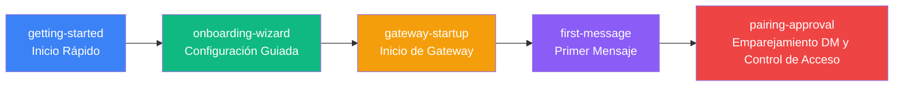

# Inicio Rápido: Desde la Instalación hasta el Primer Mensaje

¡Bienvenido a Clawdbot! Esta sección te guiará a través del proceso completo para comenzar a usar Clawdbot desde cero. Ya sea que quieras experimentar rápidamente con el asistente de IA o comprender en profundidad las opciones de configuración, aquí encontrarás los tutoriales correspondientes.

---

## Descripción General de la Sección

Esta sección contiene 5 tutoriales que cubren el proceso completo de inicio con Clawdbot: desde la instalación del software, la configuración de modelos de IA y canales de comunicación, hasta el inicio del proceso demonio Gateway, el envío del primer mensaje y finalmente la comprensión del mecanismo de protección de seguridad predeterminado. Al completar esta sección, tendrás un asistente de IA personal funcional.

---

## Ruta de Aprendizaje Recomendada

Te recomendamos seguir este orden para aprender estos tutoriales:

**Explicación del Orden de Aprendizaje**:

1. **Inicio Rápido** (Obligatorio): Completa la instalación y configuración básica; este es el requisito previo para todo el aprendizaje posterior
2. **Configuración Guiada** (Recomendado): Profundiza en las diversas opciones del asistente; adecuado para usuarios que desean una configuración detallada
3. **Inicio de Gateway** (Obligatorio): Aprende cómo iniciar y gestionar el proceso demonio Gateway
4. **Envío del Primer Mensaje** (Obligatorio): Verifica si la configuración es correcta y comienza a usar el asistente de IA
5. **Emparejamiento DM y Control de Acceso** (Recomendado): Comprende el mecanismo de seguridad predeterminado para proteger tu asistente de IA

::: tip Vía Rápida
Si solo quieres una experiencia rápida, puedes aprender únicamente los tutoriales de "Inicio Rápido" e "Inicio de Gateway", y luego enviar mensajes directamente. Los demás tutoriales puedes aprenderlos según tus necesidades posteriormente.
:::

---

## Requisitos Previos

Antes de aprender esta sección, asegúrate de:

- **Node.js**: ≥ 22.12.0 (verifica con `node -v`)
- **Sistema Operativo**: macOS / Linux / Windows (WSL2)
- **Gestor de Paquetes**: npm / pnpm / bun
- **Cuenta de Modelo de IA** (Recomendado):
  - Cuenta de Anthropic Claude (suscripción Pro/Max), compatible con flujo OAuth
  - O prepara una API Key de proveedores como OpenAI / DeepSeek / OpenRouter

::: warning Nota para Usuarios de Windows
En Windows, se recomienda encarecidamente usar **WSL2**, porque:
- Muchos canales dependen de archivos binarios locales
- Los demonios (launchd/systemd) no están disponibles en Windows
:::

---

## Navegación de Subpáginas

### [1. Inicio Rápido](./getting-started/) ⭐ Tutorial Principal

**Qué podrás hacer al completarlo**:
- ✅ Instalar Clawdbot en tu dispositivo
- ✅ Configurar la autenticación del modelo de IA (Anthropic / OpenAI / otros proveedores)
- ✅ Iniciar el proceso demonio Gateway
- ✅ Enviar el primer mensaje a través de WebChat o los canales configurados

**Apto para**: Todos los usuarios; tutorial de lectura obligatoria

**Tiempo estimado**: 15-20 minutos

**Contenido Principal**:
- Instalar Clawdbot usando npm/pnpm/bun
- Ejecutar el asistente de onboarding para completar la configuración básica
- Iniciar Gateway y verificar el estado
- Enviar mensajes de prueba a través de CLI o canales

**Requisitos Previos**: Ninguno

---

### [2. Configuración Guiada](./onboarding-wizard/)

**Qué podrás hacer al completarlo**:
- ✅ Usar el asistente interactivo para completar la configuración completa
- ✅ Entender la diferencia entre los modos QuickStart y Manual
- ✅ Configurar la red del Gateway, autenticación y Tailscale
- ✅ Configurar proveedores de modelos de IA (setup-token y API Key)
- ✅ Habilitar canales de comunicación (WhatsApp, Telegram, etc.)
- ✅ Instalar y gestionar paquetes de habilidades

**Apto para**: Usuarios que desean una configuración detallada y conocer opciones avanzadas

**Tiempo estimado**: 20-30 minutos

**Contenido Principal**:
- Selección entre modos QuickStart vs Manual
- Configuración de red del Gateway (puerto, binding, autenticación)
- Métodos de autenticación de modelos de IA (se recomienda setup-token)
- Proceso de configuración de canales de comunicación
- Introducción al sistema de habilidades

**Requisitos Previos**: [Inicio Rápido](./getting-started/)

---

### [3. Inicio de Gateway](./gateway-startup/) ⭐ Tutorial Principal

**Qué podrás hacer al completarlo**:
- ✅ Usar la línea de comandos para iniciar el proceso frontal del Gateway
- ✅ Configurar el Gateway como demonio en segundo plano (macOS LaunchAgent / Linux systemd / Windows Scheduled Task)
- ✅ Entender los diferentes modos de binding (loopback / LAN / Tailnet) y métodos de autenticación
- ✅ Cambiar entre modo de desarrollo y modo de producción
- ✅ Usar `--force` para liberar forzosamente puertos ocupados

**Apto para**: Todos los usuarios; tutorial de lectura obligatoria

**Tiempo estimado**: 15-20 minutos

**Contenido Principal**:
- Modo frontal vs modo demonio
- Selección de modos de binding (loopback / LAN / Tailnet / Auto)
- Configuración de métodos de autenticación (Token / Password / Tailscale Identity)
- Modo de desarrollo (`--dev`) y modo de producción
- Comandos de gestión de servicios (install / start / stop / restart)
- Manejo de conflictos de puerto (`--force`)

**Requisitos Previos**: [Configuración Guiada](./onboarding-wizard/)

---

### [4. Enviar el Primer Mensaje](./first-message/) ⭐ Tutorial Principal

**Qué podrás hacer al completarlo**:
- ✅ Enviar mensajes a través de la interfaz WebChat
- ✅ Conversar con el asistente de IA a través de canales configurados (WhatsApp / Telegram / Slack, etc.)
- ✅ Comprender el enrutamiento de mensajes y el flujo de respuestas
- ✅ Usar el asistente de IA para ejecutar tareas básicas (consultas, resúmenes, generación de código, etc.)

**Apto para**: Todos los usuarios; tutorial de lectura obligatoria

**Tiempo estimado**: 10-15 minutos

**Contenido Principal**:
- Uso de la interfaz WebChat
- Métodos de envío de mensajes en cada canal
- Formato de mensajes y mecanismo de respuesta
- Ejemplos de tareas comunes (consultar información, generar código, resumir texto)
- Depuración y solución de problemas

**Requisitos Previos**: [Inicio de Gateway](./gateway-startup/)

---

### [5. Emparejamiento DM y Control de Acceso](./pairing-approval/)

**Qué podrás hacer al completarlo**:
- ✅ Comprender el mecanismo de protección de emparejamiento DM predeterminado
- ✅ Aprobar o rechazar solicitudes de emparejamiento de remitentes desconocidos
- ✅ Configurar listas blancas y negras
- ✅ Establecer políticas de control de acceso
- ✅ Comprender los modos de emparejamiento y mejores prácticas de seguridad

**Apto para**: Usuarios preocupados por la seguridad; aprendizaje recomendado

**Tiempo estimado**: 10-15 minutos

**Contenido Principal**:
- Principio del mecanismo de emparejamiento DM
- Flujo de emparejamiento y experiencia de usuario
- Configuración de listas blancas y negras
- Configuración de políticas de control de acceso
- Mejores prácticas de seguridad

**Requisitos Previos**: [Enviar el Primer Mensaje](./first-message/)

---

## Preguntas Frecuentes

### P: ¿Debo aprender todos los tutoriales?

**R**: No necesariamente. Si quieres comenzar rápidamente, solo necesitas aprender los tutoriales principales de "Inicio Rápido" e "Inicio de Gateway", y luego puedes empezar a usar Clawdbot. Los demás tutoriales puedes aprenderlos según tus necesidades.

### P: ¿Tendré problemas si omito algunos tutoriales?

**R**: No. Cada tutorial es independiente, pero "Inicio Rápido" es la base e incluye la instalación y configuración básica, por lo que se recomienda aprenderlo primero. Los demás tutoriales puedes seleccionarlos según tus necesidades.

### P: Ya estoy familiarizado con los asistentes de IA, ¿puedo omitir los tutoriales básicos?

**R**: Sí. Si ya estás familiarizado con herramientas similares de asistentes de IA, puedes omitir "Inicio Rápido" e ir directamente a "Configuración Guiada" e "Inicio de Gateway" para conocer la configuración y métodos de inicio específicos de Clawdbot.

### P: ¿Qué puedo hacer después de completar esta sección?

**R**: Al completar esta sección, tendrás un sistema Clawdbot funcional, capaz de:
- Conversar con el asistente de IA a través de WebChat o múltiples canales
- Hacer que la IA ejecute tareas básicas (consultar información, generar código, resumir texto, etc.)
- Usar el mecanismo de emparejamiento DM para proteger la seguridad
- Continuar aprendiendo funciones avanzadas (configuración multicanal, sistema de herramientas, plataforma de habilidades, etc.)

---

## Guía de Próximos Pasos

Después de completar esta sección, puedes continuar aprendiendo:

- **[Descripción General del Sistema Multicanal](../../platforms/channels-overview/)**: Conoce todos los canales de comunicación compatibles con Clawdbot y sus características
- **[Canal WhatsApp](../../platforms/whatsapp/)**: Aprende en profundidad la configuración y uso del canal WhatsApp
- **[Canal Telegram](../../platforms/telegram/)**: Aprende en profundidad la configuración y uso del canal Telegram
- **[Interfaz WebChat](../../platforms/webchat/)**: Conoce las funciones de la interfaz WebChat integrada

::: tip Consejo
Según tus necesidades de uso, elige el canal correspondiente para un aprendizaje profundo. Si usas principalmente un canal específico (como WhatsApp o Telegram), puedes priorizar el tutorial especializado de ese canal.
:::
