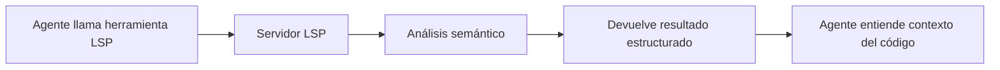
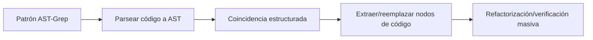

# LSP y AST-Grep: Capacidades de análisis y manipulación de código a nivel IDE

## Lo que podrás hacer después de este curso

- Usar herramientas LSP para navegar por el código, buscar símbolos y obtener información de diagnóstico
- Usar AST-Grep para búsqueda y reemplazo preciso de patrones de código
- Entender las diferencias entre LSP y AST-Grep y sus casos de uso
- Dotar al agente de capacidades de comprensión y manipulación de código a nivel IDE

## Tu situación actual

Las herramientas tradicionales de búsqueda y refactorización de código tienen limitaciones evidentes:

| Problema | Solución tradicional | Necesidad real |
|--- | --- | ---|
| **Navegación de símbolos imprecisa** | Coincidencia simple de cadenas | Necesita entender la semántica del código, saltar a la definición real |
| **Búsqueda de referencias incompleta** | Búsqueda con expresiones regulares | Necesita seguimiento preciso de referencias entre archivos y ámbitos |
| **Refactorización insegura** | Reemplazo manual + grep | Necesita entender la estructura del código, evitar modificaciones destructivas |
| **Coincidencia de patrones torpe** | Expresiones regulares | Necesita coincidencia de patrones estructurada basada en AST |

::: info Conceptos clave
**LSP (Language Server Protocol)** es un protocolo estándar entre IDEs y servidores de lenguaje que proporciona funciones como autocompletado, ir a definición, buscar referencias, renombrar símbolos, obtener diagnósticos y esquema de símbolos a través de una interfaz unificada, dotando al editor de potentes capacidades de comprensión de código, además de soportar información de tipos, relaciones de herencia y otras características avanzadas. **AST-Grep** es una herramienta de coincidencia de patrones de código basada en árboles de sintaxis abstracta, capaz de entender la estructura del código en lugar de solo texto, soporta coincidencia flexible de patrones y refactorización masiva usando metavariables (como `$VAR` para coincidir con un nodo, `$$$` para coincidir con múltiples nodos), cubre 25 lenguajes de programación (incluyendo TypeScript, Python, Go, Rust, etc.), siendo una herramienta poderosa para refactorización de código, verificación de estándares y búsqueda estructurada.
:::

## Cuándo usar esta técnica

| Herramienta | Caso de uso | Ejemplo |
|--- | --- | ---|
| **Herramientas LSP** | Cuando necesitas funciones de IDE | Ir a definición, buscar todas las referencias, obtener lista de errores, renombrar símbolos |
| **AST-Grep** | Cuando necesitas coincidencia de patrones de código | Buscar estructuras de código específicas, refactorización masiva, verificar estándares de código |
| **Grep/Glob** | Búsqueda simple de texto | Buscar nombres de funciones, coincidencia de nombres de archivos |

## 🎒 Preparación antes de empezar

Antes de usar las herramientas LSP y AST-Grep, asegúrate de:

1. **Tener instalado el Language Server**
   - TypeScript/JavaScript: `npm install -g typescript-language-server`
   - Python: `pip install basedpyright` o `pip install ruff`
   - Go: `go install golang.org/x/tools/gopls@latest`
   - Rust: `rustup component add rust-analyzer`

2. **Tener instalado AST-Grep CLI**
   ```bash
   bun add -D @ast-grep/cli
   ```

3. **Tener configurado el servidor LSP**
   - La configuración del servidor LSP está en `opencode.json` de OpenCode
   - oh-my-opencode leerá y usará automáticamente estas configuraciones

::: tip Verificar entorno
Usa los siguientes comandos para verificar el entorno:
```bash
# Verificar servidor LSP
oh-my-opencode doctor

# Verificar AST-Grep
which sg
```
:::

## Idea central

### Herramientas LSP: Comprensión de código a nivel IDE

Las herramientas LSP dotan al agente de IA de las mismas capacidades de comprensión de código que un IDE:



**Ventajas principales**:
- ✅ Comprensión semántica, no simple coincidencia de cadenas
- ✅ Seguimiento preciso entre archivos y ámbitos
- ✅ Soporte para información de tipos, relaciones de herencia y otras características avanzadas
- ✅ Completamente consistente con la configuración del proyecto (usa el mismo servidor LSP)

### AST-Grep: Coincidencia estructurada de patrones de código

AST-Grep permite al agente de IA realizar coincidencia precisa de estructuras de código:



**Ventajas principales**:
- ✅ Basado en estructura de código, no en texto
- ✅ Soporte para metavariables (`$VAR`, `$$$`) para coincidencia de patrones
- ✅ Soporte para múltiples lenguajes (25)
- ✅ Puede usarse para refactorización, verificación y validación de estándares de código

## Sígueme

### Paso 1: Usar LSP para ir a definición

**Por qué**
Cuando necesitas ver la ubicación de definición de un símbolo, la herramienta `goto_definition` de LSP proporciona navegación precisa, más confiable que la búsqueda de cadenas.

En OpenCode, el agente puede llamar automáticamente:

```typescript
// El agente llamará automáticamente
lsp_goto_definition({
  filePath: "src/utils.ts",
  line: 15,
  character: 10
})
```

**Deberías ver**:
```
→ Definition found:
  File: src/types.ts
  Line: 45
  Text: export interface UserConfig {
```

::: tip Uso real
No necesitas llamar estas herramientas manualmente, el agente de IA las usará automáticamente para entender el código. Puedes preguntar directamente: "Ir a la definición de esta función" o "¿Dónde está definida esta variable?"
:::

### Paso 2: Buscar todas las referencias

**Por qué**
Cuando necesitas modificar un símbolo, buscar primero todas las referencias asegura que la modificación no rompa otros usos.

El agente puede llamar:

```typescript
lsp_find_references({
  filePath: "src/api.ts",
  line: 10,
  character: 5,
  includeDeclaration: true  // Si incluir la definición misma
})
```

**Deberías ver**:
```
Found 15 references (showing first 200):
  src/api.ts:10:5  - [definition] fetchData
  src/components/List.tsx:23:12 - [usage] fetchData()
  src/pages/Home.tsx:45:8 - [usage] fetchData()
  ...
```

### Paso 3: Obtener símbolos de archivo y espacio de trabajo

**Por qué**
Entender la estructura del archivo o buscar tipos específicos de símbolos en todo el proyecto, la herramienta `lsp_symbols` es muy útil.

**Esquema de archivo** (scope="document"):

```typescript
lsp_symbols({
  filePath: "src/app.tsx",
  scope: "document"
})
```

**Deberías ver**:
```
Found 12 symbols:
  [Component] App (line: 10-150)
    [Function] useEffect (line: 25-35)
    [Function] handleClick (line: 40-55)
    [Variable] count (line: 15)
  ...
```

**Búsqueda en espacio de trabajo** (scope="workspace"):

```typescript
lsp_symbols({
  filePath: "src/app.tsx",
  scope: "workspace",
  query: "fetchData"
})
```

### Paso 4: Obtener información de diagnóstico

**Por qué**
Antes de ejecutar el código, la herramienta de diagnóstico LSP puede detectar errores, advertencias y sugerencias de antemano.

```typescript
lsp_diagnostics({
  filePath: "src/utils.ts",
  severity: "error"  // Opcional: "error", "warning", "information", "hint", "all"
})
```

**Deberías ver**:
```
Found 3 diagnostics:
  [Error] src/utils.ts:23:5 - 'result' is used before being assigned
  [Warning] src/utils.ts:45:12 - Unused variable 'temp'
  [Hint] src/utils.ts:67:8 - This can be simplified to const x = value
```

::: tip Pre-verificación
Hacer que el agente de IA use `lsp_diagnostics` para verificar problemas potenciales antes de escribir código puede evitar modificaciones repetidas.
:::

### Paso 5: Renombrar símbolos de forma segura

**Por qué**
Renombrar símbolos es una operación de refactorización común, pero el reemplazo manual es propenso a errores. La herramienta `lsp_rename` de LSP puede renombrar símbolos de forma segura en todo el espacio de trabajo.

**Paso 1: Validar renombrado**

```typescript
lsp_prepare_rename({
  filePath: "src/api.ts",
  line: 10,
  character: 5
})
```

**Deberías ver**:
```
Rename validation:
  Current name: fetchData
  Placeholder range: line 10, column 5-14
  Status: ✅ Valid
```

**Paso 2: Ejecutar renombrado**

```typescript
lsp_rename({
  filePath: "src/api.ts",
  line: 10,
  character: 5,
  newName: "fetchUserData"
})
```

**Deberías ver**:
```
Applied rename to 15 files:
  src/api.ts:10:5 - fetchData → fetchUserData
  src/components/List.tsx:23:12 - fetchData() → fetchUserData()
  src/pages/Home.tsx:45:8 - fetchData → fetchUserData()
  ...
```

### Paso 6: Usar AST-Grep para buscar patrones de código

**Por qué**
Cuando necesitas buscar estructuras de código específicas (como todos los lugares que usan `console.log`), AST-Grep es más preciso que grep.

**Búsqueda básica de patrones**:

```typescript
ast_grep_search({
  pattern: "console.log($MSG)",
  lang: "typescript",
  paths: ["src"],
  context: 2  // Mostrar líneas de contexto antes y después de la coincidencia
})
```

**Deberías ver**:
```
src/utils.ts:15:
  13 | function debug(message) {
  14 |   console.log(message)
  15 |   console.log("Debug mode")
  16 | }
  17 | }

src/components/App.tsx:23:
  21 | useEffect(() => {
  22 |   console.log("Component mounted")
  23 | }, [])
```

**Usando metavariables**:

```typescript
// Coincidir con todas las llamadas a funciones
ast_grep_search({
  pattern: "$FUNC($$$)",
  lang: "typescript",
  paths: ["src"]
})
```

```typescript
// Coincidir con todas las funciones asíncronas
ast_grep_search({
  pattern: "async function $NAME($$$) { $$$ }",
  lang: "typescript",
  paths: ["src"]
})
```

::: warning Importante: El patrón debe ser un nodo AST completo
❌ Incorrecto: `export async function $NAME`
✅ Correcto: `export async function $NAME($$$) { $$$ }`

El patrón debe ser un fragmento de código válido, incluyendo la firma completa de la función y el cuerpo.
:::

### Paso 7: Usar AST-Grep para reemplazo masivo

**Por qué**
Cuando necesitas refactorizar código masivamente (como reemplazar todos los `console.log` por `logger.info`), la función de reemplazo de AST-Grep es muy poderosa.

**Vista previa del reemplazo** (dry-run):

```typescript
ast_grep_replace({
  pattern: "console.log($MSG)",
  rewrite: "logger.info($MSG)",
  lang: "typescript",
  paths: ["src"],
  dryRun: true  // Por defecto true, solo vista previa sin modificar
})
```

**Deberías ver**:
```
Preview changes (dry-run):
  src/utils.ts:15:2 - console.log("Debug mode")
                 → logger.info("Debug mode")
  src/components/App.tsx:23:4 - console.log("Component mounted")
                              → logger.info("Component mounted")

Total: 2 changes
```

**Aplicar reemplazo**:

```typescript
ast_grep_replace({
  pattern: "console.log($MSG)",
  rewrite: "logger.info($MSG)",
  lang: "typescript",
  paths: ["src"],
  dryRun: false  // Establecer en false para aplicar cambios
})
```

**Deberías ver**:
```
Applied 2 changes:
  src/utils.ts:15:2 - console.log("Debug mode")
                 → logger.info("Debug mode")
  src/components/App.tsx:23:4 - console.log("Component mounted")
                              → logger.info("Component mounted")
```

::: danger Operación destructiva
`ast_grep_replace` con `dryRun: false` modificará archivos directamente. Se recomienda:
1. Primero usar `dryRun: true` para vista previa
2. Aplicar después de confirmar que es correcto
3. Si el proyecto usa Git, primero hacer commit del estado actual
:::

## Punto de verificación ✅

**Verificar herramientas LSP**:
- [ ] ¿Puedes ir a la definición de un símbolo?
- [ ] ¿Puedes buscar todas las referencias?
- [ ] ¿Puedes obtener información de diagnóstico?
- [ ] ¿Puedes renombrar símbolos de forma segura?

**Verificar herramientas AST-Grep**:
- [ ] ¿Puedes buscar patrones de código?
- [ ] ¿Puedes usar metavariables para coincidencia?
- [ ] ¿Puedes previsualizar y ejecutar reemplazos?

## Advertencias de errores comunes

### Problemas comunes con herramientas LSP

| Problema | Causa | Solución |
|--- | --- | ---|
| **No encuentra definición** | Servidor LSP no iniciado o configuración incorrecta | Verificar configuración LSP en `opencode.json` |
| **Lista de referencias incompleta** | Errores en el código, servidor LSP no analizó completamente | Primero corregir errores en el código |
| **Fallo en renombrado** | Nuevo nombre conflicta con símbolo existente | Usar un nombre más específico |

### Problemas comunes con AST-Grep

| Problema | Causa | Solución |
|--- | --- | ---|
| **Patrón no coincide** | Patrón incompleto o error de sintaxis | Asegurar que el patrón sea un nodo AST completo |
| **Dos puntos finales en patrón Python** | `def` y `class` de Python no necesitan dos puntos | ❌ `def func():` → ✅ `def func($$$):` |
| **Demasiadas coincidencias** | Patrón demasiado amplio | Usar contexto más específico o limitar rutas |

### Sugerencias de optimización de rendimiento

```typescript
// ✅ Bueno: Limitar alcance de búsqueda
ast_grep_search({
  pattern: "$FUNC($$$)",
  lang: "typescript",
  paths: ["src/api"],  // Solo buscar en directorio específico
  globs: ["*.ts"]      // Solo coincidir archivos específicos
})

// ❌ Malo: Buscar en todo el proyecto
ast_grep_search({
  pattern: "$FUNC($$$)",
  lang: "typescript",
  paths: ["./"]  // Buscar todos los archivos
})
```

## Lista completa de herramientas LSP

| Herramienta | Función | Parámetros |
|--- | --- | ---|
| `lsp_goto_definition` | Ir a definición de símbolo | `filePath`, `line`, `character` |
| `lsp_find_references` | Buscar todas las referencias | `filePath`, `line`, `character`, `includeDeclaration?` |
| `lsp_symbols` | Obtener esquema de archivo o símbolos del espacio de trabajo | `filePath`, `scope`, `query?`, `limit?` |
| `lsp_diagnostics` | Obtener errores y advertencias | `filePath`, `severity?` |
| `lsp_prepare_rename` | Validar operación de renombrado | `filePath`, `line`, `character` |
| `lsp_rename` | Ejecutar operación de renombrado | `filePath`, `line`, `character`, `newName` |

**Limitaciones**:
- Máximo 200 símbolos, referencias o diagnósticos devueltos (configurable)
- El servidor LSP debe estar configurado y ejecutándose

## Lista completa de herramientas AST-Grep

| Herramienta | Función | Parámetros |
|--- | --- | ---|
| `ast_grep_search` | Búsqueda de patrones AST | `pattern`, `lang`, `paths?`, `globs?`, `context?` |
| `ast_grep_replace` | Reemplazo de patrones AST | `pattern`, `rewrite`, `lang`, `paths?`, `globs?`, `dryRun?` |

**Lenguajes soportados** (25):
`bash`, `c`, `cpp`, `csharp`, `css`, `elixir`, `go`, `haskell`, `html`, `java`, `javascript`, `json`, `kotlin`, `lua`, `nix`, `php`, `python`, `ruby`, `rust`, `scala`, `solidity`, `swift`, `typescript`, `tsx`, `yaml`

**Metavariables**:
- `$VAR` - Coincidir con un solo nodo
- `$$$` - Coincidir con múltiples nodos

## Casos prácticos

### Caso 1: Refactorizar llamadas API

**Escenario**: Agregar manejo de errores a todas las llamadas `fetch`

**Usar AST-Grep para buscar patrón**:

```typescript
ast_grep_search({
  pattern: "fetch($URL).then($RES => $BODY)",
  lang: "typescript",
  paths: ["src/api"]
})
```

**Usar AST-Grep para reemplazar**:

```typescript
ast_grep_replace({
  pattern: "fetch($URL).then($RES => $BODY)",
  rewrite: "fetch($URL).then($RES => $BODY).catch(err => handleError(err))",
  lang: "typescript",
  paths: ["src/api"],
  dryRun: true  // Primero vista previa
})
```

### Caso 2: Buscar imports no utilizados

**Usar LSP para buscar referencias**:

```typescript
// Para cada import
lsp_find_references({
  filePath: "src/utils.ts",
  line: 1,  // Línea donde está el import
  character: 10
})

// Si solo devuelve 1 referencia (el import mismo), no está siendo usado
```

### Caso 3: Renombrar variable de configuración

**Paso 1: Validar renombrado**

```typescript
lsp_prepare_rename({
  filePath: "src/config.ts",
  line: 10,
  character: 4
})
```

**Paso 2: Ejecutar renombrado**

```typescript
lsp_rename({
  filePath: "src/config.ts",
  line: 10,
  character: 4,
  newName: "API_BASE_URL"
})
```

## Resumen de la lección

Esta lección presentó las herramientas LSP y AST-Grep de oh-my-opencode:

**Herramientas LSP**:
- Proporcionan capacidades de comprensión y manipulación de código a nivel IDE
- Soportan ir a definición, buscar referencias, obtener diagnósticos, renombrar símbolos
- Usan el servidor LSP configurado en el proyecto, comportamiento consistente con el IDE

**Herramientas AST-Grep**:
- Coincidencia estructurada de patrones de código basada en AST
- Soporte para metavariables para coincidencia flexible
- Soporte para reemplazo y refactorización masiva

**Mejores prácticas**:
- LSP para escenarios que requieren comprensión semántica
- AST-Grep para refactorización estructurada de código
- Usar dryRun para vista previa antes de reemplazar

## Adelanto de la próxima lección

> En la próxima lección aprenderemos **[Categories y Skills: Combinación dinámica de agentes](../categories-skills/)**.
>
> Aprenderás:
> - Cómo usar Categories para seleccionar automáticamente el modelo óptimo
> - Cómo combinar diferentes Skills para crear agentes especializados
> - Escenarios de aplicación práctica de las nuevas características de v3.0

---

## Apéndice: Referencia del código fuente

<details>
<summary><strong>Haz clic para expandir y ver ubicaciones del código fuente</strong></summary>

> Fecha de actualización: 2026-01-26

### Herramientas LSP

| Función | Ruta del archivo | Líneas |
|--- | --- | ---|
| Definición de herramientas LSP | [`src/tools/lsp/tools.ts`](https://github.com/code-yeongyu/oh-my-opencode/blob/main/src/tools/lsp/tools.ts) | 29-261 |
| Implementación del cliente LSP | [`src/tools/lsp/client.ts`](https://github.com/code-yeongyu/oh-my-opencode/blob/main/src/tools/lsp/client.ts) | 1-596 |
| Definición de constantes LSP | [`src/tools/lsp/constants.ts`](https://github.com/code-yeongyu/oh-my-opencode/blob/main/src/tools/lsp/constants.ts) | 1-391 |
| Definición de tipos LSP | [`src/tools/lsp/types.ts`](https://github.com/code-yeongyu/oh-my-opencode/blob/main/src/tools/lsp/types.ts) | 1-246 |

### Herramientas AST-Grep

| Función | Ruta del archivo | Líneas |
|--- | --- | ---|
|--- | --- | ---|
|--- | --- | ---|
|--- | --- | ---|
|--- | --- | ---|

**Constantes clave**:
- `DEFAULT_MAX_REFERENCES = 200` - Número máximo de referencias devueltas
- `DEFAULT_MAX_SYMBOLS = 200` - Número máximo de símbolos devueltos
- `DEFAULT_MAX_DIAGNOSTICS = 200` - Número máximo de diagnósticos devueltos
- `CLI_LANGUAGES` - Lista de 25 lenguajes soportados
- `DEFAULT_MAX_MATCHES = 500` - Número máximo de coincidencias de AST-Grep

**Funciones de herramientas clave**:
- `withLspClient()` - Obtener cliente LSP y ejecutar operación
- `runSg()` - Ejecutar comando CLI de AST-Grep
- `formatLocation()` - Formatear información de ubicación
- `formatDiagnostic()` - Formatear información de diagnóstico

**Servidores LSP soportados** (parcial):
- TypeScript: `typescript-language-server`
- Python: `basedpyright`, `pyright`, `ty`, `ruff`
- Go: `gopls`
- Rust: `rust-analyzer`
- C/C++: `clangd`

</details>
