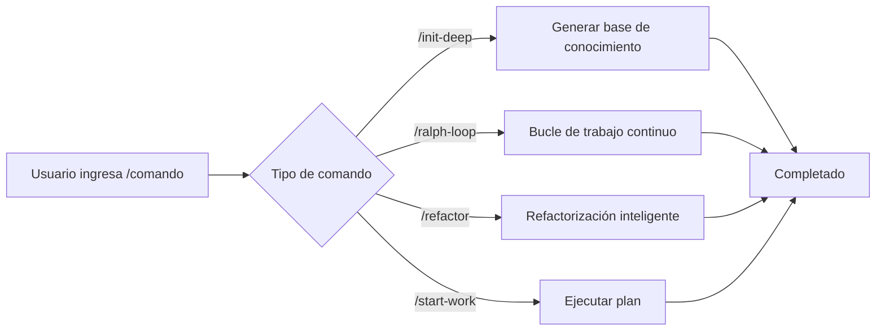

# Comandos Slash: Flujos de Trabajo Preestablecidos para Ejecución con Un Clic

## Lo Que Aprenderás

- Usa `/init-deep` para generar la base de conocimiento del proyecto con un clic
- Usa `/ralph-loop` para que los agentes trabajen continuamente hasta completar las tareas
- Ejecuta refactorización inteligente con `/refactor`, validando automáticamente cada paso
- Usa `/start-work` para iniciar el desarrollo sistemático desde planes de Prometheus

## Tu Desafío Actual

Al ejecutar repetidamente las mismas tareas complejas, tienes que escribir instrucciones largas cada vez:

```
"Por favor, ayúdame a analizar la estructura de este proyecto, encontrar todos los módulos clave, generar AGENTS.md para cada directorio, luego explorar en paralelo los patrones del código base..."
```

Estas instrucciones largas pierden tiempo y son propensas a omitir pasos.

## Cuándo Usar Este Enfoque

Los **comandos slash** son plantillas de flujo de trabajo preestablecidas que activan tareas complejas con un clic. Estos comandos cubren escenarios comunes de desarrollo:

| Escenario | Comando a Usar |
|--- | ---|
| Inicializar base de conocimiento del proyecto | `/init-deep` |
| Hacer que la IA trabaje continuamente | `/ralph-loop` |
| Refactorizar código inteligentemente | `/refactor` |
| Comenzar a trabajar desde un plan | `/start-work` |

## Conceptos Clave

Los **comandos slash** son plantillas de flujo de trabajo predefinidas que ejecutan tareas complejas rápidamente a través de palabras clave que comienzan con `/`.

**Cómo funciona**:



oh-my-opencode incluye 6 comandos slash integrados:

| Comando | Función | Complejidad |
|--- | --- | ---|
| `/init-deep` | Generar archivos AGENTS.md jerárquicos | Media |
| `/ralph-loop` | Bucle de desarrollo auto-referencial | Alta |
| `/ulw-loop` | Versión Ultrawork de ralph-loop | Alta |
| `/cancel-ralph` | Cancelar Ralph Loop activo | Baja |
| `/refactor` | Refactorización inteligente con toolchain completo | Alta |
| `/start-work` | Comenzar a trabajar desde plan de Prometheus | Media |

::: info Comandos Personalizados
Además de los comandos integrados, puedes crear comandos personalizados (archivos Markdown) en los directorios `.opencode/command/` o `.claude/commands/`.
:::

## 🎒 Requisitos Previos

- ✅ oh-my-opencode instalado
- ✅ Al menos un Proveedor de IA configurado
- ✅ Comprensión básica del uso de agentes (se recomienda aprender primero [Introducción a Sisyphus: El Orquestador Principal](../sisyphus-orchestrator/))

## Sigue los Pasos

### Paso 1: Generar Base de Conocimiento del Proyecto

**Por qué**
Los agentes IA necesitan entender la estructura y convenciones del proyecto para trabajar eficientemente. El comando `/init-deep` analiza automáticamente el proyecto y genera archivos AGENTS.md jerárquicos.

**Ingresa en OpenCode**:

```
/init-deep
```

**Deberías Ver**: El agente comienza el análisis en paralelo de la estructura del proyecto, explora patrones de código y genera archivos AGENTS.md.

**Uso Avanzado**:

```bash
# Regenerar todos los archivos (eliminar existentes)
/init-deep --create-new

# Limitar profundidad de generación
/init-deep --max-depth=2
```

**Ejemplo de Salida**:

```
=== init-deep Completado ===

Modo: update

Archivos:
  [OK] ./AGENTS.md (raíz, 120 líneas)
  [OK] ./src/hooks/AGENTS.md (45 líneas)
  [OK] ./src/agents/AGENTS.md (38 líneas)

Dirs Analizados: 12
AGENTS.md Creados: 3
```

### Paso 2: Hacer que la IA Trabaje Continuamente

**Por qué**
Algunas tareas requieren múltiples iteraciones para completarse (como corregir errores complejos). El comando `/ralph-loop` hace que el agente trabaje continuamente hasta que la tarea esté terminada, en lugar de detenerse a mitad de camino.

**Ingresa en OpenCode**:

```
/ralph-loop "Corrige el problema de autenticación en la página de inicio de sesión, asegúrate de que todos los casos de error estén manejados"
```

**Deberías Ver**: El agente comienza a trabajar y continúa automáticamente después de completar hasta que se emita el marcador de finalización.

**Uso Avanzado**:

```bash
# Marcador de finalización personalizado
/ralph-loop "Escribe pruebas unitarias" --completion-promise="TESTS_DONE"

# Limitar iteraciones máximas
/ralph-loop "Optimizar rendimiento" --max-iterations=50
```

**Versión Ultrawork** (activa todos los agentes profesionales):

```bash
/ulw-loop "Desarrollar API REST con autenticación, autorización y limitación de tasa"
```

**Punto de Control** ✅

- ¿El agente continúa automáticamente después de cada iteración?
- ¿Ves el mensaje "Ralph Loop Complete!" cuando termina?

### Paso 3: Cancelar Bucle

**Por qué**
Si la dirección de la tarea es incorrecta o deseas intervención manual, necesitas cancelar el bucle.

**Ingresa en OpenCode**:

```
/cancel-ralph
```

**Deberías Ver**: El bucle se detiene y los archivos de estado se limpian.

### Paso 4: Refactorización Inteligente

**Por qué**
Al refactorizar código, las modificaciones a ciegas pueden introducir errores. El comando `/refactor` usa un toolchain completo (LSP, AST-Grep, validación de pruebas) para garantizar una refactorización segura.

**Ingresa en OpenCode**:

```bash
# Renombrar símbolo
/refactor "Refactorizar clase AuthService a UserService"

# Refactorizar módulo
/refactor src/auth --scope=module --strategy=safe

# Refactorización por coincidencia de patrones
/refactor "Migrar todos los lugares que usan la API obsoleta a la nueva API"
```

**Deberías Ver**: El agente ejecuta un proceso de refactorización de 6 fases:

1. **Gateway de Intención** - Confirmar objetivos de refactorización
2. **Análisis del Código Base** - Exploración en paralelo de dependencias
3. **Construcción de Mapa de Código** - Mapear alcance de impacto
4. **Evaluación de Pruebas** - Verificar cobertura de pruebas
5. **Generación de Plan** - Crear plan detallado de refactorización
6. **Ejecutar Refactorización** - Ejecución paso a paso con validación

**Uso Avanzado**:

```bash
# Estrategia agresiva (permite cambios mayores)
/refactor "Refactorización de arquitectura" --strategy=aggressive

# Alcance de archivo
/refactor "Optimizar funciones en utils.ts" --scope=file
```

::: warning Requisito de Cobertura de Pruebas
Si la cobertura de pruebas del código objetivo es inferior al 50%, `/refactor` se negará a ejecutar la estrategia agresiva. Se recomienda agregar pruebas primero.
:::

### Paso 5: Comenzar a Trabajar desde un Plan

**Por qué**
Después de planificar con Prometheus, necesitas ejecutar sistemáticamente las tareas del plan. El comando `/start-work` carga automáticamente el plan y usa el agente Atlas para ejecutarlo.

**Ingresa en OpenCode**:

```bash
# Seleccionar automáticamente un solo plan
/start-work

# Seleccionar plan específico
/start-work "auth-api-plan"
```

**Deberías Ver**:

- Si solo hay un plan: Seleccionar automáticamente y comenzar ejecución
- Si hay múltiples planes: Listar todos los planes para selección

**Ejemplo de Salida**:

```
Planes de Trabajo Disponibles

Hora Actual: 2026-01-26T10:30:00Z
ID de Sesión: abc123

1. [auth-api-plan.md] - Modificado: 2026-01-25 - Progreso: 3/10 tareas
2. [migration-plan.md] - Modificado: 2026-01-26 - Progreso: 0/5 tareas

¿Qué plan te gustaría trabajar? (Ingresa número o nombre del plan)
```

**Punto de Control** ✅

- ¿El plan se carga correctamente?
- ¿Las tareas se ejecutan en orden?
- ¿Las tareas completadas están marcadas?

## Errores Comunes

### Error 1: `/init-deep` Ignora Archivos Existentes

**Problema**: En modo predeterminado, `/init-deep` preserva los archivos AGENTS.md existentes, solo actualizando o creando partes faltantes.

**Solución**: Usa el parámetro `--create-new` para regenerar todos los archivos.

### Error 2: Bucle Infinito de `/ralph-loop`

**Problema**: Si el agente no puede completar la tarea, el bucle continúa hasta el conteo máximo de iteraciones (predeterminado 100).

**Solución**:
- Establece un `--max-iterations` razonable (por ejemplo, 20-30)
- Usa `/cancel-ralph` para cancelar manualmente
- Proporciona una descripción de tarea más clara

### Error 3: Baja Cobertura de Pruebas en `/refactor`

**Problema**: El código objetivo no tiene pruebas, la refactorización fallará.

**Solución**:
```bash
# Dejar que el agente agregue pruebas primero
"Por favor, agrega pruebas unitarias completas para AuthService, cubriendo todos los casos extremos"

# Luego refactorizar
/refactor "Refactorizar clase AuthService"
```

### Error 4: `/start-work` No Encuentra Plan

**Problema**: Los planes generados por Prometheus no se guardan en el directorio `.sisyphus/plans/`.

**Solución**:
- Verifica si la salida de Prometheus incluye la ruta del archivo del plan
- Confirma que la extensión del archivo del plan es `.md`

### Error 5: Formato Incorrecto de Parámetros de Comando

**Problema**: La posición o formato del parámetro es incorrecto.

**Solución**:
```bash
# ✅ Correcto
/ralph-loop "Descripción de tarea" --completion-promise=DONE

# ❌ Incorrecto
/ralph-loop --completion-promise=DONE "Descripción de tarea"
```

## Resumen

| Comando | Función Principal | Frecuencia de Uso |
|--- | --- | ---|
| `/init-deep` | Autogenerar base de conocimiento del proyecto | Configuración inicial |
| `/ralph-loop` | Bucle de trabajo continuo | Alta |
| `/ulw-loop` | Versión Ultrawork del bucle | Media |
| `/cancel-ralph` | Cancelar bucle | Baja |
| `/refactor` | Refactorización inteligente segura | Alta |
| `/start-work` | Ejecutar planes de Prometheus | Media |

**Mejores Prácticas**:
- Usa `/init-deep` en proyectos nuevos para establecer la base de conocimiento
- Usa `/ralph-loop` para tareas complejas para dejar que la IA trabaje continuamente
- Prefiere `/refactor` al refactorizar código para garantizar seguridad
- Usa `/start-work` con Prometheus para desarrollo sistemático

## Lo Que Viene

> En la próxima lección, aprenderemos **[Configuración Avanzada](../advanced-configuration/)**.
>
> Aprenderás:
> - Cómo sobrescribir modelos y prompts predeterminados de agentes
> - Cómo configurar permisos y restricciones de seguridad
> - Cómo personalizar Categorías y Habilidades
> - Cómo ajustar el control de concurrencia de tareas en segundo plano

---

## Apéndice: Referencia del Código Fuente

<details>
<summary><strong>Haz clic para expandir ubicaciones del código fuente</strong></summary>

> Actualizado: 2026-01-26

| Característica | Ruta del Archivo | Números de Línea |
|--- | --- | ---|
| Definiciones de comandos | [`src/features/builtin-commands/commands.ts`](https://github.com/code-yeongyu/oh-my-opencode/blob/main/src/features/builtin-commands/commands.ts) | 8-73 |
| Cargador de comandos | [`src/features/builtin-commands/index.ts`](https://github.com/code-yeongyu/oh-my-opencode/blob/main/src/features/builtin-commands/index.ts) | 75-89 |
| Plantilla init-deep | [`src/features/builtin-commands/templates/init-deep.ts`](https://github.com/code-yeongyu/oh-my-opencode/blob/main/src/features/builtin-commands/templates/init-deep.ts) | Texto completo |
| Plantilla ralph-loop | [`src/features/builtin-commands/templates/ralph-loop.ts`](https://github.com/code-yeongyu/oh-my-opencode/blob/main/src/features/builtin-commands/templates/ralph-loop.ts) | Texto completo |
| Plantilla refactor | [`src/features/builtin-commands/templates/refactor.ts`](https://github.com/code-yeongyu/oh-my-opencode/blob/main/src/features/builtin-commands/templates/refactor.ts) | Texto completo |
| Plantilla start-work | [`src/features/builtin-commands/templates/start-work.ts`](https://github.com/code-yeongyu/oh-my-opencode/blob/main/src/features/builtin-commands/templates/start-work.ts) | Texto completo |
| Implementación del Hook Ralph Loop | [`src/hooks/ralph-loop/index.ts`](https://github.com/code-yeongyu/oh-my-opencode/blob/main/src/hooks/ralph-loop/index.ts) | Texto completo |
| Definiciones de tipos de comandos | [`src/features/builtin-commands/types.ts`](https://github.com/code-yeongyu/oh-my-opencode/blob/main/src/features/builtin-commands/types.ts) | Texto completo |

**Funciones Clave**:
- `loadBuiltinCommands()`: Cargar definiciones de comandos integrados, admite deshabilitar comandos específicos
- `createRalphLoopHook()`: Crear hooks de ciclo de vida de Ralph Loop
- `startLoop()`: Iniciar bucle, establecer estado y parámetros
- `cancelLoop()`: Cancelar bucle activo, limpiar archivos de estado

**Constantes Clave**:
- `DEFAULT_MAX_ITERATIONS = 100`: Conteo máximo de iteraciones predeterminado
- `DEFAULT_COMPLETION_PROMISE = "DONE"`: Marcador de finalización predeterminado

**Ubicación de Configuración**:
- Deshabilitar comandos: campo `disabled_commands` en `oh-my-opencode.json`
- Configuración del bucle: objeto `ralph_loop` en `oh-my-opencode.json`

</details>
