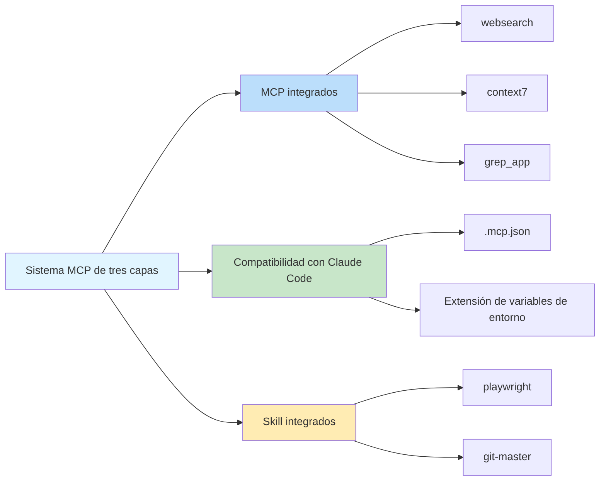

# Servidores MCP integrados: Búsqueda web, consulta de documentación y búsqueda de código

## Lo que lograrás después de aprender

- Entender las funciones y casos de uso de los 3 servidores MCP integrados
- Saber cómo configurar la API Key de Exa Websearch
- Aprender a deshabilitar servicios MCP innecesarios
- Entender la arquitectura y el principio de funcionamiento del sistema MCP de tres capas

## Tu problema actual

Los agentes de IA solo pueden acceder a archivos locales y solicitudes de red, pero carecen de capacidades profesionales de búsqueda y consulta de documentación. Esperas que el agente pueda:
- Buscar en la web en tiempo real para obtener la información más reciente
- Consultar documentación oficial para obtener explicaciones precisas de API
- Buscar ejemplos de implementación en repositorios de GitHub

Pero estas funciones deben implementarse manualmente, lo que aumenta la complejidad del desarrollo.

## Cuándo usar esta técnica

Cuando necesites ampliar las capacidades del agente de IA:

| Escenario | MCP recomendado |
|-----------|------------------|
| Necesitas obtener información técnica reciente, noticias, tendencias de la industria | **websearch** (Exa) |
| Consultar documentación oficial de API de bibliotecas o frameworks | **context7** |
| Buscar ejemplos de implementación en repositorios de GitHub | **grep_app** (Grep.app) |

## Idea clave: ¿Qué es MCP?

**MCP (Model Context Protocol)** es un protocolo estándar que permite a los agentes de IA acceder a herramientas externas y fuentes de datos. En términos simples:

::: info ¿Qué es MCP?
MCP es como equipar al agente de IA con un "caja de herramientas" que contiene varias herramientas profesionales (búsqueda, bases de datos, API, etc.). El agente puede invocar estas herramientas según sea necesario para obtener capacidades que no se pueden proporcionar localmente.
:::

Oh-My-OpenCode proporciona un **sistema MCP de tres capas**:



**Esta lección se centra en la primera capa: servidores MCP integrados**.

---

## Tres servidores MCP integrados

Oh-My-OpenCode incluye 3 servidores MCP remotos integrados que se pueden usar sin configuración adicional (algunos requieren API Key).

### 1. websearch (Exa AI)

**Función**: Búsqueda web en tiempo real, respaldado por [Exa AI](https://exa.ai).

**Casos de uso**:
- Buscar artículos técnicos y noticias recientes
- Encontrar soluciones para problemas específicos
- Obtener tendencias de la industria y mejores prácticas

**Requisitos de configuración**:

Es necesario configurar la variable de entorno `EXA_API_KEY`:

::: code-group

```bash [macOS/Linux]
export EXA_API_KEY="your-api-key-here"
```

```powershell [Windows]
setx EXA_API_KEY "your-api-key-here"
```

:::

::: tip Obtener Exa API Key
1. Visita [Exa AI](https://exa.ai)
2. Regístrate una cuenta
3. Crea una API Key en el Dashboard
4. Agrega la Key a las variables de entorno
:::

**Ubicación del código fuente**: `src/mcp/websearch.ts` (líneas 1-11)

---

### 2. context7

**Función**: Consulta de documentación oficial, compatible con cualquier biblioteca o framework de programación.

**Casos de uso**:
- Consultar documentación de API de bibliotecas como React, Vue, Next.js
- Obtener explicaciones oficiales de tiempos de ejecución como Node.js, Python
- Consultar guías de uso de proyectos de código abierto

**Requisitos de configuración**: No requiere configuración, listo para usar.

**Ubicación del código fuente**: `src/mcp/context7.ts` (líneas 1-7)

---

### 3. grep_app (Grep.app)

**Función**: Búsqueda de código en GitHub ultrarrápida, para encontrar ejemplos de implementación.

**Casos de uso**:
- Buscar implementaciones de patrones específicos en proyectos de código abierto
- Aprender cómo otros escriben código
- Encontrar fragmentos de código para resolver problemas específicos

**Requisitos de configuración**: No requiere configuración, listo para usar.

**Ubicación del código fuente**: `src/mcp/grep-app.ts` (líneas 1-7)

---

## Configuración y deshabilitación de MCP

### Comportamiento predeterminado

Todos los servidores MCP integrados están **habilitados por defecto**. Oh-My-OpenCode registrará automáticamente estos servicios al iniciarse.

### Deshabilitar MCP innecesarios

Si ciertos servicios MCP no son necesarios, puedes deshabilitarlos en el archivo de configuración:

```jsonc
// ~/.config/opencode/oh-my-opencode.json o .opencode/oh-my-opencode.json
{
  "$schema": "./assets/oh-my-opencode.schema.json",

  // Deshabilitar servidores MCP innecesarios
  "disabled_mcps": [
    "websearch",    // Deshabilitar búsqueda web (si no necesitas API Key de Exa)
    "grep_app"      // Deshabilitar búsqueda de código en GitHub
  ]
}
```

::: warning ¿Por qué deshabilitar MCP?
Deshabilitar MCP innecesarios puede:
1. **Ahorrar recursos**: Reducir conexiones y solicitudes innecesarias
2. **Simplificar configuración**: Evitar recordatorios sobre API Key no configuradas
3. **Mejorar estabilidad**: Reducir puntos potenciales de falla de red
:::

### Prioridad de configuración

Prioridad de configuración de deshabilitación de MCP integrados:

| Ubicación de configuración | Prioridad |
|----------------------------|-----------|
| Configuración de usuario `~/.config/opencode/oh-my-opencode.json` | Alta (sobrescribe configuración del proyecto) |
| Configuración del proyecto `.opencode/oh-my-opencode.json` | Media |
| Valor predeterminado del código | Baja (todos habilitados) |

---

## Cómo funciona: Configuración de MCP remoto

Todos los servidores MCP integrados utilizan el **modo remoto (remote)**, conectándose a servicios externos a través del protocolo HTTP/SSE.

**Modo de configuración** (definido en el código fuente):

```typescript
// src/mcp/websearch.ts
export const websearch = {
  type: "remote" as const,        // Fijo en "remote"
  url: "https://mcp.exa.ai/mcp?tools=web_search_exa",  // Dirección del servidor MCP
  enabled: true,                   // Estado de habilitación (será sobrescrito por disabled_mcps)
  headers: process.env.EXA_API_KEY  // Encabezados de solicitud opcionales (API Key)
    ? { "x-api-key": process.env.EXA_API_KEY }
    : undefined,
  oauth: false as const,            // Deshabilitar detección automática de OAuth
}
```

**Explicación de campos de configuración**:

| Campo | Tipo | Descripción |
|-------|------|-------------|
| `type` | `"remote"` | Valor fijo, indica MCP remoto |
| `url` | `string` | Dirección HTTP del servidor MCP |
| `enabled` | `boolean` | Si está habilitado (fijo en `true` en el código, controlado por `disabled_mcps`) |
| `headers` | `object` | Encabezados HTTP opcionales (para autenticación) |
| `oauth` | `false` | Deshabilitar detección automática de OAuth (Exa usa API Key) |

---

## Advertencias de problemas comunes

### Problema 1: websearch requiere API Key

**Síntoma**: El agente falla al intentar usar websearch, indicando que falta la API Key.

**Solución**:

```bash
# Verificar si la variable de entorno está configurada
echo $EXA_API_KEY

# Si está vacía, configurar la API Key
export EXA_API_KEY="your-actual-api-key"

# O agregar permanentemente a la configuración del shell (~/.bashrc, ~/.zshrc, etc.)
echo 'export EXA_API_KEY="your-actual-api-key"' >> ~/.zshrc
```

::: tip Verificar API Key
Después de configurar, puedes reiniciar OpenCode o ejecutar el comando de diagnóstico para verificar:
```bash
oh-my-opencode doctor --verbose
```
:::

### Problema 2: Sigue recordando MCP después de deshabilitar

**Síntoma**: Incluso después de deshabilitar un MCP, el agente sigue intentando usarlo.

**Solución**:

1. Verificar si la ruta del archivo de configuración es correcta:
   - Configuración de usuario: `~/.config/opencode/oh-my-opencode.json`
   - Configuración del proyecto: `.opencode/oh-my-opencode.json`

2. Confirmar que el formato JSON es correcto (prestar atención a comas, comillas):

```jsonc
{
  "disabled_mcps": ["websearch"]  // ✅ Correcto
  // "disabled_mcps": ["websearch"],  // ❌ Incorrecto: no puede tener coma al final
}
```

3. Reiniciar OpenCode para que la configuración surta efecto.

### Problema 3: Resultados de Grep.app inexactos

**Síntoma**: Los resultados devueltos por grep_app no coinciden con lo esperado.

**Posibles causas**:
- Los términos de búsqueda son demasiado generales
- El repositorio de destino no está activo o ha sido eliminado
- La sintaxis de búsqueda es incorrecta

**Solución**:
- Usar términos de búsqueda más específicos
- Especificar tipos de archivo o idioma al buscar
- Visitar directamente [Grep.app](https://grep.app) para verificar manualmente

---

## Resumen de esta lección

Esta lección presentó los 3 servidores MCP integrados de Oh-My-OpenCode:

| MCP | Función | Requisitos de configuración | Uso principal |
|-----|---------|------------------------------|---------------|
| **websearch** | Búsqueda web en tiempo real | EXA_API_KEY | Obtener información reciente |
| **context7** | Consulta de documentación oficial | Ninguno | Consultar documentación de API |
| **grep_app** | Búsqueda de código en GitHub | Ninguno | Encontrar ejemplos de implementación |

**Puntos clave**:

1. **Sistema MCP de tres capas**: Integrados → Compatibilidad con Claude Code → Skills integrados
2. **Habilitados por defecto**: Todos los MCP integrados están habilitados por defecto, pueden deshabilitarse mediante `disabled_mcps`
3. **Modo remoto**: Todos los MCP integrados utilizan el protocolo HTTP/SSE para conectarse a servicios externos
4. **Exa requiere Key**: websearch requiere la variable de entorno `EXA_API_KEY`

Estos servidores MCP amplían significativamente las capacidades de los agentes de IA, permitiéndoles acceder a información en tiempo real y bases de conocimientos profesionales.

---

## Apéndice: Referencia del código fuente

<details>
<summary><strong>Haz clic para expandir y ver ubicación del código fuente</strong></summary>

> Última actualización: 2026-01-26

| Función | Ruta del archivo | Líneas |
|---------|------------------|--------|
| Función de fábrica de MCP | [`src/mcp/index.ts`](https://github.com/code-yeongyu/oh-my-opencode/blob/main/src/mcp/index.ts) | 22-32 |
| Configuración de websearch | [`src/mcp/websearch.ts`](https://github.com/code-yeongyu/oh-my-opencode/blob/main/src/mcp/websearch.ts) | 1-11 |
| Configuración de context7 | [`src/mcp/context7.ts`](https://github.com/code-yeongyu/oh-my-opencode/blob/main/src/mcp/context7.ts) | 1-7 |
| Configuración de grep_app | [`src/mcp/grep-app.ts`](https://github.com/code-yeongyu/oh-my-opencode/blob/main/src/mcp/grep-app.ts) | 1-7 |
| McpNameSchema | [`src/mcp/types.ts`](https://github.com/code-yeongyu/oh-my-opencode/blob/main/src/mcp/types.ts) | 1-10 |
| Campo disabled_mcps | [`src/config/schema.ts`](https://github.com/code-yeongyu/oh-my-opencode/blob/main/src/config/schema.ts) | 331 |

**Constantes clave**:
- `allBuiltinMcps`: Objeto de configuración de MCP integrados, incluye websearch, context7, grep_app (`src/mcp/index.ts:16-20`)

**Funciones clave**:
- `createBuiltinMcps(disabledMcps)`: Crea lista de MCP habilitados, filtra los MCP deshabilitados (`src/mcp/index.ts:22-32`)

</details>
