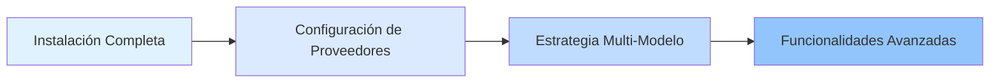

# Plataformas e Integraciones

Este capítulo presenta cómo configurar y gestionar múltiples Proveedores de IA (Anthropic, OpenAI, Google, GitHub Copilot, etc.), así como el mecanismo de conmutación automática multi-modelo de oh-my-opencode.

Al completar este capítulo, dominarás cómo habilitar al sistema para seleccionar inteligentemente el modelo de IA más adecuado según el tipo de tarea y los modelos disponibles, construyendo flujos de trabajo de orquestación multi-modelo eficientes y confiables.

## Qué Cubre Este Capítulo

Este capítulo se divide en dos partes:

### 1. [Configuración de Proveedores](provider-setup/)

Aprende a configurar varios Proveedores de IA, incluyendo:
- Anthropic Claude (primera elección del orquestador principal)
- OpenAI ChatGPT (especializado en revisión de arquitectura)
- Google Gemini (análisis de frontend y medios)
- GitHub Copilot (Proveedor de respaldo)
- Z.ai Coding Plan y OpenCode Zen (servicios opcionales)

**Lo Que Aprenderás**:
- ✅ Configurar 6 Proveedores de IA principales
- ✅ Usar el instalador interactivo para configuración rápida
- ✅ Especificar los modelos más adecuados para diferentes agentes
- ✅ Usar el comando `doctor` para diagnosticar problemas de configuración

**Tiempo Estimado**: 25-30 minutos

### 2. [Estrategia Multi-Modelo](model-resolution/)

Profundiza en el mecanismo de prioridad de tres pasos del sistema de resolución de modelos:
- Anulación del usuario (control preciso)
- Conmutación de Proveedores (tolerancia a fallos automática)
- Predeterminado del sistema (solución de respaldo)

**Lo Que Aprenderás**:
- ✅ Comprender el flujo de trabajo completo de resolución de modelos
- ✅ Especificar manualmente modelos según los requisitos de la tarea
- ✅ Aprovechar la conmutación de Proveedores para mejorar la robustez del sistema
- ✅ Diagnosticar y resolver problemas de resolución de modelos

**Tiempo Estimado**: 30-35 minutos

## Ruta de Aprendizaje Recomendada

Recomendamos seguir este orden al estudiar este capítulo:

**¿Por qué este orden?**

1. **Configura primero, comprende después**: Primero aprende a configurar cada Proveedor, luego comprende el mecanismo de resolución subyacente
2. **De simple a complejo**: La configuración de Proveedores son operaciones básicas, la estrategia multi-modelo es un concepto avanzado
3. **La práctica valida la teoría**: Después de configurar los Proveedores, puedes usar el comando `doctor` para verificar la efectividad de la estrategia multi-modelo

::: tip Ruta de Inicio Rápido
Si solo quieres comenzar rápidamente, puedes completar los pasos 1-4 de [Configuración de Proveedores](provider-setup/) (configurar Proveedores básicos), y aprender otros contenidos según sea necesario más adelante.
:::

## Prerrequisitos

Antes de estudiar este capítulo, asegúrate de:

- ✅ Haber completado [Instalación y Configuración Inicial](../installation/)
- ✅ Tener instalado OpenCode (versión >= 1.0.150)
- ✅ Comprender los formatos básicos de archivos de configuración JSON/JSONC
- ✅ Tener al menos una suscripción de cuenta de Proveedor de IA (se recomienda Anthropic Claude)

::: warning ¿Qué pasa si no tengo una cuenta de Proveedor?
Puedes aprender los pasos de configuración primero sin conectar realmente un Proveedor. El sistema usará el modelo predeterminado de OpenCode como respaldo.
:::

## Preguntas Frecuentes

<strong>¿Necesito configurar todos los Proveedores?</strong>

No. Puedes configurar solo los Proveedores que usas más (por ejemplo, solo Anthropic Claude). El mecanismo de conmutación de Proveedores de oh-my-opencode usará automáticamente los Proveedores disponibles.

Sin embargo, si quieres aprovechar completamente las ventajas de la orquestación multi-modelo, recomendamos configurar al menos 2-3 Proveedores, para que el sistema pueda seleccionar automáticamente el modelo más adecuado según el tipo de tarea.

<strong>¿Cuál es la diferencia entre configuración de Proveedores y resolución de modelos?</strong>

- **Configuración de Proveedores**: El "paso de instalación", indicando al sistema qué servicios de IA tienes disponibles
- **Resolución de Modelos**: La "lógica de decisión", cómo el sistema selecciona qué Proveedor usar para cada agente

Analogía: La configuración de Proveedores es "contratar miembros del equipo", la resolución de modelos es "asignar tareas".

<strong>¿Puedo modificar la configuración en cualquier momento?</strong>

Puedes modificar el archivo de configuración en cualquier momento:
- Configuración de usuario: `~/.config/opencode/oh-my-opencode.json`
- Configuración de proyecto: `.opencode/oh-my-opencode.json`

Los cambios surten efecto automáticamente la próxima vez que uses un agente. Si modificaste la autenticación del Proveedor, necesitas ejecutar `opencode auth login` para reautenticarte.

## Próximos Pasos

Después de completar este capítulo, puedes:

### Ruta Recomendada: Aprender el Equipo de Agentes de IA

Continúa aprendiendo [Equipo de Agentes de IA: Visión General de 10 Expertos](../../advanced/ai-agents-overview/) para comprender cómo usar diferentes agentes para tareas especializadas.

### Ruta Avanzada: Personalización Profunda

Si ya estás familiarizado con la configuración básica, puedes saltar a [Profundización en Configuración: Gestión de Agentes y Permisos](../../advanced/advanced-configuration/) para aprender:
- Cómo personalizar los prompts de los agentes
- Cómo establecer permisos de agentes y ámbitos de acceso
- Cómo crear agentes y Categorías personalizadas

### Ruta Práctica: Usar Planificación Prometheus

Comienza a usar [Planificación Prometheus: Recopilación de Requisitos Estilo Entrevista](../../advanced/prometheus-planning/) para experimentar el poder de la orquestación multi-modelo a través de la colaboración real de agentes.

---

**Comienza**: ¡Inicia tu viaje de orquestación multi-modelo con [Configuración de Proveedores](provider-setup/)!
