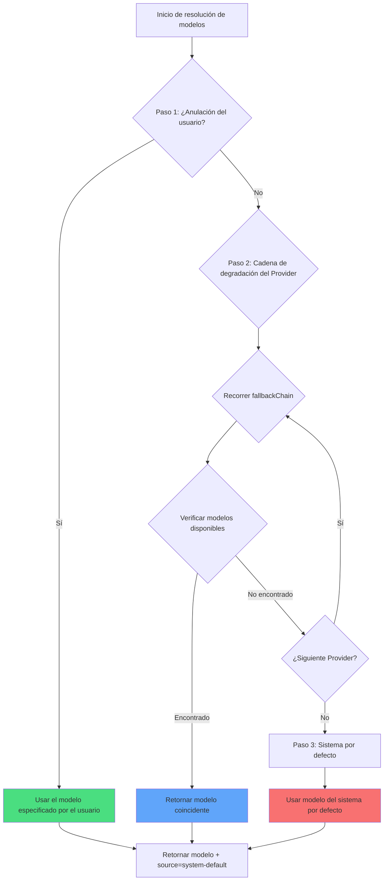

# Estrategia de múltiples modelos: degradación automática y prioridad

## Lo que lograrás

- Entender cómo oh-my-opencode selecciona automáticamente el modelo de IA más adecuado para cada agente
- Dominar el mecanismo de resolución de modelos en tres pasos (anulación del usuario → degradación del Provider → sistema por defecto)
- Aprender a configurar la anulación de modelos para agentes y Categories
- Usar el comando `doctor` para verificar los resultados de la resolución de modelos
- Especificar manualmente el modelo según las necesidades de la tarea, optimizando costos y rendimiento

## Tu situación actual

Después de configurar múltiples Providers de IA (Anthropic, OpenAI, Google, etc.), podrías enfrentarte a estas confusiones:

- **Selección de modelos no clara**: ¿Qué modelos usan exactamente los agentes Sisyphus, Oracle, Librarian, etc.?
- **Configuración manual tediosa**: Hay que especificar el modelo para cada agente por separado; cuando cambia el Provider, hay que ajustar todo
- **Costos incontrolables**: No sabes qué tareas usaron modelos costosos (como Claude Opus)
- **Fallas de Provider afectan la experiencia**: Si la API de algún Provider se cae, todo el sistema deja de funcionar
- **Colaboración de múltiples modelos opaca**: En tareas paralelas, no queda claro qué modelos usaron los diferentes agentes

Todo esto te impide desplegar el verdadero poder de la orquestación de múltiples modelos.

## Idea central

El **sistema de resolución de modelos** es el "selector inteligente de modelos" de oh-my-opencode. Según tu configuración y los modelos disponibles, decide dinámicamente qué modelo usar para cada agente y Category.

::: info ¿Qué es la resolución de modelos?
La resolución de modelos (Model Resolution) es el proceso de seleccionar un modelo de IA específico para cada agente o Category en tiempo de ejecución. No está codificado de forma fija; es un resultado calculado dinámicamente según tu configuración, los Providers disponibles, los nombres de los modelos, etc.
:::

### Proceso de resolución en tres pasos

La resolución de modelos se implementa a través de tres pasos de prioridad:



**Paso 1: Anulación del usuario (User Override)**
- Si especificas explícitamente el `model` de un agente o Category en `oh-my-opencode.json`, el sistema usa directamente ese modelo
- Salta la cadena de degradación del Provider
- Es la prioridad más alta

**Paso 2: Degradación del Provider (Provider Fallback)**
- Si no hay anulación del usuario, el sistema intenta según la cadena de prioridad del Provider predefinida
- Para cada agente o Category, hay un `fallbackChain` que define el orden de Providers que prefiere
- El sistema intenta cada Provider en orden hasta encontrar un modelo disponible

**Paso 3: Sistema por defecto (System Default)**
- Si ningún Provider tiene modelos disponibles, usa el modelo por defecto de OpenCode
- Es la última opción de respaldo

### Cadena de prioridad del Provider para agentes

Cada agente tiene su propio orden de Providers preferidos, lo que depende del tipo de tarea y las capacidades requeridas del agente:

| Agente | Modelo recomendado (sin prefijo) | Cadena de prioridad del Provider | Variante |
|--- | --- | --- | ---|
| **Sisyphus** | `claude-opus-4-5` | anthropic → github-copilot → opencode → zai-coding-plan | max |
| **Oracle** | `gpt-5.2` | openai → anthropic → google | high |
| **Librarian** | `big-pickle` | zai-coding-plan → opencode → anthropic | - |
| **Explore** | `claude-haiku-4-5` | anthropic → opencode → github-copilot | - |
| **Multimodal Looker** | `gemini-3-flash` | google → openai → zai-coding-plan → anthropic → opencode | - |
| **Prometheus** | `claude-opus-4-5` | anthropic → github-copilot → opencode → google | max |
| **Metis** | `claude-opus-4-5` | anthropic → github-copilot → opencode → google | max |
| **Momus** | `gpt-5.2` | openai → anthropic → google | medium |
| **Atlas** | `claude-sonnet-4-5` | anthropic → github-copilot → opencode → google | - |

::: tip ¿Por qué Sisyphus prefiere Anthropic?
Sisyphus es el orquestador principal y necesita fuertes capacidades de razonamiento. Claude Opus es el modelo más adecuado para tareas de orquestación complejas, por lo que Anthropic ocupa el primer lugar en su cadena de prioridad. Si tu cuota de Anthropic es insuficiente, el sistema degradará automáticamente a otros Providers.
:::

### Cadena de prioridad del Provider para Categories

Las Categories también siguen la misma lógica de resolución:

| Category | Modelo recomendado (sin prefijo) | Cadena de prioridad del Provider | Variante |
|--- | --- | --- | ---|
| **visual-engineering** | `gemini-3-pro` | google → anthropic → openai | - |
| **ultrabrain** | `gpt-5.2-codex` | openai → anthropic → google | xhigh |
| **artistry** | `gemini-3-pro` | google → anthropic → openai | max |
| **quick** | `claude-haiku-4-5` | anthropic → google → opencode | - |
| **unspecified-low** | `claude-sonnet-4-5` | anthropic → openai → google | - |
| **unspecified-high** | `claude-opus-4-5` | anthropic → openai → google | max |
| **writing** | `gemini-3-flash` | google → anthropic → zai-coding-plan → openai | - |

::: tip Ventajas de las Categories
Cuando delegas tareas usando `delegate_task(category="quick", ...)`, el sistema usa automáticamente la cadena de prioridad del Provider de la Category `quick`. Esto significa que no necesitas recordar la configuración de cada agente, solo necesitas seleccionar la Category apropiada según el tipo de tarea.
:::

## Sígueme

### Paso 1: Verificar el estado actual de resolución de modelos

Usa el comando `doctor` para ver los resultados de resolución de modelos para cada agente y Category:

```bash
bunx oh-my-opencode doctor --verbose
```

**Deberías ver** una salida similar a esta:

```
✅ Model Resolution Check
━━━━━━━━━━━━━━━━━━━━━━━━━━━━━━━━━━━━━━━━━━━━━━━━━━━

Agent: sisyphus
  Requirement: claude-opus-4-5 (variant: max)
  Fallback Chain: anthropic → github-copilot → opencode → zai-coding-plan → openai → google
  User Override: (none)
  Resolved Model: anthropic/claude-opus-4-5
  Source: provider-fallback
  Variant: max

Agent: oracle
  Requirement: gpt-5.2 (variant: high)
  Fallback Chain: openai → anthropic → google
  User Override: (none)
  Resolved Model: openai/gpt-5.2
  Source: provider-fallback
  Variant: high

Category: quick
  Requirement: claude-haiku-4-5
  Fallback Chain: anthropic → google → opencode
  User Override: (none)
  Resolved Model: anthropic/claude-haiku-4-5
  Source: provider-fallback
```

Esta salida muestra:
- Los requisitos de modelo de cada agente/Category
- El orden de la cadena de prioridad del Provider
- Si hay configuración de anulación del usuario
- El modelo finalmente resuelto y su origen (override/provider-fallback/system-default)

### Paso 2: Anular manualmente el modelo de un agente

Supongamos que quieres que Oracle use el último modelo de OpenAI, en lugar del GPT-5.2 predeterminado:

Edita `~/.config/opencode/oh-my-opencode.json` o `.opencode/oh-my-opencode.json`:

```jsonc
{
  "$schema": "https://raw.githubusercontent.com/code-yeongyu/oh-my-opencode/master/assets/oh-my-opencode.schema.json",

  "agents": {
    "oracle": {
      "model": "openai/o3"  // Anular al modelo o3
    },
    "explore": {
      "model": "opencode/gpt-5-nano"  // Usar modelo gratuito
    }
  }
}
```

::: info Prioridad del Paso 1
Cuando configuras `agents.oracle.model`, el sistema usa directamente este modelo en el Paso 1, saltando la cadena de degradación del Provider. Aunque Claude Opus de Anthropic esté disponible, Oracle usará el OpenAI o3 que especifiques.
:::

**Deberías ver**: Al volver a ejecutar el comando `doctor`, el resultado de la resolución de Oracle cambia a:

```
Agent: oracle
  Requirement: gpt-5.2 (variant: high)
  Fallback Chain: openai → anthropic → google
  User Override: openai/o3  // ← La anulación del usuario tiene efecto
  Resolved Model: openai/o3
  Source: override  // ← El origen cambia a override
  Variant: high
```

### Paso 3: Anular manualmente el modelo de una Category

Supongamos que quieres que la Category `quick` use el GPT-5 Nano gratuito:

```jsonc
{
  "$schema": "https://raw.githubusercontent.com/code-yeongyu/oh-my-opencode/master/assets/oh-my-opencode.schema.json",

  "categories": {
    "quick": {
      "model": "opencode/gpt-5-nano"  // Anular al modelo gratuito
    },
    "visual-engineering": {
      "model": "anthropic/claude-opus-4-5"  // Forzar el uso de Opus
    }
  }
}
```

**Deberías ver**: Cuando usas `delegate_task(category="quick", ...)`, el sistema usará `opencode/gpt-5-nano`, incluso si Haiku de Anthropic está disponible.

### Paso 4: Simular falla del Provider

La mejor manera de entender el mecanismo de degradación del Provider es simular escenarios de falla.

Supongamos que solo configuraste OpenAI, pero quieres ver qué modelo usará Sisyphus (que prefiere Anthropic):

**Configuración actual**:
```jsonc
{
  // oh-my-opencode.json
  // Solo está configurado el provider openai
}
```

**Ejecutar doctor**:

```
Agent: sisyphus
  Requirement: claude-opus-4-5 (variant: max)
  Fallback Chain: anthropic → github-copilot → opencode → zai-coding-plan → openai → google
  User Override: (none)
  
  // Intento 1: anthropic/claude-opus-4-5
  // Resultado: no disponible (no configurado)
  
  // Intento 2: github-copilot/claude-opus-4-5
  // Resultado: no disponible (no configurado)
  
  // Intento 3: opencode/claude-opus-4-5
  // Resultado: no disponible (no configurado)
  
  // Intento 4: zai-coding-plan/glm-4.7
  // Resultado: no disponible (no configurado)
  
  // Intento 5: openai/gpt-5.2-codex (desde la 5ª entrada de fallbackChain)
  // Resultado: ¡encontrado!
  
  Resolved Model: openai/gpt-5.2-codex
  Source: provider-fallback
  Variant: medium
```

**Deberías ver**: Aunque Sisyphus prefiere Claude Opus, porque Anthropic no está disponible, el sistema degradó a GPT-5.2 Codex de OpenAI.

::: tip Ventajas de la degradación automática
El mecanismo de degradación del Provider asegura la robustez del sistema. Incluso si algún Provider falla o se agota la cuota, el sistema puede cambiar automáticamente al Provider de respaldo sin necesidad de intervención manual.
:::

### Paso 5: Verificar el respaldo del sistema por defecto

Supongamos que no has configurado ningún Provider, o todos los Providers están fallando:

**Ejecutar doctor**:

```
Agent: sisyphus
  Requirement: claude-opus-4-5
  Fallback Chain: anthropic → github-copilot → ...
  
  // Todos los intentos de Provider fallan
  
  Resolved Model: anthropic/claude-opus-4-5  // Usar el sistema por defecto
  Source: system-default  // ← El origen es system-default
  Variant: max
```

**Deberías ver**: El sistema usa el modelo por defecto configurado por OpenCode. Esta es la última red de seguridad.

## Punto de control ✅

Después de completar los pasos anteriores, confirma:

- [ ] Ejecutar `doctor --verbose` puede ver los resultados de resolución de modelos de todos los agentes y Categories
- [ ] Después de anular manualmente el modelo de un agente, `Source` cambia a `override`
- [ ] Después de anular manualmente el modelo de una Category, `delegate_task` usa el modelo especificado
- [ ] Al simular fallas del Provider, el sistema puede degradar correctamente al siguiente Provider disponible
- [ ] Cuando todos los Providers no están disponibles, el sistema usa `system-default`

Si algún elemento no pasa, verifica:
- La ruta del archivo de configuración es correcta (`~/.config/opencode/oh-my-opencode.json` o `.opencode/oh-my-opencode.json`)
- El Provider está correctamente configurado (API Key, variables de entorno, etc.)
- El nombre del modelo es correcto (incluido el prefijo del Provider, como `anthropic/claude-opus-4-5`)

## Cuándo usar esta técnica

| Escenario | Anular manualmente el modelo | Usar degradación del Provider |
|--- | --- | ---|
| **Tareas sensibles al costo** | ✅ Especificar modelo económico | ❌ Puede elegir modelo costoso |
| **Tareas sensibles al rendimiento** | ✅ Especificar el modelo más potente | ❌ Puede degradar a modelo débil |
| **Probar nuevos modelos** | ✅ Especificar modelo experimental | ❌ No lo selecciona automáticamente |
| **Desarrollo diario** | ❌ Configuración excesiva | ✅ Selección automática óptima |
| **Falla del Provider** | ❌ Necesita modificación manual | ✅ Degradación automática |
| **Entorno de múltiples Providers** | ❌ Configuración excesiva | ✅ Balanceo de carga automático |

**Regla general**:
- Solo usa anulación manual cuando necesites control preciso del modelo
- En otros casos, deja que el sistema elija automáticamente y disfruta la robustez de la degradación del Provider
- Para tareas sensibles al costo, puedes anular a la Category `quick` o especificar un modelo económico
- Para tareas que necesitan el máximo rendimiento, puedes anular a `claude-opus-4-5` o `gpt-5.2`

## Advertencias sobre errores comunes

::: warning Errores comunes

**1. Falta el prefijo del Provider en el nombre del modelo**

```jsonc
// ❌ Error: falta el prefijo del Provider
{
  "agents": {
    "oracle": {
      "model": "gpt-5.2"  // Falta el prefijo openai/
    }
  }
}

// ✅ Correcto: incluye la ruta completa
{
  "agents": {
    "oracle": {
      "model": "openai/gpt-5.2"  // Ruta completa del modelo
    }
  }
}
```

**2. Anular un modelo que no existe**

```jsonc
// ❌ Error: error tipográfico en el nombre del modelo
{
  "agents": {
    "oracle": {
      "model": "openai/gpt-6"  // GPT-6 no existe
    }
  }
}

// ✅ Correcto: usar un modelo real
{
  "agents": {
    "oracle": {
      "model": "openai/gpt-5.2"  // Modelo real
    }
  }
}
```

**3. Ignorar la configuración de Variant**

Algunos agentes y Categories tienen un Variant recomendado (como `max`, `high`, `medium`), estos afectan la capacidad de razonamiento del modelo. Al anular manualmente, ten en cuenta:

```jsonc
// ✅ Recomendado: mantener el Variant predeterminado
{
  "agents": {
    "oracle": {
      "model": "openai/gpt-5.2"
      // El Variant se hereda de fallbackChain: high
    }
  }
}

// ✅ Opcional: especificar manualmente el Variant
{
  "agents": {
    "oracle": {
      "model": "openai/gpt-5.2",
      "variant": "max"  // Anular el valor predeterminado
    }
  }
}
```

**4. Depender del sistema por defecto sin configurar Provider**

El modelo del sistema por defecto proviene de la configuración de OpenCode. Si no has configurado ningún Provider, OpenCode también puede usar el modelo por defecto, pero este modelo puede no ser el que quieres.

**Sugerencias**:
- Configura al menos un Provider (Anthropic, OpenAI, Google, etc.)
- Usa el comando `doctor` para verificar regularmente los resultados de la resolución de modelos
:::

## Resumen de esta lección

El sistema de resolución de modelos implementa una selección inteligente de modelos a través del mecanismo de tres pasos de prioridad:

- **Paso 1: Anulación del usuario (User Override)**: El modelo que especificas tiene la prioridad más alta, completamente controlable
- **Paso 2: Degradación del Provider (Provider Fallback)**: Degradación automática según la cadena de prioridad predefinida, garantizando robustez
- **Paso 3: Sistema por defecto (System Default)**: La última opción de respaldo, asegurando que el sistema siempre tenga un modelo disponible

Cada agente y Category tiene su propia cadena de prioridad del Provider, diseñada según el tipo de tarea del agente y las capacidades requeridas. Sisyphus prefiere Anthropic (razonamiento complejo), Oracle prefiere OpenAI (consultoría estratégica), Librarian prefiere zai-coding-plan (investigación de múltiples repositorios).

Recuerda:
- **Desarrollo diario**: deja que el sistema elija automáticamente, disfruta la degradación del Provider
- **Control preciso**: anula manualmente el modelo, optimiza costos y rendimiento
- **Recuperación de fallas**: la degradación del Provider se maneja automáticamente, sin necesidad de intervención manual
- **Herramienta de verificación**: usa el comando `doctor` para verificar los resultados de la resolución de modelos

## Próxima lección

> En la próxima lección aprenderemos **[Equipo de agentes de IA: Introducción a los 10 expertos](../../advanced/ai-agents-overview/)**.
>
> Aprenderás:
> - Las funciones, casos de uso y configuración de permisos de los 10 agentes integrados
> - Cómo seleccionar el agente adecuado según el tipo de tarea
> - Los modos de colaboración entre agentes y mejores prácticas

---

## Apéndice: Referencia del código fuente

<details>
<summary><strong>Haz clic para expandir y ver la ubicación del código fuente</strong></summary>

> Fecha de actualización: 2026-01-26

| Función | Ruta del archivo | Líneas |
|--- | --- | ---|
| Función principal de resolución de modelos | [`src/shared/model-resolver.ts`](https://github.com/code-yeongyu/oh-my-opencode/blob/main/src/shared/model-resolver.ts) | 43-98 |
| Definición de requisitos de modelos de agentes | [`src/shared/model-requirements.ts`](https://github.com/code-yeongyu/oh-my-opencode/blob/main/src/shared/model-requirements.ts) | 12-79 |
| Definición de requisitos de modelos de Categories | [`src/shared/model-requirements.ts`](https://github.com/code-yeongyu/oh-my-opencode/blob/main/src/shared/model-requirements.ts) | 81-133 |
| Resolución de modelos al crear agentes | [`src/agents/utils.ts`](https://github.com/code-yeongyu/oh-my-opencode/blob/main/src/agents/utils.ts) | 203-208, 245-250, 284-289 |
| Resolución de modelos al delegar Categories | [`src/tools/delegate-task/tools.ts`](https://github.com/code-yeongyu/oh-my-opencode/blob/main/src/tools/delegate-task/tools.ts) | 532-540 |
| Verificación de resolución de modelos del comando doctor | [`src/cli/doctor/checks/model-resolution.ts`](https://github.com/code-yeongyu/oh-my-opencode/blob/main/src/cli/doctor/checks/model-resolution.ts) | 130-160 |

**Definiciones de tipos clave**:
- `ModelResolutionInput`: parámetros de entrada de resolución de modelos (`src/shared/model-resolver.ts:6-10`)
- `ExtendedModelResolutionInput`: entrada de resolución de modelos extendida, incluye fallbackChain y availableModels (`src/shared/model-resolver.ts:23-28`)
- `ModelResolutionResult`: resultado de resolución de modelos, incluye model, source, variant (`src/shared/model-resolver.ts:17-21`)
- `ModelSource`: enumeración de origen del modelo (`override`/`provider-fallback`/`system-default`) (`src/shared/model-resolver.ts:12-16`)
- `FallbackEntry`: entrada de la cadena de degradación del Provider, incluye providers, model, variant (`src/shared/model-requirements.ts:1-5`)
- `ModelRequirement`: definición de requisitos del modelo, incluye fallbackChain y variant predeterminado (`src/shared/model-requirements.ts:7-10`)

**Constantes clave**:
- `AGENT_MODEL_REQUIREMENTS`: definición de requisitos de modelos de todos los agentes, incluye fallbackChain (`src/shared/model-requirements.ts:12-79`)
- `CATEGORY_MODEL_REQUIREMENTS`: definición de requisitos de modelos de todas las Categories (`src/shared/model-requirements.ts:81-133`)

**Funciones clave**:
- `resolveModelWithFallback()`: función principal de resolución de modelos, implementa el mecanismo de tres pasos de prioridad (`src/shared/model-resolver.ts:43-98`)
- `resolveModel()`: resolución simple de modelos, para situaciones sin fallbackChain (`src/shared/model-resolver.ts:35-41`)
- `normalizeModel()`: normaliza el nombre del modelo, elimina espacios antes y después (`src/shared/model-resolver.ts:30-33`)
- `createBuiltinAgents()`: al crear todos los agentes integrados, llama al resolvedor de modelos para determinar el modelo (`src/agents/utils.ts:143-313`)

**Reglas de negocio**:
| ID de regla | Descripción de la regla | Etiqueta |
|--- | --- | ---|
| BR-4.1-7 | Prioridad de resolución de modelos: anulación del usuario > degradación del Provider > sistema por defecto | 【Hecho】 |
| BR-4.1-7-1 | Al anular el usuario, se retorna directamente, saltando la cadena de degradación del Provider | 【Hecho】 |
| BR-4.1-7-2 | Al degradar el Provider, se intenta cada Provider según el orden de fallbackChain | 【Hecho】 |
| BR-4.1-7-3 | Al degradar el Provider, se verifica el caché de availableModels; si está vacío, se verifica connectedProviders | 【Hecho】 |
| BR-4.1-7-4 | Cuando todos los Providers no están disponibles, se usa systemDefaultModel | 【Hecho】 |
| BR-4.1-7-5 | FallbackChain de Sisyphus: anthropic → github-copilot → opencode → zai-coding-plan → openai → google | 【Hecho】 |
| BR-4.1-7-6 | FallbackChain de Oracle: openai → anthropic → google | 【Hecho】 |
| BR-4.1-7-7 | FallbackChain de Librarian: zai-coding-plan → opencode → anthropic | 【Hecho】 |
| BR-4.1-7-8 | FallbackChain de Explore: anthropic → opencode → github-copilot | 【Hecho】 |
| BR-4.1-7-9 | FallbackChain de Multimodal Looker: google → openai → zai-coding-plan → anthropic → opencode | 【Hecho】 |

</details>
