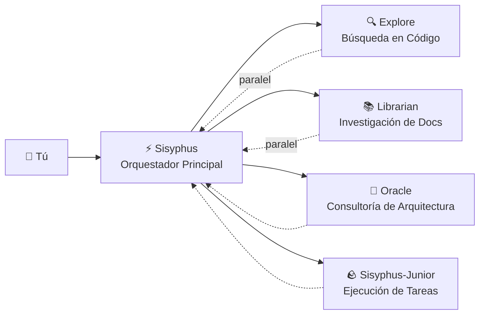

# Orquestador Principal: Piensa y Ejecuta como un Ingeniero Senior

## Qué Aprenderás

- Entender cómo Sisyphus coordina el trabajo como un equipo de desarrollo real
- Dominar las mejores prácticas de delegación de tareas, permitiendo que diferentes agentes expertos colaboren en tareas complejas
- Aprender a mejorar drásticamente la eficiencia del desarrollo mediante tareas en segundo plano paralelas
- Saber cuándo dejar que el agente trabaje solo y cuándo delegar a expertos

## Tus Desafíos Actuales

Es posible que hayas encontrado estos problemas:

- Los agentes de IA "abandonan a mitad de camino", escribiendo código y olvidando el objetivo
- El mismo archivo se modifica una y otra vez, requiriendo releer el contexto cada vez
- Quieres que la IA haga muchas cosas, pero solo pueden esperar en cola una por una
- El agente escribe código, pero tú mismo tienes que verificar si es correcto o si rompe otras funcionalidades

**Causa raíz**: Estás dejando que un "asistente todoterreno" haga todo el trabajo, pero los expertos entienden los asuntos profesionales.

## Cuándo Usar Esta Técnica

Sisyphus es tu orquestador principal, adecuado para estos escenarios:

| Escenario | ¿Es Adecuado? | Alternativa |
| --- | --- | --- |
| Desarrollo de funciones complejas (3+ pasos) | ✅ Altamente recomendado | Prometheus + Atlas (requiere planificación detallada) |
| Corrección rápida de bugs conocidos | ✅ Adecuado | Dejar que Sisyphus lo haga directamente |
| Requiere investigar múltiples repositorios/documentos | ✅ Altamente recomendado | Usar delegación paralela de Sisyphus |
| Modificación simple de un solo archivo | ✅ Posible | Edición directa (más simple) |
| Requiere planificación detallada del proyecto | ⚠️ No recomendado | Usar Prometheus primero para generar el plan |

## Idea Central

**Sisyphus** es el agente orquestador principal, coordinando múltiples expertos de IA como un equipo de desarrollo real. A través de la separación de responsabilidades y el mecanismo de delegación paralela, permite que los sub-agentes profesionales aprovechen sus fortalezas individuales para lograr una colaboración eficiente.

Sisyphus no es una "IA más inteligente", es un **sistema de orquestación**.

### Separación de Responsabilidades



**Sisyphus no escribe código**, es responsable de:

1. **Entender tus necesidades reales** (no solo escuchar lo superficial)
2. **Juzgar quién es mejor en esto** (no hacer todo por sí mismo)
3. **Delegar tareas en paralelo** (hacer que múltiples expertos trabajen simultáneamente)
4. **Verificar resultados** (nunca confiar ciegamente en "lo completé")

### ¿Por Qué se Llama Sisyphus?

En la mitología griega, Sisyphus fue castigado a empujar eternamente una roca cuesta arriba.

La filosofía de diseño de este sistema: **el agente debe empujar la roca hasta el final (completar todos los TODO) antes de poder detenerse**.

::: info
Esto no es un castigo, es un mecanismo de garantía de calidad. No querrías que la IA abandone a mitad de camino dejando un desastre.
:::

### 32k Thinking Budget

Sisyphus usa **Claude Opus 4.5 + 32k thinking budget**.

¿Para qué sirve esto?

| Bajo presupuesto (sin thinking) | 32k thinking budget |
| --- | --- |
| Comienza a escribir código directamente | Primero analiza profundamente los requisitos, evalúa la complejidad, descompone las tareas |
| Fácil de pasar por alto casos límite | Descubre problemas potenciales y riesgos de antemano |
| A mitad de camino descubre que está equivocado | Elige la mejor solución desde el principio |

::: tip
Se recomienda encarecidamente configurar Sisyphus con el modelo **Opus 4.5**. Usar otros modelos reducirá significativamente la experiencia.
:::

## Sigue los Pasos

### Paso 1: Crear un Proyecto de Prueba

**Por qué**
Necesitas un proyecto ejecutable para observar el comportamiento de Sisyphus.

```bash
mkdir my-app && cd my-app
npm create next-app@latest . -- --typescript --tailwind --eslint --no-src-dir
npm install
```

**Deberías ver**: Proyecto inicializado completamente, puedes ejecutar `npm run dev` para iniciar.

### Paso 2: Dar a Sisyphus una Tarea Compleja

Abre el proyecto en OpenCode e ingresa:

```
Agregar funcionalidad de inicio de sesión de usuario, incluyendo:
- Inicio de sesión con correo electrónico y contraseña
- Almacenamiento de token JWT
- Rutas protegidas
- Verificación de estado de inicio de sesión
```

Observa la reacción de Sisyphus.

**Deberías ver**:

1. Sisyphus no comenzará a escribir código directamente
2. Primero crea una lista de TODO (descomposición detallada de tareas)
3. Evalúa los patrones del código base (verifica configuración, estructura de archivos)
4. Puede hacerte algunas preguntas de aclaración

**Punto de control ✅**: Revisa el panel TODO de OpenCode, deberías ver algo similar a:

```
□ Instalar dependencias necesarias (bcrypt, jsonwebtoken)
□ Crear modelo de usuario y definiciones de tipos
□ Implementar endpoint de API de inicio de sesión
□ Crear herramientas de firma y verificación JWT
□ Agregar middleware de rutas protegidas
□ Implementar formulario de inicio de sesión frontend
□ Agregar gestión de estado de inicio de sesión
```

### Paso 3: Observar Delegación Paralela (Momento Clave)

Durante la implementación, Sisyphus puede:

```
[Background Task Started]
- Task ID: bg_abc123
- Agent: explore
- Prompt: "Encontrar patrones de autenticación existentes en este código base..."

[Background Task Started]
- Task ID: bg_def456
- Agent: librarian
- Prompt: "Investigar mejores prácticas de JWT para Next.js..."
```

**Esto es clave**: Sisyphus **no espera** a que estas tareas se completen, continúa trabajando.

Cuando necesita los resultados, llama a `background_output(task_id="...")` para obtenerlos.

**¿Por qué es tan rápido?**

| Método serial (tradicional) | Método paralelo (Sisyphus) |
| --- | --- |
| Búsqueda en código base (2 minutos) | ⏳ Búsqueda en código base (2 minutos) |
| Esperando... | ⏳ Investigación de documentos (2 minutos, simultáneamente) |
| Investigación de documentos (2 minutos) | Comenzar implementación (tiempo total 2 minutos) |
| Comenzar implementación (2 minutos) |  |
| **Tiempo total 6 minutos** | **Tiempo total 4 minutos (ahorra 33%)** |

### Paso 4: Mecanismo de Verificación

Cuando Sisyphus afirma "tarea completada", hará:

1. Ejecutar `lsp_diagnostics` para verificar errores
2. Ejecutar `npm run build` para asegurar que la compilación pase
3. Si hay pruebas, ejecutar el conjunto de pruebas
4. Marcar TODO como `completed`

**Punto de control ✅**: Revisa la salida del terminal, deberías ver algo similar a:

```
✓ Ejecutando diagnósticos en archivos modificados...
✓ No se encontraron errores
✓ Compilación exitosa (código de salida 0)
✓ Todas las pruebas pasaron
```

Si alguna verificación falla, Sisyphus la reparará inmediatamente, nunca dejando un desastre.

### Paso 5: Advertencias de Errores Comunes

#### ❌ Práctica incorrecta: Interrumpir el seguimiento de TODO de Sisyphus

Ves a Sisyphus haciendo una tarea, te apresuras a presionar:

```
¡Escribe código rápido! ¡No hagas planes!
```

**Problema**: Sisyphus omitirá TODO, escribirá código directamente, pero puede pasar por alto casos límite.

**Práctica correcta**:

```
Espera a que Sisyphus complete la planificación. Si crees que el plan está mal, proporciona sugerencias de mejora específicas:
"El paso 3 de TODO debería considerar primero el esquema de migración de base de datos."
```

#### ❌ Práctica incorrecta: No dejar que Sisyphus delegue

Deshabilitaste todos los agentes expertos en la configuración, dejando solo a Sisyphus.

**Problema**: Sisyphus intentará hacer todo por sí mismo, pero puede no ser lo suficientemente profesional.

**Práctica correcta**:

Mantén la configuración predeterminada, deja que Sisyphus delegue automáticamente a expertos:

| Tarea | Sisyphus lo hace solo | Delegar a experto |
| --- | --- | --- |
| Modificación simple de un solo archivo | ✅ Posible | No necesario |
| Búsqueda en código base | ⚠️ Lento | ✅ Explore (más rápido) |
| Investigación de documentos | ⚠️ Puede no ser preciso | ✅ Librarian (más profesional) |
| Decisiones de arquitectura | ❌ No recomendado | ✅ Oracle (más autorizado) |

## Resumen de la Lección

El poder de Sisyphus no está en ser "más inteligente", sino en:

1. **Separación de responsabilidades**: Orquestador principal + equipo profesional, no trabajar solo
2. **Pensamiento profundo**: 32k thinking budget asegura no pasar por alto detalles
3. **Ejecución paralela**: Tareas en segundo plano permiten que múltiples expertos trabajen simultáneamente
4. **Verificación forzada**: Sin evidencia = tarea no completada
5. **Seguimiento de TODO**: Abandonar a mitad de camino no está permitido

**Principio central**:

::: tip
**Delegación predeterminada**: A menos que la tarea sea extremadamente simple (un solo archivo, ubicación conocida), considera primero delegar a expertos o usar Category+Skill.
:::

## Vista Previa de la Siguiente Lección

> En la siguiente lección aprenderemos **[Modo Ultrawork](../ultrawork-mode/)**, activa todas las funciones con un comando, permitiendo que Sisyphus trabaje a plena capacidad en tareas complejas.
>
> Aprenderás:
> - Cómo usar la palabra clave `ultrawork` para iniciar tareas rápidamente
> - Qué capacidades adicionales activa el modo Ultrawork
> - Cuándo usar Ultrawork y cuándo usar Prometheus

---

## Apéndice: Referencia de Código Fuente

<details>
<summary><strong>Haz clic para expandir ubicaciones del código fuente</strong></summary>

> Última actualización: 2026-01-26

| Función | Ruta del Archivo | Números de Línea |
| --- | --- | --- |
| Fábrica de agente Sisyphus | [`src/agents/sisyphus.ts`](https://github.com/code-yeongyu/oh-my-opencode/blob/main/src/agents/sisyphus.ts) | 419-450 |
| Prompt central de Sisyphus | [`src/agents/sisyphus.ts`](https://github.com/code-yeongyu/oh-my-opencode/blob/main/src/agents/sisyphus.ts) | 17-416 |
| Metadatos de agente y configuración de modelo | [`src/agents/AGENTS.md`](https://github.com/code-yeongyu/oh-my-opencode/blob/main/src/agents/AGENTS.md) | 24-36 |
| Restricciones de permisos de herramientas | [`src/agents/AGENTS.md`](https://github.com/code-yeongyu/oh-my-opencode/blob/main/src/agents/AGENTS.md) | 44-51 |

**Configuración clave**:
- **Thinking Budget**: 32k tokens (solo modelos Anthropic)
- **Temperature**: 0.1 (temperatura fija baja para agentes de código)
- **Max Tokens**: 64000
- **Modelo recomendado**: anthropic/claude-opus-4-5

**Flujo de trabajo central** (del código fuente):
- **Phase 0**: Intent Gate (clasificación de intención, líneas 53-103)
- **Phase 1**: Codebase Assessment (evaluación del código base, líneas 107-130)
- **Phase 2A**: Exploration & Research (exploración e investigación, líneas 132-172)
- **Phase 2B**: Implementation (implementación, líneas 176-263)
- **Phase 2C**: Failure Recovery (recuperación de fallos, líneas 266-283)
- **Phase 3**: Completion (finalización, líneas 286-302)

**Restricciones clave**:
- **Tareas no triviales deben crear TODO** (línea 311)
- **Tareas en segundo plano deben ser paralelas** (líneas 144-162)
- **Debe verificar resultados** (líneas 254-262)

</details>
