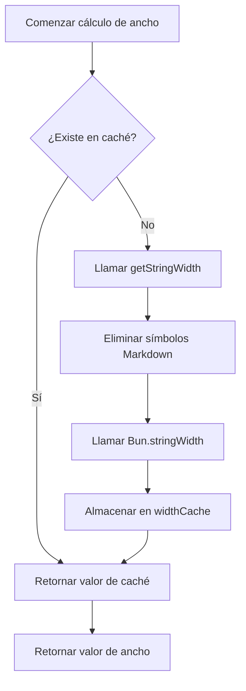

# Detalles Técnicos: Mecanismo de Caché y Optimización de Rendimiento

## Lo Que Aprenderás

- Comprender cómo el mecanismo de caché del complemento mejora el rendimiento
- Dominar la estructura de datos y el uso de widthCache
- Conocer las condiciones de activación de la limpieza automática de caché
- Saber cómo analizar los efectos de la optimización de rendimiento

## Tu Situación Actual

Es posible que te preguntes:

> ¿Cómo calcula el complemento rápidamente el ancho de las tablas? ¿Por qué sigue siendo fluido al procesar tablas grandes? ¿Cómo está diseñado el mecanismo de caché?

Esta lección analiza en profundidad la implementación interna del complemento, llevándote a comprender las ideas de diseño del mecanismo de caché y las estrategias de optimización de rendimiento.

## Idea Central

### ¿Por Qué Usar Caché?

Al formatear tablas Markdown, el complemento necesita calcular el **ancho de visualización** (display width) de cada celda. Este cálculo implica:

1. **Eliminar símbolos Markdown**: como `**negrita**`, `*cursiva*`, `~~tachado~~`
2. **Proteger código en línea**: los símbolos Markdown dentro de `` `código` `` permanecen sin cambios
3. **Llamar a `Bun.stringWidth()`**: calcula el ancho de visualización de caracteres Unicode (incluyendo Emoji, caracteres chinos)

**El problema es**: el mismo contenido de celda puede aparecer repetidamente múltiples veces (como nombres de columnas en el encabezado), y recalcular esta lógica cada vez es lento.

**La solución**: usar caché (Map) para almacenar el mapeo "contenido de texto → ancho de visualización", evitando cálculos repetidos.

## Estructura de Datos de Caché

El complemento usa dos variables globales para gestionar la caché:

### widthCache

```typescript
const widthCache = new Map<string, number>()
```

**Propósito**: almacenar en caché los resultados del cálculo del ancho de visualización de cadenas

**Estructura**:
- **Key**: el contenido de texto original de la celda (incluyendo toda la sintaxis Markdown)
- **Value**: el ancho de visualización calculado (número de caracteres)

**Ejemplo**:

| Texto Original (Key) | Ancho de Visualización (Value) | Descripción |
|--- | --- | ---|
| `**姓名**` | 4 | Ancho de 4 después de eliminar `**` |
| `*年龄*` | 4 | Ancho de 4 después de eliminar `*` |
| `` `status` `` | 8 | Los símbolos de bloque de código también se cuentan en el ancho |
| `张三` | 4 | El ancho de caracteres chinos es 1 |

### cacheOperationCount

```typescript
let cacheOperationCount = 0
```

**Propósito**: registrar el número de operaciones de caché, usado para activar la limpieza automática

**Umbral de limpieza**:
- Operaciones > 100 veces o
- Entradas de caché > 1000 elementos

## Flujo de Búsqueda de Caché

### Función calculateDisplayWidth

Cuando se necesita calcular el ancho de una celda, el complemento llama a la función `calculateDisplayWidth()`, ejecutando el siguiente flujo:

<details>
<summary><strong>📖 Ver código completo</strong></summary>

```typescript
function calculateDisplayWidth(text: string): number {
  if (widthCache.has(text)) {
    return widthCache.get(text)!  // Caché alcanzado, retorna directamente
  }

  const width = getStringWidth(text)  // Calcular ancho real
  widthCache.set(text, width)          // Almacenar en caché
  return width
}
```

</details>

**Diagrama de flujo**:



**Análisis de pasos**:

| Paso | Operación | Complejidad Temporal |
|--- | --- | ---|
| 1 | Verificar `widthCache.has(text)` | O(1) |
| 2 | Caché alcanzado → retornar directamente | O(1) |
| 3 | Caché no alcanzado → calcular ancho | O(n) |
| 4 | Almacenar en caché | O(1) |

**Puntos clave**:
- **Cuando se alcanza la caché**: retorna directamente, sin ningún cálculo (O(1))
- **Cuando no se alcanza la caché**: ejecuta la lógica completa de cálculo de ancho (O(n))
- **Almacenar texto original**: Key es el texto Markdown completo, garantizando coincidencia exacta

## Mecanismo de Limpieza de Caché

### ¿Por Qué Limpiar la Caché?

Aunque la caché puede mejorar el rendimiento, ocupa memoria. Si no se limpia:
- **El uso de memoria crece continuamente**: cada nuevo contenido de celda se almacenará en caché
- **Puede contener datos inútiles**: el contenido de tablas antiguas puede que ya no sea necesario

### Condiciones de Activación de Limpieza Automática

Después de cada formateo completado, el complemento llama a `incrementOperationCount()` para actualizar el contador de operaciones:

<details>
<summary><strong>📖 Ver código de limpieza</strong></summary>

```typescript
function incrementOperationCount() {
  cacheOperationCount++

  if (cacheOperationCount > 100 || widthCache.size > 1000) {
    cleanupCache()
  }
}

function cleanupCache() {
  widthCache.clear()
  cacheOperationCount = 0
}
```

</details>

**Condiciones de activación** (se activa al cumplir cualquiera):

| Condición | Umbral | Descripción |
|--- | --- | ---|
| Número de operaciones | > 100 operaciones de formateo | Evitar activación frecuente de limpieza |
| Entradas de caché | > 1000 celdas | Evitar uso excesivo de memoria |

**Estrategia de limpieza**:
- **Limpieza completa**: `widthCache.clear()` elimina toda la caché
- **Reiniciar contador**: `cacheOperationCount = 0`

::: info Momento de Limpieza

La limpieza de caché ocurre **después de cada formateo completado**, no durante el proceso de formateo. Esto no interrumpe las operaciones de formateo en curso.

:::

## Efectos de Optimización de Rendimiento

### Análisis de Tasa de Aciertos de Caché

Supongamos una tabla de 5 columnas × 10 filas, donde:

- **Contenido repetido**: los nombres de columnas del encabezado aparecen repetidamente 11 veces en la fila separadora y filas de datos
- **Contenido único**: el contenido de cada celda es diferente

**Efecto de caché**:

| Escenario | Sin Caché | Con Caché | Mejora de Rendimiento |
|--- | --- | --- | ---|
| 5 columnas × 10 filas (sin repetición) | 50 cálculos | 50 cálculos | Ninguna |
| 5 columnas × 10 filas (encabezado repetido) | 50 cálculos | 10 cálculos + 40 aciertos de caché | ~80% |

### Impacto Real

**Ventajas de la caché**:

1. **Reducir sobrecarga de cálculo**: evitar repetir la eliminación de símbolos Markdown y llamar a `Bun.stringWidth()`
2. **Reducir uso de CPU**: `getStringWidth()` implica reemplazo de expresiones regulares y cálculos Unicode, con sobrecarga significativa
3. **Mejorar velocidad de respuesta**: para tablas con muchas celdas repetidas, el efecto es más evidente

**Escenarios de ejemplo**:

| Escenario | Efecto de Caché |
|--- | ---|
| Tablas de comparación generadas por IA | ✅ Efecto significativo (contenido repetido en múltiples columnas) |
| Tablas simples de una sola fila | ⚪ Efecto moderado (contenido único) |
| Tablas anidadas con Markdown | ✅ Efecto significativo (gran sobrecarga de eliminación de símbolos) |

## Recomendaciones de Optimización de Rendimiento

::: tip Recomendaciones para Desarrolladores

Si necesitas optimizar aún más el rendimiento, considera:

1. **Ajustar umbrales de caché**: ajustar los umbrales de `100` operaciones y `1000` entradas según el tamaño real de las tablas
2. **Caché LRU**: usar el algoritmo de menos usado recientemente (LRU) para reemplazar la estrategia de limpieza completa
3. **Monitoreo de rendimiento**: agregar registros para estadísticas de tasa de aciertos de caché y analizar efectos reales

:::

## Resumen de la Lección

El complemento usa el mecanismo de caché `widthCache` para optimizar el rendimiento:

- **Estructura de almacenamiento**: `Map<string, number>` mapea texto original a ancho de visualización
- **Flujo de búsqueda**: primero verificar caché → si no se alcanza, calcular y almacenar
- **Mecanismo de limpieza**: limpieza automática cuando operaciones > 100 o entradas > 1000
- **Mejora de rendimiento**: reducir cálculos repetidos, disminuir uso de CPU

Este mecanismo permite que el complemento mantenga fluidez al procesar tablas complejas, siendo la implementación central de la optimización de rendimiento.

## Próxima Lección

> En la próxima lección aprenderemos **[Registro de Cambios: Historial de Versiones y Registro de Cambios](../../changelog/release-notes/)**.
>
> Aprenderás:
> - El historial de evolución de versiones del complemento
> - Registros de nuevas funciones y correcciones
> - Cómo rastrear las actualizaciones del complemento

---

## Apéndice: Referencia de Código Fuente

<details>
<summary><strong>Haz clic para expandir y ver ubicación del código fuente</strong></summary>

> Última actualización: 2026-01-26

| Función | Ruta de Archivo | Número de Línea |
|--- | --- | ---|
| Definición de widthCache | [`source/franlol/opencode-md-table-formatter/index.ts`](https://github.com/franlol/opencode-md-table-formatter/blob/main/index.ts#L6) | 6 |
| Definición de cacheOperationCount | [`source/franlol/opencode-md-table-formatter/index.ts`](https://github.com/franlol/opencode-md-table-formatter/blob/main/index.ts#L7) | 7 |
| Función calculateDisplayWidth | [`source/franlol/opencode-md-table-formatter/index.ts`](https://github.com/franlol/opencode-md-table-formatter/blob/main/index.ts#L151-L159) | 151-159 |
| Función incrementOperationCount | [`source/franlol/opencode-md-table-formatter/index.ts`](https://github.com/franlol/opencode-md-table-formatter/blob/main/index.ts#L219-L225) | 219-225 |
| Función cleanupCache | [`source/franlol/opencode-md-table-formatter/index.ts`](https://github.com/franlol/opencode-md-table-formatter/blob/main/index.ts#L227-L230) | 227-230 |

**Constantes clave**:
- `widthCache = new Map<string, number>()`: estructura Map para caché de ancho de visualización de cadenas
- `cacheOperationCount = 0`: contador de operaciones de caché

**Funciones clave**:
- `calculateDisplayWidth(text: string): number`: calcular ancho de visualización (con caché), primero verificar caché luego calcular
- `incrementOperationCount(): void`: incrementar contador de operaciones, activar limpieza condicional
- `cleanupCache(): void`: limpiar widthCache y reiniciar contador

</details>
