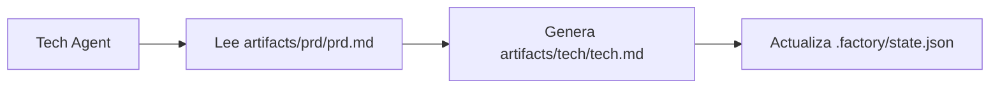

# Optimización de Contexto: Ejecución Dividida por Sesiones

## Lo Que Aprenderás en Esta Lección

- Usar el comando `factory continue` para continuar el pipeline en una nueva sesión
- Comprender las ventajas de que cada fase tenga un contexto limpio e independiente
- Dominar los métodos para reducir drásticamente el consumo de Tokens
- Soportar la recuperación tras interrupciones, permitiendo pausar y reanudar en cualquier momento

## Tu Situación Actual

Cuando ejecutas el pipeline completo de 7 fases en un asistente de IA (como Claude Code), puedes encontrarte con estos problemas:

- **Tokens cada vez más consumidos**: A medida que se acumula la conversación, el contexto se vuelve más largo y cada fase debe cargar todo el contenido de las fases anteriores
- **Costos cada vez más altos**: Una conversación larga significa más Tokens de entrada, y los costos aumentan linealmente
- **Respuestas más lentas**: Un contexto excesivamente largo puede incrementar el tiempo de respuesta
- **Difícil de recuperar**: Si una fase falla, reiniciar requiere recargar una gran cantidad de contexto

::: tip Problema Fundamental
La acumulación de contexto en conversaciones largas es una característica inherente de los asistentes de IA, pero podemos evitar este problema mediante la "ejecución dividida por sesiones".
:::

## Cuándo Usar Esta Técnica

| Escenario | ¿Usar Ejecución Dividida? | Razón |
| --- | --- | --- |
| Ejecutar el pipeline completo de 7 fases | ✅ Altamente Recomendado | Cada Token es valioso |
| Ejecutar solo 1-2 fases | ⚠️ Opcional | El contexto es corto, no siempre es necesario |
| Depurar una fase específica | ⚠️ Opcional | Reintentar frecuentemente puede aumentar el costo de cambio de sesión |
| Recuperar tras interrupción prolongada | ✅ Obligatorio | Evita cargar contexto obsoleto |

## Concepto Central

Agent App Factory soporta la **ejecución dividida por sesiones**, cuya idea central es:

**Después de que termina cada fase, usar una nueva sesión para ejecutar la siguiente fase.**

Los beneficios de hacerlo así:

1. **Contexto Limpio**: Cada fase solo carga los archivos de entrada necesarios, sin depender del historial de conversación
2. **Ahorro de Tokens**: Evita repetir todo el contenido de fases anteriores en cada interacción
3. **Recuperabilidad**: Se puede interrumpir en cualquier momento y continuar después con una nueva sesión sin perder progreso
4. **Compatibilidad Multiplataforma**: Aplicable a todos los asistentes de IA (Claude Code, OpenCode, Cursor, etc.)

### Estrategia de Aislamiento de Contexto

Para lograr la ejecución dividida por sesiones, Agent App Factory adopta una **estrategia de aislamiento de contexto**:

::: info ¿Qué es el Aislamiento de Contexto?
El aislamiento de contexto significa que cada Agent solo depende de archivos de entrada, no del historial de conversación. Sin importar qué haya ocurrido anteriormente, el Agent solo lee información de los archivos de entrada especificados.
:::

Cuando cada Agent se ejecuta:

- ✅ **Solo lee** los archivos `inputs` definidos en `pipeline.yaml`
- ❌ **No usa** ninguna "memoria" del historial de conversación
- ❌ **No asume** saber qué ocurrió en fases anteriores

Por ejemplo, cuando se ejecuta el Tech Agent:



El Tech Agent solo se preocupa por `artifacts/prd/prd.md`, no piensa en "qué aplicación quería construir el usuario". Toda la información proviene de los archivos de entrada.

### Mecanismo de Recuperación de Estado

Cuando ejecutas `factory continue`, el sistema:

1. Lee `.factory/state.json` para obtener el progreso actual
2. Lee `.factory/pipeline.yaml` para determinar la siguiente fase
3. **Solo carga los archivos de entrada necesarios para esa fase**
4. Inicia una nueva ventana del asistente de IA para continuar la ejecución

El archivo de estado (`.factory/state.json`) es el "centro de memoria" de todo el sistema:

```json
{
  "version": 1,
  "status": "waiting_for_confirmation",
  "current_stage": "tech",
  "completed_stages": ["bootstrap", "prd"],
  "last_updated": "2026-01-29T12:00:00Z"
}
```

Después de que cada fase se completa, el estado se actualiza en este archivo. Cuando se inicia una nueva sesión, simplemente leyendo este archivo se puede saber dónde se encuentra actualmente.

## 🎒 Preparativos Antes de Comenzar

::: warning Verificación de Requisitos Previos
Antes de comenzar este tutorial, asegúrate de:

- [ ] Haber completado [Quick Start](../../start/getting-started/) e inicializado un proyecto Factory
- [ ] Haber comprendido la [Visión General del Pipeline de 7 Fases](../../start/pipeline-overview/)
- [ ] Tener instalado Claude Code (u otro asistente de IA)

Si aún no has completado estos requisitos previos, por favor hazlo antes de continuar.
:::

## Sígueme Paso a Paso

Aprendamos a usar el comando `factory continue` a través de un escenario práctico.

### Escenario

Supongamos que estás ejecutando un pipeline de 7 fases, y actualmente has completado las fases `bootstrap` y `prd`, y estás esperando confirmación en la fase `ui`.

### Paso 1: Seleccionar "Continuar en Nueva Sesión" en el Checkpoint

Cuando una fase se completa, el Scheduler Sisyphus muestra una tabla de opciones:

```
✓ ¡ui completado!

Entregables generados:
- artifacts/ui/ui.schema.yaml
- artifacts/ui/preview.web/index.html
- artifacts/ui/preview.web/styles.css
- artifacts/ui/preview.web/app.js

┌─────────────────────────────────────────────────────────────┐
│  📋 Por favor seleccione la siguiente acción               │
│  Ingrese el número de opción (1-5), luego presione Enter   │
└─────────────────────────────────────────────────────────────┘

┌──────┬──────────────────────────────────────────────────────┐
│ Opc. │ Descripción                                           │
├──────┼──────────────────────────────────────────────────────┤
│  1   │ Continuar a la siguiente fase (misma sesión)          │
│      │ Continuaré ejecutando la fase tech                    │
├──────┼──────────────────────────────────────────────────────┤
│  2   │ Continuar en nueva sesión ⭐ Opción recomendada, ahorra Tokens │
│      │ Ejecutar en nueva ventana de terminal: factory continue│
│      │ (Se iniciará automáticamente una nueva ventana de Claude Code y continuará el pipeline) │
├──────┼──────────────────────────────────────────────────────┤
│  3   │ Re-ejecutar esta fase                                  │
│      │ Re-ejecutar la fase ui                               │
├──────┼──────────────────────────────────────────────────────┤
│  4   │ Modificar entregables y re-ejecutar                   │
│      │ Modificar artifacts/prd/prd.md y re-ejecutar            │
├──────┼──────────────────────────────────────────────────────┤
│  5   │ Pausar pipeline                                         │
│      │ Guardar progreso actual, continuar más tarde           │
└──────┴──────────────────────────────────────────────────────┘

💡 Sugerencia: Ingrese un número entre 1-5, luego presione Enter para confirmar su selección
```

**Deberías ver**:
- La opción 2 marcada como "⭐ Opción recomendada, ahorra Tokens"

En la sesión actual, podemos seleccionar la opción 5 (pausar pipeline), y luego ejecutar `factory continue` en una nueva ventana de terminal.

**¿Por qué?**
- La opción 1 es "Continuar a la siguiente fase (misma sesión)", que continuará en la sesión actual y el contexto se acumulará
- La opción 2 es "Continuar en nueva sesión", que ejecutará la siguiente fase con un contexto limpio y nuevo, **ahorrando Tokens**
- La opción 5 es "Pausar pipeline", que guardará el progreso actual y luego se puede reanudar con `factory continue`

### Paso 2: Ejecutar `factory continue` en una Nueva Ventana de Terminal

Abre una nueva ventana de terminal (o pestaña), navega al directorio de tu proyecto y ejecuta:

```bash
factory continue
```

**Deberías ver**:

```
Agent Factory - Continuar en Nueva Sesión

Estado del Pipeline:
────────────────────────────────────────
Proyecto: my-awesome-app
Estado: Waiting
Fase Actual: tech
Completadas: bootstrap, prd

Iniciando nueva sesión de Claude Code...
✓ Nueva ventana de Claude Code iniciada
  (Por favor espera a que se abra la ventana)
```

**Lo que ocurrió**:

1. El comando `factory continue` leyó `.factory/state.json` para conocer el estado actual
2. Mostró la información de estado del proyecto actual
3. Inició automáticamente una nueva ventana de Claude Code y pasó la instrucción "por favor continúa ejecutando el pipeline"
4. La nueva ventana continuará automáticamente desde la fase `tech`

### Paso 3: Continuar Ejecutando en la Nueva Ventana

Una vez iniciada la nueva ventana de Claude Code, verás una nueva conversación, pero el estado se ha restaurado desde el checkpoint guardado anteriormente.

En la nueva sesión, el Agent:

1. Lee `.factory/state.json` para obtener la fase actual
2. Lee `.factory/pipeline.yaml` para determinar las entradas y salidas de esa fase
3. **Solo carga los archivos de entrada necesarios para esa fase** (por ejemplo, `artifacts/prd/prd.md`)
4. Ejecuta las tareas de esa fase

**Punto Clave**:
- No hay historial de conversación de fases anteriores en la nueva sesión
- El Agent solo lee información de los archivos de entrada, no depende de la "memoria"
- Esto es la manifestación del **aislamiento de contexto**

### Paso 4: Verificar el Aislamiento de Contexto

Para verificar si el aislamiento de contexto está funcionando, puedes intentar preguntarle al Agent en la nueva sesión:

"¿Sabes qué hizo la fase bootstrap?"

Si el aislamiento de contexto está funcionando, el Agent responderá algo como:

"Primero necesito revisar los archivos relevantes para entender el trabajo anterior. Permíteme leer..."

Luego intentará leer `input/idea.md` u otros archivos para obtener información, en lugar de "recordar" directamente del historial de conversación.

**Checkpoint ✅**
- Nueva sesión iniciada correctamente
- Se muestra el estado correcto del proyecto
- El Agent solo depende de archivos de entrada, no del historial de conversación

### Paso 5: Continuar Ejecutando las Fases Restantes

Después de que cada fase se complete, puedes elegir:

- Continuar en la sesión actual (opción 1) - Aplicable para flujos cortos
- **Continuar en nueva sesión (opción 2)** - **Recomendado, ahorra Tokens**
- Pausar pipeline (opción 5) - Ejecutar `factory continue` después

Para el pipeline completo de 7 fases, se recomienda usar "Continuar en nueva sesión" para cada fase, de esta manera:

```
bootstrap (sesión 1) → prd (sesión 2) → ui (sesión 3) → tech (sesión 4)
→ code (sesión 5) → validation (sesión 6) → preview (sesión 7)
```

Cada sesión es limpia y no necesita cargar el contenido de todas las fases anteriores.

## Alertas de Posibles Errores

### Error 1: Olvidar Ejecutar `factory continue`

**Práctica Incorrecta**:
- Comenzar la siguiente fase directamente en la sesión antigua
- O abrir una nueva ventana de Claude Code directamente sin ejecutar `factory continue`

**Práctica Correcta**:
- Siempre usa el comando `factory continue` para iniciar una nueva sesión
- Este comando lee automáticamente el estado y pasa las instrucciones correctas

### Error 2: Recargar Archivos Históricos en la Nueva Sesión

**Práctica Incorrecta**:
- Pedir manualmente a la IA que lea los entregables de fases anteriores en la nueva sesión
- Pensar que la IA "debería saber" lo que ocurrió antes

**Práctica Correcta**:
- Confía en el mecanismo de aislamiento de contexto, el Agent leerá automáticamente la información de los archivos de entrada
- Solo proporciona los archivos de entrada necesarios para esa fase

### Error 3: Usar `factory continue` en Múltiples Proyectos

**Práctica Incorrecta**:
- Ejecutar `factory continue` en el Proyecto A, pero el directorio actual es el Proyecto B

**Práctica Correcta**:
- `factory continue` verifica si el directorio actual es un proyecto Factory
- Si no lo es, te pedirá que ejecutes `factory init` primero

### Error 4: No Usar `factory continue` Después de Modificar Entregables

**Escenario**:
- Después de completar una fase, modificas manualmente el entregable (como el PRD)
- Quieres continuar ejecutando la siguiente fase

**Práctica Correcta**:
- Ejecutar `factory run` (reiniciará desde la fase especificada)
- O ejecutar `factory continue` (continuará desde el checkpoint actual)
- No continúes directamente en la sesión antigua, porque el contexto puede ser inconsistente

## Resumen de Esta Lección

En esta lección aprendimos a usar el comando `factory continue` para la ejecución dividida por sesiones:

### Puntos Clave

1. **Ejecución Dividida por Sesiones**: Después de que cada fase se completa, usar una nueva sesión para ejecutar la siguiente fase
2. **Aislamiento de Contexto**: El Agent solo depende de archivos de entrada, no del historial de conversación
3. **Recuperación de Estado**: `.factory/state.json` registra el progreso actual, las nuevas sesiones pueden recuperar el estado
4. **Ahorro de Tokens**: Evita cargar un contexto excesivamente largo, reduciendo significativamente los costos

### Referencia Rápida de Comandos

| Comando | Función | Escenario de Uso |
| --- | --- | --- |
| `factory continue` | Continuar el pipeline en nueva sesión | Después de que cada fase se complete |
| `factory run` | Ejecutar el pipeline en la sesión actual | Primera ejecución o depuración |
| `factory status` | Ver el estado actual del proyecto | Entender el progreso |

### Mejores Prácticas

- ✅ Al ejecutar el pipeline completo de 7 fases, usar `factory continue` en cada fase
- ✅ En el checkpoint seleccionar "Continuar en nueva sesión" (opción 2)
- ✅ Confiar en el mecanismo de aislamiento de contexto, no cargar manualmente archivos históricos
- ✅ Usar `factory status` para verificar el progreso del proyecto

## Vista Previa de la Siguiente Lección

> En la siguiente lección aprenderemos **[Mecanismos de Permisos y Seguridad](../security-permissions/)**.
>
> Aprenderás:
> - Cómo la matriz de límites de capacidades previene que los Agentes excedan sus permisos
> - Mecanismos de manejo de excesos de permisos y aislamiento de entregables no confiables
> - Puntos de verificación de seguridad y procesos de verificación de permisos
> - Cómo configurar los archivos de permisos de Claude Code

Esta lección te ayudará a comprender los mecanismos de seguridad de Agent App Factory, asegurando que cada Agent solo lea y escriba archivos en directorios autorizados.

---

## Apéndice: Referencia del Código Fuente

<details>
<summary><strong>Haz clic para ver la ubicación del código fuente</strong></summary>

> Última actualización: 2026-01-29

| Función | Ruta del Archivo | Número de Línea |
| --- | --- | --- |
| Comando factory continue | [`cli/commands/continue.js`](https://github.com/hyz1992/agent-app-factory/blob/main/cli/commands/continue.js) | 1-144 |
| Optimización de contexto del scheduler | [`agents/orchestrator.checkpoint.md`](https://github.com/hyz1992/agent-app-factory/blob/main/agents/orchestrator.checkpoint.md) | 113-154 |
| Estrategia de aislamiento de contexto | [`policies/context-isolation.md`](https://github.com/hyz1992/agent-app-factory/blob/main/policies/context-isolation.md) | 1-64 |

**Funciones Clave**:
- `launchClaudeCode(projectDir, nextStage, completedStages)`: Inicia una nueva ventana de Claude Code
- `commandExists(cmd)`: Verifica si un comando está disponible
- `module.exports(projectDir)`: Función principal del comando `factory continue`

**Constantes Clave**:
- `state.json`: Ruta del archivo de estado (`.factory/state.json`)
- `pipeline.yaml`: Ruta del archivo de definición del pipeline (`.factory/pipeline.yaml`)
- `config.yaml`: Ruta del archivo de configuración del proyecto (`.factory/config.yaml`)

**Reglas de Negocio Clave**:
- BR-6-1: Cada fase disfruta de un contexto limpio independiente
- BR-6-2: Usar el comando `factory continue` para continuar
- BR-6-3: Solo cargar los archivos necesarios para la fase actual

</details>
