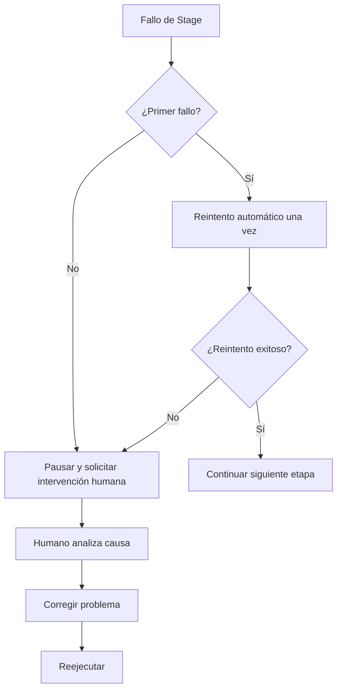
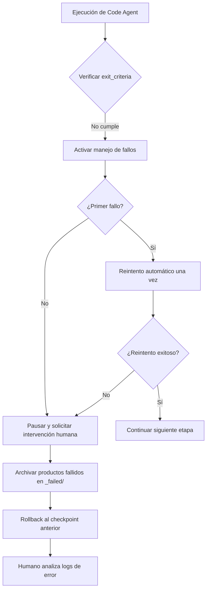
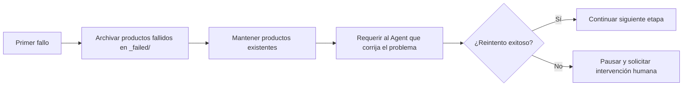
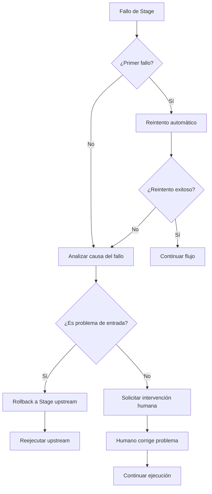

# Manejo de Fallos y Rollback: Tolerancia Inteligente y Recuperación de Errores

## Lo que Aprenderás

- **Identificar tipos de fallos**: Juzgar rápidamente las causas de fallos como salida faltante, contenido no coincidente, escritura no autorizada, etc.
- **Comprender el mecanismo de reintento**: Dominar la estrategia de reintento automático una vez y las reglas de archivo de fallos
- **Ejecutar operaciones de rollback**: Aprender a hacer rollback al checkpoint exitoso más reciente y restaurar el estado estable
- **Procesar intervención humana**: Saber cuándo se necesita intervención humana, cómo analizar las causas del fallo y corregirlos
- **Interpretar registros de errores**: Entender los informes de error de `pipeline/error.log` y localizar problemas rápidamente

## Tu Situación Actual

Cuando ejecutas el pipeline, lo que más te preocupa es:

- **¿Qué hacer si falla?**: Una etapa reporta un error, ¿reintentar o empezar desde cero?
- **Datos contaminados**: ¿Los productos fallidos afectarán las etapas posteriores? ¿Se limpiarán?
- **Cómo hacer rollback**: ¿Quieres volver al estado anterior exitoso, cómo hacerlo?
- **Intervención humana**: ¿Fallos consecutivos, qué necesito hacer? ¿Cómo ver los logs?

El mecanismo de manejo de fallos existe para resolver estos problemas: define el flujo completo de identificación de fallos, reintento automático, archivo de productos fallidos, rollback a checkpoints e intervención humana.

## Cuándo Usar Esta Técnica

Cuando el pipeline presente las siguientes situaciones:

- **Fallo de etapa**: El Agent falla en la ejecución, archivos de salida faltantes o que no cumplen expectativas
- **Operación no autorizada**: El Agent escribe en directorios no autorizados, activando verificaciones de seguridad
- **Fallos consecutivos**: La misma etapa falla dos veces, requiere análisis de intervención humana
- **Necesidad de rollback**: Quieres volver al estado exitoso anterior para reiniciar
- **Análisis de logs**: Necesitas ver informes de error detallados e información de stack

## Conceptos Clave

La estrategia de manejo de fallos es ejecutada uniformemente por el scheduler Sisyphus, que actúa como un **ingeniero de tolerancia a fallos**, manejando automáticamente los errores del pipeline o solicitando intervención humana.

### Definición de Fallo

Las siguientes situaciones se consideran fallos de Stage:

| Tipo de Fallo | Síntoma | Ubicación del Código |
|---------------|---------|---------------------|
| **Salida faltante** | El archivo de salida especificado en `pipeline.yaml` no existe o el nombre no coincide | `failure.policy.md:9` |
| **No cumple exit_criteria** | El contenido de salida no satisface las condiciones de salida en `pipeline.yaml` | `failure.policy.md:10` |
| **Escritura no autorizada** | El Agent escribe contenido en directorios o archivos no autorizados | `failure.policy.md:11` |
| **Otras excepciones** | Errores de script, imposibilidad de leer entrada, etc., que impiden completar la tarea | `failure.policy.md:12` |

### Mecanismo de Reintento



**Reglas de reintento** (`failure.policy.md:16-18`):

- Cada Stage permite **reintento automático una vez** por defecto
- Al reintentar, el scheduler requiere que el Agent corrija el problema manteniendo los productos existentes, en lugar de rehacer completamente
- Si el segundo intento también falla, el scheduler debe pausar el pipeline y entrar en el flujo de intervención humana

### Rollback y Archivo

**Archivo de fallos** (`failure.policy.md:22-23`):

```bash
# Productos fallidos movidos al directorio _failed/
mv artifacts/<stage>/ artifacts/_failed/<stage-id>/attempt-1/
mv artifacts/<stage>/ artifacts/_failed/<stage-id>/attempt-2/
```

**Estrategia de rollback** (`failure.policy.md:23`):

- El scheduler hace rollback al checkpoint exitoso más reciente
- Reinicia la ejecución desde esa Stage
- Asegura consistencia de productos upstream y downstream, evitando contaminación de datos

### Intervención Humana

**Momento de intervención** (`failure.policy.md:27`):

- Después de que la misma Stage falle dos veces consecutivas
- Cuando se detecta escritura no autorizada

**Flujo de intervención** (`failure.policy.md:27-29`):

1. El scheduler pausa la ejecución y reporta la causa del fallo
2. El humano verifica si hay problemas con la entrada, configuración o habilidades
3. El humano modifica archivos de entrada, ajusta habilidades o modifica parámetros
4. Continúa ejecutando el flujo restante

::: warning Restricción del Scheduler
El scheduler no debe omitir etapas fallidas o modificar salidas sin confirmación humana.
:::

## Guía Práctica

### Paso 1: Conocer el Flujo de Manejo de Fallos

Cuando ejecutas el pipeline, si una etapa falla, el scheduler Sisyphus iniciará automáticamente el flujo de manejo de fallos.

**Escenario de ejemplo**: Fallo en la etapa Code



### Paso 2: Ver Registros de Error

Cuando falla, el scheduler registrará información de error detallada en `pipeline/error.log`.

**Formato de registro de error** (`failure.policy.md:166-200`):

```bash
cat pipeline/error.log
```

**Deberías ver**:

```log
============================================
ERROR REPORT
============================================
Timestamp: 2026-01-29T10:30:00Z
Stage: code
Attempt: 2/2
Status: FAILED

Error Type: TypeScript Compilation Error
Error Message: Cannot find module '@prisma/client'

Stack Trace:
at Object.<anonymous> (src/lib/prisma.ts:1:1)
at Module._compile (node:internal/modules/cjs/loader:1198:14)

Exit Criteria Failed:
- [ ] Backend puede iniciarse sin errores graves (FAILED)
- [x] Cliente puede renderizarse y accederse
- [x] No se introdujeron funciones adicionales de autenticación o irrelevantes

Failed Artifacts Moved To:
artifacts/_failed/code/attempt-2/

Recommended Action:
1. Verificar si package.json contiene @prisma/client
2. Ejecutar npx prisma generate para generar cliente
3. Reintentar etapa Code

============================================
```

**Interpretación del registro de error**:

| Campo | Descripción | Ejemplo |
|-------|-------------|---------|
| **Timestamp** | Momento del fallo | 2026-01-29T10:30:00Z |
| **Stage** | Etapa que falló | code |
| **Attempt** | Número de reintentos | 2/2 (segundo fallo) |
| **Status** | Estado actual | FAILED |
| **Error Type** | Tipo de error | TypeScript Compilation Error |
| **Error Message** | Descripción del error | Cannot find module '@prisma/client' |
| **Stack Trace** | Información de stack | src/lib/prisma.ts:1:1 |
| **Exit Criteria Failed** | Condiciones de salida no cumplidas | Backend puede iniciarse sin errores graves (FAILED) |
| **Failed Artifacts Moved To** | Ubicación de archivo de productos fallidos | artifacts/_failed/code/attempt-2/ |
| **Recommended Action** | Pasos de corrección recomendados | 1. Verificar package.json... |

### Paso 3: Entender el Mecanismo de Reintento

Cuando ocurre el primer fallo, Sisyphus activará automáticamente el reintento.

**Flujo de reintento** (`failure.policy.md:16-18`):



**Características importantes**:

- **Corrección incremental**: Al reintentar, el scheduler requiere que el Agent corrija el problema sobre la base de los productos existentes, en lugar de rehacer completamente
- **Archivo de fallos**: Cada producto fallido se moverá a `artifacts/_failed/<stage-id>/attempt-N/`, facilitando el análisis comparativo
- **Máximo uno**: Por defecto solo se permite un reintento automático, evitando bucles infinitos

### Paso 4: Ver Archivo de Fallos

Cuando una etapa falla, todos los productos fallidos se archivarán en el directorio `artifacts/_failed/`.

**Estructura de directorios**:

```bash
artifacts/
├── _failed/
│   ├── code/
│   │   ├── attempt-1/
│   │   │   ├── backend/
│   │   │   └── client/
│   │   └── attempt-2/
│   │       ├── backend/
│   │       └── client/
│   ├── ui/
│   │   └── attempt-1/
│   └── prd/
│       └── attempt-1/
```

**Reglas de nomenclatura de directorios de archivo**:

- `artifacts/_failed/<stage-id>/attempt-N/`
- `<stage-id>`: Nombre de la etapa fallida (ej. `code`, `ui`, `prd`)
- `attempt-N`: Número de intentos (1 indica primer fallo, 2 indica segundo fallo)

**Por qué se necesita archivo**:

- **Evitar contaminación**: Los productos fallidos no afectarán las etapas posteriores
- **Facilitar análisis**: Se pueden comparar diferencias entre diferentes intentos para encontrar la causa raíz
- **Preservar evidencia**: Conservar productos fallidos para depuración posterior

### Paso 5: Ejecutar Operación de Rollback

Cuando necesitas volver a un estado anterior, puedes usar la función de rollback.

**Flujo de rollback** (`failure.policy.md:23`):

```bash
# Rollback manual al checkpoint anterior
factory run <stage-id>

# Por ejemplo: rollback a etapa tech para reejecutar
factory run tech
```

**Reglas de rollback**:

- **Objetivo de rollback**: Hacer rollback al checkpoint exitoso más reciente
- **Restablecer estado**: Limpiar productos de la etapa actual y archivo de fallos
- **Reejecutar**: Reiniciar ejecución desde la etapa objetivo

**Ejemplo de rollback**:

Supón que fallaste dos veces en la etapa Code y quieres volver a la etapa Tech para rediseñar la arquitectura:

```bash
# 1. Rollback a etapa tech
factory run tech

# 2. El asistente de IA reejecutará Tech Agent
# 3. Regenerar artifacts/tech/ y artifacts/backend/prisma/
# 4. Luego continuar ejecutando etapa Code
```

### Paso 6: Procesar Intervención Humana

Cuando hay dos fallos consecutivos, Sisyphus pausará el pipeline y solicitará intervención humana.

**Árbol de decisión de intervención** (`failure.policy.md:204-236`):



**Lista de verificación de intervención humana** (`failure.policy.md:240-263`):

#### Verificación de Entorno

- [ ] Node.js versión >= 18
- [ ] npm versión >= 9
- [ ] Espacio en disco suficiente
- [ ] Conexión de red normal (descarga npm)

#### Verificación de Estado

- [ ] Estado de `.factory/state.json` correcto
- [ ] Productos de Stage upstream completos
- [ ] Productos fallidos archivados en `_failed/`

#### Confirmación de Corrección

- [ ] Causa del fallo identificada
- [ ] Plan de corrección implementado
- [ ] Configuración relacionada actualizada

#### Recuperación de Ejecución

- [ ] Reiniciar desde Stage fallida
- [ ] Monitorear logs de ejecución
- [ ] Verificar productos de salida

### Paso 7: Manejo de Escenarios de Fallo Comunes

Diferentes etapas tienen diferentes escenarios de fallo comunes, a continuación se presentan las soluciones.

#### 7.1 Fallo en Etapa Bootstrap

**Errores comunes** (`failure.policy.md:35-48`):

| Tipo de Error | Síntoma | Causa | Solución |
|---------------|---------|-------|----------|
| **Salida faltante** | `input/idea.md` no existe | El Agent no escribió el archivo correctamente | Reintentar, verificar ruta de escritura |
| **Contenido incompleto** | idea.md falta capítulos clave | Información de entrada del usuario insuficiente | Pausar, solicitar al usuario información adicional |
| **Error de formato** | No cumple estructura de plantilla | El Agent no siguió la plantilla | Reintentar, enfatizar requisitos de plantilla |

**Flujo de procesamiento**:

```bash
# 1. Verificar si existe directorio input/
ls -la input/

# 2. Si no existe, crear directorio
mkdir -p input/

# 3. Reintentar etapa Bootstrap
factory run bootstrap
```

#### 7.2 Fallo en Etapa PRD

**Errores comunes** (`failure.policy.md:50-65`):

| Tipo de Error | Síntoma | Causa | Solución |
|---------------|---------|-------|----------|
| **Contiene detalles técnicos** | PRD tiene descripción de stack tecnológico | El Agent excede límites | Reintentar, enfatizar límites de responsabilidad |
| **Demasiadas funciones** | Must Have > 7 | Expansión de alcance | Reintentar, solicitar reducir a MVP |
| **Descripción de usuario vaga** | "todos", "la mayoría de usuarios" | No especificado | Reintentar, solicitar perfil de usuario específico |
| **Faltan non-goals** | Non-Goals está vacío | Límites no definidos | Reintentar, solicitar listar non-goals |

**Flujo de procesamiento**:

```bash
# 1. Verificar que PRD no contenga palabras clave técnicas
grep -E "(React|API|base de datos)" artifacts/prd/prd.md

# 2. Verificar que cantidad de funciones Must Have ≤ 7
grep -A 100 "Must Have" artifacts/prd/prd.md | wc -l

# 3. Proporcionar requisitos de corrección específicos al reintentar
factory run prd
```

#### 7.3 Fallo en Etapa UI

**Errores comunes** (`failure.policy.md:67-82`):

| Tipo de Error | Síntoma | Causa | Solución |
|---------------|---------|-------|----------|
| **Exceso de páginas** | Cantidad de páginas > 8 | Expansión de alcance | Reintentar, solicitar reducir páginas |
| **Vista previa no abre** | Archivo HTML dañado | Error de generación | Reintentar, verificar sintaxis HTML |
| **Usa estilo AI** | Fuente Inter + degradado púrpura | No siguió guía de estética | Reintentar, solicitar elegir estética distintiva |
| **Schema inválido** | Fallo de análisis YAML | Error de sintaxis | Reintentar, validar sintaxis YAML |

**Flujo de procesamiento**:

```bash
# 1. Contar cantidad de páginas en ui.schema.yaml
grep -c "page:" artifacts/ui/ui.schema.yaml

# 2. Intentar abrir vista previa en navegador
open artifacts/ui/preview.web/index.html

# 3. Validar sintaxis YAML
npx js-yaml artifacts/ui/ui.schema.yaml

# 4. Verificar si usa elementos de estilo AI prohibidos
grep -E "(Inter|purple|gradient)" artifacts/ui/ui.schema.yaml
```

#### 7.4 Fallo en Etapa Tech

**Errores comunes** (`failure.policy.md:84-99`):

| Tipo de Error | Síntoma | Causa | Solución |
|---------------|---------|-------|----------|
| **Error de sintaxis Prisma** | schema.prisma inválido | Problema de sintaxis | Reintentar, ejecutar prisma validate |
| **Sobrediseño** | Introduce microservicios/caché | Violación de principio MVP | Reintentar, solicitar simplificar arquitectura |
| **Demasiados modelos de datos** | Cantidad de tablas > 10 | Expansión de alcance | Reintentar, reducir modelos de datos |
| **Falta definición de API** | tech.md sin lista de endpoints | Contenido incompleto | Reintentar, solicitar completar API |

**Flujo de procesamiento**:

```bash
# 1. Ejecutar validación Prisma
cd artifacts/backend
npx prisma validate

# 2. Verificar que tech.md contenga capítulos necesarios
grep -E "(API|endpoint|ruta)" artifacts/tech/tech.md

# 3. Contar cantidad de modelos de datos
grep -c "model " artifacts/backend/prisma/schema.prisma

# 4. Verificar si introduce tecnología compleja innecesaria
grep -E "(microservicio|caché|cola)" artifacts/tech/tech.md
```

#### 7.5 Fallo en Etapa Code

**Errores comunes** (`failure.policy.md:101-131`):

| Tipo de Error | Síntoma | Causa | Solución |
|---------------|---------|-------|----------|
| **Fallo de instalación de dependencias** | Error de npm install | Conflicto de versiones de paquetes | Verificar package.json, actualizar versiones |
| **Error de TypeScript** | Fallo de compilación tsc | Problemas de tipos | Corregir errores de tipos, reintentar |
| **Faltan archivos necesarios** | Estructura de directorios incompleta | Omisión de generación | Reintentar, verificar lista de archivos |
| **Fallo de pruebas** | Fallo de npm test | Error de lógica de código | Corregir pruebas, reintentar |
| **API no puede iniciar** | Fallo de escucha de puerto | Problema de configuración | Verificar configuración de variables de entorno |

**Flujo de procesamiento**:

```bash
# 1. Ejecutar verificación de dependencias
cd artifacts/backend
npm install --dry-run

# 2. Ejecutar verificación de tipos
npx tsc --noEmit

# 3. Verificar estructura de directorios contra lista de archivos
ls -la src/

# 4. Ejecutar pruebas
npm test

# 5. Si todo lo anterior pasa, intentar iniciar servicio
npm run dev
```

**Corrección de problemas comunes de dependencias** (`failure.policy.md:120-131`):

```bash
# Conflicto de versiones
rm -rf node_modules package-lock.json
npm install

# Versión de Prisma no coincide
npm install @prisma/client@latest prisma@latest

# Problemas de dependencias de React Native
cd artifacts/client
npx expo install --fix
```

#### 7.6 Fallo en Etapa Validation

**Errores comunes** (`failure.policy.md:133-147`):

| Tipo de Error | Síntoma | Causa | Solución |
|---------------|---------|-------|----------|
| **Informe de validación incompleto** | Capítulos faltantes en report.md | El Agent no completó | Reintentar |
| **Demasiados problemas graves** | Cantidad de errores > 10 | Mala calidad de etapa Code | Rollback a etapa Code |
| **Problemas de seguridad** | Se detectaron claves codificadas | Violación de seguridad | Rollback, corregir problemas de seguridad |

**Flujo de procesamiento**:

```bash
# 1. Analizar report.md para confirmar que existen todos los capítulos
grep -E "(## Resumen|## Backend|## Frontend|## Problemas)" artifacts/validation/report.md

# 2. Contar cantidad de problemas graves
grep -c "problema grave" artifacts/validation/report.md

# 3. Si problemas graves > 10, sugerir rollback a etapa Code
factory run code

# 4. Verificar resultados de escaneo de seguridad
grep -E "(clave|contraseña|token)" artifacts/validation/report.md
```

#### 7.7 Fallo en Etapa Preview

**Errores comunes** (`failure.policy.md:149-162`):

| Tipo de Error | Síntoma | Causa | Solución |
|---------------|---------|-------|----------|
| **README incompleto** | Faltan pasos de instalación | Omisión de contenido | Reintentar, completar pasos |
| **Fallo de construcción Docker** | Error de Dockerfile | Problema de configuración | Corregir Dockerfile |
| **Configuración de despliegue faltante** | Sin docker-compose | No generado | Reintentar, solicitar generar configuración |

**Flujo de procesamiento**:

```bash
# 1. Verificar que README.md contenga todos los capítulos necesarios
grep -E "(## Inicio rápido|## Instalación|## Ejecución)" artifacts/preview/README.md

# 2. Intentar docker build para validar Dockerfile
cd artifacts/preview
docker build -t test-app .

# 3. Verificar si existen archivos de configuración de despliegue
ls -la docker-compose.yml .github/workflows/
```

## Checkpoint ✅

Al completar esta lección, deberías:

- [ ] Entender los 4 tipos de manejo de fallos (salida faltante, contenido no coincidente, no autorizado, excepción)
- [ ] Dominar el mecanismo de reintento automático una vez
- [ ] Saber que los productos fallidos se archivan en `artifacts/_failed/`
- [ ] Poder interpretar informes de error de `pipeline/error.log`
- [ ] Entender el flujo de rollback a checkpoints
- [ ] Saber cuándo se necesita intervención humana
- [ ] Dominar soluciones para escenarios de fallo comunes

## Advertencias de Problemas

### Problema 1: Productos completamente rehechos durante el reintento

**Síntoma**: En el segundo reintento, todos los productos se regeneran, en lugar de corregir sobre la base existente.

**Causa**: El Agent no siguió la regla de "corregir sobre la base de productos existentes".

**Solución**:

Al reintentar, informa claramente al Agent:

```markdown
Por favor corrige el problema sobre la base de los productos existentes, no rehagas completamente.
Mantén las partes correctas existentes, solo modifica las partes que no cumplen exit_criteria.
```

### Problema 2: Productos fallidos contaminan etapas posteriores

**Síntoma**: Los productos fallidos no se archivan, afectando la ejecución de etapas posteriores.

**Causa**: El paso de archivar productos fallidos no se ejecutó.

**Solución**:

Archivar manualmente los productos fallidos:

```bash
# Mover productos fallidos al directorio _failed/
mv artifacts/<stage-id> artifacts/_failed/<stage-id>/attempt-1/

# Luego reejecutar esa etapa
factory run <stage-id>
```

### Problema 3: Inconsistencia de productos después del rollback

**Síntoma**: Después de hacer rollback a la etapa upstream, los productos son inconsistentes con antes.

**Causa**: Al hacer rollback solo se restableció la etapa actual, no se limpiaron los productos downstream dependientes.

**Solución**:

Flujo de rollback completo:

```bash
# 1. Rollback a etapa objetivo
factory run <target-stage>

# 2. Limpiar productos de todas las etapas downstream
rm -rf artifacts/<downstream-stage-1>/
rm -rf artifacts/<downstream-stage-2>/

# 3. Reejecutar
factory run
```

### Problema 4: Fallo continuo después de intervención humana

**Síntoma**: Después de corregir el problema y continuar la ejecución, sigue fallando.

**Causa**: El plan de corrección es incompleto o las modificaciones no se guardaron.

**Solución**:

Lista de verificación de intervención humana:

```bash
# 1. Confirmar que la causa del fallo está identificada
cat pipeline/error.log

# 2. Confirmar que el plan de corrección está implementado
# Verificar archivos modificados

# 3. Confirmar que la configuración relacionada está actualizada
cat .factory/state.json

# 4. Reejecutar
factory run <failed-stage>
```

### Problema 5: Registro de error incompleto

**Síntoma**: Falta información clave en `pipeline/error.log`.

**Causa**: El scheduler no registró correctamente el log de error.

**Solución**:

Verificar si existe el archivo de log:

```bash
# Si no existe, crear manualmente
mkdir -p pipeline
cat > pipeline/error.log << 'EOF'
ERROR REPORT
============================================
Timestamp: $(date -u +"%Y-%m-%dT%H:%M:%SZ")
Stage: <stage-id>
Attempt: 1/1
Status: FAILED

Error Type: Manual Debug
Error Message: Debug information needed

Stack Trace:
(add stack trace if available)

Exit Criteria Failed:
- [ ] exit-criteria-1
- [ ] exit-criteria-2

Failed Artifacts Moved To:
artifacts/_failed/<stage-id>/attempt-1/

Recommended Action:
1. Describe the issue
2. Provide fix steps
3. Retry the stage

============================================
EOF
```

## Mejores Prácticas

### 1. Fallo Temprano

**Principio**: Descubrir problemas lo antes posible, evitar perder tiempo en etapas posteriores.

**Práctica**:

- En etapa Bootstrap, verificar si la entrada del usuario está completa
- En etapa PRD, verificar si contiene detalles técnicos (violación de límites de responsabilidad)
- En etapa UI, verificar si la cantidad de páginas es razonable

### 2. Logs Detallados

**Principio**: Registrar suficiente información de contexto para facilitar la investigación de problemas.

**Práctica**:

- El registro de error contiene timestamp, etapa, número de intentos, tipo de error, información de stack
- Los pasos de corrección recomendados son específicos hasta nombre de archivo y número de línea
- Archivar productos fallidos facilita el análisis comparativo

### 3. Operaciones Atómicas

**Principio**: La salida de cada etapa debe ser atómica, facilitando el rollback.

**Práctica**:

- Generar todos los archivos de producto de una vez, en lugar de escribir gradualmente
- Si falla a mitad de camino, no conservar productos incompletos
- Archivar todos los productos de la etapa, no solo archivos parciales

### 4. Preservar Evidencia

**Principio**: Archivar productos fallidos antes de reintentar, facilitando el análisis comparativo.

**Práctica**:

- Cada fallo se archiva en el subdirectorio `attempt-N/`
- Conservar productos de múltiples intentos, facilitando comparar diferencias
- Usar `git diff` para comparar diferencias entre diferentes intentos

### 5. Reintento Progresivo

**Principio**: Proporcionar orientación más específica al reintentar, en lugar de repetir simplemente.

**Práctica**:

```markdown
# Primer fallo
Por favor genera el documento PRD.

# Segundo reintento (proporcionar orientación específica)
Por favor corrige los siguientes problemas sobre la base del PRD existente:
1. Eliminar todos los detalles técnicos (como React, API, etc.)
2. Reducir la cantidad de funciones Must Have de 10 a 7
3. Agregar perfil de usuario específico para el target
4. Completar capítulo Non-Goals y definir límites
```

## Resumen de la Lección

El mecanismo de manejo de fallos es la garantía de tolerancia a fallos de AI App Factory, asegura que el pipeline pueda recuperarse automáticamente o solicitar intervención humana cuando ocurren errores.

**Puntos clave**:

1. **Definición de fallo**: Salida faltante, contenido no coincidente, escritura no autorizada, otras excepciones
2. **Mecanismo de reintento**: Cada etapa permite un reintento automático, después de dos fallos solicita intervención humana
3. **Archivo de fallos**: Los productos fallidos se mueven a `artifacts/_failed/<stage-id>/attempt-N/`
4. **Estrategia de rollback**: Hacer rollback al checkpoint exitoso más reciente, asegurar consistencia de productos upstream y downstream
5. **Intervención humana**: Después de dos fallos consecutivos, analizar causas, corregir problemas, reejecutar
6. **Registro de error**: Informe de error detallado contiene timestamp, etapa, tipo de error, información de stack, pasos de corrección recomendados
7. **Escenarios comunes**: Cada etapa tiene errores comunes específicos y soluciones

## Vista Previa de la Siguiente Lección

> En la siguiente lección aprenderemos **[Preguntas Frecuentes y Solución de Problemas](../../faq/troubleshooting/)**.
>
> Aprenderás:
> - Problemas comunes en la fase de inicialización
> - Solución de problemas durante la ejecución
> - Manejo de problemas relacionados con el despliegue

---

## Apéndice: Referencia de Código Fuente

<details>
<summary><strong>Haz clic para expandir y ver ubicación del código fuente</strong></summary>

> Última actualización: 2026-01-29

| Función | Ruta de Archivo | Número de Línea |
|---------|-----------------|-----------------|
| Definición de política de fallos | [`source/hyz1992/agent-app-factory/policies/failure.policy.md`](https://github.com/hyz1992/agent-app-factory/blob/main/policies/failure.policy.md) | 1-276 |
| Manejo de fallos del scheduler | [`source/hyz1992/agent-app-factory/agents/orchestrator.checkpoint.md`](https://github.com/hyz1992/agent-app-factory/blob/main/agents/orchestrator.checkpoint.md) | 38-46 |
| Matriz de límites de capacidad | [`source/hyz1992/agent-app-factory/policies/capability.matrix.md`](https://github.com/hyz1992/agent-app-factory/blob/main/policies/capability.matrix.md) | 1-40 |

**Definición de fallo** (`failure.policy.md:5-13`):
- Salida faltante: El archivo de salida especificado en `pipeline.yaml` no existe o el nombre no coincide
- No cumple exit_criteria: El contenido de salida no satisface el `exit_criteria` de esa Stage en `pipeline.yaml`
- Escritura no autorizada: El Agent escribe en directorios o archivos no autorizados
- Otras excepciones: Errores de script, imposibilidad de leer entrada, etc., que impiden completar la tarea

**Mecanismo de reintento** (`failure.policy.md:16-18`):
- Cada Stage permite reintento automático una vez por defecto
- El scheduler debe requerir que el Agent corrija el problema manteniendo los productos existentes, en lugar de rehacer completamente
- Si el segundo intento también falla, el scheduler debe pausar el pipeline y entrar en el flujo de intervención humana

**Rollback y archivo** (`failure.policy.md:22-23`):
- Los productos fallidos se mueven al directorio `artifacts/_failed/<stage-id>/`
- Hacer rollback al checkpoint exitoso más reciente, reiniciar ejecución desde esa Stage

**Intervención humana** (`failure.policy.md:27-29`):
- Cuando la misma Stage falla dos veces consecutivas, el scheduler debe pausar la ejecución y reportar la causa del fallo
- Después de la intervención humana, se pueden modificar archivos de entrada, ajustar habilidades o modificar parámetros, luego continuar ejecutando el flujo restante
- El scheduler no debe omitir etapas fallidas o modificar salidas sin confirmación humana

**Formato de registro de error** (`failure.policy.md:166-200`):
- Timestamp, Stage, Attempt, Status
- Error Type, Error Message, Stack Trace
- Exit Criteria Failed
- Failed Artifacts Moved To
- Recommended Action

**Escenarios de fallo comunes** (`failure.policy.md:33-162`):
- Etapa Bootstrap: Salida faltante, contenido incompleto, error de formato
- Etapa PRD: Contiene detalles técnicos, demasiadas funciones, descripción de usuario vaga, faltan non-goals
- Etapa UI: Exceso de páginas, vista previa no abre, usa estilo AI, schema inválido
- Etapa Tech: Error de sintaxis Prisma, sobrediseño, demasiados modelos de datos, falta definición de API
- Etapa Code: Fallo de instalación de dependencias, error de TypeScript, faltan archivos necesarios, fallo de pruebas, API no puede iniciar
- Etapa Validation: Informe de validación incompleto, demasiados problemas graves, problemas de seguridad
- Etapa Preview: README incompleto, fallo de construcción Docker, configuración de despliegue faltante

**Flujo de manejo de fallos del scheduler** (`orchestrator.checkpoint.md:38-46`):
- Leer `policies/failure.policy.md`, ejecutar según la política
- Requerir que el Agent corrija el problema manteniendo los productos existentes y reintentar
- Los productos fallidos se mueven al directorio `artifacts/_failed/<stage-id>/`
- Después de dos fallos consecutivos pausar el pipeline, reportar la causa del fallo y esperar intervención humana

**Manejo de no autorización** (`orchestrator.checkpoint.md:48-52`):
- Verificar si la ruta de salida se limita a directorios autorizados
- Si se detecta escritura no autorizada, mover ese producto a `artifacts/_untrusted/<stage-id>/`
- Pausar ejecución y reportar

**Árbol de decisión de intervención humana** (`failure.policy.md:204-236`):
- Primer fallo → Reintento automático → ¿Reintento exitoso? → Continuar / Segundo fallo
- Segundo fallo → Analizar causa del fallo → ¿Es problema de entrada? → Rollback a Stage upstream / Solicitar intervención humana

**Lista de verificación de recuperación de fallos** (`failure.policy.md:240-263`):
- Verificación de entorno: Versión de Node.js, versión de npm, espacio en disco, conexión de red
- Verificación de estado: `.factory/state.json`, productos de Stage upstream, archivo de productos fallidos
- Confirmación de corrección: Causa del fallo, plan de corrección, configuración relacionada
- Recuperación de ejecución: Reiniciar desde Stage fallida, monitorear logs, verificar productos

**Mejores prácticas** (`failure.policy.md:267-274`):
- Fallo temprano: Descubrir problemas lo antes posible, evitar perder tiempo en etapas posteriores
- Logs detallados: Registrar suficiente información de contexto para facilitar la investigación de problemas
- Operaciones atómicas: La salida de cada Stage debe ser atómica, facilitando el rollback
- Preservar evidencia: Archivar productos fallidos antes de reintentar, facilitando el análisis comparativo
- Reintento progresivo: Proporcionar orientación más específica al reintentar, en lugar de repetir simplemente

</details>
