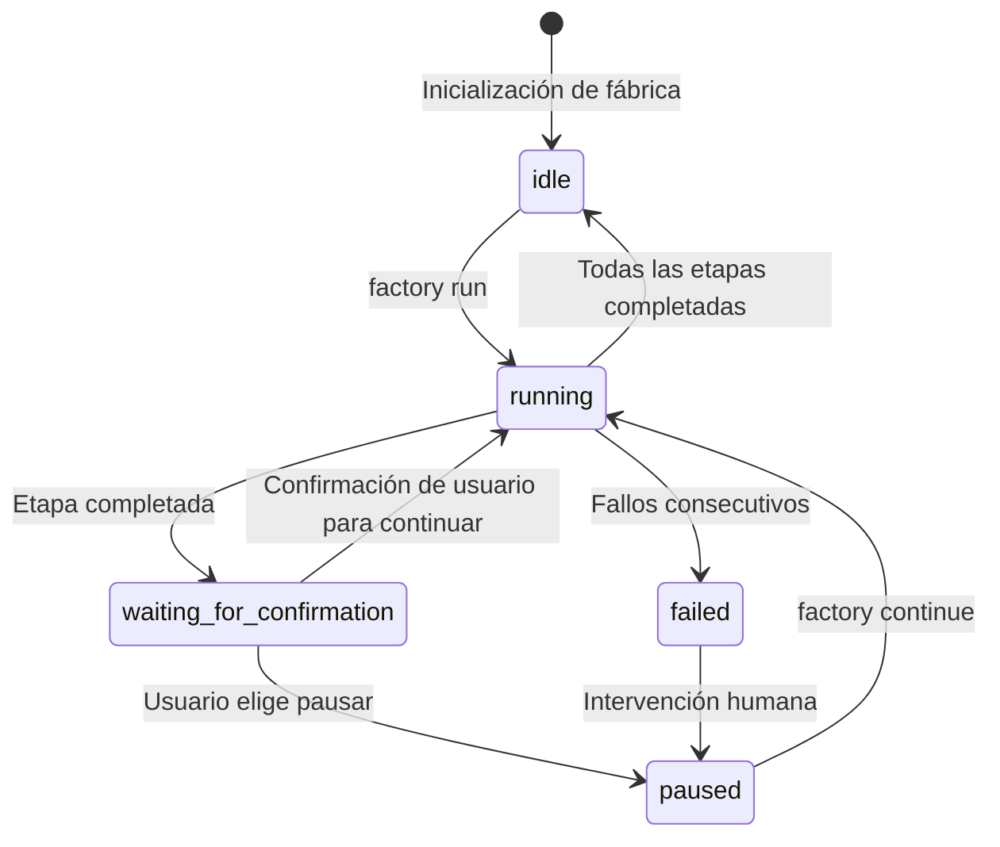
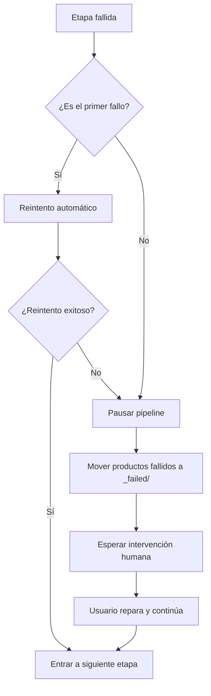

# Orquestador Sisyphus: Coordinación de Pipelines y Gestión de Estado

## Lo Que Aprenderás

- Comprender cómo el orquestador coordina la ejecución del pipeline de 7 etapas
- Entender el funcionamiento de la máquina de estado y las reglas de transición
- Dominar el mecanismo de verificación de permisos de la matriz de límites de capacidad
- Aprender a manejar escenarios de fallo (reintento, rollback, intervención humana)
- Usar el comando `factory continue` para optimizar el consumo de tokens

## Tu Situación Actual

Ya has ejecutado varios pipelines, pero puede que aún tengas dudas sobre:

- ¿Qué hace exactamente Sisyphus? ¿En qué se diferencia de otros Agentes?
- ¿Por qué los Agentes solo pueden leer y escribir en ciertos directorios? ¿Qué sucede si se exceden los permisos?
- ¿Cómo maneja el orquestador los fallos? ¿Por qué a veces se reintenta automáticamente y otras requiere intervención humana?
- ¿Por qué el comando `factory continue` puede ahorrar tokens? ¿Cuál es el mecanismo detrás?

Si te interesan estas preguntas, este capítulo te ayudará a comprenderlo todo.

## Cuándo Usar Este Conocimiento

Cuando necesites:

- **Depurar problemas del pipeline**: Entender qué hizo el orquestador en una etapa y por qué falló
- **Optimizar consumo de tokens**: Usar `factory continue` para crear una nueva sesión en cada etapa
- **Extender el pipeline**: Agregar nuevos Agentes o modificar la lógica existente
- **Manejar escenarios de fallo**: Entender por qué falló una etapa y cómo recuperarse
- **Verificar problemas de permisos**: Confirmar por qué un Agente no puede acceder a ciertos archivos

## Concepto Central

El orquestador Sisyphus es el "comandante" de toda la AI App Factory.

**Recuerda esta analogía**:

- Los otros Agentes (bootstrap, prd, ui, tech, code, validation, preview) son como los trabajadores que ejecutan tareas
- Sisyphus es el capataz que asigna trabajadores, verifica la calidad y maneja excepciones

**Lo Que Hace Único a Sisyphus**:

| Característica | Sisyphus | Otros Agentes |
| --- | --- | --- |
| **Responsabilidad** | Coordinación, validación, gestión de estado | Generar productos concretos |
| **Producción** | Actualizar state.json | Generar PRD, código, documentación, etc. |
| **Permisos** | Lectura y escritura de state.json | Lectura y escritura en subdirectorios artifacts/ específicos |
| **Contenido Generado** | No genera contenido de negocio | Genera productos de negocio concretos |

**Principios Clave**:

1. **Orden estricto**: Debe ejecutarse según lo definido en pipeline.yaml, sin saltar ni paralelizar
2. **Ejecución única**: Solo un Agente puede estar activo en un momento dado
3. **Separación de responsabilidades**: Sisyphus no modifica productos de negocio, solo coordina y valida
4. **Control de calidad**: Después de cada etapa, se debe verificar que el producto cumple con los exit_criteria

## Modelo de Máquina de Estado

Sisyphus ejecuta todo el flujo como una máquina de estado. Comprender la máquina de estado es clave para dominar el orquestador.

### 5 Estados



### Detalles de Estados

| Estado | Descripción | Condición de Activación |
| --- | --- | --- |
| **idle** | Esperando inicio | Inicialización del proyecto completada, o pipeline completamente terminado |
| **running** | Ejecutando una Etapa | Después de factory run o factory continue |
| **waiting_for_confirmation** | Esperando confirmación humana | Después de que la Etapa actual se completa, esperando que el usuario elija el siguiente paso |
| **paused** | Pausado manualmente | Usuario elige pausar, o pausa después de fallos consecutivos |
| **failed** | Fallo no manejado detectado | Agente falla consecutivamente dos veces, o escritura no autorizada |

::: info Archivo de Estado
Todos los estados se guardan en el archivo `.factory/state.json`, y Sisyphus tiene el permiso exclusivo de actualización.
:::

### Ejemplos de Transición de Estado

**Escenario 1: Ejecución Normal**

```
idle → running (factory run)
   ↓
waiting_for_confirmation (bootstrap completado)
   ↓
running (usuario elige continuar)
   ↓
waiting_for_confirmation (prd completado)
   ↓
... (repetir hasta que todas las etapas terminen)
   ↓
idle
```

**Escenario 2: Recuperación de Fallo**

```
running → failed (code falla consecutivamente dos veces)
   ↓
paused (intervención humana para reparar código)
   ↓
running (factory continue reintenta code)
   ↓
waiting_for_confirmation
```

## Matriz de Límites de Capacidad

### ¿Por Qué Se Necesita Control de Permisos?

Imagina:

- ¿Qué problemas causaría si el Agente PRD modificara los archivos generados por el Agente UI?
- ¿Qué consecuencias tendría si el Agente Tech leyera el código generado por el Agente Code?

**Respuesta**: Confusión de responsabilidades, productos no rastreables, calidad no garantizable.

La matriz de límites de capacidad garantiza la separación de responsabilidades al restringir los permisos de lectura y escritura de cada Agente.

### Matriz de Permisos

| Agente | Directorios Legibles | Directorios Escritibles | Descripción |
| --- | --- | --- | --- |
| **bootstrap** | Ninguno | `input/` | Solo crea o modifica `idea.md` en el directorio `input/` |
| **prd** | `input/` | `artifacts/prd/` | Lee el archivo de ideas, genera el PRD |
| **ui** | `artifacts/prd/` | `artifacts/ui/` | Lee el PRD, genera UI Schema y previsualización |
| **tech** | `artifacts/prd/` | `artifacts/tech/`, `artifacts/backend/prisma/` | Lee el PRD, genera el diseño técnico y el modelo de datos |
| **code** | `artifacts/ui/`, `artifacts/tech/`, `artifacts/backend/prisma/` | `artifacts/backend/`, `artifacts/client/` | Genera código basado en UI y diseño técnico |
| **validation** | `artifacts/backend/`, `artifacts/client/` | `artifacts/validation/` | Valida la calidad del código, genera informe de validación |
| **preview** | `artifacts/backend/`, `artifacts/client/` | `artifacts/preview/` | Lee el código generado, escribe instrucciones de demo |

### Flujo de Verificación de Permisos

**Antes de Ejecución**:

1. Sisyphus lee capability.matrix.md
2. Informa al Agente los directorios permitidos para lectura y escritura
3. El Agente debe operar dentro del rango de permisos

**Después de Ejecución**:

1. Sisyphus escanea archivos recién creados o modificados
2. Verifica si están dentro del rango de directorios autorizados
3. Si se detecta acceso no autorizado, se maneja inmediatamente

### Mecanismo de Manejo de Accesos No Autorizados

Si un Agente escribe en un directorio no autorizado:

1. **Aislamiento del Producto**: Mueve el archivo de acceso no autorizado a `artifacts/_untrusted/<stage-id>/`
2. **Registro del Fallo**: Marca el evento como fallido
3. **Pausa del Pipeline**: Espera intervención humana
4. **Provisión de Sugerencias de Reparación**: Indica al usuario cómo manejar los archivos no confiables

**Ejemplo**:

```
⚠️  Escrituras no autorizadas detectadas para la etapa "prd":
   - artifacts/ui/ui.schema.yaml

Archivos movidos a cuarentena: artifacts/_untrusted/prd

Por favor, revise estos archivos antes de continuar.
```

## Mecanismo de Checkpoint

Después de completar cada etapa, Sisyphus se pausa y espera confirmación humana. Este es el mecanismo de checkpoint.

### El Valor de los Checkpoints

- **Control de Calidad**: Verificación humana de los productos de cada etapa
- **Control Flexible**: Puedes pausar, reintentar o saltar en cualquier momento
- **Facilita la Depuración**: Los problemas se detectan temprano, evitando acumulación en etapas posteriores

### Plantilla de Salida de Checkpoint

Después de completar cada etapa, Sisyphus muestra las opciones en el siguiente formato:

```
✓ prd completado!

Productos generados:
- artifacts/prd/prd.md

┌─────────────────────────────────────────────────────────────┐
│  📋 Por favor, elija la siguiente acción                     │
│  Ingrese el número de opción (1-5), luego presione Enter    │
└─────────────────────────────────────────────────────────────┘

┌──────┬──────────────────────────────────────────────────────┐
│ Opción│ Descripción                                           │
├──────┼──────────────────────────────────────────────────────┤
│  1   │ Continuar a la siguiente etapa (misma sesión)        │
│      │ Continuaré ejecutando la etapa ui                      │
├──────┼──────────────────────────────────────────────────────┤
│  2   │ Continuar en nueva sesión ⭐ Opción recomendada, ahorra │
│      │ Tokens                                                 │
│      │ Ejecute en una nueva ventana de terminal: factory      │
│      │ continue                                               │
│      │ (Iniciará automáticamente una nueva ventana de Claude │
│      │ Code y continuará el pipeline)                         │
├──────┼──────────────────────────────────────────────────────┤
│  3   │ Re-ejecutar esta etapa                                 │
│      │ Re-ejecutar la etapa prd                               │
├──────┼──────────────────────────────────────────────────────┤
│  4   │ Modificar productos y re-ejecutar                      │
│      │ Modificar input/idea.md y re-ejecutar                  │
├──────┼──────────────────────────────────────────────────────┤
│  5   │ Pausar pipeline                                        │
│      │ Guardar progreso actual, continuar más tarde           │
└──────┴──────────────────────────────────────────────────────┘

💡 Sugerencia: Ingrese un número entre 1-5, luego presione Enter para confirmar su selección
```

::: tip Práctica Recomendada
**La opción 2 (Continuar en nueva sesión) es la mejor práctica**, consulte la siguiente sección "Optimización de Contexto" para más detalles.
:::

## Estrategia de Manejo de Fallos

Cuando una etapa falla, Sisyphus la maneja según la estrategia predefinida.

### Definición de Fallo

**Situaciones que Sisyphus considera fallos**:

- Archivos de salida faltantes (archivos requeridos no existen)
- Contenido de salida que no cumple exit_criteria (por ejemplo, PRD sin historias de usuario)
- Escritura no autorizada por el Agente (escritura en directorio no autorizado)
- Errores de ejecución consecutivos del Agente (errores de script, incapacidad para leer entrada)

### Flujo de Manejo de Fallos



### Mecanismo de Reintento Automático

- **Regla predeterminada**: Cada etapa permite un reintento automático
- **Estrategia de reintento**: Corregir problemas basándose en productos existentes
- **Archivo de fallos**: Después de fallar el reintento, los productos se mueven a `artifacts/_failed/<stage-id>/attempt-2/`

### Escenarios de Intervención Humana

**Situaciones que requieren intervención humana**:

1. **Fallos consecutivos dos veces**: Aún falla después del reintento automático
2. **Escritura no autorizada**: Agente escribe en directorio no autorizado
3. **Error de script**: Excepción lanzada durante la ejecución del Agente

**Flujo de intervención humana**:

1. Sisyphus pausa el pipeline
2. Muestra la causa del fallo y la información de error
3. Proporciona sugerencias de reparación:
   - Modificar archivos de entrada
   - Ajustar definición de Agente
   - Actualizar archivos de Skill
4. Después de que el usuario repara, ejecute `factory continue` para continuar

## Optimización de Contexto (Ahorro de Tokens)

### Descripción del Problema

Si ejecutas 7 etapas consecutivamente en la misma sesión, enfrentarás los siguientes problemas:

- **Acumulación de contexto**: La IA necesita recordar todo el historial de conversación
- **Desperdicio de tokens**: Lectura repetida de productos históricos
- **Incremento de costos**: Mayor consumo de tokens en sesiones largas

### Solución: Ejecución por Sesiones

**Idea Central**: Cada etapa se ejecuta en una nueva sesión.

```
Sesión 1: bootstrap
  ├─ Generar input/idea.md
  ├─ Actualizar state.json
  └─ Finalizar sesión

Sesión 2: prd
  ├─ Leer state.json (solo carga el estado actual)
  ├─ Leer input/idea.md (solo lee el archivo de entrada)
  ├─ Generar artifacts/prd/prd.md
  ├─ Actualizar state.json
  └─ Finalizar sesión

Sesión 3: ui
  ├─ Leer state.json
  ├─ Leer artifacts/prd/prd.md
  ├─ Generar artifacts/ui/ui.schema.yaml
  ├─ Actualizar state.json
  └─ Finalizar sesión
```

### Cómo Usar

**Paso 1**: Después de completar una etapa en la sesión actual, selecciona "Continuar en nueva sesión"

```
┌──────┬──────────────────────────────────────────────────────┐
│ Opción│ Descripción                                           │
├──────┼──────────────────────────────────────────────────────┤
│  2   │ Continuar en nueva sesión ⭐ Opción recomendada, ahorra │
│      │ Tokens                                                 │
│      │ Ejecute en una nueva ventana de terminal: factory      │
│      │ continue                                               │
│      │ (Iniciará automáticamente una nueva ventana de Claude │
│      │ Code y continuará el pipeline)                         │
└──────┴──────────────────────────────────────────────────────┘
```

**Paso 2**: Abre una nueva ventana de terminal y ejecuta:

```bash
factory continue
```

Este comando automáticamente:
1. Lee `.factory/state.json` para obtener el progreso actual
2. Inicia una nueva ventana de Claude Code
3. Continúa desde la siguiente etapa pendiente

### Beneficios del Aislamiento de Contexto

| Beneficio | Descripción |
| --- | --- |
| **Ahorro de Tokens** | No es necesario cargar conversaciones históricas ni productos |
| **Mayor Estabilidad** | Evita que la IA se desvíe debido a la explosión de contexto |
| **Fácil Depuración** | Cada etapa es independiente, los problemas son más fáciles de localizar |
| **Recuperación de Interrupciones** | Se puede interrumpir y recuperar en cualquier checkpoint |

## Verificación de Uso de Skills Obligatorios

Algunas etapas requieren el uso de skills específicas para garantizar la calidad de la salida. Sisyphus verifica si estas skills se han utilizado.

### Etapa bootstrap

**Requerimiento obligatorio**: Debe usar la skill `superpowers:brainstorm`

**Método de verificación**:

1. Verificar si el mensaje de salida del Agente indica explícitamente el uso de esta skill
2. Si no se menciona, rechazar el producto
3. Indicar que se re-ejecute, enfatizando explícitamente que debe usar esta skill

**Mensaje de fallo**:

```
❌ Detectado que no se usó la skill superpowers:brainstorm
Por favor, use esta skill para explorar a fondo las ideas del usuario antes de generar idea.md
```

### Etapa ui

**Requerimiento obligatorio**: Debe usar la skill `ui-ux-pro-max`

**Método de verificación**:

1. Verificar si el mensaje de salida del Agente indica explícitamente el uso de esta skill
2. Verificar la configuración del sistema de diseño en `ui.schema.yaml`
3. Si la configuración del sistema de diseño no es una recomendación profesional, rechazar el producto

**Mensaje de fallo**:

```
❌ Detectado que no se usó la skill ui-ux-pro-max
Por favor, use esta skill para generar un sistema de diseño y prototipo UI profesionales
```

### Manejo de Fallos Consecutivos

Si una etapa falla dos veces consecutivas debido a la verificación de skills:

1. Pausar el pipeline
2. Solicitar intervención humana
3. Verificar la definición del Agente y la configuración de Skills

## Ejercicio Práctico: Depurar una Etapa Fallida

Supongamos que la etapa code ha fallado, veamos cómo depurarla.

### Paso 1: Verificar state.json

```bash
cat .factory/state.json
```

**Ejemplo de salida**:

```json
{
  "version": "1.0",
  "status": "failed",
  "currentStage": "code",
  "completedStages": ["bootstrap", "prd", "ui", "tech"],
  "failedStages": ["code"],
  "stageHistory": [
    {
      "stageId": "code",
      "status": "failed",
      "startTime": "2026-01-29T10:00:00Z",
      "endTime": "2026-01-29T10:15:00Z",
      "attempts": 2,
      "error": "Exit criteria not met: Missing package.json"
    }
  ],
  "lastCheckpoint": "tech",
  "createdAt": "2026-01-29T09:00:00Z",
  "updatedAt": "2026-01-29T10:15:00Z"
}
```

**Información clave**:

- `status: failed` - Pipeline fallido
- `currentStage: code` - Etapa actual fallida
- `completedStages` - 4 etapas completadas
- `error: "Exit criteria not met: Missing package.json"` - Causa del fallo

### Paso 2: Verificar el Producto Fallido

```bash
ls -la artifacts/_failed/code/attempt-2/
```

**Ejemplo de salida**:

```
drwxr-xr-x  5 user  staff  160 Jan 29 10:15 .
drwxr-xr-x  3 user  staff   96 Jan 29 10:15 ..
-rw-r--r--  1 user  staff 2.1K Jan 29 10:15 server.ts
-rw-r--r--  1 user  staff 1.5K Jan 29 10:15 client.ts
```

**Problema encontrado**: ¡Falta el archivo `package.json`!

### Paso 3: Verificar exit_criteria

```bash
cat .factory/pipeline.yaml | grep -A 10 'code:'
```

**Ejemplo de salida**:

```yaml
code:
  agent: agents/code.agent.md
  inputs:
    - artifacts/ui/ui.schema.yaml
    - artifacts/tech/tech.md
    - artifacts/backend/prisma/schema.prisma
  outputs:
    - artifacts/backend/package.json
    - artifacts/backend/server.ts
    - artifacts/client/package.json
    - artifacts/client/app.ts
  exit_criteria:
    - package.json existe
    - Contiene las dependencias correctas
    - El código pasa el chequeo de tipos
```

**Confirmar problema**: El Agente Code no generó `package.json`, violando los exit_criteria.

### Paso 4: Reparar el Problema

**Solución 1**: Modificar la Definición del Agente Code

```bash
nano .factory/agents/code.agent.md
```

En la definición del Agente, requiere explícitamente la generación de `package.json`:

```markdown
## Archivos que Deben Generarse

Debes generar los siguientes archivos:
- artifacts/backend/package.json (contiene las dependencias correctas)
- artifacts/backend/server.ts
- artifacts/client/package.json
- artifacts/client/app.ts
```

**Solución 2**: Modificar el Archivo de Entrada

Si el problema está en la fase de diseño Tech, puedes modificar el diseño técnico:

```bash
nano artifacts/tech/tech.md
```

Agrega instrucciones claras de dependencias.

### Paso 5: Continuar el Pipeline

Después de reparar el problema, re-ejecuta:

```bash
factory continue
```

Sisyphus:
1. Leerá state.json (estado es failed)
2. Continuará desde lastCheckpoint (tech)
3. Re-ejecutará la etapa code
4. Verificará si el producto cumple con exit_criteria

## Resumen de Esta Lección

El orquestador Sisyphus es el "comandante" de la AI App Factory, responsable de:

- **Coordinación del Pipeline**: Ejecutar 7 etapas en orden
- **Gestión de Estado**: Mantener state.json, rastrear el progreso
- **Verificación de Permisos**: Asegurar que los Agentes solo lean y escriban en directorios autorizados
- **Manejo de Fallos**: Reintento automático, archivado de productos fallidos, espera de intervención humana
- **Control de Calidad**: Verificar si el producto de cada etapa cumple con exit_criteria

**Principios Clave**:

1. Ejecución estricta en orden, sin saltar ni paralelizar
2. Solo un Agente puede estar activo en un momento dado
3. Todos los productos deben escribirse en el directorio artifacts/
4. Cada etapa debe ser confirmada manualmente después de completarse
5. Se recomienda usar `factory continue` para ahorrar tokens

**Recuerda este Diagrama de Flujo**:

```
factory run → Leer pipeline.yaml → Ejecutar etapa → Verificar producto → Confirmación de checkpoint
     ↑                                                                      │
      └──────────────────── factory continue (nueva sesión) ←──────────────────────┘
```

## Próxima Lección

> En la próxima lección aprenderemos **[Optimización de Contexto: Ejecución por Sesiones](../context-optimization/)**.
>
> Aprenderás:
> - Cómo usar el comando `factory continue`
> - Por qué la ejecución por sesiones puede ahorrar tokens
> - Cómo probar el orquestador en el entorno de desarrollo
> - Técnicas comunes de depuración y análisis de logs

## Apéndice: Referencia del Código Fuente

<details>
<summary><strong>Haz clic para expandir y ver la ubicación del código fuente</strong></summary>

> Última actualización: 2026-01-29

| Función | Ruta del Archivo | Número de Línea |
| --- | --- | --- |
| Definición del núcleo del orquestador | [`source/hyz1992/agent-app-factory/agents/orchestrator.checkpoint.md`](https://github.com/hyz1992/agent-app-factory/blob/main/agents/orchestrator.checkpoint.md) | Texto completo |
| Guía de implementación del orquestador | [`source/hyz1992/agent-app-factory/agents/orchestrator-implementation.md`](https://github.com/hyz1992/agent-app-factory/blob/main/agents/orchestrator-implementation.md) | Texto completo |
| Matriz de límites de capacidad | [`source/hyz1992/agent-app-factory/policies/capability.matrix.md`](https://github.com/hyz1992/agent-app-factory/blob/main/policies/capability.matrix.md) | Texto completo |
| Estrategia de manejo de fallos | [`source/hyz1992/agent-app-factory/policies/failure.policy.md`](https://github.com/hyz1992/agent-app-factory/blob/main/policies/failure.policy.md) | Texto completo |
| Definición del pipeline | [`source/hyz1992/agent-app-factory/pipeline.yaml`](https://github.com/hyz1992/agent-app-factory/blob/main/pipeline.yaml) | Texto completo |

**Funciones Clave**:

- `executeStage()` - Ejecuta una sola etapa (líneas 117-189)
- `waitForCheckpointConfirmation()` - Espera confirmación del checkpoint (líneas 195-236)
- `handleStageFailure()` - Maneja fallos de etapa (líneas 242-289)
- `checkUnauthorizedWrites()` - Verifica escrituras no autorizadas (líneas 295-315)
- `getPermissions()` - Obtiene la matriz de permisos (líneas 429-467)

**Constantes Clave**:

- Enum de estados: `idle`, `running`, `waiting_for_confirmation`, `paused`, `failed`
- Máximo número de reintentos: 2 veces (línea 269)
- Prioridad de resolución de rutas: `.factory/` → directorio raíz (líneas 31-33)

</details>
