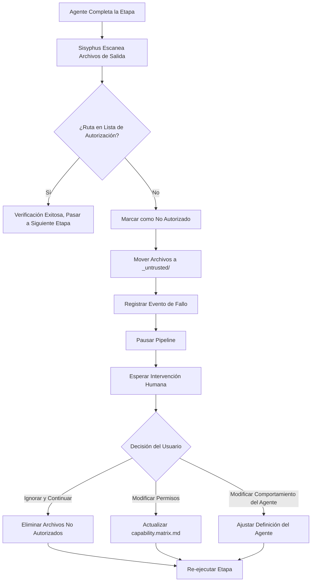

# Permisos y Seguridad: Matriz de Límites de Capacidad y Protección contra Accesos No Autorizados

## Qué Aprenderás

- Comprender el diseño de la matriz de límites de capacidad y el mecanismo de aislamiento de permisos
- Aprender a configurar el archivo de permisos de Claude Code, evitando el uso de `--dangerously-skip-permissions`
- Dominar el flujo de manejo de operaciones no autorizadas y los métodos de recuperación
- Comprender el mecanismo de verificación de uso de habilidades obligatorias
- Ser capaz de identificar y corregir problemas de seguridad relacionados con permisos

## Tu Situación Actual

Es posible que hayas encontrado estas situaciones:

- No sabes por qué el Agente no puede acceder a ciertos archivos
- Al ejecutar `factory run`, siempre se te pide permisos, así que usas directamente `--dangerously-skip-permissions` para omitirlos
- No estás claro sobre los límites de permisos entre Agentes, temiendo que las operaciones no autorizadas contaminen los datos
- No sabes cómo manejar y recuperarte después de un acceso no autorizado

Si estos problemas te preocupan, este capítulo te ayudará a establecer un conocimiento completo sobre permisos y seguridad.

## Cuándo Usar Esto

Cuando necesites:

- **Configurar Claude Code**: Establecer el archivo de permisos correcto para proyectos Factory
- **Depurar problemas de permisos**: Investigar por qué un Agente no puede leer o escribir archivos específicos
- **Manejar excepciones de accesos no autorizados**: Recuperar pipelines interrumpidos por operaciones no autorizadas
- **Extender Agentes**: Definir los límites de permisos al agregar nuevos Agentes
- **Auditoría de seguridad**: Verificar si la configuración de permisos del proyecto existente es razonable

## Idea Central

El mecanismo de seguridad de AI App Factory se basa en la **Matriz de Límites de Capacidad** (Capability Boundary Matrix), asegurando que cada Agente solo pueda operar en directorios autorizados.

**Recuerda esta analogía**:

- Los Agentes son como **trabajadores especializados** en una fábrica
- La matriz de límites de capacidad es como un **permiso de trabajo**, que especifica claramente qué talleres puede entrar cada trabajador y qué equipos puede operar
- El orquestador Sisyphus es como un **supervisor de seguridad**, que verifica los permisos cuando los trabajadores entran o salen de los talleres, asegurando que no haya comportamientos no autorizados

**Mecanismo de Tres Capas de Protección**:

| Nivel | Responsabilidad | Momento de Verificación |
| --- | --- | --- |
| **Permisos de Claude Code** | Permisos de lectura/escritura del sistema de archivos | Al iniciar el asistente de IA |
| **Matriz de Límites de Capacidad** | Permisos de acceso a directorios del Agente | Antes y después de la ejecución de la etapa |
| **Verificación de Habilidades Obligatorias** | Requisitos de uso de habilidades específicas para ciertas etapas | Etapas bootstrap y ui |

## Matriz de Límites de Capacidad en Detalle

### ¿Por Qué Se Necesita el Aislamiento de Permisos?

Imagina qué pasaría sin restricciones de permisos:

- **El Agente PRD modifica archivos de UI**: El diseño de UI se altera, sin posibilidad de trazabilidad
- **El Agente Tech lee archivos de Code**: La arquitectura técnica se ve influenciada por la implementación del código, desviándose del principio MVP
- **El Agente Code modifica el PRD**: Los documentos de requisitos se "contaminan" con la lógica del código, causando confusión de responsabilidades

**Respuesta**: Límites de responsabilidad poco claros, productos sin trazabilidad, calidad no garantizada.

La matriz de límites de capacidad garantiza la separación de responsabilidades al limitar los permisos de lectura/escritura de cada Agente.

### Tabla de Matriz de Permisos

| Agente | Directorios de Lectura Permitidos | Directorios de Escritura Permitidos | Descripción |
| --- | --- | --- | --- |
| **bootstrap** | Ninguno | `input/` | Solo crea o modifica `idea.md` en el directorio `input/` |
| **prd** | `input/` | `artifacts/prd/` | Lee el archivo de ideas, genera PRD; prohíbe escribir en otros directorios |
| **ui** | `artifacts/prd/` | `artifacts/ui/` | Lee el PRD, genera esquema de UI y vista previa |
| **tech** | `artifacts/prd/` | `artifacts/tech/`, `artifacts/backend/prisma/` | Lee el PRD, genera diseño técnico y modelos de datos |
| **code** | `artifacts/ui/`, `artifacts/tech/`, `artifacts/backend/prisma/` | `artifacts/backend/`, `artifacts/client/` | Genera código backend y cliente según el diseño de UI y técnico; no debe modificar productos upstream |
| **validation** | `artifacts/backend/`, `artifacts/client/` | `artifacts/validation/` | Verifica la calidad del código, genera informes de validación; solo lectura, no modifica código |
| **preview** | `artifacts/backend/`, `artifacts/client/` | `artifacts/preview/` | Lee los servicios y clientes generados, escribe instrucciones de demostración |

::: tip Principio Central
- **Dependencia Unidireccional**: Los Agentes solo pueden leer productos de etapas upstream, no pueden leer productos de etapas downstream o del mismo nivel
- **Responsabilidad Independiente**: Cada Agente solo puede escribir en su propio directorio de salida
- **Prohibición de Accesos No Autorizados**: Las operaciones de lectura/escritura no autorizadas se consideran violaciones de seguridad
:::

### Flujo de Verificación de Permisos

El orquestador Sisyphus realiza verificaciones de permisos antes y después de la ejecución de cada etapa:

**Antes de la Ejecución (Informar Permisos)**:

```
1. Sisyphus lee capability.matrix.md
2. Pasa los directorios de lectura y escritura permitidos del Agente actual al asistente de IA
3. El asistente de IA debe cumplir con estas restricciones durante la ejecución
```

**Después de la Ejecución (Verificar Salida)**:

```
1. Sisyphus escanea archivos creados o modificados recientemente
2. Verifica si la ruta del archivo está dentro del rango de directorios autorizados del Agente
3. Si se detecta un acceso no autorizado, se maneja inmediatamente (ver mecanismo de manejo de accesos no autorizados)
```

::: info Automatización vs. Manual
La verificación de permisos se completa principalmente automáticamente mediante el sistema de permisos del asistente de IA (Claude Code) y la lógica de verificación de Sisyphus. Solo en casos de anomalías como accesos no autorizados se requiere intervención humana.
:::

## Configuración de Permisos de Claude Code

### ¿Por Qué No Se Recomienda --dangerously-skip-permissions?

Es posible que hayas visto este comando:

```bash
claude --dangerously-skip-permissions
```

**Problemas con esta opción**:

| Problema | Descripción | Riesgo |
| --- | --- | --- |
| **Omitir Todas las Verificaciones** | Claude Code ya no verifica ninguna operación de archivo | La IA puede eliminar o modificar archivos del sistema por error |
| **Vulnerabilidad de Seguridad** | El Agente puede leer/escribir en cualquier directorio | Las operaciones no autorizadas no pueden ser interceptadas |
| **Sin Trazabilidad** | Sin límites de permisos, los problemas son difíciles de localizar | Difícil de depurar y mantener |

### Configuración de Permisos Generada Automáticamente por Factory

El CLI de Factory genera automáticamente `.claude/settings.local.json` al inicializar el proyecto, configurando permisos precisos:

**Momento de Generación**: Cuando se ejecuta el comando `factory init`

**Contenido de Configuración** (ubicación del código fuente: `cli/utils/claude-settings.js:41-91`):

```json
{
  "permissions": {
    "allow": [
      // ========== Permisos de Operación de Archivos ==========
      "Read(/path/to/project/**)",
      "Write(/path/to/project/**)",
      "Glob(/path/to/project/**)",
      "Edit(/path/to/project/*,**)",

      // ========== Permisos de Operación Git ==========
      "Bash(git add:*)",
      "Bash(git commit:*)",
      "Bash(git push:*)",
      // ... más comandos git

      // ========== Permisos de Herramientas de Construcción ==========
      "Bash(npm install:*)",
      "Bash(npm run:*)",
      "Bash(npx:*)",

      // ========== Permisos de TypeScript ==========
      "Bash(tsc:*)",
      "Bash(npx type-check:*)",

      // ========== Permisos de Base de Datos (Prisma) ==========
      "Bash(npx prisma validate:*)",
      "Bash(npx prisma generate:*)",
      "Bash(npx prisma migrate dev:*)",

      // ========== Permisos de Factory CLI ==========
      "Bash(factory init:*)",
      "Bash(factory run:*)",
      "Bash(factory continue:*)",

      // ========== Permisos de Docker ==========
      "Bash(docker compose:*)",
      "Bash(docker build:*)",

      // ========== Permisos de Habilidades (Plugins) ==========
      "Skill(superpowers:brainstorming)",
      "Skill(superpowers:writing-plans)",
      "Skill(ui-ux-pro-max)",
      "Skill(*)",

      // ========== Permisos de Operación Web ==========
      "WebFetch(domain:github.com)",
      "WebFetch(domain:npmjs.org)",

      // ========== Permisos de Herramientas Generales ==========
      "Bash(curl:*)",
      "Bash(grep:*)",
      "Bash(find:*)"
    ]
  },
  "features": {
    "autoSave": true,
    "telemetry": false
  }
}
```

**Características de la Configuración de Permisos**:

| Característica | Descripción | Ejemplo |
| --- | --- | --- |
| **Restricción a Nivel de Proyecto** | Solo permite leer/escribir en el directorio del proyecto actual | `Read(/Users/xxx/my-app/**)` |
| **Control Preciso a Nivel de Comando** | Cada tipo de comando tiene un patrón de permiso claro | `Bash(npm install:*)` no permite `npm install --global` |
| **Soporte Multiplataforma** | Adapta automáticamente rutas de Windows y Unix | Windows usa `//d/**`, Unix usa `/path/**` |
| **Lista Blanca de Habilidades** | Lista explícitamente las habilidades permitidas | `Skill(superpowers:brainstorming)` |

**Verificar si la Configuración Está Activa**:

```bash
# Ver la configuración de permisos generada
cat .claude/settings.local.json

# Verificar que el archivo existe
ls -la .claude/settings.local.json
```

::: warning Diferencias entre Plataformas
Los formatos de ruta de Windows y Unix/macOS son diferentes:
- Windows: `//C/**` o `//d/**` (letra de unidad)
- Unix/macOS: `/Users/username/project/**`

Factory detecta automáticamente la plataforma actual y genera el formato de ruta correcto.
:::

## Mecanismo de Manejo de Accesos No Autorizados

### ¿Qué es una Operación No Autorizada?

**Definición de Acceso No Autorizado**: El Agente escribe en un directorio que no está en su lista de autorización.

**Escenarios Típicos**:

| Agente | Directorio de Escritura Autorizado | Directorio de Escritura No Autorizado | Problema |
| --- | --- | --- | --- |
| **prd** | `artifacts/prd/` | `artifacts/ui/` | El Agente PRD modificó archivos de UI fuera de su alcance |
| **tech** | `artifacts/tech/` | `artifacts/prd/` | El Agente Tech modificó documentos de requisitos |
| **code** | `artifacts/backend/` | `artifacts/prd/` | El Agente Code modificó productos upstream en sentido inverso |

### Flujo de Manejo de Accesos No Autorizados

Cuando Sisyphus detecta una escritura no autorizada:



### Aislamiento de Productos No Autorizados

Los archivos no autorizados se mueven al directorio `artifacts/_untrusted/<stage-id>/`:

**Ejemplo**: El Agente PRD escribe no autorizadamente en `artifacts/ui/`

```
artifacts/
├── prd/
│   └── prd.md
├── ui/
│   └── ui.schema.yaml ← Debería estar aquí, pero fue escrito por el Agente PRD
└── _untrusted/
    └── prd/
        └── ui/
            └── ui.schema.yaml ← El archivo no autorizado se movió aquí
```

**Mensaje de Error**:

```
⚠️ Unauthorized writes detected for stage "prd":

Untrusted files:
- artifacts/ui/ui.schema.yaml

Files moved to quarantine: artifacts/_untrusted/prd/artifacts/ui/ui.schema.yaml

Pipeline paused. Please review these files before proceeding.

Choose action:
1. Delete untrusted files and retry
2. Adjust permissions in capability.matrix.md
3. Modify Agent behavior in .factory/agents/prd.agent.md
4. Continue (accept untrusted files) - Not recommended
```

### Intervención Humana

**Opción 1: Eliminar Archivos No Autorizados y Re-ejecutar** (Recomendado)

```bash
# Ver archivos no autorizados
ls -la artifacts/_untrusted/prd/

# Eliminar archivos no autorizados
rm -rf artifacts/_untrusted/prd/

# Re-ejecutar la etapa
factory continue
```

**Opción 2: Ajustar la Matriz de Permisos**

Si el acceso no autorizado es razonable (por ejemplo, un Agente realmente necesita escribir en un directorio adicional):

```bash
# Editar la matriz de permisos
nano .factory/policies/capability.matrix.md

# Modificar los directorios de escritura permitidos del Agente
# Por ejemplo: Agregar permiso de escritura en `artifacts/ui/` al Agente prd

# Re-ejecutar
factory continue
```

**Opción 3: Modificar el Comportamiento del Agente**

Si el acceso no autorizado fue una operación errónea del Agente:

```bash
# Editar la definición del Agente
nano .factory/agents/prd.agent.md

# Prohibir explícitamente escribir en directorios no autorizados
# Agregar instrucción: "Prohibido escribir en artifacts/ui/ u otros directorios no autorizados"

# Re-ejecutar
factory continue
```

::: danger Advertencia
La opción 4 (aceptar archivos no autorizados) es **extremadamente no recomendada** porque:
- Viola el principio de diseño de aislamiento de permisos
- Causa confusión de responsabilidades, difícil de rastrear
- Las etapas posteriores pueden fallar debido a productos incorrectos
:::

## Verificación de Uso de Habilidades Obligatorias

Algunas etapas requieren el uso de habilidades específicas para garantizar la calidad de la salida. Sisyphus verificará el uso de estas habilidades.

### Verificación de la Etapa Bootstrap

**Requisito Obligatorio**: Debe usar la habilidad `superpowers:brainstorm`

**¿Por Qué**?

- La habilidad de Brainstorming proporciona un marco de pensamiento estructurado
- Asegura que las ideas del producto sean profundamente exploradas, no descripciones superficiales
- Previene que el Agente omita pasos clave de análisis

**Método de Verificación**:

1. Verificar si el mensaje de salida del Agente indica explícitamente que se ha usado la habilidad
2. Si no se menciona, rechazar el producto
3. Solicitar re-ejecución, enfatizando explícitamente que se debe usar la habilidad

**Mensaje de Fallo**:

```
❌ Detectado que no se usó la habilidad superpowers:brainstorm

El Agente Bootstrap debe usar la habilidad superpowers:brainstorm para explorar en profundidad las ideas del usuario.

Por favor, re-ejecuta la etapa bootstrap e indica explícitamente en la salida:
"He usado la habilidad superpowers:brainstorm para analizar las ideas del usuario..."
```

**Ejemplo Correcto**:

```
He usado la habilidad superpowers:brainstorm para analizar en profundidad las ideas del usuario.

A través de la habilidad de brainstorming, identifiqué los siguientes puntos clave:
- Problema central: [descripción del problema]
- Usuario objetivo: [perfil de usuario]
- Propuesta de valor: [puntos de valor]
- Supuestos clave: [lista de supuestos]

Documento de ideas generado: input/idea.md
```

### Verificación de la Etapa UI

**Requisito Obligatorio**: Debe usar la habilidad `ui-ux-pro-max`

**¿Por Qué**?

- La habilidad UI/UX Pro Max proporciona un marco de sistema de diseño profesional
- Evita el "estilo por defecto de IA" (fuente Inter, degradado púrpura, etc.)
- Asegura la consistencia y mantenibilidad del esquema de diseño

**Método de Verificación**:

1. Verificar si el mensaje de salida del Agente indica explícitamente que se ha usado la habilidad
2. Verificar si la configuración del sistema de diseño en `ui.schema.yaml` es profesional
3. Si la configuración del sistema de diseño no es profesional, rechazar el producto

**Mensaje de Fallo**:

```
❌ Detectado que no se usó la habilidad ui-ux-pro-max

El Agente UI debe usar la habilidad ui-ux-pro-max para generar un sistema de diseño y prototipo de UI profesional.

Por favor, re-ejecuta la etapa ui e indica explícitamente en la salida:
"He usado la habilidad ui-ux-pro-max para diseñar el sistema de UI..."
```

**Ejemplo Correcto**:

```
He usado la habilidad ui-ux-pro-max para diseñar el sistema de UI y prototipo.

A través de la habilidad ui-ux-pro-max, seleccioné:
- Dirección de diseño: [estilo específico, como: minimalismo / ciberpunk]
- Sistema de colores: [esquema de colores]
- Sistema de fuentes: [selección de fuentes]
- Biblioteca de componentes: [especificación de componentes]

Productos de UI generados:
- artifacts/ui/ui.schema.yaml
- artifacts/ui/preview.web/index.html
```

### Manejo de Fallos Consecutivos

Si una etapa falla dos veces consecutivas debido a la verificación de habilidades:

1. Pausar el pipeline
2. Solicitar intervención humana
3. Verificar los siguientes problemas posibles:
   - ¿El asistente de IA tiene instalada la habilidad correspondiente (Plugin)?
   - ¿La definición del Agente requiere explícitamente el uso de esa habilidad?
   - ¿La ruta del archivo de habilidad es correcta?

## Ejercicio Práctico: Manejo de Excepciones de Accesos No Autorizados

Supongamos que el Agente PRD escribió no autorizadamente en el directorio de UI, veamos el flujo de manejo completo.

### Paso 1: Identificar el Acceso No Autorizado

Después de que se completa la etapa PRD, Sisyphus reporta:

```
⚠️ Unauthorized writes detected for stage "prd":

Untrusted files:
- artifacts/ui/ui.schema.yaml

Files moved to quarantine: artifacts/_untrusted/prd/artifacts/ui/ui.schema.yaml

Pipeline paused.
```

### Paso 2: Ver el Archivo No Autorizado

```bash
# Ver el contenido del archivo no autorizado
cat artifacts/_untrusted/prd/artifacts/ui/ui.schema.yaml

# Ejemplo de salida:
```
```yaml
# Esquema de UI generado por el Agente PRD (producto no autorizado)
pages:
  - name: Home
    components:
      - Hero
      - Features
```

### Paso 3: Analizar la Causa

**Posibles Causas**:

| Causa | Descripción | Evidencia |
| --- | --- | --- |
| **Operación Errónea del Agente** | El Agente PRD generó erróneamente archivos de UI | El contenido del archivo realmente contiene estructura de UI |
| **Prompt No Claro** | La definición del Agente no prohíbe escribir en otros directorios | Necesita verificar `.factory/agents/prd.agent.md` |
| **Configuración de Permisos Incorrecta** | Los permisos de escritura del Agente PRD son demasiado amplios | Necesita verificar `capability.matrix.md` |

**Verificar la Definición del Agente**:

```bash
cat .factory/agents/prd.agent.md
```

**Verificar la Matriz de Permisos**:

```bash
cat .factory/policies/capability.matrix.md | grep -A 1 "prd"
```

**Salida**:

```
| **prd** | `input/` | `artifacts/prd/` | Lee el archivo de ideas, genera PRD; prohíbe escribir en otros directorios |
```

La matriz de permisos es correcta, el problema está en el comportamiento del Agente.

### Paso 4: Corregir la Definición del Agente

Editar la definición del Agente, agregar instrucciones de prohibición explícitas:

```bash
nano .factory/agents/prd.agent.md
```

**Contenido Agregado**:

```markdown
## Prohibiciones

- ❌ **Prohibido escribir en el directorio `artifacts/ui/`**: El diseño de UI es responsabilidad del Agente UI
- ❌ **Prohibido escribir en el directorio `artifacts/tech/`**: La arquitectura técnica es responsabilidad del Agente Tech
- ❌ **Prohibido escribir en `artifacts/backend/` o `artifacts/client/`**: La generación de código es responsabilidad del Agente Code
- ✅ **Solo puede escribir en el directorio `artifacts/prd/`**: Generar documento PRD
```

### Paso 5: Eliminar Archivos No Autorizados y Re-ejecutar

```bash
# Eliminar archivos no autorizados
rm -rf artifacts/_untrusted/prd/

# Re-ejecutar la etapa PRD
factory continue
```

### Paso 6: Verificar la Corrección

Verificar si la etapa PRD vuelve a tener accesos no autorizados:

```bash
# Ver los productos generados
ls -la artifacts/prd/

# Confirmar que no se escribió en otros directorios
ls -la artifacts/_untrusted/prd/

# La salida debería estar vacía, indicando que no hay nuevos accesos no autorizados
```

**Señal de Éxito**:

```
✓ prd completado!

Productos generados:
- artifacts/prd/prd.md

... (opciones de punto de verificación)

No aparece advertencia de acceso no autorizado
```

## Mejores Prácticas de Seguridad

### 1. Verificar la Configuración de Permisos al Inicializar

```bash
# Verificar inmediatamente después de ejecutar factory init
cat .claude/settings.local.json

# Verificar el siguiente contenido:
# ✅ El array permissions.allow existe
# ✅ La ruta del proyecto es correcta (Windows es //d/**, Unix es /path/**)
# ✅ Incluye permisos de comandos necesarios (npm, git, factory, docker, etc.)
# ✅ Incluye permisos de habilidades (superpowers, ui-ux-pro-max)
```

### 2. Revisar Periódicamente la Matriz de Permisos

```bash
# Verificar la matriz de permisos
cat .factory/policies/capability.matrix.md

# Confirmar:
# ✅ Los permisos de lectura/escritura de cada Agente son razonables
# ✅ No hay autorización excesiva (por ejemplo, el Agente Code no debería escribir en PRD)
# ✅ El mecanismo de manejo de accesos no autorizados está claro
```

### 3. Monitorear Eventos de Accesos No Autorizados

```bash
# Ver si hay archivos no autorizados
ls -la artifacts/_untrusted/

# Si existen archivos no autorizados, analizar la causa:
# - ¿Es una operación errónea del Agente?
# - ¿Es una configuración de permisos irracional?
# - ¿Es necesario ajustar la definición del Agente?
```

### 4. Usar Control de Versiones para Proteger Archivos de Configuración

```bash
# Incluir archivos de configuración clave en Git
git add .claude/settings.local.json
git add .factory/policies/capability.matrix.md
git commit -m "chore: add security configuration files"
```

**Razones**:

- Prevenir eliminación o modificación accidental de la configuración
- Soportar trazabilidad de versiones de la configuración de permisos
- Mantener consistencia de permisos en la colaboración del equipo

::: warning ¿Debería settings.local.json ser confirmado?
Aunque el nombre contiene `local`, el `.claude/settings.local.json` generado por Factory es una configuración de permisos a nivel de proyecto y debería incluirse en el control de versiones. Todos los miembros del equipo deberían usar la misma configuración de permisos.
:::

### 5. Actualizar Periódicamente la Configuración de Permisos

Cuando ocurran las siguientes situaciones, es necesario actualizar la configuración de permisos:

| Condición de Activación | Configuración a Actualizar |
| --- | --- |
| Agregar un nuevo Agente | Actualizar `capability.matrix.md` |
| Introducir nuevas herramientas de construcción | Actualizar permisos Bash de `settings.local.json` |
| Agregar nuevas habilidades (Plugin) | Actualizar permisos Skill de `settings.local.json` |
| Ajustar responsabilidades del Agente | Actualizar `capability.matrix.md` |

**Flujo de Actualización**:

```bash
# 1. Modificar el archivo de configuración
nano .claude/settings.local.json
# o
nano .factory/policies/capability.matrix.md

# 2. Confirmar la modificación
git add .claude/settings.local.json
git add .factory/policies/capability.matrix.md
git commit -m "security: update permissions for new Agent/Tool"

# 3. Re-inicializar permisos (opcional)
# Si se modificó capability.matrix.md, no se necesita operación adicional, Sisyphus leerá automáticamente
# Si se modificó settings.local.json, puede ser necesario reiniciar Claude Code
```

## Solución de Problemas de Seguridad Comunes

### Problema 1: El Agente No Puede Leer Archivos

**Síntoma**:

```
❌ Error: Cannot read file: artifacts/prd/prd.md
```

**Pasos de Solución**:

1. Verificar si el archivo existe
```bash
ls -la artifacts/prd/prd.md
```

2. Verificar los permisos de lectura del Agente
```bash
cat .factory/policies/capability.matrix.md | grep -A 1 "prd"
```
Confirmar que los directorios de lectura permitidos del Agente incluyen el directorio donde se encuentra el archivo.

3. Verificar la configuración de permisos de Claude Code
```bash
cat .claude/settings.local.json | grep "Read"
```
Confirmar que existe el permiso Read del directorio del proyecto.

### Problema 2: El Agente No Puede Escribir Archivos

**Síntoma**:

```
❌ Error: Cannot write file: artifacts/prd/prd.md
```

**Pasos de Solución**:

1. Verificar los permisos de escritura del Agente
```bash
cat .factory/policies/capability.matrix.md | grep -A 1 "prd"
```
Confirmar que los directorios de escritura permitidos del Agente incluyen el directorio de destino.

2. Verificar la configuración de permisos de Claude Code
```bash
cat .claude/settings.local.json | grep "Write"
```
Confirmar que existe el permiso Write del directorio del proyecto.

3. Verificar si el directorio existe
```bash
ls -la artifacts/prd/
```
Si el directorio no existe, el Agente lo creará automáticamente, pero necesita el permiso Write.

### Problema 3: Advertencias de Accesos No Autorizados Frecuentes

**Síntoma**:

El mismo Agente aparece frecuentemente con advertencias de accesos no autorizados.

**Pasos de Solución**:

1. Analizar el patrón de accesos no autorizados
```bash
ls -la artifacts/_untrusted/<stage-id>/
```
Ver en qué directorios siempre escribe el Agente.

2. Verificar la definición del Agente
```bash
cat .factory/agents/<stage>.agent.md
```
Confirmar si hay instrucciones de prohibición explícitas.

3. Considerar si es necesario ajustar los permisos
- Si el acceso no autorizado es razonable → Actualizar `capability.matrix.md`
- Si el acceso no autorizado es una operación errónea → Modificar la definición del Agente

### Problema 4: Fallo en la Verificación de Habilidades

**Síntoma**:

```
❌ Detectado que no se usó la habilidad superpowers:brainstorm
```

**Pasos de Solución**:

1. Confirmar que la habilidad está instalada
   - Verificar si el asistente de IA tiene instalado el Plugin correspondiente
   - Claude Code: Verificar permisos Skill en `settings.local.json`
   - OpenCode: Verificar la lista de Plugins

2. Verificar la definición del Agente
```bash
cat .factory/agents/<stage>.agent.md
```
Confirmar que el Agente requiere explícitamente el uso de esa habilidad.

3. Verificar la ruta del archivo de habilidad
```bash
ls -la .factory/skills/<stage>/skill.md
```
Confirmar que el archivo de habilidad existe y la ruta es correcta.

## Resumen de la Lección

El mecanismo de permisos y seguridad es el sistema de protección central de AI App Factory, que incluye:

**Tres Capas de Protección**:

1. **Permisos de Claude Code**: Permisos de lectura/escritura del sistema de archivos, configurados por `settings.local.json`
2. **Matriz de Límites de Capacidad**: Permisos de acceso a directorios del Agente, definidos por `capability.matrix.md`
3. **Verificación de Habilidades Obligatorias**: Requisitos de uso de habilidades específicas para ciertas etapas, verificados por Sisyphus

**Principios Centrales**:

- Separación de responsabilidades: Cada Agente solo puede leer/escribir en directorios autorizados
- Dependencia unidireccional: Los Agentes solo pueden leer productos de etapas upstream, no pueden leer productos de etapas downstream o del mismo nivel
- Aislamiento de accesos no autorizados: Los archivos no autorizados se mueven automáticamente a `_untrusted/`, esperando manejo humano
- Garantía de habilidades: Las etapas Bootstrap y UI deben usar habilidades especificadas

**Puntos Prácticos**:

- Verificar al inicializar si la configuración de permisos se generó correctamente
- Revisar periódicamente la matriz de límites de capacidad, asegurando que los permisos sean razonables
- Monitorear eventos de accesos no autorizados, corrigiendo el comportamiento del Agente a tiempo
- Usar control de versiones para proteger archivos de configuración
- Cuando surgen problemas, seguir el flujo de solución para localizar la causa

**Recuerda este Flujo**:

```
factory init → Generar configuración de permisos → Ejecutar pipeline → Sisyphus verifica permisos
     ↓                                              │
     └── ¿Acceso no autorizado? → Mover a _untrusted/ → Intervención humana → Corregir → Continuar ──┘
```

## Avance de la Siguiente Lección

> En la siguiente lección aprenderemos **[Manejo de Fallos y Rollback](../failure-handling/)**.
>
> Aprenderás:
> - Mecanismo de identificación de fallos (salida faltante, contenido no coincidente, acceso no autorizado)
> - Estrategias de reintento automático y flujo de archivo de fallos
> - Mecanismo de rollback y flujo de intervención humana
> - Cómo recuperar el pipeline desde un fallo

## Apéndice: Referencia de Código Fuente

<details>
<summary><strong>Haz clic para ver la ubicación del código fuente</strong></summary>

> Fecha de actualización: 2026-01-29

| Función | Ruta del Archivo | Número de Línea |
| --- | --- | --- |
| Definición de Matriz de Límites de Capacidad | [`source/hyz1992/agent-app-factory/policies/capability.matrix.md`](https://github.com/hyz1992/agent-app-factory/blob/main/policies/capability.matrix.md) | Completo (líneas 1-23) |
| Generación de Permisos de Claude Code | [`source/hyz1992/agent-app-factory/cli/utils/claude-settings.js`](https://github.com/hyz1992/agent-app-factory/blob/main/cli/utils/claude-settings.js) | Líneas 38-91 |
| Lógica de Verificación de Permisos | [`source/hyz1992/agent-app-factory/agents/orchestrator.checkpoint.md`](https://github.com/hyz1992/agent-app-factory/blob/main/agents/orchestrator.checkpoint.md) | Líneas 47-53 |
| Estrategia de Manejo de Accesos No Autorizados | [`source/hyz1992/agent-app-factory/agents/orchestrator.checkpoint.md`](https://github.com/hyz1992/agent-app-factory/blob/main/agents/orchestrator.checkpoint.md) | Líneas 19-21 |
| Verificación de Habilidades Bootstrap | [`source/hyz1992/agent-app-factory/agents/orchestrator.checkpoint.md`](https://github.com/hyz1992/agent-app-factory/blob/main/agents/orchestrator.checkpoint.md) | Líneas 58-70 |
| Verificación de Habilidades UI | [`source/hyz1992/agent-app-factory/agents/orchestrator.checkpoint.md`](https://github.com/hyz1992/agent-app-factory/blob/main/agents/orchestrator.checkpoint.md) | Líneas 72-84 |

**Funciones Clave**:

- `generatePermissions(projectDir)` - Generar configuración de permisos de Claude Code (líneas 41-91)
- `generateClaudeSettings(projectDir)` - Generar y escribir `settings.local.json` (líneas 256-275)
- `getPathPatterns()` - Obtener patrones de ruta específicos de la plataforma (líneas 14-36)

**Constantes Clave**:

- Directorio de aislamiento de accesos no autorizados: `artifacts/_untrusted/<stage-id>/`
- Nombres de habilidades:
  - Bootstrap: `superpowers:brainstorm`
  - UI: `ui-ux-pro-max`
- Formatos de ruta de plataforma:
  - Windows: `//{drive}/**`
  - Unix/macOS: `/path/to/project/**`

</details>
