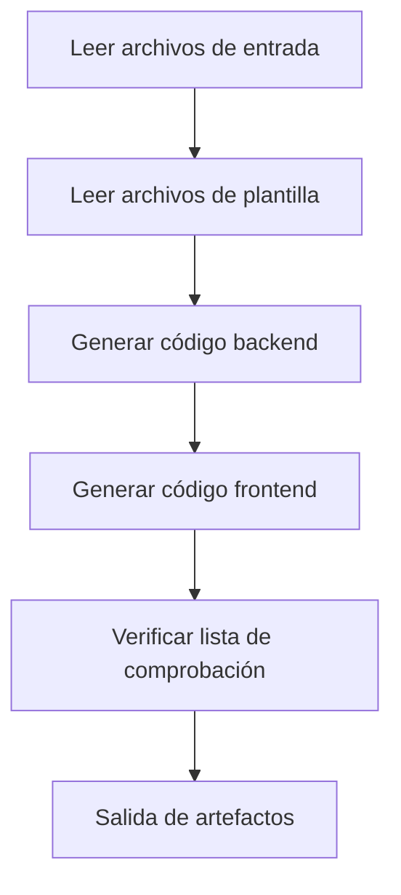

# Fase 5: Code - Generación de código ejecutable

## Lo que podrás hacer

- **Generar código full-stack con un clic**: Genera automáticamente aplicaciones de frontend y backend ejecutables a partir de UI Schema y diseño Tech
- **Entender el flujo de generación de código**: Domina cómo Code Agent transforma documentos de diseño en código de producción
- **Validar la calidad del código**: Aprende a verificar la integridad, cobertura de pruebas y estándares de seguridad del código generado
- **Depurar problemas comunes**: Resuelve problemas de instalación de dependencias, verificación de tipos y conexión de API

## Tu situación actual

Ya has completado la estructuración de la idea del producto, la generación del PRD, el diseño de UI y el diseño de la arquitectura técnica, y ahora el mayor dolor de cabeza es:

- **Cómo convertir el diseño en código**: UI Schema y diseño Tech están en documentos, ¿cómo implementarlos?
- **El desarrollo full-stack es demasiado complejo**: Backend necesita Express + Prisma, frontend necesita React Native, ¿por dónde empezar?
- **Difícil garantizar la calidad del código**: ¿Cómo asegurar que el código generado tenga pruebas, documentación y cumpla con los estándares de seguridad?
- **No hay suficiente tiempo**: Escribir un MVP toma varios días, ¿hay una forma más rápida?

La fase Code existe para resolver estos problemas—genera automáticamente código full-stack de producción basándose en diseños de etapas anteriores.

## Cuándo usar esta técnica

Cuando necesites:

- **Validar rápidamente ideas**: Valida la viabilidad de la idea del producto con código en lugar de invertir directamente en desarrollo
- **Crear esqueleto de aplicación**: Proporciona una base ejecutable para desarrollo posterior en lugar de empezar desde cero
- **Unificar stack tecnológico**: Asegura que el código de frontend y backend siga una arquitectura y estándares unificados
- **Ahorrar tiempo de desarrollo**: Completa el marco del MVP en minutos desde el diseño hasta el código

## Idea central

Code Agent es un **ingeniero full-stack**, su tarea es transformar documentos de diseño de etapas anteriores en código ejecutable. Sus características principales:

### Entradas y salidas

| Tipo | Contenido |
|------|-----------|
| **Entrada** | UI Schema (estructura de interfaz), diseño Tech (solución técnica), Prisma Schema (modelo de datos) |
| **Salida** | `artifacts/backend/` (código backend), `artifacts/client/` (código frontend) |

### Stack tecnológico

| Parte | Stack tecnológico |
|-------|-------------------|
| **Backend** | Express + Prisma + TypeScript |
| **Frontend** | React Native Web + Expo + TypeScript |
| **Base de datos** | SQLite (desarrollo) / PostgreSQL (producción) |

### Restricciones de ejecución

::: warning Estricto alcance
Code Agent **solo implementa** las funcionalidades confirmadas en PRD y UI Schema, **no agrega**:
- Sistema de autenticación y autorización
- Gestión de estado compleja (como Redux)
- Características de funcionalidad no core
:::

## Sígueme

### Paso 1: Entrar en la fase Code

Asumiendo que ya has completado la fase Tech, ahora vas a comenzar a generar código.

```bash
# Si estás en el pipeline, entra directamente a la siguiente fase
factory run code

# O comienza desde una fase específica
factory run code
```

**Deberías ver**: CLI mostrará información de la fase Code, incluyendo archivos de entrada y salidas esperadas.

### Paso 2: Asistente de AI ejecuta Code Agent

El asistente de AI cargará `agents/code.agent.md` y `skills/code/skill.md`, y luego comenzará la ejecución.

Flujo de ejecución de Code Agent:



**Lo que hará el asistente de AI**:

1. **Leer archivos de plantilla** (`skills/code/references/backend-template.md` y `frontend-template.md`)
   - Entender la estructura del proyecto y la organización del código
   - Aprender cómo organizar directorios y archivos de configuración

2. **Analizar archivos de entrada**
   - Entender la estructura de páginas y componentes desde `ui.schema.yaml`
   - Entender la arquitectura técnica y diseño de API desde `tech.md`
   - Entender el modelo de datos desde `schema.prisma`

3. **Generar código backend**
   - Crear estructura de proyecto Express + Prisma
   - Generar rutas y controladores de API
   - Implementar validación de datos y manejo de errores
   - Agregar pruebas y documentación

4. **Generar código frontend**
   - Crear estructura de proyecto React Native + Expo
   - Generar componentes de páginas y componentes de UI
   - Implementar gestión de estado de datos y llamadas a API
   - Agregar pruebas y configuración de navegación

5. **Verificar lista de comprobación**
   - Comparar con la lista de comprobación en Code Skill
   - Asegurar que todos los elementos requeridos estén completos

6. **Salida de artefactos**
   - Generar directorios `artifacts/backend/` y `artifacts/client/`

### Paso 3: Verificar el código generado

Después de que Code Agent complete, generará una estructura de directorios de código completa.

**Estructura de directorios del backend**:

```
backend/
├── package.json          # Dependencias y scripts
├── tsconfig.json         # Configuración de TypeScript
├── .env.example          # Plantilla de variables de entorno
├── .gitignore            # Archivo de ignorado de Git
├── README.md             # Descripción del proyecto
├── GETTING_STARTED.md    # Guía de inicio rápido
├── prisma/
│   ├── schema.prisma     # Modelo de datos (copiado de la fase Tech)
│   └── seed.ts           # Datos de semilla
└── src/
    ├── index.ts          # Punto de entrada de la aplicación
    ├── app.ts            # Configuración de Express
    ├── config/           # Configuración de variables de entorno
    ├── lib/              # Cliente de Prisma
    ├── middleware/       # Manejo de errores, registros
    ├── routes/           # Rutas de API
    ├── controllers/      # Controladores
    ├── services/         # Lógica de negocio
    ├── validators/       # Validación de entrada (Zod)
    └── __tests__/        # Archivos de pruebas
```

**Estructura de directorios del frontend**:

```
client/
├── package.json          # Dependencias y scripts
├── tsconfig.json         # Configuración de TypeScript
├── app.json              # Configuración de Expo
├── babel.config.js       # Configuración de Babel
├── .env.example          # Plantilla de variables de entorno
├── .gitignore            # Archivo de ignorado de Git
├── README.md             # Descripción del proyecto
├── GETTING_STARTED.md    # Guía de inicio rápido
├── App.tsx               # Punto de entrada de la aplicación
└── src/
    ├── config/           # Configuración de variables de entorno
    ├── api/              # Cliente de API
    ├── components/       # Componentes de UI
    ├── hooks/            # Hooks personalizados
    ├── navigation/       # Configuración de navegación
    ├── screens/          # Componentes de páginas
    ├── styles/           # Tema y estilos
    └── types/            # Definiciones de tipos
```

**Punto de control ✅**: Confirma que existen los siguientes archivos:

| Archivo | Backend | Frontend |
|---------|---------|----------|
| `package.json` | ✅ | ✅ |
| `tsconfig.json` | ✅ | ✅ |
| `.env.example` | ✅ | ✅ |
| `README.md` | ✅ | ✅ |
| `GETTING_STARTED.md` | ✅ | ✅ |
| Archivos de pruebas | ✅ | ✅ |
| Prisma Schema | ✅ | - |
### Paso 4: Iniciar servicio del backend

Sigue las instrucciones de `backend/GETTING_STARTED.md` para iniciar el servicio.

```bash
# Entrar al directorio del backend
cd artifacts/backend

# Instalar dependencias
npm install

# Configurar variables de entorno
cp .env.example .env

# Inicializar base de datos
npx prisma generate
npx prisma migrate dev
npm run db:seed

# Iniciar servidor de desarrollo
npm run dev
```

**Deberías ver**:

```
Server running on http://localhost:3000
Environment: development
Database connected
```

**Punto de control ✅**: Accede al endpoint de verificación de salud para confirmar que el servicio está funcionando normalmente.

```bash
curl http://localhost:3000/health
```

Debería devolver:

```json
{
  "status": "ok",
  "timestamp": "2024-01-29T12:00:00.000Z"
}
```

### Paso 5: Iniciar aplicación del frontend

Sigue las instrucciones de `client/GETTING_STARTED.md` para iniciar la aplicación.

```bash
# Abrir una nueva terminal, entrar al directorio del frontend
cd artifacts/client

# Instalar dependencias
npm install

# Configurar variables de entorno
cp .env.example .env

# Iniciar servidor de desarrollo
npm start
```

**Deberías ver**: Metro Bundler se inicia, mostrando opciones de ejecución.

```
› Metro waiting on exp://192.168.x.x:19000
› Scan the QR code above with Expo Go (Android) or the Camera app (iOS)
› Press a │ open Android
› Press i │ open iOS simulator
› Press w │ open web

Logs for your project will appear below.
```

Selecciona la plataforma de ejecución:
- Presiona `w` - Abrir en el navegador (más conveniente para pruebas)

**Punto de control ✅**: La aplicación puede abrirse en el navegador y mostrar la interfaz del frontend.

### Paso 6: Probar integración frontend-backend

1. **Acceder a documentación de API**: http://localhost:3000/api-docs
   - Ver documentación de Swagger UI
   - Confirmar que todos los endpoints estén definidos

2. **Probar funcionalidad del frontend**:
   - Crear nuevo dato
   - Editar dato
   - Eliminar dato
   - Refrescar lista

3. **Verificar registros de consola**:
   - Si el frontend tiene errores de llamadas a API
   - Si el backend tiene registros de solicitudes
   - Si hay excepciones no manejadas

### Paso 7: Confirmar punto de control

Cuando el asistente de AI confirme que la fase Code está completa, verás:

```
✅ Fase Code completada

Archivos generados:
- Backend: artifacts/backend/ (Express + Prisma + TypeScript)
- Frontend: artifacts/client/ (React Native + Expo + TypeScript)

Opciones de punto de control:
[1] Continuar - Entrar a fase de Validation
[2] Reintentar - Regenerar código
[3] Pausar - Guardar estado actual
```

Selecciona **Continuar** para entrar a la siguiente fase.

## Punto de control ✅

Después de completar la fase Code, deberías:

- [ ] El código del backend puede iniciarse normalmente (`npm run dev`)
- [ ] La aplicación del frontend puede abrirse en el navegador
- [ ] El endpoint de verificación de salud devuelve normalmente
- [ ] La documentación de API es accesible (`/api-docs`)
- [ ] El frontend puede llamar a la API del backend
- [ ] El frontend maneja estados de Loading y Error
- [ ] Los archivos de pruebas existen y pueden ejecutarse (`npm test`)

## Alertas de trampas comunes

### Problema 1: Falla de instalación de dependencias

**Síntoma**: `npm install` reporta error

**Solución**:

```bash
# Limpiar caché y reintentar
rm -rf node_modules package-lock.json
npm cache clean --force
npm install
```

### Problema 2: Falla de migración de Prisma

**Síntoma**: `npx prisma migrate dev` reporta error

**Solución**:

```bash
# Restablecer base de datos
npx prisma migrate reset

# O eliminar manualmente el archivo de base de datos
rm prisma/dev.db
npx prisma migrate dev
```

### Problema 3: El frontend no puede conectar al backend

**Síntoma**: El frontend reporta error `Network Error` o `ECONNREFUSED`

**Lista de verificación**:

1. Confirma que el backend esté iniciado: `curl http://localhost:3000/health`
2. Verifica la configuración `.env` del frontend: `EXPO_PUBLIC_API_URL=http://localhost:3000/api`
3. Si usas un dispositivo real para pruebas, cambia a IP de LAN (como `http://192.168.1.100:3000/api`)

### Problema 4: Falla de pruebas

**Síntoma**: `npm test` reporta error

**Solución**:

- Confirma que los archivos de pruebas existan: `src/__tests__/`
- Verifica si las dependencias de pruebas están instaladas: `npm install --save-dev vitest @testing-library/react-native`
- Revisa el mensaje de error, corrige problemas en el código

## Requisitos especiales de Code Agent

Code Agent tiene algunas restricciones y requisitos especiales que necesitan atención especial:

### 1. Debe leer archivos de plantilla

Antes de generar código, Code Agent **debe leer completamente**:
- `skills/code/references/backend-template.md`
- `skills/code/references/frontend-template.md`

Estos dos archivos de plantilla muestran la estructura del proyecto de producción y código de ejemplo.

### 2. Prohibido agregar autenticación y autorización

::: warning Restricción de alcance
Code Agent **está estrictamente prohibido de agregar**:
- Funciones de inicio de sesión/registro
- Autenticación con Token
- Control de permisos
- Gestión de estado compleja (como Redux)
:::

Estas funcionalidades se agregarán en iteraciones posteriores, la fase MVP solo se enfoca en la lógica de negocio core.

### 3. Requisitos de calidad del código

El código generado debe cumplir con:

| Requisito | Descripción |
|-----------|-------------|
| **TypeScript** | Modo estricto, sin tipos `any` |
| **Pruebas** | Verificación de salud, endpoints CRUD, pruebas de validación de entrada |
| **Documentación de API** | Especificación Swagger/OpenAPI (`/api-docs`) |
| **Manejo de errores** | Middleware de manejo de errores unificado |
| **Registros** | Registros estructurados (winston/pino) |
| **Seguridad** | Validación Zod, helmet, lista blanca CORS |
| **Documentación** | README y guía de inicio rápido |

## Lista de verificación de generación de código

Code Agent generará código comparando con la siguiente lista de verificación.

### Elementos obligatorios del backend

- [ ] Soporte de variables de entorno (dotenv)
- [ ] Bloqueo de versiones de dependencias (Prisma 5.x)
- [ ] Definiciones de tipos (manejo de campos JSON)
- [ ] Dependencias core: Express + Prisma + Zod + Helmet
- [ ] Endpoints de API: verificación de salud + CRUD
- [ ] Formato de respuesta unificado
- [ ] Validación de entrada (Schema Zod)
- [ ] Middleware de manejo de errores
- [ ] Archivos de pruebas (verificación de salud + CRUD + validación)
- [ ] Documentación de API Swagger
- [ ] Datos de semilla (`prisma/seed.ts`)

### Elementos obligatorios del frontend

- [ ] Dependencias core: React Native Web + Expo + React Navigation
- [ ] Almacenamiento persistente (AsyncStorage)
- [ ] Configuración de navegación (React Navigation 6+)
- [ ] Área segura (SafeAreaView)
- [ ] Cliente de API (Axios + interceptores)
- [ ] Hooks personalizados (gestión de datos)
- [ ] Componentes de UI básicos (Button, Input, Card, Loading)
- [ ] Componentes de páginas (al menos página de inicio y de detalle)
- [ ] Manejo de estados de Loading y Error
- [ ] Actualización下拉 (RefreshControl)
- [ ] Archivos de pruebas (renderizado de páginas + componentes + Hooks)

## Pruebas y aseguramiento de calidad

Incluso en la fase MVP, Code Agent generará código de pruebas básico.

### Ejemplo de pruebas del backend

```typescript
// src/__tests__/items.test.ts
import { describe, it, expect } from 'vitest';
import request from 'supertest';
import app from '../app';

describe('Items API', () => {
  it('should return health check', async () => {
    const res = await request(app).get('/health');
    expect(res.status).toBe(200);
  });

  it('should create a new item', async () => {
    const res = await request(app)
      .post('/api/items')
      .send({ title: 'Test Item', amount: 100 });

    expect(res.status).toBe(201);
    expect(res.body.data).toHaveProperty('id');
  });

  it('should reject invalid item', async () => {
    const res = await request(app)
      .post('/api/items')
      .send({ title: '' }); // Falta campo obligatorio

    expect(res.status).toBe(400);
  });
});
```

### Ejemplo de pruebas del frontend

```typescript
// src/screens/__tests__/HomeScreen.test.tsx
import React from 'react';
import { render, screen } from '@testing-library/react-native';
import HomeScreen from '../HomeScreen';

describe('HomeScreen', () => {
  it('should render without crashing', () => {
    render(<HomeScreen />);
    expect(screen.getByText(/home/i)).toBeTruthy();
  });

  it('should show loading state initially', () => {
    render(<HomeScreen />);
    expect(screen.getByTestId('loading-indicator')).toBeTruthy();
  });
});
```

## Guía de inicio rápido

Cada proyecto generado incluirá `GETTING_STARTED.md`, ayudándote a ejecutar el proyecto en 5 minutos.

### Inicio rápido del backend

```bash
# 1. Clonar proyecto
cd artifacts/backend

# 2. Instalar dependencias
npm install

# 3. Configurar variables de entorno
cp .env.example .env

# 4. Inicializar base de datos
npx prisma generate
npx prisma migrate dev
npm run db:seed

# 5. Iniciar servicio
npm run dev
```

### Inicio rápido del frontend

```bash
# 1. Clonar proyecto
cd artifacts/client

# 2. Instalar dependencias
npm install

# 3. Configurar variables de entorno
cp .env.example .env

# 4. Iniciar aplicación
npm start
```

**Nota**: Asegúrate de que el backend esté iniciado, de lo contrario el frontend no podrá conectar a la API.

## Resumen de la lección

La fase Code es uno de los enlaces core del pipeline, transforma diseños de etapas anteriores en código ejecutable.

**Puntos clave**:

1. **Entradas y salidas**: Code Agent genera código de frontend y backend basándose en UI Schema, diseño Tech y Prisma Schema
2. **Stack tecnológico**: Backend usa Express + Prisma, frontend usa React Native Web + Expo
3. **Control de alcance**: Solo implementa funcionalidades en PRD y UI Schema, no agrega autenticación y autorización
4. **Aseguramiento de calidad**: Genera pruebas, documentación de API y guías de inicio rápido
5. **Estándar de validación**: Backend puede iniciarse, frontend puede renderizarse, API puede llamarse

## Próxima lección

> En la próxima lección aprenderemos **[Fase de Validation](../stage-validation/)**.
>
> Aprenderás:
> - Cómo validar la calidad del código generado
> - Instalación de dependencias y verificación de tipos
> - Validación de Prisma Schema
> - Generar reportes de validación

---

## Apéndice: Referencia de código fuente

<details>
<summary><strong>Clic para expandir ver ubicación del código fuente</strong></summary>

> Última actualización: 2026-01-29

| Funcionalidad | Ruta de archivo | Número de línea |
|--------------|-----------------|-----------------|
| Definición de Code Agent | [`agents/code.agent.md`](https://github.com/hyz1992/agent-app-factory/blob/main/agents/code.agent.md) | 1-82 |
| Code Skill | [`skills/code/skill.md`](https://github.com/hyz1992/agent-app-factory/blob/main/skills/code/skill.md) | 1-1488 |
| Plantilla del backend | [`skills/code/references/backend-template.md`](https://github.com/hyz1992/agent-app-factory/blob/main/skills/code/references/backend-template.md) | 1-670 |
| Plantilla del frontend | [`skills/code/references/frontend-template.md`](https://github.com/hyz1992/agent-app-factory/blob/main/skills/code/references/frontend-template.md) | 1-1231 |
| Definición del pipeline | [`pipeline.yaml`](https://github.com/hyz1992/agent-app-factory/blob/main/pipeline.yaml) | 63-77 |

**Restricciones clave**:
- Solo implementar funcionalidades en PRD y UI Schema (`code.agent.md:25`)
- Prohibido agregar autenticación, autorización o gestión de estado compleja (`code.agent.md:28`)
- Debe leer completamente archivos de plantilla (`code/skill.md:1476`)
- Todas las operaciones de base de datos a través de capa Service (`backend-template.md:665`)
- Todas las entradas deben validarse con Zod (`backend-template.md:666`)

**Listas de verificación clave**:
- Elementos obligatorios del backend: variables de entorno, bloqueo de dependencias, definiciones de tipos (`code.agent.md:37-47`)
- Elementos obligatorios del frontend: dependencias core, rutas de importación, archivos de configuración (`code.agent.md:50-64`)
- Prevención de errores comunes (`code.agent.md:65-74`)

</details>
