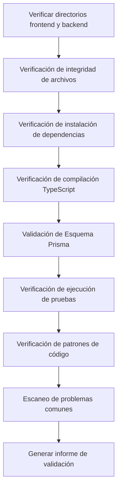

# Fase 6: Validation - Verificación de Calidad del Código

## Lo Que Aprenderás

- **Validación Automática de Código**: Verificación con un solo clic de la instalación de dependencias, verificación de tipos y pruebas básicas del código frontend y backend
- **Interpretación de Informes de Validación**: Comprensión de los informes detallados y clasificación de problemas generados por el Validation Agent
- **Localización Rápida de Problemas**: Corrección de errores de código basándose en ubicaciones específicas y sugerencias en el informe
- **Garantía de Calidad de Código**: Verificación de que el código generado cumple con los estándares de producción

## Tu Situación Actual

Has completado la fase de Code y generado el código frontend y backend, pero lo más preocupante es:

- **¿Funcionará el código?**: ¿Se instalaron correctamente las dependencias? ¿Pasará la verificación de tipos?
- **¿Es correcto Prisma?**: ¿Hay problemas de sintaxis en el schema? ¿Se puede generar el cliente?
- **¿Son confiables las pruebas?**: ¿Existen pruebas? ¿Pasarán?
- **¿Hay problemas ocultos?**: ¿Están correctas las configuraciones de variables de entorno? ¿Las rutas de importación son correctas?

Verificar manualmente cada uno de estos problemas lleva mucho tiempo y es fácil omitir algo. La fase de Validation existe para resolver estos problemas: verifica automáticamente la calidad del código y genera informes detallados.

## Cuándo Usar Esta Técnica

Cuando necesites:

- **Validar código rápidamente**: Confirmar que el código generado cumple con los estándares de calidad básicos
- **Descubrir problemas potenciales**: Identificar problemas de dependencias, tipos y pruebas antes del despliegue
- **Garantizar calidad de código**: Asegurar que tanto el código frontend como backend pasen las verificaciones básicas
- **Evitar fallos de despliegue**: Detectar problemas con anticipación para reducir costos de retrabajo

## Concepto Central

El Validation Agent es un **inspector de calidad** cuya tarea es verificar si el código generado por el Code Agent cumple con los estándares de calidad. Sus características principales:

### Entradas y Salidas

| Tipo | Contenido |
|------|-----------|
| **Entrada** | `artifacts/backend/` (código backend), `artifacts/client/` (código frontend) |
| **Salida** | `artifacts/validation/report.md` (informe de validación) |

### Elementos de Verificación

El Validation Agent ejecuta 8 categorías de verificaciones:

| Elemento de Verificación | Descripción |
|--------------------------|-------------|
| **Integridad de Archivos** | Confirmar que todos los archivos requeridos existen |
| **Instalación de Dependencias** | Verificar que las dependencias de `package.json` se pueden resolver normalmente |
| **Compilación TypeScript** | Verificar que el código pasa la verificación de tipos |
| **Esquema Prisma** | Validar que la sintaxis del modelo de datos es correcta |
| **Ejecución de Pruebas** | Confirmar que las pruebas existen y pueden pasar |
| **Estándares de Código** | Verificar la configuración de scripts de lint |
| **Patrones Clave** | Escanear patrones clave en el código (manejo de errores, health checks, etc.) |
| **Problemas Comunes** | Identificar patrones de error conocidos |

### Restricciones de Ejecución

::: warning Modo Solo Lectura
El Validation Agent **solo valida, no modifica**:
- Prohibido modificar cualquier archivo de código
- Prohibido instalar dependencias realmente (usa `--dry-run`)
- Prohibido ejecutar comandos con efectos secundarios
:::

## Sígueme Paso a Paso

### Paso 1: Entrar en la Fase de Validation

Suponiendo que ya has completado la fase de Code, ahora comenzarás a verificar la calidad del código.

```bash
# Si estás en el pipeline, entra directamente a la siguiente fase
factory run validation

# O reinicia desde una fase específica
factory run validation
```

**Deberías ver**: La CLI mostrará información de la fase de Validation, incluyendo archivos de entrada y salida esperada.

### Paso 2: El Asistente de IA Ejecuta el Validation Agent

El asistente de IA cargará `agents/validation.agent.md` y comenzará la ejecución.

Flujo de ejecución del Validation Agent:



**Qué hará el asistente de IA**:

1. **Verificar directorio backend**
   - Confirmar que `artifacts/backend/` existe
   - Verificar archivos requeridos: `package.json`, `tsconfig.json`, `.env.example`, `prisma/schema.prisma`

2. **Verificar directorio frontend**
   - Confirmar que `artifacts/client/` existe
   - Verificar archivos requeridos: `package.json`, `tsconfig.json`, `app.json`, `App.tsx`

3. **Verificación de instalación de dependencias**
   - Backend: `cd artifacts/backend && npm install --dry-run`
   - Frontend: `cd artifacts/client && npm install --dry-run`
   - Verificar que las dependencias se pueden resolver normalmente

4. **Verificación de compilación TypeScript**
   - Backend: `cd artifacts/backend && npx tsc --noEmit`
   - Frontend: `cd artifacts/client && npx tsc --noEmit`
   - Verificar que el código pasa la verificación de tipos

5. **Validación de Esquema Prisma**
   - `cd artifacts/backend && npx prisma validate`
   - Validar que la sintaxis del modelo de datos es correcta

6. **Verificación de ejecución de pruebas**
   - Backend: `cd artifacts/backend && npm test`
   - Frontend: `cd artifacts/client && npm test`
   - Confirmar que las pruebas existen y pueden pasar

7. **Verificación de patrones de código**
   - Escanear patrones clave: manejo de errores, health checks, SafeAreaView, etc.
   - Verificar configuración de dependencias: dotenv, React Native Web, etc.

8. **Escaneo de problemas comunes**
   - SQLite usa definición `type`
   - Valores de variables de entorno tienen comillas
   - Rutas de importación incorrectas
   - Faltan importaciones necesarias

9. **Generar informe de validación**
   - Resumir todos los resultados de verificación
   - Listar problemas encontrados
   - Proporcionar sugerencias de corrección
   - Guardar en `artifacts/validation/report.md`

### Paso 3: Ver el Informe de Validación

Después de que el Validation Agent termine, generará un informe de validación detallado.

Abre `artifacts/validation/report.md`:

```bash
cat artifacts/validation/report.md
```

**Deberías ver**:

```markdown
# Informe de Validación de Código

**Hora de Generación**: 2026-01-29 12:00:00
**Resultado de Validación**: ✅ Aprobado

## Resumen

- Validación Backend: ✅
- Validación Frontend: ✅
- Evaluación General: La calidad del código cumple con los estándares MVP, puede proceder a la fase de Preview

---

## Detalles de Validación Backend

### Integridad de Archivos
| Archivo | Estado |
|---------|--------|
| package.json | ✅ |
| tsconfig.json | ✅ |
| .env.example | ✅ |
| prisma/schema.prisma | ✅ |
| src/index.ts | ✅ |
| src/app.ts | ✅ |

### Instalación de Dependencias
- Estado: ✅
- Detalles: Todas las dependencias se pueden resolver normalmente

### Compilación TypeScript
- Estado: ✅
- Cantidad de Errores: 0

### Validación Prisma
- Estado: ✅
- Detalles: La sintaxis del esquema Prisma es correcta

### Ejecución de Pruebas
- Estado: ✅
- Cantidad de Pruebas: 12
- Pruebas Aprobadas: 12
- Pruebas Fallidas: 0

### Verificación de Patrones de Código
| Elemento de Verificación | Estado |
|--------------------------|--------|
| Middleware de Manejo de Errores | ✅ |
| Endpoint de Health Check | ✅ |
| Uso de Variables de Entorno | ✅ |
| Importación de Prisma Client | ✅ |
| Existencia de Archivos de Prueba | ✅ |
| Importación de dotenv en Primera Línea | ✅ |

---

## Detalles de Validación Frontend

### Integridad de Archivos
| Archivo | Estado |
|---------|--------|
| package.json | ✅ |
| tsconfig.json | ✅ |
| app.json | ✅ |
| App.tsx | ✅ |
| src/navigation/index.tsx | ✅ |

### Instalación de Dependencias
- Estado: ✅
- Detalles: Todas las dependencias se pueden resolver normalmente

### Compilación TypeScript
- Estado: ✅
- Cantidad de Errores: 0

### Ejecución de Pruebas
- Estado: ✅
- Cantidad de Pruebas: 8
- Pruebas Aprobadas: 8
- Pruebas Fallidas: 0

### Verificación de Patrones de Código
| Elemento de Verificación | Estado |
|--------------------------|--------|
| Uso de SafeAreaView | ✅ |
| Componente Loading | ✅ |
| Manejo de Errores | ✅ |
| Encapsulación de Llamadas API | ✅ |
| Dependencia React Native Web | ✅ |
| Dependencia async-storage | ✅ |

---

## Problemas Encontrados

Sin problemas graves o advertencias

---

## Sugerencias de Corrección

No se requieren correcciones

---

## Conclusión

La calidad del código cumple con los estándares MVP, se recomienda proceder a la fase de Preview.
```

### Paso 4: Manejar Casos de Validación Fallida

Si la validación falla, el informe listará problemas específicos y sugerencias de corrección.

**Ejemplo: Informe de Validación Parcialmente Aprobado**

```markdown
**Resultado de Validación**: ⚠️ Parcialmente Aprobado

## Problemas Encontrados

### Problemas Graves (Deben Corregirse)

1. Error de Compilación TypeScript
   - Ubicación: src/controllers/items.ts:15
   - Error: Property 'title' does not exist on type 'any'
   - Sugerencia: Agregar definición de tipo `const item: Item = req.body;`

2. Fallo de Validación de Esquema Prisma
   - Ubicación: prisma/schema.prisma:10
   - Error: Invalid datasource provider 'sqlite'
   - Sugerencia: Cambiar `provider = "sqlite"` a `provider = "postgresql"` (entorno de producción)

### Advertencias (Se Recomienda Corregir)

1. Faltan Archivos de Prueba
   - Ubicación: src/controllers/
   - Sugerencia: Agregar archivos de prueba para cada controlador

2. Configuración de Variables de Entorno Incompleta
   - Ubicación: .env.example
   - Sugerencia: Agregar ejemplo de `DATABASE_URL`

## Sugerencias de Corrección

1. Corregir errores TypeScript: Agregar definición de tipo en `src/controllers/items.ts`
2. Actualizar esquema Prisma: Modificar el provider del datasource
3. Agregar archivos de prueba: Escribir pruebas para los controladores
4. Completar variables de entorno: Complementar `.env.example`
```

**Pasos de Corrección**:

1. **Localizar el Archivo Problemático**
   ```bash
   # Abrir el archivo problemático
   vim artifacts/backend/src/controllers/items.ts
   ```

2. **Corregir el Código**
   ```typescript
   // Agregar definición de tipo
   const item: Item = req.body;
   ```

3. **Actualizar Esquema Prisma**
   ```prisma
   datasource db {
     provider = "postgresql" // Cambiar a postgresql
     url      = env("DATABASE_URL")
   }
   ```

4. **Revalidar**
   ```bash
   # Volver a ejecutar la fase de Validation
   factory run validation
   ```

### Paso 5: Confirmar el Punto de Control

Cuando el asistente de IA confirme que la fase de Validation está completa, verás:

```
✅ Fase de Validation completada

Archivos Generados:
- Informe de Validación: artifacts/validation/report.md

Resultado de Validación: ✅ Aprobado / ⚠️ Parcialmente Aprobado / ❌ Fallido

Opciones de Punto de Control:
[1] Continuar - Entrar en la fase de Preview
[2] Reintentar - Revalidar el código
[3] Pausar - Guardar el estado actual
```

- Si la validación es exitosa, selecciona **Continuar** para pasar a la siguiente fase
- Si hay problemas, corrígelos y selecciona **Reintentar** para revalidar
- Si necesitas tiempo para corregir, selecciona **Pausar** para guardar el estado actual

## Punto de Control ✅

Después de completar la fase de Validation, deberías:

- [ ] Todos los archivos requeridos del backend y frontend existen
- [ ] Las dependencias se pueden resolver normalmente (`npm install --dry-run`)
- [ ] La compilación TypeScript está libre de errores (`npx tsc --noEmit`)
- [ ] La validación del esquema Prisma es exitosa (`npx prisma validate`)
- [ ] Los archivos de prueba existen y pueden pasar (`npm test`)
- [ ] Todas las verificaciones de patrones clave pasaron
- [ ] El informe de validación ha sido generado (`artifacts/validation/report.md`)

## Advertencias de Problemas Comunes

### Problema 1: Fallo de Instalación de Dependencias

**Síntoma**: `npm install --dry-run` reporta error

**Solución**:

```bash
# Verificar sintaxis de package.json
cat artifacts/backend/package.json

# Problemas comunes:
# - Faltan comillas
# - Nombre de dependencia incorrecto
# - Formato de versión incorrecto

# Revalidar después de corregir
factory run validation
```

### Problema 2: Error de Compilación TypeScript

**Síntoma**: `npx tsc --noEmit` reporta error

**Tipos de Errores Comunes**:

| Error | Causa | Solución |
|-------|-------|----------|
| `Property does not exist` | Tipo no definido | Agregar definición de tipo |
| `Module not found` | Ruta de importación incorrecta | Verificar ruta de importación |
| `Implicit any` | Tipo any implícito | Habilitar modo estricto y agregar tipos |

### Problema 3: Fallo de Validación de Esquema Prisma

**Síntoma**: `npx prisma validate` reporta error

**Errores Comunes**:

| Error | Causa | Solución |
|-------|-------|----------|
| `Invalid datasource provider` | Provider incorrecto | Usar `postgresql` o `sqlite` |
| `Error parsing` | Error de sintaxis | Verificar definición del modelo |
| `Relation error` | Error en definición de relación | Verificar campo `@relation` |

### Problema 4: Fallo de Pruebas

**Síntoma**: `npm test` reporta error

**Solución**:

```bash
# Verificar si existen archivos de prueba
find artifacts/backend -name "*.test.ts"

# Verificar si las dependencias de prueba están instaladas
cat artifacts/backend/package.json | grep -A 5 "devDependencies"

# Si faltan dependencias de prueba, instalar manualmente
cd artifacts/backend
npm install --save-dev vitest @testing-library/react-native
```

### Problema 5: Fallo de Verificación de Patrones Clave

**Síntoma**: El informe muestra que faltan patrones clave

**Patrones Comúnmente Faltantes**:

| Patrón | Ubicación | Método de Corrección |
|--------|-----------|----------------------|
| Middleware de Manejo de Errores | `src/middleware/error.ts` | Agregar middleware de manejo de errores |
| Endpoint de Health Check | `src/routes/health.ts` | Agregar ruta `/health` |
| Importación de dotenv en Primera Línea | `src/index.ts:1` | Agregar `import 'dotenv/config';` |
| SafeAreaView | `src/screens/Home.tsx` | Envolver contenido con SafeAreaView |

## Requisitos Especiales del Validation Agent

El Validation Agent tiene algunas restricciones y requisitos especiales que requieren atención particular:

### 1. Modo Solo Lectura

::: warning Prohibido Modificar Código
El Validation Agent **está absolutamente prohibido** de modificar cualquier archivo de código, solo ejecuta validación y generación de informes.
:::

### 2. Instalación Dry-run

La verificación de instalación de dependencias usa el parámetro `--dry-run`, no instala dependencias realmente:

```bash
npm install --dry-run # Solo verificar si las dependencias se pueden resolver
```

### 3. Informe Completo

El Validation Agent **debe** generar un informe de validación completo, incluyendo:

| Sección | Contenido |
|---------|-----------|
| **Resumen** | Estado de validación backend/frontend y evaluación general |
| **Detalles Backend** | Integridad de archivos, dependencias, compilación, Prisma, pruebas, verificación de patrones |
| **Detalles Frontend** | Integridad de archivos, dependencias, compilación, pruebas, verificación de patrones |
| **Problemas Encontrados** | Lista de problemas graves y advertencias |
| **Sugerencias de Corrección** | Pasos específicos de corrección para los problemas |
| **Conclusión** | Evaluación general y sugerencias para el siguiente paso |

### 4. Clasificación de Problemas

El Validation Agent clasifica los problemas en tres niveles:

| Nivel | Estándar | Método de Manejo |
|-------|----------|------------------|
| **Problema Grave** | Debe corregirse para aprobar | Marcado como "Debe Corregirse" en el informe |
| **Advertencia** | Se recomienda corregir pero no es fatal | Marcado como "Se Recomienda Corregir" en el informe |
| **Información** | Solo para referencia | No afecta el resultado de validación |

## Determinación del Resultado de Validación

El Validation Agent determina el estado de validación basándose en los resultados de verificación.

### Condiciones de Aprobación (✅ Aprobado)

- Todos los archivos requeridos existen
- Sin errores en instalación de dependencias
- Sin errores en compilación TypeScript
- Validación de esquema Prisma exitosa
- Pruebas básicas existen y todas pasan
- Todas las verificaciones de patrones clave pasaron

### Condiciones de Aprobación Parcial (⚠️ Parcialmente Aprobado)

- Archivos requeridos existen
- Sin errores en instalación de dependencias
- Compilación TypeScript tiene advertencias pero sin errores
- Pruebas existen pero algunas fallan (< 30% tasa de fallo)
- Existen problemas no críticos

### Condiciones de Fallo (❌ Fallido)

- Faltan archivos requeridos
- Fallo en instalación de dependencias
- Errores en compilación TypeScript
- Fallo en validación de esquema Prisma
- Pruebas faltan o fallan masivamente (≥ 30% tasa de fallo)

## Lista de Verificación de Calidad de Código

El Validation Agent verifica comparando con la siguiente lista de verificación.

### Elementos Requeridos del Backend

- [ ] `package.json` existe
- [ ] `tsconfig.json` existe
- [ ] `.env.example` existe
- [ ] `prisma/schema.prisma` existe
- [ ] `src/index.ts` existe
- [ ] `src/app.ts` existe
- [ ] `src/index.ts` importa dotenv en la primera línea
- [ ] dotenv está en dependencies
- [ ] Existe middleware de manejo de errores
- [ ] Existe endpoint de health check (`/health`)
- [ ] Variables de entorno usan `process.env`
- [ ] Importación de Prisma Client es correcta
- [ ] Existe al menos un archivo de prueba
- [ ] package.json contiene script `test`

### Elementos Requeridos del Frontend

- [ ] `package.json` existe
- [ ] `tsconfig.json` existe
- [ ] `app.json` existe
- [ ] `App.tsx` existe
- [ ] `src/navigation/index.tsx` existe
- [ ] Existe uso de SafeAreaView
- [ ] Existe componente Loading
- [ ] Existe manejo de Errores
- [ ] Llamadas API pasan por capa de encapsulación
- [ ] Contiene dependencia React Native Web
- [ ] Contiene dependencia async-storage
- [ ] `app.json` no referencia archivos de imagen inexistentes

## Escaneo de Problemas Comunes

El Validation Agent escanea los siguientes patrones de problemas conocidos:

| Elemento de Verificación | Método de Detección | Sugerencia de Corrección |
|--------------------------|---------------------|--------------------------|
| SQLite usa definición `type` | Verificar si schema.prisma contiene `type Xxx` | Eliminar definición `type` |
| Valores de variables de entorno tienen comillas | Verificar si .env contiene `="xxx"` o `='xxx'` | Eliminar comillas |
| Versión de Prisma es 7.x | Verificar si la versión de prisma en package.json es ^7 | Usar Prisma 5.x |
| Rutas de importación incorrectas | Verificar si screens tiene `from './ui/'` | Cambiar a `from '../components/ui/'` |
| Falta importación de View | Verificar si el componente usa View pero no lo importa | Agregar `import { View } from 'react-native'` |
| Cadena no terminada | Verificar si archivos .tsx tienen comillas continuas | Agregar comillas faltantes |

## Ejemplo de Informe de Validación

### Informe de Validación Aprobado

```markdown
# Informe de Validación de Código

**Hora de Generación**: 2026-01-29 12:00:00
**Resultado de Validación**: ✅ Aprobado

## Resumen

- Validación Backend: ✅
- Validación Frontend: ✅
- Evaluación General: La calidad del código cumple con los estándares MVP, puede proceder a la fase de Preview

---

## Detalles de Validación Backend

### Integridad de Archivos
| Archivo | Estado |
|---------|--------|
| package.json | ✅ |
| tsconfig.json | ✅ |
| .env.example | ✅ |
| prisma/schema.prisma | ✅ |
| src/index.ts | ✅ |
| src/app.ts | ✅ |

### Instalación de Dependencias
- Estado: ✅
- Detalles: Todas las dependencias se pueden resolver normalmente

### Compilación TypeScript
- Estado: ✅
- Cantidad de Errores: 0

### Validación Prisma
- Estado: ✅
- Detalles: La sintaxis del esquema Prisma es correcta

### Ejecución de Pruebas
- Estado: ✅
- Cantidad de Pruebas: 12
- Pruebas Aprobadas: 12
- Pruebas Fallidas: 0

### Verificación de Patrones de Código
| Elemento de Verificación | Estado |
|--------------------------|--------|
| Middleware de Manejo de Errores | ✅ |
| Endpoint de Health Check | ✅ |
| Uso de Variables de Entorno | ✅ |
| Importación de Prisma Client | ✅ |
| Existencia de Archivos de Prueba | ✅ |
| Importación de dotenv en Primera Línea | ✅ |

---

## Detalles de Validación Frontend

### Integridad de Archivos
| Archivo | Estado |
|---------|--------|
| package.json | ✅ |
| tsconfig.json | ✅ |
| app.json | ✅ |
| App.tsx | ✅ |
| src/navigation/index.tsx | ✅ |

### Instalación de Dependencias
- Estado: ✅
- Detalles: Todas las dependencias se pueden resolver normalmente

### Compilación TypeScript
- Estado: ✅
- Cantidad de Errores: 0

### Ejecución de Pruebas
- Estado: ✅
- Cantidad de Pruebas: 8
- Pruebas Aprobadas: 8
- Pruebas Fallidas: 0

### Verificación de Patrones de Código
| Elemento de Verificación | Estado |
|--------------------------|--------|
| Uso de SafeAreaView | ✅ |
| Componente Loading | ✅ |
| Manejo de Errores | ✅ |
| Encapsulación de Llamadas API | ✅ |
| Dependencia React Native Web | ✅ |
| Dependencia async-storage | ✅ |

---

## Problemas Encontrados

Sin problemas graves o advertencias

---

## Sugerencias de Corrección

No se requieren correcciones

---

## Conclusión

La calidad del código cumple con los estándares MVP, se recomienda proceder a la fase de Preview.
```

### Informe de Validación Fallido

```markdown
# Informe de Validación de Código

**Hora de Generación**: 2026-01-29 12:00:00
**Resultado de Validación**: ❌ Fallido

## Resumen

- Validación Backend: ❌
- Validación Frontend: ⚠️
- Evaluación General: El backend tiene problemas graves, deben corregirse antes de continuar

---

## Problemas Encontrados

### Problemas Graves (Deben Corregirse)

1. Error de Compilación TypeScript
   - Ubicación: src/controllers/items.ts:15
   - Error: Property 'title' does not exist on type 'any'
   - Sugerencia: Agregar definición de tipo `const item: Item = req.body;`

2. Fallo de Validación de Esquema Prisma
   - Ubicación: prisma/schema.prisma:10
   - Error: Invalid datasource provider 'sqlite'
   - Sugerencia: Cambiar `provider = "sqlite"` a `provider = "postgresql"`

3. Falta Archivo Requerido
   - Ubicación: src/
   - Archivo: src/middleware/error.ts
   - Sugerencia: Crear middleware de manejo de errores

### Advertencias (Se Recomienda Corregir)

1. Fallo de Pruebas Frontend
   - Ubicación: src/screens/__tests__/HomeScreen.test.tsx
   - Fallo: 2/8 pruebas fallidas
   - Sugerencia: Corregir casos de prueba

2. Falta Componente Loading
   - Ubicación: src/components/
   - Sugerencia: Crear componente Loading y usarlo correctamente

---

## Sugerencias de Corrección

1. Corregir errores TypeScript: Agregar definición de tipo en `src/controllers/items.ts`
2. Actualizar esquema Prisma: Modificar el provider del datasource a postgresql
3. Crear middleware de manejo de errores: Agregar `src/middleware/error.ts`
4. Corregir pruebas frontend: Verificar y corregir casos de prueba fallidos
5. Crear componente Loading: Agregar `src/components/Loading.tsx`

---

## Conclusión

El backend tiene problemas graves, deben corregirse antes de continuar. Se recomienda:
1. Corregir errores de compilación TypeScript
2. Actualizar esquema Prisma
3. Agregar archivos faltantes
4. Volver a ejecutar la fase de Validation
```

## Resumen de Esta Lección

La fase de Validation es el eslabón de garantía de calidad del pipeline, asegura que el código generado cumple con los estándares de calidad básicos.

**Puntos Clave**:

1. **Flujo de Validación**: El Validation Agent verifica automáticamente la integridad de archivos, dependencias, compilación, pruebas, etc.
2. **Modo Solo Lectura**: Solo valida, no modifica, usa `--dry-run` para evitar efectos secundarios
3. **Clasificación de Problemas**: Divide los problemas en tres niveles: graves, advertencias e información
4. **Informe Detallado**: Genera informes de validación que incluyen ubicaciones específicas y sugerencias de corrección
5. **Determinación de Resultado**: Determina aprobado/aprobado parcialmente/fallido basándose en los resultados de verificación

## Vista Previa de la Siguiente Lección

> En la siguiente lección aprenderemos sobre la **[Fase de Preview](../stage-preview/)**.
>
> Aprenderás:
> - Cómo generar documentación de instrucciones de ejecución
> - Guía de inicio rápido
> - Configuración de despliegue (Docker, CI/CD)

---

## Apéndice: Referencia de Código Fuente

<details>
<summary><strong>Haz clic para expandir y ver la ubicación del código fuente</strong></summary>

> Última actualización: 2026-01-29

| Función | Ruta del Archivo | Número de Línea |
|---------|------------------|-----------------|
| Definición del Validation Agent | [`agents/validation.agent.md`](https://github.com/hyz1992/agent-app-factory/blob/main/agents/validation.agent.md) | 1-320 |
| Definición del Pipeline | [`pipeline.yaml`](https://github.com/hyz1992/agent-app-factory/blob/main/pipeline.yaml) | 79-96 |

**Restricciones Clave**:
- Prohibido modificar cualquier archivo de código (`validation.agent.md:293`)
- Prohibido instalar dependencias realmente, usar `--dry-run` (`validation.agent.md:294`)
- Debe generar informe de validación completo (`validation.agent.md:296`)
- Debe proporcionar sugerencias de corrección específicas (`validation.agent.md:298`)

**Elementos de Verificación de Validación**:
- Verificación de integridad de archivos (`validation.agent.md:24-42`)
- Verificación de instalación de dependencias (`validation.agent.md:43-53`)
- Verificación de compilación TypeScript (`validation.agent.md:55-65`)
- Validación de Esquema Prisma (`validation.agent.md:67-73`)
- Verificación de ejecución de pruebas (`validation.agent.md:75-85`)
- Verificación de estándares de código (`validation.agent.md:87-97`)
- Verificación de patrones clave (`validation.agent.md:99-122`)
- Escaneo de problemas comunes (`validation.agent.md:124-136`)

**Determinación de Resultado de Validación**:
- Condiciones de aprobación (`validation.agent.md:268-274`)
- Condiciones de aprobación parcial (`validation.agent.md:276-281`)
- Condiciones de fallo (`validation.agent.md:283-288`)

**Flujo de Ejecución**:
- Pasos de operación (`validation.agent.md:303-313`)
- Formato de salida (`validation.agent.md:139-262`)

</details>


