# Visión general de la pipeline de 7 etapas

## Lo que podrás hacer después de esta lección

- Comprender el flujo completo de la pipeline de 7 etapas y las responsabilidades de cada etapa
- Conocer las entradas, salidas y condiciones de salida de cada etapa
- Entender cómo el mecanismo de puntos de control garantiza la calidad
- Comprender cómo el planificador Sisyphus coordina la ejecución de Agentes
- Dominar cómo la matriz de permisos previene que los Agentes excedan sus autorizaciones
- Aprender a aprovechar "Continuar en nueva sesión" para ahorrar Tokens

## Idea central

**¿Qué es la pipeline?**

La pipeline de AI App Factory es una línea de producción automatizada que transforma tu idea de producto paso a paso en una aplicación ejecutable. Al igual que una línea de producción industrial, la materia prima (idea de producto) pasa por 7 procesos (etapas) para producir el producto final (aplicación completa).

Cada proceso está a cargo de un Agente especializado, cada uno con sus propias responsabilidades sin interferir entre sí:

| Etapa | Agente | Responsabilidad | Producto |
| ----- | ------ | --------------- | -------- |
| Bootstrap | Bootstrap Agent | Profundizar en la idea de producto | `input/idea.md` |
| PRD | PRD Agent | Generar documento de requisitos del producto | `artifacts/prd/prd.md` |
| UI | UI Agent | Diseñar interfaz y prototipo | `artifacts/ui/ui.schema.yaml` + página de previsualización |
| Tech | Tech Agent | Diseñar arquitectura técnica | `artifacts/tech/tech.md` + Prisma Schema |
| Code | Code Agent | Generar código ejecutable | `artifacts/backend/` + `artifacts/client/` |
| Validation | Validation Agent | Validar calidad del código | `artifacts/validation/report.md` |
| Preview | Preview Agent | Generar guía de despliegue | `artifacts/preview/README.md` |

**Características clave**

1. **Mecanismo de puntos de control**: La pipeline se pausa después de cada etapa, esperando tu confirmación antes de continuar
2. **Aislamiento de permisos**: Cada Agente solo puede leer y escribir en directorios autorizados, evitando contaminación
3. **Recuperación ante fallos**: Reintento automático cuando una etapa falla, si falla continuamente se retrocede al último punto de control exitoso
4. **Optimización de contexto**: Soporte para continuar la ejecución en una nueva sesión, ahorrando Tokens

## Visión general de la pipeline

```mermaid
graph LR
    A[Bootstrap<br/>Estructurar idea de producto] -->|idea.md| B[PRD<br/>Generar documento de requisitos]
    B -->|prd.md| C[UI<br/>Diseñar prototipo de interfaz]
    C -->|ui.schema.yaml| D[Tech<br/>Diseñar arquitectura técnica]
    D -->|tech.md + schema.prisma| E[Code<br/>Generar código ejecutable]
    E -->|backend + client| F[Validation<br/>Validar calidad del código]
    F -->|informe de validación| G[Preview<br/>Generar guía de despliegue]

    style A fill:#e0f2fe
    style B fill:#f0fdf4
    style C fill:#fef3c7
    style D fill:#ede9fe
    style E fill:#fce7f3
    style F fill:#dbeafe
    style G fill:#d1fae5
```



**Reglas de ejecución de la pipeline**

::: tip Reglas de ejecución

1. **Orden estricto**: Debe comenzar desde Bootstrap y ejecutarse secuencialmente hasta Preview, sin saltos ni ejecución paralela
2. **Un solo Agente activo**: Solo un Agente puede estar trabajando en un momento dado
3. **Sin retroceso**: Los artefactos confirmados no pueden modificarse, solo se puede reejecutar la etapa

Nota: Estas son las reglas de ejecución de la pipeline, no equivalentes al número de opciones de puntos de control. Después de completar cada etapa, Sisyphus proporcionará 5 opciones de puntos de control (ver la sección "Mecanismo de puntos de control" más abajo).

:::

## Detalles de cada etapa

### Etapa 1: Bootstrap - Estructurar la idea de producto

**¿Qué hace?**

Transforma tu descripción de producto en lenguaje natural en un documento estructurado, profundizando en el problema, usuarios, valor e hipótesis.

**¿Por qué es importante?**

Una definición clara del producto es la base de toda la pipeline. Si este paso no se hace bien, todas las etapas posteriores se desviarán.

**Entradas y salidas**

| Tipo | Ruta | Descripción |
| ---- | ---- | ----------- |
| Entrada | Descripción en lenguaje natural del usuario | Por ejemplo: "Quiero hacer una aplicación de contabilidad" |
| Salida | `input/idea.md` | Documento de idea de producto estructurado |

**Condiciones de salida**

- [ ] `idea.md` existe
- [ ] Describe una idea de producto coherente
- [ ] El Agente utilizó la habilidad `superpowers:brainstorm` para profundizar

**Uso obligatorio de habilidades**

::: warning Debe usar superpowers:brainstorm

La etapa Bootstrap debe utilizar la habilidad `superpowers:brainstorm` para profundizar. Si el Agente no menciona el uso de esta habilidad, el producto será rechazado y se solicitará la reejecución.

:::

### Etapa 2: PRD - Generar documento de requisitos del producto

**¿Qué hace?**

Transforma la idea de producto estructurada en un documento de requisitos de producto a nivel MVP, definiendo el alcance de funcionalidades, no objetivos e historias de usuario.

**¿Por qué es importante?**

El PRD es el "contrato" de diseño y desarrollo, definiendo "qué hacer" y "qué no hacer", previniendo la proliferación del alcance.

**Entradas y salidas**

| Tipo | Ruta | Descripción |
| ---- | ---- | ----------- |
| Entrada | `input/idea.md` | Idea estructurada de la etapa Bootstrap |
| Salida | `artifacts/prd/prd.md` | Documento de requisitos de producto a nivel MVP |

**Condiciones de salida**

- [ ] El PRD incluye usuarios objetivo
- [ ] El PRD define el alcance del MVP
- [ ] El PRD lista los no objetivos
- [ ] El PRD no contiene detalles de implementación técnica

**Nota: El PRD no contiene detalles técnicos**

El PRD debe describir "qué necesitan los usuarios", no "cómo implementarlo". Los detalles de implementación técnica son responsabilidad de las etapas Tech y Code.

### Etapa 3: UI - Diseñar interfaz y prototipo

**¿Qué hace?**

Basándose en el PRD, diseña la estructura de UI, esquema de colores y genera un prototipo HTML que se puede previsualizar en el navegador.

**¿Por qué es importante?**

El diseño visual permite que el equipo y los usuarios tempranos comprendan intuitivamente la forma del producto, reduciendo retrabajos en el desarrollo.

**Entradas y salidas**

| Tipo | Ruta | Descripción |
| ---- | ---- | ----------- |
| Entrada | `artifacts/prd/prd.md` | Documento PRD |
| Salida | `artifacts/ui/ui.schema.yaml` | Definición de estructura de UI |
| Salida | `artifacts/ui/preview.web/index.html` | Prototipo HTML previsualizable |

**Condiciones de salida**

- [ ] `ui.schema.yaml` existe
- [ ] El número de páginas no excede 3
- [ ] La página de previsualización se puede abrir en el navegador
- [ ] El Agente utilizó la habilidad `ui-ux-pro-max`

**Uso obligatorio de habilidades**

::: warning Debe usar ui-ux-pro-max

La etapa UI debe utilizar la habilidad `ui-ux-pro-max` para generar un sistema de diseño profesional. Esta habilidad incluye 67 estilos, 96 paletas de colores y 100 reglas de la industria.

:::

### Etapa 4: Tech - Diseñar arquitectura técnica

**¿Qué hace?**

Diseña la arquitectura técnica y el modelo de datos mínimo viable, selecciona el stack tecnológico y define los endpoints de API.

**¿Por qué es importante?**

La arquitectura técnica determina la mantenibilidad, escalabilidad y rendimiento del código. El diseño excesivo dificulta el desarrollo, el diseño insuficiente no puede soportar los requisitos.

**Entradas y salidas**

| Tipo | Ruta | Descripción |
| ---- | ---- | ----------- |
| Entrada | `artifacts/prd/prd.md` | Documento PRD |
| Salida | `artifacts/tech/tech.md` | Documento de arquitectura técnica |
| Salida | `artifacts/backend/prisma/schema.prisma` | Modelo de datos Prisma |

**Condiciones de salida**

- [ ] El stack tecnológico está declarado explícitamente
- [ ] El modelo de datos es consistente con el PRD
- [ ] No se realizó optimización prematura o diseño excesivo

**Selección predeterminada del stack tecnológico**

- Backend: Node.js + Express + Prisma
- Base de datos: SQLite (desarrollo) / PostgreSQL (producción)
- Frontend: React Native + Expo

### Etapa 5: Code - Generar código ejecutable

**¿Qué hace?**

Según el UI Schema, el diseño Tech y el Prisma Schema, genera el código completo de frontend y backend, pruebas, configuración y documentación.

**¿Por qué es importante?**

Este es el paso clave de "de la idea a la aplicación", el código generado es ejecutable y listo para producción.

**Entradas y salidas**

| Tipo | Ruta | Descripción |
| ---- | ---- | ----------- |
| Entrada | `artifacts/ui/ui.schema.yaml` | Definición de estructura de UI |
| Entrada | `artifacts/tech/tech.md` | Documento de arquitectura técnica |
| Entrada | `artifacts/backend/prisma/schema.prisma` | Modelo de datos |
| Salida | `artifacts/backend/` | Código de backend (Express + Prisma) |
| Salida | `artifacts/client/` | Código de frontend (React Native) |

**Condiciones de salida**

- [ ] El backend puede iniciarse sin errores graves
- [ ] El cliente puede renderizarse y ser accesible
- [ ] No se introdujeron funcionalidades adicionales de autenticación o no relacionadas

**Contenido generado**

El Code Agent generará el siguiente contenido:

**Backend**:
- Servidor Express + rutas
- Prisma ORM + modelo de datos
- Pruebas unitarias y de integración (Vitest)
- Documentación de API (Swagger/OpenAPI)
- Datos de semilla (`prisma/seed.ts`)
- Configuración de Docker
- Registro y monitoreo

**Frontend**:
- Páginas y componentes de React Native
- Rutas de React Navigation
- Pruebas unitarias (Jest + React Testing Library)
- Configuración de entorno

::: info ¿Por qué no genera funcionalidad de autenticación?

AI App Factory se enfoca en el MVP, por defecto no genera funcionalidades complejas como autenticación y autorización. Estas funcionalidades se pueden agregar en iteraciones posteriores.

:::

### Etapa 6: Validation - Validar calidad del código

**¿Qué hace?**

Verifica si el código generado puede instalar dependencias normalmente, pasar verificaciones de tipos y cumplir con las normas de código.

**¿Por qué es importante?**

Descubre problemas antes de ejecutar el código, evita descubrir errores después del despliegue, ahorrando tiempo de depuración.

**Entradas y salidas**

| Tipo | Ruta | Descripción |
| ---- | ---- | ----------- |
| Entrada | `artifacts/backend/` | Código de backend |
| Entrada | `artifacts/client/` | Código de frontend |
| Salida | `artifacts/validation/report.md` | Informe de validación |

**Condiciones de salida**

- [ ] El informe de validación se ha generado
- [ ] Las dependencias del backend se pueden resolver normalmente
- [ ] Las dependencias del frontend se pueden resolver normalmente
- [ ] La compilación de TypeScript no tiene errores graves
- [ ] La validación del esquema Prisma pasó

**Contenido de validación**

El Validation Agent verificará:

1. **Resolución de dependencias**: ¿`npm install` fue exitoso?
2. **Verificación de tipos**: ¿`tsc --noEmit` pasó?
3. **Normas de código**: ¿Cumple con `policies/code-standards.md`?
4. **Esquema Prisma**: ¿`prisma validate` pasó?
5. **Tasa de paso de pruebas**: ¿Las pruebas existen y se pueden ejecutar?

**Manejo de fallos**

Si la validación falla, el Validation Agent generará un informe de error detallado, indicando problemas específicos y sugerencias de corrección.

### Etapa 7: Preview - Generar guía de despliegue

**¿Qué hace?**

Recopila todos los artefactos, genera instrucciones de ejecución completas, configuración de despliegue y documentación del flujo de demostración.

**¿Por qué es importante?**

Este es el último eslabón de la pipeline, permitiéndote ejecutar y desplegar rápidamente la aplicación generada.

**Entradas y salidas**

| Tipo | Ruta | Descripción |
| ---- | ---- | ----------- |
| Entrada | `artifacts/backend/` | Código de backend |
| Entrada | `artifacts/client/` | Código de frontend |
| Salida | `artifacts/preview/README.md` | Instrucciones de ejecución completas |
| Salida | `artifacts/preview/GETTING_STARTED.md` | Guía de inicio rápido |

**Condiciones de salida**

- [ ] El README incluye pasos de instalación
- [ ] El README incluye comandos de ejecución
- [ ] El README lista direcciones de acceso y flujo de demostración

**Contenido generado**

El Preview Agent generará:

- Instrucciones de ejecución local (Web, iOS, Android)
- Configuración de despliegue Docker (`docker-compose.yml`)
- Referencia de configuración CI/CD (GitHub Actions)
- Referencia de configuración de Git Hooks (Husky)
- Guía de migración de base de datos (SQLite → PostgreSQL)

## Mecanismo de puntos de control

**¿Qué es un punto de control?**

Después de completar cada etapa, la pipeline se pausa, mostrándote la lista de artefactos generados para que confirmes si cumplen con las expectativas. Si no es así, puedes elegir "Reintentar" o "Reejecutar después de modificar".

**¿Por qué se necesitan puntos de control?**

- **Prevenir acumulación de errores**: Los problemas tempranos si no se resuelven en la etapa actual, se amplificarán en etapas posteriores
- **Garantizar calidad**: Cada etapa asegura que la salida cumpla con las expectativas, evitando generar código inutilizable
- **Control flexible**: Puedes pausar, reintentar o modificar entradas en cualquier punto de control

**Opciones de puntos de control**

Después de completar cada etapa, el planificador Sisyphus mostrará las siguientes opciones:

```
┌──────┬──────────────────────────────────────────────────────┐
│ Opción │ Descripción                                        │
├──────┼──────────────────────────────────────────────────────┤
│ 1    │ Continuar a la siguiente etapa (misma sesión)      │
│      │ Continuaré ejecutando la etapa [nombre siguiente]  │
├──────┼──────────────────────────────────────────────────────┤
│ 2    │ Continuar en nueva sesión ⭐ Opción recomendada,   │
│      │ ahorra Token                                       │
│      │ Ejecutar en una nueva ventana de terminal:         │
│      │ factory continue                                   │
│      │ (Iniciará automáticamente una nueva ventana de     │
│      │ Claude Code y continuará la pipeline)              │
├──────┼──────────────────────────────────────────────────────┤
│ 3    │ Reejecutar esta etapa                              │
│      │ Reejecutar la etapa [nombre actual]                │
├──────┼──────────────────────────────────────────────────────┤
│ 4    │ Reejecutar después de modificar artefactos         │
│      │ Modificar [algún archivo de entrada] y reejecutar  │
├──────┼──────────────────────────────────────────────────────┤
│ 5    │ Pausar la pipeline                                 │
│      │ Guardar el progreso actual, continuar más tarde    │
└──────┴──────────────────────────────────────────────────────┘
```

**Prácticas recomendadas**

::: tip Elige "Continuar en nueva sesión" para ahorrar Tokens

Después de completar cada etapa, se recomienda elegir "Continuar en nueva sesión" (opción 2):

1. Ejecuta `factory continue` en una nueva ventana de terminal
2. El comando iniciará automáticamente una nueva ventana de Claude Code
3. Cada etapa tiene un contexto limpio exclusivo, evitando acumulación de Tokens

:::

## Matriz de permisos

**¿Por qué se necesita aislamiento de permisos?**

Si los Agentes pueden leer y escribir en cualquier directorio libremente, podría resultar en:

- Bootstrap Agent modifica accidentalmente el PRD completado
- Code Agent elimina accidentalmente el diseño de UI
- Validation Agent modifica erróneamente el código de backend

**Matriz de límites de capacidad**

El planificador Sisyphus verificará los permisos del Agente antes y después de cada etapa:

| Agente | Puede leer | Puede escribir |
| ------ | ---------- | -------------- |
| bootstrap | Ninguno | `input/` |
| prd | `input/` | `artifacts/prd/` |
| ui | `artifacts/prd/` | `artifacts/ui/` |
| tech | `artifacts/prd/` | `artifacts/tech/`, `artifacts/backend/prisma/` |
| code | `artifacts/ui/`, `artifacts/tech/`, `artifacts/backend/prisma/` | `artifacts/backend/`, `artifacts/client/` |
| validation | `artifacts/backend/`, `artifacts/client/` | `artifacts/validation/` |
| preview | `artifacts/backend/`, `artifacts/client/` | `artifacts/preview/` |

**Manejo de exceso de permisos**

Si un Agente escribe en un directorio no autorizado, el planificador Sisyphus moverá el archivo a `artifacts/_untrusted/<stage-id>/`, pausará la pipeline y reportará.

::: warning Ejemplo de exceso de permisos

Supongamos que el PRD Agent escribe en `artifacts/ui/ui.schema.yaml` (esto no está dentro de su alcance de permisos), el planificador:

1. Moverá el archivo a `artifacts/_untrusted/prd/ui.schema.yaml`
2. Pausará la pipeline
3. Reportará: Se detectó escritura no autorizada, requiere intervención manual

:::

## Manejo de fallos

**¿Qué se considera un fallo?**

- Archivos de salida faltantes
- Contenido de artefactos que no cumple con `exit_criteria`
- Agente escribe en directorio no autorizado
- Error de script o imposibilidad de leer entrada

**Estrategia de manejo predeterminada**

1. **Reintento automático**: Cada etapa permite un reintento automático
2. **Archivo de fallos**: Los artefactos fallidos se mueven a `artifacts/_failed/<stage-id>/`
3. **Pausa de pipeline**: Después de dos fallos continuos, espera intervención manual
4. **Mecanismo de retroceso**: Retrocede al punto de control exitoso más reciente y reejecuta

::: tip Manejo después de intervención manual

Si falla continuamente dos veces, puedes:

1. Modificar archivos de entrada (como `input/idea.md`)
2. Ajustar el prompt del Agente
3. Corregir problemas de permisos
4. Ejecutar `factory run [stage]` para reiniciar desde esa etapa

:::

## Gestión de estado

**Archivo de estado**

Todo el estado de la pipeline se guarda en `.factory/state.json`, incluyendo:

```json
{
  "version": 1,
  "status": "waiting_for_confirmation",
  "current_stage": "prd",
  "completed_stages": ["bootstrap"],
  "started_at": "2026-01-29T10:00:00Z",
  "last_updated": "2026-01-29T10:30:00Z"
}
```

**Máquina de estados**

| Estado | Significado | Condición de activación |
| ------ | ----------- | ------------------------ |
| idle | No iniciado | Esperando `factory run` |
| running | En ejecución | Comenzar a ejecutar alguna etapa |
| waiting_for_confirmation | Esperando confirmación | Etapa completada |
| paused | Pausado | Usuario eligió pausar |
| failed | Fallo requiere intervención | Fallo continuo o operación no autorizada |

Solo el planificador Sisyphus tiene permiso para actualizar el estado.

## Advertencias de problemas comunes

### Error común 1: Etapa Bootstrap no utilizó la habilidad brainstorm

**Síntoma**: Sisyphus rechaza aceptar `input/idea.md`, indicando "Se detectó que no se utilizó la habilidad superpowers:brainstorm".

**Causa**: El Bootstrap Agent no utilizó la habilidad `superpowers:brainstorm` para profundizar en la idea de producto.

**Solución**: Al confirmar el artefacto, elige "Reejecutar esta etapa" y solicita explícitamente al Agente que utilice la habilidad `superpowers:brainstorm`.

### Error común 2: Diseño mediocre en etapa UI

**Síntoma**: El diseño de UI generado es genérico, todos son degradados púrpura, fuente Inter.

**Causa**: El UI Agent no utilizó la habilidad `ui-ux-pro-max`.

**Solución**: Al confirmar el artefacto, elige "Reejecutar esta etapa", solicita explícitamente al Agente que utilice la habilidad `ui-ux-pro-max`, y especifica una dirección estética distintiva (como "ciberpunk", "minimalismo").

### Error común 3: Etapa Code generó funcionalidad de autenticación

**Síntoma**: El código de backend generado incluye funcionalidades complejas como autenticación JWT, inicio de sesión de usuarios.

**Causa**: El Code Agent excedió el alcance del MVP.

**Solución**: Modifica el PRD, lista explícitamente los "no objetivos" (como "no soporta inicio de sesión de usuarios", "no soporta colaboración multiusuario"), luego reejecuta la etapa Code.

### Error común 4: Consumo excesivo de Tokens

**Síntoma**: Al ejecutar la pipeline en etapas posteriores, el consumo de Tokens aumenta drásticamente, el asistente de IA responde más lento.

**Causa**: Ejecutar múltiples etapas en la misma sesión, el contexto se acumula continuamente.

**Solución**: **Siempre elige "Continuar en nueva sesión"** (opción 2), para que cada etapa tenga un contexto limpio exclusivo.

## Resumen de esta lección

- La pipeline contiene 7 etapas: Bootstrap → PRD → UI → Tech → Code → Validation → Preview
- Después de completar cada etapa se pausa para confirmar, asegurando que la salida cumpla con las expectativas
- El planificador Sisyphus coordina la ejecución de Agentes, gestiona estado y permisos
- La matriz de límites de capacidad previene que los Agentes excedan sus permisos, garantizando separación de responsabilidades
- Elegir "Continuar en nueva sesión" puede ahorrar significativamente Tokens

## Próxima lección

> En la siguiente lección aprenderemos **[Guía de integración con Claude Code](../../platforms/claude-code/)**.
>
> Aprenderás:
> - Cómo configurar permisos de Claude Code
> - Cómo ejecutar la pipeline
> - Mejores prácticas de Claude Code

---

## Apéndice: Referencia de código fuente

<details>
<summary><strong>Haz clic para expandir y ver la ubicación del código fuente</strong></summary>

> Fecha de actualización: 2026-01-29

| Función | Ruta del archivo | Líneas |
| ------- | ---------------- | ------ |
| Definición de pipeline | [`pipeline.yaml`](https://github.com/hyz1992/agent-app-factory/blob/main/pipeline.yaml) | 1-111 |
| Núcleo del planificador | [`agents/orchestrator.checkpoint.md`](https://github.com/hyz1992/agent-app-factory/blob/main/agents/orchestrator.checkpoint.md) | 1-302 |
| README del proyecto | [`README.md`](https://github.com/hyz1992/agent-app-factory/blob/main/README.md) | 1-253 |

**Constantes clave**:
- Modo de pipeline: `checkpoint` (modo de punto de control, pausa después de cada etapa para confirmar)

**Definiciones clave de Agentes**:
- **Bootstrap Agent**: Utiliza la habilidad `superpowers:brainstorm`, genera `input/idea.md`
- **PRD Agent**: Lee `input/idea.md`, genera `artifacts/prd/prd.md`
- **UI Agent**: Utiliza la habilidad `ui-ux-pro-max`, genera `artifacts/ui/ui.schema.yaml` y página de previsualización
- **Tech Agent**: Genera `artifacts/tech/tech.md` y `artifacts/backend/prisma/schema.prisma`
- **Code Agent**: Según UI, Tech, Schema genera `artifacts/backend/` y `artifacts/client/`
- **Validation Agent**: Valida calidad del código, genera `artifacts/validation/report.md`
- **Preview Agent**: Genera `artifacts/preview/README.md`

</details>
