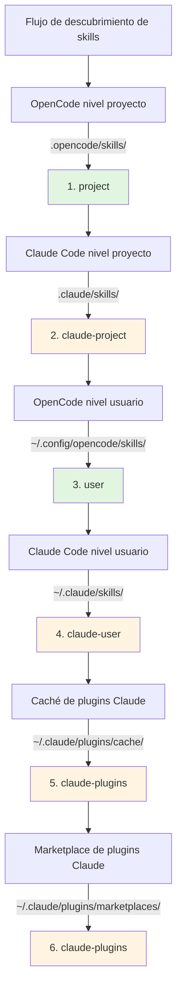

# Compatibilidad con Skills de Claude Code

## Lo que aprenderás

- Entender cómo el plugin es automáticamente compatible con el formato de skills de Claude Code
- Dominar el mecanismo de mapeo de herramientas para que los skills de Claude funcionen correctamente en OpenCode
- Conocer las reglas completas de prioridad en el descubrimiento de skills
- Reutilizar skills existentes del marketplace de plugins de Claude sin necesidad de reescribirlos

## Tu situación actual

Ya tienes algunos skills de Claude Code, o quieres usar skills del marketplace de plugins de Claude, pero estos skills fueron escritos para Claude Code. Usarlos directamente en OpenCode presenta problemas:

- Las llamadas a herramientas en los skills de Claude (como `TodoWrite`, `Task`) no existen en OpenCode
- No está claro cómo hacer que OpenCode encuentre los skills de plugins de Claude instalados
- Te preocupa que el formato de los skills sea incompatible y tengas que reescribir todo

## Concepto central

El plugin OpenCode Agent Skills utiliza un **mecanismo de compatibilidad de tres capas** que te permite usar skills de Claude Code sin modificaciones:

1. **Descubrimiento automático** - Escanea skills desde los directorios estándar de Claude Code (`.claude/skills/`, `~/.claude/plugins/`)
2. **Mapeo de herramientas** - Al cargar un skill, inyecta automáticamente una guía de mapeo que convierte los nombres de herramientas de Claude a nombres de OpenCode
3. **Soporte de formatos** - Compatible con los formatos de instalación v1 y v2 de plugins de Claude

::: info Concepto clave
**Formato de skills de Claude Code** - Especificación de skills definida por Anthropic, que usa archivos `SKILL.md` para describir skills, incluyendo frontmatter YAML (metadatos) y contenido Markdown (instrucciones).
:::

### Principio del mapeo de herramientas

Cuando el plugin detecta que se está cargando un skill escrito para Claude Code, inyecta automáticamente una guía de mapeo de herramientas:

| Herramienta Claude Code | Herramienta OpenCode | Regla de mapeo |
| --- | --- | --- |
| `TodoWrite/TodoRead` | `todowrite/todoread` | Minúsculas |
| `Task` (subagente) | `task` (con parámetro subagent_type) | Usar parámetro |
| `Skill` | `use_skill` | Reemplazar nombre |
| `Read/Write/Edit/Bash/Glob/Grep/WebFetch` | `read/write/edit/bash/glob/grep/webfetch` | Minúsculas |

**Método de mapeo**: El plugin inyecta la guía de mapeo como XML en el contexto de la sesión al cargar el skill, y la IA automáticamente llama a las herramientas correctas según el mapeo.

::: tip ¿Por qué es necesario el mapeo?
Claude Code y OpenCode tienen diferentes estilos de nomenclatura de herramientas. Claude usa PascalCase (como `TodoWrite`), mientras que OpenCode usa minúsculas (como `todowrite`). El mapeo de herramientas le indica a la IA cómo convertir las llamadas.
:::

### Prioridad de descubrimiento de skills

El plugin descubre skills en el siguiente orden, **el primer skill que coincide tiene efecto** (los skills con el mismo nombre no se duplican):



**Reglas de prioridad**:
- Los skills a nivel de proyecto sobrescriben los de nivel de usuario (conveniente para personalización del proyecto)
- Los skills de OpenCode tienen prioridad sobre los de Claude (para evitar confusión)
- Solo se conserva la primera versión descubierta de skills con el mismo nombre

::: details Ejemplo: Sobrescritura de skills con el mismo nombre
Supongamos que tienes un skill llamado `git-helper` en dos ubicaciones:
- `.claude/skills/git-helper/SKILL.md` (versión Claude)
- `.opencode/skills/git-helper/SKILL.md` (versión OpenCode)

**Resultado**: La versión de OpenCode tiene efecto (mayor prioridad)
:::

## 🎒 Antes de empezar

- Tener instalado y configurado el plugin OpenCode Agent Skills
- Conocer los conceptos básicos de skills (se recomienda leer primero [¿Qué es OpenCode Agent Skills?](../../start/what-is-opencode-agent-skills/))
- (Opcional) Tener plugins o skills de Claude Code instalados

## Paso a paso

### Paso 1: Verificar que los skills de Claude sean descubiertos

**Por qué**
Confirmar que el plugin puede escanear correctamente tus directorios de skills de Claude Code.

Llama a la herramienta en OpenCode:

```
get_available_skills()
```

**Deberías ver**: La lista de skills devuelta incluye skills de `.claude/skills/`, `~/.claude/skills/`, `~/.claude/plugins/`, y el campo `source` de cada skill muestra su origen (como `claude-project`, `claude-user`, `claude-plugins`).

**Punto de verificación ✅**: Confirma que la lista incluye los skills de Claude esperados.

### Paso 2: Cargar un skill de Claude

**Por qué**
Verificar que el mecanismo de mapeo de herramientas funciona correctamente.

Llama a la herramienta para cargar un skill de Claude:

```
use_skill(skill="nombre-de-tu-skill")
```

**Deberías ver**: Un mensaje de éxito, como `Skill "xxx" loaded.`.

**Punto de verificación ✅**: La IA ahora puede usar las instrucciones de ese skill.

### Paso 3: Verificar que el mapeo de herramientas funciona

**Por qué**
Confirmar que la IA puede llamar correctamente a las herramientas de OpenCode en lugar de las de Claude.

Pide a la IA una tarea que requiera las herramientas del skill, por ejemplo:

```
Por favor, usa la función todo del skill para crear una lista de tareas.
```

**Deberías ver**: La IA llama correctamente a la herramienta `todowrite` de OpenCode, no a la herramienta `TodoWrite` de Claude.

::: tip ¿Cómo verificar que el mapeo funciona?
Revisa el registro de llamadas a herramientas de la IA (si tienes el modo de depuración activado), verás que llama a `todowrite` en lugar de `TodoWrite`.
:::

**Punto de verificación ✅**: La llamada a la herramienta tiene éxito y la tarea se completa.

## Errores comunes

### 1. Formato de plugin incompatible

**Problema**: Los plugins antiguos de Claude usan el formato v1, los nuevos usan v2, lo que hace que algunos skills no sean descubiertos.

**Causa**: Las estructuras de `installed_plugins.json` de v1 y v2 son diferentes.

**Solución**: El plugin soporta ambos formatos, no se necesita conversión manual. Si aún no se descubren los skills, verifica que `~/.claude/plugins/installed_plugins.json` exista y tenga el formato correcto.

### 2. El mapeo de herramientas no funciona

**Problema**: La IA sigue llamando a los nombres de herramientas de Claude, causando errores.

**Causa**: El contenido del skill puede estar evitando la guía de mapeo de herramientas, o está usando llamadas a herramientas codificadas directamente.

**Solución**:
- Confirma que el skill se carga antes de usarse, en lugar de llamar directamente a las herramientas
- Si el skill tiene ejemplos de código, cambia manualmente los nombres de herramientas al formato de OpenCode

### 3. Conflicto de nombres de skills

**Problema**: Skills con el mismo nombre en diferentes ubicaciones, se carga la versión incorrecta.

**Causa**: Sobrescritura debido a la prioridad de descubrimiento de skills.

**Solución**:
- Verifica el campo `source` del skill para confirmar su origen
- Usa el formato de namespace para especificar explícitamente el origen: `use_skill(skill="user:nombre-skill")` o `use_skill(skill="claude-plugins:nombre-skill")`

::: details Sintaxis de namespace
El plugin soporta el formato `namespace:nombre-skill`:
- `project:nombre-skill` - Skill de OpenCode a nivel de proyecto
- `claude-project:nombre-skill` - Skill de Claude a nivel de proyecto
- `user:nombre-skill` - Skill de OpenCode a nivel de usuario
- `claude-user:nombre-skill` - Skill de Claude a nivel de usuario
- `claude-plugins:nombre-skill` - Skill del marketplace de plugins de Claude
:::

## Resumen de la lección

El plugin OpenCode Agent Skills te permite reutilizar skills de Claude Code sin problemas mediante un mecanismo de compatibilidad de tres capas:

- **Descubrimiento automático** - Escanea skills desde 6 ubicaciones, cubriendo nivel de proyecto, usuario y plugins
- **Mapeo de herramientas** - Convierte automáticamente los nombres de herramientas de Claude a nombres de OpenCode
- **Soporte de formatos** - Compatible con los formatos v1 y v2 de plugins de Claude

No necesitas reescribir skills, simplemente instálalos y úsalos, el plugin manejará automáticamente los problemas de compatibilidad.

## Próxima lección

> En la próxima lección aprenderemos sobre **[Integración con flujos de trabajo Superpowers](../superpowers-integration/)**.
>
> Aprenderás:
> - Cómo habilitar el modo Superpowers
> - Detección y carga automática de skills Superpowers
> - Cómo los flujos de trabajo estrictos mejoran la eficiencia del desarrollo

---

## Apéndice: Referencia del código fuente

<details>
<summary><strong>Haz clic para ver las ubicaciones del código fuente</strong></summary>

> Fecha de actualización: 2026-01-24

| Funcionalidad | Ruta del archivo | Líneas |
| --- | --- | --- |
| Definición del mapeo de herramientas | [`src/claude.ts`](https://github.com/joshuadavidthomas/opencode-agent-skills/blob/main/src/claude.ts#L19-L25) | 19-25 |
| Definición de tipos de formato v1/v2 | [`src/claude.ts`](https://github.com/joshuadavidthomas/opencode-agent-skills/blob/main/src/claude.ts#L35-L61) | 35-61 |
| Extracción de rutas de instalación de plugins | [`src/claude.ts`](https://github.com/joshuadavidthomas/opencode-agent-skills/blob/main/src/claude.ts#L68-L77) | 68-77 |
| Descubrimiento de skills de plugins | [`src/claude.ts`](https://github.com/joshuadavidthomas/opencode-agent-skills/blob/main/src/claude.ts#L82-L105) | 82-105 |
| Descubrimiento de skills del marketplace | [`src/claude.ts`](https://github.com/joshuadavidthomas/opencode-agent-skills/blob/main/src/claude.ts#L115-L180) | 115-180 |
| Descubrimiento de skills en caché | [`src/claude.ts`](https://github.com/joshuadavidthomas/opencode-agent-skills/blob/main/src/claude.ts#L193-L253) | 193-253 |
| Lista de prioridad de descubrimiento de skills | [`src/skills.ts`](https://github.com/joshuadavidthomas/opencode-agent-skills/blob/main/src/skills.ts#L241-L254) | 241-254 |
| Lógica de deduplicación de skills con mismo nombre | [`src/skills.ts`](https://github.com/joshuadavidthomas/opencode-agent-skills/blob/main/src/skills.ts#L256-L260) | 256-260 |
| Importación de toolTranslation | [`src/tools.ts`](https://github.com/joshuadavidthomas/opencode-agent-skills/blob/main/src/tools.ts#L15) | 15 |
| Inyección del mapeo de herramientas | [`src/tools.ts`](https://github.com/joshuadavidthomas/opencode-agent-skills/blob/main/src/tools.ts#L238-L249) | 238-249 |

**Constantes clave**:
- `toolTranslation`: Cadena XML de la guía de mapeo de herramientas, inyectada en el contexto de la sesión al cargar un skill. Definida en `src/claude.ts:19-25`, importada en `src/tools.ts:15`

**Funciones clave**:
- `getPluginInstallPaths()`: Extrae las rutas de instalación de plugins desde los formatos v1/v2
- `discoverSkillsFromPluginDir()`: Escanea el subdirectorio skills/ del directorio de plugins
- `discoverMarketplaceSkills()`: Descubre skills desde `~/.claude/plugins/marketplaces/` (prioritario)
- `discoverPluginCacheSkills()`: Descubre skills desde `~/.claude/plugins/cache/` (como alternativa)
- `findFile()`: Busca recursivamente un nombre de archivo específico (función utilitaria)

**Flujo importante**:
1. Al inicializar el plugin se llama a `discoverAllSkills()` → recorre las 6 rutas de descubrimiento
2. Al descubrir skills de plugins de Claude se llama a `discoverMarketplaceSkills()` o `discoverPluginCacheSkills()`
3. Al cargar un skill, la herramienta `use_skill` inserta `toolTranslation` en el contenido XML (línea 244)

</details>
