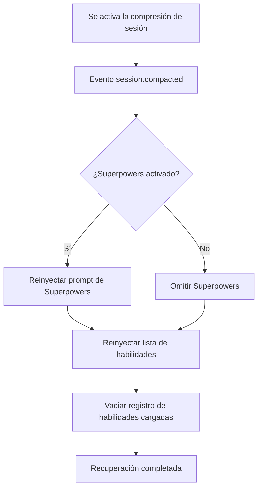

# Mecanismo de Recuperación por Compresión de Contexto

## Lo que podrás hacer después de aprender

- Entender cómo el complemento mantiene las habilidades disponibles después de la compresión de sesión
- Conocer los momentos de activación y el flujo de ejecución de la recuperación por compresión
- Poder verificar si la recuperación por compresión funciona correctamente
- Entender el papel de los mensajes sintéticos en el mecanismo de recuperación

## Tu situación actual

En sesiones largas, OpenCode ejecutará **Compresión de Contexto** para ahorrar tokens. Después de la compresión, la sesión solo conserva los mensajes más recientes, y el historial temprano (incluido el contenido de las habilidades inyectadas anteriormente) se eliminará.

Esto causa un problema: si el contenido de las habilidades se comprime, la IA ya no sabrá qué habilidades están disponibles y no podrá usar las habilidades cargadas.

## Cuándo usar esta técnica

El mecanismo de recuperación por compresión se ejecuta **automáticamente**, no necesitas intervención manual. Pero después de entender su principio, puedes solucionar problemas en los siguientes escenarios:

- La IA de repente "olvida" las habilidades en una sesión larga
- Necesitas depurar la disponibilidad de habilidades después de la compresión
- Quieres entender la estrategia de gestión de sesiones del complemento

## Idea central

### ¿Qué es la compresión de contexto?

A medida que aumenta la cantidad de mensajes, la sesión de OpenCode se vuelve más larga. Cuando el uso de tokens se acerca al límite, el sistema ejecutará automáticamente **compresión de contexto**:

```
[Inicio de sesión] → [Mensaje 1] → [Mensaje 2] → ... → [Mensaje 50]
                           ↑ Punto de compresión: solo conserva los 10 mensajes más recientes
```

Después de la compresión, los mensajes tempranos (incluido el contenido de inyección de habilidades) se eliminarán, y la IA solo podrá ver el historial de mensajes reciente.

### Cómo funciona el mecanismo de recuperación por compresión

El complemento escucha el evento `session.compacted`, y una vez que detecta que ocurrió la compresión, ejecuta inmediatamente las siguientes operaciones de recuperación:



**Puntos clave**:
- La recuperación es **automática**, no requiere activación manual
- La lista de habilidades recuperada incluye **todas las habilidades descubiertas** (no solo las cargadas anteriormente)
- El registro de habilidades cargadas se vaciará, permitiendo que la IA reevalúe qué habilidades necesita

### Rol de los mensajes sintéticos

El complemento usa el mecanismo de **Inyección de Mensajes Sintéticos** para inyectar contenido:

| Atributo | Valor | Significado |
|--- | --- | ---|
| `noReply` | `true` | La IA no responderá al contenido inyectado en sí mismo |
| `synthetic` | `true` | Marca como contenido generado por el sistema, no cuenta como entrada del usuario, no se muestra en la UI |

Esto significa que el contenido inyectado por la recuperación por compresión:
- Es completamente transparente para el usuario (no visible)
- No consume cuota de mensajes del usuario
- Pero será leído y entendido por la IA

## 🎒 Preparativos

Este tutorial requiere:
- Complemento OpenCode Agent Skills instalado
- Conocimiento básico de carga de habilidades
- Una sesión larga para probar el efecto de compresión

::: tip
No se requiere preparación adicional, el mecanismo de recuperación por compresión es una función incorporada del complemento.
:::

## Sígueme: Verifica el efecto de recuperación por compresión

### Paso 1: Inicia una nueva sesión

**Por qué**
Verificar que la lista de habilidades se inyecte normalmente durante la inicialización de la sesión

Inicia una nueva sesión e introduce cualquier mensaje:

```
Hola
```

**Deberías ver**: La IA responde normalmente, y en segundo plano inyecta automáticamente la lista de habilidades (invisible para el usuario)

### Paso 2: Carga una habilidad

**Por qué**
Asegurar que el contenido de la habilidad se inyecte en el contexto

Llama a la herramienta `use_skill`:

```
Usa get_available_skills para ver las habilidades disponibles, luego usa use_skill para cargar una de ellas
```

**Deberías ver**: La IA lista las habilidades disponibles, luego carga la habilidad que elegiste

### Paso 3: Activa la compresión de contexto

**Por qué**
Simular escenario de sesión larga, activar el mecanismo de compresión de OpenCode

Envía mensajes continuamente, simulando una conversación larga:

```
Mensaje 1: contenido de prueba
Mensaje 2: continuar probando
...
(Repetir enviando 20-30 mensajes)
```

**Deberías ver**:
- A medida que aumentan los mensajes, el historial de la sesión se alarga
- Al alcanzar cierta longitud, OpenCode ejecuta automáticamente la compresión
- Después de la compresión, los mensajes tempranos (incluida la inyección de habilidades) se eliminan

### Paso 4: Verifica el efecto de recuperación

**Por qué**
Verificar que la lista de habilidades se reinyecte después de la compresión

Después de la compresión, haz que la IA use habilidades nuevamente:

```
Ayúdame a usar la habilidad git-helper para crear una nueva rama (asumiendo que ya instalaste la habilidad git-helper)
```

**Deberías ver**:
- La IA aún sabe qué habilidades están disponibles (prueba que la lista de habilidades se ha recuperado)
- La IA puede cargar y usar habilidades normalmente (prueba que la funcionalidad de habilidades no se vio afectada por la compresión)

### Paso 5: Verifica la inyección de mensajes sintéticos

**Por qué**
Confirmar que el mecanismo de recuperación usa mensajes sintéticos, sin interferir con la conversación

Si el complemento lo admite, puedes verificar el historial de mensajes de la sesión (dependiendo de la funcionalidad de OpenCode):

```
Usa herramientas de depuración para ver el historial de mensajes de la sesión
```

**Deberías ver**:
- Los mensajes de la lista de habilidades recuperados están marcados como `synthetic: true`
- Estos mensajes no se muestran en la interfaz de conversación normal

## Punto de verificación ✅

Después de completar los pasos anteriores, deberías poder confirmar:

- [ ] La IA aún puede acceder a la lista de habilidades en sesiones largas
- [ ] La función de carga de habilidades funciona normalmente después de la compresión
- [ ] El proceso de recuperación es completamente transparente para el usuario

## Advertencias de problemas

### Problema 1: Después de la compresión, la IA dice "no encuentra habilidades"

**Posibles causas**:
- El complemento no está escuchando correctamente el evento `session.compacted`
- La ruta del directorio de habilidades ha cambiado

**Métodos de solución**:

1. **Verificar si se activa el evento de compresión**
   - A través de los pasos 3 y 4 de "Sígueme", confirma que la IA aún puede acceder a la lista de habilidades después de la compresión
   - Si la IA puede usar habilidades normalmente, significa que el mecanismo de recuperación por compresión funciona correctamente

2. **Verificar si el complemento está cargado correctamente**
   - Reinicia OpenCode
   - Después de iniciar una nueva sesión, haz que la IA liste las habilidades disponibles (`get_available_skills`)
   - Si puedes ver la lista de habilidades, significa que el complemento está cargado correctamente

### Problema 2: La lista de habilidades recuperada está vacía

**Posibles causas**:
- No hay habilidades en la ruta de descubrimiento de habilidades
- Formato de archivo de habilidades incorrecto

**Métodos de solución**:
```bash
# Consultar manualmente las habilidades disponibles
Usa get_available_skills para ver la lista de habilidades
```

Si devuelve una lista vacía, verifica el directorio de habilidades y el formato de los archivos.

### Problema 3: El estado de habilidades cargadas se pierde después de la compresión

**Este es un comportamiento esperado**, no es un Bug. El mecanismo de recuperación vaciará el registro `loadedSkillsPerSession`, permitiendo que la IA reevalúe qué habilidades necesita.

**Método de solución**: La IA decidirá automáticamente si recargar las habilidades según el contexto, sin intervención manual.

## Resumen de esta lección

El mecanismo de recuperación por compresión asegura la disponibilidad de habilidades en sesiones largas de las siguientes formas:

1. **Escuchar eventos de compresión**: Detectar automáticamente el evento `session.compacted`
2. **Reinyectar lista de habilidades**: Inyectar todas las habilidades usando la etiqueta `<available-skills>`
3. **Recuperación opcional de Superpowers**: Si está activado, restaurar simultáneamente el prompt de Superpowers
4. **Usar mensajes sintéticos**: El proceso de recuperación es transparente para el usuario, no afecta la conversación
5. **Restablecer registro cargado**: Vaciar el conjunto de habilidades cargadas, permitir reevaluación

Este mecanismo asegura que:
- Las habilidades siempre estén disponibles en sesiones largas
- El proceso de recuperación sea automático y sin percepción
- La IA pueda decidir qué habilidades usar según el contexto más reciente

## Próxima lección

> En la próxima lección aprenderemos **[Solución de problemas](../../faq/troubleshooting/)**.
>
> Aprenderás:
> - Métodos para manejar errores y excepciones comunes
> - Técnicas de solución de problemas relacionadas con la recuperación por compresión
> - Soluciones para otros problemas de uso

---

## Apéndice: Referencia de código fuente

<details>
<summary><strong>Haz clic para expandir y ver la ubicación del código fuente</strong></summary>

> Fecha de actualización: 2026-01-24

| Funcionalidad        | Ruta de archivo                                                                                    | Líneas    |
|--- | --- | ---|
| Escucha de evento de compresión | [`src/plugin.ts`](https://github.com/joshuadavidthomas/opencode-agent-skills/blob/main/src/plugin.ts#L144-L157) | 144-157 |
| Inicialización de primer mensaje | [`src/plugin.ts`](https://github.com/joshuadavidthomas/opencode-agent-skills/blob/main/src/plugin.ts#L70-L105) | 70-105 |
| Inyección de lista de habilidades | [`src/skills.ts`](https://github.com/joshuadavidthomas/opencode-agent-skills/blob/main/src/skills.ts#L345-L370) | 345-370 |
| Inyección de mensajes sintéticos | [`src/utils.ts`](https://github.com/joshuadavidthomas/opencode-agent-skills/blob/main/src/utils.ts#L147-L162) | 147-162 |
| Gestión de estado de sesión | [`src/plugin.ts`](https://github.com/joshuadavidthomas/opencode-agent-skills/blob/main/src/plugin.ts#L25-L35) | 25-35 |

**Variables clave**:
- `setupCompleteSessions: Set<string>`: Registra los IDs de sesión que completaron la inicialización
- `loadedSkillsPerSession: Map<string, Set<string>>`: Registra los nombres de habilidades cargadas para cada sesión

**Funciones clave**:
- `injectSkillsList()`: Inyecta la lista de habilidades disponibles en la sesión
- `injectSyntheticContent()`: Inyecta contenido usando mensajes sintéticos
- `getSessionContext()`: Obtiene información de modelo y agente de la sesión

</details>
