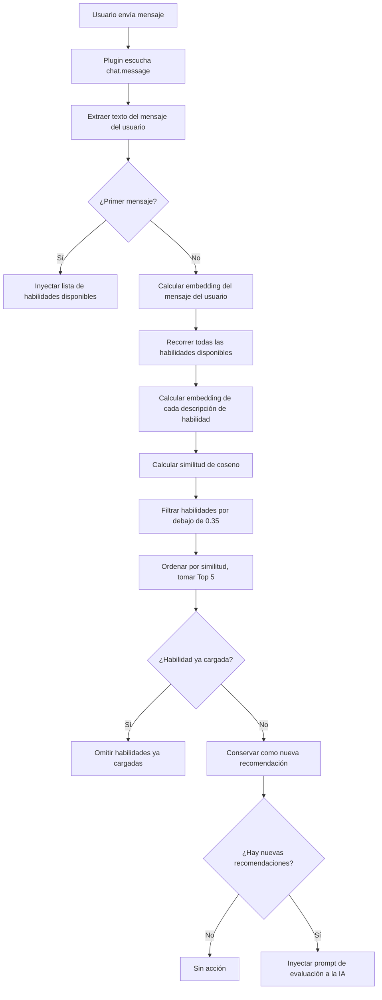

# Recomendación Automática de Habilidades: Principio de Coincidencia Semántica

## Lo Que Aprenderás

- Comprender cómo el plugin identifica automáticamente las habilidades que podrías necesitar
- Dominar los principios básicos del cálculo de similitud semántica
- Saber cómo optimizar las descripciones de habilidades para obtener mejores resultados de recomendación
- Entender cómo el mecanismo de caché de embeddings mejora el rendimiento

## Tu Problema Actual

OpenCode Agent Skills tiene muchas habilidades, pero tú:

- **No recuerdas los nombres de las habilidades** - Es fácil confundirse cuando hay demasiadas
- **No sabes cuál usar** - Es difícil elegir entre habilidades con funciones similares
- **Te preocupa pasar por alto habilidades útiles** - No estás seguro de si hay herramientas más adecuadas

Cada vez tienes que llamar primero a `get_available_skills` para ver la lista y luego cargar manualmente las habilidades adecuadas, lo cual es tedioso e interrumpe tu flujo de pensamiento.

## Cuándo Usar Esta Técnica

La recomendación automática de habilidades es adecuada para los siguientes escenarios:

- **Etapa de principiante** - No estás familiarizado con la biblioteca de habilidades y necesitas ayuda de la IA para identificarlas
- **Tareas de desarrollo de funciones** - Como "crear una API REST", "implementar un sistema de autenticación", etc., que generalmente corresponden a habilidades especializadas
- **Trabajo multidisciplinario** - Contactas ocasionalmente con campos desconocidos y dependes de las recomendaciones de la IA
- **Cuando la biblioteca de habilidades es grande** - Cuando hay más de 10 habilidades, la búsqueda manual es ineficiente

::: tip Truco
La recomendación automática no te obliga a cargar habilidades, simplemente solicita a la IA que evalúe si son necesarias. Puedes aceptar o ignorar las sugerencias libremente.
:::

## Idea Principal

### ¿Qué es la Coincidencia Semántica?

La coincidencia semántica es una técnica para **comprender la intención del usuario** que no depende de la coincidencia de palabras clave, sino que calcula la **similitud semántica** del texto.

Un ejemplo:

| Entrada del usuario | Descripción de la habilidad | Coincidencia de palabras clave | Coincidencia semántica |
| --- | --- | --- | --- |
| "Crear un pool de conexiones de base de datos" | "Herramienta de gestión y optimización de conexiones de base de datos" | ❌ | ✅ |
| "Ayúdame a escribir documentación de API" | "Generador automático de documentación de API" | ✅ | ✅ |
| "Andamio de inicialización de proyecto" | "Herramienta para construir rápidamente la estructura del proyecto" | ❌ | ✅ |

La coincidencia de palabras clave solo mira si las palabras son literalmente iguales, mientras que la coincidencia semántica puede entender que "crear", "generar" y "construir" son acciones del mismo tipo.

### Embedding: Convertir Texto en Números

Para que la computadora entienda la semántica, el plugin utiliza **modelos de embedding** para convertir el texto en **vectores** (una serie de números).

```
Texto: "Crear un pool de conexiones de base de datos"
    ↓ [Modelo Xenova/all-MiniLM-L6-v2]
Vector: [0.12, -0.34, 0.67, ...]  (384 dimensiones, dimensión de salida del modelo)
```

En este espacio vectorial:

- **Textos semánticamente similares** → distancias de vector más cercanas
- **Textos semánticamente diferentes** → distancias de vector más lejanas

::: info ¿Por qué elegir all-MiniLM-L6-v2?
Este modelo tiene 3 ventajas:
1. **Pequeño tamaño** - El archivo del modelo es de aproximadamente 23 MB (nivel de cuantización q8), descarga rápida
2. **Alta velocidad** - Soporta cuantización, baja latencia de inferencia
3. **Alta precisión** - Rendimiento excelente en tareas de similitud semántica
:::

### Similitud de Coseno: Medir el Grado de Similitud de Vectores

El plugin utiliza **similitud de coseno** (Cosine Similarity) para calcular la similitud entre dos vectores.

Fórmula:
```
similarity = (A · B) / (|A| × |B|)
```

Donde:
- `A · B` es el producto punto de los vectores
- `|A|` es la magnitud del vector A
- `|B|` es la magnitud del vector B

**Rango de resultados**: `-1` a `1`

| Rango de similitud | Significado | ¿Recomendar? |
| --- | --- | --- |
| 0.7-1.0 | Muy similar, casi el mismo significado | ✅ Altamente recomendado |
| 0.35-0.7 | Alguna relación, vale la pena considerar | ✅ Recomendado |
| 0.0-0.35 | Baja relación o sin relación | ❌ No recomendado |
| -1.0-0.0 | Significado opuesto | ❌ No recomendado |

::: warning Nota
El umbral actual es **0.35**, las habilidades con puntuaciones por debajo de este valor no aparecerán en la lista de recomendaciones.
:::

## Flujo de Recomendación Automática

### Diagrama de Flujo Completo



### Etapa 1: Primer Mensaje - Inyectar Lista de Habilidades

Cuando la sesión recibe el primer mensaje, el plugin:

1. Escanea todos los directorios de habilidades
2. Inyecta la lista de habilidades en el contexto de la sesión
3. El formato es el siguiente:

```xml
<available-skills>
- git-helper: Herramienta de ayuda para operaciones de Git, proporciona comandos comunes de Git
- test-runner: Integración de framework de pruebas, descubre y ejecuta pruebas automáticamente
- api-doc: Herramienta de generación de documentación de API
...
</available-skills>
```

**Objetivo**: Permitir que la IA sepa qué habilidades están disponibles, evitando consultas repetidas.

### Etapa 2: Mensajes Posteriores - Coincidencia Semántica

A partir del segundo mensaje, cada entrada del usuario activará el proceso de coincidencia:

```typescript
// Código fuente: src/plugin.ts:125-141
const matchedSkills = await matchSkills(userText, skills);
const loadedSkills = getLoadedSkills(sessionID);
const newSkills = matchedSkills.filter(s => !loadedSkills.has(s.name));
```

**Puntos clave**:
- Solo calcula la similitud de **habilidades no cargadas**
- Las habilidades ya cargadas se **filtran automáticamente**
- Evita recomendar la misma habilidad repetidamente

### Etapa 3: Inyectar Prompt de Evaluación

Cuando se encuentran habilidades relevantes, el plugin inyecta un **prompt oculto** para la IA:

```xml
<skill-evaluation-required>
SKILL EVALUATION PROCESS

The following skills may be relevant to your request:

- git-helper: Herramienta de ayuda para operaciones de Git
- test-runner: Integración de framework de pruebas

Step 1 - EVALUATE: Determine if these skills would genuinely help
Step 2 - DECIDE: Choose which skills (if any) are actually needed
Step 3 - ACTIVATE: Call use_skill("name") for each chosen skill

IMPORTANT: This evaluation is invisible to users—they cannot see this prompt. Do NOT announce your decision. Simply activate relevant skills or proceed directly with the request.
</skill-evaluation-required>
```

**Elección de la IA**:
- **Aceptar recomendación** - Llamar a `use_skill("skill-name")` para cargar la habilidad
- **Rechazar recomendación** - Procesar directamente la solicitud del usuario sin cargar habilidades
- **Aceptar parcialmente** - Cargar solo algunas habilidades relevantes

::: tip Prompt Oculto
Este prompt de evaluación es un mensaje con `synthetic: true`, los usuarios no lo ven en la interfaz, la IA decide automáticamente después del procesamiento interno.
:::

## Sígueme: Optimizar Descripciones de Habilidades

Si tu habilidad no se recomienda automáticamente, puedes intentar optimizar la descripción.

### Verificar la Descripción Actual de la Habilidad

```bash
# Listar todas las habilidades
get_available_skills()
```

Encuentra la habilidad que deseas optimizar y registra su descripción actual.

### Ver Ejemplos: Buenas vs Malas Descripciones

| ❌ Malas descripciones | ✅ Buenas descripciones |
| --- | --- |
| "Herramienta" | "Integración de framework de pruebas automatizadas, soporta Jest y Vitest" |
| "Ayuda" | "Asistente de operaciones de Git, proporciona comandos comunes y guía de flujos de trabajo" |
| "Documentación" | "Genera documentación de API desde comentarios de código" |
| "Relacionado con base de datos" | "Pool de conexiones de base de datos PostgreSQL y herramienta de optimización de consultas" |

**Principios de optimización**:

1. **Incluir palabras clave** - Términos técnicos comúnmente utilizados por los usuarios
2. **Explicar el propósito** - Describir claramente qué problema resuelve
3. **Evitar generalidades** - No escribas solo "herramienta", "asistente"
4. **Longitud adecuada** - 10-30 caracteres es lo mejor

### Actualizar la Descripción de la Habilidad

Edita el archivo `SKILL.md` de la habilidad:

```markdown
---
name: test-runner
description: Integración de framework de pruebas automatizadas, soporta Jest y Vitest, descubre y ejecuta pruebas automáticamente
---

# Test Runner

Esta habilidad te ayuda a configurar un framework de pruebas en tu proyecto...
```

**Efecto automático**: En la siguiente sesión, el plugin recalculará el embedding, y la nueva descripción tendrá efecto de inmediato.

## Punto de Control ✅

### Verificar si Funciona la Recomendación Automática

1. **Crear una habilidad de prueba**:

```bash
# Crear habilidad de prueba en el directorio .opencode/skills/
mkdir -p .opencode/skills/example-skill
cat > .opencode/skills/example-skill/SKILL.md << 'EOF'
---
name: example-skill
description: Ayuda a los usuarios a crear y configurar proyectos de TypeScript
---

# Example Skill

Esta es una habilidad de prueba...
EOF
```

2. **Enviar un mensaje relacionado**:

En OpenCode, escribe:

```
Voy a inicializar un proyecto de TypeScript
```

3. **Verificar si se activa la recomendación**:

Abre las herramientas de desarrollador o verifica el registro de llamadas a herramientas de la IA:
- **Éxito** - La IA llamó a `use_skill("example-skill")`
- **Fallo** - No hay recomendaciones relacionadas, verifica si la descripción es demasiado general

### Verificar que las Habilidades Cargadas no se Recomiendan Repetidamente

1. **Cargar manualmente la habilidad**:

```bash
use_skill("example-skill")
```

2. **Enviar nuevamente un mensaje relacionado**:

```
Voy a inicializar otro proyecto de TypeScript
```

3. **Confirmar que no se recomienda**:

El sistema **no debería** inyectar el prompt de evaluación porque la habilidad ya está cargada.

## Advertencias de Problemas Comunes

### Problema 1: Las Habilidades Recomendadas no son Relevantes en Absoluto

**Síntomas**:
- El usuario dice "cómo desplegar en AWS" pero se recomienda "herramienta de pruebas locales"
- La puntuación de similitud es alta pero la semántica es completamente incorrecta

**Causas**:
- La descripción de la habilidad es demasiado general, como "herramienta de servicios en la nube"
- El modelo de embedding tiene una desviación en la comprensión de ciertos términos técnicos

**Soluciones**:

1. **Hacer la descripción más específica**:

```markdown
# ❌ Mal
description: Herramienta de despliegue en la nube

# ✅ Bien
description: Herramienta de despliegue en AWS EC2, configura automáticamente balanceador de carga y autoescalado
```

2. **Incluir palabras clave de tecnologías principales**:

```markdown
description: Herramienta de carga de archivos AWS S3 y distribución CDN, soporta CloudFront
```

### Problema 2: Las Habilidades Útiles no se Recomiendan

**Síntomas**:
- Tu entrada coincide claramente con una habilidad, pero el sistema no la recomienda
- Necesitas llamar manualmente a `get_available_skills()` para buscar

**Causas**:
- La similitud está por debajo del umbral de 0.35
- La descripción de la habilidad tiene una gran diferencia con las palabras que el usuario suele usar

**Soluciones**:

1. **Reducir el umbral** (modificación del código fuente):

```typescript
// src/embeddings.ts:10
const SIMILARITY_THRESHOLD = 0.30; // Reducir de 0.35 a 0.30
```

::: warning Cuidado en Producción
Reducir el umbral aumentará las recomendaciones incorrectas (habilidades no relacionadas), se recomienda probar antes de ajustar.
:::

2. **Aumentar Top K**:

```typescript
// src/embeddings.ts:11
const TOP_K = 10; // Aumentar de 5 a 10
```

3. **Optimizar la descripción de la habilidad**, consulte la sección "Optimizar Descripciones de Habilidades" arriba.

### Problema 3: Primera Carga Lenta

**Síntomas**:
- En el primer uso, la recomendación de habilidades tiene un retraso de 2-3 segundos
- Uso posterior normal

**Causas**:
- El modelo de embedding necesita descargarse de la red (23 MB)
- Se requiere calcular los embeddings de todas las habilidades por primera vez

**Soluciones**:

El plugin tiene un **mecanismo de caché**, después de la primera vez se optimiza automáticamente:

```
Ruta de caché: ~/.cache/opencode-agent-skills/embeddings/
```

**Verificar archivos de caché**:

```bash
ls -lh ~/.cache/opencode-agent-skills/embeddings/
```

Verás archivos `.bin`, cada archivo es un caché de embedding (nombrado por SHA256 del contenido).

**Precalentar manualmente el caché**:

```bash
# Reiniciar OpenCode
# Al iniciar el plugin llamará a precomputeSkillEmbeddings()
```

Ubicación del código fuente: `src/embeddings.ts:96-102`

```typescript
export async function precomputeSkillEmbeddings(skills: SkillSummary[]): Promise<void> {
  await Promise.all(
    skills.map(skill =>
      getEmbedding(skill.description).catch(() => { })
    )
  );
}
```

**No te preocupes**: Mientras no modifiques la descripción de la habilidad, el caché es válido permanentemente.

## Resumen del Capítulo

La recomendación automática de habilidades mejora la experiencia de las siguientes maneras:

| Técnica | Función | Mejora en la experiencia del usuario |
| --- | --- | --- |
| Modelo de Embedding | Convierte texto en vectores | Entiende la semántica, no solo palabras clave |
| Similitud de Coseno | Calcula similitud de vectores | Coincide con precisión habilidades relevantes |
| Mecanismo de Caché | Almacena embeddings en disco | Respuesta más rápida después de la primera vez |
| Evaluación Inteligente | Permite que la IA juzgue si necesita habilidades | No es obligatorio, evita interferencias |
| Filtrado de Cargados | Omite habilidades ya cargadas | Evita recomendaciones duplicadas |

**Ventajas principales**:

- **Sin memorizar** - No necesitas recordar los nombres de las habilidades
- **Identificación inteligente** - La IA descubre automáticamente las herramientas que necesitas
- **Sin interrupciones** - El prompt está oculto, los usuarios no lo notan

---

## Próximo Capítulo

> En el próximo capítulo aprenderemos **[Ejecutar Scripts de Habilidades](../executing-skill-scripts/)**.
>
> Las habilidades no son solo documentos, también pueden contener scripts automatizados. Aprenderás:
> - Cómo organizar scripts ejecutables en el directorio de habilidades
> - Usar la herramienta `run_skill_script` para ejecutar scripts
> - Permisos de scripts y restricciones de seguridad
> - Casos de uso comunes de scripts (construcción, pruebas, despliegue, etc.)


---

## Apéndice: Referencia del Código Fuente

<details>
<summary><strong>Haz clic para expandir y ver las ubicaciones del código fuente</strong></summary>

> Última actualización: 2026-01-24

| Función | Ruta del archivo | Líneas |
| --- | --- | --- |
| Función principal de coincidencia semántica | [`src/embeddings.ts`](https://github.com/joshuadavidthomas/opencode-agent-skills/blob/main/src/embeddings.ts#L108-L135) | 108-135 |
| Generar embedding de texto | [`src/embeddings.ts`](https://github.com/joshuadavidthomas/opencode-agent-skills/blob/main/src/embeddings.ts#L38-L66) | 38-66 |
| Calcular similitud de coseno | [`src/embeddings.ts`](https://github.com/joshuadavidthomas/opencode-agent-skills/blob/main/src/embeddings.ts#L71-L90) | 71-90 |
| Precalcular embeddings de habilidades | [`src/embeddings.ts`](https://github.com/joshuadavidthomas/opencode-agent-skills/blob/main/src/embeddings.ts#L96-L102) | 96-102 |
| Formatear prompt de resultados coincidentes | [`src/plugin.ts`](https://github.com/joshuadavidthomas/opencode-agent-skills/blob/main/src/plugin.ts#L37-L57) | 37-57 |
| Lógica del proceso de coincidencia automática | [`src/plugin.ts`](https://github.com/joshuadavidthomas/opencode-agent-skills/blob/main/src/plugin.ts#L125-L141) | 125-141 |
| Manejo de eventos de escucha de mensajes | [`src/plugin.ts`](https://github.com/joshuadavidthomas/opencode-agent-skills/blob/main/src/plugin.ts#L66-L142) | 66-142 |

**Constantes clave**:

| Nombre de constante | Valor | Descripción | Fuente |
| --- | --- | --- | --- |
| MODEL_NAME | Xenova/all-MiniLM-L6-v2 | Modelo de embedding utilizado | `embeddings.ts:8` |
| QUANTIZATION | q8 | Nivel de cuantización del modelo | `embeddings.ts:9` |
| SIMILARITY_THRESHOLD | 0.35 | Umbral de recomendación de similitud | `embeddings.ts:10` |
| TOP_K | 5 | Número de habilidades Top K devueltas | `embeddings.ts:11` |

**Funciones clave**:

- `matchSkills()`: Calcula la similitud semántica entre el mensaje del usuario y las descripciones de habilidades, devuelve la lista de habilidades más relevantes
- `getEmbedding()`: Genera el vector de embedding del texto, soporta caché en disco
- `cosineSimilarity()`: Calcula la similitud de coseno entre dos vectores
- `precomputeSkillEmbeddings()`: Precalcula los embeddings de todas las habilidades al iniciar el plugin, acelera las coincidencias posteriores
- `formatMatchedSkillsInjection()`: Formatea los resultados coincidentes como prompt de evaluación, inyectándolos a la IA

**Mecanismo de caché**:

Ruta de caché de embeddings:
- Linux/macOS: `~/.cache/opencode-agent-skills/embeddings/`
- Personalizable: modificar a través de la variable de entorno `XDG_CACHE_HOME`

Los archivos de caché se nombran por el SHA256 del contenido, como `a1b2c3d4.bin`, cada archivo contiene un vector Float32Array.

</details>
